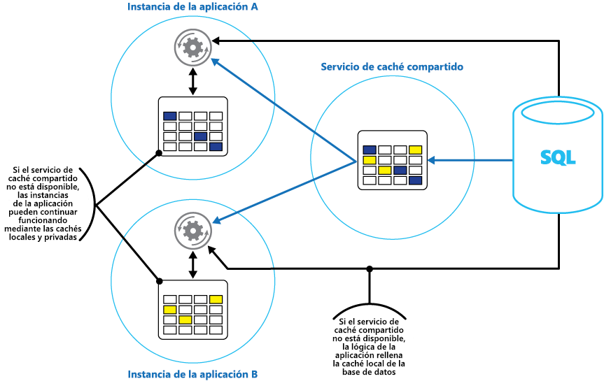

# <a name="caching"></a>Almacenamiento en caché

El almacenamiento en caché es una técnica que tiene como objetivo mejorar el rendimiento y la escalabilidad de un sistema. Para ello, se copian temporalmente los datos a los que se accede con mayor frecuencia en almacenamiento rápido ubicado cerca de la aplicación. Si este almacenamiento de datos rápido se encuentra más cerca de la aplicación que el primer origen, el almacenamiento en caché puede mejorar considerablemente los tiempos de respuesta de las aplicaciones cliente dado que los datos se sirven con mayor rapidez.

El almacenamiento en caché es más eficaz cuando una instancia de cliente lee de forma repetida los mismos datos, en especial si todas las condiciones siguientes se aplican al almacén de datos original:

* Permanece relativamente estático.
* Es lento en comparación con la velocidad de la caché.
* Está sujeto a un alto nivel de contención.
* Está lejos cuando la latencia de red puede provocar que el acceso sea lento.

## <a name="caching-in-distributed-applications"></a>Almacenamiento en caché en aplicaciones distribuidas
Las aplicaciones distribuidas normalmente implementan ambas de las siguientes estrategias, o una de ellas, al almacenar datos en caché:

* Mediante una caché privada, donde los datos se guardan localmente en el equipo que ejecuta una instancia de una aplicación o un servicio.
* Mediante una caché compartida, que actúa como un origen común al que se puede acceder mediante varios procesos y/o máquinas.

En ambos casos, el almacenamiento en caché puede realizarse en el lado cliente o servidor. El almacenamiento en caché en el lado cliente se realiza mediante el proceso que proporciona la interfaz de usuario de un sistema, como un explorador web o una aplicación de escritorio.
El almacenamiento en caché en el lado servidor se realiza mediante el proceso que proporciona los servicios de negocios que se ejecutan de forma remota.

### <a name="private-caching"></a>Almacenamiento en caché privado
El tipo más básico de caché es un almacén en memoria. Está contenido en el espacio de direcciones de un solo proceso y se accede directamente a él mediante el código que se ejecuta en ese proceso. Este tipo de caché es de acceso muy rápido. También proporciona un medio extremadamente efectivo de almacenar cantidades modestas de datos estáticos, dado que el tamaño de una caché suele estar restringido por el volumen de memoria disponible en la máquina que hospeda el proceso.

Si necesita almacenar en caché más información de lo que es posible físicamente en la memoria, puede escribir datos en caché en el sistema de archivos local. El acceso será más lento que cuando los datos están contenidos en memoria, pero aún así debería ser más rápido y confiable que recuperar los datos a través de una red.

Si tiene varias instancias de una aplicación que usa este modelo de ejecución simultánea, cada instancia de la aplicación tendrá su propia caché independiente con su propia copia de los datos.

Una caché se puede considerar como una instantánea de los datos originales en algún momento del pasado. Si estos datos no son estáticos, es probable que las diferentes instancias de aplicación contengan versiones diferentes de los datos en sus cachés. Por lo tanto, la misma consulta realizada por estas instancias podría devolver resultados diferentes, como se muestra en la Figura 1.


*Figura 1: Uso de una memoria caché en instancias diferentes de una aplicación*

### <a name="shared-caching"></a>Almacenamiento en caché compartido
El uso de una caché compartida puede ayudar a aliviar la preocupación de que los datos puedan ser diferentes en cada caché, como podría ocurrir con el almacenamiento en caché en memoria. El almacenamiento en caché compartido garantiza que diferentes instancias de una aplicación ven la misma vista de datos en caché. Para ello, se ubica la caché en una ubicación aparte, normalmente hospedada como parte de un servicio independiente, como se muestra en la Figura 2.


*Figura 2: Uso de una memoria caché compartida*

Una ventaja importante del enfoque de almacenamiento en caché compartido es la escalabilidad que proporciona. Muchos servicios de memoria caché compartida se implementan mediante un clúster de servidores y utilizan software que distribuye los datos en el clúster de forma transparente. Una instancia de aplicación simplemente envía una solicitud al servicio de caché.
La infraestructura subyacente es responsable de determinar la ubicación de los datos en caché en el clúster. Puede escalar fácilmente la memoria caché al agregar más servidores.

Dos son las desventajas principales del enfoque de almacenamiento en caché compartido:

* La caché es de acceso más lento porque ya no está contenida localmente en cada instancia de aplicación.
* La necesidad de implementar un servicio de caché independiente puede agregar complejidad a la solución.

## <a name="considerations-for-using-caching"></a>Consideraciones para usar el almacenamiento en caché
En las secciones siguientes se describe con más detalle las consideraciones para diseñar y usar una memoria caché.

### <a name="decide-when-to-cache-data"></a>Decidir cuándo almacenar en caché los datos
El almacenamiento en caché puede mejorar considerablemente el rendimiento, la escalabilidad y la disponibilidad. Cuantos más datos tenga y mayor sea el número de usuarios que necesitan tener acceso a ellos, mayores son cada vez las ventajas del almacenamiento en caché. El motivo es que el almacenamiento en caché reduce la latencia y la contención asociadas con el tratamiento de grandes volúmenes de solicitudes simultáneas en el almacén de datos original.

Por ejemplo, una base de datos puede admitir un número limitado de conexiones simultáneas. La recuperación de datos de una caché compartida, sin embargo, en lugar de la base de datos subyacente, permite que una aplicación cliente acceda a estos datos incluso si el número de conexiones disponibles está actualmente agotado. Además, si la base de datos deja de estar disponible, es posible que las aplicaciones cliente continúen usando los datos contenidos en la caché.

Considere la posibilidad de almacenar en caché los datos que se leen con frecuencia, pero que se modifican con poca frecuencia (por ejemplo, los datos que tienen una proporción de operaciones de lectura más alta que de escritura). Sin embargo, no se recomienda usar la caché como almacén autoritativo de la información crítica. En su lugar, asegúrese de que todos los cambios que la aplicación no puede permitirse perder siempre se guarden en un almacén de datos persistente. De esta manera, si la caché no está disponible, su aplicación podrá continuar funcionando usando el almacén de datos y no perderá información importante.

### <a name="determine-how-to-cache-data-effectively"></a>Determinar cómo almacenar en caché los datos de forma efectiva
La clave para usar de forma eficaz una memoria caché reside en la determinación de los datos más adecuados para la caché y de su almacenamiento en caché en el momento adecuado. Los datos pueden agregarse a la caché a petición la primera vez que los recupera una aplicación. Esto significa que la aplicación debe capturar los datos una sola vez del almacén de datos y que el posterior acceso se puede satisfacer mediante la caché.

O bien, una caché se puede rellenar total o parcialmente con datos de antemano, normalmente cuando se inicia la aplicación (un método conocido como inicialización). Sin embargo, es posible que no sea aconsejable implementar la inicialización para una caché de gran tamaño ya que este enfoque puede imponer una carga alta y repentina en el almacén de datos original cuando la aplicación comienza a ejecutarse.

A menudo, un análisis de los patrones de uso puede ayudarle a decidir si desea rellenar previamente total o parcialmente una caché, así como a elegir los datos que se almacenarán en caché. Por ejemplo, puede ser útil propagar la caché con los datos de perfil de usuario estáticos para los clientes que usan la aplicación con regularidad (quizá todos los días), pero no para los clientes que usan la aplicación solo una vez a la semana.

El almacenamiento en caché funciona normalmente bien con datos inmutables o que cambian con poca frecuencia. Entre los ejemplos se incluye información de referencia, como la información de precios y productos en una aplicación de comercio electrónico, o recursos estáticos compartidos que son costosos de construir. Algunos de estos datos, o todos ellos, pueden cargarse en la memoria caché al iniciarse la aplicación para minimizar la demanda de recursos y mejorar el rendimiento. Puede que también sea adecuado contar con un proceso en segundo plano que actualice periódicamente los datos de referencia en la caché para asegurarse de que está actualizada, o que actualice la caché cuando cambien los datos de referencia.

El almacenamiento es ser menos útil para los datos dinámicos, aunque hay algunas excepciones a esta consideración (para más información, consulte la sección Almacenar en caché los datos altamente dinámicos más adelante en este artículo). Cuando los datos originales cambian con frecuencia, la información almacenada en caché se vuelve obsoleta muy rápidamente o la sobrecarga de sincronización de la caché con el almacén de datos original reduce la efectividad del almacenamiento en caché.

Tenga en cuenta que una memoria caché no tiene que incluir los datos completos para una entidad. Por ejemplo, si un elemento de datos representa un objeto con múltiples valores como un cliente de banco con un nombre, una dirección y un saldo de cuenta, algunos de estos elementos pueden permanecer estáticos (el nombre y la dirección), mientras que otros (como el saldo de la cuenta) pueden ser más dinámicos. En estas situaciones, puede ser útil almacenar en caché las partes estáticas de los datos y recuperar solo (o calcular) la información restante cuando sea necesario.

Se recomienda llevar a cabo pruebas de rendimiento y análisis de uso para determinar si es adecuado el rellenado previo o la carga a petición de la caché, o una combinación de ambos. La decisión debe basarse en la volatilidad y el patrón de uso de los datos. El análisis de rendimiento y el uso de la memoria caché es especialmente importante en las aplicaciones que encuentran cargas pesadas y deben ser altamente escalables. Por ejemplo, en escenarios muy escalables, puede tener sentido inicializar la caché para reducir la carga en el almacén de datos en las horas punta.

El almacenamiento en caché también se puede usar para evitar repetir cálculos mientras se ejecuta la aplicación. Si una operación transforma datos o realiza un cálculo complicado, puede guardar los resultados de la operación en la memoria caché. Si se requiere el mismo cálculo posteriormente, la aplicación puede recuperar simplemente los resultados de la caché.

Una aplicación puede modificar los datos contenidos en una caché. Sin embargo, se recomienda considerar la caché como un almacén de datos transitorios que podrían desaparecer en cualquier momento. No almacene datos valiosos solo en la caché; asegúrese de mantener también la información en el almacén de datos original. Así si la caché deja de estar disponible, se reduce la posibilidad de pérdida de datos.

### <a name="cache-highly-dynamic-data"></a>Almacenar en caché los datos altamente dinámicos
Al almacenar la información que cambia rápidamente en un almacén de datos persistente, se puede imponer una sobrecarga en el sistema. Por ejemplo, un dispositivo que informa continuamente del estado o de alguna otra medida. Si una aplicación decide no almacenar en caché estos datos según la base de que la información almacenada en caché casi siempre quedará obsoleta, la misma consideración podría ser verdadera al almacenar y recuperar esta información desde el almacén de datos. En el tiempo en que se tarda en guardar y capturar estos datos, podrían haber cambiado.

En una situación como ésta, considere las ventajas de almacenar la información dinámica directamente en la caché en lugar de en el almacén de datos persistente. Si los datos no son críticos y no es necesario auditarlos, no importa si se pierde el cambio ocasional.

### <a name="manage-data-expiration-in-a-cache"></a>Administrar la expiración de los datos en una caché
En la mayoría de los casos, los datos contenidos en una caché son una copia de los datos que se encuentran en el almacén de datos original. Los datos del almacén de datos original pueden cambiar después de haberse almacenado en caché, lo que hace que los datos almacenados en memoria caché se vuelvan obsoletos. Muchos sistemas de almacenamiento en caché le habilitan para configurar la memoria caché para expirar datos y reducir el período para el que los datos pueden estar desfasados.

Cuando los datos almacenados en caché expiran, se quitan de la caché y la aplicación debe recuperar los datos del almacén de datos original (se puede volver a colocar la información recién capturada en la caché). Puede establecer una directiva de expiración predeterminada al configurar la memoria caché. En muchos de los servicios de caché, también puede estipular el período de expiración de objetos individuales cuando los almacena mediante programación en la caché.
Algunas cachés permiten especificar el período de expiración como un valor absoluto o como un valor variable que hace que el elemento se elimine de la caché si no se accede a él dentro del tiempo especificado. Esta configuración invalida cualquier directiva de expiración de toda la memoria caché, pero solo para los objetos especificados.

> [!NOTE]
> Considere detenidamente el período de expiración de la memoria caché y los objetos que contiene. Si hace que sea demasiado breve, los objetos expirarán con demasiada rapidez y reducirá las ventajas del uso de la memoria caché. Si hace que el periodo sea demasiado largo, se arriesgan a que los datos se vuelvan obsoletos.
> 
> 

También es posible que la caché se rellene si se permite que los datos permanezcan residentes durante mucho tiempo. En este caso, las solicitudes para agregar nuevos elementos a la caché podrían provocar que se forzara la eliminación de algunos elementos en un proceso conocido como expulsión. Los servicios de caché normalmente expulsan los datos menos usados recientemente (LRU), pero normalmente puede invalidar esta directiva y evitar que se expulsen los elementos. Sin embargo, si adopta este enfoque, se arriesga a que se supere la memoria que está disponible en la caché. Una aplicación que intente agregar un elemento a la caché producirá una excepción.

Algunas implementaciones de almacenamiento en caché podrían proporcionar directivas de expulsión adicionales. Hay varios tipos de directivas de expulsión. Entre ellas se incluyen las siguientes:

* Una directiva de usados más recientemente (en la expectativa de que los datos no volverán a ser necesarios).
* Una directiva de primero en entrar primero en salir (los datos más antiguos se expulsan primero).
* Una directiva de eliminación explícita basada en un evento desencadenado (como los datos que se va a modificar).

### <a name="invalidate-data-in-a-client-side-cache"></a>Invalidar los datos en una caché del lado cliente
Por lo general, se considera que los datos que se almacenan en una caché del lado cliente quedan fuera de la protección del servicio que proporciona los datos al cliente. Un servicio no puede forzar directamente a un cliente a agregar o quitar información de una caché del lado cliente.

Esto significa que es posible que un cliente que utiliza una caché mal configurada pueda seguir usando información obsoleta. Por ejemplo, si las directivas de expiración de la caché no están correctamente implementadas, un cliente podría usar información obsoleta almacenada en caché localmente cuando la información del origen de datos original haya cambiado.

Si va a crear una aplicación web que sirve datos mediante una conexión HTTP, puede forzar implícitamente a un cliente web (por ejemplo, un explorador o un proxy web) a capturar la información más reciente. Puede hacer esto si un recurso se actualiza debido a un cambio en el URI de ese recurso. Los clientes web usan normalmente el URI de un recurso como clave de la caché del lado cliente, por lo que si el URI cambia, el cliente web ignora las versiones de un recurso almacenadas en caché anteriormente y captura la nueva versión en su lugar.

## <a name="managing-concurrency-in-a-cache"></a>Administración de la simultaneidad en una memoria caché
Las memorias caché a menudo están diseñadas para ser compartidas por varias instancias de una aplicación. Cada instancia de aplicación puede leer y modificar los datos de la memoria caché. Por consiguiente, los mismos problemas de simultaneidad que surgen con cualquier almacén de datos compartidos también son aplicables a una caché. En una situación donde una aplicación necesite modificar los datos contenidos en la caché, puede que deba asegurarse de que las actualizaciones realizadas por una instancia de la aplicación no sobrescriben los cambios realizados por otra instancia.

En función de la naturaleza de los datos y de la probabilidad de las colisiones, puede adoptar uno de dos enfoques para simultaneidad:

* **Optimista.** Inmediatamente antes de actualizarlos, la aplicación comprueba si han cambiado los datos de la caché desde que se recuperaron. Si los datos siguen siendo los mismos, se pueden realizar el cambio. De lo contrario, la aplicación tiene que decidir si los va a actualizar. (La lógica de negocios que impulsa esta decisión será específica de la aplicación). Este enfoque es adecuado para situaciones en las que las actualizaciones no son frecuentes o donde es improbable que se produzcan colisiones.
* **Pesimista.** Cuando la aplicación recupera los datos, los bloquea en la caché para impedir que otra instancia los cambie. Este proceso garantiza que no se produzcan colisiones, pero puede bloquear otras instancias que deben procesar los mismos datos. La simultaneidad pesimista puede afectar a la escalabilidad de la solución y debe usarse únicamente en operaciones de corta duración. Este enfoque puede ser adecuado en situaciones donde existe una mayor probabilidad de colisiones, especialmente si una aplicación actualiza varios elementos de la caché y debe asegurarse de que estos cambios se apliquen de forma coherente.

### <a name="implement-high-availability-and-scalability-and-improve-performance"></a>Implementar alta disponibilidad y escalabilidad y mejorar el rendimiento
Evite usar una caché como repositorio principal de los datos; esta es la función del almacén de datos original desde el que se rellena la caché. El almacén de datos original es responsable de garantizar la persistencia de los datos.

Tenga cuidado de no introducir dependencias críticas en la disponibilidad de un servicio de caché compartida en sus soluciones. Una aplicación debe poder seguir funcionando si el servicio que proporciona la caché compartida no está disponible. La aplicación no debería bloquearse ni producir error mientras espera a que el servicio de caché se reanude.

Por tanto, la aplicación debe estar preparada para detectar la disponibilidad del servicio de caché y revertir al almacén de datos original si la memoria caché no está accesible. El [patrón de interruptor](http://msdn.microsoft.com/library/dn589784.aspx) es útil para controlar este escenario. El servicio que proporciona la caché se puede recuperar y, una vez que está disponible, la caché se puede volver a llenar a medida que se leen datos del almacén de datos original mediante una estrategia como la del [patrón cache-aside](http://msdn.microsoft.com/library/dn589799.aspx).

Sin embargo, podría haber un impacto en la escalabilidad del sistema si la aplicación retrocede al almacén de datos original cuando la caché deja de estar temporalmente disponible.
Mientras el almacén de datos de se recupera, el almacén de datos original podría inundarse de solicitudes de datos, dando lugar a tiempos de espera y conexiones con error.

Considere la posibilidad de implementar una caché privada local en cada instancia de una aplicación junto con la caché compartida a la que tienen acceso todas las instancias de la aplicación. Cuando la aplicación recupera un elemento, puede comprobar primero en su caché local, luego en la caché compartida y finalmente en el almacén de datos original. La caché local se pueden rellenar con los datos de la caché compartida, o de la base de datos en caso de que la caché compartida no esté disponible.

Este enfoque requiere tener mucho cuidado con la configuración para evitar que la caché local se vuelva demasiado obsoleta con respecto a la caché compartida. Sin embargo, la caché local actúa como búfer si la caché compartida es inaccesible. En la Figura 3 se muestra esta estructura.


*Figura 3: Uso de una caché local y privada con una caché compartida*

Para admitir cachés de gran tamaño con datos de duración relativamente larga, algunos servicios de caché ofrecen una opción de alta disponibilidad que implementa la conmutación automática por error si la memoria caché dejar de estar disponible. Este enfoque implica normalmente la réplica de los datos en caché que se almacenan en un servidor de caché principal en un servidor de caché secundario y el cambio al servidor secundario si el servicio principal genera error o se pierde la conectividad.

Para reducir la latencia asociada a la escritura en varios destinos, cuando se escriben datos en la caché del servidor principal, la replicación en el servidor secundario puede producirse de forma asincrónica. Este enfoque lleva a la posibilidad de que se pueda perder parte de la información almacenada en caché en el caso de un error, pero la proporción de estos datos debe ser pequeña en comparación con el tamaño total de la caché.

Si una caché compartida es grande, puede resultar ventajoso crear particiones de los datos en caché en los nodos para reducir las posibilidades de contención y mejorar la escalabilidad. Muchas cachés compartidas admiten la capacidad de agregar (y de quitar) nodos dinámicamente y de reequilibrar los datos entre las particiones. Este enfoque puede implicar la agrupación en clústeres, en el que la colección de nodos se presenta a las aplicaciones cliente como una caché única y eficiente. Internamente, sin embargo, los datos se dispersan entre los nodos siguiendo una estrategia de distribución predefinida que equilibra la carga uniformemente. En el [documento de guía de creación de particiones de los datos](http://msdn.microsoft.com/library/dn589795.aspx) del sitio web de Microsoft se ofrece más información sobre las posibles estrategias de creación de particiones.

La agrupación en clústeres también puede aumentar la disponibilidad de la caché. Si se produce un error en un nodo, el resto de la caché sigue siendo accesible.
La agrupación en clústeres se utiliza con frecuencia junto con la replicación y la conmutación por error. Cada nodo se puede replicar y la réplica se puede poner en línea rápidamente si se produce un error en el nodo.

En muchas operaciones de lectura y escritura intervendrán probablemente objetos o valores de datos únicos. Sin embargo, en ocasiones puede ser necesario almacenar o recuperar rápidamente grandes volúmenes de datos.
Por ejemplo, la inicialización de una caché podría suponer la escritura de cientos o miles de elementos en la caché. Una aplicación también podría necesitar recuperar de la caché un gran número de elementos relacionados como parte de la misma solicitud.

Para estos fines, muchas cachés a gran escala ofrecen operaciones por lotes. De esta forma una aplicación cliente puede empaquetar un gran volumen de elementos en una única solicitud y reduce la sobrecarga asociada con la realización de un gran número de solicitudes pequeñas.

## <a name="caching-and-eventual-consistency"></a>Almacenamiento en caché y coherencia eventual
Para que el patrón cache-aside funcione, la instancia de la aplicación que rellena la caché debe tener acceso a la versión más reciente y coherente de los datos. En un sistema que implementa coherencia eventual (como un almacén de datos replicados), este podría no ser el caso.

Una instancia de una aplicación podría modificar un elemento de datos e invalidar la versión almacenada en caché de ese elemento. Otra instancia de la aplicación podría intentar leer este elemento de una caché, lo que produce un error de caché, así que lee los datos del almacén de datos y los agrega a la caché. Sin embargo, si el almacén de datos no se ha sincronizado por completo con las demás réplicas, la instancia de la aplicación podría leer la caché y rellenarla con el valor antiguo.

Para más información sobre cómo administrar la coherencia de los datos, consulte la página [Data consistency primer](http://msdn.microsoft.com/library/dn589800.aspx) (Aspectos básicos de la coherencia de los datos).

### <a name="protect-cached-data"></a>Proteger los datos almacenados en caché
Sea cual sea el servicio de caché que utilice, debe pensar en cómo proteger los datos contenidos en la caché frente al acceso no autorizado. Hay dos cuestiones principales:

* La privacidad de los datos en la caché.
* La privacidad de los datos a medida que fluyen entre la caché y la aplicación que la utiliza.

Para proteger los datos de la caché, el servicio de caché podría implementar un mecanismo de autenticación que requiere que las aplicaciones especifiquen lo siguiente:

* Qué identidades pueden tener acceso a datos de la caché.
* Qué operaciones (lectura y escritura) se permite que realicen estas identidades.

Para reducir la sobrecarga asociada a la lectura y la escritura de datos, una vez que se ha concedido acceso de lectura/o escritura a una entidad, dicha identidad puede usar cualquier dato de la caché.

Si necesita restringir el acceso a los subconjuntos de los datos en caché, puede hacer lo siguiente:

* Dividir la caché en particiones (mediante el uso de distintos servidores de caché) y conceder a las identidades acceso únicamente a las particiones para las que deben tener permiso de uso.
* Cifrar los datos de cada subconjunto con claves diferentes y proporcionar únicamente las claves de cifrado a las identidades que deben tener acceso a cada subconjunto. Aún así, una aplicación cliente podría ser capaz de recuperar todos los datos de la caché, pero solo podrá descifrar los datos para los que tiene las claves.

También debe proteger los datos que fluyen dentro y fuera de la caché. Para ello, depende de las características de seguridad proporcionadas por la infraestructura de red que usan las aplicaciones cliente para conectarse a la caché. Si la caché se implementa mediante un servidor local en la misma organización que hospeda las aplicaciones cliente, el aislamiento de la propia red podría no requerir que lleve a cabo pasos adicionales. Si la caché se encuentra ubicada de manera remota y requiere una conexión TCP o HTTP mediante una red pública (como Internet), considere la posibilidad de implementar SSL.

## <a name="considerations-for-implementing-caching-with-microsoft-azure"></a>Consideraciones para implementar el almacenamiento en caché con Microsoft Azure

[Azure Redis Cache](/azure/redis-cache/) es una implementación de la caché de Redis de código abierto que se ejecuta como un servicio en un centro de datos de Azure. Ofrece un servicio de almacenamiento en caché al que se puede acceder desde cualquier aplicación de Azure, ya se implementa la aplicación como servicio en la nube, un sitio web o dentro de una máquina virtual de Azure. Las memorias caché pueden compartirse entre aplicaciones cliente que dispongan de la clave de acceso adecuado.

Azure Redis Cache es una solución de almacenamiento en caché de alto rendimiento que ofrece disponibilidad, escalabilidad y seguridad. Normalmente se ejecuta como un servicio distribuido entre una o varias máquinas dedicadas. Su función es intentar almacenar tanta información como sea posible en la memoria para garantizar un acceso rápido. Esta arquitectura está pensada para ofrecer baja latencia y alto rendimiento al reducir la necesidad de realizar operaciones lentas de E/S.

 Azure Redis Cache es compatible con muchas de las distintas API que usan las aplicaciones cliente. Si tiene aplicaciones existentes que ya usan Azure Redis Cache localmente, este servicio ofrece una ruta de migración rápida para el almacenamiento en caché en la nube.


### <a name="features-of-redis"></a>Características de Redis
 Redis es más que un simple servidor de caché. Proporciona una base de datos en memoria distribuida con un conjunto extenso de comandos que admite muchos escenarios comunes. Estos métodos se describen más adelante en este documento, en la sección Uso del almacenamiento en caché de Redis. En esta sección se resumen algunas de las características clave que ofrece Redis.

### <a name="redis-as-an-in-memory-database"></a>Redis como base de datos en memoria
Redis admite operaciones tanto de lectura como de escritura. En Redis, las escrituras se pueden proteger de los errores del sistema almacenándolas periódicamente en un archivo de instantánea local o en un archivo de registro de solo anexo. No es el caso de muchas caché (lo que se debe tener en cuenta en los almacenes de datos transitorios).

 Todas las escrituras son asincrónicas y no impiden que los clientes lean y escriban datos. Cuando Redis empieza a ejecutarse, lee los datos del archivo de registro o de instantánea y lo usa para construir la caché en memoria. Para más información, consulte [Redis persistence](http://redis.io/topics/persistence) (Persistencia de Redis) en el sitio web de Redis.

> [!NOTE]
> Redis no garantiza que todas las escrituras se guarden en caso de un error grave, pero en el peor de los casos solo perdería unos segundos de datos. Recuerde que una memoria caché no está diseñada para actuar como un origen de datos autoritativo y que es responsabilidad de las aplicaciones que usan la memoria caché asegurarse de que los datos críticos se guardan correctamente en un almacén de datos adecuado. Para más información, consulte el [patrón cache-aside](http://msdn.microsoft.com/library/dn589799.aspx).
> 
> 

#### <a name="redis-data-types"></a>Tipos de datos de Redis
Redis es un almacén de valor-clave, donde los valores pueden contener estructuras de datos complejos o tipos simples, como valores hash, listas y conjuntos. Admite un conjunto de operaciones atómicas en estos tipos de datos. Las claves pueden ser permanentes o estar etiquetadas con un tiempo limitado de vida, momento en el cual se quitan automáticamente de la caché la clave y su valor correspondiente. Para más información sobre los valores y las claves de Redis, visite la página [An introduction to Redis data types and abstractions](http://redis.io/topics/data-types-intro) (Introducción a los tipos de datos y abstracciones de Redis) en el sitio web de Redis.

#### <a name="redis-replication-and-clustering"></a>Agrupación en clústeres y replicación de Redis
Redis admite la replicación de maestro/subordinado para ayudar a garantizar la disponibilidad y mantener el rendimiento. Las operaciones de escritura en un nodo maestro de Redis se replican a uno o varios nodos subordinados. Las operaciones de lectura pueden ser atendidas por el maestro o cualquiera de los subordinados.

En el caso de una partición de red, los subordinados pueden continuar sirviendo datos y luego volver a sincronizar de manera transparente con el maestro cuando se restablece la conexión. Para obtener más información, visite la página [Replicación](http://redis.io/topics/replication) en el sitio web de Redis.

Redis también ofrece agrupación en clústeres, lo que le permite particionar los datos de manera transparente en particiones entre servidores y distribuir la carga. Esta característica mejora la escalabilidad, puesto que se pueden agregar nuevos servidores de Redis y se pueden volver a particionar los datos conforme aumenta el tamaño de la caché.

Además, cada servidor del clúster se puede replicar mediante la replicación de maestro/subordinado. Esto garantiza la disponibilidad en cada nodo del clúster. Para más información sobre la agrupación en clústeres y el particionamiento, visite la [página del tutorial del clúster de Redis](http://redis.io/topics/cluster-tutorial) en el sitio web de Redis.

### <a name="redis-memory-use"></a>Uso de la memoria Redis
Una caché de Redis tiene un tamaño limitado que depende de los recursos disponibles en el equipo host. Al configurar un servidor de Redis, puede especificar la cantidad máxima de memoria que puede usar. También puede configurar una clave en una caché de Redis para que tenga un tiempo de expiración, tras lo cual se quita automáticamente de la caché. Esta característica puede ayudar a impedir que la caché en memoria se rellene con datos obsoletos o antiguos.

Conforme se rellena la memoria, Redis puede expulsar automáticamente las claves y sus valores siguiendo varias directivas. El valor predeterminado es LRU (menos usados recientemente), pero también puede seleccionar otras directivas como expulsar las claves de manera aleatoria o desactivar completamente la expulsión (en cuyo caso, los intentos de agregar elementos a la caché generarán error si se llena). En la página [Using Redis as an LRU cache](http://redis.io/topics/lru-cache) (Uso de Redis como caché de LRU) se ofrece más información.

### <a name="redis-transactions-and-batches"></a>Lotes y transacciones de Redis
Redis habilita una aplicación cliente para que envíe una serie de operaciones que leer y escriben datos en la memoria caché como una transacción atómica. Se tiene la garantía de que todos los comandos de la transacción se ejecutan secuencialmente y de que ninguno de los comandos emitidos por otros clientes simultáneos se entrelazará entre ellos.

Sin embargo, estas no son verdaderas transacciones como las realizaría una base de datos relacional. El procesamiento de transacciones consta de dos fases: la primera es cuando los comandos se ponen en cola y la segunda es cuando los comandos se ejecutan. Durante la fase de puesta en cola de comandos, el cliente envía los comandos que componen la transacción. Si se produce algún tipo de error en este momento (por ejemplo, un error de sintaxis o un número incorrecto de parámetros), Redis rechaza el procesamiento de toda la transacción y la descarta.

Durante la fase de ejecución, Redis ejecuta cada comando en cola en secuencia. Si se produce un error de un comando durante esta fase, Redis continuará con el siguiente comando en cola y no revertirá los efectos de los comandos que ya se hayan ejecutado. Esta forma simplificada de transacción ayuda a mantener el rendimiento y a evitar los problemas de rendimiento provocados por la contención.

Redis no implementa una forma de bloqueo optimista para ayudar a mantener la coherencia. Para obtener información detallada sobre las transacciones y el bloqueo con Redis, visite la [página Transacciones](http://redis.io/topics/transactions) del sitio web de Redis.

Redis también admite el procesamiento por lotes no transaccional de solicitudes. El protocolo Redis que usan los clientes para enviar comandos a un servidor de Redis permite a un cliente enviar una serie de operaciones como parte de la misma solicitud. Esto puede ayudar a reducir la fragmentación de paquetes en la red. Cuando se procesa el lote, se lleva a cabo cada comando. Si alguno de estos comandos tienen un formato incorrecto, se rechazará (lo que no sucede con una transacción), pero los comandos restantes se ejecutarán. Tampoco hay ninguna garantía sobre el orden en el que se procesarán los comandos del lote.

### <a name="redis-security"></a>Seguridad de Redis
Redis se centra exclusivamente en ofrecer un acceso rápido a los datos y está diseñado para ejecutarse dentro de un entorno de confianza al que solo puedan acceder los clientes de confianza. Redis admite un modelo de seguridad limitada basado en la autenticación mediante contraseña. (Aunque es posible quitar la autenticación completamente, no se recomienda).

Todos los clientes autenticados comparten la misma contraseña global y tienen acceso a los mismo recursos. Si necesita una seguridad de inicio de sesión más completa, debe implementar su propia capa de seguridad delante del servidor de Redis y todas las solicitudes de cliente deben pasar por esta capa adicional. Redis no debe exponerse directamente a clientes que no sean de confianza o sin autenticar.

Puede restringir el acceso a los comandos deshabilitándolos o cambiándolos de nombre (y ofreciendo solo a los clientes con privilegios los nuevos nombres).

Redis no admite directamente ninguna forma de cifrado de datos, por lo que toda la codificación debe realizarse por las aplicaciones cliente. Además, Redis no proporciona ninguna forma de seguridad de transporte. Si necesita proteger los datos que fluyen a través de la red, se recomienda implementar un proxy SSL.

Para más información, visite la página [Redis Security](http://redis.io/topics/security) (Seguridad de Redis) en el sitio web de Redis.

> [!NOTE]
> Azure Redis Cache proporciona su propia capa de seguridad a través de la cual los clientes se conectan. Los servidores de Redis subyacentes no se exponen a la red pública.
> 
> 

### <a name="azure-redis-cache"></a>Caché en Redis de Azure
Azure Redis Cache proporciona acceso a servidores de Redis que se hospedan en un centro de datos de Azure. Actúa como una fachada que ofrece control de acceso y seguridad. Puede aprovisionar una caché mediante Azure Portal.

En él se proporcionan varias configuraciones predefinidas. Estas van desde una caché de 53 GB que se ejecuta como un servicio dedicado que admite comunicaciones SSL (para la privacidad) y la replicación maestro/subordinado con un SLA del 99,9 % de disponibilidad, hasta una caché de 250 MB sin replicación (sin garantía de disponibilidad) que se ejecuta en hardware compartido.

Mediante el Portal de Azure, también puede configurar la directiva de expulsión de la caché y agregar usuarios a los roles proporcionados con el fin de controlar el acceso.  Estos roles, que definen las operaciones que pueden realizar los miembros, incluyen Propietario, Colaborador y Lector. Por ejemplo, los miembros del rol Propietario tienen control completo sobre la caché (incluida la seguridad) y su contenido, los miembros del rol Colaborador pueden leer y escribir información en la caché y los miembros del rol Lector solo pueden recuperar datos de la caché.

La mayoría de las tareas administrativas se realizan mediante el Portal de Azure. Por este motivo, muchos de los comandos administrativos disponibles en la versión estándar de Redis no están disponibles, como la posibilidad de modificar la configuración mediante programación, apagar el servidor de Redis, configurar subordinados adicionales o forzar el proceso de guardado de los datos en el disco.

El Portal de Azure incluye una práctica visualización gráfica que le permite supervisar el rendimiento de la caché. Por ejemplo, puede ver el número de conexiones que se realizan, el número de solicitudes llevadas a cabo, el volumen de lecturas y escrituras y el número de aciertos frente a errores de caché. Con esta información puede determinar la eficacia de la caché y, en caso necesario, cambiar a una configuración diferente o cambiar la directiva de expulsión.

Además, puede crear alertas que envíen mensajes de correo electrónico a un administrador si una o más métricas críticas quedan fuera de un intervalo esperado. Por ejemplo, puede que quiera alertar a un administrador si el número de errores de caché supera un valor especificado en la última hora, ya que significa que la caché podría ser demasiado pequeña o los datos se podrían estar expulsando demasiado rápido.

También puede supervisar la CPU, la memoria y el uso de la red de la caché.

Para obtener más información y ejemplos en los que se muestra cómo crear y configurar una instancia de Azure Redis Cache, visite la página [En torno a Azure Redis Cache](https://azure.microsoft.com/blog/2014/06/04/lap-around-azure-redis-cache-preview/) en el blog de Azure.

## <a name="caching-session-state-and-html-output"></a>Estado de la sesión del almacenamiento en caché y salida HTML
Si va a crear aplicaciones web ASP.NET que se ejecutan mediante roles web de Azure, puede guardar información del estado de sesión y la salida HTML en una instancia de Azure Redis Cache. El proveedor de estados de sesión para Azure Redis Cache le permite compartir información de sesión entre diferentes instancias de una aplicación web ASP.NET y es muy útil en situaciones de granja de servidores web donde no está disponible la afinidad cliente-servidor y los datos de sesión de almacenamiento en caché en memoria no serían adecuados.

El uso del proveedor de estados de sesión con Azure Redis Cache ofrece varias ventajas, entre las que se incluyen:

* Uso compartido del estado de sesión con un gran número de instancias de aplicaciones web ASP.NET.
* Escalabilidad mejorada.
* Compatibilidad con acceso simultáneo y controlado a los mismos datos de estado de sesión para múltiples lectores y un escritor único.
* Posibilidad de usar compresión para ahorrar memoria y mejorar el rendimiento de la red.

Para más información, consulte [Proveedor de estado de sesión de ASP.NET para Azure Redis Cache](/azure/redis-cache/cache-aspnet-session-state-provider/).

> [!NOTE]
> No use el proveedor de estado de sesión de Azure Redis Cache con aplicaciones ASP.NET que se ejecuten fuera del entorno de Azure. La latencia del acceso a la memoria caché desde fuera de Azure puede eliminar las ventajas del rendimiento del almacenamiento en caché de los datos.
> 
> 

De forma similar, el proveedor de caché de resultados para Azure Redis Cache permite guardar las respuestas HTTP generadas por una aplicación web ASP.NET. El uso del proveedor de caché de salida con Azure Redis Cache puede mejorar los tiempos de respuesta de las aplicaciones que representan salida HTML compleja. Las instancias de aplicación que generan respuestas similares pueden hacer uso de los fragmentos de salida compartidos en la caché en lugar de generar esta salida HTML de nuevo. Para más información, consulte [Proveedor de caché de salida de ASP.NET para Azure Redis Cache](/azure/redis-cache/cache-aspnet-output-cache-provider/).

## <a name="building-a-custom-redis-cache"></a>Creación de una caché en Redis personalizada
Azure Redis Cache actúa como una fachada para los servidores de Redis subyacentes. Actualmente admite un conjunto fijo de configuraciones pero no se ofrece para la agrupación en clústeres de Redis. Si necesita una configuración avanzada que escapa del ámbito de Caché en Redis de Azure (por ejemplo, una caché mayor de 53 GB) puede crear y hospedar sus propios servidores Redis con máquinas virtuales de Azure.

Este es un proceso potencialmente complejo ya que podría tener que crear varias máquinas virtuales para que actúen como nodos maestros y subordinados si desea implementar la replicación. Además, si desea crear un clúster, necesita varios servidores maestros y subordinados. Una topología mínima de replicación en clúster que proporciona un alto grado de disponibilidad y escalabilidad consta de seis máquinas virtuales como mínimo organizadas en tres pares de servidores maestro/subordinado (un clúster debe contener al menos tres nodos maestros).

Cada par maestro/subordinado debe estar cerca uno del otros para reducir la latencia. Sin embargo, si desea colocar los datos almacenados en caché cerca de las aplicaciones que es más probable que se utilicen, cada conjunto de pares se puede estar ejecutando en distintos centros de datos Azure ubicados en diferentes regiones.  Para obtener un ejemplo de creación y configuración de un nodo de Redis que se ejecuta como una máquina virtual de Azure, consulte [Running Redis on a CentOS Linux VM in Azure](http://blogs.msdn.com/b/tconte/archive/2012/06/08/running-redis-on-a-centos-linux-vm-in-windows-azure.aspx) (Ejecución de Redis en una máquina virtual Linux CentOS en Azure).

> [!NOTE]
> Tenga en cuenta que si implementa su propia caché en Redis de esta manera, usted es responsable de supervisar, administrar y proteger el servicio.
> 

## <a name="partitioning-a-redis-cache"></a>Creación de particiones de una caché en Redis
La creación de particiones de la memoria caché implica la división de la memoria caché en varios equipos. Esta estructura le ofrece varias ventajas sobre el uso de un único servidor de caché, incluidos:

* La creación de una caché que es mucho mayor de lo que se puede almacenar en un servidor único.
* La distribución de datos entre servidores, mejorando la disponibilidad. Si se produce un error en un servidor o deja de estar accesible, los datos que contiene dejan de estar disponibles, pero los datos de los demás servidores siguen estando accesibles. En el caso de una caché, esto no es importante porque los datos en caché son solo una copia temporal de los datos contenidos en una base de datos. Los datos en caché en un servidor que deja de estar accesible se pueden almacenar en caché en un servidor diferente.
* El reparto de la carga entre servidores, lo que mejora el rendimiento y la escalabilidad.
* La colocación geográfica de los datos cerca de los usuarios que acceden a ellos, lo que reduce la latencia.

Para una memoria caché, la forma más común de crear particiones es mediante el particionamiento. En esta estrategia, cada partición es una caché de Redis por derecho propio. Los datos se dirigen a una partición específica mediante el uso de lógica de particionamiento, que puede usar una variedad de enfoques para distribuir los datos. En [Sharding Pattern](http://msdn.microsoft.com/library/dn589797.aspx) (Patrón de particionamiento) se ofrece más información sobre la implementación del particionamiento.

Para implementar la creación de particiones en una caché de Redis, puede adoptar uno de los enfoques siguientes:

* *Enrutamiento de consultas del lado servidor.* En esta técnica, una aplicación cliente envía una solicitud a cualquiera de los servidores de Redis que componen la memoria caché (probablemente, el servidor más cercano). Cada servidor Redis almacena metadatos que describen la partición que contiene y también incluye información acerca de qué claves particiones se encuentran en otros servidores. El servidor Redis examina la solicitud del cliente. Si se puede resolver localmente, realiza la operación solicitada. De lo contrario, reenvía la solicitud al servidor apropiado. Este modelo se implementa mediante la agrupación en clústeres de Redis y se describe con más detalle en la página [Tutorial de clúster Redis](http://redis.io/topics/cluster-tutorial) en el sitio web de Redis. La agrupación en clústeres de Redis es transparente para las aplicaciones de cliente y se pueden agregar servidores Redis al clúster (y los datos se pueden volver a dividir en particiones) sin necesidad de volver a configurar los clientes.
* *Creación de particiones del lado cliente.* En este modelo, la aplicación cliente contiene lógica (posiblemente en forma de una biblioteca) que enruta solicitudes al servidor de Redis adecuado. Este enfoque puede utilizarse con Azure Redis Cache. Cree varias instancias de Azure Redis Cache (una para cada partición de datos) e implemente la lógica del lado cliente que enruta las solicitudes a la caché correcta. Si cambia el esquema de creación de particiones (si se crean instancias de Azure Redis Cache adicionales, por ejemplo), es posible que las aplicaciones cliente deban volver a configurarse.
* *Creación de particiones asistida por proxy.* En este esquema, las aplicaciones cliente envían solicitudes a un servicio proxy intermediario que comprende cómo se particionan los datos y luego enruta la solicitud al servidor de Redis adecuado. Este enfoque también se puede usar con Azure Redis Cache; el servicio proxy se podría implementar como un servicio en la nube de Azure. Este enfoque requiere un nivel adicional de complejidad para implementar el servicio y las solicitudes pueden tardar más tiempo en ejecutarse que con el uso de la creación de particiones del lado cliente.

La página [Creación de particiones: cómo dividir los datos entre varias instancias de Redis](http://redis.io/topics/partitioning) del sitio web de Redis ofrece más información acerca de cómo implementar la creación de particiones con Redis.

### <a name="implement-redis-cache-client-applications"></a>Implementar las aplicaciones cliente de caché de Redis
Redis admite las aplicaciones de cliente escritas en numeroso lenguajes de programación. Si va a crear nuevas aplicaciones con .NET Framework, el enfoque recomendado es usar la biblioteca de cliente de StackExchange.Redis. Esta biblioteca ofrece un modelo de objeto de .NET Framework que abstrae los detalles para conectarse a un servidor de Redis, enviar comandos y recibir respuestas. Está disponible en Visual Studio como paquete NuGet. Puede usar esta misma biblioteca para conectarse a una instancia de Azure Redis Cache o a una caché de Redis personalizada hospedada en una máquina virtual.

Para conectarse a un servidor de Redis, use el método estático `Connect` de la clase `ConnectionMultiplexer`. La conexión que este método crea está diseñada para usarse en todo el período de duración de la aplicación cliente y la misma conexión pueden usarla varios subprocesos simultáneos. No se vuelva a conectar y desconectar cada vez que realice una operación de Redis porque el rendimiento puede degradarse.

Puede especificar los parámetros de conexión, como la dirección del host de Redis y la contraseña. Si usa Azure Redis Cache, la contraseña es la clave principal o secundaria generada para este servicio mediante el Portal de administración de Azure.

Cuando se haya conectado al servidor de Redis, puede obtener un identificador de la base de datos de Redis que actúa como la caché. La conexión de Redis ofrece el método `GetDatabase` para lograrlo. A continuación, puede recuperar los elementos de la caché y almacenar datos en la memoria caché mediante los métodos `StringGet` y `StringSet`. Estos métodos esperan una clave como parámetro y devuelven el elemento de la caché que tiene un valor coincidente (`StringGet`) o agregan el elemento a la caché con esta clave (`StringSet`).

En función de la ubicación del servidor Redis, muchas operaciones pueden sufrir latencia mientras se transmite una solicitud al servidor y se devuelve una respuesta al cliente. La biblioteca de StackExchange proporciona versiones asincrónicas de muchos de los métodos que expone para ayudar a que las aplicaciones cliente siga respondiendo. Estos métodos admiten el [patrón asíncrono basado en tareas](http://msdn.microsoft.com/library/hh873175.aspx) en .NET Framework.

El fragmento de código siguiente muestra un método llamado `RetrieveItem`. Ilustra una implementación del patrón cache-aside basado en Redis y en la biblioteca StackExchange. El método toma un valor de clave de cadena e intenta recuperar el elemento correspondiente de la caché en Redis mediante la llamada al método `StringGetAsync` (la versión asincrónica de `StringGet`).

Si no se encuentra el elemento, se captura desde el origen de datos subyacente mediante el método `GetItemFromDataSourceAsync` (que es un método local y no forma parte de la biblioteca StackExchange). Luego, se agrega a la caché mediante el método `StringSetAsync` para que se pueda recuperar más rápidamente la próxima vez.

```csharp
// Connect to the Azure Redis cache
ConfigurationOptions config = new ConfigurationOptions();
config.EndPoints.Add("<your DNS name>.redis.cache.windows.net");
config.Password = "<Redis cache key from management portal>";
ConnectionMultiplexer redisHostConnection = ConnectionMultiplexer.Connect(config);
IDatabase cache = redisHostConnection.GetDatabase();
...
private async Task<string> RetrieveItem(string itemKey)
{
    // Attempt to retrieve the item from the Redis cache
    string itemValue = await cache.StringGetAsync(itemKey);

    // If the value returned is null, the item was not found in the cache
    // So retrieve the item from the data source and add it to the cache
    if (itemValue == null)
    {
        itemValue = await GetItemFromDataSourceAsync(itemKey);
        await cache.StringSetAsync(itemKey, itemValue);
    }

    // Return the item
    return itemValue;
}
```

Los métodos `StringGet` y `StringSet` no se limitan a la recuperación o el almacenamiento de valores de cadena. Pueden tomar cualquier elemento que se serializa como una matriz de bytes. Si necesita guardar un objeto .NET, puede serializarlo como una secuencia de bytes y usar el método `StringSet` para escribirlo en la caché.

Del mismo modo, puede leer un objeto de la caché mediante el método `StringGet` y deserializarlo como un objeto. NET. El código siguiente muestra un conjunto de métodos de extensión para la interfaz de IDatabase (el método `GetDatabase` de una conexión de Redis devuelve un objeto `IDatabase`) y parte del código de ejemplo que usa estos métodos para leer y escribir un objeto `BlogPost` en la caché:

```csharp
public static class RedisCacheExtensions
{
    public static async Task<T> GetAsync<T>(this IDatabase cache, string key)
    {
        return Deserialize<T>(await cache.StringGetAsync(key));
    }

    public static async Task<object> GetAsync(this IDatabase cache, string key)
    {
        return Deserialize<object>(await cache.StringGetAsync(key));
    }

    public static async Task SetAsync(this IDatabase cache, string key, object value)
    {
        await cache.StringSetAsync(key, Serialize(value));
    }

    static byte[] Serialize(object o)
    {
        byte[] objectDataAsStream = null;

        if (o != null)
        {
            BinaryFormatter binaryFormatter = new BinaryFormatter();
            using (MemoryStream memoryStream = new MemoryStream())
            {
                binaryFormatter.Serialize(memoryStream, o);
                objectDataAsStream = memoryStream.ToArray();
            }
        }

        return objectDataAsStream;
    }

    static T Deserialize<T>(byte[] stream)
    {
        T result = default(T);

        if (stream != null)
        {
            BinaryFormatter binaryFormatter = new BinaryFormatter();
            using (MemoryStream memoryStream = new MemoryStream(stream))
            {
                result = (T)binaryFormatter.Deserialize(memoryStream);
            }
        }

        return result;
    }
}
```

El código siguiente muestra un método denominado `RetrieveBlogPost` que usa estos métodos de extensión para leer y escribir un objeto `BlogPost` serializable en la memoria caché que sigue al patrón cache-aside:

```csharp
// The BlogPost type
[Serializable]
public class BlogPost
{
    private HashSet<string> tags;

    public BlogPost(int id, string title, int score, IEnumerable<string> tags)
    {
        this.Id = id;
        this.Title = title;
        this.Score = score;
        this.tags = new HashSet<string>(tags);
    }

    public int Id { get; set; }
    public string Title { get; set; }
    public int Score { get; set; }
    public ICollection<string> Tags => this.tags;
}
...
private async Task<BlogPost> RetrieveBlogPost(string blogPostKey)
{
    BlogPost blogPost = await cache.GetAsync<BlogPost>(blogPostKey);
    if (blogPost == null)
    {
        blogPost = await GetBlogPostFromDataSourceAsync(blogPostKey);
        await cache.SetAsync(blogPostKey, blogPost);
    }

    return blogPost;
}
```

Redis admite la canalización de comandos si una aplicación cliente envía varias solicitudes asincrónicas. Redis puede multiplexar las solicitudes con la misma conexión, en lugar de recibir y responder a comandos en una secuencia estricta.

Este enfoque ayuda a reducir la latencia haciendo un uso más eficaz de la red. El siguiente fragmento de código muestra un ejemplo que recupera los detalles de los dos clientes simultáneamente. El código envía dos solicitudes y después realiza algún otro procesamiento (no mostrado) antes de esperar para recibir los resultados. El método `Wait` del objeto de caché es similar al método `Task.Wait` de .NET Framework:

```csharp
ConnectionMultiplexer redisHostConnection = ...;
IDatabase cache = redisHostConnection.GetDatabase();
...
var task1 = cache.StringGetAsync("customer:1");
var task2 = cache.StringGetAsync("customer:2");
...
var customer1 = cache.Wait(task1);
var customer2 = cache.Wait(task2);
```

Para más información sobre cómo escribir aplicaciones cliente que puedan usar Azure Redis Cache, consulte la [documentación de Azure Redis Cache](https://azure.microsoft.com/documentation/services/cache/). Hay más información disponible en [StackExchange.Redis](https://github.com/StackExchange/StackExchange.Redis/blob/master/Docs/Basics.md).

La página [Pipelines and multiplexers](https://stackexchange.github.io/StackExchange.Redis/PipelinesMultiplexers) (Canalizaciones y multiplexores) en el mismo sitio web, proporciona más información sobre las operaciones asincrónicas y la canalización con Redis y la biblioteca StackExchange.  En la siguiente sección de este artículo, Uso del almacenamiento en caché de Redis, se proporcionan ejemplos de algunas de las técnicas más avanzadas que puede aplicar a los datos contenidos en una caché en Redis.

## <a name="using-redis-caching"></a>Uso del almacenamiento en caché en Redis
El uso más simple de Redis para los problemas de almacenamiento en caché son los pares clave-valor donde el valor es una cadena sin interpretar de longitud arbitraria que puede contener cualquier dato binario. (Es básicamente una matriz de bytes que se puede tratar como una cadena). Este escenario se ilustró en la sección Implementar las aplicaciones cliente de caché en Redis anteriormente en este artículo.

Tenga en cuenta que las claves también contienen datos no interpretados, así que puede usar cualquier información binaria como clave. No obstante, cuanto más larga es la clave, más espacio de almacenamiento ocupa y más se tardan en realizar operaciones de búsqueda. Para un mantenimiento fácil y un uso sencillo, diseñe cuidadosamente su espacio de claves y use claves significativas (pero no detalladas).

Por ejemplo, use claves estructuradas como "cliente: 100" para representar la clave para el cliente con id. 100 en lugar de simplemente "100". Este esquema le habilita para distinguir con facilidad entre valores que almacenan tipos de datos diferentes. Por ejemplo, también puede usar la clave "orders:100" para representar la clave para el pedido con el id. 100.

Además de cadenas binarias unidimensionales, un valor en un par clave-valor de Redis también puede contener información más estructurada, incluidas listas, conjuntos (ordenados y sin clasificar) y algoritmos hash. Redis ofrece un conjunto de comandos completo que puede manipular estos tipos y muchos de estos comandos están disponibles para las aplicaciones de .NET Framework a través de una biblioteca de cliente como StackExchange. La página [Introducción a las abstracciones y a los tipos de datos de Redis y](http://redis.io/topics/data-types-intro) del sitio web de Redis ofrece una visión general más detallada de estos tipos y de los comandos que puede usar para manipularlos.

En esta sección se resumen algunos casos de uso comunes de estos tipos de datos y comandos.

### <a name="perform-atomic-and-batch-operations"></a>Realizar operaciones atómicas y por lotes
Redis admite una serie de operaciones atómicas de get y set en valores de cadena. Estas operaciones eliminan los posibles peligros de carrera que pueden producirse al usar los comandos `GET` y `SET` independientes. Las operaciones disponibles incluyen:

* `INCR`, `INCRBY`, `DECR` y `DECRBY` que realizan operaciones atómicas de incremento y decremento en valores de datos numéricos enteros. La biblioteca StackExchange ofrece versiones sobrecargadas de los métodos `IDatabase.StringIncrementAsync` y `IDatabase.StringDecrementAsync` para realizar estas operaciones y devuelven el valor resultante almacenado en la caché. El siguiente fragmento de código muestra cómo usar estos métodos:
  
  ```csharp
  ConnectionMultiplexer redisHostConnection = ...;
  IDatabase cache = redisHostConnection.GetDatabase();
  ...
  await cache.StringSetAsync("data:counter", 99);
  ...
  long oldValue = await cache.StringIncrementAsync("data:counter");
  // Increment by 1 (the default)
  // oldValue should be 100
  
  long newValue = await cache.StringDecrementAsync("data:counter", 50);
  // Decrement by 50
  // newValue should be 50
  ```
* `GETSET`, que recupera el valor asociado a una clave y lo cambia por un nuevo valor. La biblioteca de StackExchange hace que esta operación esté disponible a través del método `IDatabase.StringGetSetAsync`. El siguiente fragmento de código muestra un ejemplo de este método. Este código devuelve el valor actual que está asociado con la clave "data: counter" del ejemplo anterior. Luego, se restablece el valor de esta clave en cero, como parte de la misma operación:
  
  ```csharp
  ConnectionMultiplexer redisHostConnection = ...;
  IDatabase cache = redisHostConnection.GetDatabase();
  ...
  string oldValue = await cache.StringGetSetAsync("data:counter", 0);
  ```
* `MGET` y `MSET`, que pueden devolver o cambiar un conjunto de valores de cadena como una sola operación. Los métodos `IDatabase.StringGetAsync` y `IDatabase.StringSetAsync` están sobrecargados para admitir esta funcionalidad, como se muestra en el ejemplo siguiente:
  
  ```csharp
  ConnectionMultiplexer redisHostConnection = ...;
  IDatabase cache = redisHostConnection.GetDatabase();
  ...
  // Create a list of key-value pairs
  var keysAndValues =
      new List<KeyValuePair<RedisKey, RedisValue>>()
      {
          new KeyValuePair<RedisKey, RedisValue>("data:key1", "value1"),
          new KeyValuePair<RedisKey, RedisValue>("data:key99", "value2"),
          new KeyValuePair<RedisKey, RedisValue>("data:key322", "value3")
      };
  
  // Store the list of key-value pairs in the cache
  cache.StringSet(keysAndValues.ToArray());
  ...
  // Find all values that match a list of keys
  RedisKey[] keys = { "data:key1", "data:key99", "data:key322"};
  // values should contain { "value1", "value2", "value3" }
  RedisValue[] values = cache.StringGet(keys);

  ```

También puede combinar varias operaciones en una sola transacción de Redis, como se ha descrito en la sección Lotes y transacciones de Redis anteriormente en este artículo. La biblioteca de StackExchange ofrece compatibilidad para las transacciones a través de la interfaz de `ITransaction`.

Se crea un objeto `ITransaction` con el método `IDatabase.CreateTransaction`. Se invocan comandos para la transacción mediante los métodos proporcionados por el objeto `ITransaction` .

La interfaz `ITransaction` proporciona acceso a un conjunto de métodos que son similares a aquellos a los que se accede con la interfaz `IDatabase`, con la excepción de que todos los métodos son asincrónicos. Esto significa que solo se llevan a cabo cuando se invoca el método `ITransaction.Execute` . El valor devuelto por el método `ITransaction.Execute` indica si la transacción se creó correctamente (true) o no (false).

En el siguiente fragmento de código se muestra un ejemplo que incrementa y disminuye dos contadores como parte de la misma transacción:

```csharp
ConnectionMultiplexer redisHostConnection = ...;
IDatabase cache = redisHostConnection.GetDatabase();
...
ITransaction transaction = cache.CreateTransaction();
var tx1 = transaction.StringIncrementAsync("data:counter1");
var tx2 = transaction.StringDecrementAsync("data:counter2");
bool result = transaction.Execute();
Console.WriteLine("Transaction {0}", result ? "succeeded" : "failed");
Console.WriteLine("Result of increment: {0}", tx1.Result);
Console.WriteLine("Result of decrement: {0}", tx2.Result);
```

Recuerde que las transacciones de Redis son transacciones diferentes en bases de datos relacionales. El método `Execute` simplemente pone en cola todos los comandos que componen la transacción que se va a ejecutar y, si alguno de ellos está mal formado, se detiene la transacción. Si todos los comandos se han puesto en cola correctamente, cada comando se ejecuta de forma asincrónica.

Si algún comando genera un error, los demás continúan procesándose. Si necesita comprobar que un comando ha finalizado correctamente, debe capturar los resultados del comando mediante la propiedad **Result** de la tarea correspondiente, como se muestra en el ejemplo anterior. La lectura de la propiedad **Result** se bloqueará hasta que se complete la tarea.

Para obtener más información, vea la página [Transacciones en Redis](https://stackexchange.github.io/StackExchange.Redis/Transactions) del sitio web de StackExchange.Redis.

Al realizar operaciones por lotes, puede usar la interfaz `IBatch` de la biblioteca StackExchange. Esta interfaz proporciona acceso a un conjunto de métodos que son similares a aquellos a los que se accede con la interfaz `IDatabase` , con la excepción de que todos los métodos son asincrónicos.

Crea un objeto `IBatch` mediante el método `IDatabase.CreateBatch` y luego ejecuta el lote con el método `IBatch.Execute`, como se muestra en el ejemplo siguiente. Este código simplemente establece un valor de cadena, aumenta y disminuye los mismos contadores usados en el ejemplo anterior y muestra los resultados:

```csharp
ConnectionMultiplexer redisHostConnection = ...;
IDatabase cache = redisHostConnection.GetDatabase();
...
IBatch batch = cache.CreateBatch();
batch.StringSetAsync("data:key1", 11);
var t1 = batch.StringIncrementAsync("data:counter1");
var t2 = batch.StringDecrementAsync("data:counter2");
batch.Execute();
Console.WriteLine("{0}", t1.Result);
Console.WriteLine("{0}", t2.Result);
```

Es importante comprender que, a diferencia de una transacción, si se produce un error en un comando en un lote porque el formato es incorrecto, los demás comandos podrían seguir funcionando. El método `IBatch.Execute` no devuelve ninguna indicación de éxito o error.

### <a name="perform-fire-and-forget-cache-operations"></a>Realizar operaciones de caché "Fire and Forget" (dispare y olvídese)
Redis admite operaciones "Fire and Forget" (dispare y olvídese) mediante marcadores de comando. En esta situación, el cliente simplemente inicia una operación, pero no tiene interés en el resultado y no espera a que se complete el comando. En el ejemplo siguiente se muestra cómo realizar el comando INCR como una operación "Fire and Forget":

```csharp
ConnectionMultiplexer redisHostConnection = ...;
IDatabase cache = redisHostConnection.GetDatabase();
...
await cache.StringSetAsync("data:key1", 99);
...
cache.StringIncrement("data:key1", flags: CommandFlags.FireAndForget);
```

### <a name="specify-automatically-expiring-keys"></a>Especificar las claves de expiración automáticamente
Al almacenar un elemento en una caché de Redis, puede especificar un tiempo de espera tras el cual el elemento se quitará automáticamente de la memoria caché. También puede consultar de cuánto tiempo dispone una clave antes de expirar mediante el comando `TTL` . Este comando está disponible para aplicaciones de StackExchange mediante el método `IDatabase.KeyTimeToLive` .

El siguiente fragmento de código muestra cómo establecer un tiempo de expiración de 20 segundos en una clave y consultar la duración restante de la clave:

```csharp
ConnectionMultiplexer redisHostConnection = ...;
IDatabase cache = redisHostConnection.GetDatabase();
...
// Add a key with an expiration time of 20 seconds
await cache.StringSetAsync("data:key1", 99, TimeSpan.FromSeconds(20));
...
// Query how much time a key has left to live
// If the key has already expired, the KeyTimeToLive function returns a null
TimeSpan? expiry = cache.KeyTimeToLive("data:key1");
```

También puede establecer el tiempo de expiración en una fecha y hora específicas mediante el comando EXPIRE, disponible en la biblioteca StackExchange como el método `KeyExpireAsync` :

```csharp
ConnectionMultiplexer redisHostConnection = ...;
IDatabase cache = redisHostConnection.GetDatabase();
...
// Add a key with an expiration date of midnight on 1st January 2015
await cache.StringSetAsync("data:key1", 99);
await cache.KeyExpireAsync("data:key1",
    new DateTime(2015, 1, 1, 0, 0, 0, DateTimeKind.Utc));
...
```

> [!TIP] 
> Puede quitar manualmente un elemento de la caché con el comando DEL, que está disponible en la biblioteca StackExchange como el método `IDatabase.KeyDeleteAsync`.

### <a name="use-tags-to-cross-correlate-cached-items"></a>Usar etiquetas para correlacionar elementos en caché
Un conjunto de Redis es una colección de varios elementos que comparten una sola clave. Puede crear un conjunto con el comando SADD. Puede recuperar los elementos de un conjunto mediante el comando SMEMBERS. La biblioteca StackExchange implementa el comando SADD con el método `IDatabase.SetAddAsync` y los comandos SMEMBERS con el método `IDatabase.SetMembersAsync`.

También puede combinar los conjuntos existentes para crear nuevos conjuntos con los comandos SDIFF (diferencia de conjuntos), SINTER (intersección de conjuntos) y SUNION (unión de conjuntos). La biblioteca StackExchange unifica estas operaciones en el método `IDatabase.SetCombineAsync` . El primer parámetro a este método especifica la operación de conjunto que se realizará.

Los fragmentos de código siguientes muestran de qué manera los conjuntos pueden ser útiles para almacenar y recuperar rápidamente las colecciones de elementos relacionados. Este código utiliza el tipo `BlogPost` que se ha descrito en la sección Implementar las aplicaciones cliente de caché en Redis anteriormente en este artículo.

Un objeto `BlogPost` contiene cuatro campos: un id., un título, una puntuación de clasificación y una colección de etiquetas. El primer fragmento de código, a continuación, muestra los datos de ejemplo que se usan para rellenar una lista C# de objetos `BlogPost` :

```csharp
List<string[]> tags = new List<string[]>
{
    new[] { "iot","csharp" },
    new[] { "iot","azure","csharp" },
    new[] { "csharp","git","big data" },
    new[] { "iot","git","database" },
    new[] { "database","git" },
    new[] { "csharp","database" },
    new[] { "iot" },
    new[] { "iot","database","git" },
    new[] { "azure","database","big data","git","csharp" },
    new[] { "azure" }
};

List<BlogPost> posts = new List<BlogPost>();
int blogKey = 1;
int numberOfPosts = 20;
Random random = new Random();
for (int i = 0; i < numberOfPosts; i++)
{
    blogKey++;
    posts.Add(new BlogPost(
        blogKey,                  // Blog post ID
        string.Format(CultureInfo.InvariantCulture, "Blog Post #{0}",
            blogKey),             // Blog post title
        random.Next(100, 10000),  // Ranking score
        tags[i % tags.Count]));   // Tags--assigned from a collection
                                  // in the tags list
}
```

Puede almacenar las etiquetas para cada objeto `BlogPost` como un conjunto en una caché en Redis y asociar cada conjunto con el id. de `BlogPost`. Esto permite que una aplicación encuentre rápidamente todas las etiquetas que pertenecen a una entrada de blog específica. Para habilitar la búsqueda en la dirección opuesta y encontrar todas las entradas que comparten una etiqueta específica, puede crear otro conjunto que contiene la entradas de blog que hacen referencia al id. de etiqueta de la clave:

```csharp
ConnectionMultiplexer redisHostConnection = ...;
IDatabase cache = redisHostConnection.GetDatabase();
...
// Tags are easily represented as Redis Sets
foreach (BlogPost post in posts)
{
    string redisKey = string.Format(CultureInfo.InvariantCulture,
        "blog:posts:{0}:tags", post.Id);
    // Add tags to the blog post in Redis
    await cache.SetAddAsync(
        redisKey, post.Tags.Select(s => (RedisValue)s).ToArray());

    // Now do the inverse so we can figure how which blog posts have a given tag
    foreach (var tag in post.Tags)
    {
        await cache.SetAddAsync(string.Format(CultureInfo.InvariantCulture,
            "tag:{0}:blog:posts", tag), post.Id);
    }
}
```

Estas estructuras le permiten realizar muchas consultas comunes de manera muy eficaz. Por ejemplo, puede buscar y mostrar todas las etiquetas para la entrada de blog 1 de la siguiente manera:

```csharp
// Show the tags for blog post #1
foreach (var value in await cache.SetMembersAsync("blog:posts:1:tags"))
{
    Console.WriteLine(value);
}
```

Puede encontrar todas las etiquetas que son comunes a la entrada de blog 1 y a la entrada de blog 2 realizando una operación de intersección de conjuntos, de la siguiente manera:

```csharp
// Show the tags in common for blog posts #1 and #2
foreach (var value in await cache.SetCombineAsync(SetOperation.Intersect, new RedisKey[]
    { "blog:posts:1:tags", "blog:posts:2:tags" }))
{
    Console.WriteLine(value);
}
```

Además, puede encontrar todas las entradas de blog que contienen una etiqueta específica:

```csharp
// Show the ids of the blog posts that have the tag "iot".
foreach (var value in await cache.SetMembersAsync("tag:iot:blog:posts"))
{
    Console.WriteLine(value);
}
```

### <a name="find-recently-accessed-items"></a>Encontrar los elementos de acceso más reciente
Una tarea común requerida por muchas aplicaciones es encontrar los elementos a los que se ha accedido recientemente. Por ejemplo, puede que un sitio de blog desee mostrar información acerca de las entradas de blog leídas más recientemente.

Puede implementar esta funcionalidad mediante una lista de Redis. Una lista de Redis contiene varios elementos que comparten la misma clave. La lista actúa como una cola de dos extremos. Puede insertar elementos en cualquier extremo de la lista mediante los comandos LPUSH (inserción izquierda) y RPUSH (inserción derecha). Puede recuperar elementos de cualquier extremo de la lista con los comandos LPOP y RPOP. También puede devolver un conjunto de elementos mediante los comandos LRANGE y RRANGE.

Los fragmentos de código siguientes muestran cómo realizar estas operaciones mediante la biblioteca de StackExchange. Este código usa el tipo `BlogPost` de los ejemplos anteriores. A medida que un usuario lee una entrada de blog, el método `IDatabase.ListLeftPushAsync` inserta el título en una lista que está asociado con la clave "blog: recent_posts" en la caché de Redis.

```csharp
ConnectionMultiplexer redisHostConnection = ...;
IDatabase cache = redisHostConnection.GetDatabase();
...
string redisKey = "blog:recent_posts";
BlogPost blogPost = ...; // Reference to the blog post that has just been read
await cache.ListLeftPushAsync(
    redisKey, blogPost.Title); // Push the blog post onto the list
```

Conforme se leen más entradas del blog, sus títulos se insertan en la misma lista. La lista está ordenada por la secuencia en la que se han agregado los títulos. Las entradas de blog leídas más recientemente están hacia el extremo izquierdo de la lista. (Si la misma entrada de blog se lee más de una vez, tendrá varias entradas en la lista).

Puede mostrar los títulos de las entradas leídas más recientemente mediante el método `IDatabase.ListRange` . Este método toma la clave que contiene la lista, un punto de partida y un punto final. El código siguiente recupera los títulos de las 10 entradas de blog (elementos del 0 al 9) en el extremo que se encuentra más a la izquierda de la lista:

```csharp
// Show latest ten posts
foreach (string postTitle in await cache.ListRangeAsync(redisKey, 0, 9))
{
    Console.WriteLine(postTitle);
}
```

Tenga en cuenta que el método `ListRangeAsync` no quita elementos de la lista. Para ello, puede usar los métodos `IDatabase.ListLeftPopAsync` y `IDatabase.ListRightPopAsync`.

Para evitar que la lista crezca de manera indefinida, puede seleccionar elementos periódicamente recortando la lista. El siguiente fragmento de código muestra cómo quitar todos los elementos de la lista, excepto los cinco del extremo izquierdo.

```csharp
await cache.ListTrimAsync(redisKey, 0, 5);
```

### <a name="implement-a-leader-board"></a>Implementar un panel de relleno
De forma predeterminada, los elementos de un conjunto no se mantienen en ningún orden específico. Puede crear un conjunto ordenado mediante el comando ZADD (el método `IDatabase.SortedSetAdd` de la biblioteca StackExchange). Los elementos se ordenan mediante un valor numérico denominado puntuación, que se proporciona como parámetro para el comando.

El siguiente fragmento de código agrega el título de una entrada de blog a una lista ordenada. En el ejemplo, cada entrada de blog también tiene un campo de puntuación que contiene la clasificación de la entrada de blog.

```csharp
ConnectionMultiplexer redisHostConnection = ...;
IDatabase cache = redisHostConnection.GetDatabase();
...
string redisKey = "blog:post_rankings";
BlogPost blogPost = ...; // Reference to a blog post that has just been rated
await cache.SortedSetAddAsync(redisKey, blogPost.Title, blogPost.Score);
```

Puede recuperar los títulos de la entrada de blog y las puntuaciones en orden de puntuación ascendente mediante el método `IDatabase.SortedSetRangeByRankWithScores`:

```csharp
foreach (var post in await cache.SortedSetRangeByRankWithScoresAsync(redisKey))
{
    Console.WriteLine(post);
}
```

> [!NOTE]
> La biblioteca StackExchange también ofrece el método `IDatabase.SortedSetRangeByRankAsync`, que devuelve los datos en orden de puntuación, pero no devuelve las puntuaciones.
> 
> 

También puede recuperar los elementos en orden descendente de puntuación y limitar el número de elementos devueltos proporcionando parámetros adicionales para el método `IDatabase.SortedSetRangeByRankWithScoresAsync`. En el ejemplo siguiente se muestran los títulos y las puntuaciones de las 10 entradas de blog clasificadas en primer lugar:

```csharp
foreach (var post in await cache.SortedSetRangeByRankWithScoresAsync(
                               redisKey, 0, 9, Order.Descending))
{
    Console.WriteLine(post);
}
```

En el ejemplo siguiente se utiliza el método `IDatabase.SortedSetRangeByScoreWithScoresAsync` , que puede emplear para limitar los elementos que se devuelven a aquellos que se encuentren dentro de un determinado intervalo de puntuación:

```csharp
// Blog posts with scores between 5000 and 100000
foreach (var post in await cache.SortedSetRangeByScoreWithScoresAsync(
                               redisKey, 5000, 100000))
{
    Console.WriteLine(post);
}
```

### <a name="message-by-using-channels"></a>Mensaje mediante canales
Además de actuar como una caché de datos, un servidor de Redis proporciona mensajería a través de un mecanismo de publicador y suscriptor de alto rendimiento. Las aplicaciones cliente pueden suscribirse a un canal y otros servicios o aplicaciones pueden publicar mensajes en el canal. Las aplicaciones de suscripción recibirán entonces estos mensajes y podrán procesarlos.

Redis proporciona el comando SUBSCRIBE para las aplicaciones cliente para suscribirse a los canales. Este comando espera el nombre de uno o más canales en los que la aplicación aceptará mensajes. La biblioteca StackExchange incluye la interfaz `ISubscription`, que permite a una aplicación de .NET Framework suscribirse a canales y publicar en ellos.

Se crea un objeto `ISubscription` mediante el método `GetSubscriber` de la conexión al servidor de Redis. Después se escuchan los mensajes en un canal con el método `SubscribeAsync` de este objeto. En el ejemplo de código siguiente se muestra cómo suscribirse a un canal denominado "messages:blogPosts":

```csharp
ConnectionMultiplexer redisHostConnection = ...;
ISubscriber subscriber = redisHostConnection.GetSubscriber();
...
await subscriber.SubscribeAsync("messages:blogPosts", (channel, message) => Console.WriteLine("Title is: {0}", message));
```

El primer parámetro para el método `Subscribe` es el nombre del canal. Este nombre sigue las mismas convenciones que se utilizan en las claves de la caché. El nombre puede contener cualquier dato binario, aunque es conveniente usar cadenas relativamente cortas y descriptivas para ayudar a garantizar un rendimiento y un mantenimiento óptimos.

Tenga en cuenta también que el espacio de nombres utilizado por los canales es independiente del que utilizan las claves. Esto significa que puede tener canales y claves con el mismo nombre, aunque esto puede hacer que el código de aplicación sea más difícil de mantener.

El segundo parámetro es un delegado de acción. Este delegado se ejecuta de forma asincrónica siempre que aparece un mensaje nuevo en el canal. En este ejemplo simplemente se muestra el mensaje en la consola (el mensaje incluirá el título de una entrada de blog).

Para publicar en un canal, una aplicación puede usar el comando PUBLISH de Redis. La biblioteca StackExchange ofrece el método `IServer.PublishAsync` para realizar esta operación. El siguiente fragmento de código muestra cómo publicar un mensaje en el canal "messages:blogPosts":

```csharp
ConnectionMultiplexer redisHostConnection = ...;
ISubscriber subscriber = redisHostConnection.GetSubscriber();
...
BlogPost blogPost = ...;
subscriber.PublishAsync("messages:blogPosts", blogPost.Title);
```

Hay varios puntos que deben comprender acerca del mecanismo de publicación o suscripción:

* Varios suscriptores pueden suscribirse al mismo canal y todos recibirán los mensajes publicados en ese canal.
* Los suscriptores solo reciben mensajes que se han publicado después de haberse suscrito. Los canales no se almacenan en búfer y cuando se publica un mensaje, la infraestructura de Redis envía el mensaje a cada suscriptor y luego lo elimina.
* De forma predeterminada, los suscriptores reciben los mensajes en el orden en que se envían. En un sistema muy activo, con un gran número de mensajes y muchos suscriptores y publicadores, la entrega secuencial garantizada de mensajes puede ralentizar el rendimiento del sistema. Si cada mensaje es independiente y el orden es irrelevante, puede habilitar el procesamiento simultáneo por el sistema de Redis, lo que puede ayudar a mejorar la capacidad de respuesta. Puede conseguir esto en un cliente de StackExchange si establece el valor de PreserveAsyncOrder de la conexión usada por el suscriptor en false:

```csharp
ConnectionMultiplexer redisHostConnection = ...;
redisHostConnection.PreserveAsyncOrder = false;
ISubscriber subscriber = redisHostConnection.GetSubscriber();
```

### <a name="serialization-considerations"></a>Consideraciones acerca de la serialización

Al elegir un formato de serialización, considere el equilibrio entre rendimiento, interoperabilidad, control de versiones, compatibilidad con los sistemas existentes, compresión de datos y sobrecarga de memoria. Al evaluar el rendimiento, recuerde que las pruebas comparativas dependen en gran medida del contexto. Podrían no reflejar la carga de trabajo real y podrían no tener en cuenta las bibliotecas o versiones más recientes. No hay un solo serializador "más rápido" para todos los escenarios. 

Algunas opciones que debe considerar son:

- Los [búferes de protocolo](https://github.com/google/protobuf) son un formato de serialización desarrollado por Google para serializar datos estructurados de manera eficaz. Usa archivos de definición fuertemente tipados para definir las estructuras de los mensajes. Estos archivos de definición se compilan en código específico del lenguaje para serializar y deserializar los mensajes. Los búferes de protocolos pueden usarse con mecanismos RPC existentes, o puede generar un servicio RPC.

- [Apache Thrift](https://thrift.apache.org/) usa un enfoque similar, con archivos de definición fuertemente tipados y un paso de compilación para generar el código de serialización y los servicios RPC.  

- [Apache Avro](https://avro.apache.org/) proporciona una funcionalidad similar a los búferes de protocolo y Thrift, pero no hay ningún paso de compilación. En su lugar, los datos serializados siempre incluyen un esquema que describe la estructura. 

- [JSON](http://json.org/) es un estándar abierto que usa campos de texto legibles por humanos. Tiene una amplia compatibilidad multiplataforma. JSON no usa esquemas de mensaje. Al ser un formato basado en texto, no resulta muy eficaz para la transmisión. Sin embargo, en algunos casos puede devolver elementos almacenados en caché directamente a un cliente mediante HTTP; en este caso, almacenar el código JSON podría ahorrar el costo de deserializar desde otro formato y serializar a JSON.

- [BSON](http://bsonspec.org/) es un formato de serialización binario que usa una estructura similar a JSON. BSON se diseñó para ser ligero, fácil de explorar y rápido para serializar y deserializar, con respecto a JSON. Las cargas son comparables en tamaño a JSON. En función de los datos, una carga BSON puede ser menor o mayor que una carga JSON. BSON tiene algunos tipos de datos adicionales que no están disponibles en JSON, especialmente BinData (para las matrices de bytes) y Date.

- [MessagePack](http://msgpack.org/) es un formato de serialización binario que está diseñado para ser compacto para su transmisión. No hay esquemas de mensaje ni comprobación del tipo de mensaje.

- [Bond](https://microsoft.github.io/bond/) es un entorno multiplataforma para trabajar con datos esquematizados. Admite la serialización y deserialización entre distintos lenguajes. Algunas diferencias importantes con respecto a otros sistemas que se indican aquí son la posibilidad de heredar, los alias de tipos y los genéricos. 

- [gRPC](http://www.grpc.io/) es un sistema RPC de código abierto desarrollado por Google. De forma predeterminada, utiliza búferes de protocolo como lenguaje de definición y formato de intercambio de mensajes subyacente.

## <a name="related-patterns-and-guidance"></a>Orientación y patrones relacionados

El siguiente patrón también puede ser pertinente para su escenario al implementar el almacenamiento en caché en sus aplicaciones:

* [Patrón cache-aside](http://msdn.microsoft.com/library/dn589799.aspx): este patrón describe cómo cargar datos a petición en una caché desde un almacén de datos. Este patrón también ayuda a mantener la coherencia entre los datos almacenados en la caché y los datos del almacén de datos original.
* El [patrón de particionamiento](http://msdn.microsoft.com/library/dn589797.aspx) ofrece información sobre la implementación de la creación de particiones horizontal para ayudar a mejorar la escalabilidad al almacenar y tener acceso a grandes volúmenes de datos.

## <a name="more-information"></a>Más información
* La página [Clase MemoryCache](http://msdn.microsoft.com/library/system.runtime.caching.memorycache.aspx) del sitio web de Microsoft.
* La página [Documentación de Azure Redis Cache](https://azure.microsoft.com/documentation/services/cache/) del sitio web de Microsoft.
* La página [Preguntas más frecuentes de Azure Redis Cache](/azure/redis-cache/cache-faq) del sitio web de Microsoft.
* La página [Modelo de configuración de Caché en rol de Azure](http://msdn.microsoft.com/library/windowsazure/hh914149.aspx) del sitio web de Microsoft.
* La página [Task-based Asynchronous Pattern](http://msdn.microsoft.com/library/hh873175.aspx) (Patrón asincrónico basado en tareas) del sitio web de Microsoft.
* La página [Pipelines and multiplexers](https://stackexchange.github.io/StackExchange.Redis/PipelinesMultiplexers) (Canalizaciones y multiplexores) del repositorio de GitHub de StackExchange.Redis.
* La página [Redis Persistence](http://redis.io/topics/persistence) (Persistencia de Redis) del sitio web de Redis.
* La [página de replicación](http://redis.io/topics/replication) del sitio web de Redis.
* La página [Redis cluster tutorial](http://redis.io/topics/cluster-tutorial) (Tutorial del clúster de Redis) del sitio web de Redis.
* La página [Partitioning: how to split data among multiple Redis instances](http://redis.io/topics/partitioning) (Creación de particiones: cómo dividir datos entre varias instancias de Redis) del sitio web de Redis.
* La página [Using Redis as an LRU Cache](http://redis.io/topics/lru-cache) (Uso de Redis como caché de LRU) del sitio web de Redis.
* La [página de transacciones](http://redis.io/topics/transactions) del sitio web de Redis.
* La página [Redis Security](http://redis.io/topics/security) (Seguridad de Redis) del sitio web de Redis.
* La página [Lap around Azure Redis Cache](https://azure.microsoft.com/blog/2014/06/04/lap-around-azure-redis-cache-preview/) (En torno a la Caché en Redis de Azure) del blog de Azure.
* La página [Running Redis on a CentOS Linux VM in Azure](http://blogs.msdn.com/b/tconte/archive/2012/06/08/running-redis-on-a-centos-linux-vm-in-windows-azure.aspx) (Ejecución de Redis en una máquina virtual Linux de CentOS en Azure) en el sitio web de Microsoft.
* La página [ASP.NET session state provider for Azure Redis Cache](/azure/redis-cache/cache-aspnet-session-state-provider) (Proveedor de estado de sesión de ASP.NET para Caché en Redis de Azure) del sitio web de Microsoft.
* La página [ASP.NET output cache provider for Azure Redis Cache](/azure/redis-cache/cache-aspnet-output-cache-provider) (Proveedor de caché de salida de ASP.NET para Caché en Redis de Azure) del sitio web de Microsoft.
* La página [An Introduction to Redis data types and abstractions](http://redis.io/topics/data-types-intro) (Introducción a las abstracciones y los tipos de datos de Redis) del sitio web de Redis.
* La página [Basic Usage](https://stackexchange.github.io/StackExchange.Redis/Basics) (Uso básico) del sitio web de StackExchange.Redis.
* La página [Transactions in Redis](https://stackexchange.github.io/StackExchange.Redis/Transactions) (Transacciones en Redis) del repositorio de StackExchange.Redis.
* La [guía de creación de particiones de datos](http://msdn.microsoft.com/library/dn589795.aspx) del sitio web de Microsoft.

