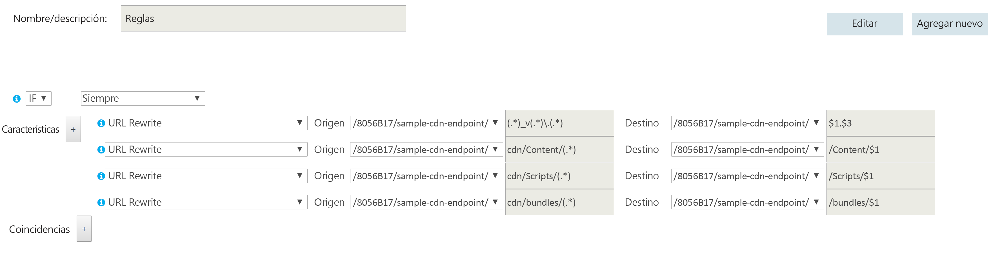

# <a name="content-delivery-network"></a>Content Delivery Network
[!INCLUDE [header](../_includes/header.md)]

Microsoft Azure Content Delivery Network (CDN) ofrece a los desarrolladores una solución global para entregar contenido con alto ancho de banda que se hospeda en Azure o en cualquier otra ubicación. Con la red CDN, puede almacenar en caché objetos disponibles públicamente cargados desde Almacenamiento de blobs de Azure, una aplicación web, una máquina virtual, una carpeta de la aplicación u otra ubicación HTTP/HTTPS. La caché de CDN puede mantenerse en ubicaciones estratégicas, con el fin de proporcionar el ancho de banda máximo para entregar contenido a los usuarios. La red CDN se suele usar para entregar el contenido estático, como imágenes, hojas de estilo, documentos, archivos, scripts de cliente y páginas HTML.

La red CDN también se puede usar como una memoria caché para servir contenido dinámico, como un informe en PDF o un gráfico basados en las entradas especificadas; si diferentes usuarios proporcionan los mismos valores de entrada, el resultado debería ser el mismo.

Las principales ventajas de usar la red CDN son una menor latencia y una entrega de contenido más rápida a los usuarios, independientemente de su ubicación geográfica en relación con el centro de datos en que se hospeda la aplicación.  


El uso de CDN también ayudará a reducir la carga de la aplicación, ya que se alivia el procesamiento requerido para acceder al contenido y entregarlo. Esta reducción puede ayudar a mejorar el rendimiento y la escalabilidad de la aplicación, así como a minimizar los costos de hospedaje, ya que se reducen los recursos de procesamiento requeridos para lograr un nivel concreto de disponibilidad y rendimiento.

## <a name="how-and-why-a-cdn-is-used"></a>Cómo y por qué se usa una red CDN
Entre los usos típicos de la red CDN se incluyen:  

* La entrega de recursos estáticos para aplicaciones cliente, a menudo desde un sitio web. Dichos recursos pueden ser imágenes, hojas de estilo, documentos, archivos, scripts de cliente, páginas HTML, fragmentos de HTML o cualquier otro contenido que el servidor no necesite modificar para cada solicitud. La aplicación puede crear elementos en tiempo de ejecución y ponerlos a disposición de la red CDN (por ejemplo, mediante la creación de una lista de los titulares más recientes), pero no lo hace para cada solicitud.
* Entrega de contenido compartido y estático público a dispositivos como teléfonos móviles y Tablet PC. La propia aplicación es un servicio web que ofrece una API a los clientes que se ejecutan en los distintos dispositivos. La red CDN también puede ofrecer conjuntos de datos estáticos (mediante el servicio web) para que los clientes los usen, quizás para generar la interfaz de usuario del cliente. Por ejemplo, la red CDN se puede usar para distribuir documentos JSON o XML.
* La prestación de servicio de sitios web completos que constan únicamente de contenido público estático que se entrega a los clientes, sin necesidad de disponer de recursos de proceso dedicados.
* El streaming de archivos de vídeo en el cliente a petición. El vídeo aprovecha la latencia baja y una conectividad confiable disponible en los centros de datos distribuidos en todo el mundo que ofrecen conexiones de red CDN. Microsoft Azure Media Services (AMS) se integra con Azure CDN para entregar contenido directamente a la red CDN para su distribución posterior. Para obtener más información, consulte [Streaming endpoints overview](/azure/media-services/media-services-streaming-endpoints-overview) (Información general de puntos de conexión de streaming).
* Por lo general, esto mejora la experiencia de los usuarios, sobre todo la de los que están lejos del centro de datos que hospeda la aplicación. De lo contrario, dichos usuarios podrían sufrir una mayor latencia. Una gran parte del tamaño total del contenido de una aplicación web suele ser estática y el uso de la red CDN puede ayudar a mantener el rendimiento y la experiencia general del usuario al tiempo que elimina la necesidad de implementar la aplicación en varios centros de datos.
* Control de la creciente carga de las aplicaciones que admiten soluciones IoT (Internet de las cosas). La gran cantidad de dichos dispositivos y aparatos implicados podrían sobrepasar fácilmente las capacidades de la aplicación si fuera necesario procesar mensajes de difusión y administrar la distribución de actualizaciones de firmware directamente en cada dispositivo.
* La capacidad de hacer frente a los picos y aumentos repentinos en la demanda sin que se sea preciso realizar ningún tipo de escalado, lo que evitar el consiguiente aumento de los gastos de mantenimiento. Por ejemplo, cuando se publique una actualización del sistema operativo de un dispositivo de hardware (como un modelo específico de enrutador) o de un dispositivo de consumo (por ejemplo, un televisor inteligente), se producirá un importante pico en la demanda, ya que la descargarán millones de usuarios en millones de dispositivos en un breve período de tiempo.

En la lista siguiente se muestran ejemplos del tiempo medio hasta el primer byte desde distintas ubicaciones geográficas. El rol web de destino se implementa en Azure en la zona oeste de EE. UU. Hay una correlación estrecha entre el mayor aumento debido a la red CDN y su proximidad a un nodo de la red CDN. Encontrará una lista completa de las ubicaciones de los nodos de Azure CDN en [Ubicaciones POP de Azure CDN](/azure/cdn/cdn-pop-locations/).

|  | Tiempo (ms) hasta el primer byte (origen) | Tiempo (ms) hasta la primera (CDN) | % de mejora de tiempo de CDN |
| --- | --- | --- | --- |
| \*San José, CA |47,5 |46,5 |2 % |
| \*\*Dulles, VA |109 |40,5 |169 % |
| Buenos Aires, Argentina |210 |151 |39 % |
| \*Londres, Reino Unido |195 |44 |343 % |
| Shangai, China |242 |206 |17 % |
| \*Singapur |214 |74 |189 % |
| \*Tokio, Japón |163 |48 |204 % |
| Seúl, Corea del Sur |190 |190 |0 % |

\* Tiene un nodo de red CDN de Azure en la misma ciudad.  
\*\* Tiene un nodo de red CDN de Azure en una ciudad vecina.  

## <a name="challenges"></a>Desafíos
Hay varios desafíos que se deben tener en cuenta a la hora de usar la red CDN:  

* **Implementación**. Decida el origen del que la red CDN obtendrá el contenido y si es preciso implementar el contenido en más de un sistema de almacenamiento (por ejemplo, en la red CDN y en una ubicación alternativa).

  El mecanismo de implementación de la aplicación debe tener en cuenta este proceso para implementar el contenido estático y los recursos, así como para implementar los archivos de la aplicación, como las páginas ASPX. Por ejemplo, puede que necesite implementar un paso independiente para cargar el contenido en Almacenamiento de blobs de Azure.
* **Control de versiones y control de caché**. Debe tener en cuenta cómo va a actualizar el contenido estático y a implementar las nuevas versiones. Es posible [purgar](/azure/cdn/cdn-purge-endpoint/) el contenido de la red CDN en Azure Portal cuando haya disponibles nuevas versiones de sus recursos. Este es un desafío similar a administrar el almacenamiento en caché del lado cliente, como lo que sucede en un explorador web.
* **Prueba**. Puede resultar difícil realizar pruebas locales de la configuración de la red CDN al desarrollar y probar una aplicación localmente o en un entorno de ensayo.
* **Optimización del motor de búsqueda (SEO)**. Cierto contenido, como imágenes y documentos, se sirve desde un dominio diferente cuando se usa la red CDN. Esto puede tener un efecto en la SEO de dicho contenido.
* **Seguridad de contenido**. Muchos servicios de la red CDN, como la red CDN de Azure, no ofrecen ningún tipo de control de acceso al contenido.
* **Seguridad de los clientes**. Los clientes se pueden conectar desde un entorno que no permita el acceso a los recursos de la red CDN. Podría tratarse de un entorno con restricciones de seguridad que limita el acceso a un conjunto de orígenes conocidos o uno que impide la carga de recursos desde cualquier otra cosa que no sea el origen de la página. Para tratar estos casos se requiere una implementación de reserva.
* **Resistencia**. La red CDN es un potencial punto único de error de una aplicación. Tiene un SLA de menor disponibilidad que el de almacenamiento de blobs (que se puede usar para entregar contenido directamente). Por tanto, es posible que tenga que considerar la implementación de un mecanismo de reserva para contenido crítico.

  Puede supervisar la disponibilidad del contenido de la red CDN, su ancho de banda, los datos transferidos, los aciertos, la proporción de aciertos de caché y las métricas de caché desde el Azure Portal en [tiempo real](/azure/cdn/cdn-real-time-stats/) y [agregar informes](/azure/cdn/cdn-analyze-usage-patterns/).

Escenarios donde puede resultar útil incluir la red CDN:  

* Si el contenido tiene una tasa de aciertos baja, solo se puede acceder a él pocas veces mientras sea válido (esto lo determina su período de vida). La primera vez que se descarga un elemento se generan dos cargos de transacciones, desde el origen a la red CDN y luego desde la red CDN al cliente.
* Si los datos son privados, como por ejemplo en grandes empresas o en ecosistemas de la cadena de suministros.

## <a name="general-guidelines-and-good-practices"></a>Directrices generales y prácticas recomendadas
El uso de la red CDN es una buena manera de minimizar la carga en la aplicación y maximizar la disponibilidad y el rendimiento. Considere la posibilidad de adoptar esta estrategia para todo el contenido adecuado y los recursos que usa la aplicación. Al diseñar la estrategia de uso de la red CDN, considere los puntos de las siguientes secciones:  

### <a name="origin"></a>Origen
La implementación de contenido a través de la red CDN requiere que se especifique un punto de conexión HTTP o HTTPS que usará el servicio de la red CDN para obtener acceso al contenido y almacenarlo en la caché.

El punto de conexión puede especificar un contenedor de Almacenamiento de blobs de Azure que contiene el contenido estático que se va a entregar a través de la red CDN. El contenedor debe marcarse como público. Solo los blobs de un contenedor público con acceso de lectura público están disponibles a través de la red CDN.

El punto de conexión puede especificar una carpeta denominada **cdn** en la raíz de una de las capas de proceso de la aplicación (por ejemplo, un rol web o una máquina virtual). Los resultados de las solicitudes de recursos, incluidos los recursos dinámicos, tales como las páginas ASPX, se almacenarán en caché en la red CDN. El período mínimo de almacenamiento en la caché es de 300 segundos. Un período más corto impedirá que el contenido se implemente en la red CDN (para más información, consulte la sección *Control de caché*).

Si usa Azure Web Apps, el punto de conexión se establece en la carpeta raíz del sitio al seleccionar el sitio cuando se crea la instancia de red CDN. Todo el contenido del sitio estará disponible a través de la red CDN.

En la mayoría de los casos, apuntar el punto de conexión de la red CDN a una carpeta dentro de una de las capas de proceso de la aplicación ofrece mayor flexibilidad y control. Por ejemplo, resulta más fácil administrar los requisitos de enrutamiento actuales y futuros, así como generar dinámicamente el contenido estático, tales como imágenes en miniatura.

Puede usar [cadenas de consulta](/azure/cdn/cdn-query-string/) para diferenciar los objetos en la memoria caché cuando el contenido se entrega desde orígenes dinámicos, tales como páginas ASPX. Sin embargo, este comportamiento se puede deshabilitar con una opción de configuración en Azure Portal cuando se especifica el punto de conexión de la red CDN. Cuando se entrega el contenido desde el almacenamiento de blobs, las cadenas de consulta se tratan como literales de cadena para que dos elementos que tienen el mismo nombre pero cadenas de consulta diferentes se almacenen como elementos separados en la red CDN.

Puede usar la reescritura de direcciones URL para los recursos, como scripts y otro contenido, con el fin de evitar mover los archivos a la carpeta de origen de la red CDN.

Al usar blobs de almacenamiento de Azure para almacenar el contenido de la red CDN, la dirección URL de los recursos de los blobs distingue mayúsculas de minúsculas para el nombre de contenedor y blob.

Al usar orígenes personalizados o Azure Web Apps, especifique la ruta de acceso a la instancia de la red CDN en los vínculos a los recursos. Por ejemplo, en el siguiente fragmento se especifica un archivo de imagen en la carpeta **Images** del sitio que se entregarán a través de la red CDN:

```XML

```

### <a name="deployment"></a>Implementación
Es posible que sea preciso que el contenido estático se aprovisione e implemente de forma independiente de la aplicación si no se incluye en el paquete de implementación o en el proceso de la aplicación. Tenga en cuenta cómo esto afectará al método de control de versiones que se use para administrar tanto los componentes de aplicaciones como el contenido de recursos estáticos.

Tenga en cuenta cómo se tratará la unión (la combinación de varios archivos en un solo archivo) y la minificación (la eliminación de caracteres innecesarios, como espacios en blanco, caracteres de nueva línea, comentarios y otros caracteres) de los archivos de script y CSS. Estas técnicas se usan de manera habitual, pueden reducir los tiempos de carga de los clientes y son compatibles con la entrega de contenido a través de la red CDN. Para más información, consulte el artículo sobre la [unión y minificación](http://www.asp.net/mvc/tutorials/mvc-4/bundling-and-minification).

Si necesita implementar el contenido en una ubicación adicional, será un paso adicional en el proceso de implementación. Si la aplicación actualiza el contenido para la red CDN, quizás a intervalos regulares o en respuesta a un evento, debe almacenar el contenido actualizado en las ubicaciones adicionales, así como el extremo de la red CDN.

No se puede configurar un punto de conexión de red CDN para una aplicación en el emulador local de Azure en Visual Studio. Esto afectará a las pruebas unitarias, a las pruebas funcionales y a las pruebas finales previas a la implementación. Debe permitir esto al implementar un mecanismo alternativo. Por ejemplo, podría realizar una implementación previa del contenido en la red CDN mediante una aplicación o utilidad personalizada, y realizar pruebas durante el período en que esté almacenado en la caché. También puede usar directivas de compilación o constantes globales para controlar el lugar desde el que la aplicación carga los recursos. Por ejemplo, durante la ejecución en modo de depuración, podría cargar recursos, como paquetes de script de cliente y otro contenido, de una carpeta local y usar la red CDN durante la ejecución en modo de lanzamiento.

Considere qué enfoque de compresión desea que admita la red CDN:

* Puede [habilitar la compresión](/azure/cdn/cdn-improve-performance/) en el servidor de origen, en cuyo caso la red CDN admitirá la compresión de forma predeterminada y entregará contenido comprimido a los clientes en los formatos zip o gzip. Si se usa una carpeta de aplicaciones como punto de conexión de la red CDN, el servidor puede comprimir una parte del contenido automáticamente, del mismo modo que cuando lo entrega directamente a un explorador web u otro tipo de cliente. El formato depende del valor del encabezado **Accept-Encoding** de la solicitud enviada por el cliente. En Azure, el mecanismo predeterminado es comprimir automáticamente el contenido cuando el uso de la CPU es inferior al 50 %. Si se usa un servicio en la nube para hospedar la aplicación, el cambio de la configuración puede requerir que se use una tarea de inicio para activar la compresión de la salida dinámica en IIS. Para más información, consulte [Enabling gzip compression with Microsoft Azure CDN through Web Role](http://blogs.msdn.com/b/avkashchauhan/archive/2012/03/05/enableing-gzip-compression-with-windows-azure-cdn-through-web-role.aspx) .
* Puede habilitar la compresión directamente en los servidores perimetrales de la red CDN, en cuyo caso esta red comprimirá los archivos y los servirá a los usuarios finales. Para más información, consulte [Compresión en la red CDN de Azure](/azure/cdn/cdn-improve-performance/).

### <a name="routing-and-versioning"></a>Enrutamiento y control de versiones
Es posible que necesite distintas instancias de la red CDN en momentos diferentes. Por ejemplo, al implementar una versión nueva de la aplicación puede usar una red CDN nueva y conservar la red CDN anterior (que tiene el contenido en un formato anterior) para las versiones anteriores. Si usa Azure Blob Storage como origen del contenido, puede crear una cuenta de almacenamiento independiente o un contenedor independiente y elegir el punto de conexión de la red CDN. Si usa la carpeta raíz cdn dentro de la aplicación como el punto de conexión de la red CDN, puede usar técnicas de reescritura de direcciones URL para dirigir las solicitudes a otra carpeta.

No use la cadena de consulta para indicar versiones diferentes de la aplicación en los vínculos a los recursos de la red CDN porque, al recuperar el contenido de Almacenamiento de blobs de Azure, la cadena de consulta forma parte del nombre del recurso (el nombre del blob). Este enfoque también puede afectar a la manera en que el cliente almacena los recursos en la caché.

La implementación de nuevas versiones de contenido estático cuando se actualiza una aplicación puede ser un desafío si los recursos anteriores se almacenan en caché en la red CDN. Para más información, consulte la sección *Control de caché*.

Considere la posibilidad de restringir el acceso al contenido de la red CDN por país. La red CDN de Azure le permite filtrar las solicitudes en función del país de origen y restringir el contenido que se entrega. Para más información, consulte [Restricción del acceso a contenidos por país](/azure/cdn/cdn-restrict-access-by-country/).

### <a name="cache-control"></a>Control de caché
Considere cómo administrar el almacenamiento en la caché en el sistema. Por ejemplo, si se usa una carpeta como origen de la red CDN, se puede especificar la capacidad de almacenamiento en caché de las páginas que generan el contenido y el tiempo de caducidad del contenido de todos los recursos de una carpeta específica. También puede especificar las propiedades de caché para la red CDN y para el cliente con encabezados HTTP estándar. Aunque ya debería estar administrando el almacenamiento en caché en el servidor y cliente, el uso de la red CDN le ayudará a hacer más consciente de cómo y dónde el contenido se almacena en caché.

Para impedir que los objetos estén disponibles en la red CDN, puede eliminarlos del origen (contenedor de blobs o carpeta raíz *cdn* de la aplicación), quitar o eliminar el punto de conexión de la red CDN, o, en el caso de Almacenamiento de blobs, hacer que el contenedor o el blob sean privados. Sin embargo, los elementos solo se quitarán de la red CDN cuando expire su período de vida. Si no se especifica un período de expiración de la caché (por ejemplo, cuando el contenido se carga desde Blob Storage), se almacenará en la caché de la red CDN un máximo de siete días.  También puede [purgar un punto de conexión de CDN](/azure/cdn/cdn-purge-endpoint/)de forma manual.

En una aplicación web, se puede establecer el almacenamiento en caché y la fecha de expiración de todo el contenido mediante el elemento *clientCache* de la sección *system.webServer/staticContent* del archivo web.config. Recuerde que si coloca un archivo web.config en una carpeta, los archivos de dicha carpeta y todas las subcarpetas resultan afectados.

Si crea el contenido de la red CDN dinámicamente (por ejemplo, en el código de la aplicación) asegúrese de especificar la propiedad *Cache.SetExpires* en todas las páginas. La red CDN no almacenará en la caché la salida de las páginas que usan la configuración predeterminada de capacidad de almacenamiento en caché *public*.  Establezca el período de expiración de caché en un valor adecuado para asegurarse de que el contenido no se descarte y se vuelva a cargar desde la aplicación a intervalos muy cortos.  

### <a name="security"></a>Seguridad
La red CDN puede entregar contenido a través de HTTPS (SSL) con el certificado que proporciona la red CDN, así como a través de HTTP estándar. Es posible que tenga que usar HTTPS para solicitar el contenido estático que se muestra en las páginas que se cargan a través de HTTPS para evitar las advertencias del explorador sobre contenido mixto.

Si entrega recursos estáticos, tales como archivos de fuentes, mediante la red CDN, pueden surgir problemas de directiva del mismo origen si usa una llamada *XMLHttpRequest* para solicitar estos recursos a un dominio distinto. Muchos exploradores web impiden el uso compartido de recursos entre orígenes (CORS), a menos que el servidor web se haya configurado para establecer los encabezados de respuesta adecuados. Para admitir CORS, puede configurar la red CDN con uno de los métodos siguientes:

* Use el motor de reglas de CDN para agregar encabezados CORS a las respuestas. Este método suele ser el mejor porque admite caracteres comodín y permite especificar varios orígenes. Para más información, consulte [Uso de Azure CDN con CORS](https://docs.microsoft.com/en-us/azure/cdn/cdn-cors). 
* Agregue *CorsRule* a las propiedades del servicio. Puede usar este método si el origen desde el que se entrega el contenido es Azure Blob Storage. La regla puede especificar los orígenes permitidos para las solicitudes CORS, los métodos permitidos, como GET, y el tiempo máximo en segundos para la regla (es decir, el período dentro del cual el cliente debe solicitar los recursos vinculados después de cargar el contenido original). Al establecer CORS en Storage para usarlo con CDN, solo se admite el carácter comodín '*' para la lista de orígenes permitidos. Para más información, consulte [Compatibilidad con Uso compartido de recursos entre orígenes (CORS) para los Servicios de Azure Storage](http://msdn.microsoft.com/library/azure/dn535601.aspx).
* Configure las reglas de salida en el archivo de configuración de la aplicación para establecer un encabezado*Access-Control-Allow-Origin* en todas las respuestas. Puede utilizar este método si el servidor de origen está ejecutando IIS. Cuando se usa este método con CDN, solo se admite el carácter comodín '*' para la lista de orígenes permitidos. Para más información sobre el uso de reglas de reescritura, consulte el artículo sobre el [módulo de reescritura de direcciones URL](http://www.iis.net/learn/extensions/url-rewrite-module).

### <a name="custom-domains"></a>Dominios personalizados
La red CDN de Azure permite especificar un [nombre de dominio personalizado](/azure/cdn/cdn-map-content-to-custom-domain/) y usarlo para acceder a recursos a través de la red CDN. También puede configurar un nombre de subdominio personalizado con un registro *CNAME* en el DNS. El uso de este método puede proporcionar un nivel adicional de abstracción y control.

Si se usa un registro *CNAME*, no se puede usar SSL, ya que la red CDN usa su propio certificado SSL único y este no coincidirá con los nombres de dominio o subdominio personalizados.

### <a name="cdn-fallback"></a>Reserva de red CDN
Debe considerar la forma en que la aplicación hará frente a un error o a la no disponibilidad temporal de la red CDN. Las aplicaciones cliente pueden usar copias de los recursos almacenados en la caché local (en el cliente) durante las solicitudes anteriores, o bien, se puede incluir código que detecte errores y, en su lugar, solicite recursos del origen (la carpeta de aplicaciones o el contenedor de blobs de Azure que contiene los recursos) si la red CDN no está disponible.

El ejemplo siguiente muestra los mecanismos de reserva con [aplicaciones auxiliares de etiquetas](https://docs.microsoft.com/en-us/aspnet/core/mvc/views/tag-helpers/intro) en una vista de Razor.

```HTML
...
<link rel="stylesheet" href="https://[your-cdn-endpoint].azureedge.net/lib/bootstrap/dist/css/bootstrap.min.css"
      asp-fallback-href="~/lib/bootstrap/dist/css/bootstrap.min.css"
      asp-fallback-test-class="sr-only" asp-fallback-test-property="position" asp-fallback-test-value="absolute"/>
<link rel="stylesheet" href="~/css/site.min.css" asp-append-version="true"/>
...
<script src="https://[your-cdn-endpoint].azureedge.net/lib/jquery/dist/jquery-2.2.0.min.js"
        asp-fallback-src="~/lib/jquery/dist/jquery.min.js"
        asp-fallback-test="window.jQuery">
</script>
<script src="https://[your-cdn-endpoint].azureedge.net/lib/bootstrap/dist/js/bootstrap.min.js"
        asp-fallback-src="~/lib/bootstrap/dist/js/bootstrap.min.js"
        asp-fallback-test="window.jQuery && window.jQuery.fn && window.jQuery.fn.modal">
</script>
...
```

### <a name="search-engine-optimization"></a>Optimización del motor de búsqueda
Si la SEO es una consideración importante en la aplicación, realice las siguientes tareas:

* Incluya un encabezado canónico *Rel* en todas las páginas o recursos.
* Use un registro de subdominio *CNAME* y acceda a los recursos con este nombre.
* Tenga en cuenta el impacto del hecho de que la dirección IP de la red CDN podría estar en un país o región diferente de la aplicación en sí.
* Cuando se usa el almacenamiento de blobs de Azure como origen, conserve la misma estructura de archivos para los recursos de la red CDN que la de las carpetas de aplicación.

### <a name="monitoring-and-logging"></a>Supervisión y registro
Incluya la red CDN como parte de la estrategia de supervisión de la aplicación para la detección y medición de errores o apariciones de latencia extendida.  La supervisión se puede realizar desde el Administrador de perfiles de la red CDN, ubicado en el sitio de Azure Portal.

Habilite el registro en la red CDN y supervise dicho registro como parte de las operaciones diarias.

Consider la posibilidad de analizar el tráfico de la red CDN para encontrar patrones de uso. El Portal de Azure proporciona herramientas que le permiten supervisar:

* El ancho de banda
* Los datos transferidos
* Los aciertos (códigos de estado)
* El estado de la memoria caché
* La proporción de aciertos de caché
* La proporción de solicitudes IPv4/IPv6

Para más información, consulte [Análisis de patrones de uso de la red CDN de Azure](/azure/cdn/cdn-analyze-usage-patterns/).

### <a name="cost-implications"></a>Costos asociados
Se le cobrará por las transferencias de datos de salida desde la red CDN.  Además, si usa el Almacenamiento de blobs para hospedar sus activos, se le cobrará por las transacciones de almacenamiento cuando la red CDN cargue datos desde la aplicación. Establezca períodos de expiración de caché realistas para el contenido con el fin de garantizar la actualización, pero no tan corto que se produzca la recarga repetida del contenido de la aplicación o el almacenamiento de blobs en la red CDN.

Los elementos que raramente se descargan incurrirá en los dos cargos de transacción, sin proporcionar ninguna reducción significativa en la carga del servidor.

### <a name="bundling-and-minification"></a>unión y minificación
Use la unión y minificación para reducir el tamaño de los recursos como código JavaScript y páginas HTML almacenados en la red CDN. Esta estrategia puede ayudarle a reducir el tiempo necesario para descargar estos elementos en el cliente.

La unión y minificación los puede controlar ASP.NET. En un proyecto MVC, las uniones se definen en *BundleConfig.cs*. Una referencia a la unión minificada del script se crea al llamar al método *Script.Render* , normalmente en el código de la clase de vista. Esta referencia contiene una cadena de consulta en la que se incluye un valor hash, que se basa en el contenido de la unión. Si cambia el contenido de la unión, también cambiará el código hash generado.  

De forma predeterminada, las instancias de la red CDN de Azure tienen la opción *Estado de las cadenas de consultas* deshabilitada. Para que las uniones de script actualizadas las controle correctamente la red CDN, debe habilitar la opción *Estado de las cadenas de consultas* para la instancia de la red CDN. Tenga en cuenta que el valor puede tardar una o dos horas en entrar en vigor.

### <a name="features"></a>Características

Azure tiene varios productos de CDN. Al seleccionar una red CDN, tenga en cuenta las características que admite cada producto. Consulte [Características de Azure CDN] [ cdn-features] para obtener más información. Las características Premium que puede que desee considerar incluyen:

- **[Motor de reglas](/azure/cdn/cdn-rules-engine)**. El motor de reglas le permite personalizar cómo se controlan las solicitudes HTTP, tales como el bloqueo de la entrega de determinados tipos de contenido, la definición de una directiva de almacenamiento en caché y la modificación de encabezados HTTP. 

- **[Estadísticas en tiempo real](/azure/cdn/cdn-real-time-stats)**. Supervisa los datos en tiempo real, por ejemplo, el ancho de banda, los estados de la caché y las conexiones simultáneas a su perfil de CDN, entre otros, y recibe [alertas en tiempo real](/azure/cdn/cdn-real-time-alerts). 


## <a name="rules-engine-url-rewriting-example"></a>Ejemplo de reescritura de URL del motor de reglas

El diagrama siguiente muestra cómo realizar la [reescritura de URL](https://technet.microsoft.com/library/ee215194.aspx) cuando se usa la red CDN. Las solicitudes desde la red CDN de contenido almacenado en la caché se redirigen a carpetas concretas de la raíz de la aplicación según el tipo de recurso (por ejemplo, scripts e imágenes).  



Estas reglas de reescritura realizan las siguientes redirecciones:

* La primera regla permite integrar una versión en el nombre de archivo de un recurso, que luego se omite. Por ejemplo, *NombreDeArchivo_v123.jpg* se reescribe como *NombreDeArchivo.jpg*.
* Las cuatro reglas siguientes muestran cómo redirigir solicitudes si no se desea almacenar los recursos en una carpeta llamada *cdn** en la raíz del rol web. Las reglas asignan las direcciones URL *cdn/Images*, *cdn/Content*, *cdn/Scripts* y *cdn/bundles* a sus respectivas carpetas raíz en el rol web.

Tenga en cuenta que el uso de la reescritura de URL requiere que se realicen varios cambios en la unión de recursos.     

## <a name="more-information"></a>Más información
* [Red CDN de Azure](https://azure.microsoft.com/services/cdn/)
* [Documentación de Azure Content Delivery Network (CDN)](https://azure.microsoft.com/documentation/services/cdn/)
* [Uso de CDN de Azure](/azure/cdn/cdn-create-new-endpoint/)
* [Integre un servicio en la nube con Azure CDN](/azure/cdn/cdn-cloud-service-with-cdn/)(https://azure.microsoft.com/blog/2011/03/18/best-practices-for-the-windows-azure-content-delivery-network/)


<!-- links -->

[cdn-features]: /azure/cdn/cdn-overview#azure-cdn-features
