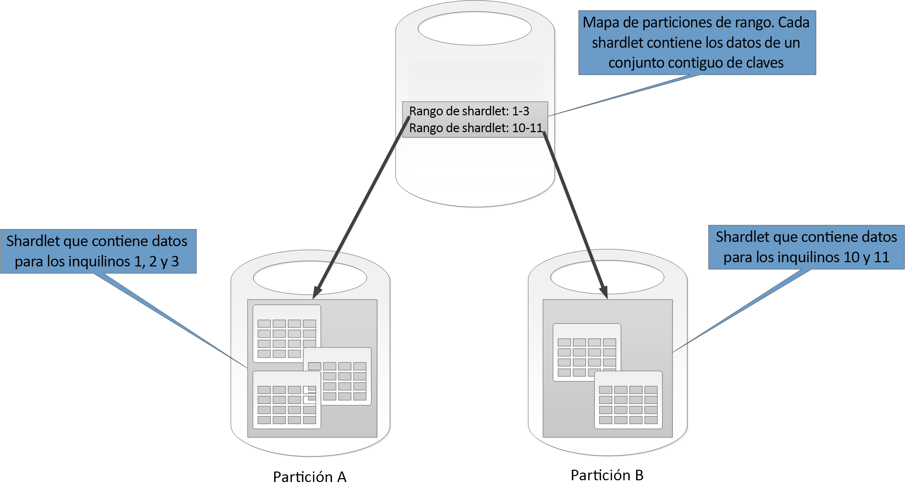

# Estrategias de creación de particiones de datosData partitioning strategies

En este artículo se describen algunas estrategias para crear particiones de datos en varios almacenes de datos de Azure.This article describes some strategies for partitioning data in various Azure data stores. Para obtener instrucciones generales acerca de cuándo crear particiones de datos y los procedimientos recomendados para hacerlo, consulte [Creación de particiones de datos](./data-partitioning.md)For general guidance about when to partition data and best practices, see [Data partitioning](./data-partitioning.md)

## Creación de particiones en Azure SQL DatabasePartitioning Azure SQL Database

Una única base de datos SQL puede contener un volumen de datos limitado.A single SQL database has a limit to the volume of data that it can contain. El rendimiento está restringido por factores arquitectónicos y el número de conexiones simultáneas que admite.Throughput is constrained by architectural factors and the number of concurrent connections that it supports. 

Los [grupos de bases de datos elásticas](/azure/sql-database/sql-database-elastic-pool) admiten el escalado horizontal de las bases de datos SQL.[Elastic pools](/azure/sql-database/sql-database-elastic-pool) support horizontal scaling for a SQL database. Mediante los grupos de bases de datos elásticas se pueden crear particiones de datos que se reparten en varias bases de datos SQL.Using elastic pools, you can partition your data into shards that are spread across multiple SQL databases. También puede agregar o quitar particiones a medida que crezca y disminuya el volumen de datos que necesita administrar.You can also add or remove shards as the volume of data that you need to handle grows and shrinks. Los grupos de bases de datos elásticas también pueden ayudar a reducir la contención, ya que distribuyen la carga entre las bases de datos.Elastic pools can also help reduce contention by distributing the load across databases.

Cada partición se implementa como una base de datos SQL.Each shard is implemented as a SQL database. Una partición puede contener más de un conjunto de datos (denominado *shardlet*).A shard can hold more than one dataset (called a *shardlet*). Cada base de datos mantiene metadatos que describen los shardlets que contiene.Each database maintains metadata that describes the shardlets that it contains. Un shardlet puede ser un único elemento de datos o un grupo de elementos que comparten la misma clave de shardlet.A shardlet can be a single data item, or a group of items that share the same shardlet key. Por ejemplo, en una aplicación de varios inquilinos, la clave de shardlet puede ser el identificador del inquilino y todos los datos de un inquilino se pueden mantener en el mismo shardlet.For example, in a multitenant application, the shardlet key can be the tenant ID, and all data for a tenant can be held in the same shardlet.

Las aplicaciones cliente son responsables de la asociación de un conjunto de datos con una clave de shardlet.Client applications are responsible for associating a dataset with a shardlet key. Una base de datos SQL independiente actúa como administrador global de mapas de particiones.A separate SQL database acts as a global shard map manager. Esta base de datos tiene una lista de todas las particiones y shardlets del sistema.This database has a list of all the shards and shardlets in the system. La aplicación se conecta a la base de datos del administrador del mapa de particiones para obtener una copia de este.The application connects to the shard map manager database to obtain a copy of the shard map. Almacena en caché localmente el mapa de particiones y utiliza dicho mapa para enrutar las solicitudes de datos a la partición apropiada.It caches the shard map locally, and uses the map to route data requests to the appropriate shard. Esta funcionalidad se oculta detrás de una serie de API que se encuentran en la [biblioteca de cliente de Elastic Database](/azure/sql-database/sql-database-elastic-database-client-library), que está disponible para Java y .NET.This functionality is hidden behind a series of APIs that are contained in the [Elastic Database client library](/azure/sql-database/sql-database-elastic-database-client-library), which is available for Java and .NET. 

Para más información acerca de los grupos de bases de datos elásticas, consulte [Escalado horizontal con Azure SQL Database](/azure/sql-database/sql-database-elastic-scale-introduction).For more information about elastic pools, see [Scaling out with Azure SQL Database](/azure/sql-database/sql-database-elastic-scale-introduction).

Para reducir la latencia y mejorar la disponibilidad, puede replicar la base de datos de administrador global del mapa de particiones.To reduce latency and improve availability, you can replicate the global shard map manager database. Con los planes de tarifa Premium, puede configurar la replicación geográfica activa para copiar continuamente datos a bases de datos de diferentes regiones.With the Premium pricing tiers, you can configure active geo-replication to continuously copy data to databases in different regions. 

Como alternativa, use [Azure SQL Data Sync](/azure/sql-database/sql-database-sync-data) o [Azure Data Factory](/azure/data-factory/) para replicar la base de datos del administrador del mapa de particiones entre regiones.Alternatively, use [Azure SQL Data Sync](/azure/sql-database/sql-database-sync-data) or [Azure Data Factory](/azure/data-factory/) to replicate the shard map manager database across regions. Esta forma de replicación se ejecuta periódicamente y es más adecuada si el mapa de particiones no cambia con frecuencia y no requiere el nivel Premium.This form of replication runs periodically and is more suitable if the shard map changes infrequently, and does not require Premium tier.

Elastic Database proporciona dos esquemas para asignar datos a shardlets y para almacenarlos en particiones:Elastic Database provides two schemes for mapping data to shardlets and storing them in shards:

* Un **mapa de particiones de lista** asocia una clave única a un shardlet.A **list shard map** associates a single key to a shardlet. Por ejemplo, en un sistema de varios inquilinos, los datos de cada inquilino podrían asociarse a una clave única y almacenarse en su propio shardlet.For example, in a multitenant system, the data for each tenant can be associated with a unique key and stored in its own shardlet. Para garantizar el aislamiento, cada shardlet puede mantenerse dentro de su propia partición.To guarantee isolation, each shardlet can be held within its own shard.

    

* Un **mapa de particiones de intervalos** asocia un conjunto de valores de clave contiguos a un shardlet.A **range shard map** associates a set of contiguous key values to a shardlet. Por ejemplo, puede agrupar los datos de un conjunto de inquilinos (cada uno de ellos con su propia clave) en el mismo shardlet.For example, you can group the data for a set of tenants (each with their own key) within the same shardlet. Este esquema es más barato que el primero, ya que los inquilinos comparten el almacenamiento de datos, pero su aislamiento es menor.This scheme is less expensive than the first, because tenants share data storage, but has less isolation.

    

Una partición individual puede contener los datos de varios shardlets.A single shard can contain the data for several shardlets. Por ejemplo, puede utilizar shardlets de lista para almacenar datos de varios inquilinos no contiguos en la misma partición.For example, you can use list shardlets to store data for different non-contiguous tenants in the same shard. También puede mezclar shardlets de intervalo y de lista en la misma partición, aunque se tratarán a través de diferentes mapas.You can also mix range shardlets and list shardlets in the same shard, although they will be addressed through different maps. En el siguiente diagrama se ilustra este enfoque:The following diagram shows this approach:

Los grupo de bases de datos elásticas permiten agregar y quitar particiones cuando el volumen de datos disminuye o crece.Elastic pools makes it possible to add and remove shards as the volume of data shrinks and grows. Las aplicaciones cliente pueden crear y eliminar particiones dinámicamente y actualizar el administrador del mapa de particiones.Client applications can create and delete shards dynamically, and transparently update the shard map manager. sin embargo, eliminar una partición es una operación destructiva que también requiere la eliminación de todos los datos de esa partición.However, removing a shard is a destructive operation that also requires deleting all the data in that shard.

Si una aplicación necesita dividir una partición en dos particiones independientes o combinar particiones, use la [herramienta de división y combinación](/azure/sql-database/sql-database-elastic-scale-overview-split-and-merge).If an application needs to split a shard into two separate shards or combine shards, use the [split-merge tool](/azure/sql-database/sql-database-elastic-scale-overview-split-and-merge). Esta herramienta se ejecuta como un servicio web de Azure y migra los datos entre particiones de forma segura.This tool runs as an Azure web service, and migrates data safely between shards. 

El esquema de particiones puede afectar considerablemente al rendimiento del sistema.The partitioning scheme can significantly impact the performance of your system. También puede afectar a la frecuencia con que deben agregarse o quitarse particiones, o con que se deben volver a crear particiones de datos.It can also affect the rate at which shards have to be added or removed, or that data must be repartitioned across shards. Considere los siguientes puntos:Consider the following points:

* Agrupe los datos que se utilizan conjuntamente en la misma partición y evite operaciones que accedan a datos de varias particiones.Group data that is used together in the same shard, and avoid operations that access data from multiple shards. Una partición es una base de datos SQL por derecho propio y las combinaciones entre bases de datos se deben realizar en el cliente.A shard is a SQL database in its own right, and cross-database joins must be performed on the client side. 

    Aunque SQL Database no admite combinaciones entre bases de datos, puede usar las herramientas de Elastic Database para realizar [consultas en varias particiones](/azure/sql-database/sql-database-elastic-scale-multishard-querying).Although SQL Database does not support cross-database joins, you can use the Elastic Database tools to perform [mutli-shard queries](/azure/sql-database/sql-database-elastic-scale-multishard-querying). Una consulta en varias particiones envía consultas individuales a cada base de datos y combina los resultados.A multi-shard query sends individual queries to each database and merges the results.

* No diseñe un sistema que tenga dependencias entre las particiones.Don't design a system that has dependencies between shards. Las restricciones de integridad referencial, los desencadenadores y los procedimientos almacenados de una base de datos no pueden hacer referencia a otra.Referential integrity constraints, triggers, and stored procedures in one database cannot reference objects in another. 

* Si tiene datos de referencia que las consultas usen con frecuencia, considere la posibilidad de replicar dichos datos entre las particiones.If you have reference data that is frequently used by queries, consider replicating this data across shards. Este enfoque puede eliminar la necesidad de combinar datos en las bases de datos.This approach can remove the need to join data across databases. Lo ideal es que dichos datos sean estáticos o lentos para minimizar el esfuerzo de replicación y reducir las posibilidades de que se vuelvan obsoletos.Ideally, such data should be static or slow-moving, to minimize the replication effort and reduce the chances of it becoming stale.

* Los shardlets que pertenecen al mismo mapa de particiones deben tener el mismo esquema.Shardlets that belong to the same shard map should have the same schema. Esta regla no se aplica mediante SQL Database, pero la administración y consulta de datos se vuelven muy complejas si cada shardlet tiene un esquema diferente.This rule is not enforced by SQL Database, but data management and querying becomes very complex if each shardlet has a different schema. En su lugar, cree mapas de particiones independientes para cada esquema.Instead, create separate shard maps for each schema. Recuerde que los datos que pertenecen a diferentes shardlets pueden almacenarse en la misma partición.Remember that data belonging to different shardlets can be stored in the same shard.

* Las operaciones transaccionales solo se admiten para los datos que se encuentren en una partición, no entre particiones.Transactional operations are only supported for data within a shard, and not across shards. Las transacciones pueden abarcar shardlets siempre que formen parte de la misma partición.Transactions can span shardlets as long as they are part of the same shard. Por consiguiente, si la lógica de negocios debe realizar transacciones, almacene los datos en la misma partición o implemente la coherencia eventual.Therefore, if your business logic needs to perform transactions, either store the data in the same shard or implement eventual consistency. 

* Coloque las particiones cerca de los usuarios que acceden a los datos de dichas particiones.Place shards close to the users that access the data in those shards. Esta estrategia ayuda a reducir la latencia.This strategy helps reduce latency.

* Evite tener una mezcla de particiones muy activas y relativamente inactivas.Avoid having a mixture of highly active and relatively inactive shards. Pruebe a distribuir la carga uniformemente entre las particiones.Try to spread the load evenly across shards. Esto puede requerir la aplicación de algoritmos hash a las claves de particionamiento.This might require hashing the sharding keys.  Si está geolocalizando las particiones, asegúrese de que las claves hash se asignan a shardlets de particiones almacenadas cerca de los usuarios que tienen acceso a esos datos.If you are geo-locating shards, make sure that the hashed keys map to shardlets held in shards stored close to the users that access that data.

### Creación de particiones en el almacenamiento de tablas de AzurePartitioning Azure table storage

El Almacenamiento de tablas de Azure es un almacén del par clave-valor diseñado en torno a la creación de particiones.Azure table storage is a key-value store that's designed around partitioning. Todas las entidades se almacenan en una partición y las particiones son administradas internamente por el almacenamiento de tablas de Azure.All entities are stored in a partition, and partitions are managed internally by Azure table storage. Cada entidad almacenada en una tabla debe proporcionar una clave de dos partes que incluye:Each entity stored in a table must provide a two-part key that includes:

* **La clave de la partición**.**The partition key**. Se trata de un valor de cadena que determina la partición en que Almacenamiento de tablas de Azure colocará la entidad.This is a string value that determines the partition where Azure table storage will place the entity. Todas las entidades con la misma clave de partición se almacenan en la misma partición.All entities with the same partition key are stored in the same partition.
* **La clave de la fila**.**The row key**. Es un valor de cadena que identifica la entidad dentro de la partición.This is a string value that identifies the entity within the partition. Todas las entidades dentro de una partición se ordenan léxicamente, en orden ascendente, por parte de esta clave.All entities within a partition are sorted lexically, in ascending order, by this key. La combinación de clave de fila/partición debe ser única para cada entidad y no puede superar 1 KB de longitud.The partition key/row key combination must be unique for each entity and cannot exceed 1 KB in length.

Si se agrega una entidad a una tabla con una clave de partición no usada anteriormente, Almacenamiento de tablas de Azure crea una nueva partición para esta entidad.If an entity is added to a table with a previously unused partition key, Azure table storage creates a new partition for this entity. Otras entidades con la misma clave de partición se almacenarán en la misma partición.Other entities with the same partition key will be stored in the same partition.

Este mecanismo implementa de forma efectiva una estrategia de escalado automático.This mechanism effectively implements an automatic scale-out strategy. Cada partición se almacena en el mismo servidor de un centro de datos de Azure para ayudar a garantizar que las consultas que recuperan datos de una sola partición se ejecutan rápidamente.Each partition is stored on the same server in an Azure datacenter to help ensure that queries that retrieve data from a single partition run quickly. 

Microsoft ha publicado los [objetivos de escalabilidad] de Azure Storage.Microsoft has published [scalability targets] for Azure Storage. Si es probable que su sistema supere estos límites, considere la posibilidad de dividir las entidades en varias tablas.If your system is likely to exceed these limits, consider splitting entities into multiple tables. Utilice particiones verticales para dividir los campos en los grupos a los que se vaya a acceder en conjunto con mayor probabilidad.Use vertical partitioning to divide the fields into the groups that are most likely to be accessed together.

El diagrama siguiente muestra la estructura lógica de una cuenta de almacenamiento de ejemplo.The following diagram shows the logical structure of an example storage account. La cuenta de almacenamiento contiene tres tablas: información del cliente, información del producto e información del pedido.The storage account contains three tables: Customer Info, Product Info, and Order Info. 

Cada tabla tiene varias particiones.Each table has multiple partitions.

- En la tabla Información del cliente, los datos se particionan según la ciudad en la que está ubicado el cliente.In the Customer Info table, the data is partitioned according to the city where the customer is located. La clave de fila contiene el Id. de cliente.The row key contains the customer ID. 
- En la tabla Información del producto, los productos se particionan por categoría de producto y la clave de fila contiene el número de producto.In the Product Info table, products are partitioned by product category, and the row key contains the product number. 
- En la tabla Order Info (Información del pedido), los pedidos se particionan por fecha de pedido y la clave de fila especifica el momento en que recibió el pedido.In the Order Info table, the orders are partitioned by order date, and the row key specifies the time the order was received. Tenga en cuenta que todos los datos se ordenan por la clave de fila de cada partición.Note that all data is ordered by the row key in each partition.

Considere los siguientes puntos cuando diseñe las entidades para el almacenamiento de tablas de Azure:Consider the following points when you design your entities for Azure table storage:

* Seleccione una clave de partición y clave de fila por la forma en que se accede a los datos.Select a partition key and row key by how the data is accessed. Elija una combinación de claves de partición y fila que admita la mayoría de las consultas.Choose a partition key/row key combination that supports the majority of your queries. Las consultas más eficaces recuperan los datos especificando la clave de partición y la clave de fila.The most efficient queries retrieve data by specifying the partition key and the row key. Las consultas que especifican una clave de partición y un intervalo de claves de fila pueden completarse mediante el análisis de una sola partición.Queries that specify a partition key and a range of row keys can be completed by scanning a single partition. Esto es relativamente rápido porque los datos se mantienen en el orden de la clave de fila.This is relatively fast because the data is held in row key order. Si las consultas no especifican la partición que se va a examinar, se deben examinar todas.If queries don't specify which partition to scan, every partition must be scanned.

- Si una entidad tiene una clave natural, a continuación, úsela como clave de partición y especifique una cadena vacía como clave de fila.If an entity has one natural key, then use it as the partition key and specify an empty string as the row key. Si una entidad tiene una clave compuesta que conste de dos propiedades, seleccione la propiedad que cambie más despacio como clave de partición y la otra como clave de fila.If an entity has a composite key consisting of two properties, select the slowest changing property as the partition key and the other as the row key. Si una entidad tiene más de dos propiedades de clave, use una concatenación de propiedades para proporcionar las claves de partición y fila.If an entity has more than two key properties, use a concatenation of properties to provide the partition and row keys.

* Si realiza regularmente consultas que buscan datos con campos que no sean las claves de partición y fila, considere la posibilidad de implementar el [patrón de tabla de índice] o de usar otro almacén de datos que admita la indexación, como Cosmos DB.If you regularly perform queries that look up data by using fields other than the partition and row keys, consider implementing the [index table pattern], or consider using a different data store that supports indexing, such as Cosmos DB.

* Si genera claves de partición mediante una secuencia monotónica (como, "0001", "0002" y "0003") y cada partición solo contiene una cantidad limitada de datos, es posible que el Almacenamiento de tablas de Azure agrupe físicamente estas particiones en el mismo servidor.If you generate partition keys by using a monotonic sequence (such as "0001", "0002", "0003") and each partition only contains a limited amount of data, Azure table storage can physically group these partitions together on the same server. Azure Storage supone que es muy probable que la aplicación realice consultas en un intervalo contiguo de particiones (consultas por rango) y está optimizada para este caso.Azure Storage assumes that the application is most likely to perform queries across a contiguous range of partitions (range queries) and is optimized for this case. Sin embargo, este enfoque puede provocar la aparición de puntos con mucho tráfico, ya que es probable que todas las inserciones de nuevas entidades se concentren en uno de los extremos del rango contiguo.However, this approach can lead to hotspots, because all insertions of new entities are likely to be concentrated at one end the contiguous range. También puede reducir la escalabilidad.It can also reduce scalability. Para distribuir la carga más uniformemente, considere la posibilidad de crear un algoritmo hash de la clave de partición.To spread the load more evenly, consider hashing the partition key.

* El almacenamiento de tablas de Azure admite operaciones transaccionales para entidades que pertenecen a la misma partición.Azure table storage supports transactional operations for entities that belong to the same partition. Una aplicación puede realizar varias operaciones de inserción, actualización, eliminación, sustitución o combinación como una unidad atómica, siempre que la transacción no incluya más de cien entidades y que la carga de la solicitud no supere los 4 MB.An application can perform multiple insert, update, delete, replace, or merge operations as an atomic unit, as long as the transaction doesn't include more than 100 entities and the payload of the request doesn't exceed 4 MB. Las operaciones que abarcan varias particiones no son transaccionales y pueden requerir la implementación de la coherencia eventual.Operations that span multiple partitions are not transactional, and might require you to implement eventual consistency. Para más información acerca del almacenamiento de tablas y las transacciones, consulte [Performing entity group transactions] (Realización de transacciones en el grupo de entidades).For more information about table storage and transactions, see [Performing entity group transactions].

* Tenga en cuenta la granularidad de la clave de partición:Consider the granularity of the partition key:

  * El uso de la misma clave de partición en todas las entidades genera una única partición que se mantiene en un servidor.Using the same partition key for every entity results in a single partition that's held on one server. Esto impide el escalado horizontal de la partición y centra la carga en un único servidor.This prevents the partition from scaling out and focuses the load on a single server. Como resultado, este enfoque solo es adecuado para almacenar un pequeño número de entidades.As a result, this approach is only suitable for storing a small number of entities. Sin embargo, garantiza que todas las entidades puedan participar en transacciones del grupo de entidades.However, it does ensure that all entities can participate in entity group transactions.

  * El uso de una clave de partición única para cada entidad provoca que el servicio Table Storage cree una partición independiente para cada entidad, lo cual puede dar lugar a un número elevado de particiones pequeñas.Using a unique partition key for every entity causes the table storage service to create a separate partition for each entity, possibly resulting in a large number of small partitions. Este enfoque es más escalable que el uso de una clave de partición única, pero no es posible realizar transacciones de grupo de entidad.This approach is more scalable than using a single partition key, but entity group transactions are not possible. Además, las consultas que capturan más de una entidad podrían implicar lecturas desde más de un servidor.Also, queries that fetch more than one entity might involve reading from more than one server. Sin embargo, si la aplicación realiza consultas por rango, el uso de una secuencia monotónica para las claves de partición puede ayudar a optimizar dichas consultas.However, if the application performs range queries, then using a monotonic sequence for the partition keys might help to optimize these queries.

  * Compartir la clave de partición en un subconjunto de entidades permite agrupar las entidades relacionadas de la misma partición.Sharing the partition key across a subset of entities makes it possible to group related entities in the same partition. Se pueden realizar operaciones que implican entidades relacionadas con transacciones de grupo de entidades, y es posible dar respuesta a las consultas que capturan un conjunto de entidades relacionadas mediante el acceso a un único servidor.Operations that involve related entities can be performed by using entity group transactions, and queries that fetch a set of related entities can be satisfied by accessing a single server.

Para más información, consulte [Guía de diseño de Table Storage].For more information, see [Azure storage table design guide].

## Creación de particiones en el almacenamiento de blobs de AzurePartitioning Azure blob storage

Azure Blob Storage permite almacenar objetos binarios grandes.Azure blob storage makes it possible to hold large binary objects. Use blobs en bloques cuando sea necesario cargar o descargar grandes volúmenes de datos rápidamente.Use block blobs in scenarios when you need to upload or download large volumes of data quickly. Use blobs en páginas para aplicaciones que requieran acceso aleatorio en lugar de acceso de serie a partes de los datos.Use page blobs for applications that require random rather than serial access to parts of the data.

Cada blob (en bloque o en página) se mantiene en un contenedor de una cuenta de almacenamiento de Azure.Each blob (either block or page) is held in a container in an Azure storage account. Puede usar contenedores para agrupar los blobs relacionados que tengan los mismos requisitos de seguridad.You can use containers to group related blobs that have the same security requirements. Esta agrupación es más lógica que física.This grouping is logical rather than physical. Dentro de un contenedor, cada blob tiene un nombre único.Inside a container, each blob has a unique name.

La clave de partición de un blob es el nombre de la cuenta más el nombre del contenedor y el nombre del blob.The partition key for a blob is account name + container name + blob name. La clave de partición se usa para particionar datos en intervalos con una carga equilibrada en el sistema.The partition key is used to partition data into ranges and these ranges are load-balanced across the system. Los blobs se pueden distribuir en varios servidores para escalar horizontalmente el acceso a ellos, pero los blobs únicos solo pueden proporcionarse mediante servidores únicos.Blobs can be distributed across many servers in order to scale out access to them, but a single blob can only be served by a single server.  

Si su esquema de nombre usa marcas de tiempo o identificadores numéricos, puede provocar que vaya demasiado tráfico a una partición, lo que limita el eficaz equilibrio de carga del sistema.If your naming scheme uses timestamps or numerical identifiers, it can lead to excessive traffic going to one partition, limiting the system from effectively load balancing. Por ejemplo, si tiene operaciones diarias que usan un objeto blob con una marca de tiempo como *aaaa-mm-dd*, todo el tráfico de dichas operaciones irían a un solo servidor de particiones.For instance, if you have daily operations that use a blob object with a timestamp such as *yyyy-mm-dd*, all the traffic for that operation would go to a single partition server. En su lugar, considere la posibilidad de colocar un hash de 3 dígitos delante del nombre.Instead, consider prefixing the name with a 3-digit hash. Para más información, consulte [Convención de nomenclatura de particiones](/azure/storage/common/storage-performance-checklist#subheading47)For more information, see [Partition Naming Convention](/azure/storage/common/storage-performance-checklist#subheading47)

Las acciones de escribir un solo bloque o página son atómicas, pero las operaciones que abarcan bloques, páginas o blobs no lo son.The actions of writing a single block or page are atomic, but operations that span blocks, pages, or blobs are not. Si necesita asegurar la coherencia cuando se realizan operaciones de escritura en bloques, páginas y blobs, realice un bloqueo de escritura mediante el uso de una concesión de blob.If you need to ensure consistency when performing write operations across blocks, pages, and blobs, take out a write lock by using a blob lease.

## Creación de particiones en colas de almacenamiento de AzurePartitioning Azure storage queues

Las colas de almacenamiento de Azure le permiten implementar mensajería asincrónica entre procesos.Azure storage queues enable you to implement asynchronous messaging between processes. Una cuenta de almacenamiento de Azure puede contener cualquier número de colas y cada una de ellas puede contener cualquier número de mensajes.An Azure storage account can contain any number of queues, and each queue can contain any number of messages. La única limitación es el espacio disponible en la cuenta de almacenamiento.The only limitation is the space that's available in the storage account. El tamaño máximo de un mensaje individual es de 64 KB.The maximum size of an individual message is 64 KB. Si necesita mensajes de mayor tamaño, considere la posibilidad de usar colas de Azure Service Bus en su lugar.If you require messages bigger than this, then consider using Azure Service Bus queues instead.

Cada cola de almacenamiento tiene un nombre único dentro de la cuenta de almacenamiento en la que se encuentra.Each storage queue has a unique name within the storage account that contains it. Azure crea colas de particiones basadas en el nombre.Azure partitions queues based on the name. Todos los mensajes de la misma cola se almacenan en la misma partición, que se controla mediante un solo servidor.All messages for the same queue are stored in the same partition, which is controlled by a single server. Distintas colas pueden ser administradas por distintos servidores para ayudar a equilibrar la carga.Different queues can be managed by different servers to help balance the load. La asignación de colas a servidores es transparente para las aplicaciones y usuarios.The allocation of queues to servers is transparent to applications and users.

 En una aplicación a gran escala, no utilice la misma cola de almacenamiento para todas las instancias de la aplicación porque esto puede provocar que el servidor que hospeda la cola soporte una carga excesiva.In a large-scale application, don't use the same storage queue for all instances of the application because this approach might cause the server that's hosting the queue to become a hotspot. En su lugar, use colas diferentes para distintas áreas funcionales de la aplicación.Instead, use different queues for different functional areas of the application. Las colas de almacenamiento de Azure no admiten transacciones, por lo que dirigir los mensajes a distintas colas debería tener poco impacto en la coherencia de los mensajes.Azure storage queues do not support transactions, so directing messages to different queues should have little impact on messaging consistency.

Una cola de almacenamiento de Azure puede controlar hasta 2000 mensajes por segundo.An Azure storage queue can handle up to 2,000 messages per second.  Si necesita procesar los mensajes a una velocidad mayor, puede crear varias colas.If you need to process messages at a greater rate than this, consider creating multiple queues. Por ejemplo, en una aplicación global, cree colas de almacenamiento independientes en cuentas de almacenamiento separadas para controlar las instancias de aplicación que se ejecutan en cada región.For example, in a global application, create separate storage queues in separate storage accounts to handle application instances that are running in each region.

## Creación de particiones en Azure Service BusPartitioning Azure Service Bus
Azure Service Bus usa un agente de mensajes para controlar los mensajes enviados a una cola o un tema de Service Bus.Azure Service Bus uses a message broker to handle messages that are sent to a Service Bus queue or topic. De forma predeterminada, todos los mensajes enviados a una cola o tema se controlan mediante el mismo proceso de agente de mensaje.By default, all messages that are sent to a queue or topic are handled by the same message broker process. Esta arquitectura puede colocar una limitación en el rendimiento general de la cola de mensajes.This architecture can place a limitation on the overall throughput of the message queue. Sin embargo, también puede dividir una cola o tema cuando se crea.However, you can also partition a queue or topic when it is created. Para ello, establezca la propiedad *EnablePartitioning* de la descripción de la cola o el tema en *true*.You do this by setting the *EnablePartitioning* property of the queue or topic description to *true*.

Una cola o tema con particiones se divide en varios fragmentos, cada uno de ellos respaldado por un almacén de mensajes y un agente de mensajes independientes.A partitioned queue or topic is divided into multiple fragments, each of which is backed by a separate message store and message broker. Service Bus asume la responsabilidad de crear y administrar estos fragmentos.Service Bus takes responsibility for creating and managing these fragments. Cuando una aplicación envía un mensaje a una cola o tema particionado, Service Bus asigna el mensaje a un fragmento de esa cola o tema.When an application posts a message to a partitioned queue or topic, Service Bus assigns the message to a fragment for that queue or topic. Cuando una aplicación recibe un mensaje de una cola o suscripción, Service Bus comprueba cada fragmento para detectar el siguiente mensaje disponible y, a continuación, lo pasa a la aplicación para su procesamiento.When an application receives a message from a queue or subscription, Service Bus checks each fragment for the next available message and then passes it to the application for processing.

Esta estructura le ayuda a distribuir la carga entre los agentes de mensajes y los almacenes de mensajes, aumentando la escalabilidad y mejorando la disponibilidad.This structure helps distribute the load across message brokers and message stores, increasing scalability and improving availability. Si el almacén de mensajes o el agente de mensajes de un fragmento no está disponible temporalmente, Service Bus puede recuperar mensajes de uno de los demás fragmentos disponibles.If the message broker or message store for one fragment is temporarily unavailable, Service Bus can retrieve messages from one of the remaining available fragments.

Service Bus asigna un mensaje a un fragmento de la siguiente manera:Service Bus assigns a message to a fragment as follows:

* Si el mensaje pertenece a una sesión, se envían todos los mensajes con el mismo valor para la propiedad *SessionId* al mismo fragmento.If the message belongs to a session, all messages with the same value for the \* SessionId\*  property are sent to the same fragment.
* Si el mensaje no pertenece a una sesión pero el remitente ha especificado un valor para la propiedad *PartitionKey*, todos los mensajes con el mismo valor *PartitionKey* se enviarán al mismo fragmento.If the message does not belong to a session, but the sender has specified a value for the *PartitionKey* property, then all messages with the same *PartitionKey* value are sent to the same fragment.

  > [!NOTE]
  > Si se especifican las propiedades *SessionId* y *PartitionKey*, se deben establecer en el mismo valor; de lo contrario, se rechazará el mensaje.If the *SessionId* and *PartitionKey* properties are both specified, then they must be set to the same value or the message will be rejected.
  >
  >
* Si las propiedades *SessionId* y *PartitionKey* de un mensaje no se han especificado pero se habilita la detección de duplicados, se usará la propiedad *MessageId*.If the *SessionId* and *PartitionKey* properties for a message are not specified, but duplicate detection is enabled, the *MessageId* property will be used. Todos los mensajes con el mismo *MessageId* se dirigirán al mismo fragmento.All messages with the same *MessageId* will be directed to the same fragment.
* Si los mensajes no incluyen una propiedad *SessionId, PartitionKey,* o *MessageId*, Service Bus asigna los mensajes a los fragmentos de manera secuencial.If messages do not include a *SessionId, PartitionKey,* or *MessageId* property, then Service Bus assigns messages to fragments sequentially. Si un fragmento no está disponible, Service Bus pasará al siguiente.If a fragment is unavailable, Service Bus will move on to the next. Esto significa que un error temporal de la infraestructura de mensajería no provoca un error en la operación de envío de mensajes.This means that a temporary fault in the messaging infrastructure does not cause the message-send operation to fail.

Debe tener en cuenta los siguientes puntos cuando decida si crear una partición en un tema o una cola de mensajes de Service Bus o un tema, y cómo realizarla:Consider the following points when deciding if or how to partition a Service Bus message queue or topic:

* Los temas y colas de Service Bus se crean dentro del ámbito de un espacio de nombres de Service Bus.Service Bus queues and topics are created within the scope of a Service Bus namespace. Actualmente Service Bus permite hasta 100 colas o temas particionados por espacio de nombres.Service Bus currently allows up to 100 partitioned queues or topics per namespace.
* Cada espacio de nombres de Service Bus impone cuotas en los recursos disponibles, como el número de suscripciones por tema, el número de solicitudes de envío y recepción simultáneas por segundo y el número máximo de conexiones simultáneas que pueden establecerse.Each Service Bus namespace imposes quotas on the available resources, such as the number of subscriptions per topic, the number of concurrent send and receive requests per second, and the maximum number of concurrent connections that can be established. Estas cuotas se documentan en [Cuotas de Service Bus].These quotas are documented in [Service Bus quotas]. Si espera que superar estos valores, cree espacios de nombres adicionales con sus propios temas y colas y distribuya el trabajo en estos espacios de nombres.If you expect to exceed these values, then create additional namespaces with their own queues and topics, and spread the work across these namespaces. Por ejemplo, en una aplicación global, cree espacios de nombres independientes en cada región y configure instancias de la aplicación para usar las colas y temas en el espacio de nombres más cercano.For example, in a global application, create separate namespaces in each region and configure application instances to use the queues and topics in the nearest namespace.
* Los mensajes que se envían como parte de una transacción deben especificar una clave de partición.Messages that are sent as part of a transaction must specify a partition key. Esta puede ser una propiedad *SessionId*, *PartitionKey* o *MessageId*.This can be a *SessionId*, *PartitionKey*, or *MessageId* property. Todos los mensajes que se envían como parte de la misma transacción deben especificar la misma clave de partición porque deben tratarse mediante el mismo proceso de agente de mensaje.All messages that are sent as part of the same transaction must specify the same partition key because they must be handled by the same message broker process. No se pueden enviar mensajes a diferentes colas o temas de dentro de la misma transacción.You cannot send messages to different queues or topics within the same transaction.
* Temas y colas con particiones no pueden configurarse para eliminarse automáticamente cuando se queden inactivas.Partitioned queues and topics can't be configured to be automatically deleted when they become idle.
* Si está creando soluciones multiplataforma o híbridas, en este momento no podrá utilizar colas o temas con particiones con el protocolo Advanced Message Queuing Protocol (AMQP).Partitioned queues and topics can't currently be used with the Advanced Message Queuing Protocol (AMQP) if you are building cross-platform or hybrid solutions.

## Creación de particiones en Cosmos DBPartitioning Cosmos DB

Azure Cosmos DB es una base de datos NoSQL que puede almacenar documentos JSON mediante la [API de SQL de Azure Cosmos DB][cosmosdb-sql-api].Azure Cosmos DB is a NoSQL database that can store JSON documents using the [Azure Cosmos DB SQL API][cosmosdb-sql-api]. En una base de datos de Cosmos DB, un documento es una representación serializada de un objeto o de otro elemento de datos.A document in a Cosmos DB database is a JSON-serialized representation of an object or other piece of data. No se aplican esquemas fijos, excepto que cada documento debe contener un identificador único.No fixed schemas are enforced except that every document must contain a unique ID.

Los documentos se organizan en colecciones.Documents are organized into collections. Puede agrupar documentos relacionados entre sí en una colección.You can group related documents together in a collection. Por ejemplo, en un sistema que mantiene las entradas de un blog, puede almacenar el contenido de cada entrada como un documento de una colección.For example, in a system that maintains blog postings, you can store the contents of each blog post as a document in a collection. También puede crear colecciones para cada tipo de asunto.You can also create collections for each subject type. O bien, en una aplicación para varios inquilinos, como un sistema donde diferentes autores controlan y administran sus propias publicaciones de blog, podría crear particiones en los blogs por autor y crear una colección independiente para cada autor.Alternatively, in a multitenant application, such as a system where different authors control and manage their own blog posts, you can partition blogs by author and create separate collections for each author. El espacio de almacenamiento asignado a las colecciones es elástico y puede reducirse o ampliarse según sea necesario.The storage space that's allocated to collections is elastic and can shrink or grow as needed.

Cosmos DB admite la creación automática de particiones de datos basadas en una clave de partición definida por la aplicación.Cosmos DB supports automatic partitioning of data based on an application-defined partition key. Una *partición lógica* es una partición que almacena todos los datos de un valor de clave de partición única.A *logical partition* is a partition that stores all the data for a single partition key value. Todos los documentos que comparten el mismo valor de la clave de partición se colocan dentro de la misma partición lógica.All documents that share the same value for the partition key are placed within the same logical partition. Cosmos DB distribuye los valores según el código hash de la clave de partición.Cosmos DB distributes values according to hash of the partition key. Una partición lógica tiene un tamaño máximo de 10 GB.A logical partition has a maximum size of 10 GB. Por tanto, la elección de la clave de partición es una decisión importante que debe realizarse en el momento del diseño.Therefore, the choice of the partition key is an important decision at design time. Elija una propiedad con una amplia gama de valores e incluso patrones de acceso.Choose a property with a wide range of values and even access patterns. Para más información, consulte [Partición y escalado en Azure Cosmos DB](/azure/cosmos-db/partition-data).For more information, see [Partition and scale in Azure Cosmos DB](/azure/cosmos-db/partition-data).

> [!NOTE]
> Cada base de datos de Cosmos DB tiene un *nivel de rendimiento* que determina la cantidad de recursos que obtiene.Each Cosmos DB database has a *performance level* that determines the amount of resources it gets. Los niveles de rendimiento están asociados a un límite de velocidad de *unidad de solicitud*.A performance level is associated with a *request unit* (RU) rate limit. El límite de velocidad de unidad de solicitud especifica el volumen de los recursos reservados y disponibles para el uso exclusivo de esa colección.The RU rate limit specifies the volume of resources that's reserved and available for exclusive use by that collection. El costo de una colección depende del nivel de rendimiento seleccionado para esa colección.The cost of a collection depends on the performance level that's selected for that collection. Cuanto mayor sea el nivel re rendimiento (y el límite de velocidad de la unidad de solicitud), mayor será el costo.The higher the performance level (and RU rate limit) the higher the charge. Puede ajustar el nivel de rendimiento de una colección mediante el Portal de Azure.You can adjust the performance level of a collection by using the Azure portal. Para más información, consulte [Unidades de solicitud en Azure Cosmos DB][cosmos-db-ru].For more information, see [Request Units in Azure Cosmos DB][cosmos-db-ru].
>
>

Si el mecanismo de creación de particiones que proporciona Cosmos DB no es suficiente, puede que necesite particionar los datos en el nivel de la aplicación.If the partitioning mechanism that Cosmos DB provides is not sufficient, you may need to shard the data at the application level. Las colecciones de documentos proporcionan un mecanismo natural para dividir los datos de una base de datos única.Document collections provide a natural mechanism for partitioning data within a single database. La manera más sencilla de implementar las particiones es crear una colección para cada partición.The simplest way to implement sharding is to create a collection for each shard. Los contenedores son recursos lógicos y pueden abarcar uno o varios servidores.Containers are logical resources and can span one or more servers. Los contenedores de tamaño fijo tienen un límite máximo de 10 GB y un rendimiento de 10 000 RU/s.Fixed-size containers have a maximum limit of 10 GB and 10,000 RU/s throughput. Un número ilimitado de contenedores no tienen un tamaño máximo de almacenamiento, pero deben especificar una clave de partición.Unlimited containers do not have a maximum storage size, but must specify a partition key. Con el particionamiento de la aplicación, la aplicación cliente debe dirigir las solicitudes a la partición apropiada, normalmente mediante la implementación de su propio mecanismo de asignación en función de algunos atributos de los datos que definen la clave de partición.With application sharding, the client application must direct requests to the appropriate shard, usually by implementing its own mapping mechanism based on some attributes of the data that define the shard key. 

Todas las bases de datos se crean en el contexto de una cuenta de base de datos de Cosmos DB.All databases are created in the context of a Cosmos DB database account. Una sola cuenta puede contener varias bases de datos, y especifica en qué regiones se crean las bases de datos.A single account can contain several databases, and it specifies in which regions the databases are created. Cada cuenta también impone su propio control de acceso.Each account also enforces its own access control. Puede utilizar cuentas de Cosmos DB para localizar geográficamente particiones (colecciones dentro de bases de datos) cerca de los usuarios que necesitan tener acceso a ellas y aplicar restricciones de modo que solo esos usuarios puedan conectarse.You can use Cosmos DB accounts to geo-locate shards (collections within databases) close to the users who need to access them, and enforce restrictions so that only those users can connect to them.

A la hora de decidir cómo particionar los datos con la API de SQL de Cosmos DB, tenga en cuenta los siguientes puntos:Consider the following points when deciding how to partition data with the Cosmos DB SQL API:

* **Los recursos disponibles para una base de datos de Cosmos DB están sujetos a las limitaciones de cuota de la cuenta**.**The resources available to a Cosmos DB database are subject to the quota limitations of the account**. Cada base de datos puede contener un número de colecciones y cada colección está asociada a un nivel de rendimiento que rige el límite de velocidad de RU (rendimiento reservado) para esa colección.Each database can hold a number of collections, and each collection is associated with a performance level that governs the RU rate limit (reserved throughput) for that collection. Para más información, consulte [Límites, cuotas y restricciones de suscripción y servicios de Microsoft Azure][azure-limits].For more information, see [Azure subscription and service limits, quotas, and constraints][azure-limits].
* **Cada documento debe tener un atributo que pueda usarse para identificar de manera única dicho documento dentro de la colección en la que se encuentra**.**Each document must have an attribute that can be used to uniquely identify that document within the collection in which it is held**. Este atributo es diferente de la clave de partición, que define en qué colección se encuentra el documento.This attribute is different from the shard key, which defines which collection holds the document. Una colección puede contener un gran número de documentos.A collection can contain a large number of documents. En teoría, solo está limitada por la longitud máxima del identificador del documento.In theory, it's limited only by the maximum length of the document ID. El identificador del documento puede contener hasta 255 caracteres.The document ID can be up to 255 characters.
* **Todas las operaciones de un documento se realizan en el contexto de una transacción. Las transacciones se limitan a la colección que contiene el documento.****All operations against a document are performed within the context of a transaction. Transactions are scoped to the collection in which the document is contained.** Si se produce un error en una operación, se revierte el trabajo que ha realizado.If an operation fails, the work that it has performed is rolled back. Mientras se realiza una operación sobre un documento, los cambios realizados están sujetos a aislamiento a nivel de instantánea.While a document is subject to an operation, any changes that are made are subject to snapshot-level isolation. Este mecanismo garantiza que si, por ejemplo, se produce un error en una solicitud para crear un nuevo documento, otro usuario que consulte la base de datos al mismo tiempo no verá un documento parcial que luego se elimine.This mechanism guarantees that if, for example, a request to create a new document fails, another user who's querying the database simultaneously will not see a partial document that is then removed.
* **Las consultas de base de datos también se limitan al nivel de colección**.**Database queries are also scoped to the collection level**. Una sola consulta solo puede recuperar datos de una colección.A single query can retrieve data from only one collection. Si necesita recuperar datos de varias colecciones, debe consultar cada colección individualmente y combinar los resultados en el código de aplicación.If you need to retrieve data from multiple collections, you must query each collection individually and merge the results in your application code.
* **Las bases de datos de Cosmos DB admiten elementos programables que pueden almacenarse en una colección junto con los documentos**.**Cosmos DB supports programmable items that can all be stored in a collection alongside documents**. Estos incluyen procedimientos almacenados, funciones definidas por el usuario y desencadenadores (escritos en JavaScript).These include stored procedures, user-defined functions, and triggers (written in JavaScript). Estos elementos pueden tener acceso a cualquier documento en la misma colección.These items can access any document within the same collection. Además, estos elementos se ejecutan dentro del ámbito de la transacción de ambiente (en el caso de un desencadenador que se activa como resultado de una operación de crear, eliminar o reemplazar realizada en un documento), o iniciando una nueva transacción (en el caso de un procedimiento almacenado que se ejecuta como resultado de una solicitud de cliente explícita).Furthermore, these items run either inside the scope of the ambient transaction (in the case of a trigger that fires as the result of a create, delete, or replace operation performed against a document), or by starting a new transaction (in the case of a stored procedure that is run as the result of an explicit client request). Si el código de un elemento programable produce una excepción, la transacción se revierte.If the code in a programmable item throws an exception, the transaction is rolled back. Puede usar procedimientos almacenados y desencadenadores para mantener la integridad y la coherencia entre los documentos, pero estos documentos deben formar parte de la misma colección.You can use stored procedures and triggers to maintain integrity and consistency between documents, but these documents must all be part of the same collection.
* **Debe procurar que las colecciones que desea almacenar en las bases de datos no superen los límites de rendimiento definidos por los niveles de rendimiento de las colecciones**.**The collections that you intend to hold in the databases should be unlikely to exceed the throughput limits defined by the performance levels of the collections**. Para más información, consulte [Unidades de solicitud en Azure Cosmos DB][cosmos-db-ru].For more information, see [Request Units in Azure Cosmos DB][cosmos-db-ru]. Si prevé alcanzar estos límites, considere la posibilidad de dividir las colecciones entre bases de datos en diferentes cuentas para reducir la carga de cada colección.If you anticipate reaching these limits, consider splitting collections across databases in different accounts to reduce the load per collection.

## Creación de particiones en Azure SearchPartitioning Azure Search
La función de búsqueda de datos suele ser el método principal de navegación y exploración proporcionado por muchas aplicaciones web.The ability to search for data is often the primary method of navigation and exploration that's provided by many web applications. Permite a los usuarios encontrar recursos rápidamente (por ejemplo, los productos de una aplicación de comercio electrónico) según determinadas combinaciones de criterios de búsqueda.It helps users find resources quickly (for example, products in an e-commerce application) based on combinations of search criteria. El servicio Azure Search proporciona capacidades de búsqueda de texto completo a través de contenido web e incluye características como las consultas sugeridas de escritura anticipada basadas en coincidencias cercanas y en la navegación por facetas.The Azure Search service provides full-text search capabilities over web content, and includes features such as type-ahead, suggested queries based on near matches, and faceted navigation. Para más información, consulte [¿Qué es Azure Search?]For more information, see [What is Azure Search?].

Azure Search almacena contenido en el que es posible realizar búsquedas como documentos JSON en una base de datos.Azure Search stores searchable content as JSON documents in a database. El usuario es quien define los índices que especifican los campos de búsqueda de estos documentos y proporciona estas definiciones al servicio Azure Search.You define indexes that specify the searchable fields in these documents and provide these definitions to Azure Search. Cuando se emite una solicitud de búsqueda, Azure Search usa los índices adecuados para buscar los elementos coincidentes.When a user submits a search request, Azure Search uses the appropriate indexes to find matching items.

Para reducir la contención, es posible dividir el almacenamiento utilizado por Azure Search en 1, 2, 3, 4, 6 o 12 particiones, y cada partición se puede replicar hasta 6 veces.To reduce contention, the storage that's used by Azure Search can be divided into 1, 2, 3, 4, 6, or 12 partitions, and each partition can be replicated up to 6 times. El producto del número de particiones multiplicado por el número de réplicas se denomina *unidad de búsqueda*.The product of the number of partitions multiplied by the number of replicas is called the *search unit* (SU). Una única instancia de Azure Search puede contener un máximo de 36 unidades de búsqueda (una base de datos con 12 particiones solo admite un máximo de 3 réplicas).A single instance of Azure Search can contain a maximum of 36 SUs (a database with 12 partitions only supports a maximum of 3 replicas).

Se le facturará cada SU que se asigne a su servicio.You are billed for each SU that is allocated to your service. A medida que crezca el volumen de contenido sobre el que es posible realizar búsquedas o la tasa de solicitudes de búsqueda, puede agregar unidades de búsqueda a una instancia existente de Azure Search para administrar la carga adicional.As the volume of searchable content increases or the rate of search requests grows, you can add SUs to an existing instance of Azure Search to handle the extra load. El propio servicio Azure Search distribuye los documentos uniformemente entre las particiones.Azure Search itself distributes the documents evenly across the partitions. Actualmente no se admite la aplicación de ninguna estrategia de partición manual.No manual partitioning strategies are currently supported.

Cada partición puede contener un máximo de 15 millones de documentos u ocupar 300 GB de espacio de almacenamiento (lo que sea menor).Each partition can contain a maximum of 15 million documents or occupy 300 GB of storage space (whichever is smaller). Puede crear hasta 50 índices.You can create up to 50 indexes. El rendimiento del servicio varía y depende de la complejidad de los documentos, los índices disponibles y los efectos de la latencia de la red.The performance of the service varies and depends on the complexity of the documents, the available indexes, and the effects of network latency. De media, una única réplica (1 unidad de búsqueda) debe ser capaz de administrar 15 consultas por segundo, aunque es recomendable realizar pruebas comparativas realizadas con sus propios datos para obtener una medida más precisa del rendimiento.On average, a single replica (1 SU) should be able to handle 15 queries per second (QPS), although we recommend performing benchmarking with your own data to obtain a more precise measure of throughput. Para más información, consulte [Límites de servicio en Azure Search].For more information, see [Service limits in Azure Search].

> [!NOTE]
> Puede almacenar un conjunto limitado de tipos de datos en documentos que se pueden buscar, incluidas cadenas, valores booleanos, datos numéricos, datos de fecha y hora y algunos datos geográficos.You can store a limited set of data types in searchable documents, including strings, Booleans, numeric data, datetime data, and some geographical data. Para obtener más detalles, consulte la página [Tipos de datos admitidos (Azure Search)] en el sitio web de Microsoft.For more details, see the page [Supported data types (Azure Search)] on the Microsoft website.
>
>

Tiene control limitado sobre cómo divide en particiones el servicio Azure Search los datos de cada instancia del servicio.You have limited control over how Azure Search partitions data for each instance of the service. Sin embargo, en un entorno global puede mejorar el rendimiento y reducir la latencia y la contención aún más mediante la partición del propio servicio; para ello, aplique alguna de las estrategias siguientes:However, in a global environment you might be able to improve performance and reduce latency and contention further by partitioning the service itself using either of the following strategies:

* Cree una instancia de Azure Search en cada región geográfica y asegúrese de que las aplicaciones cliente se dirigen hacia la instancia disponible más cercana.Create an instance of Azure Search in each geographic region, and ensure that client applications are directed towards the nearest available instance. Esta estrategia requiere la replicación de las actualizaciones de contenido de búsqueda de manera oportuna en todas las instancias del servicio.This strategy requires that any updates to searchable content are replicated in a timely manner across all instances of the service.
* Cree dos niveles en Azure Search:Create two tiers of Azure Search:

  * Un servicio local en cada región que contenga los datos a los que se accede con mayor frecuencia por parte de los usuarios de esa región.A local service in each region that contains the data that's most frequently accessed by users in that region. Los usuarios podrá dirigir solicitudes aquí para obtener resultados rápidos pero limitados.Users can direct requests here for fast but limited results.
  * Un servicio global que abarque todos los datos.A global service that encompasses all the data. Los usuarios podrán dirigir solicitudes aquí para obtener resultados más lentos pero más completos.Users can direct requests here for slower but more complete results.

Este enfoque es más adecuado cuando existe una variación regional considerable en los datos que se están buscando.This approach is most suitable when there is a significant regional variation in the data that's being searched.

## Creación de particiones en Azure Redis CachePartitioning Azure Redis Cache
Azure Redis Cache proporciona un servicio de almacenamiento en caché compartido en la nube que se basa en el almacén de datos de clave-valor de Redis.Azure Redis Cache provides a shared caching service in the cloud that's based on the Redis key-value data store. Como su nombre implica, el servicio Azure Redis Cache está concebido como una solución de almacenamiento en caché.As its name implies, Azure Redis Cache is intended as a caching solution. Úselo solo para almacenar datos provisionales y no como un almacén de datos permanentes.Use it only for holding transient data and not as a permanent data store. Las aplicaciones que usan Azure Redis Cache podrán seguir funcionando si la caché no está disponible.Applications that utilize Azure Redis Cache should be able to continue functioning if the cache is unavailable. Azure Redis Cache admite la replicación principal y secundaria para proporcionar alta disponibilidad, pero actualmente limita el tamaño de caché máximo a 53 GB.Azure Redis Cache supports primary/secondary replication to provide high availability, but currently limits the maximum cache size to 53 GB. Si necesita más espacio que este, deberá crear cachés adicionales.If you need more space than this, you must create additional caches. Para más información, consulte [Azure Redis Cache].For more information, see [Azure Redis Cache].

Crear particiones en un almacén de datos Redis implica dividir los datos entre instancias del servicio Redis.Partitioning a Redis data store involves splitting the data across instances of the Redis service. Cada instancia constituye una sola partición.Each instance constitutes a single partition. Azure Redis Cache abstrae los servicios de Redis detrás de una fachada y no los expone directamente.Azure Redis Cache abstracts the Redis services behind a façade and does not expose them directly. La manera más sencilla de implementar la creación de particiones es crear varias instancias de Azure Redis Cache y repartir los datos entre ellas.The simplest way to implement partitioning is to create multiple Azure Redis Cache instances and spread the data across them.

Puede asociar cada uno de los elementos de datos con un identificador (una clave de partición) que especifica en qué caché se almacenan.You can associate each data item with an identifier (a partition key) that specifies which cache stores the data item. La lógica de la aplicación cliente puede usar luego este identificador para enrutar las solicitudes a la partición apropiada.The client application logic can then use this identifier to route requests to the appropriate partition. Este esquema es muy sencillo, pero si cambia el esquema de creación de particiones (por ejemplo, si se crean instancias de Azure Redis Cache adicionales), es posible que las aplicaciones cliente deban volver a configurarse.This scheme is very simple, but if the partitioning scheme changes (for example, if additional Azure Redis Cache instances are created), client applications might need to be reconfigured.

Redis nativo (no Azure Redis Cache) admite particiones de servidor basadas en la agrupación en clústeres de Redis.Native Redis (not Azure Redis Cache) supports server-side partitioning based on Redis clustering. En este enfoque, los datos se dividen uniformemente entre servidores mediante un mecanismo hash.In this approach, you can divide the data evenly across servers by using a hashing mechanism. Cada servidor Redis almacena metadatos que describen el intervalo de claves hash que contiene la partición, y también contiene información acerca de qué claves hash se encuentran en las particiones de otros servidores.Each Redis server stores metadata that describes the range of hash keys that the partition holds, and also contains information about which hash keys are located in the partitions on other servers.

Las aplicaciones cliente simplemente envían solicitudes a cualquiera de los servidores Redis participantes (probablemente el más cercano).Client applications simply send requests to any of the participating Redis servers (probably the closest one). El servidor Redis examina la solicitud del cliente.The Redis server examines the client request. Si se puede resolver localmente, este realiza la operación solicitada.If it can be resolved locally, it performs the requested operation. De lo contrario, reenvía la solicitud al servidor apropiado.Otherwise it forwards the request on to the appropriate server.

Este modelo se implementa mediante el uso de clústeres de Redis y se describe con más detalle en la página [Tutorial de clúster Redis] en el sitio web de Redis.This model is implemented by using Redis clustering, and is described in more detail on the [Redis cluster tutorial] page on the Redis website. La agrupación en clústeres de Redis es transparente para las aplicaciones cliente.Redis clustering is transparent to client applications. Es posible agregar servidores Redis adicionales al clúster (y es posible volver a crear particiones en los datos) sin necesidad de volver a configurar los clientes.Additional Redis servers can be added to the cluster (and the data can be re-partitioned) without requiring that you reconfigure the clients.

> [!IMPORTANT]
> Actualmente Azure Redis Cache no admite la agrupación en clústeres Redis.Azure Redis Cache does not currently support Redis clustering. Si desea implementar este enfoque con Azure, deberá implementar entonces sus propios servidores Redis instalando Redis en un conjunto de máquinas virtuales de Azure y configurándolas manualmente.If you want to implement this approach with Azure, then you must implement your own Redis servers by installing Redis on a set of Azure virtual machines and configuring them manually. La página [Running Redis on a CentOS Linux VM in Windows Azure] (Ejecución de Redis en una máquina virtual Linux de CentOS en Azure) le guía a través de un ejemplo que muestra cómo crear y configurar un nodo Redis que se ejecuta como una máquina virtual de Azure.The page [Running Redis on a CentOS Linux VM in Azure] walks through an example that shows you how to build and configure a Redis node running as an Azure VM.
>
>

La página [Partitioning: how to split data among multiple Redis instances] (Creación de particiones: cómo dividir los datos entre varias instancias de Redis) del sitio web de Redis ofrece más información acerca de cómo implementar la creación de particiones con Redis.The page [Partitioning: how to split data among multiple Redis instances] on the Redis website provides more information about implementing partitioning with Redis. En el resto de esta sección se supone que se está implementando las particiones del lado cliente o asistidas por el proxy.The remainder of this section assumes that you are implementing client-side or proxy-assisted partitioning.

Deberá tener en cuenta los siguientes puntos a la hora de decidir cómo crear particiones en los datos con Azure Redis Cache:Consider the following points when deciding how to partition data with Azure Redis Cache:

* El servicio Azure Redis Cache no está pensado para actuar como un almacén de datos permanentes, por lo que, independientemente del esquema de particiones que implemente, el código de la aplicación debe estar preparado para recuperar datos desde una ubicación distinta de la caché.Azure Redis Cache is not intended to act as a permanent data store, so whatever partitioning scheme you implement, your application code must be able to retrieve data from a location that's not the cache.
* Los datos a los que se suele acceder en conjunto deben mantenerse en la misma partición.Data that is frequently accessed together should be kept in the same partition. Redis es un eficaz almacén de clave-valor que proporciona varios mecanismos enormemente optimizados para estructurar los datos.Redis is a powerful key-value store that provides several highly optimized mechanisms for structuring data. Estos mecanismos pueden ser uno de los siguientes elementos:These mechanisms can be one of the following:

  * Cadenas simples (datos binarios de hasta 512 MB)Simple strings (binary data up to 512 MB in length)
  * Tipos de agregado como listas (que pueden actuar como colas y pilas)Aggregate types such as lists (which can act as queues and stacks)
  * Conjuntos (ordenados y desordenados)Sets (ordered and unordered)
  * Algoritmos hash (que pueden agrupar campos relacionados, como los elementos que representan los campos de un objeto)Hashes (which can group related fields together, such as the items that represent the fields in an object)
* Los tipos de agregado permiten asociar muchos valores relacionados con la misma clave.The aggregate types enable you to associate many related values with the same key. Una clave de Redis identifica una lista, un conjunto o un valor hash en lugar de los elementos de datos que contiene.A Redis key identifies a list, set, or hash rather than the data items that it contains. Estos tipos están disponibles con Azure Redis Cache y se describen en la página [Tipo de datos] (Tipos de datos) del sitio web de Redis.These types are all available with Azure Redis Cache and are described by the [Data types] page on the Redis website. Por ejemplo, en la parte de un sistema de comercio electrónico que realiza el seguimiento de los pedidos realizados por los clientes, los detalles de cada cliente podrían almacenarse en un hash de Redis con clave utilizando el identificador de cliente.For example, in part of an e-commerce system that tracks the orders that are placed by customers, the details of each customer can be stored in a Redis hash that is keyed by using the customer ID. Cada valor hash puede contener una colección de identificadores de pedido para el cliente.Each hash can hold a collection of order IDs for the customer. Un conjunto Redis independiente podría contener los pedidos, estructurados como algoritmos hash y codificados por medio del identificador de pedido.A separate Redis set can hold the orders, again structured as hashes, and keyed by using the order ID. La figura 8 muestra esta estructura.Figure 8 shows this structure. Tenga en cuenta que Redis no implementa ningún tipo de integridad referencial, por lo que es responsabilidad del desarrollador mantener las relaciones entre clientes y pedidos.Note that Redis does not implement any form of referential integrity, so it is the developer's responsibility to maintain the relationships between customers and orders.

*Ilustración 8. Estructura sugerida en el almacenamiento de Redis para registrar los pedidos de clientes y sus detalles**Figure 8. Suggested structure in Redis storage for recording customer orders and their details*

> [!NOTE]
> En Redis, todas las claves son valores de datos binarios (como cadenas Redis) y pueden contener hasta 512 MB de datos.In Redis, all keys are binary data values (like Redis strings) and can contain up to 512 MB of data. En teoría, una clave puede contener casi cualquier información.In theory, a key can contain almost any information. No obstante, debe adoptar una convención de nomenclatura coherente para las claves que sea descriptiva del tipo de datos y que identifique la entidad, pero que no sea demasiado larga.However, we recommend adopting a consistent naming convention for keys that is descriptive of the type of data and that identifies the entity, but is not excessively long. Es habitual utilizar claves con el formato "tipo_entidad: ID".A common approach is to use keys of the form "entity_type:ID". Por ejemplo, puede usar "cliente: 99" para indicar la clave de un cliente con el identificador 99.For example, you can use "customer:99" to indicate the key for a customer with the ID 99.
>
>

* Puede implementar las particiones verticales almacenando información relacionada en agregaciones diferentes en la misma base de datos.You can implement vertical partitioning by storing related information in different aggregations in the same database. Por ejemplo, en una aplicación de comercio electrónico podría almacenar información a la que accede frecuentemente acerca de los productos en un hash de Redis y la información detallada usada con menos frecuencia en otro.For example, in an e-commerce application, you can store commonly accessed information about products in one Redis hash and less frequently used detailed information in another.
  Ambos valores hash pueden utilizar el mismo identificador de producto como parte de la clave.Both hashes can use the same product ID as part of the key. Por ejemplo, puede utilizar "producto: *nn*" (donde *nn* es el identificador del producto) para la información del producto y "detalles_producto: *nn*" para los datos detallados.For example, you can use "product: *nn*" (where *nn* is the product ID) for the product information and "product_details: *nn*" for the detailed data. Esta estrategia puede ayudar a reducir el volumen de datos que es probable que recuperen la mayoría de las consultas.This strategy can help reduce the volume of data that most queries are likely to retrieve.
* Puede volver a particionar un almacén de datos de Redis, pero tenga en cuenta que es una tarea compleja y lenta.You can repartition a Redis data store, but keep in mind that it's a complex and time-consuming task. La agrupación en clústeres de Redis puede volver a crear particiones de datos automáticamente, pero esta función no está disponible con Azure Redis Cache.Redis clustering can repartition data automatically, but this capability is not available with Azure Redis Cache. Por lo tanto, al diseñar el esquema de partición, deje suficiente espacio libre en cada partición para permitir el crecimiento de datos que se espera con el tiempo.Therefore, when you design your partitioning scheme, try to leave sufficient free space in each partition to allow for expected data growth over time. Sin embargo, recuerde que Azure Redis Cache está diseñado para almacenar datos en la caché temporalmente y que los datos que se mantienen en la memoria caché pueden tener una duración limitada especificada como valor de período de vida (TTL).However, remember that Azure Redis Cache is intended to cache data temporarily, and that data held in the cache can have a limited lifetime specified as a time-to-live (TTL) value. En el caso de los datos relativamente volátiles, el período de vida debe ser corto; sin embargo, para datos estáticos, el período de vida puede ser mucho más largo.For relatively volatile data, the TTL can be short, but for static data the TTL can be a lot longer. Evite almacenar grandes cantidades de datos de larga duración en la caché si el volumen de estos datos es probable que llene la caché.Avoid storing large amounts of long-lived data in the cache if the volume of this data is likely to fill the cache. Puede especificar una directiva de expulsión que provoque que Azure Redis Cache elimine datos si el espacio es crítico.You can specify an eviction policy that causes Azure Redis Cache to remove data if space is at a premium.

  > [!NOTE]
  > Cuando utiliza Caché en Redis de Azure, puede especificar el tamaño máximo de caché (de 250 MB a 53 GB) seleccionando el plan de tarifa adecuado.When you use Azure Redis cache, you specify the maximum size of the cache (from 250 MB to 53 GB) by selecting the appropriate pricing tier. Sin embargo, una vez que se ha creado Azure Redis Cache, no podrá aumentar (ni reducir) su tamaño.However, after an Azure Redis Cache has been created, you cannot increase (or decrease) its size.
  >
  >
* Los lotes y las transacciones de Redis no pueden abarcar varias conexiones, por lo que todos los datos afectados por un lote o transacción deben permanecer en la misma base de datos (partición).Redis batches and transactions cannot span multiple connections, so all data that is affected by a batch or transaction should be held in the same database (shard).

  > [!NOTE]
  > Una secuencia de operaciones en una transacción Redis no es necesariamente atómica.A sequence of operations in a Redis transaction is not necessarily atomic. Los comandos que componen una transacción se comprueban y se ponen en cola antes de ejecutarse.The commands that compose a transaction are verified and queued before they run. Si se produce un error durante esta fase, se descarta toda la cola.If an error occurs during this phase, the entire queue is discarded. Sin embargo, una vez que la transacción se haya enviado correctamente, se ejecutarán los comandos en cola en secuencia.However, after the transaction has been successfully submitted, the queued commands run in sequence. Si se produce un error en algún comando, únicamente ese comando deja de ejecutarse.If any command fails, only that command stops running. Se ejecutarán todos los comandos situados delante y detrás en la cola.All previous and subsequent commands in the queue are performed. Para obtener más información, visite la página [Transactions] (Transacciones) en el sitio web de Redis.For more information, go to the [Transactions] page on the Redis website.
  >
  >
* Redis admite un número limitado de operaciones atómicas.Redis supports a limited number of atomic operations. Las únicas operaciones de este tipo que admiten varias claves y valores son operaciones MGET y MSET.The only operations of this type that support multiple keys and values are MGET and MSET operations. Las operaciones MGET devuelven una colección de valores para una lista especificada de claves, y las operaciones MSET almacenan una colección de valores para una lista especificada de claves.MGET operations return a collection of values for a specified list of keys, and MSET operations store a collection of values for a specified list of keys. Si necesita usar estas operaciones, los pares clave-valor a los que hacen referencia los comandos MSET y MGET deben almacenarse en la misma base de datos.If you need to use these operations, the key-value pairs that are referenced by the MSET and MGET commands must be stored within the same database.

## Creación de particiones en Azure Service FabricPartitioning Azure Service Fabric
Azure Service Fabric es una plataforma de microservicios que proporciona un sistema de tiempo de ejecución para las aplicaciones distribuidas en la nube.Azure Service Fabric is a microservices platform that provides a runtime for distributed applications in the cloud. Service Fabric admite archivos ejecutables de invitado de .NET, servicios con y sin estado, y contenedores.Service Fabric supports .Net guest executables, stateful and stateless services, and containers. Los servicios con estado proporcionan una [colección confiable] [ service-fabric-reliable-collections] para almacenar datos de forma persistente en una colección de pares clave-valor en el clúster de Service Fabric.Stateful services provide a [reliable collection][service-fabric-reliable-collections] to persistently store data in a key-value collection within the Service Fabric cluster. Para más información acerca de las estrategias de las claves de creación de particiones en una colección de confianza, consulte [Directrices y recomendaciones de las colecciones confiables en Azure Service Fabric].For more information about strategies for partitioning keys in a reliable collection, see [guidelines and recommendations for reliable collections in Azure Service Fabric].

### Más informaciónMore information
* [Información general de Azure Service Fabric] es una introducción a Azure Service Fabric.[Overview of Azure Service Fabric] is an introduction to Azure Service Fabric.
* [Partición de los servicios confiables de Service Fabric] proporciona más información acerca de los servicios confiables en Azure Service Fabric.[Partition Service Fabric reliable services] provides more information about reliable services in Azure Service Fabric.

## Creación de particiones en Azure Event HubsPartitioning Azure Event Hubs

[Azure Event Hubs][event-hubs] está diseñado para la trasmisión de datos a escala masiva, y la creación de particiones está integrada en el servicio para habilitar el escalado horizontal.[Azure Event Hubs][event-hubs] is designed for data streaming at massive scale, and partitioning is built into the service to enable horizontal scaling. Cada consumidor lee únicamente una partición específica del flujo de mensajes.Each consumer only reads a specific partition of the message stream. 

El publicador de eventos solo conoce su clave de partición, no la partición en la que se publican los eventos.The event publisher is only aware of its partition key, not the partition to which the events are published. Este desacoplamiento de la clave y la partición evita al remitente la necesidad de conocer demasiado sobre el procesamiento de bajada.This decoupling of key and partition insulates the sender from needing to know too much about the downstream processing. (También se puede enviar eventos directamente a una partición determinada, pero generalmente no se recomienda).(It's also possible send events directly to a given partition, but generally that's not recommended.)  

Considere la posibilidad de escalar a largo plazo cuando seleccione el número de particiones.Consider long-term scale when you select the partition count. Después de crear un centro de eventos, no se puede cambiar el número de particiones.After an event hub is created, you can't change the number of partitions. 

Para más información sobre el uso de particiones en Event Hubs, consulte [¿Qué es Event Hubs?].For more information about using partitions in Event Hubs, see [What is Event Hubs?].

Para ver otras consideraciones sobre el equilibrio entre la disponibilidad y la coherencia, consulte [Disponibilidad y coherencia en Event Hubs].For considerations about trade-offs between availability and consistency, see [Availability and consistency in Event Hubs].

[Disponibilidad y coherencia en Event Hubs]: /azure/event-hubs/event-hubs-availability-and-consistency
[Availability and consistency in Event Hubs]: /azure/event-hubs/event-hubs-availability-and-consistency
[azure-limits]: /azure/azure-subscription-service-limits
[Azure Content Delivery Network]: /azure/cdn/cdn-overview
[Azure Redis Cache]: https://azure.microsoft.com/services/cache/
[Azure Storage Scalability and Performance Targets]: /azure/storage/storage-scalability-targets
[Guía de diseño de Table Storage]: /azure/storage/storage-table-design-guide
[Azure Storage Table Design Guide]: /azure/storage/storage-table-design-guide
[Building a Polyglot Solution]: https://msdn.microsoft.com/library/dn313279.aspx
[cosmos-db-ru]: /azure/cosmos-db/request-units
[Data Access for Highly-Scalable Solutions: Using SQL, NoSQL, and Polyglot Persistence]: https://msdn.microsoft.com/library/dn271399.aspx
[Data consistency primer]: https://aka.ms/Data-Consistency-Primer
[Data Partitioning Guidance]: https://msdn.microsoft.com/library/dn589795.aspx
[Tipo de datos]: https://redis.io/topics/data-types
[Data Types]: https://redis.io/topics/data-types
[cosmosdb-sql-api]: /azure/cosmos-db/sql-api-introduction
[Elastic Database features overview]: /azure/sql-database/sql-database-elastic-scale-introduction
[event-hubs]: /azure/event-hubs
[Federations Migration Utility]: https://code.msdn.microsoft.com/vstudio/Federations-Migration-ce61e9c1
[Directrices y recomendaciones de las colecciones confiables en Azure Service Fabric]: /azure/service-fabric/service-fabric-reliable-services-reliable-collections-guidelines
[guidelines and recommendations for reliable collections in Azure Service Fabric]: /azure/service-fabric/service-fabric-reliable-services-reliable-collections-guidelines
[patrón de tabla de índice]: ../patterns/index-table.md
[Index Table Pattern]: ../patterns/index-table.md
[Materialized View Pattern]: ../patterns/materialized-view.md
[Multi-shard querying]: /azure/sql-database/sql-database-elastic-scale-multishard-querying
[Información general de Azure Service Fabric]: /azure/service-fabric/service-fabric-overview
[Overview of Azure Service Fabric]: /azure/service-fabric/service-fabric-overview
[Partición de los servicios confiables de Service Fabric]: /azure/service-fabric/service-fabric-concepts-partitioning
[Partition Service Fabric reliable services]: /azure/service-fabric/service-fabric-concepts-partitioning
[Partitioning: how to split data among multiple Redis instances]: https://redis.io/topics/partitioning
[Performing Entity Group Transactions]: /rest/api/storageservices/Performing-Entity-Group-Transactions
[Tutorial de clúster Redis]: https://redis.io/topics/cluster-tutorial
[Redis cluster tutorial]: https://redis.io/topics/cluster-tutorial
[Running Redis on a CentOS Linux VM in Windows Azure]: https://blogs.msdn.microsoft.com/tconte/2012/06/08/running-redis-on-a-centos-linux-vm-in-windows-azure/
[Running Redis on a CentOS Linux VM in Azure]: https://blogs.msdn.microsoft.com/tconte/2012/06/08/running-redis-on-a-centos-linux-vm-in-windows-azure/
[Scaling using the Elastic Database split-merge tool]: /azure/sql-database/sql-database-elastic-scale-overview-split-and-merge
[Using Azure Content Delivery Network]: /azure/cdn/cdn-create-new-endpoint
[Cuotas de Service Bus]: /azure/service-bus-messaging/service-bus-quotas
[Service Bus quotas]: /azure/service-bus-messaging/service-bus-quotas
[service-fabric-reliable-collections]: /azure/service-fabric/service-fabric-reliable-services-reliable-collections
[Límites de servicio en Azure Search]:  /azure/search/search-limits-quotas-capacity
[Service limits in Azure Search]:  /azure/search/search-limits-quotas-capacity
[Sharding pattern]: ../patterns/sharding.md
[Tipos de datos admitidos (Azure Search)]:  https://msdn.microsoft.com/library/azure/dn798938.aspx
[Supported Data Types (Azure Search)]:  https://msdn.microsoft.com/library/azure/dn798938.aspx
[Transactions]: https://redis.io/topics/transactions
[¿Qué es Event Hubs?]: /azure/event-hubs/event-hubs-what-is-event-hubs
[What is Event Hubs?]: /azure/event-hubs/event-hubs-what-is-event-hubs
[¿Qué es Azure Search?]: /azure/search/search-what-is-azure-search
[What is Azure Search?]: /azure/search/search-what-is-azure-search
[What is Azure SQL Database?]: /azure/sql-database/sql-database-technical-overview

[Objetivos de escalabilidad]: /azure/storage/common/storage-scalability-targets
[scalability targets]: /azure/storage/common/storage-scalability-targets