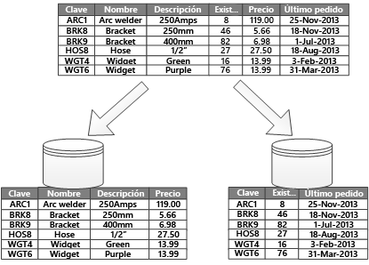

# Creación de particiones de datos

En muchas soluciones a gran escala, los datos se dividen en *particiones* que se pueden administrar y a las que se puede acceder por separado. La creación de particiones puede mejorar la escalabilidad, reducir la contención y optimizar el rendimiento. También puede proporcionar un mecanismo para dividir los datos mediante un patrón de uso. Por ejemplo, puede archivar los datos más antiguos en un nivel de almacenamiento de datos más barato.

Sin embargo, la estrategia de creación de particiones se debe elegir concienzudamente para maximizar los beneficios y minimizar los efectos adversos.

> [!NOTE]
> En este artículo, el término *creación de particiones* hace referencia al proceso de dividir físicamente los datos en almacenes de datos independientes. No es lo mismo que la creación de particiones de tabla de SQL Server.

## ¿Por qué es recomendable crear particiones de datos?

* **Mejorar la escalabilidad**. Al escalar verticalmente un sistema de base de datos única, este podría alcanzar un límite de hardware físico. Si divide los datos en varias particiones, cada una de ellas hospedada en un servidor independiente, puede escalar horizontalmente el sistema de forma casi indefinida.

* **Mejorar el rendimiento**. Las operaciones de acceso a datos en cada partición se realizan en un volumen de datos menor. Si se realiza correctamente, la creación de particiones puede aumentar la eficiencia del sistema. Las operaciones que afectan a más de una partición pueden ejecutarse en paralelo.

* **Mejorar la seguridad**. En algunos casos, puede separar los datos confidenciales y no confidenciales en particiones distintas y aplicar controles de seguridad distintos a los primeros.

* **Proporcionan flexibilidad operativa**. La creación de particiones ofrece muchas oportunidades para ajustar con precisión las operaciones, maximizar la eficacia administrativa y minimizar los costes. Por ejemplo, puede definir diferentes estrategias para la administración, la supervisión, la creación de copias de seguridad y la restauración, así como otras tareas administrativas, en función de la importancia de los datos de cada partición.

* **Adaptación del almacén de datos al patrón de uso**. La creación de particiones permite la implementación de cada partición en un tipo de almacén de datos diferente en función de costo y las características integradas que ofrece el almacén de datos. Por ejemplo, los datos grandes se pueden almacenar en Blob Storage, mientras que los datos más estructurados se pueden conservar en una base de datos de documentos. Consulte [Elección del almacén de datos apropiado](../guide/technology-choices/data-store-overview.md).

* **Mejorar la disponibilidad**. Separar los datos en varios servidores evita un punto único de error. Si se produce un error en una instancia, solo dejarán de estar disponibles los datos de esa partición. Las operaciones en otras particiones pueden continuar. En el caso de los almacenes de datos PaaS administrados, esta consideración es menos pertinente, ya que estos servicios están diseñados con redundancia integrada. 

## Diseño de particiones

Hay tres estrategias típicas para crear particiones de datos:

* **Particiones horizontales** (a menudo denominadas *particionamiento*). En esta estrategia, cada partición es un almacén de datos independiente, pero todas las particiones tienen el mismo esquema. Cada división se conoce como *partición* y contiene un subconjunto específico de los datos, como todos los pedidos de un conjunto específico de clientes.
* **Particiones verticales**. En esta estrategia, cada partición contiene un subconjunto de los campos de elementos del almacén de datos. Los campos se dividen según su patrón de uso. Por ejemplo, los campos a los que se accede con frecuencia pueden colocarse en una partición vertical y los campos que se utilizan más raramente en otra.
* **Creación de particiones funcional**. En esta estrategia, los datos se agregan en función de cómo los usa cada contexto limitado en el sistema. Por ejemplo, un sistema de comercio electrónico puede almacenar los datos de facturas en una partición y los del inventario de productos en otra.

Estas estrategias se pueden combinar y es aconsejable tener todas en cuenta al diseñar un esquema de creación de particiones. Por ejemplo, puede dividir los datos en particiones y, a continuación, usar particiones verticales para subdividir todavía más los datos de cada partición. 

### Creación de particiones horizontales (particionamiento)

En la figura 1 se muestra la creación de particiones horizontales o particionamiento. En este ejemplo, los datos del inventario de productos se dividen en particiones según la clave del producto. Cada partición contiene los datos de un intervalo contiguo de claves de partición (A-G y H-Z), organizadas alfabéticamente.
El particionamiento distribuye la carga entre más equipos, lo que reduce la contención y mejora el rendimiento. 

*Ilustración 1. Creación de particiones horizontales de datos basadas en una clave de partición*

El factor más importante es la elección de una clave de particionamiento. Puede resultar difícil cambiar la clave después de que el sistema está en funcionamiento. La clave debe garantizar que se crean particiones de datos para distribuir la carga de trabajo lo más uniforme posible entre las particiones.

Las particiones no tienen que tener necesariamente el mismo tamaño. Es más importante equilibrar el número de solicitudes. Algunas particiones pueden ser muy grandes, pero cada elemento tener un número bajo de operaciones de acceso. En el caso opuesto, otras particiones podrían ser más pequeñas pero contener un número de elementos a los que se accede con mayor frecuencia. También es importante asegurarse de que una sola partición no supere los límites de escala (en términos de capacidad y recursos de procesamiento) del almacén de datos.

Evite la creación de particiones "calientes" que puedan afectar al rendimiento y a la disponibilidad. Por ejemplo, el uso de la primera letra del nombre de un cliente provoca una distribución desequilibrada, ya que algunas letras son más comunes. En su lugar, use el código hash del identificador de un cliente para distribuir los datos más uniformemente entre las particiones.

Elija una clave de particionamiento que reduzca al mínimo cualquier necesidad futura de dividir particiones grandes, fusionar particiones pequeñas para formar otras mayores o cambiar el esquema. Estas operaciones pueden llevar mucho tiempo y pueden requerir desconectar una o más particiones sin conexión mientras se llevan a cabo.

Si se replican las particiones, debería ser posible conservar algunas de las réplicas en línea mientras otras se dividen, se combinan o se vuelven a configurar. Sin embargo, el sistema podría requerir que se limitaran las operaciones que se pueden realizar durante la reconfiguración. Por ejemplo, los datos de las réplicas podrían marcarse como de solo lectura para evitar incoherencias de datos.

Para más información acerca de la creación de particiones horizontales, consulte [Sharding pattern].

### Particiones verticales

El uso más común del particionamiento vertical es reducir los costes de E/S y de rendimiento asociados a la recopilación de elementos a los que se accede con más frecuencia. La ilustración 2 muestra un ejemplo de creación de particiones verticales. En este ejemplo, las diferentes propiedades de un elemento se almacenan en particiones distintas. Una partición contiene los datos a los que se accede con mayor frecuencia, lo que incluye el nombre, la descripción y el precio de los productos. Otra contiene los datos de inventario: la cantidad en stock y la fecha del último pedido.

*Ilustración 2. Creación de particiones verticales de datos por su patrón de uso*

En este ejemplo, la aplicación consulta periódicamente el nombre del producto, la descripción y el precio al mostrar los detalles de los productos a los clientes. Tanto la cantidad en stock como la fecha del último pedido se almacenan en una partición independiente porque estos dos elementos se suelen utilizar conjuntamente.

Otras ventajas del particionamiento vertical:

- Los datos de movimiento relativamente lento (nombre, descripción y precio del producto) se pueden separar de los datos más dinámicos (nivel de existencias y fecha del último pedido). Los datos de movimiento lento son buenos candidatos para que una aplicación se almacene en la memoria caché.

- La información confidencial se puede almacenar en una partición independiente con controles de seguridad adicionales.

- El particionamiento vertical puede reducir la cantidad de acceso simultáneo necesario.

La creación de particiones verticales funciona a nivel de entidad dentro de un almacén de datos, normalizando parcialmente una entidad para dividirla de un elemento *amplio* en un conjunto de elementos *reducido*. Es ideal para almacenes de datos orientados a columnas como HBase y Cassandra. Si es poco probable que los datos de una colección de columnas cambien, también puede considerar el uso de almacenes de columnas en SQL Server.

### Creación de particiones funcional

Cuando es posible identificar un contexto enlazado para cada área de negocio independiente de una aplicación, la creación de particiones funcional es una forma de mejorar tanto el rendimiento del acceso a los datos como el aislamiento. Otro uso común de la creación de particiones funcional es separar los datos de lectura y escritura de los datos de solo lectura. En la figura 3 se muestra una visión general de la creación de particiones donde se separan los datos de inventario de los datos del cliente.

*Ilustración 3. Creación de particiones de datos funcionalmente por contexto o subdominio vinculado*

Esta estrategia de creación de particiones puede ayudar a reducir la contención de acceso a datos a través de distintas partes de un sistema.

## Diseño de particiones para obtener escalabilidad

Es fundamental considerar el tamaño y la carga de trabajo de cada partición y equilibrarlos para que los datos se distribuyan y logren alcanzar una máxima escalabilidad. Sin embargo, también debe particionar los datos para que no superen los límites de escala de un almacén de una única partición.

Siga estos pasos durante el diseño de particiones para obtener escalabilidad:

1. Analice la aplicación para comprender los patrones de acceso a datos, como el tamaño del conjunto de resultados devuelto por cada consulta, la frecuencia de acceso, la latencia inherente y los requisitos de procesamiento del lado del servidor. En muchos casos, unas cuantas entidades principales exigirán la mayoría de los recursos de procesamiento.
2. Utilice este análisis para determinar los objetivos de escalabilidad actuales y futuros, como el tamaño de los datos y la carga de trabajo. A continuación, distribuya los datos entre las particiones para cumplir el objetivo de escalabilidad. En el caso de la creación de particiones horizontal, es importante elegir la partición correcta para asegurarse de que la distribución es homogénea. Para más información, consulte el [Sharding pattern](Patrón de particionamiento).
3. Asegúrese de que todas las particiones tienen suficientes recursos para controlar los requisitos de escalabilidad en términos de rendimiento y tamaño de datos. En función del almacén de datos, puede haber un límite en la cantidad de espacio de almacenamiento, la potencia de procesamiento o el ancho de banda de red por partición. Si existe la posibilidad de que los requisitos superen estos límites, es posible que tenga que refinar la estrategia de creación de particiones o dividir aún más los datos, con la posibilidad de combinar dos o más estrategias.
4. Supervise el sistema para comprobar que los datos se distribuyen según lo previsto y que las particiones pueden controlar la carga. El uso real no siempre coincide con lo que predice un análisis. En ese caso, se pueden volver a equilibrar las particiones, o bien rediseñar algunas partes del sistema para obtener el equilibrio necesario.

Algunos entornos en la nube asignan recursos en términos de límites de infraestructura. Asegúrese de que los límites seleccionados proporcionen suficiente espacio para cualquier crecimiento previsto en el volumen de datos, en términos de ancho de banda, potencia de procesamiento y almacenamiento de datos.

Por ejemplo, si usa una tabla de almacenamiento de Azure, existe un límite en el volumen de solicitudes que puede controlar una sola partición en un período de tiempo concreto (consulte [Objetivos de escalabilidad y rendimiento de Azure Storage]). Una partición ocupada puede requerir más recursos de los que una sola partición puede controlar. En ese caso, es posible que haya que cambiar las particiones para distribuir la carga. Si el tamaño total o el rendimiento de estas tablas supera la capacidad de una cuenta de almacenamiento, es posible que haya que crear más cuentas de almacenamiento y distribuir las tablas entre ellas. 

## Diseño de particiones para aumentar el rendimiento de las consultas

El rendimiento de las consultas a menudo puede ampliarse mediante el uso de conjuntos de datos más pequeños y la ejecución de consultas en paralelo. Cada partición debe contener una pequeña proporción de todo el conjunto de datos. Esta reducción en el volumen puede mejorar el rendimiento de las consultas. Sin embargo, la partición no es una alternativa para diseñar y configurar una base de datos de forma adecuada. Por ejemplo, asegúrese de que tiene los índices necesarios establecidos.

Al diseñar las particiones para aumentar el rendimiento de las consultas, siga estos pasos:

1. Examine los requisitos de la aplicación y el rendimiento:
   * Use requisitos empresariales para determinar las consultas más importantes que siempre deben ejecutarse rápidamente.
   * Supervise el sistema para identificar las consultas que se ejecutan lentamente.
   * Busque las consultas que se realizan con mayor frecuencia. Aunque una sola consulta tenga un costo mínimo, el consumo acumulado de recursos puede llegar a ser significativo. 

2. Para crear una partición en los datos que están provocando un rendimiento lento, haga lo siguiente:
   * Limitar el tamaño de cada partición para que el tiempo de respuesta de la consulta se encuentre dentro del objetivo.
   * Si usa la creación de particiones horizontales, diseñe la clave de partición de manera que la aplicación pueda seleccionar fácilmente la partición correcta. Esto evita que la consulta tenga que examinar cada partición.
   * Considerar la ubicación de una partición. Si es posible, intente mantener los datos en particiones que estén geográficamente cerca de las aplicaciones y los usuarios que acceden a ellos.

3. Si una entidad tiene requisitos de rendimiento y de rendimiento de consultas, use la creación de particiones funcional basada en esa entidad. Si esto todavía no logra satisfacer los requisitos, aplique también la creación de particiones horizontal. En la mayoría de los casos bastará una estrategia de partición única, pero en algunos casos, resulta más eficaz combinar ambas estrategias.

4. Considere la posibilidad de ejecutar consultas en paralelo entre las particiones para mejorar el rendimiento.

## Diseño de particiones para obtener disponibilidad
Crear particiones de datos puede mejorar la disponibilidad de aplicaciones asegurándose de que todo el conjunto de datos no constituye un punto de error único y que subconjuntos individuales del conjunto de datos pueden administrarse de forma independiente. 

Tenga en cuenta los siguientes factores que afectan a la disponibilidad:

**Lo importante que son los datos para las operaciones empresariales**. Identifique qué datos son información empresarial crítica, como las transacciones, y cuáles son datos operativos menos importantes, como los archivos de registro.

* Considere la posibilidad de almacenar los datos críticos en particiones de alta disponibilidad con un plan de copia de seguridad adecuado.
* Establezca procedimientos de supervisión y administración separados para los diferentes conjuntos de datos. 
* Coloque los datos con el mismo nivel de importancia en la misma partición para que pueda efectuar una copia de seguridad de estos conjuntamente con una frecuencia adecuada. Por ejemplo, es posible que las particiones que contienen datos de transacciones bancarias necesiten copias de seguridad con más frecuencia que las que contienen información de seguimiento o de registro.

**La manera de administrar particiones individuales**. Diseñar particiones para admitir el mantenimiento y administración independientes ofrece varias ventajas. Por ejemplo: 

* Si se produce un error en una partición, puede recuperarse de forma independiente sin aplicaciones que accedan a los datos de otras particiones.
* Es posible que la creación de particiones de datos por área geográfica permita la realización de tareas de mantenimiento programadas en horas de poco tráfico para cada ubicación. Asegúrese de que las particiones no sean demasiado grandes para evitar que se complete cualquier tarea de mantenimiento planeada durante este período.

**Si va a replicar datos críticos en particiones**. Esta estrategia puede mejorar la disponibilidad y el rendimiento, pero también puede originar problemas de coherencia. Se tarda un tiempo en sincronizar los cambios con cada réplica. Durante este período, diferentes particiones contendrán diferentes valores de datos.

## Consideraciones sobre el diseño de aplicaciones

La creación de particiones agrega complejidad al diseño y desarrollo del sistema. Considere la creación de particiones como una parte fundamental del diseño del sistema, incluso si el sistema contiene una única partición inicialmente. Si realiza la creación de particiones a posteriori, será más difícil porque ya tiene un sistema activo que mantener:

- La lógica de acceso a los datos tendrá que modificarse. 
- Es posible que deban migrarse, grandes cantidades de datos para distribuirlas entre las particiones
- Los usuarios esperan poder seguir usando el sistema durante la migración.

En algunos casos, la creación de particiones no se considera importante porque el conjunto de datos inicial es pequeño y puede controlarse fácilmente mediante un solo servidor. Esto puede suceder en algunas cargas de trabajo, pero muchos sistemas comerciales necesitan expandirse a medida que aumenta el número de usuarios. 

Además, los almacenes de datos grandes no son los únicos que se benefician de la creación de particiones. Por ejemplo, es posible que cientos de clientes accedan de manera intensa a un almacén de datos pequeño a la vez. Crear particiones de los datos en esta situación puede ayudar a reducir la contención y a mejorar el rendimiento.

Tenga en cuenta los siguientes puntos cuando se diseña un esquema de partición de datos:

**Minimice las operaciones de acceso de datos entre particiones**. Siempre que sea posible, conserve los datos de las operaciones de base de datos más habituales juntos en cada partición para minimizar las operaciones de acceso a datos entre particiones. La realización de consultas en varias particiones puede ser un proceso más largo que hacerlo en una sola partición, pero la optimización de particiones para un conjunto de consultas puede afectar negativamente a otros conjuntos. Si debe realizar consultas en varias particiones, reduzca el tiempo de consulta mediante la ejecución de consultas en paralelo y la adición de los resultados en la aplicación. (puede que este enfoque podría no sea posible en algunos casos, como cuando el resultado de una consulta se usa en la siguiente).

**Considere la posibilidad de replicar los datos de referencia estáticos.** Si las consultas usan datos de referencia relativamente estáticos, como tablas de códigos postales o listas de productos, considere la posibilidad de replicarlos en todas las particiones para reducir la realización de diferentes operaciones de búsqueda en las distintas particiones. Este enfoque también puede reducir la probabilidad de que los datos de referencia se conviertan en un conjunto de datos excesivamente activo con un tráfico intenso desde las diferentes partes del sistema. Sin embargo, la sincronización de cualquier cambio en los datos de referencia supone un costo adicional.

**Minimice las combinaciones entre particiones.** Siempre que sea posible, minimice los requisitos de integridad referencial en las particiones verticales y funcionales. En estos esquemas, la aplicación es responsable de mantener la integridad referencial entre las particiones. Las consultas que combinan no son eficaces, ya que la aplicación normalmente necesita realizar consultas consecutivas basadas en una clave y, luego, en una clave externa. En su lugar, considere la posibilidad de replicar o anular la normalización de los datos pertinentes. Si las combinaciones entre particiones son necesarias, ejecute consultas en paralelo en las particiones y combine los datos dentro de la aplicación.

**Adoptar coherencia definitiva** Evalúe si realmente es necesaria una alta coherencia. Un enfoque común en los sistemas distribuidos es implementar la coherencia eventual. Los datos de cada partición se actualizan por separado, y la lógica de aplicación garantiza que todas las actualizaciones se completen correctamente. También controla las incoherencias que pueden surgir de la consulta de datos mientras se esté ejecutando una operación finalmente coherente. 

**Tenga en cuenta cómo buscan las consultas la partición correcta**. Si una consulta debe analizar todas las particiones para localizar los datos necesarios, habrá un impacto significativo en el rendimiento, incluso cuando se ejecuten varias consultas en paralelo. Con la creación de particiones verticales y funcionales, las consultas pueden especificar la partición de manera natural. Por otra parte, la creación de partición horizontal puede dificultar la búsqueda de elementos, ya que todas las particiones tienen el mismo esquema. Una solución típica para mantener una asignación que se usa para buscar la ubicación de la partición para elementos concretos. Esta asignación puede implementarse en la lógica de particionamiento de la aplicación o mantenerse por el almacén de datos si admite el particionamiento transparente.

**Considere la posibilidad de reequilibrar periódicamente las particiones**. Con la creación de particiones horizontales, el reequilibrado de particiones puede ayudar a distribuir los datos uniformemente por tamaño y por carga de trabajo para minimizar las zonas excesivamente activas, maximizar el rendimiento de las consultas y evitar las limitaciones de almacenamiento físico. Sin embargo, esta es una tarea compleja que requiere a menudo el uso de una herramienta personalizada o un proceso. 

**Replique las particiones.** Si replica todas las particiones, se proporciona protección adicional frente a errores. Si se produce un error en una única réplica, las consultas se pueden dirigir hacia una copia de trabajo.

**Si se alcanzan los límites físicos de una estrategia de creación de particiones, es posible que necesite ampliar la escalabilidad a un nivel diferente**. Por ejemplo, si la creación de particiones se produce en el nivel de base de datos, puede que tenga que buscar o replicar las particiones en varias bases de datos. Si la creación de particiones ya está al nivel de la base de datos y las limitaciones físicas son un problema, quizá tenga que ubicar o replicar particiones en varias cuentas de hospedaje.

**Evite las transacciones que accedan a datos en varias particiones**. Algunos almacenes de datos implementan la coherencia transaccional y la integridad de las operaciones que modifican datos, pero solo cuando los datos se encuentran en una sola partición. Si necesita compatibilidad transaccional en varias particiones, probablemente necesitará implementar esto como parte de la lógica de la aplicación, porque la mayoría de los sistemas de creación de particiones no proporcionan compatibilidad nativa.

Todos los almacenes de datos requieren algunas operaciones de administración operativa y de supervisión de las actividades. Las tareas pueden oscilar entre la carga de datos, la realización de copias de seguridad y la restauración de datos, la reorganización de datos y asegurarse de que el sistema funciona de manera correcta y eficaz.

Tenga en cuenta los siguientes factores que afectan a la administración operativa:

* **Cómo implementar las tareas operativas y de administración adecuadas cuando se crean particiones en los datos**. Estas tareas pueden incluir la realización de copias de seguridad y su restauración, el archivado de datos, la supervisión del sistema y otras tareas administrativas. Por ejemplo, mantener la coherencia lógica durante las operaciones de copia de seguridad y restauración puede ser un desafío.
* **Cómo cargar los datos en varias particiones y agregar datos nuevos que llegan desde otros orígenes**. Algunas herramientas y utilidades podrían no admitir operaciones de datos con particiones, como la carga de datos en la partición correcta. 
* **Cómo archivar y eliminar los datos de forma periódica**. Para evitar un aumento excesivo de las particiones, debe archivar y eliminar datos de forma regular (quizás mensualmente). Puede ser necesario transformar los datos para que se adapten a un esquema de almacenamiento diferente.
* **Cómo localizar problemas de integridad de datos**. Considere la posibilidad de ejecutar un proceso periódico para localizar cualquier problema de integridad de datos; por ejemplo, la existencia de datos en una partición que hacen referencia a una información que falta en otra. El proceso puede intentar corregir estos problemas automáticamente o simplemente generar un informe para su revisión manual. 

## Reequilibrio de particiones

Cuando un sistema madure es posible que tenga que ajustar el esquema de partición. Por ejemplo, las particiones individuales pueden empezar a recibir un volumen de tráfico desproporcionado y ser demasiado activas, lo que provocaría una contención excesiva. O bien, es posible que haya subestimado el volumen de datos de algunas particiones, lo que provoca que varias se aproximen a su límite de capacidad. 

Algunos almacenes de datos, como Cosmos DB, pueden reequilibrar automáticamente las particiones. En otros casos, el reequilibrio es una tarea administrativa que consta de dos fases:

1. Determine una nueva estrategia de creación de particiones. 

    - ¿Qué particiones se deben dividir (o posiblemente combinar)? 
    - ¿Cuál es la nueva clave de partición?

2. Migre los datos del esquema de partición antiguo al nuevo conjunto de particiones.

En función del almacén de datos, puede migrar datos entre particiones mientras estén en uso. Esto se denomina *migración en línea*. Si esto no es posible, es posible que tenga que anular la disponibilidad de las particiones mientras se cambia la ubicación de los datos (*migración sin conexión*).

### Migración sin conexión

La migración sin conexión suele ser más sencilla, ya que reduce las posibilidades de que se produzca contención. Conceptualmente, la migración sin conexión funciona del siguiente modo:

1. Marcar la partición sin conexión.
2. Dividir, combinar y mover los datos a las nuevas particiones.
3. Comprobar los datos.
4. Conectar las nuevas particiones.
5. Quitar la partición antigua.

Si lo desea, puede marcar una partición como de solo lectura en el paso 1, para que las aplicaciones pueden leer los datos mientras se mueven.

## Migración en línea

La migración en línea es más difícil de realizar, pero menos problemática. El proceso es similar a la migración sin conexión, salvo que la partición original no se marca como sin conexión. En función de la granularidad del proceso de migración (por ejemplo, elemento por elemento frente a partición por partición), es posible que el código de acceso a datos de las aplicaciones cliente tenga que controlar la lectura y escritura de los datos que se encuentran en dos ubicaciones, la partición original y la nueva partición.

## Patrones relacionados 

Los siguientes patrones de diseño pueden ser importantes para su escenario:

* El [Sharding pattern] describe algunas estrategias comunes para los datos de particionamiento.
* El [patrón de tabla de índice] muestra cómo crear índices secundarios de los datos. Con este enfoque, una aplicación puede recuperar rápidamente los datos mediante el uso de consultas que no hacen referencia a la clave principal de una colección.
* El [Materialized View Pattern] describe cómo generar vistas rellenadas previamente que resuman los datos para dar soporte a las operaciones de consulta rápida. Este enfoque puede ser útil en un almacén de datos con particiones si las particiones que contienen los datos que se resumen se distribuyen entre varios sitios.

## Pasos siguientes

- Obtenga información acerca de las estrategias de creación de particiones de servicios concretos de Azure. Consulte [Estrategias de creación de particiones de datos](./data-partitioning-strategies.md)

[Objetivos de escalabilidad y rendimiento de Azure Storage]: /azure/storage/storage-scalability-targets
[patrón de tabla de índice]: ../patterns/index-table.md
[Materialized View Pattern]: ../patterns/materialized-view.md
[Sharding pattern]: ../patterns/sharding.md
