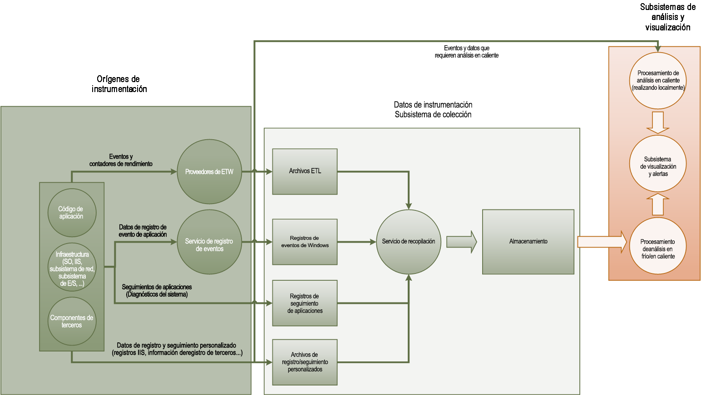
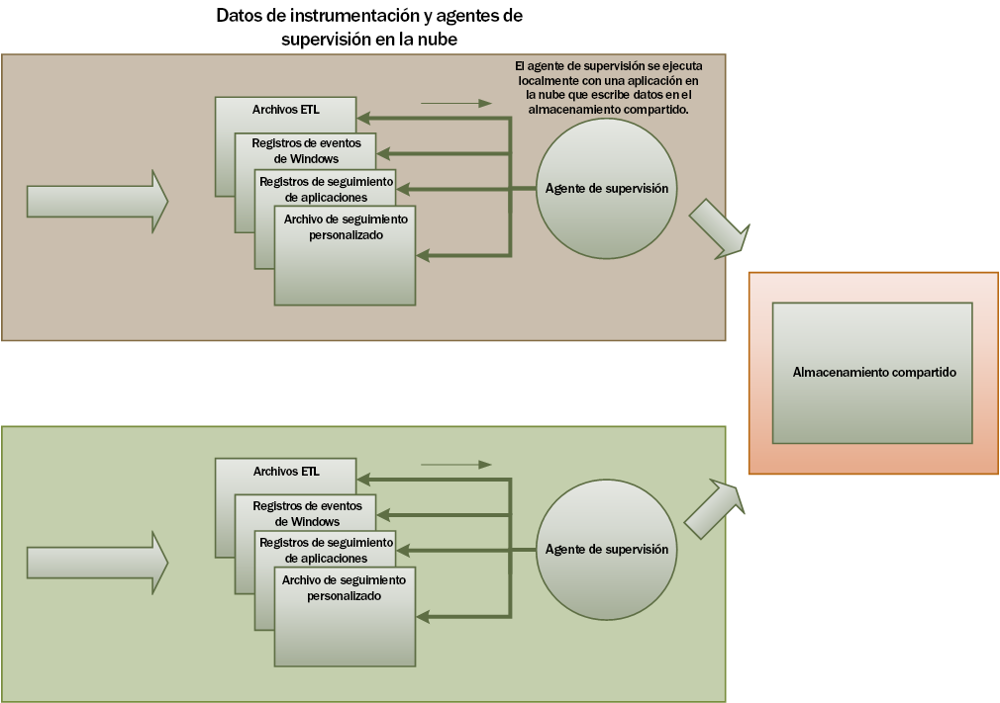
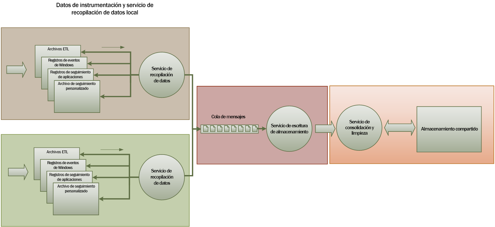
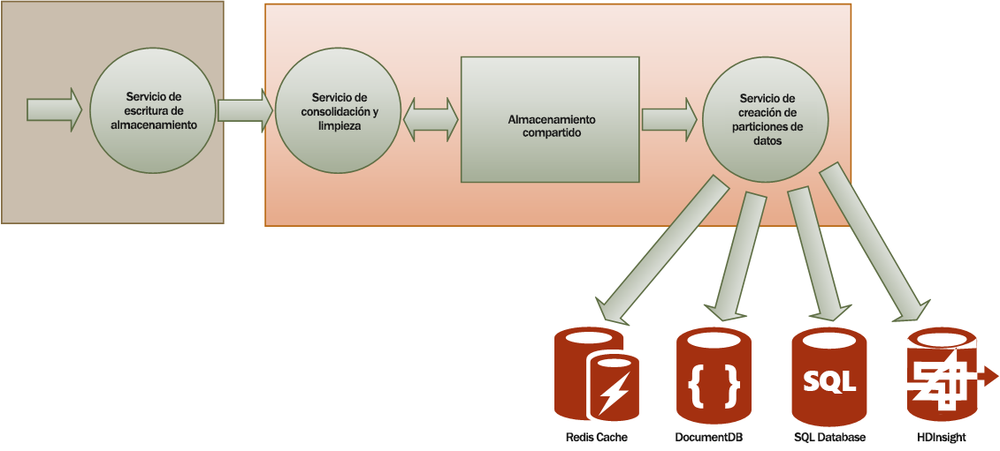

# <a name="monitoring-and-diagnostics"></a><span data-ttu-id="5c0cc-103">Supervisión y diagnóstico</span><span class="sxs-lookup"><span data-stu-id="5c0cc-103">Monitoring and diagnostics</span></span>
[!INCLUDE [header](../_includes/header.md)]

<span data-ttu-id="5c0cc-104">Las aplicaciones distribuidas y los servicios que se ejecutan en la nube son, por naturaleza, complejos fragmentos de software que se componen de muchas partes móviles.</span><span class="sxs-lookup"><span data-stu-id="5c0cc-104">Distributed applications and services running in the cloud are, by their nature, complex pieces of software that comprise many moving parts.</span></span> <span data-ttu-id="5c0cc-105">En un entorno de producción, es importante poder hacer un seguimiento de la forma en que los usuarios usan el sistema y de la utilización de recursos, y supervisar en general el estado y el rendimiento del sistema.</span><span class="sxs-lookup"><span data-stu-id="5c0cc-105">In a production environment, it's important to be able to track the way in which users utilize your system, trace resource utilization, and generally monitor the health and performance of your system.</span></span> <span data-ttu-id="5c0cc-106">Esta información se puede usar como herramienta de diagnóstico para detectar y corregir problemas y para ayudar a detectarlos antes de que se produzcan.</span><span class="sxs-lookup"><span data-stu-id="5c0cc-106">You can use this information as a diagnostic aid to detect and correct issues, and also to help spot potential problems and prevent them from occurring.</span></span>

## <a name="monitoring-and-diagnostics-scenarios"></a><span data-ttu-id="5c0cc-107">Escenarios de supervisión y diagnósticos</span><span class="sxs-lookup"><span data-stu-id="5c0cc-107">Monitoring and diagnostics scenarios</span></span>
<span data-ttu-id="5c0cc-108">Puede usar la supervisión para obtener información detallada sobre cómo funciona un sistema.</span><span class="sxs-lookup"><span data-stu-id="5c0cc-108">You can use monitoring to gain an insight into how well a system is functioning.</span></span> <span data-ttu-id="5c0cc-109">La supervisión es una parte fundamental en el mantenimiento de los objetivos de calidad de servicio.</span><span class="sxs-lookup"><span data-stu-id="5c0cc-109">Monitoring is a crucial part of maintaining quality-of-service targets.</span></span> <span data-ttu-id="5c0cc-110">La recopilación de datos de supervisión puede usarse en las siguientes situaciones:</span><span class="sxs-lookup"><span data-stu-id="5c0cc-110">Common scenarios for collecting monitoring data include:</span></span>

* <span data-ttu-id="5c0cc-111">Garantizar que el sistema esté en buen estado.</span><span class="sxs-lookup"><span data-stu-id="5c0cc-111">Ensuring that the system remains healthy.</span></span>
* <span data-ttu-id="5c0cc-112">Realizar un seguimiento de la disponibilidad del sistema y sus elementos componentes.</span><span class="sxs-lookup"><span data-stu-id="5c0cc-112">Tracking the availability of the system and its component elements.</span></span>
* <span data-ttu-id="5c0cc-113">Mantener el rendimiento para garantizar que el procesamiento del sistema no se degrada inesperadamente a medida que el volumen de trabajo aumenta.</span><span class="sxs-lookup"><span data-stu-id="5c0cc-113">Maintaining performance to ensure that the throughput of the system does not degrade unexpectedly as the volume of work increases.</span></span>
* <span data-ttu-id="5c0cc-114">Garantizar que el sistema satisface los contratos de nivel de servicio (SLA) establecidos con los clientes.</span><span class="sxs-lookup"><span data-stu-id="5c0cc-114">Guaranteeing that the system meets any service-level agreements (SLAs) established with customers.</span></span>
* <span data-ttu-id="5c0cc-115">Proteger la privacidad y la seguridad del sistema, los usuarios y sus datos.</span><span class="sxs-lookup"><span data-stu-id="5c0cc-115">Protecting the privacy and security of the system, users, and their data.</span></span>
* <span data-ttu-id="5c0cc-116">Realizar un seguimiento de las operaciones que se llevan a cabo como auditoría para fines normativos.</span><span class="sxs-lookup"><span data-stu-id="5c0cc-116">Tracking the operations that are performed for auditing or regulatory purposes.</span></span>
* <span data-ttu-id="5c0cc-117">Supervisar el uso diario del sistema e identificar las tendencias que podrían conducir a problemas a fin de actuar con anticipación.</span><span class="sxs-lookup"><span data-stu-id="5c0cc-117">Monitoring the day-to-day usage of the system and spotting trends that might lead to problems if they're not addressed.</span></span>
* <span data-ttu-id="5c0cc-118">Realizar un seguimiento de los problemas que se producen, desde el informe inicial al análisis de las causas posibles, su rectificación, las actualizaciones de software pertinentes y la implementación.</span><span class="sxs-lookup"><span data-stu-id="5c0cc-118">Tracking issues that occur, from initial report through to analysis of possible causes, rectification, consequent software updates, and deployment.</span></span>
* <span data-ttu-id="5c0cc-119">Realizar un seguimiento de las operaciones y depurar las versiones de software.</span><span class="sxs-lookup"><span data-stu-id="5c0cc-119">Tracing operations and debugging software releases.</span></span>

> [!NOTE]
> <span data-ttu-id="5c0cc-120">Esta lista no pretende ser exhaustiva.</span><span class="sxs-lookup"><span data-stu-id="5c0cc-120">This list is not intended to be comprehensive.</span></span> <span data-ttu-id="5c0cc-121">Este documento se centra en estos escenarios, en cuanto que son las situaciones más comunes para la ejecución de la supervisión.</span><span class="sxs-lookup"><span data-stu-id="5c0cc-121">This document focuses on these scenarios as the most common situations for performing monitoring.</span></span> <span data-ttu-id="5c0cc-122">Puede haber otros menos comunes o que sean específicos de su entorno.</span><span class="sxs-lookup"><span data-stu-id="5c0cc-122">There might be others that are less common or are specific to your environment.</span></span>
> 
> 

<span data-ttu-id="5c0cc-123">En las siguientes secciones se describen estas configuraciones con más detalle.</span><span class="sxs-lookup"><span data-stu-id="5c0cc-123">The following sections describe these scenarios in more detail.</span></span> <span data-ttu-id="5c0cc-124">La información para cada escenario se describe en el siguiente formato:</span><span class="sxs-lookup"><span data-stu-id="5c0cc-124">The information for each scenario is discussed in the following format:</span></span>

1. <span data-ttu-id="5c0cc-125">Una breve descripción del escenario.</span><span class="sxs-lookup"><span data-stu-id="5c0cc-125">A brief overview of the scenario</span></span>
2. <span data-ttu-id="5c0cc-126">Los requisitos típicos de este escenario.</span><span class="sxs-lookup"><span data-stu-id="5c0cc-126">The typical requirements of this scenario</span></span>
3. <span data-ttu-id="5c0cc-127">Los datos de instrumentación sin procesar necesarios para permitir el escenario y los posibles orígenes de esta información.</span><span class="sxs-lookup"><span data-stu-id="5c0cc-127">The raw instrumentation data that's required to support the scenario, and possible sources of this information</span></span>
4. <span data-ttu-id="5c0cc-128">Cómo pueden analizarse y combinarse estos datos sin procesar para generar información de diagnóstico significativa.</span><span class="sxs-lookup"><span data-stu-id="5c0cc-128">How this raw data can be analyzed and combined to generate meaningful diagnostic information</span></span>

## <a name="health-monitoring"></a><span data-ttu-id="5c0cc-129">Supervisión del estado</span><span class="sxs-lookup"><span data-stu-id="5c0cc-129">Health monitoring</span></span>
<span data-ttu-id="5c0cc-130">Un sistema es correcto si está en funcionamiento y es capaz de procesar solicitudes.</span><span class="sxs-lookup"><span data-stu-id="5c0cc-130">A system is healthy if it is running and capable of processing requests.</span></span> <span data-ttu-id="5c0cc-131">El propósito del seguimiento de estado es generar una instantánea del estado actual del sistema que le permita comprobar que todos los componentes del sistema funcionan según lo previsto.</span><span class="sxs-lookup"><span data-stu-id="5c0cc-131">The purpose of health monitoring is to generate a snapshot of the current health of the system so that you can verify that all components of the system are functioning as expected.</span></span>

### <a name="requirements-for-health-monitoring"></a><span data-ttu-id="5c0cc-132">Requisitos para la supervisión del estado</span><span class="sxs-lookup"><span data-stu-id="5c0cc-132">Requirements for health monitoring</span></span>
<span data-ttu-id="5c0cc-133">Un operador debe recibir una alerta rápidamente (en cuestión de segundos) si se considera que cualquier parte del sistema tiene un estado incorrecto.</span><span class="sxs-lookup"><span data-stu-id="5c0cc-133">An operator should be alerted quickly (within a matter of seconds) if any part of the system is deemed to be unhealthy.</span></span> <span data-ttu-id="5c0cc-134">El operador debe ser capaz de determinar las partes del sistema que funcionan con normalidad y las partes que tienen problemas.</span><span class="sxs-lookup"><span data-stu-id="5c0cc-134">The operator should be able to ascertain which parts of the system are functioning normally, and which parts are experiencing problems.</span></span> <span data-ttu-id="5c0cc-135">El mantenimiento del sistema se puede señalizar mediante el uso de un semáforo:</span><span class="sxs-lookup"><span data-stu-id="5c0cc-135">System health can be highlighted through a traffic-light system:</span></span>

* <span data-ttu-id="5c0cc-136">Rojo para incorrecto (se ha detenido el sistema)</span><span class="sxs-lookup"><span data-stu-id="5c0cc-136">Red for unhealthy (the system has stopped)</span></span>
* <span data-ttu-id="5c0cc-137">Amarillo para parcialmente correcto (el sistema se ejecuta con funcionalidad reducida)</span><span class="sxs-lookup"><span data-stu-id="5c0cc-137">Yellow for partially healthy (the system is running with reduced functionality)</span></span>
* <span data-ttu-id="5c0cc-138">Verde para completamente correcto</span><span class="sxs-lookup"><span data-stu-id="5c0cc-138">Green for completely healthy</span></span>

<span data-ttu-id="5c0cc-139">Un completo sistema de supervisión del estado permite que un operador explore en profundidad el sistema para ver el estado de los subsistemas y componentes.</span><span class="sxs-lookup"><span data-stu-id="5c0cc-139">A comprehensive health-monitoring system enables an operator to drill down through the system to view the health status of subsystems and components.</span></span> <span data-ttu-id="5c0cc-140">Por ejemplo, si el sistema global se representa como parcialmente correcto, el operador debe ser capaz de profundizar y determinar la funcionalidad que no está disponible actualmente.</span><span class="sxs-lookup"><span data-stu-id="5c0cc-140">For example, if the overall system is depicted as partially healthy, the operator should be able to zoom in and determine which functionality is currently unavailable.</span></span>

### <a name="data-sources-instrumentation-and-data-collection-requirements"></a><span data-ttu-id="5c0cc-141">Requisitos de recopilación de datos, instrumentación y orígenes de datos</span><span class="sxs-lookup"><span data-stu-id="5c0cc-141">Data sources, instrumentation, and data-collection requirements</span></span>
<span data-ttu-id="5c0cc-142">Los datos sin procesar necesarios para permitir el seguimiento de estado pueden generarse como resultado de:</span><span class="sxs-lookup"><span data-stu-id="5c0cc-142">The raw data that's required to support health monitoring can be generated as a result of:</span></span>

* <span data-ttu-id="5c0cc-143">El seguimiento de la ejecución de las solicitudes de los usuarios.</span><span class="sxs-lookup"><span data-stu-id="5c0cc-143">Tracing execution of user requests.</span></span> <span data-ttu-id="5c0cc-144">Esta información puede usarse para determinar las solicitudes que se realizaron correctamente, las que produjeron un error y cuánto tiempo tarda cada solicitud.</span><span class="sxs-lookup"><span data-stu-id="5c0cc-144">This information can be used to determine which requests have succeeded, which have failed, and how long each request takes.</span></span>
* <span data-ttu-id="5c0cc-145">Supervisión de usuarios sintéticos.</span><span class="sxs-lookup"><span data-stu-id="5c0cc-145">Synthetic user monitoring.</span></span> <span data-ttu-id="5c0cc-146">Este proceso simula los pasos que realiza un usuario y sigue una serie predefinida de pasos.</span><span class="sxs-lookup"><span data-stu-id="5c0cc-146">This process simulates the steps performed by a user and follows a predefined series of steps.</span></span> <span data-ttu-id="5c0cc-147">Se deben capturar los resultados de cada paso.</span><span class="sxs-lookup"><span data-stu-id="5c0cc-147">The results of each step should be captured.</span></span>
* <span data-ttu-id="5c0cc-148">El registro de excepciones, errores y advertencias.</span><span class="sxs-lookup"><span data-stu-id="5c0cc-148">Logging exceptions, faults, and warnings.</span></span> <span data-ttu-id="5c0cc-149">Esta información se puede capturar como resultado de las instrucciones de seguimiento insertadas en el código de la aplicación, o mediante la recuperación de información de los registros de eventos de cualquier servicio al que el sistema haga referencia.</span><span class="sxs-lookup"><span data-stu-id="5c0cc-149">This information can be captured as a result of trace statements embedded into the application code, as well as retrieving information from the event logs of any services that the system references.</span></span>
* <span data-ttu-id="5c0cc-150">Seguimiento del estado de los servicios de terceros que usa el sistema.</span><span class="sxs-lookup"><span data-stu-id="5c0cc-150">Monitoring the health of any third-party services that the system uses.</span></span> <span data-ttu-id="5c0cc-151">Este seguimiento podría requerir la supervisión y el análisis de los datos de mantenimiento que suministran estos servicios.</span><span class="sxs-lookup"><span data-stu-id="5c0cc-151">This monitoring might require retrieving and parsing health data that these services supply.</span></span> <span data-ttu-id="5c0cc-152">Esta información puede adoptar diversos formatos.</span><span class="sxs-lookup"><span data-stu-id="5c0cc-152">This information might take a variety of formats.</span></span>
* <span data-ttu-id="5c0cc-153">Supervisión de extremos.</span><span class="sxs-lookup"><span data-stu-id="5c0cc-153">Endpoint monitoring.</span></span> <span data-ttu-id="5c0cc-154">Este mecanismo se describe con más detalle en la sección Supervisión de la disponibilidad.</span><span class="sxs-lookup"><span data-stu-id="5c0cc-154">This mechanism is described in more detail in the "Availability monitoring" section.</span></span>
* <span data-ttu-id="5c0cc-155">Recopilación de la información de rendimiento del ambiente, como el uso de la CPU en segundo plano o la actividad de E/S (incluida la red).</span><span class="sxs-lookup"><span data-stu-id="5c0cc-155">Collecting ambient performance information, such as background CPU utilization or I/O (including network) activity.</span></span>

### <a name="analyzing-health-data"></a><span data-ttu-id="5c0cc-156">Análisis de los datos de estado</span><span class="sxs-lookup"><span data-stu-id="5c0cc-156">Analyzing health data</span></span>
<span data-ttu-id="5c0cc-157">El objetivo principal de la supervisión del estado es indicar rápidamente si el sistema está en ejecución.</span><span class="sxs-lookup"><span data-stu-id="5c0cc-157">The primary focus of health monitoring is to quickly indicate whether the system is running.</span></span> <span data-ttu-id="5c0cc-158">El análisis en caliente de los datos inmediatos puede desencadenar una alerta si un componente crítico se detecta como incorrecto.</span><span class="sxs-lookup"><span data-stu-id="5c0cc-158">Hot analysis of the immediate data can trigger an alert if a critical component is detected as unhealthy.</span></span> <span data-ttu-id="5c0cc-159">(Por ejemplo, no puede responder a una serie consecutiva de pings). El operador puede entonces tomar la acción correctiva apropiada.</span><span class="sxs-lookup"><span data-stu-id="5c0cc-159">(It fails to respond to a consecutive series of pings, for example.) The operator can then take the appropriate corrective action.</span></span>

<span data-ttu-id="5c0cc-160">Un sistema más avanzado podría incluir un elemento predictivo que realiza un análisis en frío de las cargas de trabajo actuales y recientes.</span><span class="sxs-lookup"><span data-stu-id="5c0cc-160">A more advanced system might include a predictive element that performs a cold analysis over recent and current workloads.</span></span> <span data-ttu-id="5c0cc-161">Un análisis en frío puede detectar tendencias y determinar la probabilidad de que el sistema se mantenga en buen estado o de que necesite recursos adicionales.</span><span class="sxs-lookup"><span data-stu-id="5c0cc-161">A cold analysis can spot trends and determine whether the system is likely to remain healthy or whether the system will need additional resources.</span></span> <span data-ttu-id="5c0cc-162">Este elemento predictivo debe basarse en métricas de rendimiento críticas, como por ejemplo:</span><span class="sxs-lookup"><span data-stu-id="5c0cc-162">This predictive element should be based on critical performance metrics, such as:</span></span>

* <span data-ttu-id="5c0cc-163">La tasa de solicitudes dirigidas en cada servicio o subsistema.</span><span class="sxs-lookup"><span data-stu-id="5c0cc-163">The rate of requests directed at each service or subsystem.</span></span>
* <span data-ttu-id="5c0cc-164">Los tiempos de respuesta de estas solicitudes.</span><span class="sxs-lookup"><span data-stu-id="5c0cc-164">The response times of these requests.</span></span>
* <span data-ttu-id="5c0cc-165">El volumen de datos que fluyen dentro y fuera de cada servicio.</span><span class="sxs-lookup"><span data-stu-id="5c0cc-165">The volume of data flowing into and out of each service.</span></span>

<span data-ttu-id="5c0cc-166">Si el valor de cualquier métrica supera un umbral definido, el sistema puede generar una alerta para avisar a un operador o escalarse automáticamente (si esta opción está disponible) con el fin de realizar las acciones preventivas necesarias para mantener el estado del sistema.</span><span class="sxs-lookup"><span data-stu-id="5c0cc-166">If the value of any metric exceeds a defined threshold, the system can raise an alert to enable an operator or autoscaling (if available) to take the preventative actions necessary to maintain system health.</span></span> <span data-ttu-id="5c0cc-167">Estas acciones pueden implicar que se agreguen recursos, se reinicie uno o varios servicios que no funcionen correctamente o se aplique una limitación a las solicitudes de menor prioridad.</span><span class="sxs-lookup"><span data-stu-id="5c0cc-167">These actions might involve adding resources, restarting one or more services that are failing, or applying throttling to lower-priority requests.</span></span>

## <a name="availability-monitoring"></a><span data-ttu-id="5c0cc-168">Supervisión de la disponibilidad</span><span class="sxs-lookup"><span data-stu-id="5c0cc-168">Availability monitoring</span></span>
<span data-ttu-id="5c0cc-169">Un sistema con un estado verdaderamente correcto requiere que los componentes y los subsistemas que lo constituyen estén disponibles.</span><span class="sxs-lookup"><span data-stu-id="5c0cc-169">A truly healthy system requires that the components and subsystems that compose the system are available.</span></span> <span data-ttu-id="5c0cc-170">La supervisión de la disponibilidad está estrechamente relacionada con el seguimiento de estado.</span><span class="sxs-lookup"><span data-stu-id="5c0cc-170">Availability monitoring is closely related to health monitoring.</span></span> <span data-ttu-id="5c0cc-171">Mientras que el seguimiento de estado proporciona una vista inmediata del estado actual del sistema, la supervisión de la disponibilidad se ocupa de realizar un seguimiento de la disponibilidad del sistema y sus componentes para generar estadísticas sobre el tiempo de actividad del sistema.</span><span class="sxs-lookup"><span data-stu-id="5c0cc-171">But whereas health monitoring provides an immediate view of the current health of the system, availability monitoring is concerned with tracking the availability of the system and its components to generate statistics about the uptime of the system.</span></span>

<span data-ttu-id="5c0cc-172">En muchos sistemas, algunos componentes (por ejemplo, una base de datos) se configuran con redundancia integrada para permitir una rápida conmutación por error si se produce un error grave o una pérdida de conectividad.</span><span class="sxs-lookup"><span data-stu-id="5c0cc-172">In many systems, some components (such as a database) are configured with built-in redundancy to permit rapid failover in the event of a serious fault or loss of connectivity.</span></span> <span data-ttu-id="5c0cc-173">Lo ideal es que los usuarios no sean conscientes de que se ha producido un error de este tipo.</span><span class="sxs-lookup"><span data-stu-id="5c0cc-173">Ideally, users should not be aware that such a failure has occurred.</span></span> <span data-ttu-id="5c0cc-174">Pero desde una perspectiva de la supervisión de disponibilidad, es necesario recopilar toda la información posible sobre estos errores para determinar la causa y adoptar las medidas necesarias para evitar que se repita.</span><span class="sxs-lookup"><span data-stu-id="5c0cc-174">But from an availability monitoring perspective, it's necessary to gather as much information as possible about such failures to determine the cause and take corrective actions to prevent them from recurring.</span></span>

<span data-ttu-id="5c0cc-175">Los datos que se necesitan para realizar un seguimiento de la disponibilidad podrían depender de una serie de factores de nivel inferior.</span><span class="sxs-lookup"><span data-stu-id="5c0cc-175">The data that's required to track availability might depend on a number of lower-level factors.</span></span> <span data-ttu-id="5c0cc-176">Muchos de estos factores podrían ser específicos de la aplicación, el sistema y el entorno.</span><span class="sxs-lookup"><span data-stu-id="5c0cc-176">Many of these factors might be specific to the application, system, and environment.</span></span> <span data-ttu-id="5c0cc-177">Un sistema de supervisión eficaz captura los datos de disponibilidad que corresponden a esos factores de bajo nivel y, después, los agrupa para ofrecer una visión general del sistema.</span><span class="sxs-lookup"><span data-stu-id="5c0cc-177">An effective monitoring system captures the availability data that corresponds to these low-level factors and then aggregates them to give an overall picture of the system.</span></span> <span data-ttu-id="5c0cc-178">Por ejemplo, en un sistema de comercio electrónico, la funcionalidad empresarial que permite que un cliente realice pedidos puede depender del repositorio en que se almacenan los detalles del pedido y del sistema de pago que controla las transacciones monetarias para pagar dichos pedidos.</span><span class="sxs-lookup"><span data-stu-id="5c0cc-178">For example, in an e-commerce system, the business functionality that enables a customer to place orders might depend on the repository where order details are stored and the payment system that handles the monetary transactions for paying for these orders.</span></span> <span data-ttu-id="5c0cc-179">La disponibilidad de la parte de realización de pedidos del sistema es, por tanto, una función de la disponibilidad del repositorio y del subsistema de pago.</span><span class="sxs-lookup"><span data-stu-id="5c0cc-179">The availability of the order-placement part of the system is therefore a function of the availability of the repository and the payment subsystem.</span></span>

### <a name="requirements-for-availability-monitoring"></a><span data-ttu-id="5c0cc-180">Requisitos para la supervisión de la disponibilidad</span><span class="sxs-lookup"><span data-stu-id="5c0cc-180">Requirements for availability monitoring</span></span>
<span data-ttu-id="5c0cc-181">Un operador también debería poder ver el histórico de disponibilidad de cada sistema y subsistema y usar esta información para identificar las tendencias que podrían ocasionar errores periódicos en uno o varios subsistemas.</span><span class="sxs-lookup"><span data-stu-id="5c0cc-181">An operator should also be able to view the historical availability of each system and subsystem, and use this information to spot any trends that might cause one or more subsystems to periodically fail.</span></span> <span data-ttu-id="5c0cc-182">(¿Los servicios comienzan a dar problemas a una determinada hora del día que corresponde a las horas de procesamiento máximo?)</span><span class="sxs-lookup"><span data-stu-id="5c0cc-182">(Do services start to fail at a particular time of day that corresponds to peak processing hours?)</span></span>

<span data-ttu-id="5c0cc-183">Una solución de supervisión debe proporcionar una vista inmediata e histórica de la disponibilidad o no disponibilidad de cada subsistema.</span><span class="sxs-lookup"><span data-stu-id="5c0cc-183">A monitoring solution should provide an immediate and historical view of the availability or unavailability of each subsystem.</span></span> <span data-ttu-id="5c0cc-184">También debe ser capaz de alertar rápidamente a un operador cuando uno o más servicios produzcan errores o cuando los usuarios no pueden conectarse a los servicios.</span><span class="sxs-lookup"><span data-stu-id="5c0cc-184">It should also be capable of quickly alerting an operator when one or more services fail or when users can't connect to services.</span></span> <span data-ttu-id="5c0cc-185">No es solo cuestión de supervisar cada servicio, sino también de examinar las acciones que los usuarios realizan si estas acciones producen un error al intentar comunicarse con un servicio.</span><span class="sxs-lookup"><span data-stu-id="5c0cc-185">This is a matter of not only monitoring each service, but also examining the actions that each user performs if these actions fail when they attempt to communicate with a service.</span></span> <span data-ttu-id="5c0cc-186">En cierta medida, un cierto grado de error en la conectividad es normal y podría deberse a errores transitorios.</span><span class="sxs-lookup"><span data-stu-id="5c0cc-186">To some extent, a degree of connectivity failure is normal and might be due to transient errors.</span></span> <span data-ttu-id="5c0cc-187">Pero podría ser útil permitir que el sistema genere una alerta por el número de errores de conectividad en un subsistema especificado que se produzcan durante un período determinado.</span><span class="sxs-lookup"><span data-stu-id="5c0cc-187">But it might be useful to allow the system to raise an alert for the number of connectivity failures to a specified subsystem that occur during a specific period.</span></span>

### <a name="data-sources-instrumentation-and-data-collection-requirements"></a><span data-ttu-id="5c0cc-188">Requisitos de recopilación de datos, instrumentación y orígenes de datos</span><span class="sxs-lookup"><span data-stu-id="5c0cc-188">Data sources, instrumentation, and data-collection requirements</span></span>
<span data-ttu-id="5c0cc-189">Al igual que con el seguimiento de estado, los datos sin procesar necesarios para permitir la supervisión de la disponibilidad pueden generarse como resultado de la supervisión de usuarios sintéticos y el registro de las excepciones, los errores y las advertencias que puedan producirse.</span><span class="sxs-lookup"><span data-stu-id="5c0cc-189">As with health monitoring, the raw data that's required to support availability monitoring can be generated as a result of synthetic user monitoring and logging any exceptions, faults, and warnings that might occur.</span></span> <span data-ttu-id="5c0cc-190">Además, los datos de la disponibilidad se pueden obtener de la supervisión de los extremos.</span><span class="sxs-lookup"><span data-stu-id="5c0cc-190">In addition, availability data can be obtained from performing endpoint monitoring.</span></span> <span data-ttu-id="5c0cc-191">La aplicación puede exponer uno o más extremos de estado, cada uno de los cuales realiza pruebas de acceso a un área funcional dentro del sistema.</span><span class="sxs-lookup"><span data-stu-id="5c0cc-191">The application can expose one or more health endpoints, each testing access to a functional area within the system.</span></span> <span data-ttu-id="5c0cc-192">El sistema de supervisión puede hacer ping a cada punto de conexión siguiendo una programación definida y recopilar los resultados (acierto o error).</span><span class="sxs-lookup"><span data-stu-id="5c0cc-192">The monitoring system can ping each endpoint by following a defined schedule and collect the results (success or fail).</span></span>

<span data-ttu-id="5c0cc-193">Se deben registrar todos los tiempos de espera, los errores de conectividad de red y los reintentos de conexión.</span><span class="sxs-lookup"><span data-stu-id="5c0cc-193">All timeouts, network connectivity failures, and connection retry attempts must be recorded.</span></span> <span data-ttu-id="5c0cc-194">Todos los datos deben tener marca de tiempo.</span><span class="sxs-lookup"><span data-stu-id="5c0cc-194">All data should be time-stamped.</span></span>

<a name="analyzing-availability-data"></a>

### <a name="analyzing-availability-data"></a><span data-ttu-id="5c0cc-195">Análisis de los datos de disponibilidad</span><span class="sxs-lookup"><span data-stu-id="5c0cc-195">Analyzing availability data</span></span>
<span data-ttu-id="5c0cc-196">Los datos de instrumentación se deben agregar y realizarse una correlación para admitir los siguientes tipos de análisis:</span><span class="sxs-lookup"><span data-stu-id="5c0cc-196">The instrumentation data must be aggregated and correlated to support the following types of analysis:</span></span>

* <span data-ttu-id="5c0cc-197">La disponibilidad inmediata del sistema y los subsistemas.</span><span class="sxs-lookup"><span data-stu-id="5c0cc-197">The immediate availability of the system and subsystems.</span></span>
* <span data-ttu-id="5c0cc-198">Las tasas de error de disponibilidad del sistema y los subsistemas.</span><span class="sxs-lookup"><span data-stu-id="5c0cc-198">The availability failure rates of the system and subsystems.</span></span> <span data-ttu-id="5c0cc-199">Lo ideal sería que el operador pudiera correlacionar los errores con actividades específicas; ¿qué ocurría cuando se produjo el error en el sistema?</span><span class="sxs-lookup"><span data-stu-id="5c0cc-199">Ideally, an operator should be able to correlate failures with specific activities: what was happening when the system failed?</span></span>
* <span data-ttu-id="5c0cc-200">Una vista histórica de las frecuencias de errores del sistema o los subsistemas en cualquier período de tiempo especificado y la carga del sistema (por ejemplo, el número de solicitudes de usuario) cuando se produjo un error.</span><span class="sxs-lookup"><span data-stu-id="5c0cc-200">A historical view of failure rates of the system or any subsystems across any specified period, and the load on the system (number of user requests, for example) when a failure occurred.</span></span>
* <span data-ttu-id="5c0cc-201">Las razones de falta de disponibilidad del sistema o los subsistemas.</span><span class="sxs-lookup"><span data-stu-id="5c0cc-201">The reasons for unavailability of the system or any subsystems.</span></span> <span data-ttu-id="5c0cc-202">Por ejemplo, el servicio no se está ejecutando, se ha perdido la conectividad, el servicio está conectado pero se ha agotado el tiempo de espera y el servicio está conectado pero se devuelven errores.</span><span class="sxs-lookup"><span data-stu-id="5c0cc-202">For example, the reasons might be service not running, connectivity lost, connected but timing out, and connected but returning errors.</span></span>

<span data-ttu-id="5c0cc-203">Puede calcular el porcentaje de disponibilidad de un servicio en un período de tiempo con la siguiente fórmula:</span><span class="sxs-lookup"><span data-stu-id="5c0cc-203">You can calculate the percentage availability of a service over a period of time by using the following formula:</span></span>

```
%Availability =  ((Total Time – Total Downtime) / Total Time ) * 100
```

<span data-ttu-id="5c0cc-204">Esto resulta de utilidad de cara al SLA.</span><span class="sxs-lookup"><span data-stu-id="5c0cc-204">This is useful for SLA purposes.</span></span> <span data-ttu-id="5c0cc-205">(La [supervisión del SLA](#SLA-monitoring) se describe con más detalle más adelante en esta guía). La definición de *tiempo de inactividad* depende del servicio.</span><span class="sxs-lookup"><span data-stu-id="5c0cc-205">([SLA monitoring](#SLA-monitoring) is described in more detail later in this guidance.) The definition of *downtime* depends on the service.</span></span> <span data-ttu-id="5c0cc-206">Por ejemplo, el servicio de compilación de Visual Studio Team Services define el tiempo de inactividad como el período (minutos acumulados totales) durante el cual el servicio de compilación está disponible.</span><span class="sxs-lookup"><span data-stu-id="5c0cc-206">For example, Visual Studio Team Services Build Service defines downtime as the period (total accumulated minutes) during which Build Service is unavailable.</span></span> <span data-ttu-id="5c0cc-207">Se considera que no hay disponibilidad durante un minuto si todas las solicitudes HTTP continuas que recibe el servicio de compilación para realizar operaciones iniciadas por el cliente a lo largo del minuto dan lugar a un código de error o no devuelven ninguna respuesta.</span><span class="sxs-lookup"><span data-stu-id="5c0cc-207">A minute is considered unavailable if all continuous HTTP requests to Build Service to perform customer-initiated operations throughout the minute either result in an error code or do not return a response.</span></span>

## <a name="performance-monitoring"></a><span data-ttu-id="5c0cc-208">Supervisión del rendimiento</span><span class="sxs-lookup"><span data-stu-id="5c0cc-208">Performance monitoring</span></span>
<span data-ttu-id="5c0cc-209">A medida que el sistema se somete a condiciones de carga cada vez mayores (a medida que el volumen de usuarios incrementa) y el tamaño de los conjuntos de datos a los que tienen acceso estos usuarios crece, la probabilidad de error de uno o varios componentes es cada vez mayor.</span><span class="sxs-lookup"><span data-stu-id="5c0cc-209">As the system is placed under more and more stress (by increasing the volume of users), the size of the datasets that these users access grows and the possibility of failure of one or more components becomes more likely.</span></span> <span data-ttu-id="5c0cc-210">Con frecuencia, el error de componentes está precedido por una disminución del rendimiento.</span><span class="sxs-lookup"><span data-stu-id="5c0cc-210">Frequently, component failure is preceded by a decrease in performance.</span></span> <span data-ttu-id="5c0cc-211">Si puede detectar esa disminución, puede tomar medidas proactivas para remediar la situación.</span><span class="sxs-lookup"><span data-stu-id="5c0cc-211">If you're able detect such a decrease, you can take proactive steps to remedy the situation.</span></span>

<span data-ttu-id="5c0cc-212">El rendimiento del sistema depende de varios factores.</span><span class="sxs-lookup"><span data-stu-id="5c0cc-212">System performance depends on a number of factors.</span></span> <span data-ttu-id="5c0cc-213">Cada factor se mide normalmente mediante indicadores clave de rendimiento (KPI), como el número de transacciones de la base de datos por segundo o el volumen de solicitudes de red que se atienden correctamente en un período de tiempo determinado.</span><span class="sxs-lookup"><span data-stu-id="5c0cc-213">Each factor is typically measured through key performance indicators (KPIs), such as the number of database transactions per second or the volume of network requests that are successfully serviced in a specified time frame.</span></span> <span data-ttu-id="5c0cc-214">Algunos de estos KPI pueden estar disponibles como medidas de rendimiento específicas, mientras que otros pueden derivarse de una combinación de métricas.</span><span class="sxs-lookup"><span data-stu-id="5c0cc-214">Some of these KPIs might be available as specific performance measures, whereas others might be derived from a combination of metrics.</span></span>

> [!NOTE]
> <span data-ttu-id="5c0cc-215">La determinación de un buen o mal rendimiento requiere que comprenda el nivel de rendimiento al que el sistema debería ser capaz de funcionar.</span><span class="sxs-lookup"><span data-stu-id="5c0cc-215">Determining poor or good performance requires that you understand the level of performance at which the system should be capable of running.</span></span> <span data-ttu-id="5c0cc-216">Para ello es necesario observar el sistema mientras está funcionando bajo una carga típica y capturar los datos de cada KPI durante un período de tiempo.</span><span class="sxs-lookup"><span data-stu-id="5c0cc-216">This requires observing the system while it's functioning under a typical load and capturing the data for each KPI over a period of time.</span></span> <span data-ttu-id="5c0cc-217">Esto puede implicar tener que ejecutar el sistema bajo una carga simulada en un entorno de pruebas y recopilar los datos apropiados antes de implementar el sistema en un entorno de producción.</span><span class="sxs-lookup"><span data-stu-id="5c0cc-217">This might involve running the system under a simulated load in a test environment and gathering the appropriate data before deploying the system to a production environment.</span></span>
> 
> <span data-ttu-id="5c0cc-218">También debe asegurarse de que la supervisión del rendimiento no se convierta en una carga injustificada para el sistema.</span><span class="sxs-lookup"><span data-stu-id="5c0cc-218">You should also ensure that monitoring for performance purposes does not become a burden on the system.</span></span> <span data-ttu-id="5c0cc-219">Es posible que pueda ajustar dinámicamente el nivel de detalle de los datos que recopila el proceso de supervisión del rendimiento.</span><span class="sxs-lookup"><span data-stu-id="5c0cc-219">You might be able to dynamically adjust the level of detail for the data that the performance monitoring process gathers.</span></span>
> 
> 

### <a name="requirements-for-performance-monitoring"></a><span data-ttu-id="5c0cc-220">Requisitos de la supervisión del rendimiento</span><span class="sxs-lookup"><span data-stu-id="5c0cc-220">Requirements for performance monitoring</span></span>
<span data-ttu-id="5c0cc-221">Para examinar el rendimiento del sistema, un operador normalmente necesitaría ver cierta información, entre la que se incluye:</span><span class="sxs-lookup"><span data-stu-id="5c0cc-221">To examine system performance, an operator typically needs to see information that includes:</span></span>

* <span data-ttu-id="5c0cc-222">Las tasas de respuesta de las solicitudes de usuario.</span><span class="sxs-lookup"><span data-stu-id="5c0cc-222">The response rates for user requests.</span></span>
* <span data-ttu-id="5c0cc-223">El número de solicitudes de usuario simultáneas.</span><span class="sxs-lookup"><span data-stu-id="5c0cc-223">The number of concurrent user requests.</span></span>
* <span data-ttu-id="5c0cc-224">El volumen de tráfico de la red.</span><span class="sxs-lookup"><span data-stu-id="5c0cc-224">The volume of network traffic.</span></span>
* <span data-ttu-id="5c0cc-225">Las tasas a las que se completan las transacciones de negocios.</span><span class="sxs-lookup"><span data-stu-id="5c0cc-225">The rates at which business transactions are being completed.</span></span>
* <span data-ttu-id="5c0cc-226">El tiempo medio de procesamiento de solicitudes.</span><span class="sxs-lookup"><span data-stu-id="5c0cc-226">The average processing time for requests.</span></span>

<span data-ttu-id="5c0cc-227">También puede ser útil ofrecer herramientas que permitan que un operador ayude a identificar correlaciones, como por ejemplo:</span><span class="sxs-lookup"><span data-stu-id="5c0cc-227">It can also be helpful to provide tools that enable an operator to help spot correlations, such as:</span></span>

* <span data-ttu-id="5c0cc-228">El número de usuarios simultáneos frente a los tiempos de latencia de las solicitudes (cuánto se tarda en iniciar el procesamiento de una solicitud después de que el usuario la haya enviado).</span><span class="sxs-lookup"><span data-stu-id="5c0cc-228">The number of concurrent users versus request latency times (how long it takes to start processing a request after the user has sent it).</span></span>
* <span data-ttu-id="5c0cc-229">El número de usuarios simultáneos frente al tiempo de respuesta medio (cuánto se tarda en completar una solicitud después de que haya comenzado a procesarse).</span><span class="sxs-lookup"><span data-stu-id="5c0cc-229">The number of concurrent users versus the average response time (how long it takes to complete a request after it has started processing).</span></span>
* <span data-ttu-id="5c0cc-230">El volumen de solicitudes frente al número de errores de procesamiento.</span><span class="sxs-lookup"><span data-stu-id="5c0cc-230">The volume of requests versus the number of processing errors.</span></span>

<span data-ttu-id="5c0cc-231">Además de esta información funcional de alto nivel, un operador también debería poder obtener una vista detallada del rendimiento de cada componente del sistema.</span><span class="sxs-lookup"><span data-stu-id="5c0cc-231">Along with this high-level functional information, an operator should be able to obtain a detailed view of the performance for each component in the system.</span></span> <span data-ttu-id="5c0cc-232">Estos datos normalmente se suministran mediante el uso de información de seguimiento de contadores de rendimiento de bajo nivel, como:</span><span class="sxs-lookup"><span data-stu-id="5c0cc-232">This data is typically provided through low-level performance counters that track information such as:</span></span>

* <span data-ttu-id="5c0cc-233">El uso de memoria;</span><span class="sxs-lookup"><span data-stu-id="5c0cc-233">Memory utilization.</span></span>
* <span data-ttu-id="5c0cc-234">el número de subprocesos;</span><span class="sxs-lookup"><span data-stu-id="5c0cc-234">Number of threads.</span></span>
* <span data-ttu-id="5c0cc-235">el tiempo de procesamiento de la CPU;</span><span class="sxs-lookup"><span data-stu-id="5c0cc-235">CPU processing time.</span></span>
* <span data-ttu-id="5c0cc-236">la longitud de la cola de solicitudes;</span><span class="sxs-lookup"><span data-stu-id="5c0cc-236">Request queue length.</span></span>
* <span data-ttu-id="5c0cc-237">los errores y las tasas de E/S de las redes y los discos;</span><span class="sxs-lookup"><span data-stu-id="5c0cc-237">Disk or network I/O rates and errors.</span></span>
* <span data-ttu-id="5c0cc-238">el número de bytes escritos o leídos;</span><span class="sxs-lookup"><span data-stu-id="5c0cc-238">Number of bytes written or read.</span></span>
* <span data-ttu-id="5c0cc-239">los indicadores de software intermedio, como la longitud de la cola.</span><span class="sxs-lookup"><span data-stu-id="5c0cc-239">Middleware indicators, such as queue length.</span></span>

<span data-ttu-id="5c0cc-240">Todas las visualizaciones deben permitir que un operador especifique un período de tiempo.</span><span class="sxs-lookup"><span data-stu-id="5c0cc-240">All visualizations should allow an operator to specify a time period.</span></span> <span data-ttu-id="5c0cc-241">Los datos mostrados pueden ser una instantánea de la situación actual o una vista histórica del rendimiento.</span><span class="sxs-lookup"><span data-stu-id="5c0cc-241">The displayed data might be a snapshot of the current situation and/or a historical view of the performance.</span></span>

<span data-ttu-id="5c0cc-242">Un operador debe ser capaz de generar una alerta en función de una medida de rendimiento de un valor especificado durante un intervalo de tiempo especificado.</span><span class="sxs-lookup"><span data-stu-id="5c0cc-242">An operator should be able to raise an alert based on any performance measure for any specified value during any specified time interval.</span></span>

### <a name="data-sources-instrumentation-and-data-collection-requirements"></a><span data-ttu-id="5c0cc-243">Requisitos de recopilación de datos, instrumentación y orígenes de datos</span><span class="sxs-lookup"><span data-stu-id="5c0cc-243">Data sources, instrumentation, and data-collection requirements</span></span>
<span data-ttu-id="5c0cc-244">Puede recopilar datos de rendimiento de alto nivel (capacidad de proceso, número de usuarios simultáneos, número de transacciones de negocio, tasas de error, etc.) mediante la supervisión del progreso de las solicitudes de los usuarios cuando llegan y pasan por el sistema.</span><span class="sxs-lookup"><span data-stu-id="5c0cc-244">You can gather high-level performance data (throughput, number of concurrent users, number of business transactions, error rates, and so on) by monitoring the progress of users' requests as they arrive and pass through the system.</span></span> <span data-ttu-id="5c0cc-245">Esto implica la incorporación de instrucciones de seguimiento en puntos clave del código de la aplicación junto con información de tiempo.</span><span class="sxs-lookup"><span data-stu-id="5c0cc-245">This involves incorporating tracing statements at key points in the application code, together with timing information.</span></span> <span data-ttu-id="5c0cc-246">Todos los errores, excepciones y advertencias deben capturarse con datos suficientes para que puedan correlacionarse con las solicitudes que los provocaron.</span><span class="sxs-lookup"><span data-stu-id="5c0cc-246">All faults, exceptions, and warnings should be captured with sufficient data for correlating them with the requests that caused them.</span></span> <span data-ttu-id="5c0cc-247">El registro de Internet Information Services (IIS) es otro origen útil.</span><span class="sxs-lookup"><span data-stu-id="5c0cc-247">The Internet Information Services (IIS) log is another useful source.</span></span>

<span data-ttu-id="5c0cc-248">Si es posible, también debería capturar datos de rendimiento de los sistemas externos que use la aplicación.</span><span class="sxs-lookup"><span data-stu-id="5c0cc-248">If possible, you should also capture performance data for any external systems that the application uses.</span></span> <span data-ttu-id="5c0cc-249">Estos sistemas externos podrían proporcionar sus propios contadores de rendimiento u otras características para solicitar datos de rendimiento.</span><span class="sxs-lookup"><span data-stu-id="5c0cc-249">These external systems might provide their own performance counters or other features for requesting performance data.</span></span> <span data-ttu-id="5c0cc-250">Si esto no es posible, registre la información como la horas de inicio y finalización de cada solicitud realizada a un sistema externo, junto con el estado (correcto, error o advertencia) de la operación.</span><span class="sxs-lookup"><span data-stu-id="5c0cc-250">If this is not possible, record information such as the start time and end time of each request made to an external system, together with the status (success, fail, or warning) of the operation.</span></span> <span data-ttu-id="5c0cc-251">Por ejemplo, puede aplicar un enfoque de cronómetro a las solicitudes de tiempo; inicie un temporizador cuando se inicie la solicitud y deténgalo cuando la solicitud se complete.</span><span class="sxs-lookup"><span data-stu-id="5c0cc-251">For example, you can use a stopwatch approach to time requests: start a timer when the request starts and then stop the timer when the request finishes.</span></span>

<span data-ttu-id="5c0cc-252">Los datos de rendimiento de bajo nivel de los componentes individuales en un sistema pueden estar disponibles mediante características y servicios, por ejemplo, contadores de rendimiento de Windows y Diagnósticos de Azure.</span><span class="sxs-lookup"><span data-stu-id="5c0cc-252">Low-level performance data for individual components in a system might be available through features and services such as Windows performance counters and Azure Diagnostics.</span></span>

### <a name="analyzing-performance-data"></a><span data-ttu-id="5c0cc-253">Análisis de los datos de rendimiento</span><span class="sxs-lookup"><span data-stu-id="5c0cc-253">Analyzing performance data</span></span>
<span data-ttu-id="5c0cc-254">Gran parte del trabajo de análisis consiste en agregar los datos de rendimiento por el tipo de solicitud de usuario o el subsistema o servicio al que se envía cada solicitud.</span><span class="sxs-lookup"><span data-stu-id="5c0cc-254">Much of the analysis work consists of aggregating performance data by user request type and/or the subsystem or service to which each request is sent.</span></span> <span data-ttu-id="5c0cc-255">Un ejemplo de una solicitud de usuario es agregar un artículo al carro de la compra o realizar el proceso de pago en un sistema de comercio electrónico.</span><span class="sxs-lookup"><span data-stu-id="5c0cc-255">An example of a user request is adding an item to a shopping cart or performing the checkout process in an e-commerce system.</span></span>

<span data-ttu-id="5c0cc-256">Otro requisito común es resumir los datos de rendimiento en percentiles seleccionados.</span><span class="sxs-lookup"><span data-stu-id="5c0cc-256">Another common requirement is summarizing performance data in selected percentiles.</span></span> <span data-ttu-id="5c0cc-257">Por ejemplo, un operador puede determinar los tiempos de respuesta del 99, el 95 y el 70 por ciento de las solicitudes.</span><span class="sxs-lookup"><span data-stu-id="5c0cc-257">For example, an operator might determine the response times for 99 percent of requests, 95 percent of requests, and 70 percent of requests.</span></span> <span data-ttu-id="5c0cc-258">Puede que haya objetivos de SLA o de otro tipo establecidos para cada percentil.</span><span class="sxs-lookup"><span data-stu-id="5c0cc-258">There might be SLA targets or other goals set for each percentile.</span></span> <span data-ttu-id="5c0cc-259">Los resultados en curso se deben notificar casi en tiempo real para ayudar a detectar problemas inmediatos.</span><span class="sxs-lookup"><span data-stu-id="5c0cc-259">The ongoing results should be reported in near real time to help detect immediate issues.</span></span> <span data-ttu-id="5c0cc-260">Los resultados también deben juntarse durante períodos más largos con fines estadísticos.</span><span class="sxs-lookup"><span data-stu-id="5c0cc-260">The results should also be aggregated over the longer time for statistical purposes.</span></span>

<span data-ttu-id="5c0cc-261">En caso de que el rendimiento se vea afectado por problemas de latencia, un operador debería ser capaz de identificar rápidamente la causa del cuello de botella mediante el examen de la latencia de cada paso que cada solicitud realiza.</span><span class="sxs-lookup"><span data-stu-id="5c0cc-261">In the case of latency issues affecting performance, an operator should be able to quickly identify the cause of the bottleneck by examining the latency of each step that each request performs.</span></span> <span data-ttu-id="5c0cc-262">Por tanto, los datos de rendimiento deben ofrecer una forma de realizar una correlación de las medidas de rendimiento de cada paso para vincularlas a una solicitud concreta.</span><span class="sxs-lookup"><span data-stu-id="5c0cc-262">The performance data must therefore provide a means of correlating performance measures for each step to tie them to a specific request.</span></span>

<span data-ttu-id="5c0cc-263">Según los requisitos de visualización, podría ser útil generar y almacenar un cubo de datos que contenga vistas de los datos sin procesar.</span><span class="sxs-lookup"><span data-stu-id="5c0cc-263">Depending on the visualization requirements, it might be useful to generate and store a data cube that contains views of the raw data.</span></span> <span data-ttu-id="5c0cc-264">Este cubo de datos puede permitir consultas ad hoc complejas y análisis de la información del rendimiento.</span><span class="sxs-lookup"><span data-stu-id="5c0cc-264">This data cube can allow complex ad hoc querying and analysis of the performance information.</span></span>

## <a name="security-monitoring"></a><span data-ttu-id="5c0cc-265">Supervisión de la seguridad</span><span class="sxs-lookup"><span data-stu-id="5c0cc-265">Security monitoring</span></span>
<span data-ttu-id="5c0cc-266">Todos los sistemas comerciales que incluyen datos confidenciales deben implementar una estructura de seguridad.</span><span class="sxs-lookup"><span data-stu-id="5c0cc-266">All commercial systems that include sensitive data must implement a security structure.</span></span> <span data-ttu-id="5c0cc-267">Normalmente, la complejidad del mecanismo de seguridad depende de la confidencialidad de los datos.</span><span class="sxs-lookup"><span data-stu-id="5c0cc-267">The complexity of the security mechanism is usually a function of the sensitivity of the data.</span></span> <span data-ttu-id="5c0cc-268">En un sistema que requiere que los usuarios se autentiquen, debe registrar:</span><span class="sxs-lookup"><span data-stu-id="5c0cc-268">In a system that requires users to be authenticated, you should record:</span></span>

* <span data-ttu-id="5c0cc-269">Todos los intentos de inicio de sesión, tanto si han tenido éxito como si no.</span><span class="sxs-lookup"><span data-stu-id="5c0cc-269">All sign-in attempts, whether they fail or succeed.</span></span>
* <span data-ttu-id="5c0cc-270">Todas las operaciones que realiza un usuario autenticado y los detalles de todos los recursos a los que tiene acceso.</span><span class="sxs-lookup"><span data-stu-id="5c0cc-270">All operations performed by--and the details of all resources accessed by--an authenticated user.</span></span>
* <span data-ttu-id="5c0cc-271">Cuando un usuario finaliza una sesión y la cierra.</span><span class="sxs-lookup"><span data-stu-id="5c0cc-271">When a user ends a session and signs out.</span></span>

<span data-ttu-id="5c0cc-272">La supervisión podría ayudar a detectar ataques en el sistema.</span><span class="sxs-lookup"><span data-stu-id="5c0cc-272">Monitoring might be able to help detect attacks on the system.</span></span> <span data-ttu-id="5c0cc-273">Por ejemplo, un gran número de intentos de inicio de sesión erróneos puede indicar un ataque por fuerza bruta.</span><span class="sxs-lookup"><span data-stu-id="5c0cc-273">For example, a large number of failed sign-in attempts might indicate a brute-force attack.</span></span> <span data-ttu-id="5c0cc-274">Un aumento inesperado de las solicitudes podría ser el resultado de un ataque de denegación de servicio (DDoS) distribuido.</span><span class="sxs-lookup"><span data-stu-id="5c0cc-274">An unexpected surge in requests might be the result of a distributed denial-of-service (DDoS) attack.</span></span> <span data-ttu-id="5c0cc-275">Debe estar preparado para supervisar todas las solicitudes a todos los recursos con independencia del origen de estas solicitudes.</span><span class="sxs-lookup"><span data-stu-id="5c0cc-275">You must be prepared to monitor all requests to all resources regardless of the source of these requests.</span></span> <span data-ttu-id="5c0cc-276">Un sistema que tenga una vulnerabilidad en el inicio de sesión podría exponer por accidente recursos al mundo exterior sin necesidad de que un usuario inicie sesión realmente.</span><span class="sxs-lookup"><span data-stu-id="5c0cc-276">A system that has a sign-in vulnerability might accidentally expose resources to the outside world without requiring a user to actually sign in.</span></span>

### <a name="requirements-for-security-monitoring"></a><span data-ttu-id="5c0cc-277">Requisitos para la supervisión de la seguridad</span><span class="sxs-lookup"><span data-stu-id="5c0cc-277">Requirements for security monitoring</span></span>
<span data-ttu-id="5c0cc-278">Los aspectos más críticos de la supervisión de la seguridad deberían permitir que un operador realizara las siguientes operaciones con rapidez:</span><span class="sxs-lookup"><span data-stu-id="5c0cc-278">The most critical aspects of security monitoring should enable an operator to quickly:</span></span>

* <span data-ttu-id="5c0cc-279">Detectar intentos de intrusión de una entidad no autenticada.</span><span class="sxs-lookup"><span data-stu-id="5c0cc-279">Detect attempted intrusions by an unauthenticated entity.</span></span>
* <span data-ttu-id="5c0cc-280">Identificar intentos de entidades que quieren realizar operaciones en datos a los que no se les ha concedido acceso.</span><span class="sxs-lookup"><span data-stu-id="5c0cc-280">Identify attempts by entities to perform operations on data for which they have not been granted access.</span></span>
* <span data-ttu-id="5c0cc-281">Determinar si el sistema, o alguna de sus partes, está sufriendo un ataque desde fuera o dentro.</span><span class="sxs-lookup"><span data-stu-id="5c0cc-281">Determine whether the system, or some part of the system, is under attack from outside or inside.</span></span> <span data-ttu-id="5c0cc-282">(Por ejemplo, un usuario autenticado malintencionado podría estar intentando acabar con el sistema).</span><span class="sxs-lookup"><span data-stu-id="5c0cc-282">(For example, a malicious authenticated user might be attempting to bring the system down.)</span></span>

<span data-ttu-id="5c0cc-283">Para admitir estos requisitos, se debe notificar a un operador:</span><span class="sxs-lookup"><span data-stu-id="5c0cc-283">To support these requirements, an operator should be notified:</span></span>

* <span data-ttu-id="5c0cc-284">Si una cuenta realiza repetidamente inicios de sesión erróneos dentro de un período especificado.</span><span class="sxs-lookup"><span data-stu-id="5c0cc-284">If one account makes repeated failed sign-in attempts within a specified period.</span></span>
* <span data-ttu-id="5c0cc-285">Si una cuenta autenticada intenta repetidamente obtener acceso a un recurso prohibido durante un período de tiempo especificado.</span><span class="sxs-lookup"><span data-stu-id="5c0cc-285">If one authenticated account repeatedly tries to access a prohibited resource during a specified period.</span></span>
* <span data-ttu-id="5c0cc-286">Si se produce un gran número de solicitudes no autenticadas o no autorizadas durante un período de tiempo especificado.</span><span class="sxs-lookup"><span data-stu-id="5c0cc-286">If a large number of unauthenticated or unauthorized requests occur during a specified period.</span></span>

<span data-ttu-id="5c0cc-287">La información facilitada a un operador debe incluir la dirección del host del origen de cada solicitud.</span><span class="sxs-lookup"><span data-stu-id="5c0cc-287">The information that's provided to an operator should include the host address of the source for each request.</span></span> <span data-ttu-id="5c0cc-288">Si las infracciones de seguridad provienen con regularidad de un determinado intervalo de direcciones, podrían bloquearse estos hosts.</span><span class="sxs-lookup"><span data-stu-id="5c0cc-288">If security violations regularly arise from a particular range of addresses, these hosts might be blocked.</span></span>

<span data-ttu-id="5c0cc-289">Una parte clave del mantenimiento de la seguridad de un sistema es poder detectar rápidamente las acciones que se desvíen del patrón habitual.</span><span class="sxs-lookup"><span data-stu-id="5c0cc-289">A key part in maintaining the security of a system is being able to quickly detect actions that deviate from the usual pattern.</span></span> <span data-ttu-id="5c0cc-290">Información, como el número de solicitudes de inicio de sesión aceptadas o rechazadas, se puede mostrar visualmente para ayudar a detectar si se ha producido un pico de actividad a una hora inusual.</span><span class="sxs-lookup"><span data-stu-id="5c0cc-290">Information such as the number of failed and/or successful sign-in requests can be displayed visually to help detect whether there is a spike in activity at an unusual time.</span></span> <span data-ttu-id="5c0cc-291">(Por ejemplo, los usuarios que inician sesión a las 3 a.m. y que realizan un gran número de operaciones cuando su día laborable comienza a las 9 a.m.).</span><span class="sxs-lookup"><span data-stu-id="5c0cc-291">(An example of this activity is users signing in at 3:00 AM and performing a large number of operations when their working day starts at 9:00 AM).</span></span> <span data-ttu-id="5c0cc-292">Esta información también puede utilizarse para ayudar a configurar el escalado automático basado en el tiempo.</span><span class="sxs-lookup"><span data-stu-id="5c0cc-292">This information can also be used to help configure time-based autoscaling.</span></span> <span data-ttu-id="5c0cc-293">Por ejemplo, si un operador observa que un gran número de usuarios normalmente inician sesión en un momento determinado del día, el operador puede organizarse para iniciar servicios de autenticación adicionales y así controlar el volumen de trabajo y, más tarde, reducir esos servicios adicionales cuando haya pasado el pico.</span><span class="sxs-lookup"><span data-stu-id="5c0cc-293">For example, if an operator observes that a large number of users regularly sign in at a particular time of day, the operator can arrange to start additional authentication services to handle the volume of work, and then shut down these additional services when the peak has passed.</span></span>

### <a name="data-sources-instrumentation-and-data-collection-requirements"></a><span data-ttu-id="5c0cc-294">Requisitos de recopilación de datos, instrumentación y orígenes de datos</span><span class="sxs-lookup"><span data-stu-id="5c0cc-294">Data sources, instrumentation, and data-collection requirements</span></span>
<span data-ttu-id="5c0cc-295">La seguridad es un aspecto global de la mayoría de los sistemas distribuidos.</span><span class="sxs-lookup"><span data-stu-id="5c0cc-295">Security is an all-encompassing aspect of most distributed systems.</span></span> <span data-ttu-id="5c0cc-296">Es posible que los datos pertinentes se generen en varios puntos de un sistema.</span><span class="sxs-lookup"><span data-stu-id="5c0cc-296">The pertinent data is likely to be generated at multiple points throughout a system.</span></span> <span data-ttu-id="5c0cc-297">Considere la posibilidad de adoptar un enfoque de administración de eventos e información de seguridad (SIEM) para recopilar la información relacionada con la seguridad resultante de los eventos que han generado la aplicación, el equipo de red, los servidores, los firewalls, el software antivirus y otros elementos de prevención de intrusiones.</span><span class="sxs-lookup"><span data-stu-id="5c0cc-297">You should consider adopting a Security Information and Event Management (SIEM) approach to gather the security-related information that results from events raised by the application, network equipment, servers, firewalls, antivirus software, and other intrusion-prevention elements.</span></span>

<span data-ttu-id="5c0cc-298">La supervisión de la seguridad puede incorporar datos de herramientas que no forman parte de la aplicación.</span><span class="sxs-lookup"><span data-stu-id="5c0cc-298">Security monitoring can incorporate data from tools that are not part of your application.</span></span> <span data-ttu-id="5c0cc-299">Por ejemplo, herramientas que identifican actividades de exploración de puertos por organismos externos o filtros de red que detectan intentos de acceso no autenticado a la aplicación y los datos.</span><span class="sxs-lookup"><span data-stu-id="5c0cc-299">These tools can include utilities that identify port-scanning activities by external agencies, or network filters that detect attempts to gain unauthenticated access to your application and data.</span></span>

<span data-ttu-id="5c0cc-300">En todos los casos, los datos recopilados deben permitir que un administrador determine la naturaleza de cualquier ataque y adopte las medidas adecuadas.</span><span class="sxs-lookup"><span data-stu-id="5c0cc-300">In all cases, the gathered data must enable an administrator to determine the nature of any attack and take the appropriate countermeasures.</span></span>

### <a name="analyzing-security-data"></a><span data-ttu-id="5c0cc-301">Análisis de los datos de seguridad</span><span class="sxs-lookup"><span data-stu-id="5c0cc-301">Analyzing security data</span></span>
<span data-ttu-id="5c0cc-302">Una característica de la supervisión de seguridad es la variedad de orígenes desde los que se generan los datos.</span><span class="sxs-lookup"><span data-stu-id="5c0cc-302">A feature of security monitoring is the variety of sources from which the data arises.</span></span> <span data-ttu-id="5c0cc-303">Los distintos formatos y el nivel de detalle requieren a menudo un análisis complejo de los datos capturados para unirlos en una cadena de información coherente.</span><span class="sxs-lookup"><span data-stu-id="5c0cc-303">The different formats and level of detail often require complex analysis of the captured data to tie it together into a coherent thread of information.</span></span> <span data-ttu-id="5c0cc-304">Aparte del más sencillo de los casos (por ejemplo, la detección de un gran número de inicios de sesión erróneos o los intentos repetidos de obtener acceso no autorizado a recursos críticos), podría no ser posible realizar ningún procesamiento automatizado complejo de los datos de seguridad.</span><span class="sxs-lookup"><span data-stu-id="5c0cc-304">Apart from the simplest of cases (such as detecting a large number of failed sign-ins, or repeated attempts to gain unauthorized access to critical resources), it might not be possible to perform any complex automated processing of security data.</span></span> <span data-ttu-id="5c0cc-305">En su lugar, podría ser preferible escribir estos datos, con marca de tiempo, pero en su formato original, en un repositorio seguro para permitir un análisis manual experto.</span><span class="sxs-lookup"><span data-stu-id="5c0cc-305">Instead, it might be preferable to write this data, time-stamped but otherwise in its original form, to a secure repository to allow for expert manual analysis.</span></span>

<a name="SLA-monitoring"></a>

## <a name="sla-monitoring"></a><span data-ttu-id="5c0cc-306">supervisión del SLA</span><span class="sxs-lookup"><span data-stu-id="5c0cc-306">SLA monitoring</span></span>
<span data-ttu-id="5c0cc-307">Muchos sistemas comerciales que admiten a los clientes de pago ofrecen garantías sobre el rendimiento del sistema en forma de SLA.</span><span class="sxs-lookup"><span data-stu-id="5c0cc-307">Many commercial systems that support paying customers make guarantees about the performance of the system in the form of SLAs.</span></span> <span data-ttu-id="5c0cc-308">Básicamente, los SLA especifican que el sistema puede controlar un volumen de trabajo definido en un período de tiempo acordado sin perder la información crítica.</span><span class="sxs-lookup"><span data-stu-id="5c0cc-308">Essentially, SLAs state that the system can handle a defined volume of work within an agreed time frame and without losing critical information.</span></span> <span data-ttu-id="5c0cc-309">La supervisión del SLA se encarga de garantizar que el sistema puede cumplir los SLA medibles.</span><span class="sxs-lookup"><span data-stu-id="5c0cc-309">SLA monitoring is concerned with ensuring that the system can meet measurable SLAs.</span></span>

> [!NOTE]
> <span data-ttu-id="5c0cc-310">La supervisión del SLA está estrechamente relacionada con la supervisión de rendimiento.</span><span class="sxs-lookup"><span data-stu-id="5c0cc-310">SLA monitoring is closely related to performance monitoring.</span></span> <span data-ttu-id="5c0cc-311">Pero mientras que la supervisión del rendimiento se encarga de garantizar que el sistema funciona *de manera óptima*, la supervisión del SLA se rige por una obligación contractual que define lo que significa realmente *óptimamente*.</span><span class="sxs-lookup"><span data-stu-id="5c0cc-311">But whereas performance monitoring is concerned with ensuring that the system functions *optimally*, SLA monitoring is governed by a contractual obligation that defines what *optimally* actually means.</span></span>
> 
> 

<span data-ttu-id="5c0cc-312">A menudo, los SLA se definen en términos de:</span><span class="sxs-lookup"><span data-stu-id="5c0cc-312">SLAs are often defined in terms of:</span></span>

* <span data-ttu-id="5c0cc-313">Disponibilidad general del sistema.</span><span class="sxs-lookup"><span data-stu-id="5c0cc-313">Overall system availability.</span></span> <span data-ttu-id="5c0cc-314">Por ejemplo, una organización puede garantizar que el sistema estará disponible el 99,9 por ciento del tiempo.</span><span class="sxs-lookup"><span data-stu-id="5c0cc-314">For example, an organization might guarantee that the system will be available for 99.9 percent of the time.</span></span> <span data-ttu-id="5c0cc-315">Esto equivale a no más de 9 horas de tiempo de inactividad por año, o aproximadamente 10 minutos a la semana.</span><span class="sxs-lookup"><span data-stu-id="5c0cc-315">This equates to no more than 9 hours of downtime per year, or approximately 10 minutes a week.</span></span>
* <span data-ttu-id="5c0cc-316">Rendimiento operativo.</span><span class="sxs-lookup"><span data-stu-id="5c0cc-316">Operational throughput.</span></span> <span data-ttu-id="5c0cc-317">Este aspecto se expresa a menudo como una o más marcas de límite superior, por ejemplo, la garantía de que el sistema tenga cabida para hasta 100 000 solicitudes de usuario simultáneas o controlar 10 000 transacciones de negocio simultáneas.</span><span class="sxs-lookup"><span data-stu-id="5c0cc-317">This aspect is often expressed as one or more high-water marks, such as guaranteeing that the system can support up to 100,000 concurrent user requests or handle 10,000 concurrent business transactions.</span></span>
* <span data-ttu-id="5c0cc-318">Tiempo de respuesta operativa.</span><span class="sxs-lookup"><span data-stu-id="5c0cc-318">Operational response time.</span></span> <span data-ttu-id="5c0cc-319">El sistema también podría garantizar la velocidad a la que se procesan las solicitudes.</span><span class="sxs-lookup"><span data-stu-id="5c0cc-319">The system might also make guarantees for the rate at which requests are processed.</span></span> <span data-ttu-id="5c0cc-320">Por ejemplo: el 99 por ciento de todas las transacciones de negocio finalizarán dentro de 2 segundos y ninguna transacción única tardará más de 10 segundos.</span><span class="sxs-lookup"><span data-stu-id="5c0cc-320">An example is that 99 percent of all business transactions will finish within 2 seconds, and no single transaction will take longer than 10 seconds.</span></span>

> [!NOTE]
> <span data-ttu-id="5c0cc-321">Algunos contratos de los sistemas comerciales pueden incluir también SLA para el soporte al cliente.</span><span class="sxs-lookup"><span data-stu-id="5c0cc-321">Some contracts for commercial systems might also include SLAs for customer support.</span></span> <span data-ttu-id="5c0cc-322">Por ejemplo: todas las solicitudes de asistencia tendrán una respuesta en 5 minutos y el 99 por ciento de todos los problemas se tratarán totalmente dentro de 1 día laborable.</span><span class="sxs-lookup"><span data-stu-id="5c0cc-322">An example is that all help-desk requests will elicit a response within 5 minutes, and that 99 percent of all problems will be fully addressed within 1 working day.</span></span> <span data-ttu-id="5c0cc-323">Un [seguimiento de problemas](#issue-tracking) eficaz (que se describe más adelante en esta sección) es crucial para cumplir SLA como estos.</span><span class="sxs-lookup"><span data-stu-id="5c0cc-323">Effective [issue tracking](#issue-tracking) (described later in this section) is key to meeting SLAs such as these.</span></span>
> 
> 

### <a name="requirements-for-sla-monitoring"></a><span data-ttu-id="5c0cc-324">Requisitos de la supervisión del estado</span><span class="sxs-lookup"><span data-stu-id="5c0cc-324">Requirements for SLA monitoring</span></span>
<span data-ttu-id="5c0cc-325">En el nivel más alto, un operador debe ser capaz de determinar de un vistazo si el sistema está cumpliendo los SLA acordados o no.</span><span class="sxs-lookup"><span data-stu-id="5c0cc-325">At the highest level, an operator should be able to determine at a glance whether the system is meeting the agreed SLAs or not.</span></span> <span data-ttu-id="5c0cc-326">Y si no, el operador debe ser capaz de explorar en profundidad y examinar los factores subyacentes para determinar las razones del rendimiento incorrecto.</span><span class="sxs-lookup"><span data-stu-id="5c0cc-326">And if not, the operator should be able to drill down and examine the underlying factors to determine the reasons for substandard performance.</span></span>

<span data-ttu-id="5c0cc-327">Entre los indicadores de alto nivel más habituales que se pueden representar visualmente, se incluyen:</span><span class="sxs-lookup"><span data-stu-id="5c0cc-327">Typical high-level indicators that can be depicted visually include:</span></span>

* <span data-ttu-id="5c0cc-328">El porcentaje de tiempo de actividad de servicio.</span><span class="sxs-lookup"><span data-stu-id="5c0cc-328">The percentage of service uptime.</span></span>
* <span data-ttu-id="5c0cc-329">El rendimiento de la aplicación (medido en cuanto a transacciones correctas u operaciones por segundo).</span><span class="sxs-lookup"><span data-stu-id="5c0cc-329">The application throughput (measured in terms of successful transactions and/or operations per second).</span></span>
* <span data-ttu-id="5c0cc-330">El número de solicitudes correctas y erróneas de la aplicación.</span><span class="sxs-lookup"><span data-stu-id="5c0cc-330">The number of successful/failing application requests.</span></span>
* <span data-ttu-id="5c0cc-331">El número de errores, excepciones y advertencias de la aplicación y del sistema.</span><span class="sxs-lookup"><span data-stu-id="5c0cc-331">The number of application and system faults, exceptions, and warnings.</span></span>

<span data-ttu-id="5c0cc-332">Todos estos indicadores deben poder filtrarse para un período de tiempo especificado.</span><span class="sxs-lookup"><span data-stu-id="5c0cc-332">All of these indicators should be capable of being filtered by a specified period of time.</span></span>

<span data-ttu-id="5c0cc-333">Una aplicación en la nube probablemente constará de un número de componentes y subsistemas.</span><span class="sxs-lookup"><span data-stu-id="5c0cc-333">A cloud application will likely comprise a number of subsystems and components.</span></span> <span data-ttu-id="5c0cc-334">Un operador debe ser capaz de seleccionar un indicador de alto nivel y ver cómo está compuesto por el estado de los elementos subyacentes.</span><span class="sxs-lookup"><span data-stu-id="5c0cc-334">An operator should be able to select a high-level indicator and see how it's composed from the health of the underlying elements.</span></span> <span data-ttu-id="5c0cc-335">Por ejemplo, si el tiempo de inactividad del sistema global cae por debajo de un valor aceptable, un operador debe poder ver en profundidad y determinar qué elementos están contribuyendo a dicho error.</span><span class="sxs-lookup"><span data-stu-id="5c0cc-335">For example, if the uptime of the overall system falls below an acceptable value, an operator should be able to zoom in and determine which elements are contributing to this failure.</span></span>

> [!NOTE]
> <span data-ttu-id="5c0cc-336">El tiempo de actividad del sistema debe definirse con cuidado.</span><span class="sxs-lookup"><span data-stu-id="5c0cc-336">System uptime needs to be defined carefully.</span></span> <span data-ttu-id="5c0cc-337">En un sistema que usa redundancia para garantizar la máxima disponibilidad, las instancias individuales de los elementos pueden producir un error, pero el sistema puede seguir siendo funcional.</span><span class="sxs-lookup"><span data-stu-id="5c0cc-337">In a system that uses redundancy to ensure maximum availability, individual instances of elements might fail, but the system can remain functional.</span></span> <span data-ttu-id="5c0cc-338">El tiempo de actividad del sistema tal y como lo presenta la supervisión del estado debe indicar el tiempo de actividad agregado de cada elemento y no necesariamente si el sistema realmente se detuvo.</span><span class="sxs-lookup"><span data-stu-id="5c0cc-338">System uptime as presented by health monitoring should indicate the aggregate uptime of each element and not necessarily whether the system has actually halted.</span></span> <span data-ttu-id="5c0cc-339">Además, los errores podrían aislarse.</span><span class="sxs-lookup"><span data-stu-id="5c0cc-339">Additionally, failures might be isolated.</span></span> <span data-ttu-id="5c0cc-340">Por lo que incluso si un sistema concreto no está disponible, el resto del sistema puede permanecer disponible, aunque con funcionalidad reducida.</span><span class="sxs-lookup"><span data-stu-id="5c0cc-340">So even if a specific system is unavailable, the remainder of the system might remain available, although with decreased functionality.</span></span> <span data-ttu-id="5c0cc-341">(En un sistema de comercio electrónico, un error en el sistema podría impedir que un cliente realice pedidos, pero no que pueda examinar el catálogo de productos).</span><span class="sxs-lookup"><span data-stu-id="5c0cc-341">(In an e-commerce system, a failure in the system might prevent a customer from placing orders, but the customer might still be able to browse the product catalog.)</span></span>
> 
> 

<span data-ttu-id="5c0cc-342">Para fines de alertas, el sistema debe ser capaz de generar un evento si cualquiera de los indicadores de alto nivel supera un umbral especificado.</span><span class="sxs-lookup"><span data-stu-id="5c0cc-342">For alerting purposes, the system should be able to raise an event if any of the high-level indicators exceed a specified threshold.</span></span> <span data-ttu-id="5c0cc-343">Los detalles de nivel inferior de los distintos factores que componen el indicador de alto nivel deben estar disponibles como datos contextuales para el sistema de alertas.</span><span class="sxs-lookup"><span data-stu-id="5c0cc-343">The lower-level details of the various factors that compose the high-level indicator should be available as contextual data to the alerting system.</span></span>

### <a name="data-sources-instrumentation-and-data-collection-requirements"></a><span data-ttu-id="5c0cc-344">Requisitos de recopilación de datos, instrumentación y orígenes de datos</span><span class="sxs-lookup"><span data-stu-id="5c0cc-344">Data sources, instrumentation, and data-collection requirements</span></span>
<span data-ttu-id="5c0cc-345">Los datos sin procesar necesarios para permitir la supervisión del SLA son similares a los que se necesitan para supervisar el rendimiento, junto con algunos aspectos de seguimiento de estado y supervisión de la disponibilidad.</span><span class="sxs-lookup"><span data-stu-id="5c0cc-345">The raw data that's required to support SLA monitoring is similar to the raw data that's required for performance monitoring, together with some aspects of health and availability monitoring.</span></span> <span data-ttu-id="5c0cc-346">(Consulte esas secciones para obtener más detalles). Puede capturar estos datos mediante:</span><span class="sxs-lookup"><span data-stu-id="5c0cc-346">(See those sections for more details.) You can capture this data by:</span></span>

* <span data-ttu-id="5c0cc-347">La realización de supervisión de los extremos</span><span class="sxs-lookup"><span data-stu-id="5c0cc-347">Performing endpoint monitoring.</span></span>
* <span data-ttu-id="5c0cc-348">El registro de excepciones, errores y advertencias.</span><span class="sxs-lookup"><span data-stu-id="5c0cc-348">Logging exceptions, faults, and warnings.</span></span>
* <span data-ttu-id="5c0cc-349">El seguimiento de la ejecución de las solicitudes de usuario.</span><span class="sxs-lookup"><span data-stu-id="5c0cc-349">Tracing the execution of user requests.</span></span>
* <span data-ttu-id="5c0cc-350">La supervisión de la disponibilidad de los servicios de terceros que usa el sistema.</span><span class="sxs-lookup"><span data-stu-id="5c0cc-350">Monitoring the availability of any third-party services that the system uses.</span></span>
* <span data-ttu-id="5c0cc-351">El uso de contadores y métricas de rendimiento.</span><span class="sxs-lookup"><span data-stu-id="5c0cc-351">Using performance metrics and counters.</span></span>

<span data-ttu-id="5c0cc-352">Todos los datos deben medirse en tiempo y disponer de una marca de tiempo.</span><span class="sxs-lookup"><span data-stu-id="5c0cc-352">All data must be timed and time-stamped.</span></span>

### <a name="analyzing-sla-data"></a><span data-ttu-id="5c0cc-353">Análisis de los datos de SLA</span><span class="sxs-lookup"><span data-stu-id="5c0cc-353">Analyzing SLA data</span></span>
<span data-ttu-id="5c0cc-354">Los datos de instrumentación se deben agregar para generar una imagen del rendimiento general del sistema.</span><span class="sxs-lookup"><span data-stu-id="5c0cc-354">The instrumentation data must be aggregated to generate a picture of the overall performance of the system.</span></span> <span data-ttu-id="5c0cc-355">Los datos agregados también deben permitir la exploración en profundidad para hacer posible el examen del rendimiento de los subsistemas subyacentes.</span><span class="sxs-lookup"><span data-stu-id="5c0cc-355">Aggregated data must also support drill-down to enable examination of the performance of the underlying subsystems.</span></span> <span data-ttu-id="5c0cc-356">Por ejemplo, debe ser capaz de:</span><span class="sxs-lookup"><span data-stu-id="5c0cc-356">For example, you should be able to:</span></span>

* <span data-ttu-id="5c0cc-357">Calcular el número total de solicitudes de usuario durante un período determinado y determinar la tasa de solicitudes correctas y erróneas.</span><span class="sxs-lookup"><span data-stu-id="5c0cc-357">Calculate the total number of user requests during a specified period and determine the success and failure rate of these requests.</span></span>
* <span data-ttu-id="5c0cc-358">Combinar los tiempos de respuesta de las solicitudes de usuario para generar una vista general de los tiempos de respuesta del sistema.</span><span class="sxs-lookup"><span data-stu-id="5c0cc-358">Combine the response times of user requests to generate an overall view of system response times.</span></span>
* <span data-ttu-id="5c0cc-359">Analizar el progreso de la interrupción de las solicitudes de usuario cuando se descompone el tiempo de respuesta de una solicitud en los tiempos de respuesta de los elementos de trabajo individuales de esa solicitud.</span><span class="sxs-lookup"><span data-stu-id="5c0cc-359">Analyze the progress of user requests to break down the overall response time of a request into the response times of the individual work items in that request.</span></span>  
* <span data-ttu-id="5c0cc-360">Determinar la disponibilidad general del sistema como un porcentaje del tiempo de actividad durante un período concreto.</span><span class="sxs-lookup"><span data-stu-id="5c0cc-360">Determine the overall availability of the system as a percentage of uptime for any specific period.</span></span>
* <span data-ttu-id="5c0cc-361">Analizar el porcentaje del tiempo de disponibilidad de cada uno de los servicios y componentes individuales en el sistema.</span><span class="sxs-lookup"><span data-stu-id="5c0cc-361">Analyze the percentage time availability of the individual components and services in the system.</span></span> <span data-ttu-id="5c0cc-362">Esto podría implicar tener que analizar los registros que han generado servicios de terceros.</span><span class="sxs-lookup"><span data-stu-id="5c0cc-362">This might involve parsing logs that third-party services have generated.</span></span>

<span data-ttu-id="5c0cc-363">En muchos sistemas comerciales es necesario informar de las cifras de rendimiento reales con respecto a los SLA acordados durante un período especificado, normalmente un mes.</span><span class="sxs-lookup"><span data-stu-id="5c0cc-363">Many commercial systems are required to report real performance figures against agreed SLAs for a specified period, typically a month.</span></span> <span data-ttu-id="5c0cc-364">Esta información se puede usar para calcular créditos u otras formas de compensación para los clientes si no se cumplen los SLA durante ese período.</span><span class="sxs-lookup"><span data-stu-id="5c0cc-364">This information can be used to calculate credits or other forms of repayments for customers if the SLAs are not met during that period.</span></span> <span data-ttu-id="5c0cc-365">Puede calcular la disponibilidad de un servicio mediante la técnica descrita en la sección [Analyzing availability data](#analyzing-availability-data)(Análisis de los datos de disponibilidad).</span><span class="sxs-lookup"><span data-stu-id="5c0cc-365">You can calculate availability for a service by using the technique described in the section [Analyzing availability data](#analyzing-availability-data).</span></span>

<span data-ttu-id="5c0cc-366">Para fines internos, una organización también podría realizar un seguimiento del número y la naturaleza de los incidentes que produjeron un error en los servicios.</span><span class="sxs-lookup"><span data-stu-id="5c0cc-366">For internal purposes, an organization might also track the number and nature of incidents that caused services to fail.</span></span> <span data-ttu-id="5c0cc-367">Aprender a resolver estos problemas rápidamente o a eliminarlos por completo le ayudará a reducir el tiempo de inactividad y a cumplir los SLA.</span><span class="sxs-lookup"><span data-stu-id="5c0cc-367">Learning how to resolve these issues quickly, or eliminate them completely, will help to reduce downtime and meet SLAs.</span></span>

## <a name="auditing"></a><span data-ttu-id="5c0cc-368">Auditoría</span><span class="sxs-lookup"><span data-stu-id="5c0cc-368">Auditing</span></span>
<span data-ttu-id="5c0cc-369">Según la naturaleza de la aplicación, puede haber normativas legales o reglamentarias que especifiquen los requisitos para la auditoría de las operaciones de los usuarios y el registro de todos los accesos a los datos.</span><span class="sxs-lookup"><span data-stu-id="5c0cc-369">Depending on the nature of the application, there might be statutory or other legal regulations that specify requirements for auditing users' operations and recording all data access.</span></span> <span data-ttu-id="5c0cc-370">La auditoría puede proporcionar evidencia que vincule a los clientes con las solicitudes específicas.</span><span class="sxs-lookup"><span data-stu-id="5c0cc-370">Auditing can provide evidence that links customers to specific requests.</span></span> <span data-ttu-id="5c0cc-371">El no rechazo es un factor importante en muchos sistemas de comercio electrónico que ayuda a mantener la confianza entre un cliente y la organización que es responsable de la aplicación o servicio.</span><span class="sxs-lookup"><span data-stu-id="5c0cc-371">Non-repudiation is an important factor in many e-business systems to help maintain trust be between a customer and the organization that's responsible for the application or service.</span></span>

### <a name="requirements-for-auditing"></a><span data-ttu-id="5c0cc-372">Requisitos de la auditoría</span><span class="sxs-lookup"><span data-stu-id="5c0cc-372">Requirements for auditing</span></span>
<span data-ttu-id="5c0cc-373">Un analista debe poder realizar un seguimiento de la secuencia de operaciones de negocios que han llevado a cabo los usuarios, de forma que se puedan reconstruir las acciones de estos.</span><span class="sxs-lookup"><span data-stu-id="5c0cc-373">An analyst must be able to trace the sequence of business operations that users are performing so that you can reconstruct users' actions.</span></span> <span data-ttu-id="5c0cc-374">Esto podría ser necesario simplemente como una cuestión de registro, o como parte de una investigación forense.</span><span class="sxs-lookup"><span data-stu-id="5c0cc-374">This might be necessary simply as a matter of record, or as part of a forensic investigation.</span></span>

<span data-ttu-id="5c0cc-375">La información de auditoría es sumamente delicada.</span><span class="sxs-lookup"><span data-stu-id="5c0cc-375">Audit information is highly sensitive.</span></span> <span data-ttu-id="5c0cc-376">Probablemente incluya datos que identifiquen a los usuarios del sistema, junto con las tareas que realizan.</span><span class="sxs-lookup"><span data-stu-id="5c0cc-376">It will likely include data that identifies the users of the system, together with the tasks that they're performing.</span></span> <span data-ttu-id="5c0cc-377">Por este motivo, lo más habitual es que la información de auditoría adopte la forma de informes que solo están disponibles para los analistas de confianza en lugar de mediante un sistema interactivo que admita la exploración en profundidad de operaciones gráficas.</span><span class="sxs-lookup"><span data-stu-id="5c0cc-377">For this reason, audit information will most likely take the form of reports that are available only to trusted analysts rather than as an interactive system that supports drill-down of graphical operations.</span></span> <span data-ttu-id="5c0cc-378">Un analista debe ser capaz de generar una variedad de informes.</span><span class="sxs-lookup"><span data-stu-id="5c0cc-378">An analyst should be able to generate a range of reports.</span></span> <span data-ttu-id="5c0cc-379">Por ejemplo, informes que muestren las actividades de todos los usuarios que se producen durante un período de tiempo especificado, que detallen la cronología de actividad de un solo usuario o que indiquen la secuencia de operaciones realizadas en relación con uno o más recursos.</span><span class="sxs-lookup"><span data-stu-id="5c0cc-379">For example, reports might list all users' activities occurring during a specified time frame, detail the chronology of activity for a single user, or list the sequence of operations performed against one or more resources.</span></span>

### <a name="data-sources-instrumentation-and-data-collection-requirements"></a><span data-ttu-id="5c0cc-380">Requisitos de recopilación de datos, instrumentación y orígenes de datos</span><span class="sxs-lookup"><span data-stu-id="5c0cc-380">Data sources, instrumentation, and data-collection requirements</span></span>
<span data-ttu-id="5c0cc-381">Los principales orígenes de información de auditoría pueden incluir:</span><span class="sxs-lookup"><span data-stu-id="5c0cc-381">The primary sources of information for auditing can include:</span></span>

* <span data-ttu-id="5c0cc-382">El sistema de seguridad que administra la autenticación de usuario.</span><span class="sxs-lookup"><span data-stu-id="5c0cc-382">The security system that manages user authentication.</span></span>
* <span data-ttu-id="5c0cc-383">Los registros de seguimiento que registran la actividad del usuario.</span><span class="sxs-lookup"><span data-stu-id="5c0cc-383">Trace logs that record user activity.</span></span>
* <span data-ttu-id="5c0cc-384">Los registros de seguridad que realizan el seguimiento de todas las solicitudes de red identificables y no identificables.</span><span class="sxs-lookup"><span data-stu-id="5c0cc-384">Security logs that track all identifiable and unidentifiable network requests.</span></span>

<span data-ttu-id="5c0cc-385">El formato de los datos de auditoría y la forma en que se almacenan pueden estar controlados por requisitos normativos.</span><span class="sxs-lookup"><span data-stu-id="5c0cc-385">The format of the audit data and the way in which it's stored might be driven by regulatory requirements.</span></span> <span data-ttu-id="5c0cc-386">Por ejemplo, podría no ser posible limpiar los datos de ninguna manera.</span><span class="sxs-lookup"><span data-stu-id="5c0cc-386">For example, it might not be possible to clean the data in any way.</span></span> <span data-ttu-id="5c0cc-387">(Deben registrarse en su formato original). El acceso al repositorio donde se mantienen debe estar protegido para evitar alteraciones.</span><span class="sxs-lookup"><span data-stu-id="5c0cc-387">(It must be recorded in its original format.) Access to the repository where it's held must be protected to prevent tampering.</span></span>

### <a name="analyzing-audit-data"></a><span data-ttu-id="5c0cc-388">Análisis de los datos de auditoría</span><span class="sxs-lookup"><span data-stu-id="5c0cc-388">Analyzing audit data</span></span>
<span data-ttu-id="5c0cc-389">Un analista debe tener acceso a los datos sin procesar en su totalidad y en su forma original.</span><span class="sxs-lookup"><span data-stu-id="5c0cc-389">An analyst must be able to access the raw data in its entirety, in its original form.</span></span> <span data-ttu-id="5c0cc-390">Además del requisito de generar informes de auditoría comunes, es probable que las herramientas usadas para analizar estos datos sean especializadas y se mantengan de forma externa al sistema.</span><span class="sxs-lookup"><span data-stu-id="5c0cc-390">Aside from the requirement to generate common audit reports, the tools for analyzing this data are likely to be specialized and kept external to the system.</span></span>

## <a name="usage-monitoring"></a><span data-ttu-id="5c0cc-391">Supervisión del uso</span><span class="sxs-lookup"><span data-stu-id="5c0cc-391">Usage monitoring</span></span>
<span data-ttu-id="5c0cc-392">La supervisión del uso realiza un seguimiento de cómo se utilizan las características y los componentes de una aplicación.</span><span class="sxs-lookup"><span data-stu-id="5c0cc-392">Usage monitoring tracks how the features and components of an application are used.</span></span> <span data-ttu-id="5c0cc-393">Un operador puede usar los datos recopilados para:</span><span class="sxs-lookup"><span data-stu-id="5c0cc-393">An operator can use the gathered data to:</span></span>

* <span data-ttu-id="5c0cc-394">Determinar las características que se utilizan mucho y las posibles zonas activas del sistema.</span><span class="sxs-lookup"><span data-stu-id="5c0cc-394">Determine which features are heavily used and determine any potential hotspots in the system.</span></span> <span data-ttu-id="5c0cc-395">Los elementos de tráfico elevado podrían beneficiarse del particionamiento funcional o incluso de la replicación para distribuir la carga de forma más uniforme.</span><span class="sxs-lookup"><span data-stu-id="5c0cc-395">High-traffic elements might benefit from functional partitioning or even replication to spread the load more evenly.</span></span> <span data-ttu-id="5c0cc-396">Un operador puede también usar esta información para determinar las características que se utilizan con poca frecuencia y que son posibles candidatas para retirarlas o sustituirlas en una versión futura del sistema.</span><span class="sxs-lookup"><span data-stu-id="5c0cc-396">An operator can also use this information to ascertain which features are infrequently used and are possible candidates for retirement or replacement in a future version of the system.</span></span>
* <span data-ttu-id="5c0cc-397">Obtenga información sobre los eventos operativos del sistema con un uso normal.</span><span class="sxs-lookup"><span data-stu-id="5c0cc-397">Obtain information about the operational events of the system under normal use.</span></span> <span data-ttu-id="5c0cc-398">Por ejemplo, en un sitio de comercio electrónico podría registrar información estadística sobre el número de transacciones y el volumen de clientes que son responsables de las mismas.</span><span class="sxs-lookup"><span data-stu-id="5c0cc-398">For example, in an e-commerce site, you can record the statistical information about the number of transactions and the volume of customers that are responsible for them.</span></span> <span data-ttu-id="5c0cc-399">Esta información podría usarse para el planeamiento de la capacidad a medida que el número de clientes aumenta.</span><span class="sxs-lookup"><span data-stu-id="5c0cc-399">This information can be used for capacity planning as the number of customers grows.</span></span>
* <span data-ttu-id="5c0cc-400">Detecte (posiblemente indirectamente) la satisfacción de los usuarios con el rendimiento o la funcionalidad del sistema.</span><span class="sxs-lookup"><span data-stu-id="5c0cc-400">Detect (possibly indirectly) user satisfaction with the performance or functionality of the system.</span></span> <span data-ttu-id="5c0cc-401">Por ejemplo, si un gran número de clientes de un sistema de comercio electrónico abandona con frecuencia sus carros de la compra, podría tratarse de un problema con la funcionalidad de finalización de la compra.</span><span class="sxs-lookup"><span data-stu-id="5c0cc-401">For example, if a large number of customers in an e-commerce system regularly abandon their shopping carts, this might be due to a problem with the checkout functionality.</span></span>
* <span data-ttu-id="5c0cc-402">Genere información de facturación.</span><span class="sxs-lookup"><span data-stu-id="5c0cc-402">Generate billing information.</span></span> <span data-ttu-id="5c0cc-403">Una aplicación comercial o un servicio multiempresa podrían cobrar a los clientes por los recursos que usan.</span><span class="sxs-lookup"><span data-stu-id="5c0cc-403">A commercial application or multitenant service might charge customers for the resources that they use.</span></span>
* <span data-ttu-id="5c0cc-404">Aplique cuotas.</span><span class="sxs-lookup"><span data-stu-id="5c0cc-404">Enforce quotas.</span></span> <span data-ttu-id="5c0cc-405">Si un usuario de un sistema multiempresa supera la cuota de pago sobre el uso de recursos o el tiempo de procesamiento durante un período concreto, se puede limitar su acceso o el procesamiento.</span><span class="sxs-lookup"><span data-stu-id="5c0cc-405">If a user in a multitenant system exceeds their paid quota of processing time or resource usage during a specified period, their access can be limited or processing can be throttled.</span></span>

### <a name="requirements-for-usage-monitoring"></a><span data-ttu-id="5c0cc-406">Requisitos de la supervisión del uso</span><span class="sxs-lookup"><span data-stu-id="5c0cc-406">Requirements for usage monitoring</span></span>
<span data-ttu-id="5c0cc-407">Para examinar el uso del sistema, un operador normalmente necesita ver cierta información, entre la que se incluye:</span><span class="sxs-lookup"><span data-stu-id="5c0cc-407">To examine system usage, an operator typically needs to see information that includes:</span></span>

* <span data-ttu-id="5c0cc-408">El número de solicitudes que procesa cada subsistema y que se dirige a cada recurso.</span><span class="sxs-lookup"><span data-stu-id="5c0cc-408">The number of requests that are processed by each subsystem and directed to each resource.</span></span>
* <span data-ttu-id="5c0cc-409">El trabajo que realiza cada usuario.</span><span class="sxs-lookup"><span data-stu-id="5c0cc-409">The work that each user is performing.</span></span>
* <span data-ttu-id="5c0cc-410">El volumen de almacenamiento de datos que ocupa cada usuario.</span><span class="sxs-lookup"><span data-stu-id="5c0cc-410">The volume of data storage that each user occupies.</span></span>
* <span data-ttu-id="5c0cc-411">Los recursos a los que tiene acceso cada usuario.</span><span class="sxs-lookup"><span data-stu-id="5c0cc-411">The resources that each user is accessing.</span></span>

<span data-ttu-id="5c0cc-412">Un operador también debe ser capaz de generar gráficos.</span><span class="sxs-lookup"><span data-stu-id="5c0cc-412">An operator should also be able to generate graphs.</span></span> <span data-ttu-id="5c0cc-413">Por ejemplo, un gráfico podría mostrar los usuarios que necesitan más recursos o los recursos o las características del sistema a los que se accede con mayor frecuencia.</span><span class="sxs-lookup"><span data-stu-id="5c0cc-413">For example, a graph might display the most resource-hungry users, or the most frequently accessed resources or system features.</span></span>

### <a name="data-sources-instrumentation-and-data-collection-requirements"></a><span data-ttu-id="5c0cc-414">Requisitos de recopilación de datos, instrumentación y orígenes de datos</span><span class="sxs-lookup"><span data-stu-id="5c0cc-414">Data sources, instrumentation, and data-collection requirements</span></span>
<span data-ttu-id="5c0cc-415">El seguimiento del uso se puede realizar en un nivel relativamente alto.</span><span class="sxs-lookup"><span data-stu-id="5c0cc-415">Usage tracking can be performed at a relatively high level.</span></span> <span data-ttu-id="5c0cc-416">Se pueden anotar los tiempos de inicio y finalización de cada solicitud y la naturaleza de la solicitud (lectura, escritura, etc., según el recurso en cuestión).</span><span class="sxs-lookup"><span data-stu-id="5c0cc-416">It can note the start and end times of each request and the nature of the request (read, write, and so on, depending on the resource in question).</span></span> <span data-ttu-id="5c0cc-417">Puede obtener esta información mediante:</span><span class="sxs-lookup"><span data-stu-id="5c0cc-417">You can obtain this information by:</span></span>

* <span data-ttu-id="5c0cc-418">El seguimiento de la actividad de usuario.</span><span class="sxs-lookup"><span data-stu-id="5c0cc-418">Tracing user activity.</span></span>
* <span data-ttu-id="5c0cc-419">La captura de los contadores de rendimiento que miden la utilización de cada recurso.</span><span class="sxs-lookup"><span data-stu-id="5c0cc-419">Capturing performance counters that measure the utilization for each resource.</span></span>
* <span data-ttu-id="5c0cc-420">La supervisión del consumo de recursos por cada usuario.</span><span class="sxs-lookup"><span data-stu-id="5c0cc-420">Monitoring the resource consumption by each user.</span></span>

<span data-ttu-id="5c0cc-421">Con fines de medición, también debe ser capaz de identificar qué usuarios son responsables de realizar qué operaciones y los recursos que usan dichas operaciones.</span><span class="sxs-lookup"><span data-stu-id="5c0cc-421">For metering purposes, you also need to be able to identify which users are responsible for performing which operations, and the resources that these operations utilize.</span></span> <span data-ttu-id="5c0cc-422">La información recopilada debe ser lo suficientemente detallada para permitir una facturación precisa.</span><span class="sxs-lookup"><span data-stu-id="5c0cc-422">The gathered information should be detailed enough to enable accurate billing.</span></span>

<a name="issue-tracking"></a>

## <a name="issue-tracking"></a><span data-ttu-id="5c0cc-423">seguimiento de problemas</span><span class="sxs-lookup"><span data-stu-id="5c0cc-423">Issue tracking</span></span>
<span data-ttu-id="5c0cc-424">Los clientes y otros usuarios podrían informar de problemas si se producen eventos o comportamientos inesperados en el sistema.</span><span class="sxs-lookup"><span data-stu-id="5c0cc-424">Customers and other users might report issues if unexpected events or behavior occurs in the system.</span></span> <span data-ttu-id="5c0cc-425">El seguimiento de problemas se ocupa de administrar estos problemas, los asocia a esfuerzos para resolver cualquier problema subyacente del sistema e informa a los clientes de las posibles soluciones.</span><span class="sxs-lookup"><span data-stu-id="5c0cc-425">Issue tracking is concerned with managing these issues, associating them with efforts to resolve any underlying problems in the system, and informing customers of possible resolutions.</span></span>

### <a name="requirements-for-issue-tracking"></a><span data-ttu-id="5c0cc-426">Requisitos para el seguimiento de problemas</span><span class="sxs-lookup"><span data-stu-id="5c0cc-426">Requirements for issue tracking</span></span>
<span data-ttu-id="5c0cc-427">Los operadores realizan a menudo el seguimiento de problemas mediante un sistema independiente que les permite registrar e informar de los detalles de los problemas que los usuarios notifican.</span><span class="sxs-lookup"><span data-stu-id="5c0cc-427">Operators often perform issue tracking by using a separate system that enables them to record and report the details of problems that users report.</span></span> <span data-ttu-id="5c0cc-428">Estos detalles pueden incluir las tareas que el usuario estaba intentando llevar a cabo, los síntomas del problema, la secuencia de eventos y los mensajes de error o advertencia que se emitieron.</span><span class="sxs-lookup"><span data-stu-id="5c0cc-428">These details can include the tasks that the user was trying to perform, symptoms of the problem, the sequence of events, and any error or warning messages that were issued.</span></span>

### <a name="data-sources-instrumentation-and-data-collection-requirements"></a><span data-ttu-id="5c0cc-429">Requisitos de recopilación de datos, instrumentación y orígenes de datos</span><span class="sxs-lookup"><span data-stu-id="5c0cc-429">Data sources, instrumentation, and data-collection requirements</span></span>
<span data-ttu-id="5c0cc-430">El origen inicial de los datos de seguimiento de problemas es el usuario que informa del problema en primer lugar.</span><span class="sxs-lookup"><span data-stu-id="5c0cc-430">The initial data source for issue-tracking data is the user who reported the issue in the first place.</span></span> <span data-ttu-id="5c0cc-431">El usuario podría proporcionar datos adicionales, como:</span><span class="sxs-lookup"><span data-stu-id="5c0cc-431">The user might be able to provide additional data such as:</span></span>

* <span data-ttu-id="5c0cc-432">Un archivo de volcado (si la aplicación incluye un componente que se ejecuta en el escritorio del usuario).</span><span class="sxs-lookup"><span data-stu-id="5c0cc-432">A crash dump (if the application includes a component that runs on the user's desktop).</span></span>
* <span data-ttu-id="5c0cc-433">Una instantánea de la pantalla.</span><span class="sxs-lookup"><span data-stu-id="5c0cc-433">A screen snapshot.</span></span>
* <span data-ttu-id="5c0cc-434">La fecha y hora en que se produjo el error, junto con cualquier otra información del entorno, como la ubicación del usuario.</span><span class="sxs-lookup"><span data-stu-id="5c0cc-434">The date and time when the error occurred, together with any other environmental information such as the user's location.</span></span>

<span data-ttu-id="5c0cc-435">Esta información se puede utilizar para facilitar el esfuerzo de depuración y ayudar a construir un trabajo pendiente para versiones futuras del software.</span><span class="sxs-lookup"><span data-stu-id="5c0cc-435">This information can be used to help the debugging effort and help construct a backlog for future releases of the software.</span></span>

### <a name="analyzing-issue-tracking-data"></a><span data-ttu-id="5c0cc-436">Análisis de los datos de seguimiento de problemas</span><span class="sxs-lookup"><span data-stu-id="5c0cc-436">Analyzing issue-tracking data</span></span>
<span data-ttu-id="5c0cc-437">Es posible que diferentes usuarios notifiquen el mismo problema.</span><span class="sxs-lookup"><span data-stu-id="5c0cc-437">Different users might report the same problem.</span></span> <span data-ttu-id="5c0cc-438">El sistema de seguimiento de problemas debe asociar los informes comunes.</span><span class="sxs-lookup"><span data-stu-id="5c0cc-438">The issue-tracking system should associate common reports.</span></span>

<span data-ttu-id="5c0cc-439">El progreso del esfuerzo de depuración se debe registrar en cada informe de problemas.</span><span class="sxs-lookup"><span data-stu-id="5c0cc-439">The progress of the debugging effort should be recorded against each issue report.</span></span> <span data-ttu-id="5c0cc-440">Cuando se resuelva el problema, se puede informar al cliente de la solución.</span><span class="sxs-lookup"><span data-stu-id="5c0cc-440">When the problem is resolved, the customer can be informed of the solution.</span></span>

<span data-ttu-id="5c0cc-441">Si un usuario informa de un problema que tiene una solución conocida en el sistema de seguimiento de problemas, el operador debería poder informar al usuario de la solución inmediatamente.</span><span class="sxs-lookup"><span data-stu-id="5c0cc-441">If a user reports an issue that has a known solution in the issue-tracking system, the operator should be able to inform the user of the solution immediately.</span></span>

## <a name="tracing-operations-and-debugging-software-releases"></a><span data-ttu-id="5c0cc-442">Seguimiento de las operaciones y depuración de las versiones de software</span><span class="sxs-lookup"><span data-stu-id="5c0cc-442">Tracing operations and debugging software releases</span></span>
<span data-ttu-id="5c0cc-443">Cuando un usuario informa de un problema, el usuario a menudo solo es consciente del efecto inmediato que tiene en sus operaciones.</span><span class="sxs-lookup"><span data-stu-id="5c0cc-443">When a user reports an issue, the user is often only aware of the immediate impact that it has on their operations.</span></span> <span data-ttu-id="5c0cc-444">El usuario solo puede notificar los resultados de su propia experiencia a un operador que es responsable de mantener el sistema.</span><span class="sxs-lookup"><span data-stu-id="5c0cc-444">The user can only report the results of their own experience back to an operator who is responsible for maintaining the system.</span></span> <span data-ttu-id="5c0cc-445">Estas experiencias normalmente son simplemente un síntoma visible de uno o más problemas fundamentales.</span><span class="sxs-lookup"><span data-stu-id="5c0cc-445">These experiences are usually just a visible symptom of one or more fundamental problems.</span></span> <span data-ttu-id="5c0cc-446">En muchos casos, será necesario que un analista indague en la cronología de las operaciones subyacentes para establecer la causa raíz del problema.</span><span class="sxs-lookup"><span data-stu-id="5c0cc-446">In many cases, an analyst will need to dig through the chronology of the underlying operations to establish the root cause of the problem.</span></span> <span data-ttu-id="5c0cc-447">Este proceso se conoce como *análisis de causa raíz*.</span><span class="sxs-lookup"><span data-stu-id="5c0cc-447">This process is called *root cause analysis*.</span></span>

> [!NOTE]
> <span data-ttu-id="5c0cc-448">El análisis de causa raíz podría revelar las ineficacias en el diseño de una aplicación.</span><span class="sxs-lookup"><span data-stu-id="5c0cc-448">Root cause analysis might uncover inefficiencies in the design of an application.</span></span> <span data-ttu-id="5c0cc-449">En estas situaciones, quizá sea posible modificar los elementos afectados e implementarlos como parte de una versión posterior.</span><span class="sxs-lookup"><span data-stu-id="5c0cc-449">In these situations, it might be possible to rework the affected elements and deploy them as part of a subsequent release.</span></span> <span data-ttu-id="5c0cc-450">Este proceso requiere un control cuidadoso y los componentes actualizados deben supervisarse atentamente.</span><span class="sxs-lookup"><span data-stu-id="5c0cc-450">This process requires careful control, and the updated components should be monitored closely.</span></span>
> 
> 

### <a name="requirements-for-tracing-and-debugging"></a><span data-ttu-id="5c0cc-451">Requisitos para el seguimiento y la depuración</span><span class="sxs-lookup"><span data-stu-id="5c0cc-451">Requirements for tracing and debugging</span></span>
<span data-ttu-id="5c0cc-452">Para el seguimiento de eventos inesperados y otros problemas, es fundamental que los datos de supervisión proporcionen información suficiente para permitir que un analista haga un seguimiento hasta los orígenes de estos problemas y reconstruya la secuencia de eventos que se produjeron.</span><span class="sxs-lookup"><span data-stu-id="5c0cc-452">For tracing unexpected events and other problems, it's vital that the monitoring data provides enough information to enable an analyst to trace back to the origins of these issues and reconstruct the sequence of events that occurred.</span></span> <span data-ttu-id="5c0cc-453">Esta información debe ser suficiente para permitir que un analista diagnostique la causa raíz de los problemas.</span><span class="sxs-lookup"><span data-stu-id="5c0cc-453">This information must be sufficient to enable an analyst to diagnose the root cause of any problems.</span></span> <span data-ttu-id="5c0cc-454">Luego, un programador puede realizar las modificaciones necesarias para evitar que se repitan.</span><span class="sxs-lookup"><span data-stu-id="5c0cc-454">A developer can then make the necessary modifications to prevent them from recurring.</span></span>

### <a name="data-sources-instrumentation-and-data-collection-requirements"></a><span data-ttu-id="5c0cc-455">Requisitos de recopilación de datos, instrumentación y orígenes de datos</span><span class="sxs-lookup"><span data-stu-id="5c0cc-455">Data sources, instrumentation, and data-collection requirements</span></span>
<span data-ttu-id="5c0cc-456">La solución de problemas puede implicar tener que realizar un seguimiento de todos los métodos (y sus parámetros) que se invocan como parte de una operación, para crear un árbol que represente el flujo lógico a través del sistema cuando un cliente realiza una solicitud concreta.</span><span class="sxs-lookup"><span data-stu-id="5c0cc-456">Troubleshooting can involve tracing all the methods (and their parameters) invoked as part of an operation to build up a tree that depicts the logical flow through the system when a customer makes a specific request.</span></span> <span data-ttu-id="5c0cc-457">Se deben capturar y registrar las excepciones y advertencias que genera el sistema como resultado de este flujo.</span><span class="sxs-lookup"><span data-stu-id="5c0cc-457">Exceptions and warnings that the system generates as a result of this flow need to be captured and logged.</span></span>

<span data-ttu-id="5c0cc-458">Para hacer posible la depuración, el sistema puede proporcionar enlaces que permitan a un operador capturar información de estado en los puntos esenciales del sistema.</span><span class="sxs-lookup"><span data-stu-id="5c0cc-458">To support debugging, the system can provide hooks that enable an operator to capture state information at crucial points in the system.</span></span> <span data-ttu-id="5c0cc-459">O bien, el sistema puede ofrecer información detallada paso a paso a medida que progresan las operaciones seleccionadas.</span><span class="sxs-lookup"><span data-stu-id="5c0cc-459">Or, the system can deliver detailed step-by-step information as selected operations progress.</span></span> <span data-ttu-id="5c0cc-460">La captura de datos a este nivel de detalle puede imponer una carga adicional en el sistema y debería ser un proceso temporal.</span><span class="sxs-lookup"><span data-stu-id="5c0cc-460">Capturing data at this level of detail can impose an additional load on the system and should be a temporary process.</span></span> <span data-ttu-id="5c0cc-461">Un operador utiliza este proceso principalmente cuando se produce una serie de eventos muy poco habituales y es difícil de replicar, o cuando una nueva versión de uno o más elementos de un sistema requiere una cuidadosa supervisión para asegurarse de que los elementos funcionan según lo esperado.</span><span class="sxs-lookup"><span data-stu-id="5c0cc-461">An operator uses this process mainly when a highly unusual series of events occurs and is difficult to replicate, or when a new release of one or more elements into a system requires careful monitoring to ensure that the elements function as expected.</span></span>

## <a name="the-monitoring-and-diagnostics-pipeline"></a><span data-ttu-id="5c0cc-462">La canalización de supervisión y diagnósticos</span><span class="sxs-lookup"><span data-stu-id="5c0cc-462">The monitoring and diagnostics pipeline</span></span>
<span data-ttu-id="5c0cc-463">La supervisión de un sistema distribuido a gran escala plantea un desafío importante.</span><span class="sxs-lookup"><span data-stu-id="5c0cc-463">Monitoring a large-scale distributed system poses a significant challenge.</span></span> <span data-ttu-id="5c0cc-464">Cada uno de los escenarios descritos en la sección anterior no se deben considerar necesariamente de forma aislada.</span><span class="sxs-lookup"><span data-stu-id="5c0cc-464">Each of the scenarios described in the previous section should not necessarily be considered in isolation.</span></span> <span data-ttu-id="5c0cc-465">Es probable que sea una superposición significativa en los datos de supervisión y diagnóstico necesarios para cada situación, aunque es posible que estos datos deban procesarse y presentarse de maneras distintas.</span><span class="sxs-lookup"><span data-stu-id="5c0cc-465">There is likely to be a significant overlap in the monitoring and diagnostic data that's required for each situation, although this data might need to be processed and presented in different ways.</span></span> <span data-ttu-id="5c0cc-466">Por estas razones, debe tener una vista holística de la supervisión y los diagnósticos.</span><span class="sxs-lookup"><span data-stu-id="5c0cc-466">For these reasons, you should take a holistic view of monitoring and diagnostics.</span></span>

<span data-ttu-id="5c0cc-467">Puede prever el proceso completo de diagnósticos y supervisión como una canalización que comprende las fases que se muestran en la Ilustración 1.</span><span class="sxs-lookup"><span data-stu-id="5c0cc-467">You can envisage the entire monitoring and diagnostics process as a pipeline that comprises the stages shown in Figure 1.</span></span>


<span data-ttu-id="5c0cc-469">*Ilustración 1. Las fases en la canalización de supervisión y diagnósticos*</span><span class="sxs-lookup"><span data-stu-id="5c0cc-469">*Figure 1. The stages in the monitoring and diagnostics pipeline*</span></span>

<span data-ttu-id="5c0cc-470">En la Ilustración 1 se muestra cómo los datos de supervisión y diagnósticos pueden proceder de diversos orígenes de datos.</span><span class="sxs-lookup"><span data-stu-id="5c0cc-470">Figure 1 highlights how the data for monitoring and diagnostics can come from a variety of data sources.</span></span> <span data-ttu-id="5c0cc-471">Las fases de instrumentación y recopilación tienen que ver con la identificación de los orígenes desde los que se deben capturar los datos, la determinación de qué datos capturar, cómo hacerlo y cómo dar formato a estos datos para que puedan examinarse fácilmente.</span><span class="sxs-lookup"><span data-stu-id="5c0cc-471">The instrumentation and collection stages are concerned with identifying the sources from where the data needs to be captured, determining which data to capture, how to capture it, and how to format this data so that it can be easily examined.</span></span> <span data-ttu-id="5c0cc-472">La fase de análisis y diagnóstico toma los datos sin procesar y los usa para generar información significativa que un operador puede utilizar para determinar el estado del sistema.</span><span class="sxs-lookup"><span data-stu-id="5c0cc-472">The analysis/diagnosis stage takes the raw data and uses it to generate meaningful information that an operator can use to determine the state of the system.</span></span> <span data-ttu-id="5c0cc-473">El operador puede utilizar esta información para tomar decisiones sobre las posibles acciones que se deben realizar y luego transmitir los resultados en las fases de instrumentación y recopilación.</span><span class="sxs-lookup"><span data-stu-id="5c0cc-473">The operator can use this information to make decisions about possible actions to take, and then feed the results back into the instrumentation and collection stages.</span></span> <span data-ttu-id="5c0cc-474">La fase de visualización y alerta presenta una vista consumible del estado del sistema.</span><span class="sxs-lookup"><span data-stu-id="5c0cc-474">The visualization/alerting stage phase presents a consumable view of the system state.</span></span> <span data-ttu-id="5c0cc-475">Se puede mostrar información casi en tiempo real mediante una serie de paneles.</span><span class="sxs-lookup"><span data-stu-id="5c0cc-475">It can display information in near real time by using a series of dashboards.</span></span> <span data-ttu-id="5c0cc-476">Y se pueden generar informes y gráficos para ofrecer una vista histórica de los datos que puede ayudar a identificar tendencias a largo plazo.</span><span class="sxs-lookup"><span data-stu-id="5c0cc-476">And it can generate reports, graphs, and charts to provide a historical view of the data that can help identify long-term trends.</span></span> <span data-ttu-id="5c0cc-477">Si la información indica la probabilidad de que un KPI no supere los límites aceptables, esta fase también puede desencadenar una alerta en un operador.</span><span class="sxs-lookup"><span data-stu-id="5c0cc-477">If information indicates that a KPI is likely to exceed acceptable bounds, this stage can also trigger an alert to an operator.</span></span> <span data-ttu-id="5c0cc-478">En algunos casos, una alerta también puede usarse para desencadenar un proceso automatizado que intenta realizar acciones correctivas, como el escalado automático.</span><span class="sxs-lookup"><span data-stu-id="5c0cc-478">In some cases, an alert can also be used to trigger an automated process that attempts to take corrective actions, such as autoscaling.</span></span>

<span data-ttu-id="5c0cc-479">Tenga en cuenta que estos pasos constituyen un proceso de flujo continuo en el que las fases se producen en paralelo.</span><span class="sxs-lookup"><span data-stu-id="5c0cc-479">Note that these steps constitute a continuous-flow process where the stages are happening in parallel.</span></span> <span data-ttu-id="5c0cc-480">Lo ideal sería que todas las fases se pudieran configurar de forma dinámica.</span><span class="sxs-lookup"><span data-stu-id="5c0cc-480">Ideally, all the phases should be dynamically configurable.</span></span> <span data-ttu-id="5c0cc-481">En algunos puntos, especialmente cuando un sistema se ha implementado recientemente o está experimentando problemas, puede ser necesario recopilar datos extendidos con más frecuencia.</span><span class="sxs-lookup"><span data-stu-id="5c0cc-481">At some points, especially when a system has been newly deployed or is experiencing problems, it might be necessary to gather extended data on a more frequent basis.</span></span> <span data-ttu-id="5c0cc-482">En otras ocasiones, se debería poder volver a capturar un nivel básico de información esencial para comprobar que el sistema funciona correctamente.</span><span class="sxs-lookup"><span data-stu-id="5c0cc-482">At other times, it should be possible to revert to capturing a base level of essential information to verify that the system is functioning properly.</span></span>

<span data-ttu-id="5c0cc-483">Además, todo el proceso de supervisión debe considerarse una solución continuada dinámica, que está sujeta a mejoras y ajustes como resultado de los comentarios.</span><span class="sxs-lookup"><span data-stu-id="5c0cc-483">Additionally, the entire monitoring process should be considered a live, ongoing solution that's subject to fine-tuning and improvements as a result of feedback.</span></span> <span data-ttu-id="5c0cc-484">Por ejemplo, puede comenzar con la medición de muchos factores para determinar el estado del sistema.</span><span class="sxs-lookup"><span data-stu-id="5c0cc-484">For example, you might start with measuring many factors to determine system health.</span></span> <span data-ttu-id="5c0cc-485">Los análisis con el paso del tiempo podrían dar lugar a un refinamiento, dado que se descartan las medidas que no son pertinentes, lo que le permite centrarse con una mayor precisión en los datos que necesita y reducir el ruido de fondo.</span><span class="sxs-lookup"><span data-stu-id="5c0cc-485">Analysis over time might lead to a refinement as you discard measures that aren't relevant, enabling you to more precisely focus on the data that you need while minimizing background noise.</span></span>

## <a name="sources-of-monitoring-and-diagnostic-data"></a><span data-ttu-id="5c0cc-486">Orígenes de los datos de supervisión y diagnóstico</span><span class="sxs-lookup"><span data-stu-id="5c0cc-486">Sources of monitoring and diagnostic data</span></span>
<span data-ttu-id="5c0cc-487">La información que usa el proceso de supervisión puede proceder de varios orígenes, como se ilustra en la Figura 1.</span><span class="sxs-lookup"><span data-stu-id="5c0cc-487">The information that the monitoring process uses can come from several sources, as illustrated in Figure 1.</span></span> <span data-ttu-id="5c0cc-488">En el nivel de aplicación, información procede de los registros de seguimiento incorporados en el código del sistema.</span><span class="sxs-lookup"><span data-stu-id="5c0cc-488">At the application level, information comes from trace logs incorporated into the code of the system.</span></span> <span data-ttu-id="5c0cc-489">Los desarrolladores deben seguir un enfoque estándar hacia el seguimiento del flujo de control a través de su código.</span><span class="sxs-lookup"><span data-stu-id="5c0cc-489">Developers should follow a standard approach for tracking the flow of control through their code.</span></span> <span data-ttu-id="5c0cc-490">Por ejemplo, una entrada a un método puede emitir un mensaje de seguimiento que especifica el nombre del método, la hora actual, el valor de cada parámetro y cualquier otra información pertinente.</span><span class="sxs-lookup"><span data-stu-id="5c0cc-490">For example, an entry to a method can emit a trace message that specifies the name of the method, the current time, the value of each parameter, and any other pertinent information.</span></span> <span data-ttu-id="5c0cc-491">El registro de las horas de entrada y salida también puede resultar útil.</span><span class="sxs-lookup"><span data-stu-id="5c0cc-491">Recording the entry and exit times can also prove useful.</span></span>

<span data-ttu-id="5c0cc-492">Debe registrar todas las excepciones y advertencias y asegurarse de mantener un seguimiento completo de las advertencias y excepciones anidadas.</span><span class="sxs-lookup"><span data-stu-id="5c0cc-492">You should log all exceptions and warnings, and ensure that you retain a full trace of any nested exceptions and warnings.</span></span> <span data-ttu-id="5c0cc-493">Lo ideal sería también capturar la información que identifica al usuario que ejecuta el código, junto con la información de correlación de actividad (para realizar un seguimiento de las solicitudes a medida que pasan por el sistema).</span><span class="sxs-lookup"><span data-stu-id="5c0cc-493">Ideally, you should also capture information that identifies the user who is running the code, together with activity correlation information (to track requests as they pass through the system).</span></span> <span data-ttu-id="5c0cc-494">Y se deben registrar los intentos de acceso a todos los recursos, como colas de mensajes, bases de datos, archivos y otros servicios dependientes.</span><span class="sxs-lookup"><span data-stu-id="5c0cc-494">And you should log attempts to access all resources such as message queues, databases, files, and other dependent services.</span></span> <span data-ttu-id="5c0cc-495">Esta información puede utilizarse con fines de medición y auditoría.</span><span class="sxs-lookup"><span data-stu-id="5c0cc-495">This information can be used for metering and auditing purposes.</span></span>

<span data-ttu-id="5c0cc-496">Muchas aplicaciones hacen uso de bibliotecas y marcos de trabajo para realizar tareas comunes como obtener acceso a un almacén de datos o comunicarse a través de una red.</span><span class="sxs-lookup"><span data-stu-id="5c0cc-496">Many applications make use of libraries and frameworks to perform common tasks such as accessing a data store or communicating over a network.</span></span> <span data-ttu-id="5c0cc-497">Estos marcos pueden ser configurables para proporcionar sus propios mensajes de seguimiento e información de diagnóstico sin procesar, como las tasas de transacciones y las transmisiones de datos aceptadas y rechazadas.</span><span class="sxs-lookup"><span data-stu-id="5c0cc-497">These frameworks might be configurable to provide their own trace messages and raw diagnostic information, such as transaction rates and data transmission successes and failures.</span></span>

> [!NOTE]
> <span data-ttu-id="5c0cc-498">Muchos marcos modernos publican automáticamente eventos de rendimiento y seguimiento.</span><span class="sxs-lookup"><span data-stu-id="5c0cc-498">Many modern frameworks automatically publish performance and trace events.</span></span> <span data-ttu-id="5c0cc-499">Capturar esta información es simplemente cuestión de ofrecer un medio para recuperarla y almacenarla donde se pueda procesar y analizar.</span><span class="sxs-lookup"><span data-stu-id="5c0cc-499">Capturing this information is simply a matter of providing a means to retrieve and store it where it can be processed and analyzed.</span></span>
> 
> 

<span data-ttu-id="5c0cc-500">El sistema operativo donde se ejecuta la aplicación puede ser un origen de información de bajo nivel aplicable a todo el sistema, como los contadores de rendimiento que indican las tasas de E/S, la utilización de memoria y el uso de CPU.</span><span class="sxs-lookup"><span data-stu-id="5c0cc-500">The operating system where the application is running can be a source of low-level system-wide information, such as performance counters that indicate I/O rates, memory utilization, and CPU usage.</span></span> <span data-ttu-id="5c0cc-501">También se pueden notificar los errores del sistema operativo (por ejemplo, el error al abrir un archivo).</span><span class="sxs-lookup"><span data-stu-id="5c0cc-501">Operating system errors (such as the failure to open a file correctly) might also be reported.</span></span>

<span data-ttu-id="5c0cc-502">También debe considerar la infraestructura y los componentes subyacentes en los que se ejecuta el sistema.</span><span class="sxs-lookup"><span data-stu-id="5c0cc-502">You should also consider the underlying infrastructure and components on which your system runs.</span></span> <span data-ttu-id="5c0cc-503">Las máquinas virtuales, las redes virtuales y los servicios de almacenamiento pueden ser orígenes de importantes contadores de rendimiento de nivel de infraestructura y otros datos de diagnóstico.</span><span class="sxs-lookup"><span data-stu-id="5c0cc-503">Virtual machines, virtual networks, and storage services can all be sources of important infrastructure-level performance counters and other diagnostic data.</span></span>

<span data-ttu-id="5c0cc-504">Si la aplicación usa otros servicios externos, como un servidor web o un sistema de administración de bases de datos, estos servicios pueden publicar sus propios registros, contadores de rendimiento e información de seguimiento.</span><span class="sxs-lookup"><span data-stu-id="5c0cc-504">If your application uses other external services, such as a web server or database management system, these services might publish their own trace information, logs, and performance counters.</span></span> <span data-ttu-id="5c0cc-505">Algunos ejemplos son las vistas de administración dinámica de SQL Server para realizar un seguimiento de las operaciones llevadas a cabo en una base de datos SQL Server y los registros de seguimiento de Internet Information Server para registrar las solicitudes realizadas en un servidor web.</span><span class="sxs-lookup"><span data-stu-id="5c0cc-505">Examples include SQL Server Dynamic Management Views for tracking operations performed against a SQL Server database, and IIS trace logs for recording requests made to a web server.</span></span>

<span data-ttu-id="5c0cc-506">Como los componentes de un sistema se modifican y se implementan nuevas versiones, es importante poder atribuir problemas, eventos y métricas a cada versión.</span><span class="sxs-lookup"><span data-stu-id="5c0cc-506">As the components of a system are modified and new versions are deployed, it's important to be able to attribute issues, events, and metrics to each version.</span></span> <span data-ttu-id="5c0cc-507">Esta información debe asociarse a la canalización de la versión para que se pueda hacer un rápido seguimiento de los problemas con una versión concreta de un componente y se rectifiquen.</span><span class="sxs-lookup"><span data-stu-id="5c0cc-507">This information should be tied back to the release pipeline so that problems with a specific version of a component can be tracked quickly and rectified.</span></span>

<span data-ttu-id="5c0cc-508">Los problemas de seguridad pueden producirse en cualquier punto del sistema.</span><span class="sxs-lookup"><span data-stu-id="5c0cc-508">Security issues might occur at any point in the system.</span></span> <span data-ttu-id="5c0cc-509">Por ejemplo, un usuario podría intentar iniciar sesión con un id. de usuario o una contraseña no válidos.</span><span class="sxs-lookup"><span data-stu-id="5c0cc-509">For example, a user might attempt to sign in with an invalid user ID or password.</span></span> <span data-ttu-id="5c0cc-510">Un usuario autenticado podría intentar obtener acceso no autorizado a un recurso.</span><span class="sxs-lookup"><span data-stu-id="5c0cc-510">An authenticated user might try to obtain unauthorized access to a resource.</span></span> <span data-ttu-id="5c0cc-511">O bien, un usuario podría proporcionar una clave no válida o caducada para tener acceso a información cifrada.</span><span class="sxs-lookup"><span data-stu-id="5c0cc-511">Or a user might provide an invalid or outdated key to access encrypted information.</span></span> <span data-ttu-id="5c0cc-512">Siempre se debe registrar la información relacionada con la seguridad de las solicitudes correctas y erróneas.</span><span class="sxs-lookup"><span data-stu-id="5c0cc-512">Security-related information for successful and failing requests should always be logged.</span></span>

<span data-ttu-id="5c0cc-513">La sección [Instrumentación de una aplicación](#instrumenting-an-application) contiene más indicaciones sobre la información que se debe capturar.</span><span class="sxs-lookup"><span data-stu-id="5c0cc-513">The section [Instrumenting an application](#instrumenting-an-application) contains more guidance on the information that you should capture.</span></span> <span data-ttu-id="5c0cc-514">Pero puede usar una gran variedad de estrategias para recopilar esta información:</span><span class="sxs-lookup"><span data-stu-id="5c0cc-514">But you can use a variety of strategies to gather this information:</span></span>

* <span data-ttu-id="5c0cc-515">**Supervisión del sistema y la aplicación**.</span><span class="sxs-lookup"><span data-stu-id="5c0cc-515">**Application/system monitoring**.</span></span> <span data-ttu-id="5c0cc-516">Esta estrategia usa orígenes internos dentro de la aplicación, marcos de aplicaciones, el sistema operativo y la infraestructura.</span><span class="sxs-lookup"><span data-stu-id="5c0cc-516">This strategy uses internal sources within the application, application frameworks, operating system, and infrastructure.</span></span> <span data-ttu-id="5c0cc-517">El código de la aplicación en sí mismo puede generar sus propios datos de supervisión en puntos notables durante el ciclo de vida de una solicitud de cliente.</span><span class="sxs-lookup"><span data-stu-id="5c0cc-517">The application code can generate its own monitoring data at notable points during the lifecycle of a client request.</span></span> <span data-ttu-id="5c0cc-518">La aplicación puede incluir instrucciones de seguimiento que pueden habilitarse o deshabilitarse de forma selectiva, según las circunstancias.</span><span class="sxs-lookup"><span data-stu-id="5c0cc-518">The application can include tracing statements that might be selectively enabled or disabled as circumstances dictate.</span></span> <span data-ttu-id="5c0cc-519">También es posible insertar diagnósticos dinámicamente mediante el uso de un marco de diagnósticos.</span><span class="sxs-lookup"><span data-stu-id="5c0cc-519">It might also be possible to inject diagnostics dynamically by using a diagnostics framework.</span></span> <span data-ttu-id="5c0cc-520">Normalmente, estos marcos ofrecen complementos que pueden adjuntarse a varios puntos de instrumentación en el código y capturar los datos de seguimiento en dichos puntos.</span><span class="sxs-lookup"><span data-stu-id="5c0cc-520">These frameworks typically provide plug-ins that can attach to various instrumentation points in your code and capture trace data at these points.</span></span>
  
    <span data-ttu-id="5c0cc-521">Además, el código y la infraestructura subyacente pueden generar eventos en puntos críticos.</span><span class="sxs-lookup"><span data-stu-id="5c0cc-521">Additionally, your code and/or the underlying infrastructure might raise events at critical points.</span></span> <span data-ttu-id="5c0cc-522">La supervisión de los agentes que están configurados para detectar estos eventos puede registrar la información del evento.</span><span class="sxs-lookup"><span data-stu-id="5c0cc-522">Monitoring agents that are configured to listen for these events can record the event information.</span></span>
* <span data-ttu-id="5c0cc-523">**Supervisión de los usuarios reales**.</span><span class="sxs-lookup"><span data-stu-id="5c0cc-523">**Real user monitoring**.</span></span> <span data-ttu-id="5c0cc-524">Este enfoque registra las interacciones entre un usuario y la aplicación y observa el flujo de cada solicitud y respuesta.</span><span class="sxs-lookup"><span data-stu-id="5c0cc-524">This approach records the interactions between a user and the application and observes the flow of each request and response.</span></span> <span data-ttu-id="5c0cc-525">Esta información puede tener un objetivo doble: se puede utilizar para medir el uso de cada usuario y para determinar si los usuarios reciben una calidad de servicio adecuada (por ejemplo, tiempos de respuesta rápidos, latencia baja y errores mínimos).</span><span class="sxs-lookup"><span data-stu-id="5c0cc-525">This information can have a two-fold purpose: it can be used for metering usage by each user, and it can be used to determine whether users are receiving a suitable quality of service (for example, fast response times, low latency, and minimal errors).</span></span> <span data-ttu-id="5c0cc-526">Los datos capturados se pueden usar para identificar áreas problemáticas donde se producen errores con más frecuencia.</span><span class="sxs-lookup"><span data-stu-id="5c0cc-526">You can use the captured data to identify areas of concern where failures occur most often.</span></span> <span data-ttu-id="5c0cc-527">También se pueden utilizar los datos para identificar los elementos en los cuales el sistema se ralentiza, posiblemente debido a zonas activas en la aplicación o alguna otra forma de cuello de botella.</span><span class="sxs-lookup"><span data-stu-id="5c0cc-527">You can also use the data to identify elements where the system slows down, possibly due to hotspots in the application or some other form of bottleneck.</span></span> <span data-ttu-id="5c0cc-528">Si implementa este enfoque cuidadosamente, quizá sea posible reconstruir los flujos de los usuarios a través de la aplicación con fines de depuración y pruebas.</span><span class="sxs-lookup"><span data-stu-id="5c0cc-528">If you implement this approach carefully, it might be possible to reconstruct users' flows through the application for debugging and testing purposes.</span></span>
  
  > [!IMPORTANT]
  > <span data-ttu-id="5c0cc-529">Debería tener en cuenta que los datos que se capturan mediante la supervisión de usuarios reales son extremadamente delicados ya que podrían incluir material confidencial.</span><span class="sxs-lookup"><span data-stu-id="5c0cc-529">You should consider the data that's captured by monitoring real users to be highly sensitive because it might include confidential material.</span></span> <span data-ttu-id="5c0cc-530">Si guarda los datos capturados, almacénelos de forma segura.</span><span class="sxs-lookup"><span data-stu-id="5c0cc-530">If you save captured data, store it securely.</span></span> <span data-ttu-id="5c0cc-531">Si desea utilizar los datos para la supervisión del rendimiento o con fines de depuración, elimine en primer lugar toda la información de identificación personal.</span><span class="sxs-lookup"><span data-stu-id="5c0cc-531">If you want to use the data for performance monitoring or debugging purposes, strip out all personally identifiable information first.</span></span>
  > 
  > 
* <span data-ttu-id="5c0cc-532">**Supervisión de usuarios sintéticos**.</span><span class="sxs-lookup"><span data-stu-id="5c0cc-532">**Synthetic user monitoring**.</span></span> <span data-ttu-id="5c0cc-533">En este enfoque, escribe su propio cliente de prueba que simula un usuario y realiza una serie de operaciones configurables pero habituales.</span><span class="sxs-lookup"><span data-stu-id="5c0cc-533">In this approach, you write your own test client that simulates a user and performs a configurable but typical series of operations.</span></span> <span data-ttu-id="5c0cc-534">Puede realizar un seguimiento del rendimiento del cliente de prueba para ayudar a determinar el estado del sistema.</span><span class="sxs-lookup"><span data-stu-id="5c0cc-534">You can track the performance of the test client to help determine the state of the system.</span></span> <span data-ttu-id="5c0cc-535">También puede usar varias instancias del cliente de prueba como parte de una operación de prueba de carga para establecer la forma en que el sistema responde en situaciones de estrés y el tipo de resultado de supervisión que se genera en estas condiciones.</span><span class="sxs-lookup"><span data-stu-id="5c0cc-535">You can also use multiple instances of the test client as part of a load-testing operation to establish how the system responds under stress, and what sort of monitoring output is generated under these conditions.</span></span>
  
  > [!NOTE]
  > <span data-ttu-id="5c0cc-536">Puede implementar la supervisión de usuarios reales y sintéticos mediante la inclusión de código que realice un seguimiento y controle el tiempo de la ejecución de las llamadas a métodos y otras partes esenciales de una aplicación.</span><span class="sxs-lookup"><span data-stu-id="5c0cc-536">You can implement real and synthetic user monitoring by including code that traces and times the execution of method calls and other critical parts of an application.</span></span>
  > 
  > 
* <span data-ttu-id="5c0cc-537">**Generación de perfiles**.</span><span class="sxs-lookup"><span data-stu-id="5c0cc-537">**Profiling**.</span></span> <span data-ttu-id="5c0cc-538">Este enfoque está dirigido principalmente a supervisar y mejorar el rendimiento de la aplicación.</span><span class="sxs-lookup"><span data-stu-id="5c0cc-538">This approach is primarily targeted at monitoring and improving application performance.</span></span> <span data-ttu-id="5c0cc-539">En lugar de operar en el nivel funcional de la supervisión de usuarios reales y sintéticos, captura información de nivel inferior mientras se ejecuta la aplicación.</span><span class="sxs-lookup"><span data-stu-id="5c0cc-539">Rather than operating at the functional level of real and synthetic user monitoring, it captures lower-level information as the application runs.</span></span> <span data-ttu-id="5c0cc-540">Puede implementar perfiles mediante el muestreo periódico del estado de ejecución de una aplicación, y determinar la parte del código que la aplicación ejecuta en un momento dado.</span><span class="sxs-lookup"><span data-stu-id="5c0cc-540">You can implement profiling by using periodic sampling of the execution state of an application (determining which piece of code that the application is running at a given point in time).</span></span> <span data-ttu-id="5c0cc-541">También puede utilizar instrumentación para insertar sondeos en el código en momentos importantes (como el inicio y el final de una llamada al método) y registrar qué métodos se invocaron, en qué momento y cuánto tiempo duró cada llamada.</span><span class="sxs-lookup"><span data-stu-id="5c0cc-541">You can also use instrumentation that inserts probes into the code at important junctures (such as the start and end of a method call) and records which methods were invoked, at what time, and how long each call took.</span></span> <span data-ttu-id="5c0cc-542">Luego estos datos se pueden analizar para determinar las partes de la aplicación que podrían producir problemas de rendimiento.</span><span class="sxs-lookup"><span data-stu-id="5c0cc-542">You can then analyze this data to determine which parts of the application might cause performance problems.</span></span>
* <span data-ttu-id="5c0cc-543">**Supervisión de puntos de conexión**.</span><span class="sxs-lookup"><span data-stu-id="5c0cc-543">**Endpoint monitoring**.</span></span> <span data-ttu-id="5c0cc-544">Esta técnica emplea uno o varios puntos de conexión de diagnóstico que la aplicación expone específicamente para permitir la supervisión.</span><span class="sxs-lookup"><span data-stu-id="5c0cc-544">This technique uses one or more diagnostic endpoints that the application exposes specifically to enable monitoring.</span></span> <span data-ttu-id="5c0cc-545">Un extremo ofrece un camino al código de la aplicación y puede devolver información sobre el estado del sistema.</span><span class="sxs-lookup"><span data-stu-id="5c0cc-545">An endpoint provides a pathway into the application code and can return information about the health of the system.</span></span> <span data-ttu-id="5c0cc-546">Distintos puntos de conexión pueden centrarse en diversos aspectos de la funcionalidad.</span><span class="sxs-lookup"><span data-stu-id="5c0cc-546">Different endpoints can focus on various aspects of the functionality.</span></span> <span data-ttu-id="5c0cc-547">Puede escribir su propio cliente de diagnósticos que envíe solicitudes periódicas a estos extremos y asimile las respuestas.</span><span class="sxs-lookup"><span data-stu-id="5c0cc-547">You can write your own diagnostics client that sends periodic requests to these endpoints and assimilate the responses.</span></span> <span data-ttu-id="5c0cc-548">Para más información, consulte el artículo sobre el [patrón de supervisión del punto de conexión de estado](../patterns/health-endpoint-monitoring.md).</span><span class="sxs-lookup"><span data-stu-id="5c0cc-548">For more information, see the [Health Endpoint Monitoring Pattern](../patterns/health-endpoint-monitoring.md).</span></span>

<span data-ttu-id="5c0cc-549">Para obtener la máxima cobertura, debe utilizar una combinación de estas técnicas.</span><span class="sxs-lookup"><span data-stu-id="5c0cc-549">For maximum coverage, you should use a combination of these techniques.</span></span>

<a name="instrumenting-an-application"></a>

## <a name="instrumenting-an-application"></a><span data-ttu-id="5c0cc-550">Instrumentación de una aplicación</span><span class="sxs-lookup"><span data-stu-id="5c0cc-550">Instrumenting an application</span></span>
<span data-ttu-id="5c0cc-551">La instrumentación es una parte fundamental del proceso de supervisión.</span><span class="sxs-lookup"><span data-stu-id="5c0cc-551">Instrumentation is a critical part of the monitoring process.</span></span> <span data-ttu-id="5c0cc-552">Puede tomar decisiones significativas sobre el rendimiento y el estado de un sistema solo si primero captura los datos que le permite tomar esas decisiones.</span><span class="sxs-lookup"><span data-stu-id="5c0cc-552">You can make meaningful decisions about the performance and health of a system only if you first capture the data that enables you to make these decisions.</span></span> <span data-ttu-id="5c0cc-553">La información que se recopila mediante instrumentación debe ser suficiente para que pueda evaluar el rendimiento, diagnosticar los problemas y tomar decisiones sin que tenga que iniciar sesión en un servidor de producción remoto para realizar el seguimiento (y la depuración) manualmente.</span><span class="sxs-lookup"><span data-stu-id="5c0cc-553">The information that you gather by using instrumentation should be sufficient to enable you to assess performance, diagnose problems, and make decisions without requiring you to sign in to a remote production server to perform tracing (and debugging) manually.</span></span> <span data-ttu-id="5c0cc-554">Los datos de instrumentación contienen normalmente métricas e información que se escribe en los registros de seguimiento.</span><span class="sxs-lookup"><span data-stu-id="5c0cc-554">Instrumentation data typically comprises metrics and information that's written to trace logs.</span></span>

<span data-ttu-id="5c0cc-555">El contenido de un registro de seguimiento puede ser el resultado de los datos de texto que escribe la aplicación o los datos binarios que se crean como resultado de un evento de seguimiento (si la aplicación usa el seguimiento de eventos de Windows--ETW).</span><span class="sxs-lookup"><span data-stu-id="5c0cc-555">The contents of a trace log can be the result of textual data that's written by the application or binary data that's created as the result of a trace event (if the application is using Event Tracing for Windows--ETW).</span></span> <span data-ttu-id="5c0cc-556">También se pueden generar a partir de registros del sistema que anotan los eventos resultantes de partes de la infraestructura, como un servidor web.</span><span class="sxs-lookup"><span data-stu-id="5c0cc-556">They can also be generated from system logs that record events arising from parts of the infrastructure, such as a web server.</span></span> <span data-ttu-id="5c0cc-557">A menudo, los mensajes de registro de texto están diseñados para ser legibles por el ojo humano, pero también se deben escribir en un formato que permita que un sistema automatizado los analice fácilmente.</span><span class="sxs-lookup"><span data-stu-id="5c0cc-557">Textual log messages are often designed to be human-readable, but they should also be written in a format that enables an automated system to parse them easily.</span></span>

<span data-ttu-id="5c0cc-558">Además, los registros se deben clasificar.</span><span class="sxs-lookup"><span data-stu-id="5c0cc-558">You should also categorize logs.</span></span> <span data-ttu-id="5c0cc-559">No escriba todos los datos de seguimiento en un registro único, use registros independientes para anotar los resultados de seguimiento de diversos aspectos operativos del sistema.</span><span class="sxs-lookup"><span data-stu-id="5c0cc-559">Don't write all trace data to a single log, but use separate logs to record the trace output from different operational aspects of the system.</span></span> <span data-ttu-id="5c0cc-560">Así puede filtrar rápidamente los mensajes de registro y leerlos desde el registro adecuado, en lugar de tener que procesar un único archivo largo.</span><span class="sxs-lookup"><span data-stu-id="5c0cc-560">You can then quickly filter log messages by reading from the appropriate log rather than having to process a single lengthy file.</span></span> <span data-ttu-id="5c0cc-561">Nunca escriba información que tenga requisitos de seguridad diferentes (como información de auditoría y datos de depuración) en el mismo registro.</span><span class="sxs-lookup"><span data-stu-id="5c0cc-561">Never write information that has different security requirements (such as audit information and debugging data) to the same log.</span></span>

> [!NOTE]
> <span data-ttu-id="5c0cc-562">Un registro puede implementarse como un archivo en el sistema de archivos o puede mantenerse en otro formato, como un blob en un almacenamiento de blobs.</span><span class="sxs-lookup"><span data-stu-id="5c0cc-562">A log might be implemented as a file on the file system, or it might be held in some other format, such as a blob in blob storage.</span></span> <span data-ttu-id="5c0cc-563">La información de registro también se puede mantener en un almacenamiento más estructurado, como las filas de una tabla.</span><span class="sxs-lookup"><span data-stu-id="5c0cc-563">Log information might also be held in more structured storage, such as rows in a table.</span></span>
> 
> 

<span data-ttu-id="5c0cc-564">En general, las métricas serán generalmente una medida o un recuento de algún aspecto o recurso del sistema en un momento determinado, con una o varias etiquetas o dimensiones asociadas (a veces denominadas *muestra*).</span><span class="sxs-lookup"><span data-stu-id="5c0cc-564">Metrics will generally be a measure or count of some aspect or resource in the system at a specific time, with one or more associated tags or dimensions (sometimes called a *sample*).</span></span> <span data-ttu-id="5c0cc-565">Una sola instancia de una métrica no suele ser útil de forma aislada.</span><span class="sxs-lookup"><span data-stu-id="5c0cc-565">A single instance of a metric is usually not useful in isolation.</span></span> <span data-ttu-id="5c0cc-566">Las métricas deben capturarse con el paso del tiempo.</span><span class="sxs-lookup"><span data-stu-id="5c0cc-566">Instead, metrics have to be captured over time.</span></span> <span data-ttu-id="5c0cc-567">El aspecto fundamental que se debe tener en cuenta es qué métricas se deben registrar y con qué frecuencia.</span><span class="sxs-lookup"><span data-stu-id="5c0cc-567">The key issue to consider is which metrics you should record and how frequently.</span></span> <span data-ttu-id="5c0cc-568">Con demasiada frecuencia, la generación de datos de métricas puede suponer una carga adicional significativa sobre el sistema, mientras que la captura de métricas con poca frecuencia puede provocar que se pierdan las circunstancias que dan lugar a un evento significativo.</span><span class="sxs-lookup"><span data-stu-id="5c0cc-568">Generating data for metrics too often can impose a significant additional load on the system, whereas capturing metrics infrequently might cause you to miss the circumstances that lead to a significant event.</span></span> <span data-ttu-id="5c0cc-569">Las consideraciones variarán de una métrica a otra.</span><span class="sxs-lookup"><span data-stu-id="5c0cc-569">The considerations will vary from metric to metric.</span></span> <span data-ttu-id="5c0cc-570">Por ejemplo, el uso de CPU en un servidor puede variar considerablemente de un segundo a otro, pero una utilización alta solo se convierte en un problema si persiste un tiempo, durante unos cuantos minutos.</span><span class="sxs-lookup"><span data-stu-id="5c0cc-570">For example, CPU utilization on a server might vary significantly from second to second, but high utilization becomes an issue only if it's long-lived over a number of minutes.</span></span>

<a name="information-for-correlating-data"></a>

### <a name="information-for-correlating-data"></a><span data-ttu-id="5c0cc-571">Información para la correlación de datos</span><span class="sxs-lookup"><span data-stu-id="5c0cc-571">Information for correlating data</span></span>
<span data-ttu-id="5c0cc-572">Puede supervisar fácilmente los contadores de rendimiento individuales de nivel de sistema, capturar métricas de recursos y obtener información de seguimiento de la aplicación de varios archivos de registro.</span><span class="sxs-lookup"><span data-stu-id="5c0cc-572">You can easily monitor individual system-level performance counters, capture metrics for resources, and obtain application trace information from various log files.</span></span> <span data-ttu-id="5c0cc-573">Pero algunas formas de supervisión requieren la fase de análisis y diagnóstico en la canalización de supervisión para correlacionar los datos recuperados desde varios orígenes.</span><span class="sxs-lookup"><span data-stu-id="5c0cc-573">But some forms of monitoring require the analysis and diagnostics stage in the monitoring pipeline to correlate the data that's retrieved from several sources.</span></span> <span data-ttu-id="5c0cc-574">Estos datos podrían adoptar distintas formas en los datos sin procesar, y el proceso de análisis debe contar con suficientes datos de instrumentación para poder asignar estas formas diferentes.</span><span class="sxs-lookup"><span data-stu-id="5c0cc-574">This data might take several forms in the raw data, and the analysis process must be provided with sufficient instrumentation data to be able to map these different forms.</span></span> <span data-ttu-id="5c0cc-575">Por ejemplo, en el nivel de marco de aplicación, una tarea podría identificarse mediante un id. de subproceso.</span><span class="sxs-lookup"><span data-stu-id="5c0cc-575">For example, at the application framework level, a task might be identified by a thread ID.</span></span> <span data-ttu-id="5c0cc-576">Dentro de una aplicación, el mismo trabajo podría estar asociado con el id. de usuario del usuario que realiza la tarea.</span><span class="sxs-lookup"><span data-stu-id="5c0cc-576">Within an application, the same work might be associated with the user ID for the user who is performing that task.</span></span>

<span data-ttu-id="5c0cc-577">Además, es poco probable que haya una asignación 1:1 entre los subprocesos y las solicitudes de usuario, dado que las operaciones asincrónicas pueden reutilizar los mismos subprocesos para realizar operaciones en nombre de más de un usuario.</span><span class="sxs-lookup"><span data-stu-id="5c0cc-577">Also, there's unlikely to be a 1:1 mapping between threads and user requests, because asynchronous operations might reuse the same threads to perform operations on behalf of more than one user.</span></span> <span data-ttu-id="5c0cc-578">Para complicarlo todo aún más, una única solicitud podría controlarse mediante más de un subproceso a medida que la ejecución fluye a través del sistema.</span><span class="sxs-lookup"><span data-stu-id="5c0cc-578">To complicate matters further, a single request might be handled by more than one thread as execution flows through the system.</span></span> <span data-ttu-id="5c0cc-579">Si es posible, asocie cada solicitud a un id. de actividad único que se propague a través del sistema como parte del contexto de la solicitud.</span><span class="sxs-lookup"><span data-stu-id="5c0cc-579">If possible, associate each request with a unique activity ID that's propagated through the system as part of the request context.</span></span> <span data-ttu-id="5c0cc-580">(La técnica para generar e incluir identificadores de actividad en la información de seguimiento depende de la tecnología que se utiliza para capturar los datos de seguimiento).</span><span class="sxs-lookup"><span data-stu-id="5c0cc-580">(The technique for generating and including activity IDs in trace information depends on the technology that's used to capture the trace data.)</span></span>

<span data-ttu-id="5c0cc-581">Todos los datos de supervisión deben tener una marca de tiempo del mismo tipo.</span><span class="sxs-lookup"><span data-stu-id="5c0cc-581">All monitoring data should be time-stamped in the same way.</span></span> <span data-ttu-id="5c0cc-582">Para mantener la coherencia, registre todas las fechas y horas según la hora universal coordinada.</span><span class="sxs-lookup"><span data-stu-id="5c0cc-582">For consistency, record all dates and times by using Coordinated Universal Time.</span></span> <span data-ttu-id="5c0cc-583">De esta forma, podrá realizar más fácilmente el seguimiento de las secuencias de eventos.</span><span class="sxs-lookup"><span data-stu-id="5c0cc-583">This will help you more easily trace sequences of events.</span></span>

> [!NOTE]
> <span data-ttu-id="5c0cc-584">Es posible que los equipos que funcionan en diferentes zonas horarias y redes no se puedan sincronizar.</span><span class="sxs-lookup"><span data-stu-id="5c0cc-584">Computers operating in different time zones and networks might not be synchronized.</span></span> <span data-ttu-id="5c0cc-585">No dependa del uso de marcas de tiempo solamente para correlacionar datos de instrumentación que abarquen varias máquinas.</span><span class="sxs-lookup"><span data-stu-id="5c0cc-585">Don't depend on using time stamps alone for correlating instrumentation data that spans multiple machines.</span></span>
> 
> 

### <a name="information-to-include-in-the-instrumentation-data"></a><span data-ttu-id="5c0cc-586">Información que de debe incluir en los datos de instrumentación</span><span class="sxs-lookup"><span data-stu-id="5c0cc-586">Information to include in the instrumentation data</span></span>
<span data-ttu-id="5c0cc-587">A la hora de decidir qué datos de instrumentación necesita recopilar, tenga en cuenta los siguientes puntos:</span><span class="sxs-lookup"><span data-stu-id="5c0cc-587">Consider the following points when you're deciding which instrumentation data you need to collect:</span></span>

* <span data-ttu-id="5c0cc-588">Asegúrese de que la información que capturan los eventos de seguimiento sea legible por el ojo humano y las máquinas.</span><span class="sxs-lookup"><span data-stu-id="5c0cc-588">Make sure that information captured by trace events is machine and human readable.</span></span> <span data-ttu-id="5c0cc-589">Adopte esquemas bien definidos para esta información a fin de facilitar el procesamiento automatizado de los datos de registro entre sistemas y ofrecer coherencia para las operaciones y el personal de ingeniería que lee los registros.</span><span class="sxs-lookup"><span data-stu-id="5c0cc-589">Adopt well-defined schemas for this information to facilitate automated processing of log data across systems, and to provide consistency to operations and engineering staff reading the logs.</span></span> <span data-ttu-id="5c0cc-590">Incluya información del entorno, por ejemplo, el entorno de implementación, la máquina en la que se ejecuta el proceso, los detalles del proceso y la pila de llamadas.</span><span class="sxs-lookup"><span data-stu-id="5c0cc-590">Include environmental information, such as the deployment environment, the machine on which the process is running, the details of the process, and the call stack.</span></span>  
* <span data-ttu-id="5c0cc-591">Habilite la generación de perfiles solo cuando sea necesario, ya que puede suponer una sobrecarga significativa sobre el sistema.</span><span class="sxs-lookup"><span data-stu-id="5c0cc-591">Enable profiling only when necessary because it can impose a significant overhead on the system.</span></span> <span data-ttu-id="5c0cc-592">La generación de perfiles mediante los registros de instrumentación registra un evento (por ejemplo, una llamada a un método) cada vez que se produce, mientras que el muestreo solo registra los eventos seleccionados.</span><span class="sxs-lookup"><span data-stu-id="5c0cc-592">Profiling by using instrumentation records an event (such as a method call) every time it occurs, whereas sampling records only selected events.</span></span> <span data-ttu-id="5c0cc-593">La selección puede basarse en el tiempo (una vez cada *n* segundos) o en la frecuencia (una vez cada *n* solicitudes).</span><span class="sxs-lookup"><span data-stu-id="5c0cc-593">The selection can be time-based (once every *n* seconds), or frequency-based (once every *n* requests).</span></span> <span data-ttu-id="5c0cc-594">Si los eventos se producen con mucha frecuencia, la generación de perfiles mediante instrumentación puede provocar un exceso de carga y afectar al rendimiento general.</span><span class="sxs-lookup"><span data-stu-id="5c0cc-594">If events occur very frequently, profiling by instrumentation might cause too much of a burden and itself affect overall performance.</span></span> <span data-ttu-id="5c0cc-595">En este caso, puede ser preferible el enfoque de muestreo.</span><span class="sxs-lookup"><span data-stu-id="5c0cc-595">In this case, the sampling approach might be preferable.</span></span> <span data-ttu-id="5c0cc-596">Sin embargo, si la frecuencia de eventos es baja, el muestreo podría perderlos.</span><span class="sxs-lookup"><span data-stu-id="5c0cc-596">However, if the frequency of events is low, sampling might miss them.</span></span> <span data-ttu-id="5c0cc-597">En este caso, la instrumentación podría ser el mejor método.</span><span class="sxs-lookup"><span data-stu-id="5c0cc-597">In this case, instrumentation might be the better approach.</span></span>
* <span data-ttu-id="5c0cc-598">Facilite suficiente contexto para permitir que un desarrollador o administrador determine el origen de cada solicitud.</span><span class="sxs-lookup"><span data-stu-id="5c0cc-598">Provide sufficient context to enable a developer or administrator to determine the source of each request.</span></span> <span data-ttu-id="5c0cc-599">Por ejemplo, alguna forma de id. de actividad que identifica una instancia específica de una solicitud.</span><span class="sxs-lookup"><span data-stu-id="5c0cc-599">This might include some form of activity ID that identifies a specific instance of a request.</span></span> <span data-ttu-id="5c0cc-600">O también información que puede usarse para correlacionar esta actividad con el trabajo de cálculo realizado y los recursos usados.</span><span class="sxs-lookup"><span data-stu-id="5c0cc-600">It might also include information that can be used to correlate this activity with the computational work performed and the resources used.</span></span> <span data-ttu-id="5c0cc-601">Tenga en cuenta que este trabajo podría cruzar los límites de los procesos o las máquinas.</span><span class="sxs-lookup"><span data-stu-id="5c0cc-601">Note that this work might cross process and machine boundaries.</span></span> <span data-ttu-id="5c0cc-602">Para la medición, el contexto también debe incluir (directa o indirectamente a través de otra información correlacionada) una referencia al cliente que motivó que se realizará la solicitud.</span><span class="sxs-lookup"><span data-stu-id="5c0cc-602">For metering, the context should also include (either directly or indirectly via other correlated information) a reference to the customer who caused the request to be made.</span></span> <span data-ttu-id="5c0cc-603">Este contexto ofrece valiosa información sobre el estado de la aplicación en el momento en que se capturaron los datos de supervisión.</span><span class="sxs-lookup"><span data-stu-id="5c0cc-603">This context provides valuable information about the application state at the time that the monitoring data was captured.</span></span>
* <span data-ttu-id="5c0cc-604">Registre todas las solicitudes y las ubicaciones o regiones desde las que se realizan estas solicitudes.</span><span class="sxs-lookup"><span data-stu-id="5c0cc-604">Record all requests, and the locations or regions from which these requests are made.</span></span> <span data-ttu-id="5c0cc-605">Esta información puede ayudarle a determinar si hay alguna zona activa específica de la ubicación.</span><span class="sxs-lookup"><span data-stu-id="5c0cc-605">This information can assist in determining whether there are any location-specific hotspots.</span></span> <span data-ttu-id="5c0cc-606">También puede ser útil para determinar si se van a volver a crear particiones de la aplicación o de los datos que utiliza.</span><span class="sxs-lookup"><span data-stu-id="5c0cc-606">This information can also be useful in determining whether to repartition an application or the data that it uses.</span></span>
* <span data-ttu-id="5c0cc-607">Registre y capture los detalles de las excepciones con cuidado.</span><span class="sxs-lookup"><span data-stu-id="5c0cc-607">Record and capture the details of exceptions carefully.</span></span> <span data-ttu-id="5c0cc-608">Con frecuencia, la información de depuración importante se pierde como resultado de un control de excepciones deficiente.</span><span class="sxs-lookup"><span data-stu-id="5c0cc-608">Often, critical debug information is lost as a result of poor exception handling.</span></span> <span data-ttu-id="5c0cc-609">Capture los detalles completos de las excepciones que inicia la aplicación, incluidas las excepciones internas y otra información de contexto.</span><span class="sxs-lookup"><span data-stu-id="5c0cc-609">Capture the full details of exceptions that the application throws, including any inner exceptions and other context information.</span></span> <span data-ttu-id="5c0cc-610">Incluya la pila de llamadas si es posible.</span><span class="sxs-lookup"><span data-stu-id="5c0cc-610">Include the call stack if possible.</span></span>
* <span data-ttu-id="5c0cc-611">Sea coherente en los datos que capturan los distintos elementos de la aplicación, ya que esto puede ayudarle a analizar los eventos y a correlacionarlos con las solicitudes de usuario.</span><span class="sxs-lookup"><span data-stu-id="5c0cc-611">Be consistent in the data that the different elements of your application capture, because this can assist in analyzing events and correlating them with user requests.</span></span> <span data-ttu-id="5c0cc-612">Considere la posibilidad de usar un paquete de registro completo y configurable para recopilar información, en lugar de depender de que los desarrolladores adopten el mismo enfoque para implementar diferentes partes del sistema.</span><span class="sxs-lookup"><span data-stu-id="5c0cc-612">Consider using a comprehensive and configurable logging package to gather information, rather than depending on developers to adopt the same approach as they implement different parts of the system.</span></span> <span data-ttu-id="5c0cc-613">Recopile datos de contadores de rendimiento clave, como el volumen de E/S que se procesa, la utilización de la red, el número de solicitudes, el uso de memoria y la utilización de CPU.</span><span class="sxs-lookup"><span data-stu-id="5c0cc-613">Gather data from key performance counters, such as the volume of I/O being performed, network utilization, number of requests, memory use, and CPU utilization.</span></span> <span data-ttu-id="5c0cc-614">Algunos servicios de infraestructuras podrían ofrecer sus propios contadores de rendimiento específicos, como el número de conexiones a una base de datos, la velocidad a la que se realizan las transacciones y el número de transacciones que se realizan de forma correcta o errónea.</span><span class="sxs-lookup"><span data-stu-id="5c0cc-614">Some infrastructure services might provide their own specific performance counters, such as the number of connections to a database, the rate at which transactions are being performed, and the number of transactions that succeed or fail.</span></span> <span data-ttu-id="5c0cc-615">Las aplicaciones también pueden definir sus propios contadores de rendimiento específicos.</span><span class="sxs-lookup"><span data-stu-id="5c0cc-615">Applications might also define their own specific performance counters.</span></span>
* <span data-ttu-id="5c0cc-616">Registre todas las llamadas que se realizan a servicios externos, como los sistemas de bases de datos, los servicios web u otros servicios de nivel de sistema que forman parte de la infraestructura.</span><span class="sxs-lookup"><span data-stu-id="5c0cc-616">Log all calls made to external services, such as database systems, web services, or other system-level services that are part of the infrastructure.</span></span> <span data-ttu-id="5c0cc-617">Registre información sobre el tiempo necesario para realizar cada llamada y si se realizó correctamente o de forma errónea.</span><span class="sxs-lookup"><span data-stu-id="5c0cc-617">Record information about the time taken to perform each call, and the success or failure of the call.</span></span> <span data-ttu-id="5c0cc-618">Si es posible, capture información sobre todos los reintentos y errores de los errores transitorios que se produzcan.</span><span class="sxs-lookup"><span data-stu-id="5c0cc-618">If possible, capture information about all retry attempts and failures for any transient errors that occur.</span></span>

### <a name="ensuring-compatibility-with-telemetry-systems"></a><span data-ttu-id="5c0cc-619">Garantizar la compatibilidad con los sistemas de telemetría</span><span class="sxs-lookup"><span data-stu-id="5c0cc-619">Ensuring compatibility with telemetry systems</span></span>
<span data-ttu-id="5c0cc-620">En muchos casos, la información que produce la instrumentación se genera como una serie de eventos y pasa a un sistema de telemetría independiente para su procesamiento y análisis.</span><span class="sxs-lookup"><span data-stu-id="5c0cc-620">In many cases, the information that instrumentation produces is generated as a series of events and passed to a separate telemetry system for processing and analysis.</span></span> <span data-ttu-id="5c0cc-621">Un sistema de telemetría suele ser independiente de cualquier aplicación o tecnología específicas, pero espera que la información siga un formato determinado que normalmente define un esquema.</span><span class="sxs-lookup"><span data-stu-id="5c0cc-621">A telemetry system is typically independent of any specific application or technology, but it expects information to follow a specific format that's usually defined by a schema.</span></span> <span data-ttu-id="5c0cc-622">El esquema especifica eficazmente un contrato que define los campos y tipos de datos que puede recopilar el sistema de telemetría.</span><span class="sxs-lookup"><span data-stu-id="5c0cc-622">The schema effectively specifies a contract that defines the data fields and types that the telemetry system can ingest.</span></span> <span data-ttu-id="5c0cc-623">El esquema debe generalizarse para permitir que los datos procedan de una variedad de plataformas y dispositivos.</span><span class="sxs-lookup"><span data-stu-id="5c0cc-623">The schema should be generalized to allow for data arriving from a range of platforms and devices.</span></span>

<span data-ttu-id="5c0cc-624">Un esquema común debe incluir campos que sean comunes a todos los eventos de instrumentación, como el nombre del evento, la hora del evento, la dirección IP del remitente y los detalles necesarios para realizar una correlación con otros eventos (por ejemplo, un id. de usuario, un id. de dispositivo y un id. de aplicación).</span><span class="sxs-lookup"><span data-stu-id="5c0cc-624">A common schema should include fields that are common to all instrumentation events, such as the event name, the event time, the IP address of the sender, and the details that are required for correlating with other events (such as a user ID, a device ID, and an application ID).</span></span> <span data-ttu-id="5c0cc-625">Recuerde que cualquier número de dispositivos puede generar eventos, por lo que el esquema no debe depender del tipo de dispositivo.</span><span class="sxs-lookup"><span data-stu-id="5c0cc-625">Remember that any number of devices might raise events, so the schema should not depend on the device type.</span></span> <span data-ttu-id="5c0cc-626">Además, varios dispositivos diferentes pueden generar eventos para la misma aplicación; la aplicación podría admitir movilidad o algún otro tipo de distribución entre dispositivos.</span><span class="sxs-lookup"><span data-stu-id="5c0cc-626">Additionally, various devices might raise events for the same application; the application might support roaming or some other form of cross-device distribution.</span></span>

<span data-ttu-id="5c0cc-627">El esquema también podría incluir campos de dominio que sean pertinentes para un determinado escenario común en las distintas aplicaciones.</span><span class="sxs-lookup"><span data-stu-id="5c0cc-627">The schema might also include domain fields that are relevant to a particular scenario that's common across different applications.</span></span> <span data-ttu-id="5c0cc-628">Puede tratarse de información sobre excepciones, eventos de inicio y finalización de la aplicación y llamadas de API de servicios web aceptadas y rechazadas.</span><span class="sxs-lookup"><span data-stu-id="5c0cc-628">This might be information about exceptions, application start and end events, and success and/or failure of web service API calls.</span></span> <span data-ttu-id="5c0cc-629">Todas las aplicaciones que usan el mismo conjunto de campos de dominio deben emitir el mismo conjunto de eventos, lo que permite que se genere un conjunto de informes y análisis comunes.</span><span class="sxs-lookup"><span data-stu-id="5c0cc-629">All applications that use the same set of domain fields should emit the same set of events, enabling a set of common reports and analytics to be built.</span></span>

<span data-ttu-id="5c0cc-630">Por último, un esquema podría contener campos personalizados para capturar los detalles de los eventos específicos de la aplicación.</span><span class="sxs-lookup"><span data-stu-id="5c0cc-630">Finally, a schema might contain custom fields for capturing the details of application-specific events.</span></span>

### <a name="best-practices-for-instrumenting-applications"></a><span data-ttu-id="5c0cc-631">Prácticas recomendadas para la instrumentación de aplicaciones</span><span class="sxs-lookup"><span data-stu-id="5c0cc-631">Best practices for instrumenting applications</span></span>
<span data-ttu-id="5c0cc-632">En la lista siguiente se resumen las prácticas recomendadas para instrumentar una aplicación distribuida que se ejecuta en la nube.</span><span class="sxs-lookup"><span data-stu-id="5c0cc-632">The following list summarizes best practices for instrumenting a distributed application running in the cloud.</span></span>

* <span data-ttu-id="5c0cc-633">Haga que los registros sean fáciles de leer y de analizar.</span><span class="sxs-lookup"><span data-stu-id="5c0cc-633">Make logs easy to read and easy to parse.</span></span> <span data-ttu-id="5c0cc-634">Use registros estructurados siempre que sea posible.</span><span class="sxs-lookup"><span data-stu-id="5c0cc-634">Use structured logging where possible.</span></span> <span data-ttu-id="5c0cc-635">Sea conciso y descriptivo en los mensajes de registro.</span><span class="sxs-lookup"><span data-stu-id="5c0cc-635">Be concise and descriptive in log messages.</span></span>
* <span data-ttu-id="5c0cc-636">En todos los registros, identifique el origen y ofrezca contexto e información de tiempo conforme se escriba cada entrada del registro.</span><span class="sxs-lookup"><span data-stu-id="5c0cc-636">In all logs, identify the source and provide context and timing information as each log record is written.</span></span>
* <span data-ttu-id="5c0cc-637">Use el mismo formato y la misma zona horaria para todas las marcas de tiempo.</span><span class="sxs-lookup"><span data-stu-id="5c0cc-637">Use the same time zone and format for all time stamps.</span></span> <span data-ttu-id="5c0cc-638">Esto le ayudará a hacer una correlación de los eventos para las operaciones que abarcan el hardware y los servicios que se ejecutan en regiones geográficas distintas.</span><span class="sxs-lookup"><span data-stu-id="5c0cc-638">This will help to correlate events for operations that span hardware and services running in different geographic regions.</span></span>
* <span data-ttu-id="5c0cc-639">Clasifique los registros y escriba mensajes en el archivo de registro adecuado.</span><span class="sxs-lookup"><span data-stu-id="5c0cc-639">Categorize logs and write messages to the appropriate log file.</span></span>
* <span data-ttu-id="5c0cc-640">No revele información confidencial sobre el sistema o información personal sobre los usuarios.</span><span class="sxs-lookup"><span data-stu-id="5c0cc-640">Do not disclose sensitive information about the system or personal information about users.</span></span> <span data-ttu-id="5c0cc-641">Elimine esta información antes de que se registre, pero asegúrese de que se conservan los detalles pertinentes.</span><span class="sxs-lookup"><span data-stu-id="5c0cc-641">Scrub this information before it's logged, but ensure that the relevant details are retained.</span></span> <span data-ttu-id="5c0cc-642">Por ejemplo, quite el identificador y la contraseña de las cadenas de conexión de la base de datos, pero escriba la información restante en el registro para que un analista pueda determinar si el sistema está accediendo a la base de datos correcta.</span><span class="sxs-lookup"><span data-stu-id="5c0cc-642">For example, remove the ID and password from any database connection strings, but write the remaining information to the log so that an analyst can determine that the system is accessing the correct database.</span></span> <span data-ttu-id="5c0cc-643">Registre todas las excepciones críticas, pero permita que el administrador active y desactive el registro de los niveles inferiores de las excepciones y advertencias.</span><span class="sxs-lookup"><span data-stu-id="5c0cc-643">Log all critical exceptions, but enable the administrator to turn logging on and off for lower levels of exceptions and warnings.</span></span> <span data-ttu-id="5c0cc-644">Además, capture y registre toda la información lógica de reintentos.</span><span class="sxs-lookup"><span data-stu-id="5c0cc-644">Also, capture and log all retry logic information.</span></span> <span data-ttu-id="5c0cc-645">Estos datos pueden ser útiles para supervisar el estado transitorio del sistema.</span><span class="sxs-lookup"><span data-stu-id="5c0cc-645">This data can be useful in monitoring the transient health of the system.</span></span>
* <span data-ttu-id="5c0cc-646">Realice un seguimiento de las llamadas de proceso, como las solicitudes de bases de datos o servicios web externos.</span><span class="sxs-lookup"><span data-stu-id="5c0cc-646">Trace out of process calls, such as requests to external web services or databases.</span></span>
* <span data-ttu-id="5c0cc-647">No mezcle mensajes de registro con distintos requisitos de seguridad en el mismo archivo de registro.</span><span class="sxs-lookup"><span data-stu-id="5c0cc-647">Don't mix log messages with different security requirements in the same log file.</span></span> <span data-ttu-id="5c0cc-648">Por ejemplo, no escriba información sobre la depuración y la auditoría en el mismo registro.</span><span class="sxs-lookup"><span data-stu-id="5c0cc-648">For example, don't write debug and audit information to the same log.</span></span>
* <span data-ttu-id="5c0cc-649">Con la excepción de los eventos de auditoría, asegúrese de que todas las llamadas de registro sean operaciones que no requieran intervención manual tras su activación y que no bloqueen el progreso de las operaciones de negocio.</span><span class="sxs-lookup"><span data-stu-id="5c0cc-649">With the exception of auditing events, make sure that all logging calls are fire-and-forget operations that do not block the progress of business operations.</span></span> <span data-ttu-id="5c0cc-650">Los eventos de auditoría son una excepción porque son fundamentales para la empresa y se pueden clasificar como una parte crucial de las operaciones de negocio.</span><span class="sxs-lookup"><span data-stu-id="5c0cc-650">Auditing events are exceptional because they are critical to the business and can be classified as a fundamental part of business operations.</span></span>
* <span data-ttu-id="5c0cc-651">Asegúrese de que el registro sea extensible y no tenga ninguna dependencia directa en un destino concreto.</span><span class="sxs-lookup"><span data-stu-id="5c0cc-651">Make sure that logging is extensible and does not have any direct dependencies on a concrete target.</span></span> <span data-ttu-id="5c0cc-652">Por ejemplo, en lugar de escribir la información mediante *System.Diagnostics.Trace*, defina una interfaz abstracta (como *ILogger*) que exponga métodos de registro y que pueda implementarse por cualquier medio adecuado.</span><span class="sxs-lookup"><span data-stu-id="5c0cc-652">For example, rather than writing information by using *System.Diagnostics.Trace*, define an abstract interface (such as *ILogger*) that exposes logging methods and that can be implemented through any appropriate means.</span></span>
* <span data-ttu-id="5c0cc-653">Asegúrese de que todo el registro sea a prueba de errores y nunca genere errores en cascada.</span><span class="sxs-lookup"><span data-stu-id="5c0cc-653">Make sure that all logging is fail-safe and never triggers any cascading errors.</span></span> <span data-ttu-id="5c0cc-654">El registro no debe producir excepciones.</span><span class="sxs-lookup"><span data-stu-id="5c0cc-654">Logging must not throw any exceptions.</span></span>
* <span data-ttu-id="5c0cc-655">Trate la instrumentación como un proceso iterativo continuo y revise los registros con regularidad, no solo cuando haya un problema.</span><span class="sxs-lookup"><span data-stu-id="5c0cc-655">Treat instrumentation as an ongoing iterative process and review logs regularly, not just when there is a problem.</span></span>

## <a name="collecting-and-storing-data"></a><span data-ttu-id="5c0cc-656">Recopilación y almacenamiento de datos</span><span class="sxs-lookup"><span data-stu-id="5c0cc-656">Collecting and storing data</span></span>
<span data-ttu-id="5c0cc-657">La fase de recopilación del proceso de supervisión se ocupa de recuperar la información que genera la instrumentación, dar formato a estos datos para que resulten más fáciles de usar en la fase de análisis y diagnóstico y guardar los datos transformados en un almacenamiento confiable.</span><span class="sxs-lookup"><span data-stu-id="5c0cc-657">The collection stage of the monitoring process is concerned with retrieving the information that instrumentation generates, formatting this data to make it easier for the analysis/diagnosis stage to consume, and saving the transformed data in reliable storage.</span></span> <span data-ttu-id="5c0cc-658">Los datos de instrumentación que se recopilan de distintas partes de un sistema distribuido se pueden mantener en una variedad de ubicaciones y con diferentes formatos.</span><span class="sxs-lookup"><span data-stu-id="5c0cc-658">The instrumentation data that you gather from different parts of a distributed system can be held in a variety of locations and with varying formats.</span></span> <span data-ttu-id="5c0cc-659">Por ejemplo, el código de su aplicación podría generar archivos de registro de seguimiento y datos de registro de eventos de la aplicación, mientras que los contadores de rendimiento que supervisan aspectos clave de la infraestructura que usa su aplicación se pueden capturar mediante otras tecnologías.</span><span class="sxs-lookup"><span data-stu-id="5c0cc-659">For example, your application code might generate trace log files and generate application event log data, whereas performance counters that monitor key aspects of the infrastructure that your application uses can be captured through other technologies.</span></span> <span data-ttu-id="5c0cc-660">Los servicios y componentes de terceros que use su aplicación podrían proporcionar información de instrumentación en formatos diferentes, con archivos de seguimiento independientes, almacenamiento de blobs o incluso un almacén de datos personalizado.</span><span class="sxs-lookup"><span data-stu-id="5c0cc-660">Any third-party components and services that your application uses might provide instrumentation information in different formats, by using separate trace files, blob storage, or even a custom data store.</span></span>

<span data-ttu-id="5c0cc-661">La recopilación de datos se realiza a menudo mediante un servicio de recopilación que se puede ejecutar de forma independiente de la aplicación que genera los datos de instrumentación.</span><span class="sxs-lookup"><span data-stu-id="5c0cc-661">Data collection is often performed through a collection service that can run autonomously from the application that generates the instrumentation data.</span></span> <span data-ttu-id="5c0cc-662">En la Figura 2 se muestra un ejemplo de esta arquitectura, donde se resalta el subsistema de recopilación de datos de instrumentación.</span><span class="sxs-lookup"><span data-stu-id="5c0cc-662">Figure 2 illustrates an example of this architecture, highlighting the instrumentation data-collection subsystem.</span></span>



<span data-ttu-id="5c0cc-664">*Ilustración 2. Recopilación de datos de instrumentación*</span><span class="sxs-lookup"><span data-stu-id="5c0cc-664">*Figure 2. Collecting instrumentation data*</span></span>

<span data-ttu-id="5c0cc-665">Tenga en cuenta que se trata de una vista simplificada.</span><span class="sxs-lookup"><span data-stu-id="5c0cc-665">Note that this is a simplified view.</span></span> <span data-ttu-id="5c0cc-666">El servicio de recopilación no es necesariamente un proceso único y puede constar de varias partes que se ejecutan en equipos diferentes, como se describe en las secciones siguientes.</span><span class="sxs-lookup"><span data-stu-id="5c0cc-666">The collection service is not necessarily a single process and might comprise many constituent parts running on different machines, as described in the following sections.</span></span> <span data-ttu-id="5c0cc-667">Además, si es necesario realizar el análisis de algunos datos de telemetría rápidamente (análisis en vivo, como se describe en la sección [Compatibilidad con el análisis en caliente, intermedio y en frío](#supporting-hot-warm-and-cold-analysis) que se encuentra más adelante en este documento), los componentes locales que se encuentren fuera del servicio de recopilación podrían realizar las tareas de análisis inmediatamente.</span><span class="sxs-lookup"><span data-stu-id="5c0cc-667">Additionally, if the analysis of some telemetry data must be performed quickly (hot analysis, as described in the section [Supporting hot, warm, and cold analysis](#supporting-hot-warm-and-cold-analysis) later in this document), local components that operate outside the collection service might perform the analysis tasks immediately.</span></span> <span data-ttu-id="5c0cc-668">En la Figura 2 se ilustra esta situación para los eventos seleccionados.</span><span class="sxs-lookup"><span data-stu-id="5c0cc-668">Figure 2 depicts this situation for selected events.</span></span> <span data-ttu-id="5c0cc-669">Después del procesamiento analítico, los resultados pueden enviarse directamente al subsistema de visualización y alertas.</span><span class="sxs-lookup"><span data-stu-id="5c0cc-669">After analytical processing, the results can be sent directly to the visualization and alerting subsystem.</span></span> <span data-ttu-id="5c0cc-670">Los datos que se someten a análisis en frío o intermedio se mantienen en el almacenamiento mientras esperan el procesamiento.</span><span class="sxs-lookup"><span data-stu-id="5c0cc-670">Data that's subjected to warm or cold analysis is held in storage while it awaits processing.</span></span>

<span data-ttu-id="5c0cc-671">Para los servicios y aplicaciones de Azure, Diagnósticos de Azure ofrece una solución posible para capturar los datos.</span><span class="sxs-lookup"><span data-stu-id="5c0cc-671">For Azure applications and services, Azure Diagnostics provides one possible solution for capturing data.</span></span> <span data-ttu-id="5c0cc-672">Diagnósticos de Azure recopila datos de los siguientes orígenes para cada nodo de ejecución, los agrega y, después, los carga en Azure Storage:</span><span class="sxs-lookup"><span data-stu-id="5c0cc-672">Azure Diagnostics gathers data from the following sources for each compute node, aggregates it, and then uploads it to Azure Storage:</span></span>

* <span data-ttu-id="5c0cc-673">Registros IIS</span><span class="sxs-lookup"><span data-stu-id="5c0cc-673">IIS logs</span></span>
* <span data-ttu-id="5c0cc-674">Registros de solicitudes con error de IIS</span><span class="sxs-lookup"><span data-stu-id="5c0cc-674">IIS Failed Request logs</span></span>
* <span data-ttu-id="5c0cc-675">Registros de eventos de Windows</span><span class="sxs-lookup"><span data-stu-id="5c0cc-675">Windows event logs</span></span>
* <span data-ttu-id="5c0cc-676">Contadores de rendimiento</span><span class="sxs-lookup"><span data-stu-id="5c0cc-676">Performance counters</span></span>
* <span data-ttu-id="5c0cc-677">Volcados de memoria</span><span class="sxs-lookup"><span data-stu-id="5c0cc-677">Crash dumps</span></span>
* <span data-ttu-id="5c0cc-678">Registros de infraestructura de diagnóstico de Azure</span><span class="sxs-lookup"><span data-stu-id="5c0cc-678">Azure Diagnostics infrastructure logs</span></span>  
* <span data-ttu-id="5c0cc-679">Registros de errores personalizados</span><span class="sxs-lookup"><span data-stu-id="5c0cc-679">Custom error logs</span></span>
* <span data-ttu-id="5c0cc-680">.NET EventSource</span><span class="sxs-lookup"><span data-stu-id="5c0cc-680">.NET EventSource</span></span>
* <span data-ttu-id="5c0cc-681">ETW basado en manifiesto</span><span class="sxs-lookup"><span data-stu-id="5c0cc-681">Manifest-based ETW</span></span>

<span data-ttu-id="5c0cc-682">Para más información, consulte el artículo [Azure: Telemetry Basics and Troubleshooting](http://social.technet.microsoft.com/wiki/contents/articles/18146.windows-azure-telemetry-basics-and-troubleshooting.aspx)(Azure: conceptos básicos de telemetría y solución de problemas) en el sitio web de Microsoft.</span><span class="sxs-lookup"><span data-stu-id="5c0cc-682">For more information, see the article [Azure: Telemetry Basics and Troubleshooting](http://social.technet.microsoft.com/wiki/contents/articles/18146.windows-azure-telemetry-basics-and-troubleshooting.aspx).</span></span>

### <a name="strategies-for-collecting-instrumentation-data"></a><span data-ttu-id="5c0cc-683">Estrategias para la recopilación de datos de instrumentación</span><span class="sxs-lookup"><span data-stu-id="5c0cc-683">Strategies for collecting instrumentation data</span></span>
<span data-ttu-id="5c0cc-684">Dada la naturaleza flexible de la nube y para evitar la necesidad de recuperar manualmente los datos de telemetría de todos los nodos del sistema, debe organizar los datos para que se transfieran a una ubicación central y consolidada.</span><span class="sxs-lookup"><span data-stu-id="5c0cc-684">Considering the elastic nature of the cloud, and to avoid the necessity of manually retrieving telemetry data from every node in the system, you should arrange for the data to be transferred to a central location and consolidated.</span></span> <span data-ttu-id="5c0cc-685">En un sistema que abarque varios centros de datos, podría ser útil que en primer lugar se recopilen, consoliden y almacenen los datos región por región y, después, que se agreguen los datos regionales en un solo sistema central.</span><span class="sxs-lookup"><span data-stu-id="5c0cc-685">In a system that spans multiple datacenters, it might be useful to first collect, consolidate, and store data on a region-by-region basis, and then aggregate the regional data into a single central system.</span></span>

<span data-ttu-id="5c0cc-686">Para optimizar el uso del ancho de banda, puede elegir transferir datos menos urgentes en fragmentos, como lotes.</span><span class="sxs-lookup"><span data-stu-id="5c0cc-686">To optimize the use of bandwidth, you can elect to transfer less urgent data in chunks, as batches.</span></span> <span data-ttu-id="5c0cc-687">Sin embargo, los datos no deben retrasarse indefinidamente, especialmente si contienen información confidencial en el tiempo.</span><span class="sxs-lookup"><span data-stu-id="5c0cc-687">However, the data must not be delayed indefinitely, especially if it contains time-sensitive information.</span></span>

#### <a name="pulling-and-pushing-instrumentation-data"></a><span data-ttu-id="5c0cc-688">*Extracción e inserción de datos de instrumentación*</span><span class="sxs-lookup"><span data-stu-id="5c0cc-688">*Pulling and pushing instrumentation data*</span></span>
<span data-ttu-id="5c0cc-689">El subsistema de recopilación de datos de instrumentación puede recuperar de forma activa datos de instrumentación de los distintos registros y otros orígenes para cada instancia de la aplicación (el *modelo de extracción*).</span><span class="sxs-lookup"><span data-stu-id="5c0cc-689">The instrumentation data-collection subsystem can actively retrieve instrumentation data from the various logs and other sources for each instance of the application (the *pull model*).</span></span> <span data-ttu-id="5c0cc-690">O bien, puede actuar como receptor pasivo que espera a que se envíen los datos desde los componentes que conforman cada instancia de la aplicación (el *modelo de inserción*).</span><span class="sxs-lookup"><span data-stu-id="5c0cc-690">Or, it can act as a passive receiver that waits for the data to be sent from the components that constitute each instance of the application (the *push model*).</span></span>

<span data-ttu-id="5c0cc-691">Un enfoque para implementar el modelo de extracción es usar agentes de supervisión que se ejecuten localmente con cada instancia de la aplicación.</span><span class="sxs-lookup"><span data-stu-id="5c0cc-691">One approach to implementing the pull model is to use monitoring agents that run locally with each instance of the application.</span></span> <span data-ttu-id="5c0cc-692">Un agente de supervisión es un proceso independiente que recupera periódicamente (extrae) datos de telemetría recopilados en el nodo local y escribe esta información directamente en un almacenamiento centralizado que comparten todas las instancias de la aplicación.</span><span class="sxs-lookup"><span data-stu-id="5c0cc-692">A monitoring agent is a separate process that periodically retrieves (pulls) telemetry data collected at the local node and writes this information directly to centralized storage that all instances of the application share.</span></span> <span data-ttu-id="5c0cc-693">Este es el mecanismo que implementa Diagnósticos de Azure.</span><span class="sxs-lookup"><span data-stu-id="5c0cc-693">This is the mechanism that Azure Diagnostics implements.</span></span> <span data-ttu-id="5c0cc-694">Cada instancia de un rol web o de trabajo de Azure puede configurarse para que capture información de diagnóstico y otra información de seguimiento, que se almacena localmente.</span><span class="sxs-lookup"><span data-stu-id="5c0cc-694">Each instance of an Azure web or worker role can be configured to capture diagnostic and other trace information that's stored locally.</span></span> <span data-ttu-id="5c0cc-695">El agente de supervisión que se ejecuta unto con cada instancia copia los datos especificados en Azure Storage.</span><span class="sxs-lookup"><span data-stu-id="5c0cc-695">The monitoring agent that runs alongside each instance copies the specified data to Azure Storage.</span></span> <span data-ttu-id="5c0cc-696">En el artículo [Habilitación de diagnósticos de Azure en Azure Cloud Services y Virtual Machines](/azure/cloud-services/cloud-services-dotnet-diagnostics) se proporcionan más detalles sobre este proceso.</span><span class="sxs-lookup"><span data-stu-id="5c0cc-696">The article [Enabling Diagnostics in Azure Cloud Services and Virtual Machines](/azure/cloud-services/cloud-services-dotnet-diagnostics) provides more details on this process.</span></span> <span data-ttu-id="5c0cc-697">Algunos elementos, como registros, volcados y registros de errores personalizados de IIS se escriben en el almacenamiento de blobs.</span><span class="sxs-lookup"><span data-stu-id="5c0cc-697">Some elements, such as IIS logs, crash dumps, and custom error logs, are written to blob storage.</span></span> <span data-ttu-id="5c0cc-698">Los datos del registro de eventos de Windows, los eventos ETW y los contadores de rendimiento se registran en el almacenamiento de tablas.</span><span class="sxs-lookup"><span data-stu-id="5c0cc-698">Data from the Windows event log, ETW events, and performance counters is recorded in table storage.</span></span> <span data-ttu-id="5c0cc-699">En la Figura 3 se muestra este mecanismo.</span><span class="sxs-lookup"><span data-stu-id="5c0cc-699">Figure 3 illustrates this mechanism.</span></span>



<span data-ttu-id="5c0cc-701">*Ilustración 3. Uso de un agente de supervisión para extraer información y escribir en el almacenamiento compartido*</span><span class="sxs-lookup"><span data-stu-id="5c0cc-701">*Figure 3. Using a monitoring agent to pull information and write to shared storage*</span></span>

> [!NOTE]
> <span data-ttu-id="5c0cc-702">El uso de un agente de supervisión resulta muy conveniente para capturar datos de instrumentación que se extraen naturalmente de un origen de datos.</span><span class="sxs-lookup"><span data-stu-id="5c0cc-702">Using a monitoring agent is ideally suited to capturing instrumentation data that's naturally pulled from a data source.</span></span> <span data-ttu-id="5c0cc-703">Por ejemplo, la información de las vistas de administración dinámica de SQL Server o la longitud de una cola de Azure Service Bus.</span><span class="sxs-lookup"><span data-stu-id="5c0cc-703">An example is information from SQL Server Dynamic Management Views or the length of an Azure Service Bus queue.</span></span>
> 
> 

<span data-ttu-id="5c0cc-704">El enfoque que se acaba de describir resulta factible para almacenar datos de telemetría para aplicaciones a pequeña escala que se ejecutan en un número limitado de nodos en una sola ubicación.</span><span class="sxs-lookup"><span data-stu-id="5c0cc-704">It's feasible to use the approach just described to store telemetry data for a small-scale application running on a limited number of nodes in a single location.</span></span> <span data-ttu-id="5c0cc-705">Sin embargo, una aplicación de la nube global, compleja y altamente escalable puede generar con facilidad grandes volúmenes de datos de cientos roles web y de trabajo, particiones de base de datos y otros servicios.</span><span class="sxs-lookup"><span data-stu-id="5c0cc-705">However, a complex, highly scalable, global cloud application might generate huge volumes of data from hundreds of web and worker roles, database shards, and other services.</span></span> <span data-ttu-id="5c0cc-706">Esta avalancha de datos puede sobrecargar fácilmente el ancho de banda de E/S disponible en una única ubicación central.</span><span class="sxs-lookup"><span data-stu-id="5c0cc-706">This flood of data can easily overwhelm the I/O bandwidth available with a single, central location.</span></span> <span data-ttu-id="5c0cc-707">Por lo tanto, la solución de telemetría debe ser escalable para impedir que actúe como un cuello de botella que amplía el sistema.</span><span class="sxs-lookup"><span data-stu-id="5c0cc-707">Therefore, your telemetry solution must be scalable to prevent it from acting as a bottleneck as the system expands.</span></span> <span data-ttu-id="5c0cc-708">Lo ideal es que la solución incorpore un grado de redundancia para reducir el riesgo de perder información de supervisión importante (por ejemplo, los datos de auditoría o de facturación) si se produce un error en alguna parte del sistema.</span><span class="sxs-lookup"><span data-stu-id="5c0cc-708">Ideally, your solution should incorporate a degree of redundancy to reduce the risks of losing important monitoring information (such as auditing or billing data) if part of the system fails.</span></span>

<span data-ttu-id="5c0cc-709">Para resolver estos problemas, puede implementar la puesta en cola, como se muestra en la Figura 4.</span><span class="sxs-lookup"><span data-stu-id="5c0cc-709">To address these issues, you can implement queuing, as shown in Figure 4.</span></span> <span data-ttu-id="5c0cc-710">En esta arquitectura, el agente de supervisión local (si se puede configurar adecuadamente) o si no el servicio de recopilación de datos personalizado publica datos en una cola.</span><span class="sxs-lookup"><span data-stu-id="5c0cc-710">In this architecture, the local monitoring agent (if it can be configured appropriately) or custom data-collection service (if not) posts data to a queue.</span></span> <span data-ttu-id="5c0cc-711">Un proceso independiente que se ejecuta de manera asincrónica (el servicio de escritura en almacenamiento en la Figura 4) toma los datos en esta cola y los escribe en almacenamiento compartido.</span><span class="sxs-lookup"><span data-stu-id="5c0cc-711">A separate process running asynchronously (the storage writing service in Figure 4) takes the data in this queue and writes it to shared storage.</span></span> <span data-ttu-id="5c0cc-712">En este escenario lo adecuado es una cola de mensajes porque proporciona una semántica de "al menos una vez" que ayuda a garantizar que los datos en cola no se perderán después de publicarlos.</span><span class="sxs-lookup"><span data-stu-id="5c0cc-712">A message queue is suitable for this scenario because it provides "at least once" semantics that help ensure that queued data will not be lost after it's posted.</span></span> <span data-ttu-id="5c0cc-713">El servicio de escritura en almacenamiento se puede implementar mediante un rol de trabajo independiente.</span><span class="sxs-lookup"><span data-stu-id="5c0cc-713">You can implement the storage writing service by using a separate worker role.</span></span>


<span data-ttu-id="5c0cc-715">*Ilustración 4. Uso de una cola para almacenar en búfer datos de instrumentación*</span><span class="sxs-lookup"><span data-stu-id="5c0cc-715">*Figure 4. Using a queue to buffer instrumentation data*</span></span>

<span data-ttu-id="5c0cc-716">El servicio de recopilación de datos local puede agregar datos a una cola en cuanto se reciben.</span><span class="sxs-lookup"><span data-stu-id="5c0cc-716">The local data-collection service can add data to a queue immediately after it's received.</span></span> <span data-ttu-id="5c0cc-717">La cola actúa como búfer y el servicio de escritura en almacenamiento puede recuperar y escribir los datos a su propio ritmo.</span><span class="sxs-lookup"><span data-stu-id="5c0cc-717">The queue acts as a buffer, and the storage writing service can retrieve and write the data at its own pace.</span></span> <span data-ttu-id="5c0cc-718">De forma predeterminada, una cola funciona según el criterio primero en entrar, primero en salir.</span><span class="sxs-lookup"><span data-stu-id="5c0cc-718">By default, a queue operates on a first-in, first-out basis.</span></span> <span data-ttu-id="5c0cc-719">Pero puede dar prioridad a los mensajes para acelerarlos en la cola si contienen datos que se deben controlar más rápidamente.</span><span class="sxs-lookup"><span data-stu-id="5c0cc-719">But you can prioritize messages to accelerate them through the queue if they contain data that must be handled more quickly.</span></span> <span data-ttu-id="5c0cc-720">Para obtener más información, consulte más adelante el patrón de [Cola prioritaria](https://msdn.microsoft.com/library/dn589794.aspx) .</span><span class="sxs-lookup"><span data-stu-id="5c0cc-720">For more information, see the [Priority Queue](https://msdn.microsoft.com/library/dn589794.aspx) pattern.</span></span> <span data-ttu-id="5c0cc-721">Como alternativa, puede usar canales distintos (por ejemplo, los temas de Service Bus) para dirigir datos a destinos diferentes según el tipo de procesamiento analítico necesario.</span><span class="sxs-lookup"><span data-stu-id="5c0cc-721">Alternatively, you can use different channels (such as Service Bus topics) to direct data to different destinations depending on the form of analytical processing that's required.</span></span>

<span data-ttu-id="5c0cc-722">Para la escalabilidad, puede ejecutar varias instancias del servicio de escritura en almacenamiento.</span><span class="sxs-lookup"><span data-stu-id="5c0cc-722">For scalability, you can run multiple instances of the storage writing service.</span></span> <span data-ttu-id="5c0cc-723">Si hay un gran volumen de eventos, puede usar un centro de eventos para enviar los datos a recursos de procesos diferentes para su procesamiento y almacenamiento.</span><span class="sxs-lookup"><span data-stu-id="5c0cc-723">If there is a high volume of events, you can use an event hub to dispatch the data to different compute resources for processing and storage.</span></span>

<a name="consolidating-instrumentation-data"></a>

#### <a name="consolidating-instrumentation-data"></a><span data-ttu-id="5c0cc-724">*Consolidación de datos de instrumentación*</span><span class="sxs-lookup"><span data-stu-id="5c0cc-724">*Consolidating instrumentation data*</span></span>
<span data-ttu-id="5c0cc-725">Los datos de instrumentación que recupera el servicio de recopilación de datos a partir de una única instancia de una aplicación ofrecen una vista localizada del estado y rendimiento de esa instancia.</span><span class="sxs-lookup"><span data-stu-id="5c0cc-725">The instrumentation data that the data-collection service retrieves from a single instance of an application gives a localized view of the health and performance of that instance.</span></span> <span data-ttu-id="5c0cc-726">Para evaluar el estado general del sistema, es necesario consolidar algunos aspectos de los datos en las vistas locales.</span><span class="sxs-lookup"><span data-stu-id="5c0cc-726">To assess the overall health of the system, it's necessary to consolidate some aspects of the data in the local views.</span></span> <span data-ttu-id="5c0cc-727">Puede realizar esto después de que se han almacenado los datos, pero en algunos casos, también puede conseguirlo mientras se recopilan.</span><span class="sxs-lookup"><span data-stu-id="5c0cc-727">You can perform this after the data has been stored, but in some cases, you can also achieve it as the data is collected.</span></span> <span data-ttu-id="5c0cc-728">En vez de que los datos de instrumentación se escriban directamente en el almacenamiento compartido, pueden pasar por un servicio de consolidación de datos independiente que combine los datos y actúe como un proceso de filtrado y limpieza.</span><span class="sxs-lookup"><span data-stu-id="5c0cc-728">Rather than being written directly to shared storage, the instrumentation data can pass through a separate data consolidation service that combines data and acts as a filter and cleanup process.</span></span> <span data-ttu-id="5c0cc-729">Por ejemplo, se pueden combinar datos de instrumentación que incluyan la misma información de correlación, como un id. de actividad.</span><span class="sxs-lookup"><span data-stu-id="5c0cc-729">For example, instrumentation data that includes the same correlation information such as an activity ID can be amalgamated.</span></span> <span data-ttu-id="5c0cc-730">(Es posible que un usuario comience a realizar una operación de negocio en un nodo y que luego se transfiera a otro nodo en caso de error o en función de cómo esté configurado el equilibrio de carga). Este proceso también puede detectar y quitar los datos duplicados (siempre es una posibilidad, si el servicio de telemetría usa colas de mensajes para insertar datos de instrumentación en el almacenamiento).</span><span class="sxs-lookup"><span data-stu-id="5c0cc-730">(It's possible that a user starts performing a business operation on one node and then gets transferred to another node in the event of node failure, or depending on how load balancing is configured.) This process can also detect and remove any duplicated data (always a possibility if the telemetry service uses message queues to push instrumentation data out to storage).</span></span> <span data-ttu-id="5c0cc-731">En la Ilustración 5 se muestra un ejemplo de esta estructura.</span><span class="sxs-lookup"><span data-stu-id="5c0cc-731">Figure 5 illustrates an example of this structure.</span></span>



<span data-ttu-id="5c0cc-733">*Ilustración 5. Uso de un servicio independiente para consolidar y limpiar los datos de instrumentación*</span><span class="sxs-lookup"><span data-stu-id="5c0cc-733">*Figure 5. Using a separate service to consolidate and clean up instrumentation data*</span></span>

### <a name="storing-instrumentation-data"></a><span data-ttu-id="5c0cc-734">Almacenamiento de datos de instrumentación</span><span class="sxs-lookup"><span data-stu-id="5c0cc-734">Storing instrumentation data</span></span>
<span data-ttu-id="5c0cc-735">En la información anterior se ha descrito una vista bastante simple de la manera en que se almacenan los datos de instrumentación.</span><span class="sxs-lookup"><span data-stu-id="5c0cc-735">The previous discussions have depicted a rather simplistic view of the way in which instrumentation data is stored.</span></span> <span data-ttu-id="5c0cc-736">En realidad, puede tener sentido almacenar los distintos tipos de información con las tecnologías que sean más adecuadas para la manera en que sea más probable que se use cada tipo.</span><span class="sxs-lookup"><span data-stu-id="5c0cc-736">In reality, it can make sense to store the different types of information by using technologies that are most appropriate to the way in which each type is likely to be used.</span></span>

<span data-ttu-id="5c0cc-737">Por ejemplo, el almacenamiento de blobs y de tablas de Azure guarda algunas similitudes en la forma en la que se tiene acceso a ellos.</span><span class="sxs-lookup"><span data-stu-id="5c0cc-737">For example, Azure blob and table storage have some similarities in the way in which they're accessed.</span></span> <span data-ttu-id="5c0cc-738">Sin embargo, tienen limitaciones en las operaciones que se pueden realizar con ellos, y la granularidad de los datos que contienen es bastante diferente.</span><span class="sxs-lookup"><span data-stu-id="5c0cc-738">But they have limitations in the operations that you can perform by using them, and the granularity of the data that they hold is quite different.</span></span> <span data-ttu-id="5c0cc-739">Si necesita realizar más operaciones de análisis o precisa funcionalidades de búsqueda de texto completo en los datos, podría ser más apropiado usar el almacenamiento de datos que ofrezca funcionalidades que estén optimizadas para tipos concretos de accesos a datos y consultas.</span><span class="sxs-lookup"><span data-stu-id="5c0cc-739">If you need to perform more analytical operations or require full-text search capabilities on the data, it might be more appropriate to use data storage that provides capabilities that are optimized for specific types of queries and data access.</span></span> <span data-ttu-id="5c0cc-740">Por ejemplo:</span><span class="sxs-lookup"><span data-stu-id="5c0cc-740">For example:</span></span>

* <span data-ttu-id="5c0cc-741">Los datos de los contadores de rendimiento se pueden almacenar en una base de datos SQL para permitir el análisis ad hoc.</span><span class="sxs-lookup"><span data-stu-id="5c0cc-741">Performance counter data can be stored in a SQL database to enable ad hoc analysis.</span></span>
* <span data-ttu-id="5c0cc-742">Los registros de seguimiento podrían almacenarse mejor en Azure Cosmos DB.</span><span class="sxs-lookup"><span data-stu-id="5c0cc-742">Trace logs might be better stored in Azure Cosmos DB.</span></span>
* <span data-ttu-id="5c0cc-743">La información de seguridad se puede escribir en HDFS.</span><span class="sxs-lookup"><span data-stu-id="5c0cc-743">Security information can be written to HDFS.</span></span>
* <span data-ttu-id="5c0cc-744">La información que requiere la búsqueda de texto completo se puede almacenar mediante Elasticsearch (que también puede acelerar las búsquedas mediante la indexación enriquecida).</span><span class="sxs-lookup"><span data-stu-id="5c0cc-744">Information that requires full-text search can be stored through Elasticsearch (which can also speed searches by using rich indexing).</span></span>

<span data-ttu-id="5c0cc-745">Puede implementar un servicio adicional que recupere de forma periódica los datos del almacenamiento compartido, cree particiones de los mismos y los filtre según su propósito para, después, escribirlos en un conjunto de almacenes de datos, como se muestra en la Ilustración 6.</span><span class="sxs-lookup"><span data-stu-id="5c0cc-745">You can implement an additional service that periodically retrieves the data from shared storage, partitions and filters the data according to its purpose, and then writes it to an appropriate set of data stores as shown in Figure 6.</span></span> <span data-ttu-id="5c0cc-746">Un enfoque alternativo es incluir esta funcionalidad en el proceso de consolidación y limpieza y escribir los datos directamente en esos almacenes a medida que se recuperan, en lugar de guardarlos en un área intermedia de almacenamiento compartido.</span><span class="sxs-lookup"><span data-stu-id="5c0cc-746">An alternative approach is to include this functionality in the consolidation and cleanup process and write the data directly to these stores as it's retrieved rather than saving it in an intermediate shared storage area.</span></span> <span data-ttu-id="5c0cc-747">Cada enfoque tiene sus ventajas e inconvenientes.</span><span class="sxs-lookup"><span data-stu-id="5c0cc-747">Each approach has its advantages and disadvantages.</span></span> <span data-ttu-id="5c0cc-748">La implementación de un servicio de creación de particiones independiente reduce la carga en el servicio de consolidación y limpieza y permite que al menos algunos de los datos con particiones se vuelvan a generar si es necesario (según la cantidad de datos que se conserven en el almacenamiento compartido).</span><span class="sxs-lookup"><span data-stu-id="5c0cc-748">Implementing a separate partitioning service lessens the load on the consolidation and cleanup service, and it enables at least some of the partitioned data to be regenerated if necessary (depending on how much data is retained in shared storage).</span></span> <span data-ttu-id="5c0cc-749">Sin embargo, consume recursos adicionales.</span><span class="sxs-lookup"><span data-stu-id="5c0cc-749">However, it consumes additional resources.</span></span> <span data-ttu-id="5c0cc-750">Además, podría haber un retraso entre la recepción de los datos de instrumentación de cada instancia de aplicación y la conversión de estos datos en información útil.</span><span class="sxs-lookup"><span data-stu-id="5c0cc-750">Also, there might be a delay between the receipt of instrumentation data from each application instance and the conversion of this data into actionable information.</span></span>



<span data-ttu-id="5c0cc-752">*Ilustración 6. Creación de particiones de los datos según los requisitos analíticos y de almacenamiento*</span><span class="sxs-lookup"><span data-stu-id="5c0cc-752">*Figure 6. Partitioning data according to analytical and storage requirements*</span></span>

<span data-ttu-id="5c0cc-753">Es posible que se necesiten los mismos datos de instrumentación para más de un fin.</span><span class="sxs-lookup"><span data-stu-id="5c0cc-753">The same instrumentation data might be required for more than one purpose.</span></span> <span data-ttu-id="5c0cc-754">Por ejemplo, los contadores de rendimiento se pueden utilizar para proporcionar una vista histórica del rendimiento del sistema con el tiempo.</span><span class="sxs-lookup"><span data-stu-id="5c0cc-754">For example, performance counters can be used to provide a historical view of system performance over time.</span></span> <span data-ttu-id="5c0cc-755">Esta información puede combinarse con otros datos de uso para generar información de facturación del cliente.</span><span class="sxs-lookup"><span data-stu-id="5c0cc-755">This information might be combined with other usage data to generate customer billing information.</span></span> <span data-ttu-id="5c0cc-756">En estas situaciones, los mismos datos se podrían enviar a más de un destino, como una base de datos documental que pueda actuar como un almacén a largo plazo para mantener información de facturación y un almacén multidimensional para controlar análisis complejos del rendimiento.</span><span class="sxs-lookup"><span data-stu-id="5c0cc-756">In these situations, the same data might be sent to more than one destination, such as a document database that can act as a long-term store for holding billing information, and a multidimensional store for handling complex performance analytics.</span></span>

<span data-ttu-id="5c0cc-757">También debe considerar la urgencia con que se requieren los datos.</span><span class="sxs-lookup"><span data-stu-id="5c0cc-757">You should also consider how urgently the data is required.</span></span> <span data-ttu-id="5c0cc-758">Es necesario que el acceso a los datos que proporcionan información de alerta sea rápido, de forma que deben mantenerse en almacenamientos de datos rápido y se deben indexar o estructurar para optimizar las consultas que realiza el sistema de alertas.</span><span class="sxs-lookup"><span data-stu-id="5c0cc-758">Data that provides information for alerting must be accessed quickly, so it should be held in fast data storage and indexed or structured to optimize the queries that the alerting system performs.</span></span> <span data-ttu-id="5c0cc-759">En algunos casos, puede ser necesario que el servicio de telemetría recopile los datos de cada nodo para dar formato y guardar los datos de forma local, de forma que una instancia local del sistema de alertas pueda notificar rápidamente cualquier problema.</span><span class="sxs-lookup"><span data-stu-id="5c0cc-759">In some cases, it might be necessary for the telemetry service that gathers the data on each node to format and save data locally so that a local instance of the alerting system can quickly notify you of any issues.</span></span> <span data-ttu-id="5c0cc-760">Los mismos datos se pueden enviar al servicio de escritura en almacenamiento que se muestra en los diagramas anteriores y se pueden almacenar de forma centralizada si también se necesitan para otros fines.</span><span class="sxs-lookup"><span data-stu-id="5c0cc-760">The same data can be dispatched to the storage writing service shown in the previous diagrams and stored centrally if it's also required for other purposes.</span></span>

<span data-ttu-id="5c0cc-761">La información que se usa para análisis más considerados, informes y para detectar las tendencias históricas es menos urgente y se puede almacenar de manera que admita minería de datos y consultas ad hoc.</span><span class="sxs-lookup"><span data-stu-id="5c0cc-761">Information that's used for more considered analysis, for reporting, and for spotting historical trends is less urgent and can be stored in a manner that supports data mining and ad hoc queries.</span></span> <span data-ttu-id="5c0cc-762">Para más información, consulte la sección [Compatibilidad con el análisis en caliente, intermedio y en frío](#supporting-hot-warm-and-cold-analysis) más adelante en este documento.</span><span class="sxs-lookup"><span data-stu-id="5c0cc-762">For more information, see the section [Supporting hot, warm, and cold analysis](#supporting-hot-warm-and-cold-analysis) later in this document.</span></span>

#### <a name="log-rotation-and-data-retention"></a><span data-ttu-id="5c0cc-763">*Rotación de registros y retención de datos*</span><span class="sxs-lookup"><span data-stu-id="5c0cc-763">*Log rotation and data retention*</span></span>
<span data-ttu-id="5c0cc-764">La instrumentación puede generar grandes volúmenes de datos.</span><span class="sxs-lookup"><span data-stu-id="5c0cc-764">Instrumentation can generate considerable volumes of data.</span></span> <span data-ttu-id="5c0cc-765">Estos datos se pueden almacenar en varios lugares, comenzando por los archivos de registro sin procesar, los archivos de seguimiento y otra información capturada en cada nodo para las vistas consolidada, limpia y con particiones de los datos que se mantienen en el almacenamiento compartido.</span><span class="sxs-lookup"><span data-stu-id="5c0cc-765">This data can be held in several places, starting with the raw log files, trace files, and other information captured at each node to the consolidated, cleaned, and partitioned view of this data held in shared storage.</span></span> <span data-ttu-id="5c0cc-766">En algunos casos, cuando los datos se han procesado y transferido, los datos originales sin procesar se pueden eliminar de cada nodo.</span><span class="sxs-lookup"><span data-stu-id="5c0cc-766">In some cases, after the data has been processed and transferred, the original raw source data can be removed from each node.</span></span> <span data-ttu-id="5c0cc-767">En otros casos, puede ser necesario o simplemente útil guardar la información sin procesar.</span><span class="sxs-lookup"><span data-stu-id="5c0cc-767">In other cases, it might be necessary or simply useful to save the raw information.</span></span> <span data-ttu-id="5c0cc-768">Por ejemplo, es mejor que los datos generados con fines de depuración queden disponibles en el formato sin procesar, pero luego puedan descartarse bastante rápido cuando se han subsanados los errores.</span><span class="sxs-lookup"><span data-stu-id="5c0cc-768">For example, data that's generated for debugging purposes might be best left available in its raw form but can then be discarded quickly after any bugs have been rectified.</span></span>

<span data-ttu-id="5c0cc-769">Los datos de rendimiento a menudo tienen una vida más larga, de modo que pueden usarse para identificar tendencias de rendimiento y para planear la capacidad.</span><span class="sxs-lookup"><span data-stu-id="5c0cc-769">Performance data often has a longer life so that it can be used for spotting performance trends and for capacity planning.</span></span> <span data-ttu-id="5c0cc-770">La vista consolidada de estos datos normalmente se mantiene en línea durante un período limitado para permitir un acceso rápido.</span><span class="sxs-lookup"><span data-stu-id="5c0cc-770">The consolidated view of this data is usually kept online for a finite period to enable fast access.</span></span> <span data-ttu-id="5c0cc-771">Después, se pueden archivar o descartar.</span><span class="sxs-lookup"><span data-stu-id="5c0cc-771">After that, it can be archived or discarded.</span></span> <span data-ttu-id="5c0cc-772">Es posible que los datos recopilados para la medición y facturación de los clientes se guarden de forma indefinida.</span><span class="sxs-lookup"><span data-stu-id="5c0cc-772">Data gathered for metering and billing customers might need to be saved indefinitely.</span></span> <span data-ttu-id="5c0cc-773">Además, los requisitos normativos podrían obligar a que la información recopilada con fines de auditoría y seguridad también se deba archivar y guardar.</span><span class="sxs-lookup"><span data-stu-id="5c0cc-773">Additionally, regulatory requirements might dictate that information collected for auditing and security purposes also needs to be archived and saved.</span></span> <span data-ttu-id="5c0cc-774">Estos datos también son confidenciales y es necesario cifrarlos o aplicarles otro tipo de protección para evitar su manipulación.</span><span class="sxs-lookup"><span data-stu-id="5c0cc-774">This data is also sensitive and might need to be encrypted or otherwise protected to prevent tampering.</span></span> <span data-ttu-id="5c0cc-775">Nunca debe registrar las contraseñas de usuario u otra información que pudiera utilizarse para cometer fraudes de identidad.</span><span class="sxs-lookup"><span data-stu-id="5c0cc-775">You should never record users' passwords or other information that might be used to commit identity fraud.</span></span> <span data-ttu-id="5c0cc-776">Estos detalles deben eliminarse de los datos antes de almacenarlos.</span><span class="sxs-lookup"><span data-stu-id="5c0cc-776">Such details should be scrubbed from the data before it's stored.</span></span>

#### <a name="down-sampling"></a><span data-ttu-id="5c0cc-777">*Reducción de la resolución*</span><span class="sxs-lookup"><span data-stu-id="5c0cc-777">*Down-sampling*</span></span>
<span data-ttu-id="5c0cc-778">Resulta útil almacenar datos históricos, así puede detectar tendencias a largo plazo.</span><span class="sxs-lookup"><span data-stu-id="5c0cc-778">It's useful to store historical data so you can spot long-term trends.</span></span> <span data-ttu-id="5c0cc-779">En lugar de guardar los datos antiguos en su totalidad, es posible tomar una muestra de los datos para disminuir su resolución y ahorrar en costos de almacenamiento.</span><span class="sxs-lookup"><span data-stu-id="5c0cc-779">Rather than saving old data in its entirety, it might be possible to down-sample the data to reduce its resolution and save storage costs.</span></span> <span data-ttu-id="5c0cc-780">Por ejemplo, en lugar de guardar indicadores de rendimiento minuto a minuto, puede consolidar los datos con una antigüedad superior a un mes para formar una vista hora a hora.</span><span class="sxs-lookup"><span data-stu-id="5c0cc-780">As an example, rather than saving minute-by-minute performance indicators, you can consolidate data that's more than a month old to form an hour-by-hour view.</span></span>

### <a name="best-practices-for-collecting-and-storing-logging-information"></a><span data-ttu-id="5c0cc-781">Prácticas recomendadas para recopilar y almacenar información de registro</span><span class="sxs-lookup"><span data-stu-id="5c0cc-781">Best practices for collecting and storing logging information</span></span>
<span data-ttu-id="5c0cc-782">En la lista siguiente se resumen las prácticas recomendadas para capturar y almacenar información de registro:</span><span class="sxs-lookup"><span data-stu-id="5c0cc-782">The following list summarizes best practices for capturing and storing logging information:</span></span>

* <span data-ttu-id="5c0cc-783">El agente de supervisión o el servicio de recopilación de datos deben ejecutarse como un servicio fuera del proceso y deben ser fáciles de implementar.</span><span class="sxs-lookup"><span data-stu-id="5c0cc-783">The monitoring agent or data-collection service should run as an out-of-process service and should be simple to deploy.</span></span>
* <span data-ttu-id="5c0cc-784">Todos los resultados del agente de supervisión o del servicio de recopilación de datos deben tener un formato independiente de la máquina, del sistema operativo y del protocolo de red.</span><span class="sxs-lookup"><span data-stu-id="5c0cc-784">All output from the monitoring agent or data-collection service should be an agnostic format that's independent of the machine, operating system, or network protocol.</span></span> <span data-ttu-id="5c0cc-785">Por ejemplo, emita la información en un formato autodescriptivo como JSON, MessagePack o Protobuf, en lugar de ETL/ETW.</span><span class="sxs-lookup"><span data-stu-id="5c0cc-785">For example, emit information in a self-describing format such as JSON, MessagePack, or Protobuf rather than ETL/ETW.</span></span> <span data-ttu-id="5c0cc-786">El uso de un formato estándar permite que el sistema cree canalizaciones de procesamiento; se pueden integrar fácilmente componentes que leen, transforman y envían datos en el formato acordado.</span><span class="sxs-lookup"><span data-stu-id="5c0cc-786">Using a standard format enables the system to construct processing pipelines; components that read, transform, and send data in the agreed format can be easily integrated.</span></span>
* <span data-ttu-id="5c0cc-787">El proceso de supervisión y recopilación de datos debe ser a prueba de errores y no debe desencadenar condiciones de errores en cascada.</span><span class="sxs-lookup"><span data-stu-id="5c0cc-787">The monitoring and data-collection process must be fail-safe and must not trigger any cascading error conditions.</span></span>
* <span data-ttu-id="5c0cc-788">Si se produce un error transitorio en el envío de información a un receptor de datos, el agente de supervisión o el servicio de recopilación de datos deben estar preparados para volver a ordenar los datos de telemetría, de forma que la información más reciente se envíe primero.</span><span class="sxs-lookup"><span data-stu-id="5c0cc-788">In the event of a transient failure in sending information to a data sink, the monitoring agent or data-collection service should be prepared to reorder telemetry data so that the newest information is sent first.</span></span> <span data-ttu-id="5c0cc-789">(El servicio de recopilación de datos o el agente de supervisión podrían optar por eliminar los datos más antiguos, o guardarlos localmente y transmitirlos más adelante para ponerse al día, según su propio criterio).</span><span class="sxs-lookup"><span data-stu-id="5c0cc-789">(The monitoring agent/data-collection service might elect to drop the older data, or save it locally and transmit it later to catch up, at its own discretion.)</span></span>

## <a name="analyzing-data-and-diagnosing-issues"></a><span data-ttu-id="5c0cc-790">Análisis de los datos y diagnóstico de problemas</span><span class="sxs-lookup"><span data-stu-id="5c0cc-790">Analyzing data and diagnosing issues</span></span>
<span data-ttu-id="5c0cc-791">Una parte importante del proceso de supervisión y diagnóstico es analizar los datos recopilados para obtener una imagen del estado general del sistema.</span><span class="sxs-lookup"><span data-stu-id="5c0cc-791">An important part of the monitoring and diagnostics process is analyzing the gathered data to obtain a picture of the overall well-being of the system.</span></span> <span data-ttu-id="5c0cc-792">Debe haber definido sus propios KPI y métricas de rendimiento, y es importante entender cómo se pueden estructurar los datos que se han recopilado para cumplir los requisitos de análisis.</span><span class="sxs-lookup"><span data-stu-id="5c0cc-792">You should have defined your own KPIs and performance metrics, and it's important to understand how you can structure the data that has been gathered to meet your analysis requirements.</span></span> <span data-ttu-id="5c0cc-793">También es importante comprender cómo se correlacionan los datos capturados en distintos archivos de registro y métricas, ya que esta información puede ser clave para realizar un seguimiento de una secuencia de eventos y ayudar a diagnosticar los problemas que surjan.</span><span class="sxs-lookup"><span data-stu-id="5c0cc-793">It's also important to understand how the data that's captured in different metrics and log files is correlated, because this information can be key to tracking a sequence of events and help diagnose problems that arise.</span></span>

<span data-ttu-id="5c0cc-794">Como se describe en la sección [Consolidación de los datos de instrumentación](#consolidating-instrumentation-data), los datos de cada parte del sistema se suelen capturar de forma local, pero normalmente tienen que combinarse con los datos generados en otros sitios que participen en el sistema.</span><span class="sxs-lookup"><span data-stu-id="5c0cc-794">As described in the section [Consolidating instrumentation data](#consolidating-instrumentation-data), the data for each part of the system is typically captured locally, but it generally needs to be combined with data generated at other sites that participate in the system.</span></span> <span data-ttu-id="5c0cc-795">Esta información requiere que se realice una correlación con cuidado para garantizar que los datos se combinan con precisión.</span><span class="sxs-lookup"><span data-stu-id="5c0cc-795">This information requires careful correlation to ensure that data is combined accurately.</span></span> <span data-ttu-id="5c0cc-796">Por ejemplo, los datos de uso de una operación pueden abarcar un nodo que hospede un sitio web al que se conecta un usuario, un nodo que ejecuta un servicio independiente al que se accede como parte de esta operación y el almacenamiento de datos que se mantiene en un nodo adicional.</span><span class="sxs-lookup"><span data-stu-id="5c0cc-796">For example, the usage data for an operation might span a node that hosts a website to which a user connects, a node that runs a separate service accessed as part of this operation, and data storage held on another node.</span></span> <span data-ttu-id="5c0cc-797">Esta información debe unirse para ofrecer una visión general del uso de recursos y procesamiento por parte de la operación.</span><span class="sxs-lookup"><span data-stu-id="5c0cc-797">This information needs to be tied together to provide an overall view of the resource and processing usage for the operation.</span></span> <span data-ttu-id="5c0cc-798">Parte del preprocesamiento y el filtrado de los datos puede tener lugar en el nodo en el que se capturan los datos, mientras que es más probable que la agregación y el formato ocurran en un nodo central.</span><span class="sxs-lookup"><span data-stu-id="5c0cc-798">Some pre-processing and filtering of data might occur on the node on which the data is captured, whereas aggregation and formatting are more likely to occur on a central node.</span></span>

<a name="supporting-hot-warm-and-cold-analysis"></a>

### <a name="supporting-hot-warm-and-cold-analysis"></a><span data-ttu-id="5c0cc-799">Compatibilidad con el análisis en caliente, intermedio y en frío</span><span class="sxs-lookup"><span data-stu-id="5c0cc-799">Supporting hot, warm, and cold analysis</span></span>
<span data-ttu-id="5c0cc-800">El análisis y la operación de formato de los datos para fines de visualización, informes y alertas puede ser un proceso complejo que consume su propio conjunto de recursos.</span><span class="sxs-lookup"><span data-stu-id="5c0cc-800">Analyzing and reformatting data for visualization, reporting, and alerting purposes can be a complex process that consumes its own set of resources.</span></span> <span data-ttu-id="5c0cc-801">Algunas formas de supervisión dependen del tiempo y requieren un análisis inmediato de los datos para resultar eficaces.</span><span class="sxs-lookup"><span data-stu-id="5c0cc-801">Some forms of monitoring are time-critical and require immediate analysis of data to be effective.</span></span> <span data-ttu-id="5c0cc-802">Esto se conoce como *análisis en caliente*.</span><span class="sxs-lookup"><span data-stu-id="5c0cc-802">This is known as *hot analysis*.</span></span> <span data-ttu-id="5c0cc-803">Algunos ejemplos son los análisis que se requieren para las alertas y algunos aspectos de la supervisión de la seguridad (por ejemplo, la detección de un ataque en el sistema).</span><span class="sxs-lookup"><span data-stu-id="5c0cc-803">Examples include the analyses that are required for alerting and some aspects of security monitoring (such as detecting an attack on the system).</span></span> <span data-ttu-id="5c0cc-804">Los datos necesarios con estos fines deben estar disponibles rápidamente y estar estructurados para un procesamiento eficaz.</span><span class="sxs-lookup"><span data-stu-id="5c0cc-804">Data that's required for these purposes must be quickly available and structured for efficient processing.</span></span> <span data-ttu-id="5c0cc-805">En algunos casos, podría ser necesario mover el procesamiento del análisis a los nodos individuales donde se mantienen los datos.</span><span class="sxs-lookup"><span data-stu-id="5c0cc-805">In some cases, it might be necessary to move the analysis processing to the individual nodes where the data is held.</span></span>

<span data-ttu-id="5c0cc-806">Otras formas de análisis dependen menos del tiempo y pueden requerir algunos cálculos y agregaciones cuando se han recibido los datos sin procesar.</span><span class="sxs-lookup"><span data-stu-id="5c0cc-806">Other forms of analysis are less time-critical and might require some computation and aggregation after the raw data has been received.</span></span> <span data-ttu-id="5c0cc-807">Esto se conoce como *análisis en caliente*.</span><span class="sxs-lookup"><span data-stu-id="5c0cc-807">This is called *warm analysis*.</span></span> <span data-ttu-id="5c0cc-808">El análisis del rendimiento se encuentra con frecuencia en esta categoría.</span><span class="sxs-lookup"><span data-stu-id="5c0cc-808">Performance analysis often falls into this category.</span></span> <span data-ttu-id="5c0cc-809">En este caso, un evento de rendimiento individual y aislado es poco probable que sea significativo desde el punto de vista estadístico.</span><span class="sxs-lookup"><span data-stu-id="5c0cc-809">In this case, an isolated, single performance event is unlikely to be statistically significant.</span></span> <span data-ttu-id="5c0cc-810">(Podría deberse a un problema o un pico repentino). Los datos de una serie de eventos deben proporcionar una imagen más confiable del rendimiento del sistema.</span><span class="sxs-lookup"><span data-stu-id="5c0cc-810">(It might be caused by a sudden spike or glitch.) The data from a series of events should provide a more reliable picture of system performance.</span></span>

<span data-ttu-id="5c0cc-811">El análisis intermedio también puede usarse para ayudar a diagnosticar problemas de estados.</span><span class="sxs-lookup"><span data-stu-id="5c0cc-811">Warm analysis can also be used to help diagnose health issues.</span></span> <span data-ttu-id="5c0cc-812">Un evento de estado normalmente se procesa mediante la realización de análisis en caliente y puede generar una alerta inmediatamente.</span><span class="sxs-lookup"><span data-stu-id="5c0cc-812">A health event is typically processed through hot analysis and can raise an alert immediately.</span></span> <span data-ttu-id="5c0cc-813">Un operador debe ser capaz de explorar en profundidad las razones del evento de estado mediante el examen de los datos de la ruta de acceso activa.</span><span class="sxs-lookup"><span data-stu-id="5c0cc-813">An operator should be able to drill into the reasons for the health event by examining the data from the warm path.</span></span> <span data-ttu-id="5c0cc-814">Estos datos deben contener información sobre los eventos que llevan al problema que provocó el evento de estado.</span><span class="sxs-lookup"><span data-stu-id="5c0cc-814">This data should contain information about the events leading up to the issue that caused the health event.</span></span>

<span data-ttu-id="5c0cc-815">Algunos tipos de supervisión generan datos a más largo plazo.</span><span class="sxs-lookup"><span data-stu-id="5c0cc-815">Some types of monitoring generate more long-term data.</span></span> <span data-ttu-id="5c0cc-816">Este análisis pueden realizarse en una fecha posterior, posiblemente según una programación predefinida.</span><span class="sxs-lookup"><span data-stu-id="5c0cc-816">This analysis can be performed at a later date, possibly according to a predefined schedule.</span></span> <span data-ttu-id="5c0cc-817">En algunos casos, es posible que el análisis deba realizar un filtrado complejo de grandes volúmenes de datos capturados durante un período de tiempo.</span><span class="sxs-lookup"><span data-stu-id="5c0cc-817">In some cases, the analysis might need to perform complex filtering of large volumes of data captured over a period of time.</span></span> <span data-ttu-id="5c0cc-818">Esto se conoce como *análisis en frío*.</span><span class="sxs-lookup"><span data-stu-id="5c0cc-818">This is called *cold analysis*.</span></span> <span data-ttu-id="5c0cc-819">El requisito clave es que los datos estén almacenados de forma segura cuando se han capturado.</span><span class="sxs-lookup"><span data-stu-id="5c0cc-819">The key requirement is that the data is stored safely after it has been captured.</span></span> <span data-ttu-id="5c0cc-820">Por ejemplo, la supervisión del uso y la auditoría requieren una imagen precisa del estado del sistema en puntos regulares en el tiempo, pero esta información de estado no tiene que estar disponible para su procesamiento en cuanto se ha recopilado.</span><span class="sxs-lookup"><span data-stu-id="5c0cc-820">For example, usage monitoring and auditing require an accurate picture of the state of the system at regular points in time, but this state information does not have to be available for processing immediately after it has been gathered.</span></span>

<span data-ttu-id="5c0cc-821">Un operador puede usar también el análisis en frío para proporcionar los datos para el análisis de mantenimiento predictivo.</span><span class="sxs-lookup"><span data-stu-id="5c0cc-821">An operator can also use cold analysis to provide the data for predictive health analysis.</span></span> <span data-ttu-id="5c0cc-822">El operador puede recopilar la información histórica durante un período de tiempo especificado y usarla junto con los datos de estado actuales (recuperados de la ruta activa) para identificar las tendencias que podrían producir problemas de mantenimiento en un corto espacio de tiempo.</span><span class="sxs-lookup"><span data-stu-id="5c0cc-822">The operator can gather historical information over a specified period and use it in conjunction with the current health data (retrieved from the hot path) to spot trends that might soon cause health issues.</span></span> <span data-ttu-id="5c0cc-823">En estos casos, podría ser necesario generar una alerta para que se puedan tomar las medidas adecuadas.</span><span class="sxs-lookup"><span data-stu-id="5c0cc-823">In these cases, it might be necessary to raise an alert so that corrective action can be taken.</span></span>

### <a name="correlating-data"></a><span data-ttu-id="5c0cc-824">Correlación de datos</span><span class="sxs-lookup"><span data-stu-id="5c0cc-824">Correlating data</span></span>
<span data-ttu-id="5c0cc-825">Los datos que se capturan en la fase de instrumentación pueden proporcionar una instantánea del estado del sistema, pero el propósito del análisis es que esta información sea procesable.</span><span class="sxs-lookup"><span data-stu-id="5c0cc-825">The data that instrumentation captures can provide a snapshot of the system state, but the purpose of analysis is to make this data actionable.</span></span> <span data-ttu-id="5c0cc-826">Por ejemplo:</span><span class="sxs-lookup"><span data-stu-id="5c0cc-826">For example:</span></span>

* <span data-ttu-id="5c0cc-827">Por ejemplo, ¿qué ha provocado una carga intensa de E/S en el nivel del sistema en un momento determinado?</span><span class="sxs-lookup"><span data-stu-id="5c0cc-827">What has caused an intense I/O loading at the system level at a specific time?</span></span>
* <span data-ttu-id="5c0cc-828">¿Es el resultado de un gran número de operaciones de base de datos?</span><span class="sxs-lookup"><span data-stu-id="5c0cc-828">Is it the result of a large number of database operations?</span></span>
* <span data-ttu-id="5c0cc-829">¿Se refleja eso en los tiempos de respuesta de la base de datos, el número de transacciones por segundo y los tiempos de respuesta de la aplicación en el mismo momento?</span><span class="sxs-lookup"><span data-stu-id="5c0cc-829">Is this reflected in the database response times, the number of transactions per second, and application response times at the same juncture?</span></span>

<span data-ttu-id="5c0cc-830">En caso afirmativo, una acción correctora que podría reducir la carga podría ser repartir los datos entre más servidores.</span><span class="sxs-lookup"><span data-stu-id="5c0cc-830">If so, one remedial action that might reduce the load might be to shard the data over more servers.</span></span> <span data-ttu-id="5c0cc-831">Además, pueden producirse excepciones a consecuencia de un error en cualquier nivel del sistema.</span><span class="sxs-lookup"><span data-stu-id="5c0cc-831">In addition, exceptions can arise as a result of a fault in any level of the system.</span></span> <span data-ttu-id="5c0cc-832">Una excepción en un nivel a menudo desencadena otro error en el nivel superior.</span><span class="sxs-lookup"><span data-stu-id="5c0cc-832">An exception in one level often triggers another fault in the level above.</span></span>

<span data-ttu-id="5c0cc-833">Por estas razones, necesita poder correlacionar los distintos tipos de datos de supervisión de cada nivel para producir una vista general del estado del sistema y las aplicaciones que se ejecutan en él.</span><span class="sxs-lookup"><span data-stu-id="5c0cc-833">For these reasons, you need to be able to correlate the different types of monitoring data at each level to produce an overall view of the state of the system and the applications that are running on it.</span></span> <span data-ttu-id="5c0cc-834">Puede usar esta información para tomar decisiones sobre si el sistema funciona de forma aceptable o no y determinar lo que se puede hacer para mejorar la calidad del sistema.</span><span class="sxs-lookup"><span data-stu-id="5c0cc-834">You can then use this information to make decisions about whether the system is functioning acceptably or not, and determine what can be done to improve the quality of the system.</span></span>

<span data-ttu-id="5c0cc-835">Como se describe en la sección [Información para la correlación de datos](#information-for-correlating-data), debe asegurarse de que los datos de instrumentación sin procesar incluyan suficiente información de contexto y del identificador de la actividad para permitir las agregaciones necesarias para correlacionar los eventos.</span><span class="sxs-lookup"><span data-stu-id="5c0cc-835">As described in the section [Information for correlating data](#information-for-correlating-data), you must ensure that the raw instrumentation data includes sufficient context and activity ID information to support the required aggregations for correlating events.</span></span> <span data-ttu-id="5c0cc-836">Además, estos datos se pueden mantener en formatos distintos y puede ser necesario analizar esta información para convertirla en un formato estandarizado con fines de análisis.</span><span class="sxs-lookup"><span data-stu-id="5c0cc-836">Additionally, this data might be held in different formats, and it might be necessary to parse this information to convert it into a standardized format for analysis.</span></span>

### <a name="troubleshooting-and-diagnosing-issues"></a><span data-ttu-id="5c0cc-837">Solución de problemas y diagnóstico de problemas</span><span class="sxs-lookup"><span data-stu-id="5c0cc-837">Troubleshooting and diagnosing issues</span></span>
<span data-ttu-id="5c0cc-838">Es necesario que con el diagnóstico se pueda determinar la causa de los errores o los comportamientos inesperados, incluida la realización del análisis de causa raíz.</span><span class="sxs-lookup"><span data-stu-id="5c0cc-838">Diagnosis requires the ability to determine the cause of faults or unexpected behavior, including performing root cause analysis.</span></span> <span data-ttu-id="5c0cc-839">La información normalmente necesaria incluye:</span><span class="sxs-lookup"><span data-stu-id="5c0cc-839">The information that's required typically includes:</span></span>

* <span data-ttu-id="5c0cc-840">Información detallada de los registros y seguimientos de eventos de todo el sistema o de un subsistema concreto durante un período de tiempo especificado.</span><span class="sxs-lookup"><span data-stu-id="5c0cc-840">Detailed information from event logs and traces, either for the entire system or for a specified subsystem during a specified time window.</span></span>
* <span data-ttu-id="5c0cc-841">Seguimientos de pila completos resultantes de las excepciones y los errores de cualquier nivel especificado que se produzcan dentro del sistema o de un subsistema concreto durante un período de tiempo especificado.</span><span class="sxs-lookup"><span data-stu-id="5c0cc-841">Complete stack traces resulting from exceptions and faults of any specified level that occur within the system or a specified subsystem during a specified period.</span></span>
* <span data-ttu-id="5c0cc-842">Volcados de memoria de los procesos erróneos en cualquier lugar del sistema o de un subsistema concreto durante un período de tiempo especificado.</span><span class="sxs-lookup"><span data-stu-id="5c0cc-842">Crash dumps for any failed processes either anywhere in the system or for a specified subsystem during a specified time window.</span></span>
* <span data-ttu-id="5c0cc-843">Registros de actividad que anotan las operaciones que realizan todos los usuarios o los usuarios seleccionados durante un período de tiempo especificado.</span><span class="sxs-lookup"><span data-stu-id="5c0cc-843">Activity logs recording the operations that are performed either by all users or for selected users during a specified period.</span></span>

<span data-ttu-id="5c0cc-844">El análisis de los datos para fines de solución de problemas requiere a menudo unos profundos conocimientos técnicos de la arquitectura del sistema y de los distintos componentes que conforman la solución.</span><span class="sxs-lookup"><span data-stu-id="5c0cc-844">Analyzing data for troubleshooting purposes often requires a deep technical understanding of the system architecture and the various components that compose the solution.</span></span> <span data-ttu-id="5c0cc-845">Como resultado, normalmente se requiere un alto grado de intervención manual para interpretar los datos, establecer la causa de los problemas y recomendar una estrategia adecuada para corregirlos.</span><span class="sxs-lookup"><span data-stu-id="5c0cc-845">As a result, a large degree of manual intervention is often required to interpret the data, establish the cause of problems, and recommend an appropriate strategy to correct them.</span></span> <span data-ttu-id="5c0cc-846">Puede que lo más adecuado sea sencillamente almacenar una copia de esta información en su formato original que esté disponible para que un experto la analice en frío.</span><span class="sxs-lookup"><span data-stu-id="5c0cc-846">It might be appropriate simply to store a copy of this information in its original format and make it available for cold analysis by an expert.</span></span>

## <a name="visualizing-data-and-raising-alerts"></a><span data-ttu-id="5c0cc-847">Visualización de los datos y generación de alertas</span><span class="sxs-lookup"><span data-stu-id="5c0cc-847">Visualizing data and raising alerts</span></span>
<span data-ttu-id="5c0cc-848">Un aspecto importante de cualquier sistema de supervisión es la posibilidad de para presentar los datos de tal manera que un operador pueda detectar rápidamente tendencias o problemas.</span><span class="sxs-lookup"><span data-stu-id="5c0cc-848">An important aspect of any monitoring system is the ability to present the data in such a way that an operator can quickly spot any trends or problems.</span></span> <span data-ttu-id="5c0cc-849">También es importante la posibilidad de informar rápidamente a un operador si se ha producido un evento significativo que pueda requerir atención.</span><span class="sxs-lookup"><span data-stu-id="5c0cc-849">Also important is the ability to quickly inform an operator if a significant event has occurred that might require attention.</span></span>

<span data-ttu-id="5c0cc-850">La presentación de los datos puede tener varias formas, incluida la visualización mediante paneles, las alertas y los informes.</span><span class="sxs-lookup"><span data-stu-id="5c0cc-850">Data presentation can take several forms, including visualization by using dashboards, alerting, and reporting.</span></span>

### <a name="visualization-by-using-dashboards"></a><span data-ttu-id="5c0cc-851">Visualización mediante paneles</span><span class="sxs-lookup"><span data-stu-id="5c0cc-851">Visualization by using dashboards</span></span>
<span data-ttu-id="5c0cc-852">La manera más común de visualizar los datos es usar paneles que puedan mostrar información como una serie de gráficos o alguna otra ilustración.</span><span class="sxs-lookup"><span data-stu-id="5c0cc-852">The most common way to visualize data is to use dashboards that can display information as a series of charts, graphs, or some other illustration.</span></span> <span data-ttu-id="5c0cc-853">Estos elementos podrían parametrizarse y un analista podría ser capaz de seleccionar los parámetros importantes (por ejemplo, el período de tiempo) para cualquier situación concreta.</span><span class="sxs-lookup"><span data-stu-id="5c0cc-853">These items can be parameterized, and an analyst should be able to select the important parameters (such as the time period) for any specific situation.</span></span>

<span data-ttu-id="5c0cc-854">Los paneles pueden organizarse de forma jerárquica.</span><span class="sxs-lookup"><span data-stu-id="5c0cc-854">Dashboards can be organized hierarchically.</span></span> <span data-ttu-id="5c0cc-855">Los paneles de nivel superior pueden dar una visión general de cada aspecto del sistema, pero permiten que un operador explore en profundidad hasta llegar a los detalles.</span><span class="sxs-lookup"><span data-stu-id="5c0cc-855">Top-level dashboards can give an overall view of each aspect of the system but enable an operator to drill down to the details.</span></span> <span data-ttu-id="5c0cc-856">Por ejemplo, un panel que muestre la E/S global del disco del sistema debe permitir que un analista vea las tasas de E/S de cada disco individual para determinar si uno o varios dispositivos concretos tienen un volumen de tráfico desproporcionado.</span><span class="sxs-lookup"><span data-stu-id="5c0cc-856">For example, a dashboard that depicts the overall disk I/O for the system should allow an analyst to view the I/O rates for each individual disk to ascertain whether one or more specific devices account for a disproportionate volume of traffic.</span></span> <span data-ttu-id="5c0cc-857">Lo ideal sería que el panel mostrara también información relacionada, como el origen de cada solicitud (el usuario o la actividad) que está generando esa E/S.</span><span class="sxs-lookup"><span data-stu-id="5c0cc-857">Ideally, the dashboard should also display related information, such as the source of each request (the user or activity) that's generating this I/O.</span></span> <span data-ttu-id="5c0cc-858">Esta información podría usarse entonces para determinar si (y cómo) se puede distribuir la carga uniformemente entre los dispositivos y si el sistema funcionaría mejor si se agregaran más dispositivos.</span><span class="sxs-lookup"><span data-stu-id="5c0cc-858">This information can then be used to determine whether (and how) to spread the load more evenly across devices, and whether the system would perform better if more devices were added.</span></span>

<span data-ttu-id="5c0cc-859">Un panel también puede usar códigos de colores u otro tipo de indicaciones visuales para mostrar los valores que parezcan irregulares o que estén fuera de un intervalo esperado.</span><span class="sxs-lookup"><span data-stu-id="5c0cc-859">A dashboard might also use color-coding or some other visual cues to indicate values that appear anomalous or that are outside an expected range.</span></span> <span data-ttu-id="5c0cc-860">Usando el ejemplo anterior:</span><span class="sxs-lookup"><span data-stu-id="5c0cc-860">Using the previous example:</span></span>

* <span data-ttu-id="5c0cc-861">Un disco con una tasa de E/S que se aproxima a su capacidad máxima durante un período prolongado (un disco caliente) puede aparecer resaltado en rojo.</span><span class="sxs-lookup"><span data-stu-id="5c0cc-861">A disk with an I/O rate that's approaching its maximum capacity over an extended period (a hot disk) can be highlighted in red.</span></span>
* <span data-ttu-id="5c0cc-862">Un disco con una tasa de E/S que se ejecute periódicamente con su límite máximo durante breves períodos (un disco templado) puede aparecer resaltado en amarillo.</span><span class="sxs-lookup"><span data-stu-id="5c0cc-862">A disk with an I/O rate that periodically runs at its maximum limit over short periods (a warm disk) can be highlighted in yellow.</span></span>
* <span data-ttu-id="5c0cc-863">Un disco que presenta el uso normal puede mostrarse en verde.</span><span class="sxs-lookup"><span data-stu-id="5c0cc-863">A disk that's exhibiting normal usage can be displayed in green.</span></span>

<span data-ttu-id="5c0cc-864">Tenga en cuenta que para que un sistema de paneles funcione de forma eficaz, debe contar con los datos sin procesar con los que trabajar.</span><span class="sxs-lookup"><span data-stu-id="5c0cc-864">Note that for a dashboard system to work effectively, it must have the raw data to work with.</span></span> <span data-ttu-id="5c0cc-865">Si va a crear su propio sistema de paneles o a usar un panel que ha desarrollado otra organización, debe entender qué datos de instrumentación necesita recopilar, con qué niveles de granularidad y cuál debe ser el formato para que el panel pueda usarlos.</span><span class="sxs-lookup"><span data-stu-id="5c0cc-865">If you are building your own dashboard system, or using a dashboard developed by another organization, you must understand which instrumentation data you need to collect, at what levels of granularity, and how it should be formatted for the dashboard to consume.</span></span>

<span data-ttu-id="5c0cc-866">Un buen panel no solo muestra información, sino que también permite que un analista plantee preguntas ad hoc sobre esa información.</span><span class="sxs-lookup"><span data-stu-id="5c0cc-866">A good dashboard does not only display information, it also enables an analyst to pose ad hoc questions about that information.</span></span> <span data-ttu-id="5c0cc-867">Algunos sistemas ofrecen herramientas de administración que un operador puede usar para realizar estas tareas y explorar los datos subyacentes.</span><span class="sxs-lookup"><span data-stu-id="5c0cc-867">Some systems provide management tools that an operator can use to perform these tasks and explore the underlying data.</span></span> <span data-ttu-id="5c0cc-868">Como alternativa, según el repositorio utilizado para almacenar esta información, podría ser posible consultar estos datos directamente o importarlos en herramientas como Microsoft Excel para su posterior análisis y creación de informes.</span><span class="sxs-lookup"><span data-stu-id="5c0cc-868">Alternatively, depending on the repository that's used to hold this information, it might be possible to query this data directly, or import it into tools such as Microsoft Excel for further analysis and reporting.</span></span>

> [!NOTE]
> <span data-ttu-id="5c0cc-869">El acceso a los paneles se debe limitar al personal autorizado, dado que esta información puede ser confidencial a efectos comerciales.</span><span class="sxs-lookup"><span data-stu-id="5c0cc-869">You should restrict access to dashboards to authorized personnel, because this information might be commercially sensitive.</span></span> <span data-ttu-id="5c0cc-870">También se deben proteger los datos subyacentes de los paneles para impedir que los usuarios los cambien.</span><span class="sxs-lookup"><span data-stu-id="5c0cc-870">You should also protect the underlying data for dashboards to prevent users from changing it.</span></span>
> 
> 

### <a name="raising-alerts"></a><span data-ttu-id="5c0cc-871">Generación de alertas</span><span class="sxs-lookup"><span data-stu-id="5c0cc-871">Raising alerts</span></span>
<span data-ttu-id="5c0cc-872">Las alertas son el proceso de análisis de los datos de supervisión e instrumentación y la generación de una notificación si se detecta un evento significativo.</span><span class="sxs-lookup"><span data-stu-id="5c0cc-872">Alerting is the process of analyzing the monitoring and instrumentation data and generating a notification if a significant event is detected.</span></span>

<span data-ttu-id="5c0cc-873">Las alertas ayudan a garantizar que el estado del sistema sea correcto, con capacidad de respuesta y seguro.</span><span class="sxs-lookup"><span data-stu-id="5c0cc-873">Alerting helps ensure that the system remains healthy, responsive, and secure.</span></span> <span data-ttu-id="5c0cc-874">Es una parte importante de cualquier sistema que ofrezca garantías de rendimiento, disponibilidad y privacidad a los usuarios, y es posible que haya que actuar sobre los datos inmediatamente.</span><span class="sxs-lookup"><span data-stu-id="5c0cc-874">It's an important part of any system that makes performance, availability, and privacy guarantees to the users where the data might need to be acted on immediately.</span></span> <span data-ttu-id="5c0cc-875">Es posible que haya que informar a un operador del evento que desencadenó la alerta.</span><span class="sxs-lookup"><span data-stu-id="5c0cc-875">An operator might need to be notified of the event that triggered the alert.</span></span> <span data-ttu-id="5c0cc-876">Las alertas también pueden usarse para invocar funciones del sistema como el escalado automático.</span><span class="sxs-lookup"><span data-stu-id="5c0cc-876">Alerting can also be used to invoke system functions such as autoscaling.</span></span>

<span data-ttu-id="5c0cc-877">Normalmente, las alertas dependen de los siguientes datos de instrumentación:</span><span class="sxs-lookup"><span data-stu-id="5c0cc-877">Alerting usually depends on the following instrumentation data:</span></span>

* <span data-ttu-id="5c0cc-878">Eventos de seguridad.</span><span class="sxs-lookup"><span data-stu-id="5c0cc-878">Security events.</span></span> <span data-ttu-id="5c0cc-879">Si los registros de eventos indican que se están produciendo errores de autorización o autenticaciones repetidos, el sistema podría estar sufriendo un ataque y debe informarse a un operador.</span><span class="sxs-lookup"><span data-stu-id="5c0cc-879">If the event logs indicate that repeated authentication and/or authorization failures are occurring, the system might be under attack and an operator should be informed.</span></span>
* <span data-ttu-id="5c0cc-880">Métricas de rendimiento.</span><span class="sxs-lookup"><span data-stu-id="5c0cc-880">Performance metrics.</span></span> <span data-ttu-id="5c0cc-881">El sistema debe responder rápidamente si una métrica de rendimiento determinada supera un umbral especificado.</span><span class="sxs-lookup"><span data-stu-id="5c0cc-881">The system must quickly respond if a particular performance metric exceeds a specified threshold.</span></span>
* <span data-ttu-id="5c0cc-882">Información de disponibilidad.</span><span class="sxs-lookup"><span data-stu-id="5c0cc-882">Availability information.</span></span> <span data-ttu-id="5c0cc-883">Si se detecta un error, podría ser necesario reiniciar rápidamente uno o varios subsistemas o una conmutación por error a un recurso de copia de seguridad.</span><span class="sxs-lookup"><span data-stu-id="5c0cc-883">If a fault is detected, it might be necessary to quickly restart one or more subsystems, or fail over to a backup resource.</span></span> <span data-ttu-id="5c0cc-884">Los errores repetidos de un subsistema podrían indicar problemas más graves.</span><span class="sxs-lookup"><span data-stu-id="5c0cc-884">Repeated faults in a subsystem might indicate more serious concerns.</span></span>

<span data-ttu-id="5c0cc-885">Los operadores podrían recibir información de alerta mediante varios canales de entrega como el correo electrónico, un dispositivo buscapersonas o un mensaje de texto SMS.</span><span class="sxs-lookup"><span data-stu-id="5c0cc-885">Operators might receive alert information by using many delivery channels such as email, a pager device, or an SMS text message.</span></span> <span data-ttu-id="5c0cc-886">Una alerta también puede incluir una indicación de la gravedad de la situación que se haya producido.</span><span class="sxs-lookup"><span data-stu-id="5c0cc-886">An alert might also include an indication of how critical a situation is.</span></span> <span data-ttu-id="5c0cc-887">Muchos sistemas de alertas admiten grupos de suscriptores y todos los operadores que sean miembros del mismo grupo pueden recibir el mismo grupo de alertas.</span><span class="sxs-lookup"><span data-stu-id="5c0cc-887">Many alerting systems support subscriber groups, and all operators who are members of the same group can receive the same set of alerts.</span></span>

<span data-ttu-id="5c0cc-888">Un sistema de alertas debe ser personalizable, y como parámetros se pueden proporcionar los valores adecuados de los datos de instrumentación.</span><span class="sxs-lookup"><span data-stu-id="5c0cc-888">An alerting system should be customizable, and the appropriate values from the underlying instrumentation data can be provided as parameters.</span></span> <span data-ttu-id="5c0cc-889">Este enfoque permite que un operador filtre los datos y se centre en los umbrales o combinaciones de valores que sean de interés.</span><span class="sxs-lookup"><span data-stu-id="5c0cc-889">This approach enables an operator to filter data and focus on those thresholds or combinations of values that are of interest.</span></span> <span data-ttu-id="5c0cc-890">Tenga en cuenta que, en algunos casos, se pueden proporcionar datos de instrumentación sin procesar al sistema de alertas.</span><span class="sxs-lookup"><span data-stu-id="5c0cc-890">Note that in some cases, the raw instrumentation data can be provided to the alerting system.</span></span> <span data-ttu-id="5c0cc-891">En otras situaciones, podría ser más apropiado facilitar datos agregados.</span><span class="sxs-lookup"><span data-stu-id="5c0cc-891">In other situations, it might be more appropriate to supply aggregated data.</span></span> <span data-ttu-id="5c0cc-892">(Por ejemplo, una alerta puede activarse si el uso de CPU de un nodo ha superado el 90 por ciento en los últimos 10 minutos).</span><span class="sxs-lookup"><span data-stu-id="5c0cc-892">(For example, an alert can be triggered if the CPU utilization for a node has exceeded 90 percent over the last 10 minutes).</span></span> <span data-ttu-id="5c0cc-893">Los detalles proporcionados para el sistema de alertas también deben incluir cualquier información de resumen y contexto adecuada.</span><span class="sxs-lookup"><span data-stu-id="5c0cc-893">The details provided to the alerting system should also include any appropriate summary and context information.</span></span> <span data-ttu-id="5c0cc-894">Estos datos pueden ayudar a reducir la posibilidad de que los eventos falsos positivos disparen una alerta.</span><span class="sxs-lookup"><span data-stu-id="5c0cc-894">This data can help reduce the possibility that false-positive events will trip an alert.</span></span>

### <a name="reporting"></a><span data-ttu-id="5c0cc-895">Informes</span><span class="sxs-lookup"><span data-stu-id="5c0cc-895">Reporting</span></span>
<span data-ttu-id="5c0cc-896">Los informes se utilizan para generar una vista general del sistema.</span><span class="sxs-lookup"><span data-stu-id="5c0cc-896">Reporting is used to generate an overall view of the system.</span></span> <span data-ttu-id="5c0cc-897">Pueden incorporar datos históricos, además de información actual.</span><span class="sxs-lookup"><span data-stu-id="5c0cc-897">It might incorporate historical data in addition to current information.</span></span> <span data-ttu-id="5c0cc-898">Los propios requisitos de los informes se dividen en dos amplias categorías: los informes operativos y los de seguridad.</span><span class="sxs-lookup"><span data-stu-id="5c0cc-898">Reporting requirements themselves fall into two broad categories: operational reporting and security reporting.</span></span>

<span data-ttu-id="5c0cc-899">Normalmente, los informes operativos incluyen los siguientes aspectos:</span><span class="sxs-lookup"><span data-stu-id="5c0cc-899">Operational reporting typically includes the following aspects:</span></span>

* <span data-ttu-id="5c0cc-900">Agregación de estadísticas que puede usar para comprender la utilización de recursos del sistema general o de subsistemas concretos durante un período de tiempo especificado.</span><span class="sxs-lookup"><span data-stu-id="5c0cc-900">Aggregating statistics that you can use to understand resource utilization of the overall system or specified subsystems during a specified time window</span></span>
* <span data-ttu-id="5c0cc-901">Identificación de tendencias en el uso de recursos en todo el sistema o en subsistemas concretos durante un período de tiempo determinado.</span><span class="sxs-lookup"><span data-stu-id="5c0cc-901">Identifying trends in resource usage for the overall system or specified subsystems during a specified period</span></span>
* <span data-ttu-id="5c0cc-902">Supervisión de las excepciones que se hayan producido en todo el sistema o en subsistemas concretos durante un período de tiempo determinado.</span><span class="sxs-lookup"><span data-stu-id="5c0cc-902">Monitoring the exceptions that have occurred throughout the system or in specified subsystems during a specified period</span></span>
* <span data-ttu-id="5c0cc-903">Determinación de la eficacia de la aplicación en términos de los recursos implementados y comprensión de si el volumen de recursos (y su costo asociado) se puede reducir sin que afecte al rendimiento de forma innecesaria.</span><span class="sxs-lookup"><span data-stu-id="5c0cc-903">Determining the efficiency of the application in terms of the deployed resources, and understanding whether the volume of resources (and their associated cost) can be reduced without affecting performance unnecessarily</span></span>

<span data-ttu-id="5c0cc-904">Los informes de seguridad se ocupan del seguimiento del uso del sistema por parte de los clientes.</span><span class="sxs-lookup"><span data-stu-id="5c0cc-904">Security reporting is concerned with tracking customers' use of the system.</span></span> <span data-ttu-id="5c0cc-905">Pueden incluir:</span><span class="sxs-lookup"><span data-stu-id="5c0cc-905">It can include:</span></span>

* <span data-ttu-id="5c0cc-906">Auditoría de las operaciones de usuario.</span><span class="sxs-lookup"><span data-stu-id="5c0cc-906">Auditing user operations.</span></span> <span data-ttu-id="5c0cc-907">Esto requiere el registro de las solicitudes individuales que realiza cada usuario, junto con las fechas y horas.</span><span class="sxs-lookup"><span data-stu-id="5c0cc-907">This requires recording the individual requests that each user performs, together with dates and times.</span></span> <span data-ttu-id="5c0cc-908">Los datos deben estar estructurados para permitir que un administrador reconstruya rápidamente la secuencia de operaciones que realiza un usuario concreto durante un período de tiempo especificado.</span><span class="sxs-lookup"><span data-stu-id="5c0cc-908">The data should be structured to enable an administrator to quickly reconstruct the sequence of operations that a user performs over a specified period.</span></span>
* <span data-ttu-id="5c0cc-909">Seguimiento del uso de recursos por usuario.</span><span class="sxs-lookup"><span data-stu-id="5c0cc-909">Tracking resource use by user.</span></span> <span data-ttu-id="5c0cc-910">Esto requiere el registro de la forma en que cada solicitud de un usuario obtiene acceso a los distintos recursos que componen el sistema y durante cuánto tiempo.</span><span class="sxs-lookup"><span data-stu-id="5c0cc-910">This requires recording how each request for a user accesses the various resources that compose the system, and for how long.</span></span> <span data-ttu-id="5c0cc-911">Un administrador debe ser capaz de usar estos datos para generar un informe de uso por usuario durante un período de tiempo especificado, posiblemente con fines de facturación.</span><span class="sxs-lookup"><span data-stu-id="5c0cc-911">An administrator must be able to use this data to generate a utilization report by user over a specified period, possibly for billing purposes.</span></span>

<span data-ttu-id="5c0cc-912">En muchos casos, los procesos por lotes pueden generar informes según una programación definida.</span><span class="sxs-lookup"><span data-stu-id="5c0cc-912">In many cases, batch processes can generate reports according to a defined schedule.</span></span> <span data-ttu-id="5c0cc-913">(La latencia no es normalmente un problema). Pero también deberán estar disponibles para la generación de forma ad-hoc si es necesario.</span><span class="sxs-lookup"><span data-stu-id="5c0cc-913">(Latency is not normally an issue.) But they should also be available for generation on an ad hoc basis if needed.</span></span> <span data-ttu-id="5c0cc-914">Por ejemplo, si está almacenando datos en una base de datos relacional como Azure SQL Database, puede usar una herramienta como SQL Server Reporting Services para extraer y dar formato a los datos y presentarlos como un conjunto de informes.</span><span class="sxs-lookup"><span data-stu-id="5c0cc-914">As an example, if you are storing data in a relational database such as Azure SQL Database, you can use a tool such as SQL Server Reporting Services to extract and format data and present it as a set of reports.</span></span>

## <a name="related-patterns-and-guidance"></a><span data-ttu-id="5c0cc-915">Orientación y patrones relacionados</span><span class="sxs-lookup"><span data-stu-id="5c0cc-915">Related patterns and guidance</span></span>
* <span data-ttu-id="5c0cc-916">[guía de escalado automático](../best-practices/auto-scaling.md) se describe cómo disminuir la sobrecarga de administración reduciendo la necesidad de que un operador tenga que supervisar continuamente el rendimiento de un sistema y tomar decisiones sobre cómo agregar o quitar recursos.</span><span class="sxs-lookup"><span data-stu-id="5c0cc-916">[Autoscaling guidance](../best-practices/auto-scaling.md) describes how to decrease management overhead by reducing the need for an operator to continually monitor the performance of a system and make decisions about adding or removing resources.</span></span>
* <span data-ttu-id="5c0cc-917">[Health Endpoint Monitoring Pattern](https://msdn.microsoft.com/library/dn589789.aspx) describe cómo se implementan las comprobaciones funcionales dentro de una aplicación a las que herramientas externas puedan tener acceso a través de los puntos de conexión expuestos en intervalos regulares.</span><span class="sxs-lookup"><span data-stu-id="5c0cc-917">[Health Endpoint Monitoring Pattern](https://msdn.microsoft.com/library/dn589789.aspx) describes how to implement functional checks within an application that external tools can access through exposed endpoints at regular intervals.</span></span>
* <span data-ttu-id="5c0cc-918">[patrón de cola de prioridad](https://msdn.microsoft.com/library/dn589794.aspx) muestra cómo dar prioridad a los mensajes en cola para que las solicitudes urgentes se reciban y se puedan procesar antes que los mensajes menos urgentes.</span><span class="sxs-lookup"><span data-stu-id="5c0cc-918">[Priority Queue Pattern](https://msdn.microsoft.com/library/dn589794.aspx) shows how to prioritize queued messages so that urgent requests are received and can be processed before less urgent messages.</span></span>

## <a name="more-information"></a><span data-ttu-id="5c0cc-919">Más información</span><span class="sxs-lookup"><span data-stu-id="5c0cc-919">More information</span></span>
* [<span data-ttu-id="5c0cc-920">Supervisión, diagnóstico y solución de problemas de Microsoft Azure Storage</span><span class="sxs-lookup"><span data-stu-id="5c0cc-920">Monitor, diagnose, and troubleshoot Microsoft Azure Storage</span></span>](/azure/storage/storage-monitoring-diagnosing-troubleshooting)
* [<span data-ttu-id="5c0cc-921">Azure: Telemetry Basics and Troubleshooting (Azure: conceptos básicos sobre telemetría y solución de problemas).</span><span class="sxs-lookup"><span data-stu-id="5c0cc-921">Azure: Telemetry Basics and Troubleshooting</span></span>](http://social.technet.microsoft.com/wiki/contents/articles/18146.windows-azure-telemetry-basics-and-troubleshooting.aspx)
* [<span data-ttu-id="5c0cc-922">Habilitación de diagnósticos en Azure Cloud Services y Virtual Machines</span><span class="sxs-lookup"><span data-stu-id="5c0cc-922">Enabling Diagnostics in Azure Cloud Services and Virtual Machines</span></span>](/azure/cloud-services/cloud-services-dotnet-diagnostics)
* <span data-ttu-id="5c0cc-923">[Azure Redis Cache](https://azure.microsoft.com/services/cache/), [Azure Cosmos DB](https://azure.microsoft.com/services/cosmos-db/) y [HDInsight](https://azure.microsoft.com/services/hdinsight/)</span><span class="sxs-lookup"><span data-stu-id="5c0cc-923">[Azure Redis Cache](https://azure.microsoft.com/services/cache/), [Azure Cosmos DB](https://azure.microsoft.com/services/cosmos-db/), and [HDInsight](https://azure.microsoft.com/services/hdinsight/)</span></span>
* [<span data-ttu-id="5c0cc-924">Utilización de las colas de Service Bus</span><span class="sxs-lookup"><span data-stu-id="5c0cc-924">How to use Service Bus queues</span></span>](/azure/service-bus-messaging/service-bus-dotnet-get-started-with-queues)
* [<span data-ttu-id="5c0cc-925">Business Intelligence de SQL Server en Azure Virtual Machines</span><span class="sxs-lookup"><span data-stu-id="5c0cc-925">SQL Server business intelligence in Azure Virtual Machines</span></span>](/azure/virtual-machines/windows/sqlclassic/virtual-machines-windows-classic-ps-sql-bi)
* <span data-ttu-id="5c0cc-926">[Recibir notificaciones de alerta](/azure/monitoring-and-diagnostics/insights-receive-alert-notifications) y [Seguimiento del estado del servicio](/azure/monitoring-and-diagnostics/insights-service-health)</span><span class="sxs-lookup"><span data-stu-id="5c0cc-926">[Receive alert notifications](/azure/monitoring-and-diagnostics/insights-receive-alert-notifications) and [Track service health](/azure/monitoring-and-diagnostics/insights-service-health)</span></span>
* [<span data-ttu-id="5c0cc-927">Application Insights</span><span class="sxs-lookup"><span data-stu-id="5c0cc-927">Application Insights</span></span>](/azure/application-insights/app-insights-overview)

