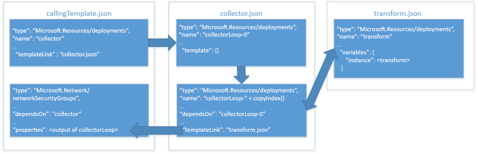

# <a name="implement-a-property-transformer-and-collector-in-an-azure-resource-manager-template"></a><span data-ttu-id="78f80-103">Implementación de un recopilador y transformador de propiedades en una plantilla de Azure Resource Manager</span><span class="sxs-lookup"><span data-stu-id="78f80-103">Implement a property transformer and collector in an Azure Resource Manager template</span></span>

<span data-ttu-id="78f80-104">En [Uso de un objeto como parámetro en una plantilla de Azure Resource Manager][objects-as-parameters], ha aprendido cómo almacenar valores de propiedad de recurso en un objeto y aplicarlos a un recurso durante la implementación.</span><span class="sxs-lookup"><span data-stu-id="78f80-104">In [use an object as a parameter in an Azure Resource Manager template][objects-as-parameters], you learned how to store resource property values in an object and apply them to a resource during deployment.</span></span> <span data-ttu-id="78f80-105">Aunque esta es una forma muy útil de administrar los parámetros, sigue siendo necesario que asigne las propiedades del objeto a las propiedades de los recursos cada vez que lo use en la plantilla.</span><span class="sxs-lookup"><span data-stu-id="78f80-105">While this is a very useful way to manage your parameters, it still requires you to map the object's properties to resource properties each time you use it in your template.</span></span>

<span data-ttu-id="78f80-106">Para evitar esto, puede implementar una plantilla de recopilador y transformador de propiedades que recorre la matriz de objetos en iteración y los transforma en el esquema JSON que el recurso espera.</span><span class="sxs-lookup"><span data-stu-id="78f80-106">To work around this, you can implement a property transform and collector template that iterates your object array and transforms it into the JSON schema expected by the resource.</span></span>

> [!IMPORTANT]
> <span data-ttu-id="78f80-107">Esta técnica requiere que conozca a fondo las plantillas y las funciones de Resource Manager.</span><span class="sxs-lookup"><span data-stu-id="78f80-107">This approach requires that you have a deep understanding of Resource Manager templates and functions.</span></span>

<span data-ttu-id="78f80-108">Veamos cómo se puede implementar un recopilador y transformador de propiedades con un ejemplo que implementa un [grupo de seguridad de red (NSG)][nsg].</span><span class="sxs-lookup"><span data-stu-id="78f80-108">Let's take a look at how we can implement a property collector and transformer with an example that deploys a [network security group (NSG)][nsg].</span></span> <span data-ttu-id="78f80-109">El diagrama siguiente muestra la relación entre nuestras plantillas y nuestros recursos dentro de esas plantillas:</span><span class="sxs-lookup"><span data-stu-id="78f80-109">The diagram below shows the relationship between our templates and our resources within those templates:</span></span>



<span data-ttu-id="78f80-111">Nuestra **plantilla de llamada** incluye dos recursos:</span><span class="sxs-lookup"><span data-stu-id="78f80-111">Our **calling template** includes two resources:</span></span>
* <span data-ttu-id="78f80-112">Un vínculo de plantilla que invoca a nuestra **plantilla de recopilador**.</span><span class="sxs-lookup"><span data-stu-id="78f80-112">a template link that invokes our **collector template**.</span></span>
* <span data-ttu-id="78f80-113">El grupo de seguridad de red que se va a implementar.</span><span class="sxs-lookup"><span data-stu-id="78f80-113">the NSG resource to deploy.</span></span>

<span data-ttu-id="78f80-114">Nuestra **plantilla de recopilador** incluye dos recursos:</span><span class="sxs-lookup"><span data-stu-id="78f80-114">Our **collector template** includes two resources:</span></span>
* <span data-ttu-id="78f80-115">Un recurso de **delimitador**.</span><span class="sxs-lookup"><span data-stu-id="78f80-115">an **anchor** resource.</span></span>
* <span data-ttu-id="78f80-116">Un vínculo de plantilla que invoca la plantilla de transformador en un bucle de copia.</span><span class="sxs-lookup"><span data-stu-id="78f80-116">a template link that invokes the transform template in a copy loop.</span></span>

<span data-ttu-id="78f80-117">Nuestra **plantilla de transformador** incluye un único recurso: una plantilla vacía con una variable que transforma nuestro código JSON `source` en el esquema JSON que esperaba el grupo de seguridad de red de la **plantilla principal**.</span><span class="sxs-lookup"><span data-stu-id="78f80-117">Our **transform template** includes a single resource: an empty template with a variable that transforms our `source` JSON to the JSON schema expected by our NSG resource in the **main template**.</span></span>

## <a name="parameter-object"></a><span data-ttu-id="78f80-118">Objeto de parámetro</span><span class="sxs-lookup"><span data-stu-id="78f80-118">Parameter object</span></span>

<span data-ttu-id="78f80-119">Usaremos nuestro objeto de parámetro `securityRules` de [objetos como parámetros][objects-as-parameters].</span><span class="sxs-lookup"><span data-stu-id="78f80-119">We'll be using our `securityRules` parameter object from [objects as parameters][objects-as-parameters].</span></span> <span data-ttu-id="78f80-120">Nuestra **plantilla de transformación** transforma cada objeto de la matriz `securityRules` en el esquema JSON que esperaba el grupo de seguridad de red de nuestra **plantilla de llamada**.</span><span class="sxs-lookup"><span data-stu-id="78f80-120">Our **transform template** will transform each object in the `securityRules` array into the JSON schema expected by the NSG resource in our **calling template**.</span></span>

```json
{
    "$schema": "https://schema.management.azure.com/schemas/2015-01-01/deploymentParameters.json#",
    "contentVersion": "1.0.0.0",
    "parameters":{ 
      "networkSecurityGroupsSettings": {
      "value": {
          "securityRules": [
            {
              "name": "RDPAllow",
              "description": "allow RDP connections",
              "direction": "Inbound",
              "priority": 100,
              "sourceAddressPrefix": "*",
              "destinationAddressPrefix": "10.0.0.0/24",
              "sourcePortRange": "*",
              "destinationPortRange": "3389",
              "access": "Allow",
              "protocol": "Tcp"
            },
            {
              "name": "HTTPAllow",
              "description": "allow HTTP connections",
              "direction": "Inbound",
              "priority": 200,
              "sourceAddressPrefix": "*",
              "destinationAddressPrefix": "10.0.1.0/24",
              "sourcePortRange": "*",
              "destinationPortRange": "80",
              "access": "Allow",
              "protocol": "Tcp"
            }
          ]
        }
      }
    }
  }
```

<span data-ttu-id="78f80-121">Veamos primero la **plantilla de transformación**.</span><span class="sxs-lookup"><span data-stu-id="78f80-121">Let's look at our **transform template** first.</span></span>

## <a name="transform-template"></a><span data-ttu-id="78f80-122">Plantilla de transformación</span><span class="sxs-lookup"><span data-stu-id="78f80-122">Transform template</span></span>

<span data-ttu-id="78f80-123">La **Plantilla de transformación** incluye dos parámetros que se pasan desde la **plantilla de recopilador**:</span><span class="sxs-lookup"><span data-stu-id="78f80-123">Our **transform template** includes two parameters that are passed from the **collector template**:</span></span> 
* <span data-ttu-id="78f80-124">`source` es un objeto que recibe uno de los objetos de valor de propiedad de la matriz de propiedades.</span><span class="sxs-lookup"><span data-stu-id="78f80-124">`source` is an object that receives one of the property value objects from the property array.</span></span> <span data-ttu-id="78f80-125">En nuestro ejemplo, cada objeto de la matriz `"securityRules"` se pasará uno a uno.</span><span class="sxs-lookup"><span data-stu-id="78f80-125">In our example, each object from the `"securityRules"` array will be passed in one at a time.</span></span>
* <span data-ttu-id="78f80-126">`state` es una matriz que recibe los resultados concatenados de todas las transformaciones anteriores.</span><span class="sxs-lookup"><span data-stu-id="78f80-126">`state` is an array that receives the concatenated results of all the previous transforms.</span></span> <span data-ttu-id="78f80-127">Esta es la colección de código JSON transformado.</span><span class="sxs-lookup"><span data-stu-id="78f80-127">This is the collection of transformed JSON.</span></span>

<span data-ttu-id="78f80-128">Nuestros parámetros tienen este aspecto:</span><span class="sxs-lookup"><span data-stu-id="78f80-128">Our parameters look like this:</span></span>

```json
{
  "$schema": "http://schema.management.azure.com/schemas/2015-01-01/deploymentTemplate.json#",
  "contentVersion": "1.0.0.0",
  "parameters": {
    "source": { "type": "object" },
    "state": {
      "type": "array",
      "defaultValue": [ ]
    }
  },
```

<span data-ttu-id="78f80-129">La plantilla también define una variable llamada `instance`.</span><span class="sxs-lookup"><span data-stu-id="78f80-129">Our template also defines a variable named `instance`.</span></span> <span data-ttu-id="78f80-130">Realiza la transformación real del objeto `source` en el esquema JSON requerido:</span><span class="sxs-lookup"><span data-stu-id="78f80-130">It performs the actual tranform of our `source` object into the required JSON schema:</span></span>

```json
  "variables": {
    "instance": [
      {
        "name": "[parameters('source').name]",
        "properties":{
            "description": "[parameters('source').description]",
            "protocol": "[parameters('source').protocol]",
            "sourcePortRange": "[parameters('source').sourcePortRange]",
            "destinationPortRange": "[parameters('source').destinationPortRange]",
            "sourceAddressPrefix": "[parameters('source').sourceAddressPrefix]",
            "destinationAddressPrefix": "[parameters('source').destinationAddressPrefix]",
            "access": "[parameters('source').access]",
            "priority": "[parameters('source').priority]",
            "direction": "[parameters('source').direction]"            
        }
      }
    ]

  },
```

<span data-ttu-id="78f80-131">Por último, el valor de `output` de nuestra plantilla concatena las transformaciones recopiladas del parámetro `state` con la transformación actual realizada por la variable `instance`:</span><span class="sxs-lookup"><span data-stu-id="78f80-131">Finally, the `output` of our template concatenates the collected transforms of our `state` parameter with the current transform performed by our `instance` variable:</span></span>

```json
  "outputs": {
    "collection": {
      "type": "array",
      "value": "[concat(parameters('state'), variables('instance'))]"
    }
```

<span data-ttu-id="78f80-132">A continuación, veamos la **plantilla de recopilador** para ver cómo pasa los valores de parámetro.</span><span class="sxs-lookup"><span data-stu-id="78f80-132">Next, let's take a look at our **collector template** to see how it passes in our parameter values.</span></span>

## <a name="collector-template"></a><span data-ttu-id="78f80-133">Plantilla de recopilador</span><span class="sxs-lookup"><span data-stu-id="78f80-133">Collector template</span></span>

<span data-ttu-id="78f80-134">La **plantilla de recopilador** incluye tres parámetros:</span><span class="sxs-lookup"><span data-stu-id="78f80-134">Our **collector template** includes three parameters:</span></span>
* <span data-ttu-id="78f80-135">`source` es la matriz completa de objetos de parámetro.</span><span class="sxs-lookup"><span data-stu-id="78f80-135">`source` is our complete parameter object array.</span></span> <span data-ttu-id="78f80-136">La pasa la **plantilla de llamada**.</span><span class="sxs-lookup"><span data-stu-id="78f80-136">It's passed in by the **calling template**.</span></span> <span data-ttu-id="78f80-137">Tiene el mismo nombre que el parámetro `source` de la **plantilla de transformación**, pero hay una diferencia importante que quizás haya observado ya: se trata de la matriz completa, pero solo pasamos un elemento de esta matriz a la **plantilla de transformación** a la vez.</span><span class="sxs-lookup"><span data-stu-id="78f80-137">This has the same name as the `source` parameter in our **transform template** but there is one key difference that you may have already noticed: this is the complete array, but we only pass one element of this array to the **transform template** at a time.</span></span>
* <span data-ttu-id="78f80-138">`transformTemplateUri` es el URI de nuestra **plantilla de transformación**.</span><span class="sxs-lookup"><span data-stu-id="78f80-138">`transformTemplateUri` is the URI of our **transform template**.</span></span> <span data-ttu-id="78f80-139">Aquí lo definimos como parámetro para poder volver a usar la plantilla.</span><span class="sxs-lookup"><span data-stu-id="78f80-139">We're defining it as a parameter here for template reusability.</span></span>
* <span data-ttu-id="78f80-140">`state` es una matriz inicialmente vacía que pasamos a nuestra **plantilla de transformación**.</span><span class="sxs-lookup"><span data-stu-id="78f80-140">`state` is an initially empty array that we pass to our **transform template**.</span></span> <span data-ttu-id="78f80-141">Almacena la colección de objetos de parámetro transformados cuando el bucle de copia se completa.</span><span class="sxs-lookup"><span data-stu-id="78f80-141">It stores the collection of transformed parameter objects when the copy loop is complete.</span></span>

<span data-ttu-id="78f80-142">Nuestros parámetros tienen este aspecto:</span><span class="sxs-lookup"><span data-stu-id="78f80-142">Our parameters look like this:</span></span>

```json
  "parameters": {
    "source": { "type": "array" },
    "transformTemplateUri": { "type": "string" },
    "state": {
      "type": "array",
      "defaultValue": [ ]
    }
``` 

<span data-ttu-id="78f80-143">A continuación, definimos una variable llamada `count`.</span><span class="sxs-lookup"><span data-stu-id="78f80-143">Next, we define a variable named `count`.</span></span> <span data-ttu-id="78f80-144">Su valor es la longitud de la matriz de objetos de parámetro `source`:</span><span class="sxs-lookup"><span data-stu-id="78f80-144">Its value is the length of the `source` parameter object array:</span></span>

```json
  "variables": {
    "count": "[length(parameters('source'))]"
  },
```

<span data-ttu-id="78f80-145">Como puede imaginar, se usa para el número de iteraciones en nuestro bucle de copia.</span><span class="sxs-lookup"><span data-stu-id="78f80-145">As you might suspect, we use it for the number of iterations in our copy loop.</span></span>

<span data-ttu-id="78f80-146">Ahora, echemos un vistazo a nuestros recursos.</span><span class="sxs-lookup"><span data-stu-id="78f80-146">Now let's take a look at our resources.</span></span> <span data-ttu-id="78f80-147">Se definen dos recursos:</span><span class="sxs-lookup"><span data-stu-id="78f80-147">We define two resources:</span></span>
* <span data-ttu-id="78f80-148">`loop-0` es el recurso de base cero de nuestro bucle de copia.</span><span class="sxs-lookup"><span data-stu-id="78f80-148">`loop-0` is the zero-based resource for our copy loop.</span></span>
* <span data-ttu-id="78f80-149">`loop-` se concatena con el resultado de la función `copyIndex(1)` para generar un nombre único basado en iteración para el recurso, comenzando por `1`.</span><span class="sxs-lookup"><span data-stu-id="78f80-149">`loop-` is concatenated with the result of the `copyIndex(1)` function to generate a unique iteration-based name for our resource, starting with `1`.</span></span>

<span data-ttu-id="78f80-150">Nuestros recursos tienen este aspecto:</span><span class="sxs-lookup"><span data-stu-id="78f80-150">Our resources look like this:</span></span>

```json
  "resources": [
    {
      "type": "Microsoft.Resources/deployments",
      "apiVersion": "2015-01-01",
      "name": "loop-0",
      "properties": {
        "mode": "Incremental",
        "parameters": { },
        "template": {
          "$schema": "http://schema.management.azure.com/schemas/2015-01-01/deploymentTemplate.json#",
          "contentVersion": "1.0.0.0",
          "parameters": { },
          "variables": { },
          "resources": [ ],
          "outputs": {
            "collection": {
              "type": "array",
              "value": "[parameters('state')]"
            }
          }
        }
      }
    },
    {
      "type": "Microsoft.Resources/deployments",
      "apiVersion": "2015-01-01",
      "name": "[concat('loop-', copyindex(1))]",
      "copy": {
        "name": "iterator",
        "count": "[variables('count')]",
        "mode": "serial"
      },
      "dependsOn": [
        "loop-0"
      ],
      "properties": {
        "mode": "Incremental",
        "templateLink": { "uri": "[parameters('transformTemplateUri')]" },
        "parameters": {
          "source": { "value": "[parameters('source')[copyindex()]]" },
          "state": { "value": "[reference(concat('loop-', copyindex())).outputs.collection.value]" }
        }
      }
    }
  ],
```

<span data-ttu-id="78f80-151">Veamos más de cerca los parámetros que pasamos a nuestra **plantilla de transformación**, en la plantilla anidada.</span><span class="sxs-lookup"><span data-stu-id="78f80-151">Let's take a closer look at the parameters we're passing to our **transform template** in the nested template.</span></span> <span data-ttu-id="78f80-152">Recuerde que nuestro parámetro `source` pasa el objeto actual a la matriz de objetos de parámetro `source`.</span><span class="sxs-lookup"><span data-stu-id="78f80-152">Recall from earlier that our `source` parameter passes the current object in the `source` parameter object array.</span></span> <span data-ttu-id="78f80-153">En el parámetro `state` se produce la recopilación, porque toma la salida de la iteración anterior de nuestro bucle de copia y lo pasa a la iteración actual. Observe que la función `reference()` usa la función `copyIndex()` sin ningún parámetro para hacer referencia al valor de `name` de nuestro objeto de plantilla vinculada anterior.</span><span class="sxs-lookup"><span data-stu-id="78f80-153">The `state` parameter is where the collection happens, because it takes the output of the previous iteration of our copy loop&mdash;notice that the `reference()` function uses the `copyIndex()` function with no parameter to reference the `name` of our previous linked template object&mdash;and passes it to the current iteration.</span></span>

<span data-ttu-id="78f80-154">Por último, el valor de `output` de la plantilla devuelve el valor de `output` de la última iteración de la **plantilla de transformación**:</span><span class="sxs-lookup"><span data-stu-id="78f80-154">Finally, the `output` of our template returns the `output` of the last iteration of our **transform template**:</span></span>

```json
  "outputs": {
    "result": {
      "type": "array",
      "value": "[reference(concat('loop-', variables('count'))).outputs.collection.value]"
    }
  }
```
<span data-ttu-id="78f80-155">A simple vista, puede parecer extraño devolver el valor de `output` de la última iteración de la **plantilla de transformación** a la **plantilla de llamada**, porque parecería que lo estamos almacenando en el parámetro `source`.</span><span class="sxs-lookup"><span data-stu-id="78f80-155">It may seem counterintuitive to return the `output` of the last iteration of our **transform template** to our **calling template** because it appeared we were storing it in our `source` parameter.</span></span> <span data-ttu-id="78f80-156">Sin embargo, recuerde que la última iteración de la **plantilla de transformación** es la que contiene la matriz completa de los objetos de propiedad transformados, y eso es lo que queremos devolver.</span><span class="sxs-lookup"><span data-stu-id="78f80-156">However, remember that it's the last iteration of our **transform template** that holds the complete array of transformed property objects, and that's what we want to return.</span></span>

<span data-ttu-id="78f80-157">Por último, echemos un vistazo a cómo llamar a la **plantilla de recopilador** desde la **plantilla de llamada**.</span><span class="sxs-lookup"><span data-stu-id="78f80-157">Finally, let's take a look at how to call the **collector template** from our **calling template**.</span></span>

## <a name="calling-template"></a><span data-ttu-id="78f80-158">Plantilla de llamada</span><span class="sxs-lookup"><span data-stu-id="78f80-158">Calling template</span></span>

<span data-ttu-id="78f80-159">La **plantilla de llamada** define un único parámetro llamado `networkSecurityGroupsSettings`:</span><span class="sxs-lookup"><span data-stu-id="78f80-159">Our **calling template** defines a single parameter named `networkSecurityGroupsSettings`:</span></span>

```json
...
"parameters": {
    "networkSecurityGroupsSettings": {
        "type": "object"
    }
```

<span data-ttu-id="78f80-160">Después, la plantilla define una sola variable llamada `collectorTemplateUri`:</span><span class="sxs-lookup"><span data-stu-id="78f80-160">Next, our template defines a single variable named `collectorTemplateUri`:</span></span>

```json
"variables": {
    "collectorTemplateUri": "[uri(deployment().properties.templateLink.uri, 'collector.template.json')]"
  }
```

<span data-ttu-id="78f80-161">Como cabría esperar, este es el URI de la **plantilla de recopilador** que usará el recurso de plantilla vinculada:</span><span class="sxs-lookup"><span data-stu-id="78f80-161">As you would expect, this is the URI for the **collector template** that will be used by our linked template resource:</span></span>

```json
{
    "apiVersion": "2015-01-01",
    "name": "collector",
    "type": "Microsoft.Resources/deployments",
    "properties": {
        "mode": "Incremental",
        "templateLink": {
            "uri": "[variables('linkedTemplateUri')]",
            "contentVersion": "1.0.0.0"
        },
        "parameters": {
            "source" : {"value": "[parameters('networkSecurityGroupsSettings').securityRules]"},
            "transformTemplateUri": { "value": "[uri(deployment().properties.templateLink.uri, 'transform.json')]"}
        }
    }
}
```

<span data-ttu-id="78f80-162">Pasamos dos parámetros a la **plantilla de recopilador**:</span><span class="sxs-lookup"><span data-stu-id="78f80-162">We pass two parameters to the **collector template**:</span></span>
* <span data-ttu-id="78f80-163">`source` es la matriz de objetos de propiedad.</span><span class="sxs-lookup"><span data-stu-id="78f80-163">`source` is our property object array.</span></span> <span data-ttu-id="78f80-164">En nuestro ejemplo, es el parámetro `networkSecurityGroupsSettings`.</span><span class="sxs-lookup"><span data-stu-id="78f80-164">In our example, it's our `networkSecurityGroupsSettings` parameter.</span></span>
* <span data-ttu-id="78f80-165">`transformTemplateUri` es la variable que acabamos de definir con el URI de la **plantilla de recopilador**.</span><span class="sxs-lookup"><span data-stu-id="78f80-165">`transformTemplateUri` is the variable we just defined with the URI of our **collector template**.</span></span>

<span data-ttu-id="78f80-166">Por último, el recurso `Microsoft.Network/networkSecurityGroups` asigna directamente el valor de `output` del recurso de plantilla vinculada `collector` a su propiedad `securityRules`:</span><span class="sxs-lookup"><span data-stu-id="78f80-166">Finally, our `Microsoft.Network/networkSecurityGroups` resource directly assigns the `output` of the `collector` linked template resource to its `securityRules` property:</span></span>

```json
    {
      "apiVersion": "2015-06-15",
      "type": "Microsoft.Network/networkSecurityGroups",
      "name": "networkSecurityGroup1",
      "location": "[resourceGroup().location]",
      "properties": {
        "securityRules": "[reference('firstResource').outputs.result.value]"
      }
    }
  ],
  "outputs": {
      "instance":{
          "type": "array",
          "value": "[reference('firstResource').outputs.result.value]"
      }

  }
```

## <a name="next-steps"></a><span data-ttu-id="78f80-167">Pasos siguientes</span><span class="sxs-lookup"><span data-stu-id="78f80-167">Next steps</span></span>

* <span data-ttu-id="78f80-168">Esta técnica se implementa en el [proyecto de bloques de creación de plantillas](https://github.com/mspnp/template-building-blocks) y las [arquitecturas de referencia de Azure](/azure/architecture/reference-architectures/).</span><span class="sxs-lookup"><span data-stu-id="78f80-168">This technique is implemented in the [template building blocks project](https://github.com/mspnp/template-building-blocks) and the [Azure reference architectures](/azure/architecture/reference-architectures/).</span></span> <span data-ttu-id="78f80-169">Puede usarlas para crear su propia arquitectura o implementar una de nuestras arquitecturas de referencia.</span><span class="sxs-lookup"><span data-stu-id="78f80-169">You can use these to create your own architecture or deploy one of our reference architectures.</span></span>

<!-- links -->
[objects-as-parameters]: ./objects-as-parameters.md
[resource-manager-linked-template]: /azure/azure-resource-manager/resource-group-linked-templates
[resource-manager-variables]: /azure/azure-resource-manager/resource-group-template-functions-deployment
[nsg]: /azure/virtual-network/virtual-networks-nsg
