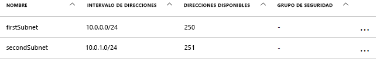
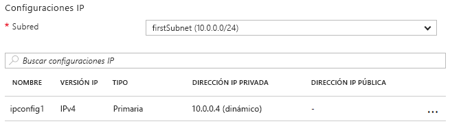

# <a name="update-a-resource-in-an-azure-resource-manager-template"></a><span data-ttu-id="ee38a-103">Actualización de un recurso en una plantilla de Azure Resource Manager</span><span class="sxs-lookup"><span data-stu-id="ee38a-103">Update a resource in an Azure Resource Manager template</span></span>

<span data-ttu-id="ee38a-104">Hay algunos escenarios en los que es necesario actualizar un recurso durante una implementación.</span><span class="sxs-lookup"><span data-stu-id="ee38a-104">There are some scenarios in which you need to update a resource during a deployment.</span></span> <span data-ttu-id="ee38a-105">Este caso se puede dar cuando no se pueden especificar todas las propiedades de un recurso hasta que se creen otros recursos dependientes.</span><span class="sxs-lookup"><span data-stu-id="ee38a-105">You might encounter this scenario when you cannot specify all the properties for a resource until other, dependent resources are created.</span></span> <span data-ttu-id="ee38a-106">Por ejemplo, si crea un grupo de back-end para un equilibrador de carga, puede actualizar los adaptadores de red en sus máquinas virtuales (VM) para incluirlos en el grupo de back-end.</span><span class="sxs-lookup"><span data-stu-id="ee38a-106">For example, if you create a backend pool for a load balancer, you might update the network interfaces (NICs) on your virtual machines (VMs) to include them in the backend pool.</span></span> <span data-ttu-id="ee38a-107">Resource Manager permite actualizar los recursos durante la implementación, pero debe diseñar su plantilla correctamente para evitar errores y garantizar que la implementación se trate como una actualización.</span><span class="sxs-lookup"><span data-stu-id="ee38a-107">And while Resource Manager supports updating resources during deployment, you must design your template correctly to avoid errors and to ensure the deployment is handled as an update.</span></span>

<span data-ttu-id="ee38a-108">En primer lugar, debe hacer referencia al recurso una vez en la plantilla para crearlo y, después, debe hacer referencia al recurso con el mismo nombre para actualizarlo más adelante.</span><span class="sxs-lookup"><span data-stu-id="ee38a-108">First, you must reference the resource once in the template to create it and then reference the resource by the same name to update it later.</span></span> <span data-ttu-id="ee38a-109">Sin embargo, si dos recursos tienen el mismo nombre en una plantilla, Resource Manager genera una excepción.</span><span class="sxs-lookup"><span data-stu-id="ee38a-109">However, if two resources have the same name in a template, Resource Manager throws an exception.</span></span> <span data-ttu-id="ee38a-110">Para evitar este error, especifique el recurso actualizado en una segunda plantilla que haya vinculado o incluido como una subplantilla mediante el tipo de recurso `Microsoft.Resources/deployments`.</span><span class="sxs-lookup"><span data-stu-id="ee38a-110">To avoid this error, specify the updated resource in a second template that's either linked or included as a subtemplate using the `Microsoft.Resources/deployments` resource type.</span></span>

<span data-ttu-id="ee38a-111">En segundo lugar, en la plantilla anidada, debe especificar el nombre de la propiedad existente que va a cambiar o proporcionar un nombre nuevo para una propiedad que se va a agregar.</span><span class="sxs-lookup"><span data-stu-id="ee38a-111">Second, you must either specify the name of the existing property to change or a new name for a property to add in the nested template.</span></span> <span data-ttu-id="ee38a-112">También debe especificar las propiedades originales y sus valores originales.</span><span class="sxs-lookup"><span data-stu-id="ee38a-112">You must also specify the original properties and their original values.</span></span> <span data-ttu-id="ee38a-113">Si no se proporcionan las propiedades y los valores originales, Resource Manager da por supuesto que desea crear un nuevo recurso y elimina el original.</span><span class="sxs-lookup"><span data-stu-id="ee38a-113">If you fail to provide the original properties and values, Resource Manager assumes you want to create a new resource and deletes the original resource.</span></span>

## <a name="example-template"></a><span data-ttu-id="ee38a-114">Plantilla de ejemplo</span><span class="sxs-lookup"><span data-stu-id="ee38a-114">Example template</span></span>

<span data-ttu-id="ee38a-115">Echemos un vistazo a una plantilla de ejemplo que muestra cómo hacerlo.</span><span class="sxs-lookup"><span data-stu-id="ee38a-115">Let's look at an example template that demonstrates this.</span></span> <span data-ttu-id="ee38a-116">Nuestra plantilla implementa una red virtual llamada `firstVNet`, que tiene una subred llamada `firstSubnet`.</span><span class="sxs-lookup"><span data-stu-id="ee38a-116">Our template deploys a virtual network  named `firstVNet` that has one subnet named `firstSubnet`.</span></span> <span data-ttu-id="ee38a-117">Después, implementa una interfaz de red virtual llamada `nic1` y la asocia a la subred.</span><span class="sxs-lookup"><span data-stu-id="ee38a-117">It then deploys a virtual network interface (NIC) named `nic1` and associates it with our subnet.</span></span> <span data-ttu-id="ee38a-118">A continuación, un recurso de implementación llamado `updateVNet` incluye una plantilla anidada que actualiza nuestro recurso `firstVNet` y agrega una segunda subred llamada `secondSubnet`.</span><span class="sxs-lookup"><span data-stu-id="ee38a-118">Then, a deployment resource named `updateVNet` includes a nested template that updates our `firstVNet` resource by adding a second subnet named `secondSubnet`.</span></span> 

```json
{
  "$schema": "https://schema.management.azure.com/schemas/2015-01-01/deploymentTemplate.json#",
  "contentVersion": "1.0.0.0",
  "parameters": {},
  "resources": [
      {
      "apiVersion": "2016-03-30",
      "name": "firstVNet",
      "location":"[resourceGroup().location]",
      "type": "Microsoft.Network/virtualNetworks",
      "properties": {
          "addressSpace":{"addressPrefixes": [
              "10.0.0.0/22"
          ]},
          "subnets":[              
              {
                  "name":"firstSubnet",
                  "properties":{
                    "addressPrefix":"10.0.0.0/24"
                  }
              }
            ]
      }
    },
    {
        "apiVersion": "2015-06-15",
        "type":"Microsoft.Network/networkInterfaces",
        "name":"nic1",
        "location":"[resourceGroup().location]",
        "dependsOn": [
            "firstVNet"
        ],
        "properties": {
            "ipConfigurations":[
                {
                    "name":"ipconfig1",
                    "properties": {
                        "privateIPAllocationMethod":"Dynamic",
                        "subnet": {
                            "id": "[concat(resourceId('Microsoft.Network/virtualNetworks','firstVNet'),'/subnets/firstSubnet')]"
                        }
                    }
                }
            ]
        }
    },
    {
      "apiVersion": "2015-01-01",
      "type": "Microsoft.Resources/deployments",
      "name": "updateVNet",
      "dependsOn": [
          "nic1"
      ],
      "properties": {
        "mode": "Incremental",
        "parameters": {},
        "template": {
          "$schema": "http://schema.management.azure.com/schemas/2015-01-01/deploymentTemplate.json#",
          "contentVersion": "1.0.0.0",
          "parameters": {},
          "variables": {},
          "resources": [
              {
                  "apiVersion": "2016-03-30",
                  "name": "firstVNet",
                  "location":"[resourceGroup().location]",
                  "type": "Microsoft.Network/virtualNetworks",
                  "properties": {
                      "addressSpace": "[reference('firstVNet').addressSpace]",
                      "subnets":[
                          {
                              "name":"[reference('firstVNet').subnets[0].name]",
                              "properties":{
                                  "addressPrefix":"[reference('firstVNet').subnets[0].properties.addressPrefix]"
                                  }
                          },
                          {
                              "name":"secondSubnet",
                              "properties":{
                                  "addressPrefix":"10.0.1.0/24"
                                  }
                          }
                     ]
                  }
              }
          ],
          "outputs": {}
          }
        }
    }
  ],
  "outputs": {}
}
```

<span data-ttu-id="ee38a-119">Veamos primero el objeto de recurso de nuestro recurso `firstVNet`.</span><span class="sxs-lookup"><span data-stu-id="ee38a-119">Let's take a look at the resource object for our `firstVNet` resource first.</span></span> <span data-ttu-id="ee38a-120">Observe que volvemos a especificar la configuración de nuestro recurso `firstVNet` en una plantilla anidada. Esto es porque Resource Manager no permite el mismo nombre de implementación en la misma plantilla, y las plantillas anidadas se consideran plantillas diferentes.</span><span class="sxs-lookup"><span data-stu-id="ee38a-120">Notice that we respecify the settings for our `firstVNet` in a nested template&mdash;this is because Resource Manager doesn't allow the same deployment name within the same template and nested templates are considered to be a different template.</span></span> <span data-ttu-id="ee38a-121">Al volver a especificar los valores de nuestro recurso `firstSubnet`, estamos indicando a Resource Manager que actualice el recurso existente en lugar de eliminarlo y volver a implementarlo.</span><span class="sxs-lookup"><span data-stu-id="ee38a-121">By respecifying our values for our `firstSubnet` resource, we are telling Resource Manager to update the existing resource instead of deleting it and redeploying it.</span></span> <span data-ttu-id="ee38a-122">Por último, se recoge la nueva configuración de `secondSubnet` durante esta actualización.</span><span class="sxs-lookup"><span data-stu-id="ee38a-122">Finally, our new settings for `secondSubnet` are picked up during this update.</span></span>

## <a name="try-the-template"></a><span data-ttu-id="ee38a-123">Prueba de la plantilla</span><span class="sxs-lookup"><span data-stu-id="ee38a-123">Try the template</span></span>

<span data-ttu-id="ee38a-124">Si desea experimentar con esta plantilla, siga estos pasos:</span><span class="sxs-lookup"><span data-stu-id="ee38a-124">If you would like to experiment with this template, follow these steps:</span></span>

1.  <span data-ttu-id="ee38a-125">Vaya a Azure Portal, seleccione el icono **+** y busque el tipo de recurso **implementación de plantilla**.</span><span class="sxs-lookup"><span data-stu-id="ee38a-125">Go to the Azure portal, select the **+** icon, and search for the **template deployment** resource type, and select it.</span></span>
2.  <span data-ttu-id="ee38a-126">Vaya a la página **Implementación de plantilla** y seleccione el botón **crear**.</span><span class="sxs-lookup"><span data-stu-id="ee38a-126">Navigate to the **template deployment** page, select the **create** button.</span></span> <span data-ttu-id="ee38a-127">Este botón abre la hoja de **Implementación personalizada**.</span><span class="sxs-lookup"><span data-stu-id="ee38a-127">This button opens the **custom deployment** blade.</span></span>
3.  <span data-ttu-id="ee38a-128">Seleccione el icono **Editar**.</span><span class="sxs-lookup"><span data-stu-id="ee38a-128">Select the **edit** icon.</span></span>
4.  <span data-ttu-id="ee38a-129">Elimine la plantilla vacía.</span><span class="sxs-lookup"><span data-stu-id="ee38a-129">Delete the empty template.</span></span>
5.  <span data-ttu-id="ee38a-130">Copie y pegue la plantilla de ejemplo en el panel derecho.</span><span class="sxs-lookup"><span data-stu-id="ee38a-130">Copy and paste the sample template into the right pane.</span></span>
6.  <span data-ttu-id="ee38a-131">Seleccione el botón **Guardar**.</span><span class="sxs-lookup"><span data-stu-id="ee38a-131">Select the **save** button.</span></span>
7.  <span data-ttu-id="ee38a-132">Volverá al panel **Implementación personalizada**, pero esta vez hay algunos cuadros desplegables.</span><span class="sxs-lookup"><span data-stu-id="ee38a-132">You return to the **custom deployment** pane, but this time there are some drop-down list boxes.</span></span> <span data-ttu-id="ee38a-133">Seleccione la suscripción, cree o use un grupo de recursos existente y seleccione una ubicación.</span><span class="sxs-lookup"><span data-stu-id="ee38a-133">Select your subscription, either create new or use existing resource group, and select a location.</span></span> <span data-ttu-id="ee38a-134">Revise los términos y condiciones y seleccione el botón **Acepto**.</span><span class="sxs-lookup"><span data-stu-id="ee38a-134">Review the terms and conditions, then select the **I agree** button.</span></span>
8.  <span data-ttu-id="ee38a-135">Seleccione el botón **Comprar**.</span><span class="sxs-lookup"><span data-stu-id="ee38a-135">Select the **purchase** button.</span></span>

<span data-ttu-id="ee38a-136">Cuando haya finalizado la implementación, abra el grupo de recursos especificado en el portal.</span><span class="sxs-lookup"><span data-stu-id="ee38a-136">Once deployment has finished, open the resource group you specified in the portal.</span></span> <span data-ttu-id="ee38a-137">Verá una red virtual llamada `firstVNet` y una NIC llamada `nic1`.</span><span class="sxs-lookup"><span data-stu-id="ee38a-137">You see a virtual network named `firstVNet` and a NIC named `nic1`.</span></span> <span data-ttu-id="ee38a-138">Haga clic en `firstVNet` y luego en `subnets`.</span><span class="sxs-lookup"><span data-stu-id="ee38a-138">Click `firstVNet`, then click `subnets`.</span></span> <span data-ttu-id="ee38a-139">Verá el `firstSubnet` que se creó originalmente, y verá el `secondSubnet` que se agregó en el recurso `updateVNet`.</span><span class="sxs-lookup"><span data-stu-id="ee38a-139">You see the `firstSubnet` that was originally created, and you see the `secondSubnet` that was added in the `updateVNet` resource.</span></span> 



<span data-ttu-id="ee38a-141">A continuación, vuelva al grupo de recursos y haga clic en `nic1`; a continuación, haga clic en `IP configurations`.</span><span class="sxs-lookup"><span data-stu-id="ee38a-141">Then, go back to the resource group and click `nic1` then click `IP configurations`.</span></span> <span data-ttu-id="ee38a-142">En la sección `IP configurations`, `subnet` se configura en `firstSubnet (10.0.0.0/24)`.</span><span class="sxs-lookup"><span data-stu-id="ee38a-142">In the `IP configurations` section, the `subnet` is set to `firstSubnet (10.0.0.0/24)`.</span></span> 



<span data-ttu-id="ee38a-144">El `firstVNet` original se ha actualizado, en lugar de haberse creado de nuevo.</span><span class="sxs-lookup"><span data-stu-id="ee38a-144">The original `firstVNet` has been updated instead of recreated.</span></span> <span data-ttu-id="ee38a-145">Si `firstVNet` se hubiera creado de nuevo, `nic1` no se asociaría con `firstVNet`.</span><span class="sxs-lookup"><span data-stu-id="ee38a-145">If `firstVNet` had been recreated, `nic1` would not be associated with `firstVNet`.</span></span>

## <a name="next-steps"></a><span data-ttu-id="ee38a-146">Pasos siguientes</span><span class="sxs-lookup"><span data-stu-id="ee38a-146">Next steps</span></span>

* <span data-ttu-id="ee38a-147">Esta técnica se implementa en el [proyecto de bloques de creación de plantillas](https://github.com/mspnp/template-building-blocks) y las [arquitecturas de referencia de Azure](/azure/architecture/reference-architectures/).</span><span class="sxs-lookup"><span data-stu-id="ee38a-147">This technique is implemented in the [template building blocks project](https://github.com/mspnp/template-building-blocks) and the [Azure reference architectures](/azure/architecture/reference-architectures/).</span></span> <span data-ttu-id="ee38a-148">Puede usarlas para crear su propia arquitectura o implementar una de nuestras arquitecturas de referencia.</span><span class="sxs-lookup"><span data-stu-id="ee38a-148">You can use these to create your own architecture or deploy one of our reference architectures.</span></span>
