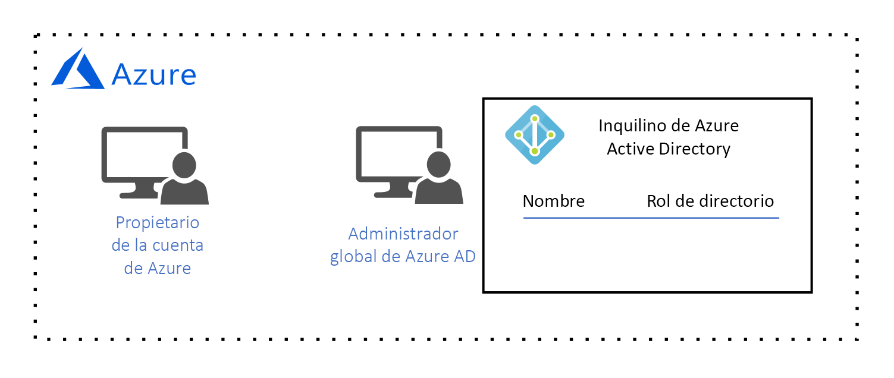
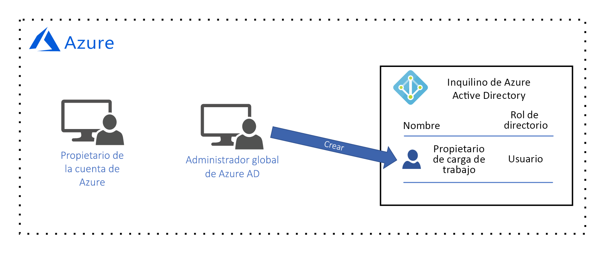
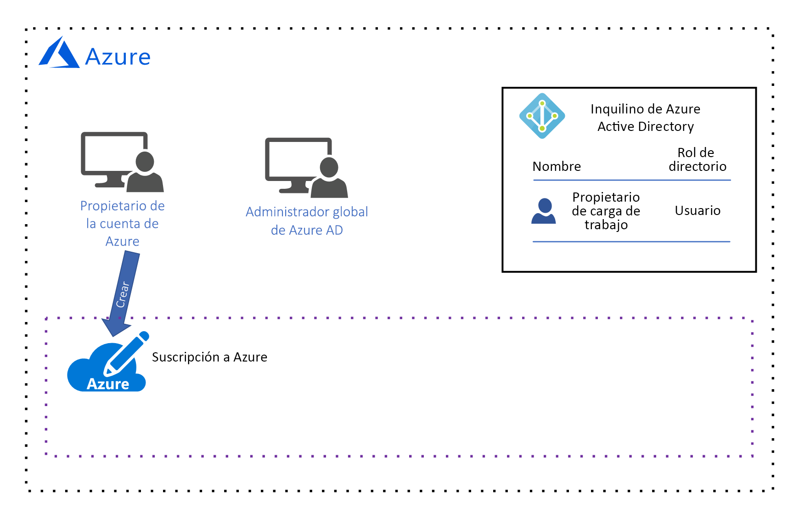
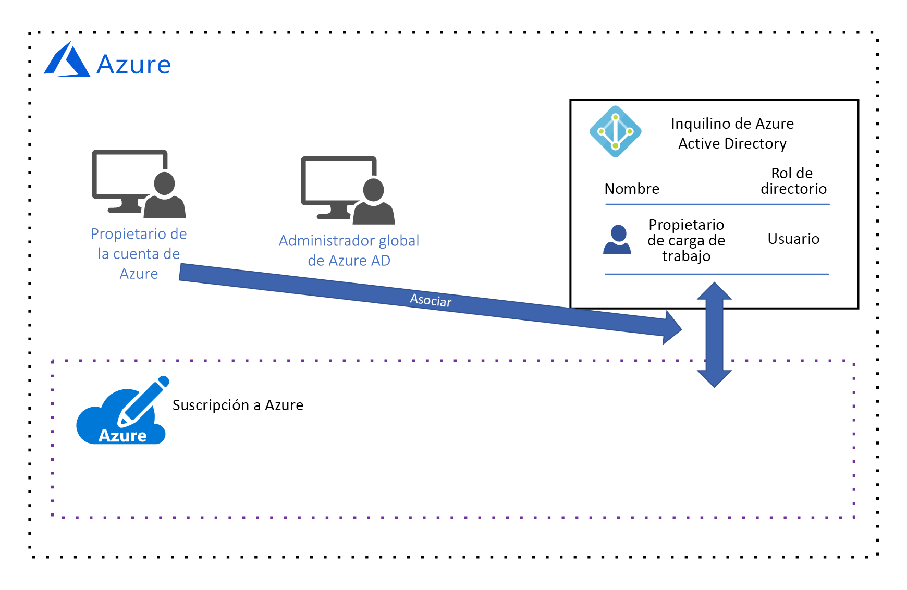
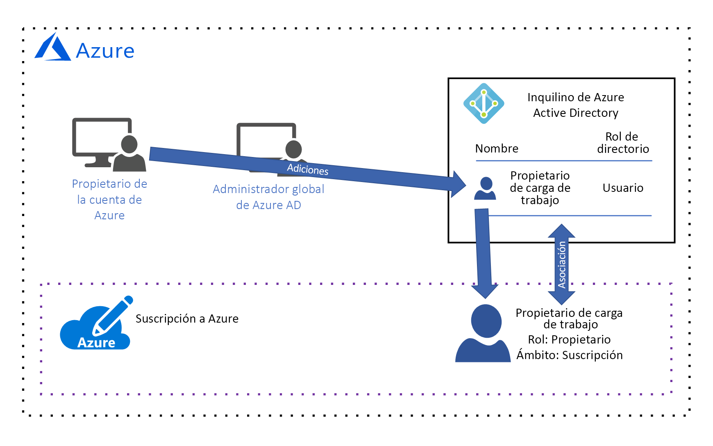
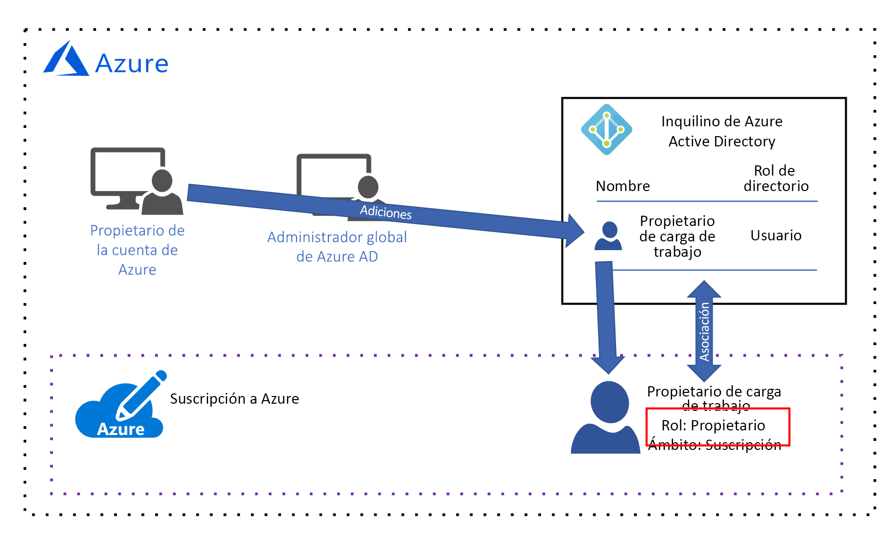
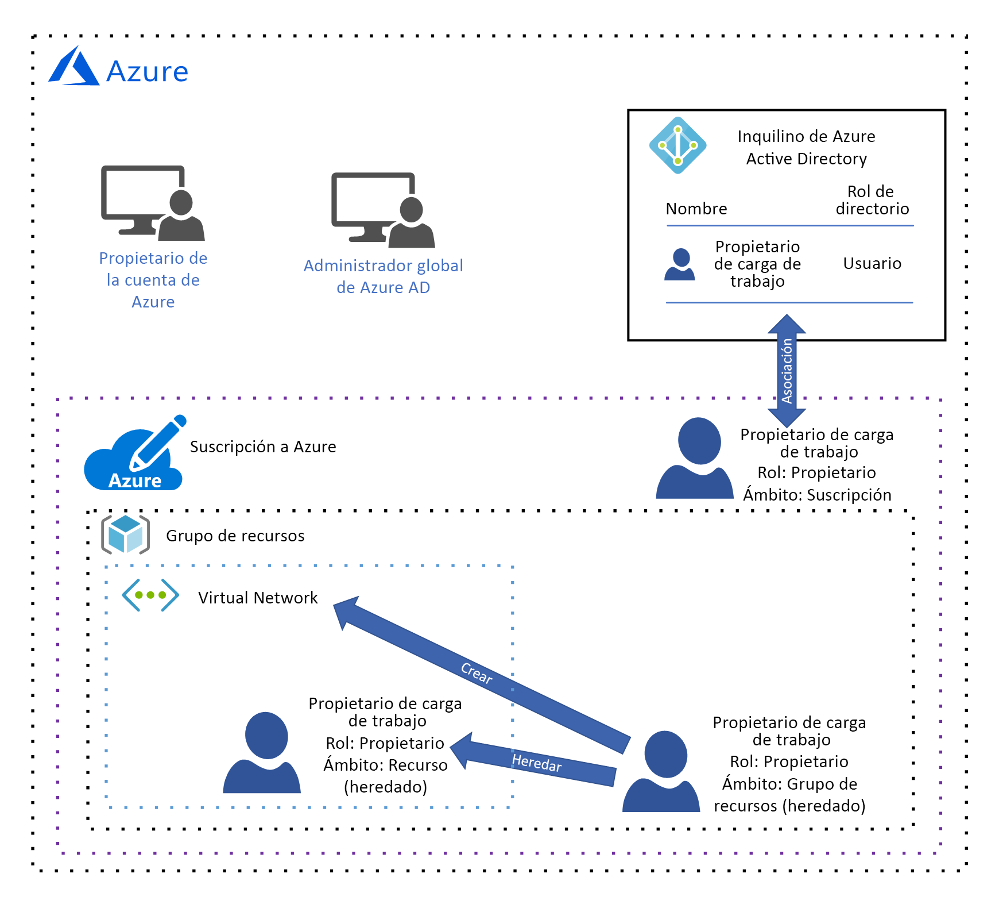

# Guía de diseño de gobierno de AzureAzure governance design guide

Los destinatarios de esta guía de diseño son los usuarios con el rol *TI central* de su organización.The audience for this design guide is the *central IT* persona in your organization. El rol *TI central* es el responsable de diseñar e implementar la arquitectura de gobierno en la nube de su organización.*Central IT* is responsible for designing and implementing your organization's cloud governance architecture. Como ya hemos aprendido en la explicación [¿Qué es el gobierno de los recursos en la nube?](governance-explainer.md), por gobierno se entiende el proceso continuo de administrar, supervisar y auditar el uso de los recursos de Azure para cumplir los objetivos y requisitos de su organización.As you learned in the [what is cloud resource governance?](governance-explainer.md) explainer, governance refers to the ongoing process of managing, monitoring, and auditing the use of Azure resources to meet the goals and requirements of your organization.

El objetivo de esta guía es mostrarle el proceso de diseño de la arquitectura de gobierno de su organización, utilizando un conjunto hipotético de requisitos y objetivos de gobierno.The goal of this guidance is to help you learn the process of designing your organization's governance architecture by looking at a set of hypothetical governance goals and requirements. Después, analizaremos cómo configurar las herramientas de gobierno de Azure para cumplir con ellos.Then, we'll discuss how to configure Azure's governance tools to meet them. 

En la fase de adopción de fundación, nuestro objetivo es implementar una carga de trabajo simple en Azure.In the foundational adoption stage, our goal is to deploy a simple workload to Azure. El resultado son los siguientes requisitos:This results in the following requirements:
* Administración de identidades para un solo **propietario de cargas de trabajo**, que es responsable de implementar y mantener la carga de trabajo simple.Identity management for a single **workload owner** who is responsible for deploying and maintaining the simple workload. El propietario de la carga de trabajo necesita permisos para crear, leer, actualizar y eliminar recursos, así como permisos para delegar estos derechos a otros usuarios en el sistema de administración de identidades.The workload owner requires permission to create, read, update, and delete resources as well as permission to delegate these rights to other users in the identity management system.
* Administrar todos los recursos para la carga de trabajo simple como una unidad única de administración.Manage all resources for the simple workload as a single management unit.

## Licencias de AzureLicensing Azure

Antes de comenzar el diseño de nuestro modelo de gobierno, es importante comprender cómo se conceden las licencias de Azure.Before we begin designing our governance model, it's important to understand how Azure is licensed. El motivo es que las cuentas administrativas asociadas con su licencia de Azure tienen el mayor nivel de acceso a todos los recursos de Azure.This is because the administrative accounts associated with your Azure license have the highest level of access to all of your Azure resources. Estas cuentas administrativas forman la base de su modelo de gobierno.These administrative accounts form the basis of your governance model.  

> [!NOTE]
> Si su organización ya tiene un [Contrato Enterprise de Microsoft](https://www.microsoft.com/en-us/licensing/licensing-programs/enterprise.aspx) que no incluye Azure, se puede agregar Azure mediante un compromiso monetario por adelantado.If your organization has an existing [Microsoft Enterprise Agreement](https://www.microsoft.com/en-us/licensing/licensing-programs/enterprise.aspx) that does not include Azure, Azure can be added by making an upfront monetary commitment. Consulte las [licencias de Azure para la empresa](https://azure.microsoft.com/pricing/enterprise-agreement/) para más información.See [licensing Azure for the enterprise](https://azure.microsoft.com/pricing/enterprise-agreement/) for more information. 

Cuando Azure se agrega al contrato Enterprise de su organización, se pide a su organización que cree una **cuenta de Azure**.When Azure added to your organization's Enterprise Agreement, your organization was prompted to create an **Azure account**. Durante el proceso de creación de la cuenta, se crea un **propietario de la cuenta de Azure** y un inquilino de Azure Active Directory (Azure AD) con una cuenta de **administrador global**.During the account creation process, an **Azure account owner** was created, as well as an Azure Active Directory (Azure AD) tenant with a **global administrator** account. Un inquilino de Azure AD es una construcción lógica que representa una instancia segura y dedicada de Azure AD.An Azure AD tenant is a logical construct that represents a secure, dedicated instance of Azure AD.

*Figura 1. Cuenta de Azure con el Administrador de cuentas de Azure y el administrador global de Azure AD.*
*Figure 1. An Azure account with an Account Manager and Azure AD Global Administrator.*

## Administración de identidadesIdentity management

Azure solo confía en [Azure AD](/azure/active-directory) para autenticar usuarios y autorizar el acceso de los usuarios a los recursos, por lo que Azure AD es nuestro sistema de administración de identidades.Azure only trusts [Azure AD](/azure/active-directory) to authenticate users and authorize user access to resources, so Azure AD is our identity management system. El administrador global de Azure AD tiene el mayor nivel de permisos y puede realizar todas las acciones relacionadas con la identidad, incluida la creación de usuarios y asignación de permisos.The Azure AD global administrator has the highest level of permissions and can perform all actions related to identity, including creating users and assigning permissions. 

Nuestro requisito es una administración de identidades para un solo **propietario de cargas de trabajo**, que es responsable de implementar y mantener la carga de trabajo simple.Our requirement is identity management for a single **workload owner** who is responsible for deploying and maintaining the simple workload. El propietario de la carga de trabajo necesita permisos para crear, leer, actualizar y eliminar recursos, así como permisos para delegar estos derechos a otros usuarios en el sistema de administración de identidades.The workload owner requires permission to create, read, update, and delete resources as well as permission to delegate these rights to other users in the identity management system.

Nuestro administrador global de Azure AD creará la cuenta de **propietario de carga de trabajo** para el **propietario de la carga de trabajo**:Our Azure AD global administrator will create the **workload owner** account for the **workload owner**:

*Figura 2. El administrador global de Azure AD crea la cuenta de usuario del propietario de carga de trabajo.*
*Figure 2. The Azure AD global administrator creates the workload owner user account.*

No podemos asignar permiso de acceso a los recursos hasta que este usuario se agregue a una **suscripción**, lo que haremos en las dos secciones siguientes.We aren't able to assign resource access permission until this user is added to a **subscription**, so we'll do that in the next two sections. 

## Ámbito de la administración de recursosResource management scope

A medida que crece el número de los recursos implementados por la organización, aumenta también la complejidad del gobierno de estos recursos.As the number of resources deployed by your organization grows, the complexity of governing those resources grows as well. Azure implementa una jerarquía de contenedores lógicos para que su organización pueda administrar los recursos en grupos con distintos niveles de granularidad, lo que también se conoce como **ámbito**.Azure implements a logical container hierarchy to enable your organization to manage your resources in groups at various levels of granularity, also known as **scope**. 

El nivel superior del ámbito de administración de recursos es el nivel de **suscripción**.The top level of resource management scope is the **subscription** level. El **propietario de la cuenta** de Azure crea una suscripción, que establece el compromiso financiero y es responsable del pago de todos los recursos de Azure asociados con la suscripción:A subscription is created by the Azure **account owner**, who establishes the financial commitment and is responsible for paying for all Azure resources associated with the subscription:

*Figura 3. El propietario de la cuenta de Azure crea una suscripción.*
*Figure 3. The Azure account owner creates a subscription.*

Cuando se crea la suscripción, el **propietario de la cuenta** de Azure asocia un inquilino de Azure AD con la suscripción, y este inquilino de Azure AD se usa para autenticar y autorizar a los usuarios:When the subscription is created, the Azure **account owner** associates an Azure AD tenant with the subscription, and this Azure AD tenant is used for authenticating and authorizing users:

*Figura 4. El propietario de la cuenta de Azure asocia el inquilino de Azure AD con la suscripción.*
*Figure 4. The Azure account owner associates the Azure AD tenant with the subscription.*

Puede que haya observado que actualmente no hay ningún usuario asociado con la suscripción, lo que significa que nadie tiene permiso para administrar los recursos.You may have noticed that there is currently no user associated with the subscription, which means that no one has permission to manage resources. En realidad, el **propietario de la cuenta** es el propietario de la suscripción y tiene permiso para realizar cualquier acción en un recurso en la suscripción.In reality, the **account owner** is the owner of the subscription and has permission to take any action on a resource in the subscription. Sin embargo, en la práctica, es muy probable que el **propietario de la cuenta** sea una persona de finanzas de su organización y no el responsable de crear, leer, actualizar y eliminar los recursos. Esas tareas las realizará el **propietario de la carga de trabajo**.However, in practical terms the **account owner** is more than likely a finance person in your organization and is not responsible for creating, reading, updating, and deleting resources - those tasks will be performed by the **workload owner**. Por lo tanto, tenemos que agregar el **propietario de la carga de trabajo** a la suscripción y asignar los permisos.Therefore, we need to add the **workload owner** to the subscription and assign permissions.

El **propietario de la cuenta** es actualmente el único usuario con permiso para agregar el **propietario de la carga de trabajo** a la suscripción, por lo que agrega el **propietario de la carga de trabajo** a la suscripción:Since the **account owner** is currently the only user with permission to add the **workload owner** to the subscription, they add the **workload owner** to the subscription:

*Figura 5. El propietario de la cuenta de Azure agrega el propietario de la carga de trabajo a la suscripción.*
*Figure 5. The Azure account owner adds the workload owner to the subscription.*

El **propietario de la cuenta** de Azure concede permisos al **propietario de la carga de trabajo** y, para ello, lo asigna a un rol de [control de acceso basado en rol (RBAC)](/azure/role-based-access-control/).The Azure **account owner** grants permissions to the **workload owner** by assigning a [role-based access control (RBAC)](/azure/role-based-access-control/) role. El rol de RBAC especifica el conjunto de permisos que el **propietario de la carga de trabajo** tiene para un tipo de recurso individual o para un conjunto de tipos de recursos.The RBAC role specifies a set of permissions that the **workload owner** has for an individual resource type or a set of resource types.

Tenga en cuenta que, en este ejemplo, el **propietario de la cuenta** ha asignado el rol [integrado **propietario**](/azure/role-based-access-control/built-in-roles#owner):Notice that in this example, the **account owner** has assigned the [built-in **owner** role](/azure/role-based-access-control/built-in-roles#owner): 

*Figura 6. Se asignó el rol integrado propietario al propietario de la carga de trabajo.*
*Figure 6. The workload owner was assigned the built-in owner role.*

El rol integrado **propietario** concede todos los permisos al **propietario de la carga de trabajo** en el ámbito de la suscripción.The built-in **owner** role grants all permissions to the **workload owner** at the subscription scope. 

> [!IMPORTANT]
> El **propietario de la cuenta** de Azure es responsable del compromiso financiero asociado con la suscripción, pero el **propietario de la carga de trabajo** tiene los mismos permisos.The Azure **acount owner** is responsible for the financial committment associated with the subscription, but the **workload owner** has the same permissions. El **propietario de la cuenta** debe confiar en el **propietario de la carga de trabajo** para implementar los recursos que están dentro del presupuesto de suscripción.The **account owner** must trust the **workload owner** to deploy resources that are within the subscription budget.

El siguiente nivel del ámbito de administración es el nivel **grupo de recursos**.The next level of management scope is the **resource group** level. Un grupo de recursos es un contenedor lógico de recursos.A resource group is a logical container for resources. Las operaciones que se aplican en el nivel de grupo de recursos se aplican a todos los recursos de un grupo.Operations applied at the resource group level apply to all resources in a group. Además, es importante tener en cuenta que los permisos de cada usuario se heredan de los permisos del siguiente nivel superior, a menos que se cambien explícitamente en ese ámbito.Also, it's important to note that permissions for each user are inherited from the next level up unless they are explicitly changed at that scope. 

Para ilustrar esto, veamos lo que sucede cuando el **propietario de la carga de trabajo** crea un grupo de recursos:To illustrate this, let's look at what happens when the **workload owner** creates a resource group:

*Figura 7. El propietario de la carga de trabajo crea un grupo de recursos y hereda el rol integrado propietario en el ámbito del grupo de recursos.*
*Figure 7. The workload owner creates a resource group and inherits the built-in owner role at the resource group scope.*

De nuevo, el rol integrado **propietario** concede todos los permisos al **propietario de la carga de trabajo** en el ámbito del grupo de recursos.Again, the built-in **owner** role grants all permissions to the **workload owner** at the resource group scope. Como se explicó anteriormente, este rol se hereda del nivel de suscripción.As we discussed earlier, this role is inherited from the subscription level. Si se asigna un rol diferente a este usuario en este ámbito, se aplica solo a este ámbito.If a different role is assigned to this user at this scope, it applies to this scope only.

El nivel del ámbito de administración más bajo es el nivel **recurso**.The lowest level of management scope is at the **resource** level. Las operaciones que se aplican en el nivel de recursos se aplican solo al recurso en sí.Operations applied at the resource level apply only to the resource itself. Y, de nuevo, los permisos del nivel de recurso se heredan del ámbito del grupo de recursos.And once again, permissions at the resource level are inherited from resource group scope. Por ejemplo, veamos lo que sucede si el **propietario de la carga de trabajo** implementa una [red virtual](/azure/virtual-network/virtual-networks-overview) en el grupo de recursos:For example, let's look at what happens if the **workload owner** deploys a [virtual network](/azure/virtual-network/virtual-networks-overview) into the resource group:

*Figura 8. El propietario de la carga de trabajo crea un recurso y hereda el rol integrado propietario en el ámbito del recurso.*
*Figure 8. The workload owner creates a resource and inherits the built-in owner role at the resource scope.*

El **propietario de la carga de trabajo** hereda el rol de propietario en el ámbito del recurso, lo que significa que el propietario de la carga de trabajo tiene todos los permisos para la red virtual.The **workload owner** inherits the owner role at the resource scope, which means the workload owner has all permissions for the virtual network. 

## ResumenSummary

En este artículo, ha aprendido lo siguiente:In this article, you learned:

* Azure solo confía en Azure AD para la administración de identidades.Azure only trusts Azure AD for identity management.
* Una suscripción tiene el ámbito de administración de recursos más alto y cada suscripción está asociada con un inquilino de Azure AD.A subscription has the highest scope of resource management, and each subscription is associated with an Azure AD tenant. Solo los usuarios del inquilino de Azure AD asociado pueden tener acceso a los recursos de la suscripción.Only users in the associated Azure AD tenant can access resources in the subscription.
* Hay tres niveles de ámbito de administración de recursos: suscripción, grupo de recursos y recursos.There are three levels of resource management scope: subscription, resource group, and resource. Los permisos se asignan en cada ámbito mediante roles de RBAC.Permissions are assigned at each scope using RBAC roles. Los roles de RBAC se heredan de un ámbito superior al ámbito inferior.RBAC roles are inherited from higher scope to lower scope.

## Pasos siguientesNext steps

Vuelva a la [introducción a la fase de adopción de fundación](overview.md) para obtener información sobre cómo implementar este modelo de gobierno.Return to the [foundational adoption stage overview](overview.md) to learn how to implement this goverance model. Después, seleccione un tipo de carga de trabajo y vea cómo implementarla.Then, select a type of workload and learn how to deploy it.