# Guía de diseño de gobierno: nuevos desarrollos en Azure para varios equipos

El objetivo de esta guía es ayudarle a obtener información sobre el proceso para diseñar un modelo de gobierno de recursos en Azure.  Veremos un conjunto de requisitos de gobierno hipotéticos y, después, describiremos varias implementaciones de ejemplo que cumplen dichos requisitos. 

Los requisitos son:
* Administración de identidades para varios equipos con diferentes requisitos de acceso a los recursos en Azure. El sistema de administración de identidades almacena la identidad de los usuarios siguientes:
  1. Persona de nuestra organización responsable de la propiedad de las **suscripciones**.
  2. Persona de nuestra organización responsable de los **recursos de la infraestructura compartida**, utilizados para conectar la red local a una red virtual de Azure. 
  3. Dos personas de nuestra organización responsables de administrar una **carga de trabajo**. 
* Compatibilidad para varios **entornos**. Como ha podido ver anteriormente, un entorno es una agrupación lógica de recursos con requisitos de seguridad y administración similares. Se requieren tres entornos:
  1. Un **entorno de infraestructura compartida** que incluya los recursos compartidos por las cargas de trabajo en otros entornos. Por ejemplo, una red virtual con una subred de puerta de enlace que proporciona conectividad con el entorno local.
  2. Un **entorno de producción** con las directivas de seguridad más restrictivas. Puede incluir las cargas de trabajo de acceso interno o externo.
  3. Un **entorno de desarrollo** para los trabajos de pruebas y prueba de concepto. Las directivas de seguridad, de cumplimiento normativo y de costos de este entorno difieren de los del entorno de producción.
* Un **modelo de permisos de privilegios mínimos** en el cual los usuarios no poseen permisos de forma predeterminada. El modelo debe admitir lo siguiente:
  * Un único usuario de confianza en el ámbito de la suscripción con permiso para asignar derechos de acceso a los recursos.
  * De forma predeterminada, a los propietarios de las cargas de trabajo se les deniega el acceso a los recursos. Los derechos de acceso a los recursos los concede explícitamente el usuario de confianza solo en el ámbito de la suscripción.
  * Acceso de administración a los recursos de la infraestructura compartida limitado al propietario de la infraestructura compartida.  
  * Acceso de administración a cada carga de trabajo restringido al propietario de la carga de trabajo.
  * Uso de [funciones integradas de RBAC][rbac-built-in-roles] únicamente. No hay roles personalizados de RBAC.
* Seguimiento de los costos por nombre de propietario de la carga de trabajo, entorno o ambos. 

## Administración de identidades

Antes de diseñar la administración de identidades para nuestro modelo de gobierno, es importante comprender las cuatro áreas principales que incluye:

* Administración: procesos y herramientas para crear, modificar y eliminar identidades de usuario.
* Autenticación: validar las credenciales para comprobar la identidad del usuario; por ejemplo, un nombre de usuario y una contraseña.
* Autorización: determinar a qué recursos se permite acceder a un usuario autenticado o las operaciones que tienen permiso para realizar.
* Auditoría: revisión periódica de los registros y otra información para detectar problemas de seguridad relacionados con la identidad de los usuarios. Esto incluye la revisión de los patrones de uso sospechosos, la revisión periódica de los permisos de usuario para comprobar que son precisos, entre otras funciones.

En cuestiones de identidad, Azure solo confía en un servicio: Azure Active Directory (AD). Los usuarios se agregan a Azure AD, que se usa para todas las funciones enumeradas anteriormente. Pero antes de ver cómo configurar Azure AD, es importante comprender las cuentas con privilegios que se utilizan para administrar el acceso a estos servicios.

Cuando su organización se registra para una cuenta de Azure, se asigna al menos un **propietario de la cuenta** de Azure y se crea un **inquilino** de Azure AD, si aún no había ningún inquilino de Azure AD asociado a su organización para otros servicios de Microsoft, como Office 365. Al crear el inquilino de Azure AD, se asocia un **administrador global** con permisos completos. 

Ambas identidades de usuario, administrador global de Azure AD y propietario de la cuenta de Azure, se almacenan en un sistema de identidad de alta seguridad administrado por Microsoft. El propietario de la cuenta de Azure tiene autorización para crear, actualizar y eliminar suscripciones. El administrador global de Azure AD tiene autorización para realizar muchas acciones en Azure AD pero, para los fines de esta guía de diseño, nos centraremos en la creación y eliminación de identidades de usuario. 

> [!NOTE]
> Puede que su organización ya tenga un inquilino de Azure AD si ya hay un licencia de Office 365 o Intune asociada a su cuenta.

El propietario de la cuenta de Azure tiene permiso para crear, actualizar y eliminar suscripciones: 

*Figura 1. Cuenta de Azure con el Administrador de cuentas de Azure y el administrador global de Azure AD.*

El **administrador global** de Azure AD tiene permiso para crear cuentas de usuario:  

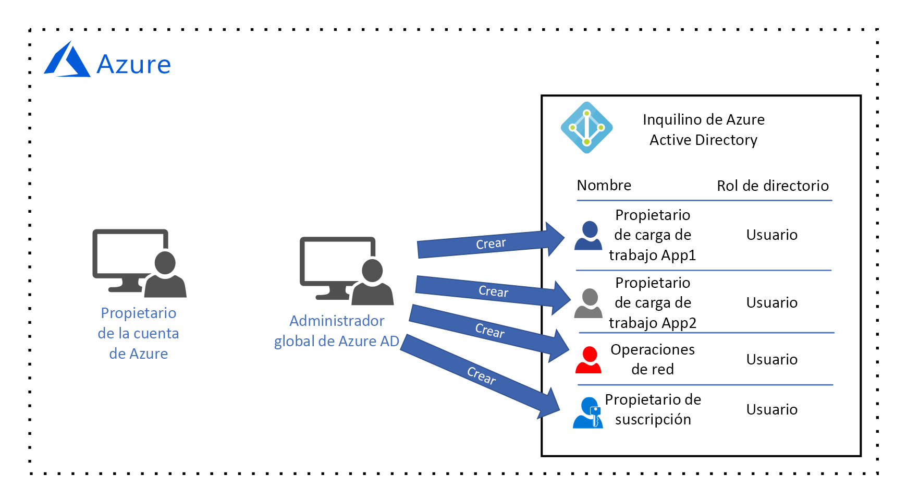
*Figura 2. El administrador global de Azure AD crea las cuentas de usuario necesarias en el inquilino.*

Las dos primeras cuentas, **propietario de la carga de trabajo de App1** y **propietario de la carga de trabajo de App2**, están asociadas a una persona de nuestra organización responsable de administrar una carga de trabajo. La cuenta de **operaciones de red** pertenece a la persona responsable de los recursos de la infraestructura compartida. Por último, la cuenta del **propietario de la suscripción** está asociada con la persona responsable de la propiedad de las suscripciones.

## Modelo de permisos de acceso a recursos con privilegios mínimos

Ahora que tenemos nuestras cuentas de usuario y el sistema de administración de identidad creados, hay que decidir cómo se aplicarán los roles con control de acceso basado en rol (RBAC) a cada cuenta para admitir un modelo de permisos con privilegios mínimos.

Otro de nuestros requisitos es que los recursos asociados a cada carga de trabajo estén aislados entre sí para que ningún propietario de carga de trabajo tenga acceso administrativo a otras cargas de trabajo que no les pertenezcan. Tenemos un requisito para implementar este modelo usando solo los [roles integrados para Azure RBAC][rbac-built-in-roles].

Cada rol RBAC se aplica en uno de los tres ámbitos en Azure: **suscripción**, **grupo de recursos** y **recursos** individuales. Los roles se heredan en los ámbitos inferiores. Por ejemplo, si a un usuario se le asigna el [rol de propietario integrada][rbac-built-in-owner] en el nivel de suscripción, ese rol también se asigna a ese usuario en el nivel de recurso individual y de grupo de recursos, a menos que se invalide.

Por lo tanto, para crear un modelo de acceso con privilegios mínimos, hay que decidir qué acciones puede realizar un determinado tipo de usuario en cada uno de estos tres ámbitos. Por ejemplo, nuestro requisito es que el propietario de una carga de trabajo tenga permiso para administrar el acceso únicamente a los recursos asociados con su carga de trabajo y no a otros. Si quisiéramos asignar el [rol de propietario integrado][rbac-built-in-owner] en el ámbito de la suscripción, cada propietario de carga de trabajo tendría acceso de administración a todas las cargas de trabajo.

Veamos dos ejemplos de modelos de permisos para entender este concepto algo mejor. En el primer ejemplo, nuestro modelo confía solo en el administrador de servicios para crear grupos de recursos. En el segundo ejemplo, nuestro modelo asigna el rol de propietario integrado a cada propietario de carga de trabajo en el ámbito de la suscripción. 

En ambos ejemplos, tenemos un administrador de servicios de suscripción al que se asigna el [rol de propietario integrado][rbac-built-in-owner] en el ámbito de la suscripción. Recuerde que el [rol de propietario integrado][rbac-built-in-owner] concede todos los permisos, incluida la administración de acceso a los recursos.
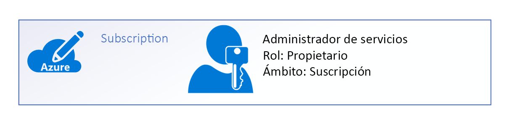
*Figura 3. Una suscripción con un administrador de servicios al que se asigna el rol de propietario integrado.* 

1. En el primer ejemplo, tenemos el **propietario de carga de trabajo A** sin ningún permiso en el ámbito de suscripción. De forma predeterminada, no tienen derechos de administración de acceso a los recursos. Este usuario quiere volver a implementar y administrar los recursos de su carga de trabajo. Debe ponerse en contacto con el **administrador de servicios** para pedir la creación de un grupo de recursos.
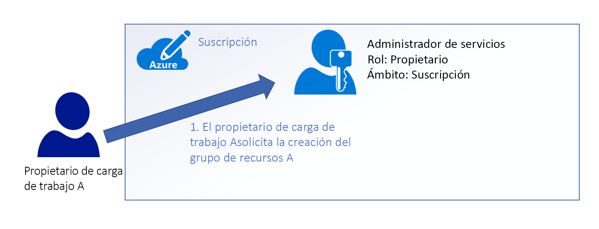  

2. El **administrador de servicios** revisa la solicitud y crea el **grupo de recursos A**. En este momento, el **propietario de carga de trabajo A** aún no tiene permiso para hacer nada.
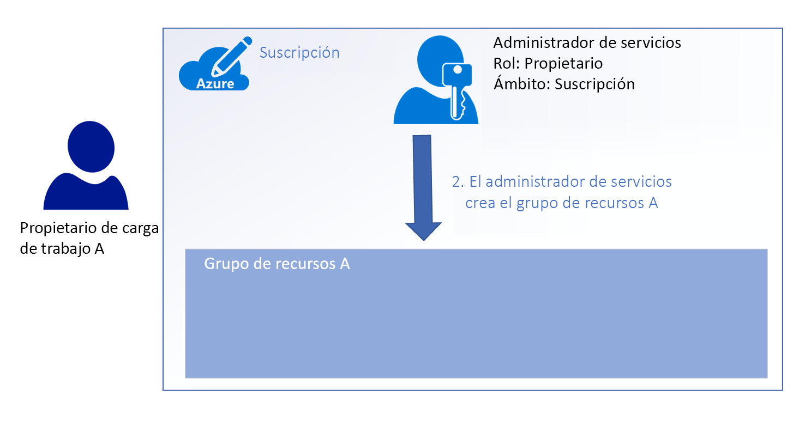

3. El **administrador de servicios** agrega el **propietario de carga de trabajo A** al **grupo de recursos A** y le asigna el [rol de colaborador integrado](/azure/role-based-access-control/built-in-roles#contributor). El rol de colaborador concede todos los permisos en el **grupo de recursos A** excepto la administración de los permisos de acceso.
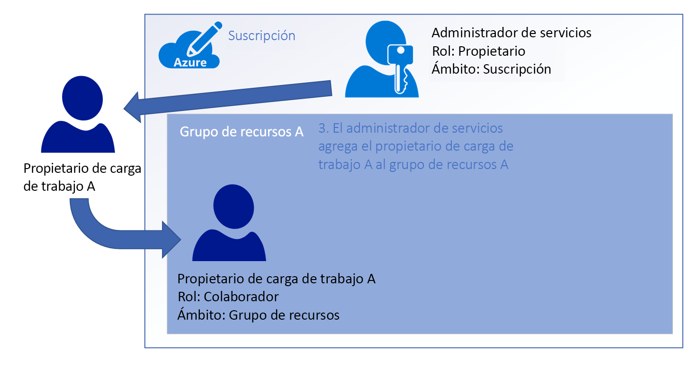

4. Supongamos que el **propietario de carga de trabajo A** necesita que un par de miembros del equipo vean los datos de supervisión del tráfico de red y la CPU como parte de la planeación de la capacidad para la carga de trabajo. Dado que el **propietario de carga de trabajo A** tiene asignado el rol de colaborador, no tiene permiso para agregar un usuario al **grupo de recursos A**. Debe enviar esta solicitud al **administrador de servicios**.
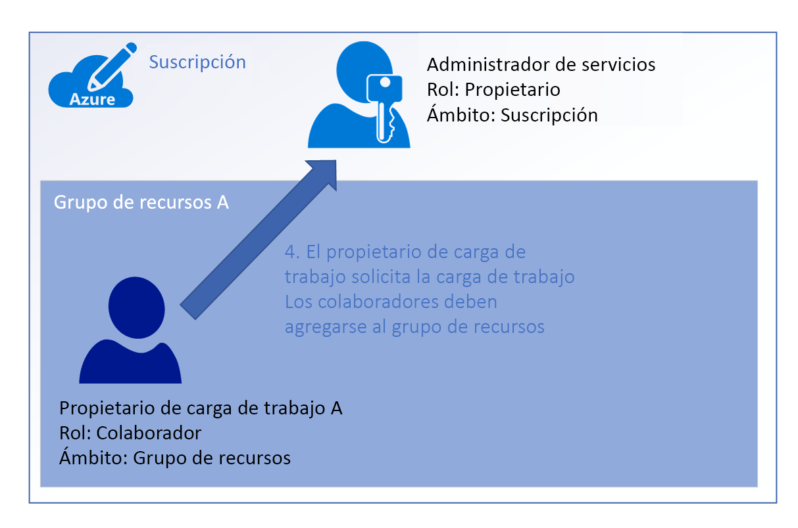

5. El **administrador de servicios** revisa la solicitud y agrega los dos usuarios **colaboradores de carga de trabajo** al **grupo de recursos A**. Ninguno de estos dos usuarios necesitan permiso para administrar los recursos, por lo que se les asigna el [rol de lector integrado](/azure/role-based-access-control/built-in-roles#contributor). 
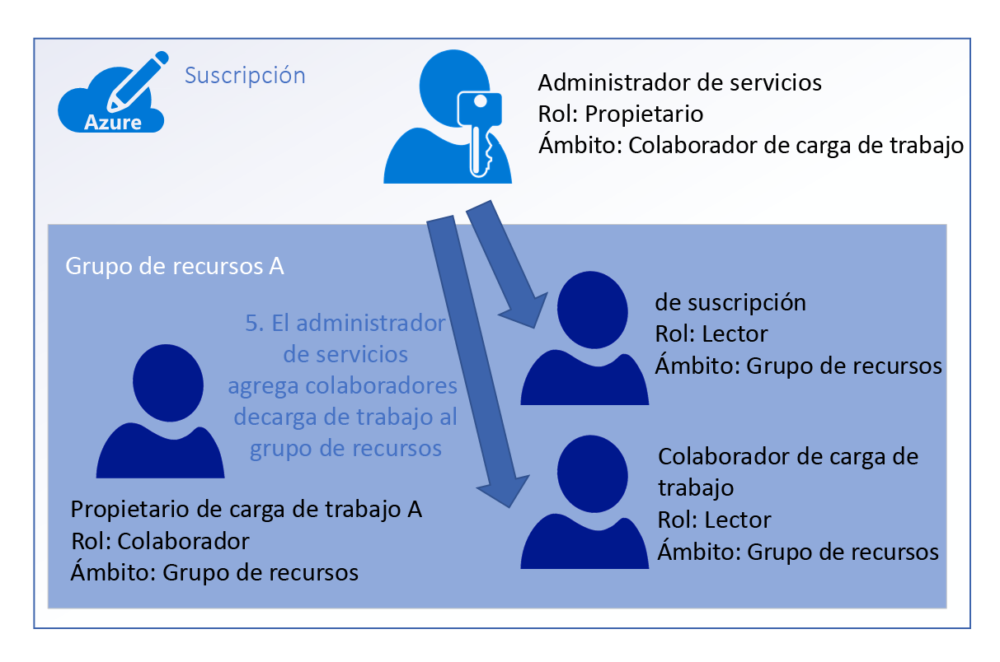

6. El **propietario de carga de trabajo B** también necesita un grupo de recursos para incluir los recursos de su carga de trabajo. Al igual que con el **propietario de carga de trabajo A**, el **propietario de carga de trabajo B** inicialmente no tiene permisos para realizar ninguna acción en el ámbito de la suscripción, por lo que debe enviar una solicitud al **administrador de servicios**. 
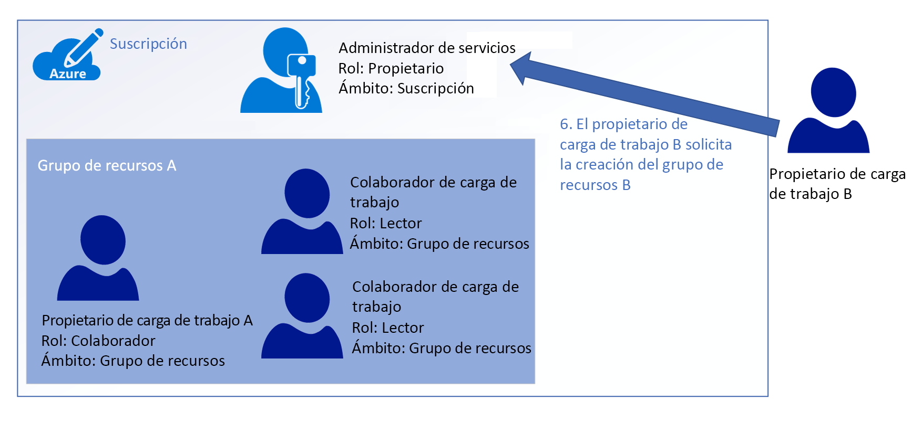

7. El **administrador de servicios** revisa la solicitud y crea el **grupo de recursos B**. 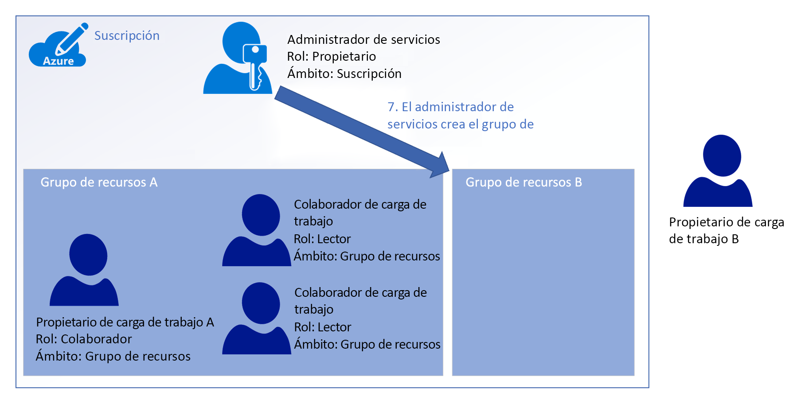

8. El **administrador de servicios** agrega el **propietario de carga de trabajo B** al **grupo de recursos B** y le asigna el [rol de colaborador integrado](https://docs.microsoft.com/en-us/azure/role-based-access-control/built-in-roles#contributor). 
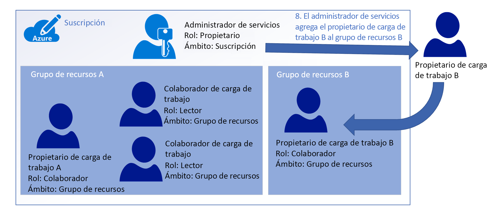

En este momento, cada uno de los propietarios de carga de trabajo está aislado en su propio grupo de recursos. Ninguno de los propietarios de carga de trabajo ni los miembros del equipo tienen acceso administrativo a los recursos de otros grupos de recursos. 

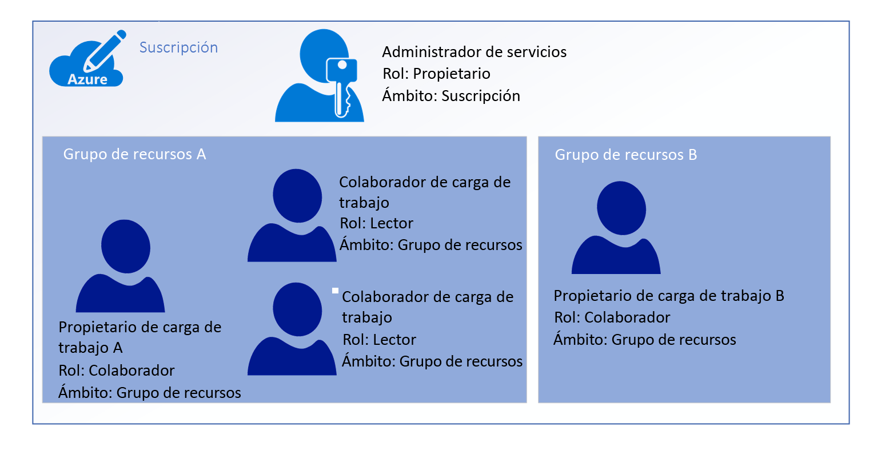
*Figura 4. Una suscripción con dos propietarios de carga de trabajo aislados con sus propios grupos de recursos.*

Este modelo es un modelo de privilegios mínimos; a cada usuario se le asigna los permisos correctos en el ámbito de administración de recursos correcto.

Sin embargo, tenga en cuenta que todas las tareas del ejemplo las realizó el **administrador de servicios**. Este es un ejemplo sencillo y quizás esto no parezca un problema porque hay solo dos propietarios de cargas de trabajo, pero es fácil imaginar los tipos de problemas que habría en una organización grande. Por ejemplo, el **administrador de servicios** puede convertirse en un cuello de botella con muchas solicitudes acumuladas que, como resultado, producen retrasos.  

Veamos otro ejemplo que reduce el número de tareas realizadas por el **administrador de servicios**. 

1. En este modelo, al **propietario de carga de trabajo A** se le asigna el [rol de propietario integrado][rbac-built-in-owner] en el ámbito de la suscripción, lo que le permite crear su propio grupo de recursos: **grupo de recursos A**. 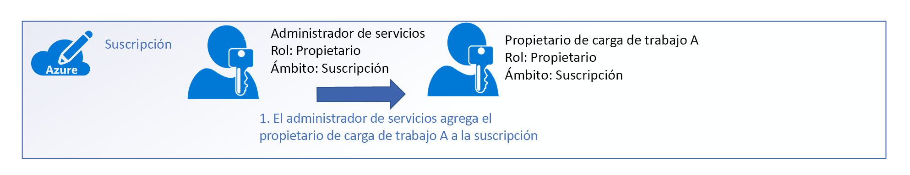

2. Cuando se crea el **grupo de recursos A**, se agrega el **propietario de carga de trabajo A** de forma predeterminada y hereda el [rol de propietario integrado][rbac-built-in-owner] del ámbito de la suscripción.
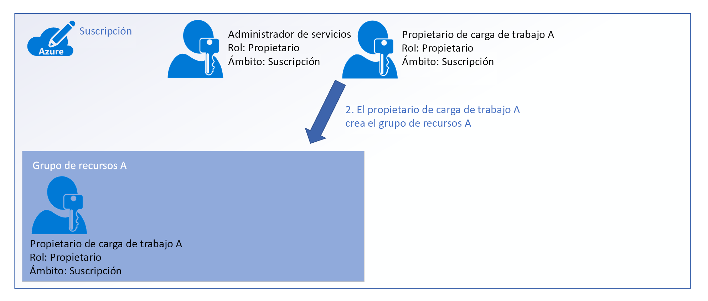

3. El [rol de propietario integrado][rbac-built-in-owner] concede al **propietario de carga de trabajo A** permisos para administrar el acceso al grupo de recursos. El **propietario de carga de trabajo A** agrega dos **colaboradores de carga de trabajo** y asigna el [rol de lector integrado][rbac-built-in-owner] a cada uno de ellos. 
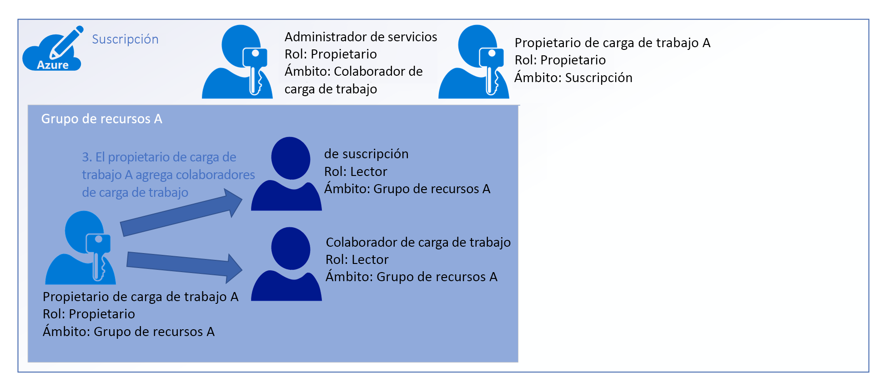

4. Ahora, el **administrador de servicios** agrega el **propietario de carga de trabajo B** a la suscripción con el rol de propietario integrado. 
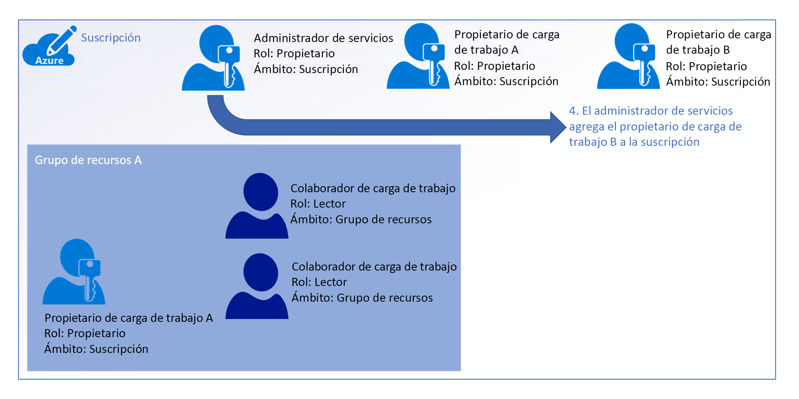

5. El **propietario de carga de trabajo B** crea el **grupo de recursos B** y se agrega de forma predeterminada. Una vez más, el **propietario de carga de trabajo B** hereda el rol de propietario integrado del ámbito de la suscripción.
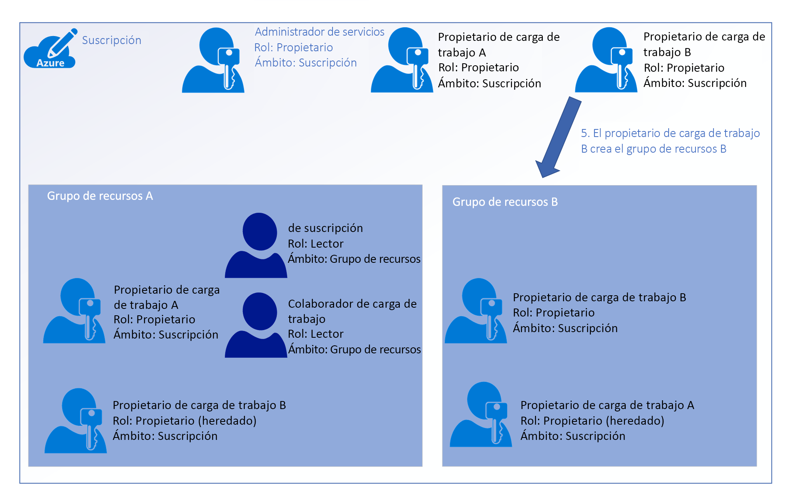

Tenga en cuenta que, en este modelo, el **administrador de servicios** realizó menos acciones que en el primer ejemplo debido a que se delegó la administración del acceso a cada uno de los propietarios de carga de trabajo individuales.

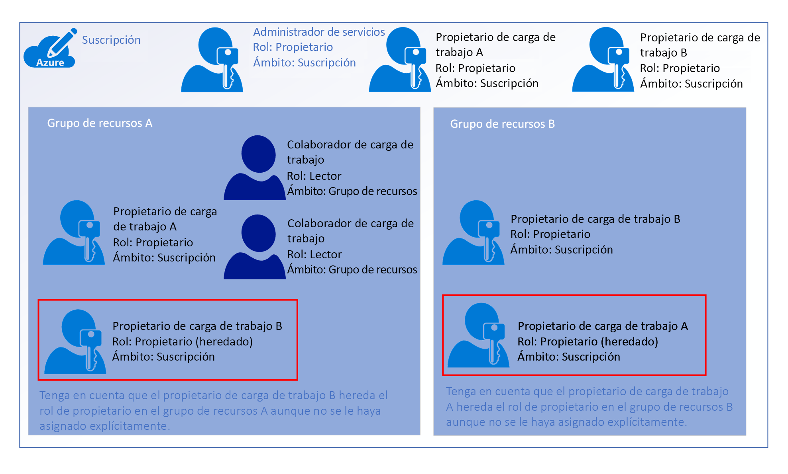
*Figura 5. Una suscripción con un administrador de servicios y dos propietarios de carga de trabajo a los que se asigna el rol de propietario integrado.*

Sin embargo, como el **propietario de carga de trabajo A** y el **propietario de carga de trabajo B** tienen asignado el rol de propietario integrado en el ámbito de la suscripción, han heredado el rol de propietario integrado del grupo de recursos del otro. Esto significa que no solo tienen acceso total a los recursos del otro, también pueden delegar el acceso administrativo a los grupos de recursos del otro. Por ejemplo, el **propietario de carga de trabajo B** tiene derechos para agregar otros usuarios al **grupo de recursos A** y puede asignarles cualquier rol, como el rol de propietario integrado.

Si comparamos cada ejemplo con nuestras necesidades, vemos que ambos ejemplos admiten un único usuario de confianza en el ámbito de la suscripción con permisos para conceder derechos de acceso a los recursos a nuestros dos propietarios de carga de trabajo. Ninguno de los dos propietarios de carga de trabajo tenía acceso a la administración de recursos de forma predeterminada y necesitaron que el **administrador de servicios** les asignara los permisos explícitamente. Sin embargo, solo el primer ejemplo admite que los recursos asociados a cada carga de trabajo estén aislados entre sí de manera que ningún propietario de carga de trabajo tenga acceso a los recursos de otras cargas de trabajo.

## Modelo de administración de recursos

Ahora que hemos diseñado un modelo de permisos con privilegios mínimos, vamos a ver algunas aplicaciones prácticas de estos modelos de gobierno. Recuerde de nuestros requisitos son que debemos admitir los siguientes tres entornos:
1. **Infraestructura compartida:** un único grupo de recursos compartidos por todas las cargas de trabajo. Estos son recursos tales como puertas de enlace de red, firewalls y servicios de seguridad.  
2. **Desarrollo:** varios grupos de recursos que representan varias cargas de trabajo que no están listas para producción. Estos recursos se utilizan para pruebas de concepto, pruebas y otras actividades de desarrollo. Estos recursos pueden tener un modelo de gobierno más flexible para ofrecer más agilidad a los desarrolladores.
3. **Producción:** varios grupos de recursos que representan varias cargas de trabajo. Estos recursos se utilizan para hospedar los artefactos de aplicación de acceso privado y público. Estos recursos normalmente tienen un gobierno y modelos de seguridad más estrictos para proteger los recursos, el código de la aplicación y los datos contra accesos no autorizados.

En cada uno de estos tres entornos, necesitamos realizar el seguimiento de los datos de costo por **propietario de carga de trabajo**, **entorno** o ambos. Es decir, queremos saber el costo actual de nuestra **infraestructura compartida**, los costos en los que incurren las personas tanto en el entorno de **desarrollo** como de **producción** y, por último, el bosto total de **desarrollo** y **producción**. 

Ya ha aprendido que el ámbito de los recursos se establece en dos niveles: **suscripción** y **grupo de recursos**. Por lo tanto, nuestra primera decisión es cómo organizar nuestros entornos por **suscripción**. Hay solo dos posibilidades: una sola suscripción o varias suscripciones. 

Antes de adentrarnos en los ejemplos de cada uno de estos modelos, revisemos la estructura de administración de las suscripciones de Azure. 

Recuerde que necesitamos tener una persona en nuestra organización que sea responsable de las suscripciones, y que este usuario tiene la cuenta de **propietario de la suscripción** en el inquilino de Azure AD. Sin embargo, esta cuenta no tiene permisos para crear suscripciones. Solo el **propietario de la cuenta de Azure** tiene permisos para hacerlo: 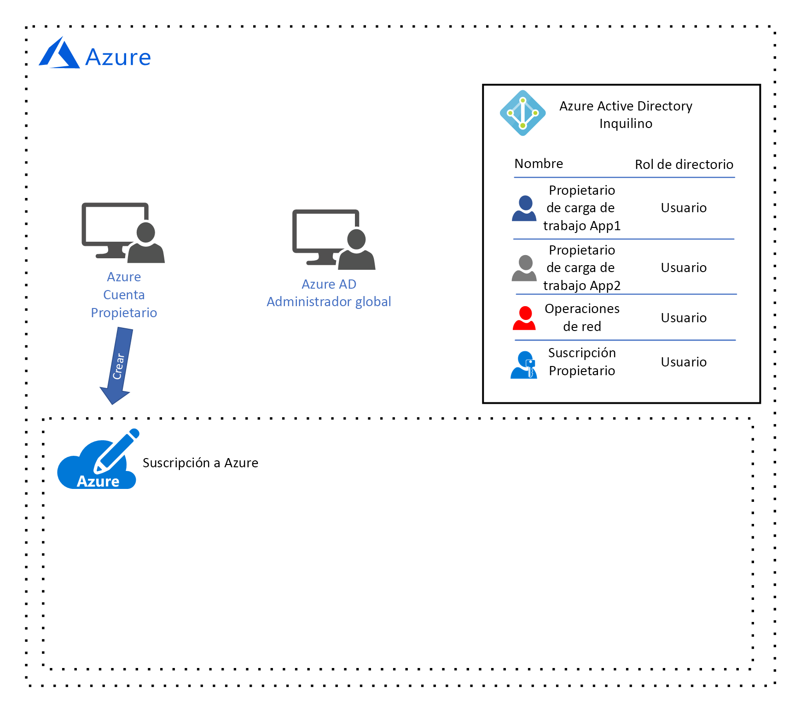
*Figura 6. El propietario de una cuenta de Azure crea una suscripción.*

Una vez creada la suscripción, el **propietario de la cuenta de Azure** puede agregar la cuenta de **propietario de la suscripción** a la suscripción con el rol de **propietario**:

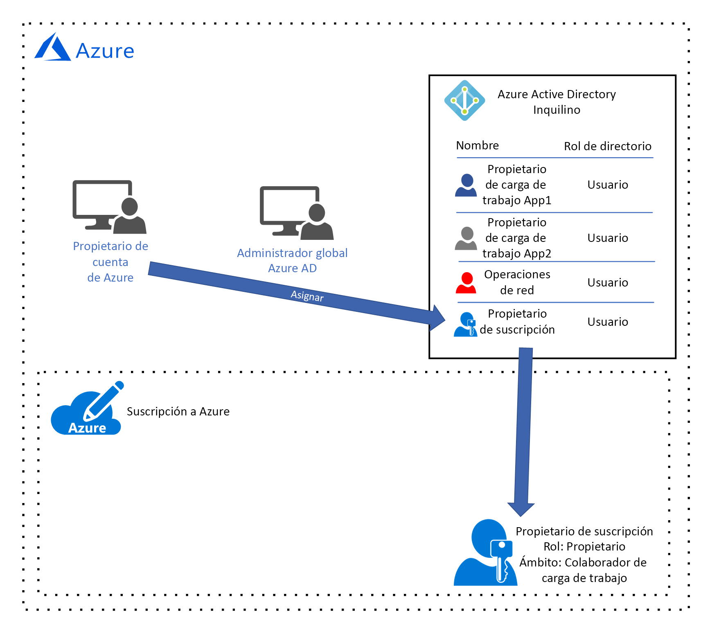
*Figura 7. El propietario de la cuenta de Azure agrega la cuenta de usuario de **propietario de la suscripción** a la suscripción con el rol de **propietario**.*

Ahora, el **propietario de la suscripción** puede crear **grupos de recursos** y delegar la administración del acceso a los recursos.

Veamos primero un ejemplo de un modelo de administración de recursos con una sola suscripción. Nuestra primera decisión es cómo alinear los grupos de recursos con los tres entornos. Tenemos dos opciones:
1. Alinear cada entorno con un único grupo de recursos. Todos los recursos de la infraestructura compartida se implementan en un único grupo de recursos de la **infraestructura compartida**. Todos los recursos asociados con las cargas de trabajo de desarrollo se implementan en un único grupo de recursos de **desarrollo**. Todos los recursos asociados con las cargas de trabajo de producción se implementan en un solo grupo de recursos de **producción** para el entorno de **producción**. 
2. Alinear las cargas de trabajo con un grupo de recursos independiente, mediante una convención de nomenclatura y etiquetas para alinear los grupos de recursos con cada uno de los tres entornos.  

Comencemos evaluando la primera opción. Usaremos el modelo de permisos descrito en la sección anterior, con un único administrador de servicios de suscripción que crea grupos de recursos y agrega usuarios con los roles **colaborador** o **lector** integrados. 

1. El primer grupo de recursos implementado representa el entorno de **infraestructura compartida**. El **propietario de la suscripción** crea un grupo de recursos para los recursos de la infraestructura compartida llamado **netops-shared-rg**. 
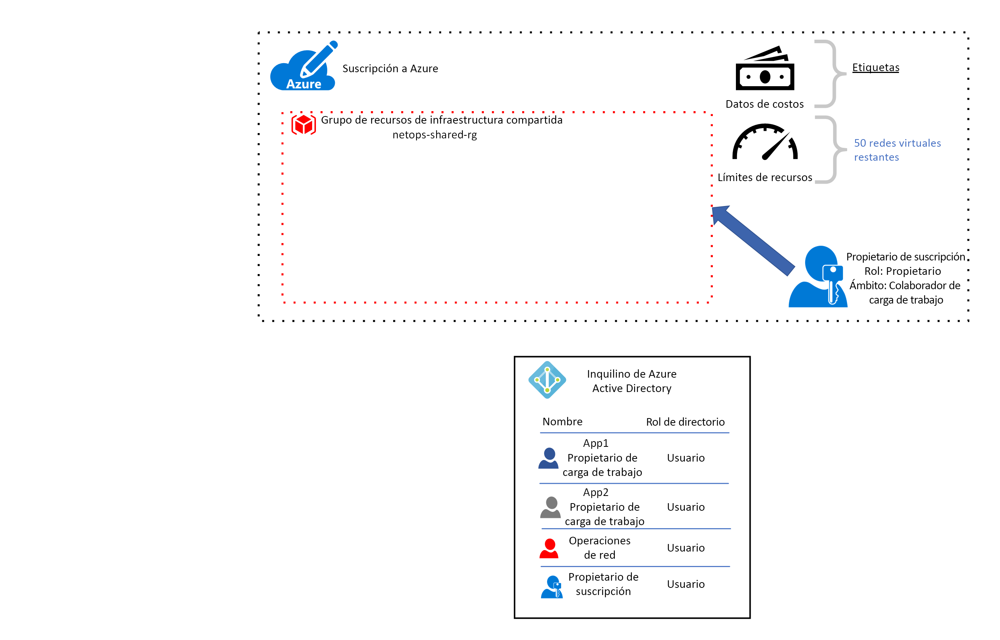
2. El **propietario de la suscripción** agrega la cuenta del **usuario de operaciones de red** al grupo de recursos y le asigna el rol de **colaborador**. 
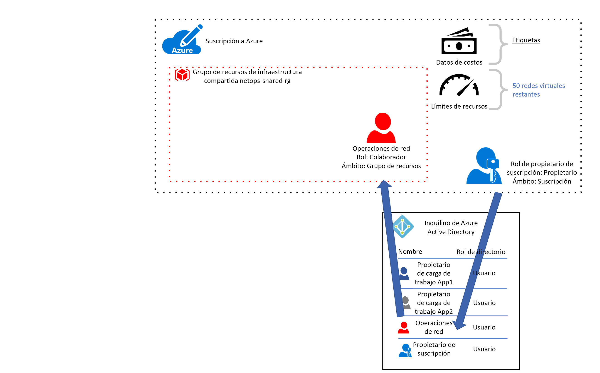
3. El **usuario de operaciones de red** crea una [puerta de enlace VPN](/azure/vpn-gateway/vpn-gateway-about-vpngateways) y la configura para que se conecte al dispositivo VPN local. El **usuario de operaciones de red** también aplica un par de [etiquetas](/azure/azure-resource-manager/resource-group-using-tags) a cada uno de los recursos: *environment:shared* y *managedBy:netOps*. Cuando el **administrador de servicios de suscripción** exporta un informe de costos, los costos se alinearán con cada una de estas etiquetas. Esto permite al **administrador de servicios de suscripción** dinamizar los costos con las etiquetas *environment* y *managedBy*. Observe el contador **límites de recursos** en la parte superior derecha de la ilustración. Cada suscripción de Azure tiene [límites de servicio](/azure/azure-subscription-service-limits) y, para ayudarle a comprender el efecto de estos límites, seguiremos los límites de redes virtuales para cada suscripción. Hay un límite predeterminado de 50 redes virtuales por suscripción y, después de implementar la primera red virtual, quedan 49 disponibles.
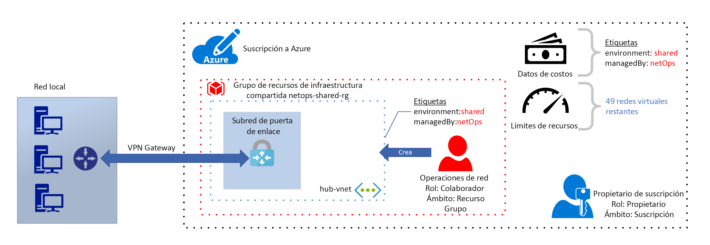
4. Se implementan dos grupos de recursos más; el primero se llama *prod-rg*. Este grupo de recursos se alinea con el entorno de **producción**. El segundo se llama *dev-rg* y se alinea con el entorno de **desarrollo**. Todos los recursos asociados con las cargas de trabajo de producción se implementan en el entorno de **producción** y todos los recursos asociados con las cargas de trabajo de desarrollo se implementan en el entorno de **desarrollo**. En este ejemplo solo implementaremos dos cargas de trabajo en cada uno de estos dos entornos, por lo que no encontraremos ningún límite del servicio de suscripción de Azure. Sin embargo, es importante tener en cuenta que cada grupo de recursos tiene un límite de 800 recursos por grupo. Por lo tanto, si seguimos agregando cargas de trabajo a cada grupo de recursos, es posible que se alcance este límite. 
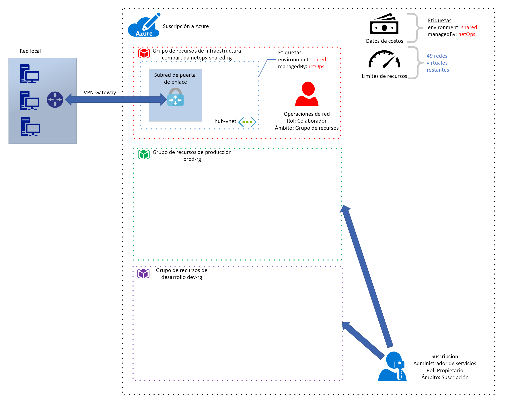
5. El primer **propietario de carga de trabajo** envía una solicitud al **administrador de servicios de suscripción** y se agrega a cada uno de los grupos de recursos de los entornos de **desarrollo** y **producción** con el rol de **colaborador**. Tal y como hemos visto, el rol de **colaborador** permite al usuario realizar cualquier operación distinta de la asignación de un rol a otro usuario. Ahora, el primer **propietario de carga de trabajo** puede crear los recursos asociados con la carga de trabajo.

6. El primer **propietario de carga de trabajo** crea una red virtual en cada uno de los dos grupos de recursos con un par de máquinas virtuales en cada una. El primer **propietario de carga de trabajo** aplica las etiquetas *environment* y *managedBy* a todos los recursos. Tenga en cuenta que el contador de límite de servicio de Azure ahora está en 47 redes virtuales restantes.
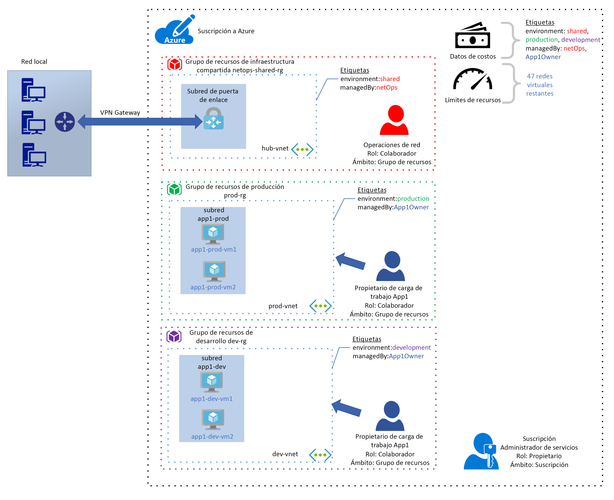
7. Ninguna de las redes virtuales tiene conectividad local cuando se crean. En este tipo de arquitectura, se debe emparejar cada red virtual con la red virtual *hub-vnet* en el entorno de la **infraestructura compartida**. El emparejamiento de redes virtuales crea una conexión entre dos redes virtuales diferentes y permite que el tráfico de red viaje entre ellas. Tenga en cuenta que el emparejamiento de redes virtuales no es intrínsecamente transitivo. Un emparejamiento debe especificarse entre las dos redes virtuales que están conectadas y, si solo una de las redes virtuales especifica un emparejamiento, la conexión está incompleta. Para mostrar este efecto, el primer **propietario de carga de trabajo** especifica un emparejamiento entre **prod-vnet** y **hub-vnet**. Se crea el primer emparejamiento, pero el tráfico no circula porque el emparejamiento complementario de **hub-vnet** a **prod-vnet** todavía no se ha especificado. El primer **propietario de carga de trabajo** se pone en contacto con el usuario de **operaciones de red** y solicita esta conexión de emparejamiento complementaria.
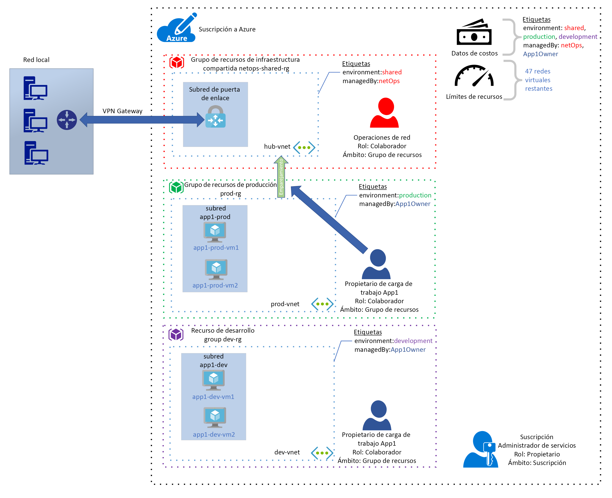
8. El usuario de **operaciones de red** revisa la solicitud, la aprueba y luego especifica el emparejamiento en la configuración de **hub-vnet**. La conexión de emparejamiento ya está completa y el tráfico de red circula entre las dos redes virtuales.
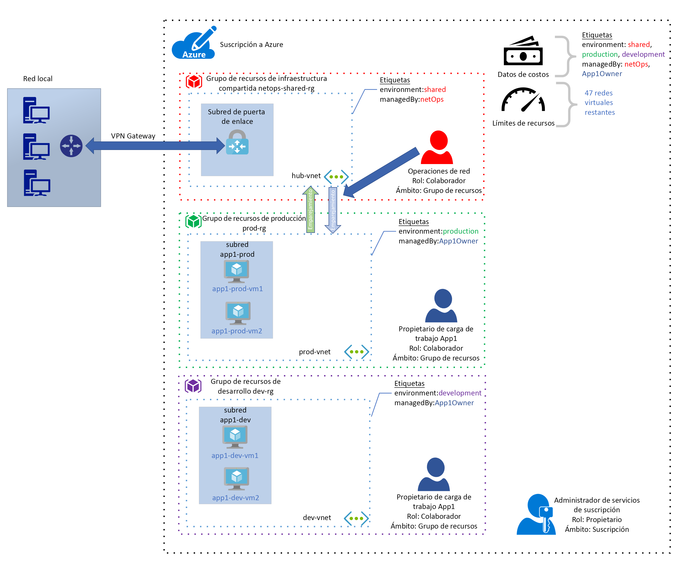
9. Ahora, el segundo **propietario de carga de trabajo** envía una solicitud al **administrador de servicios de suscripción** y se agrega a los grupos de recursos existentes en los entornos de **desarrollo** y **producción** con el rol de **colaborador**. El segundo **propietario de carga de trabajo** tiene los mismos permisos en todos los recursos que el primer **propietario de carga de trabajo** en cada grupo de recursos. 
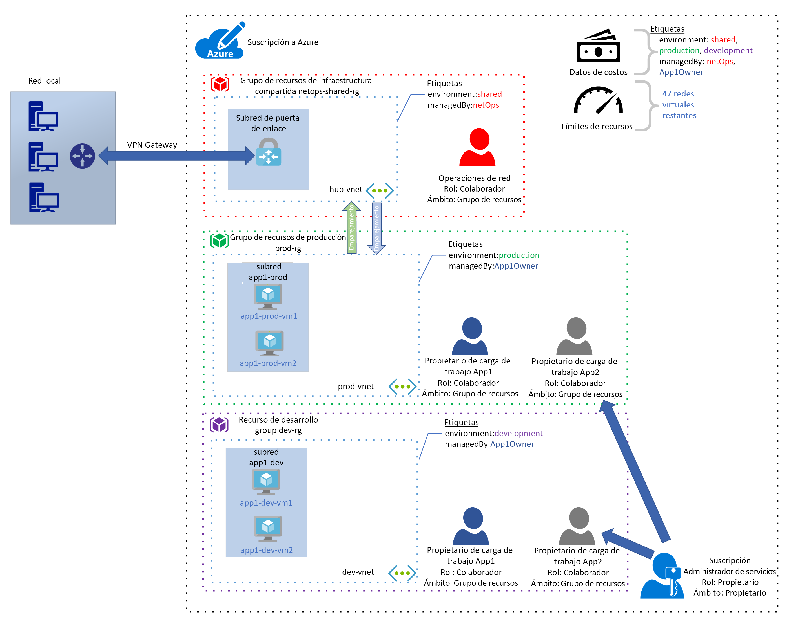
10. El segundo **propietario de carga de trabajo** crea una subred en la red virtual **prod-vnet** y luego agrega dos máquinas virtuales. El segundo **propietario de carga de trabajo** aplica las etiquetas *environment* y *managedBy* a todos los recursos.
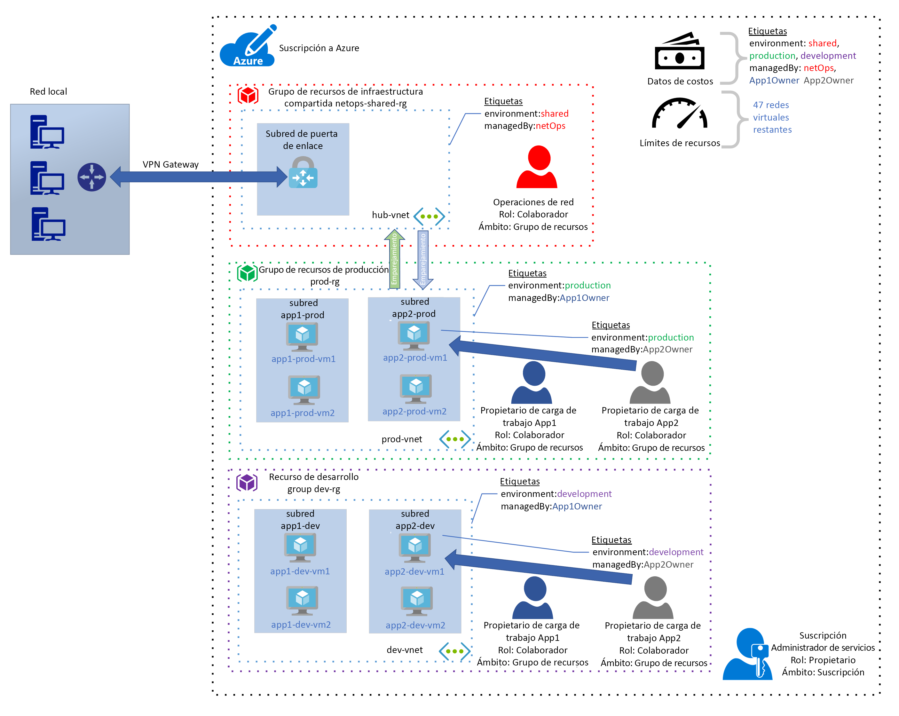 

Este ejemplo de modelo de administración de recursos nos permite administrar nuestros recursos en los tres entornos necesarios. Los recursos de la infraestructura compartida están protegidos porque hay un único usuario en la suscripción con permisos para acceder a esos recursos. Cada uno de los propietarios de cargas de trabajo puede utilizar los recursos de la infraestructura compartida sin tener permisos en los recursos compartidos en sí. Este modelo de administración no cumple nuestro requisito de aislamiento de las cargas de trabajo; los dos **propietarios de cargas de trabajo** pueden acceder a los recursos de la otra carga de trabajo. 

Hay otra consideración importante con este modelo puede no resultar obvio a simple vista. En nuestro ejemplo, el **propietario de carga de trabajo app1** solicitó la conexión de emparejamiento de red con la red virtual **hub-vnet** para proporcionar conectividad al entorno local. El usuario de **operaciones de red** evaluó la solicitud según los recursos implementados con esa carga de trabajo. Cuando el **propietario de la suscripción** agregó al **propietario de carga de trabajo app2** con el rol de **colaborador**, ese usuario tenía derechos de acceso de administración a todos los recursos del grupo de recursos **prod-rg**. 

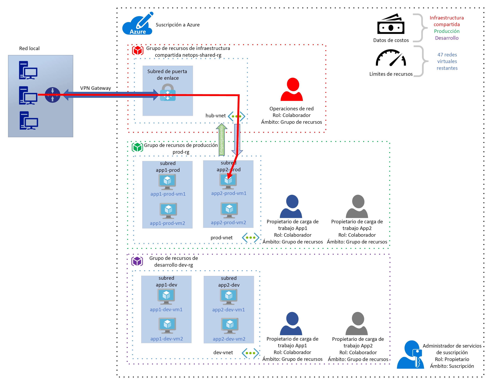

Esto significa que el **propietario de carga de trabajo app2** tenía permisos para implementar su propia subred con máquinas virtuales en la red virtual **prod-vnet**. De forma predeterminada, esas máquinas virtuales ahora tienen acceso a la red local. El usuario de **operaciones de red** no es consciente de esas máquinas y no aprobó su conectividad al entorno local.

Ahora, veamos a un única suscripción con varios grupos de recursos para diferentes entornos y cargas de trabajo. Tenga en cuenta que, en el ejemplo anterior, los recursos de cada entorno se podían identificar fácilmente porque estaban en el mismo grupo de recursos. Ahora que ya no tenemos esa agrupación, tenemos que utilizar una convención de nomenclatura en el grupo de recursos para proporcionar esa funcionalidad. 

1. Los recursos de nuestra **infraestructura compartida** seguirán teniendo un grupo de recursos independiente en este modelo, por lo eso sigue igual. Cada carga de trabajo requiere dos grupos de recursos: uno para cada uno de los entornos de **desarrollo** y **producción**. Para la primera carga de trabajo, el **propietario de la suscripción** crea dos grupos de recursos. El primero se llama **app1-prod-rg** y el otro se llama **app1-dev-rg**. Tal y como se indicó anteriormente, esta convención de nomenclatura identifica los recursos como asociados con la primera carga de trabajo, **app1**, y el entorno **dev** o **prod**. Una vez más, el propietario de la *suscripción* agrega el **propietario de carga de trabajo app1** al grupo de recursos con el rol de **colaborador**.
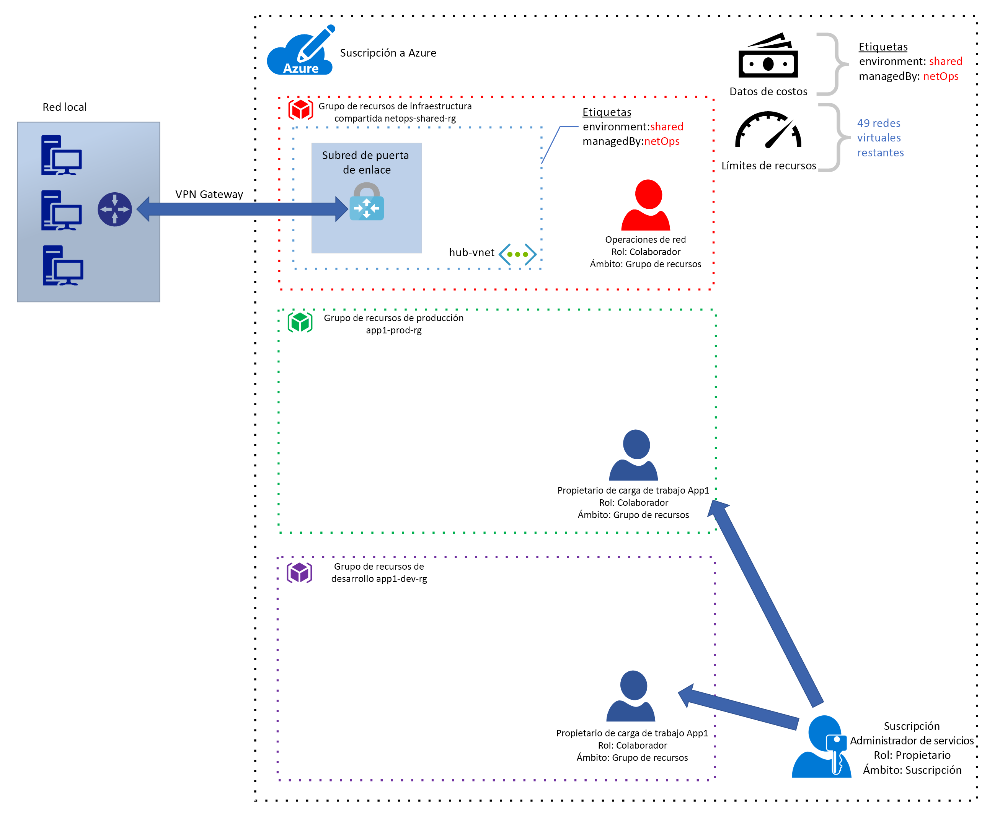
2. De forma similar al primer ejemplo, el **propietario de carga de trabajo app1** implementa una red virtual llamada **app1-prod-vnet** en el entorno de **producción** y otra llamada **app1-dev-vnet** en el entorno de **desarrollo**. Una vez más, el **propietario de carga de trabajo app1** envía una solicitud al usuario de **operaciones de red** para crear una conexión de emparejamiento. Tenga en cuenta que el **propietario de carga de trabajo app1** agrega las mismas etiquetas que en el primer ejemplo, y el límite de contadores se ha reducido a 47 redes virtuales disponibles en la suscripción.
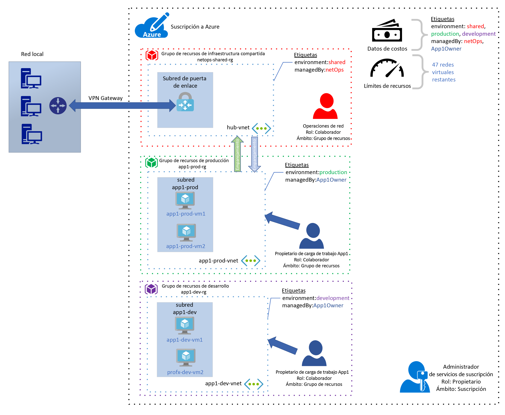
3. El **propietario de la suscripción** ahora crea dos grupos de recursos para el **propietario de carga de trabajo app2**. Siguiendo las mismas convenciones que para el **propietario de carga de trabajo app1**, los grupos de recursos se llaman **app2-prod-rg** y **app2-dev-rg**. El **propietario de la suscripción** agrega el **propietario de carga de trabajo app2** a cada uno de los grupos de recursos con el rol de **colaborador**.
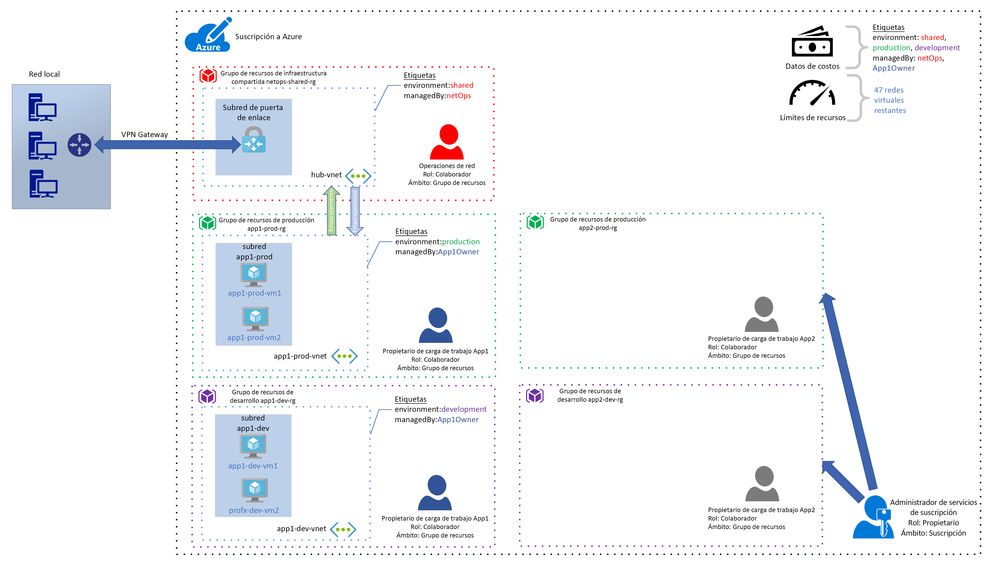
4. El *propietario de carga de trabajo app2* implementa las redes virtuales y las máquinas virtuales en los grupos de recursos con las mismas convenciones de nomenclatura. Se agregan las etiquetas y el contador de límite se ha reducido a 45 redes virtuales disponibles en la *suscripción*.
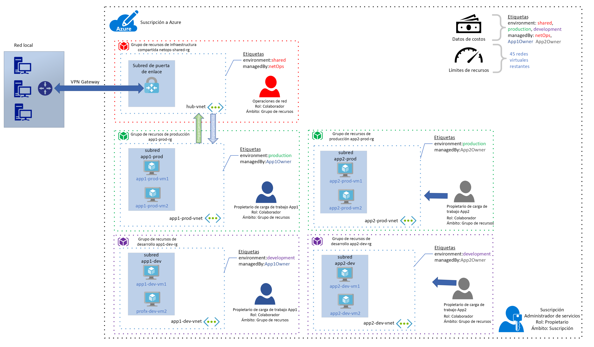
5. El *propietario de carga de trabajo app2* envía una solicitud al usuario de *operaciones de red* para emparejar la *app2-prod-vnet* con *hub-vnet*. El usuario de *operaciones de red* crea la conexión de emparejamiento.
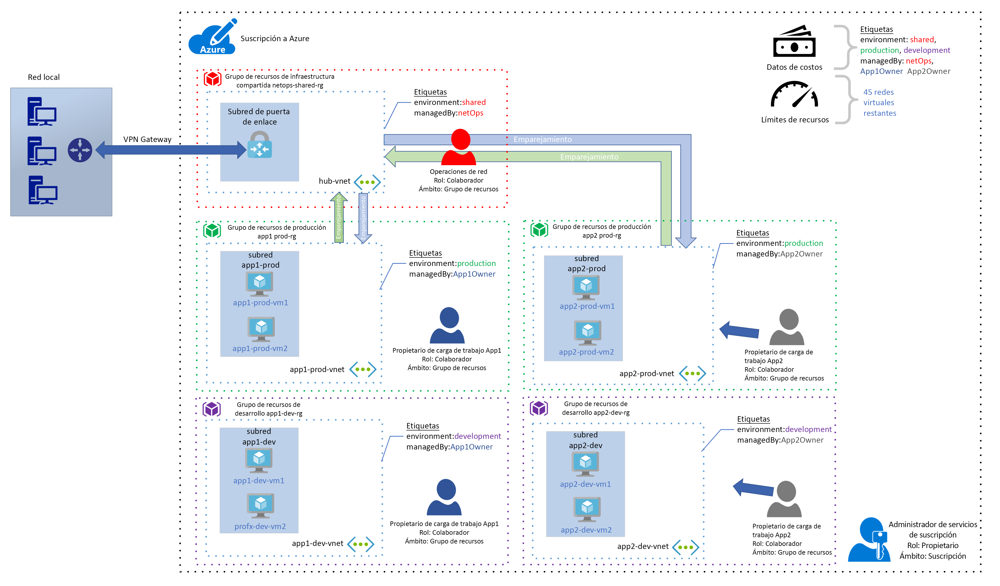

El modelo de administración resultante es similar al primer ejemplo, con algunas diferencias importantes:
* Cada una de las dos cargas de trabajo se aísla por carga de trabajo y por entorno.
* Este modelo requiere dos redes virtuales más que el primer ejemplo de modelo. Aunque esto no supone mucha diferencia cuando solo hay dos cargas de trabajo, el límite teórico en el número de cargas de trabajo en este modelo es 24. 
* Los recursos ya no se agrupan en un único grupo de recursos para cada entorno. Para agrupar los recursos es necesario conocer las convenciones de nomenclatura que se usan en cada entorno. 
* El usuario de *operaciones de red* ha revisado y aprobado cada una de las conexiones de emparejamiento de red virtual.

Veamos ahora un ejemplo de un modelo de administración de recursos con varias suscripciones. En este modelo, alinearemos cada uno de los tres entornos con una suscripción diferente: una suscripción de **servicios compartidos**, una suscripción de **producción** y, por último, una suscripción de **desarrollo**. Las consideraciones para este modelo son similares a las del modelo con una sola suscripción en el sentido de que hay que decidir cómo alinear los grupos de recursos con las cargas de trabajo. Ya que hemos determinado que crear un grupo de recursos para cada carga de trabajo satisface el requisito de aislamiento de las cargas de trabajo, por lo que nos quedaremos con ese modelo en este ejemplo.

1. En este modelo, hay tres *suscripciones*: *infraestructura compartida*, *producción* y *desarrollo*. Cada una de estas tres suscripciones requiere un *propietario de la suscripción* y, en nuestro ejemplo sencillo, usaremos la misma cuenta de usuario para las tres. Los recursos de la *infraestructura compartida* se administran de manera similar a los primeros dos ejemplos anteriores, y la primera carga de trabajo se asocia con *app1-rg* en el entorno de *producción* y el segundo grupo de recursos con el mismo nombre en el entorno de *desarrollo*. El *propietario de carga de trabajo app1* se agrega a cada uno de los grupos de recursos con el rol de *colaborador*. 

2. Al igual que en los ejemplos anteriores, el *propietario de carga de trabajo app1* crea los recursos y solicita la conexión de emparejamiento con la red virtual de la *infraestructura compartida*. El *propietario de carga de trabajo app1* agrega solo la etiqueta *managedBy* porque ya no se necesita la etiqueta *environment*. Es decir, los recursos de cada entorno están agrupados en la misma *suscripción* y la etiqueta *environment* es redundante. El contador de límite se reduce a 49 redes virtuales disponibles.
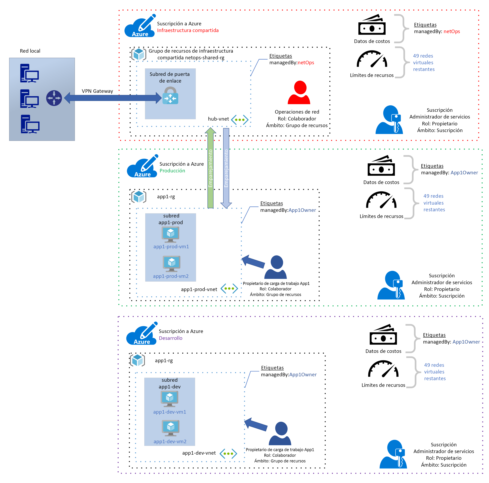
3. Por último, el *propietario de la suscripción* repite el proceso para la segunda carga de trabajo, y agrega el *propietario de carga de trabajo app2* a los grupos de recursos con el rol de colaborador. El contador de límite para cada una de las suscripciones del entorno se reducido a 48 redes virtuales disponibles. 

Este modelo de administración tiene las ventajas del segundo ejemplo anterior. Sin embargo, la principal diferencia es que los límites suponen un problema menor porque se extienden a dos *suscripciones*. El inconveniente es que los datos de costos que se controlan con las etiquetas se deben agregar a las tres *suscripciones*. 

Por lo tanto, puede seleccionar cualquiera de estos dos ejemplos de modelos de administración de recursos según la prioridad de sus requisitos. Si prevé que su organización no llegará a los límites de servicio para una sola suscripción, puede utilizar una sola suscripción con varios grupos de recursos. Por el contrario, si su organización anticipa muchas cargas de trabajo, puede ser mejor tener varias suscripciones para cada entorno.

<!-- ## Summary

## Next steps -->

<!-- links -->

[rbac-built-in-owner]: /azure/role-based-access-control/built-in-roles#owner
[rbac-built-in-roles]: /azure/role-based-access-control/built-in-roles
