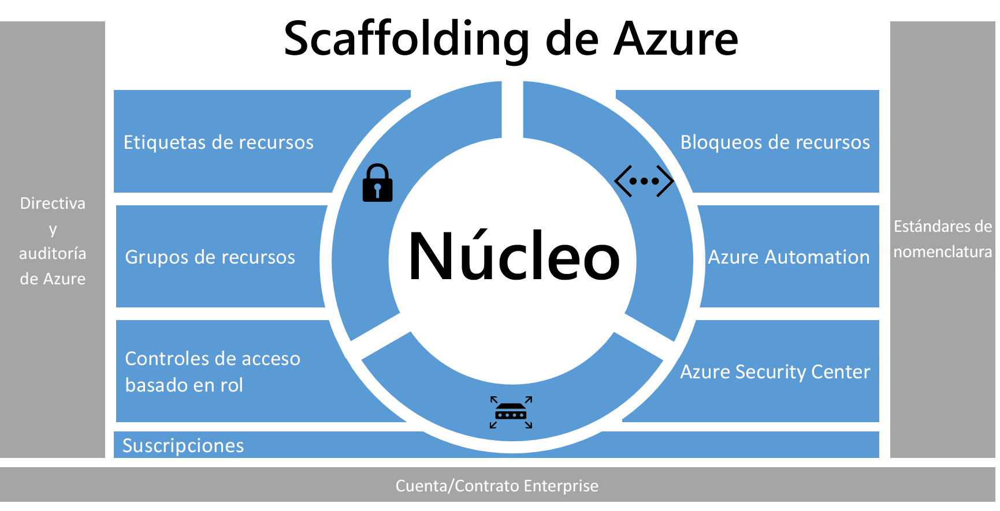
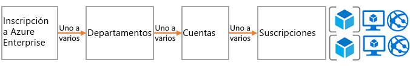
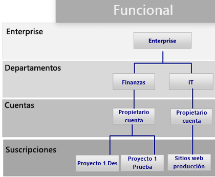
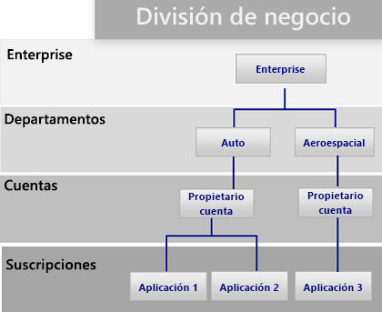
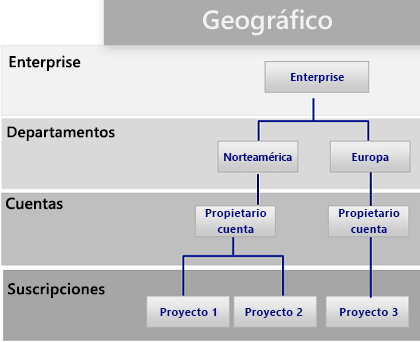
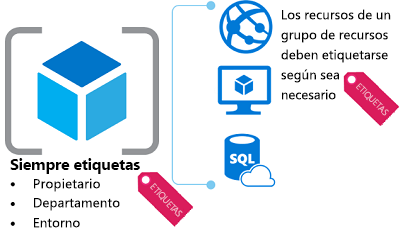
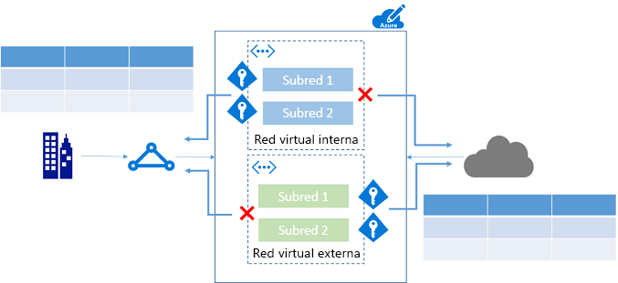
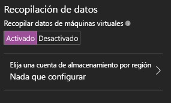

# Scaffolding empresarial de Azure: gobierno de suscripción preceptivoAzure enterprise scaffold - prescriptive subscription governance
Cada vez son más las empresas que adoptan la tecnología de nube pública para ganar agilidad y flexibilidad.Enterprises are increasingly adopting the public cloud for its agility and flexibility. Aprovechan los puntos fuertes de la nube para generar ingresos u optimizar los recursos de la empresa.They are utilizing the cloud's strengths to generate revenue or optimize resources for the business. Microsoft Azure proporciona un gran número de servicios que las empresas pueden ensamblar como bloques de creación con el objetivo de abordar diversas aplicaciones y cargas de trabajo.Microsoft Azure provides a multitude of services that enterprises can assemble like building blocks to address a wide array of workloads and applications. 

Sin embargo, a menudo es difícil saber por dónde comenzar.But, knowing where to begin is often difficult. Después de decantarse por Azure, suelen surgirles unas cuantas preguntas:After deciding to use Azure, a few questions commonly arise:

* "¿Cómo puedo cumplir los requisitos legales de soberanía de datos en determinados países?""How do I meet our legal requirements for data sovereignty in certain countries?"
* "¿Cómo puedo asegurarme de que alguien no modifique por error un sistema importante?""How do I ensure that someone does not inadvertently change a critical system?"
* "¿Cómo puedo saber lo que cada recurso admite para poder tenerlo en cuenta y realizar la facturación de forma adecuada?""How do I know what every resource is supporting so I can account for it and bill it back accurately?"

La posibilidad de que existan suscripciones vacías sin ninguna protección es desalentadora.The prospect of an empty subscription with no guard rails is daunting. Este espacio en blanco puede dificultar la migración a Azure.This blank space can hamper your move to Azure.

En este artículo se ofrece un punto de partida para que los profesionales técnicos satisfagan la necesidad de contar con un sistema de gobierno y la equilibren con el imperativo de ganar agilidad.This article provides a starting point for technical professionals to address the need for governance, and balance it with the need for agility. Además, se presenta el concepto de scaffolding empresarial, que guía a las organizaciones en la implementación y administración de suscripciones de Azure.It introduces the concept of an enterprise scaffold that guides organizations in implementing and managing their Azure subscriptions. 

## Necesidad de contar con un sistema de gobiernoNeed for governance
Al migrar la infraestructura a Azure, hay que abordar el asunto del sistema de gobierno en la primera fase para garantizar que la nube se utilice correctamente en la empresa.When moving to Azure, you must address the topic of governance early to ensure the successful use of the cloud within the enterprise. Desafortunadamente, debido al tiempo que se tarda en crear un sistema de gobierno completo y toda la administración que conlleva, algunos grupos de negocios recurren directamente a los proveedores sin contar con su equipo de TI.Unfortunately, the time and bureaucracy of creating a comprehensive governance system means some business groups go directly to vendors without involving enterprise IT. Este enfoque puede dejar a la empresa expuesta a vulnerabilidades si los recursos no se administran correctamente.This approach can leave the enterprise open to vulnerabilities if the resources are not properly managed. Las características de la nube pública —agilidad, flexibilidad y precios basados en el consumo— son importantes para los grupos de negocios que necesitan satisfacer rápidamente las necesidades de los clientes (internos y externos).The characteristics of the public cloud - agility, flexibility, and consumption-based pricing - are important to business groups that need to quickly meet the demands of customers (both internal and external). Sin embargo, el equipo de TI de la empresa debe garantizar que los datos y sistemas estén protegidos de forma eficaz.But, enterprise IT needs to ensure that data and systems are effectively protected.

En condiciones reales, se utiliza la técnica scaffolding para crear la base de la estructura.In real life, scaffolding is used to create the basis of the structure. Las plantillas scaffold sirven de guía para el esquema general y proporcionan puntos de anclaje para poder montar sistemas más permanentes.The scaffold guides the general outline, and provides anchor points for more permanent systems to be mounted. Las scaffold empresariales son lo mismo: una serie de controles flexibles y funcionalidades de Azure que proporcionan la estructura al entorno, así como delimitadores para los servicios basados en la nube pública.An enterprise scaffold is the same: a set of flexible controls and Azure capabilities that provide structure to the environment, and anchors for services built on the public cloud. Además, brindan a los fabricantes (grupos de negocio y departamentos de TI) los cimientos para crear y asociar nuevos servicios.It provides the builders (IT and business groups) a foundation to create and attach new services.

Estas plantillas se basan en las prácticas que hemos recopilado de muchas interacciones con clientes de varios tamaños.The scaffold is based on practices we have gathered from many engagements with clients of various sizes. Desde pequeñas organizaciones que desarrollan soluciones en la nube para empresas de la lista Fortune 500 hasta fabricantes independientes de software que van a migrar y desarrollar soluciones en la nube.Those clients range from small organizations developing solutions in the cloud to Fortune 500 enterprises and independent software vendors who are migrating and developing solutions in the cloud. Las plantillas scaffold empresariales se han creado con la suficiente flexibilidad como para admitir las cargas de trabajo de TI tradicionales y las del método ágil; por ejemplo, los desarrolladores que crean aplicaciones de software como servicio (SaaS) basadas en las funcionalidades de Azure.The enterprise scaffold is "purpose-built" to be flexible to support both traditional IT workloads and agile workloads; such as, developers creating software-as-a-service (SaaS) applications based on Azure capabilities.

Asimismo, están diseñadas para ser el pilar de todas las suscripciones nuevas de Azure.The enterprise scaffold is intended to be the foundation of each new subscription within Azure. Estas plantillas permiten a los administradores asegurarse de que las cargas de trabajo cumplan los requisitos mínimos de gobierno de una organización sin impedir que los grupos de negocios y los desarrolladores cumplan rápidamente sus objetivos.It enables administrators to ensure workloads meet the minimum governance requirements of an organization without preventing business groups and developers from quickly meeting their own goals.

> [!IMPORTANT]
> Contar con un sistema de gobierno es fundamental para que Azure tenga éxito.Governance is crucial to the success of Azure. En este artículo se aborda la implementación técnica de una scaffold empresarial, pero solo se mencionan el proceso más amplio y las relaciones entre los componentes.This article targets the technical implementation of an enterprise scaffold but only touches on the broader process and relationships between the components. El gobierno de directivas es jerárquico y viene determinado por lo que la empresa desee conseguir.Policy governance flows from the top down and is determined by what the business wants to achieve. Naturalmente, en la creación de un modelo de gobierno de Azure participan los representantes del departamento de TI. Sin embargo, es más importante que los líderes del grupo de negocios y los responsables de seguridad y riesgos tengan una importante representación en dicho proceso.Naturally, the creation of a governance model for Azure includes representatives from IT, but more importantly it should have strong representation from business group leaders, and security and risk management. Al final, una scaffold empresarial tiene que ver con mitigar los riesgos empresariales para facilitar la misión y los objetivos de la organización.In the end, an enterprise scaffold is about mitigating business risk to facilitate an organization's mission and objectives.
> 
> 

En la imagen siguiente se describen los componentes de la scaffold.The following image describes the components of the scaffold. La base se sustenta en un plan sólido para departamentos, cuentas y suscripciones.The foundation relies on a solid plan for departments, accounts, and subscriptions. Los pilares constan de directivas de Resource Manager y de estándares de nomenclatura eficaces.The pillars consist of Resource Manager policies and strong naming standards. El resto de los componentes provienen de las principales funcionalidades y características de Azure que posibilitan un entorno seguro y fácil de administrar.The rest of the scaffold comes from core Azure capabilities and features that enable a secure and manageable environment.

> [!NOTE]
> Azure ha crecido rápidamente desde que se presentara en el 2008.Azure has grown rapidly since its introduction in 2008. Debido a este desarrollo, los equipos de ingeniería de Microsoft tuvieron que replantear su enfoque de administración e implementación de servicios.This growth required Microsoft engineering teams to rethink their approach for managing and deploying services. El modelo de Azure Resource Manager se introdujo en 2014 y reemplaza al de implementación clásica.The Azure Resource Manager model was introduced in 2014 and replaces the classic deployment model. Resource Manager permite a las organizaciones implementar, organizar y controlar los recursos de Azure de una forma más sencilla.Resource Manager enables organizations to more easily deploy, organize, and control Azure resources. Además, con esta herramienta se pueden crear recursos de forma paralela, de modo que es posible implementar más rápido soluciones complejas e interdependientes.Resource Manager includes parallelization when creating resources for faster deployment of complex, interdependent solutions. También se puede controlar el acceso de manera pormenorizada y etiquetar los recursos con metadatos.It also includes granular access control, and the ability to tag resources with metadata. Microsoft recomienda crear todos los recursos mediante el modelo de implementación de Resource Manager.Microsoft recommends that you create all resources through the Resource Manager model. Las plantillas scaffold empresariales se han diseñado expresamente para el modelo de Resource Manager.The enterprise scaffold is explicitly designed for the Resource Manager model.
> 
> 

## Definición de la jerarquíaDefine your hierarchy
La base de una plantilla scaffold es la inscripción de Azure Enterprise (y Enterprise Portal).The foundation of the scaffold is the Azure Enterprise Enrollment (and the Enterprise Portal). La inscripción Enterprise define la forma y el uso de los servicios de Azure en una empresa y su estructura de gobierno básica.The enterprise enrollment defines the shape and use of Azure services within a company and is the core governance structure. En el contrato Enterprise, los clientes pueden subdividir el entorno en departamentos, cuentas y, finalmente, suscripciones.Within the enterprise agreement, customers are able to further subdivide the environment into departments, accounts, and finally, subscriptions. Una suscripción de Azure es la unidad básica donde se encuentran todos los recursos.An Azure subscription is the basic unit where all resources are contained. También define varios límites en Azure, como el número de núcleos, recursos, etc.It also defines several limits within Azure, such as number of cores, resources, etc.

Cada empresa es diferente, y la jerarquía de la imagen anterior permite una gran flexibilidad en lo que respecta a cómo se organiza Azure en la empresa.Every enterprise is different and the hierarchy in the previous image allows for significant flexibility in how Azure is organized within the company. Antes de implementar las instrucciones de este documento, debe modelar la jerarquía y comprender el impacto en la facturación, el acceso a los recursos y la complejidad.Before implementing the guidance contained in this document, you should model your hierarchy and understand the impact on billing, resource access, and complexity.

Los tres patrones comunes de las inscripciones de Azure son los siguientes:The three common patterns for Azure Enrollments are:

* El patrón **funcional**The **functional** pattern
  
    
* El patrón de **unidad de negocio**The **business unit** pattern 
  
    
* El patrón **geográfico**The **geographic** pattern
  
    

Las plantillas scaffold se aplican en el nivel de suscripción para ampliar los requisitos de gobierno de la empresa en la suscripción.You apply the scaffold at the subscription level to extend the governance requirements of the enterprise into the subscription.

## Estándares de nomenclaturaNaming standards
El primer pilar de una plantilla scaffold son los estándares de nomenclatura.The first pillar of the scaffold is naming standards. Cuando se diseñan bien, se pueden identificar los recursos en el portal, en una factura y en los scripts.Well-designed naming standards enable you to identify resources in the portal, on a bill, and within scripts. Es probable que ya tenga estándares de nomenclatura para la infraestructura local.Most likely, you already have naming standards for on-premises infrastructure. Al agregar Azure a su entorno, debe extender estos estándares de nomenclatura a los recursos de Azure.When adding Azure to your environment, you should extend those naming standards to your Azure resources. Un estándar de nomenclatura permite administrar de forma más eficaz el entorno en todos los niveles.Naming standard facilitate more efficient management of the environment at all levels.

> [!TIP]
> Convenciones de nomenclatura:For naming conventions:
> * Revise y adopte siempre que sea posible esta [guía de patrones y prácticas](../best-practices/naming-conventions.md),Review and adopt where possible the [Patterns and Practices guidance](../best-practices/naming-conventions.md). que lo ayudará a decidirse por un estándar de nomenclatura significativo.This guidance helps you decide on a meaningful naming standard.
> * Alterne el uso de mayúsculas y minúsculas en los nombres de recursos (por ejemplo, miGrupoDeRecursos y NombreDeLaRedVirtual).Use camelCasing for names of resources (such as myResourceGroup and vnetNetworkName). Nota: Hay determinados recursos, como las cuentas de almacenamiento, en los que solo se pueden emplear minúsculas (y ningún otro carácter especial).Note: There are certain resources, such as storage accounts, where the only option is to use lower case (and no other special characters).
> * Plantéese usar las directivas de Azure Resource Manager (que se describen en la sección siguiente) para aplicar los estándares de nomenclatura.Consider using Azure Resource Manager policies (described in the next section) to enforce naming standards.
> 
> Las sugerencias anteriores lo ayudan a implementar una convención de nomenclatura coherente.The preceding tips help you implement a consistent naming convention.

## Directivas y auditoríaPolicies and auditing
El segundo pilar de scaffolding implica la creación de [directivas de Azure](/azure/azure-policy/azure-policy-introduction) y la [auditoría del registro de actividades](/azure/azure-resource-manager/resource-group-audit).The second pillar of the scaffold involves creating [Azure policies](/azure/azure-policy/azure-policy-introduction) and [auditing the activity log](/azure/azure-resource-manager/resource-group-audit). Las directivas de Resource Manager ofrecen la posibilidad de administrar riesgos en Azure.Resource Manager policies provide you with the ability to manage risk in Azure. Puede definir directivas que garanticen la soberanía de datos restringiendo, aplicando o auditando determinadas acciones.You can define policies that ensure data sovereignty by restricting, enforcing, or auditing certain actions. 

* Las directivas son un sistema de **permisos** predeterminado.Policy is a default **allow** system. Las acciones se controlan mediante la definición y asignación de directivas a los recursos que deniegan o auditan acciones en los recursos.You control actions by defining and assigning policies to resources that deny or audit actions on resources.
* Las directivas se describen a través de las definiciones de directiva en un lenguaje de definición de directivas (condiciones If-Then).Policies are described by policy definitions in a policy definition language (if-then conditions).
* Las directivas se crean con archivos JSON (notación de objetos JavaScript).You create polices with JSON (Javascript Object Notation) formatted files. Después de definir una directiva, se asigna a un ámbito determinado: suscripción, grupo de recursos o recurso.After defining a policy, you assign it to a particular scope: subscription, resource group, or resource.

Las directivas tienen varias acciones que permiten adoptar un enfoque específico en sus escenarios.Policies have multiple actions that allow for a fine-grained approach to your scenarios. Las acciones son las siguientes:The actions are:

* **Denegar**: bloquea la solicitud del recurso.**Deny**: Blocks the resource request
* **Auditoría**: permite la solicitud, pero se agrega una línea en el registro de actividad (que se puede usar para proporcionar alertas o desencadenar runbooks).**Audit**: Allows the request but adds a line to the activity log (which can be used to provide alerts or to trigger runbooks)
* **Anexar**: agrega información especificada al recurso.**Append**: Adds specified information to the resource. Por ejemplo, si no hay una etiqueta CostCenter en un recurso, agregue dicha etiqueta con un valor predeterminado.For example, if there is not a "CostCenter" tag on a resource, add that tag with a default value.

### Usos comunes de las directivas de Resource ManagerCommon uses of Resource Manager policies
Las directivas de Azure Resource Manager constituyen una solución eficaz del kit de herramientas de Azure.Azure Resource Manager policies are a powerful tool in the Azure toolkit. Gracias a ellas, podrá evitar costos inesperados, identificar un centro de costos de recursos a través del etiquetado y asegurarse de que se cumplan los requisitos de cumplimiento.They enable you to avoid unexpected costs, to identify a cost center for resources through tagging, and to ensure that compliancy requirements are met. Cuando las directivas se combinan con las características de auditoría integradas, puede crear soluciones complejas y flexibles.When policies are combined with the built-in auditing features, you can fashion complex and flexible solutions. Las directivas permiten a las compañías proporcionar controles para las cargas de trabajo de TI tradicional y las del método ágil; por ejemplo, desarrollando aplicaciones para los clientes.Policies allow companies to provide controls for "Traditional IT" workloads and "Agile" workloads; such as, developing customer applications. Los patrones más comunes que se pueden encontrar para las directivas son los siguientes:The most common patterns we see for policies are:

* **Soberanía de datos y cumplimiento geográfico**: Azure proporciona regiones en todo el mundo.**Geo-compliance/data sovereignty** - Azure provides regions across the world. Las empresas suelen querer controlar el lugar dónde se crean los recursos (ya sea para garantizar la soberanía de datos o simplemente para asegurarse de que se crean cerca de los consumidores finales de los recursos).Enterprises often wish to control where resources are created (whether to ensure data sovereignty or just to ensure resources are created close to the end consumers of the resources).
* **Administración de costos**: una suscripción de Azure puede contener recursos de muchos tipos y escala.**Cost management** - An Azure subscription can contain resources of many types and scale. A menudo, las organizaciones quieren asegurarse de que las suscripciones estándares no empleen recursos innecesariamente grandes, lo que puede acarrear un costo de cientos de dólares, o más, al mes.Corporations often wish to ensure that standard subscriptions avoid using unnecessarily large resources, which can cost hundreds of dollars a month or more.
* **Gobierno predeterminado a través de las etiquetas obligatorias**: requerir etiquetas es una de las características más habituales y solicitadas.**Default governance through required tags** - Requiring tags is one of the most common and highly desired features. Al utilizar las directivas de Azure Resource Manager, las empresas pueden asegurarse de que un recurso esté correctamente etiquetado.Using Azure Resource Manager Policies enterprises are able to ensure that a resource is appropriately tagged. Las etiquetas más comunes son las de departamento, propietario del recurso y tipo de entorno (por ejemplo, producción, pruebas o desarrollo).The most common tags are: Department, Resource Owner, and Environment type (for example - production, test, development)

**Ejemplos****Examples**

Suscripción de TI tradicional para aplicaciones de línea de negocio"Traditional IT" subscription for line-of-business applications

* Aplique las etiquetas Department y Owner en todos los recursos.Enforce Department and Owner tags on all resources
* Restrinja la creación de recursos en la región de Norteamérica.Restrict resource creation to the North American Region
* Restrinja la capacidad de crear máquinas virtuales de serie G y clústeres de HDInsight.Restrict the ability to create G-Series VMs and HDInsight Clusters

Entorno del método ágil para una unidad de negocio que va a crear aplicaciones en la nube"Agile" Environment for a business unit creating cloud applications

* Para cumplir los requisitos de soberanía de datos, permita la creación de recursos SOLO en una región específica.To meet data sovereignty requirements, allow the creation of resources ONLY in a specific region.
* Aplique la etiqueta Environment en todos los recursos.Enforce Environment tag on all resources. Si un recurso se crea sin una etiqueta, anexe la etiqueta **Environment: Unknown** al recurso.If a resource is created without a tag, append the **Environment: Unknown** tag to the resource.
* Realice la auditoría cuando los recursos se creen fuera de Norteamérica, pero no la impida.Audit when resources are created outside of North America but do not prevent.
* Realice la auditoría cuando se creen recursos de alto costo.Audit when high-cost resources are created.

> [!TIP]
> El uso más común de las directivas de Resource Manager en las organizaciones es controlar *qué* tipos de recursos pueden crearse y *dónde*.The most common use of Resource Manager policies across organizations is to control *where* resources can be created and *what* types of resources can be created. Además de proporcionar controles de *ubicación* y *tipo*, muchas empresas utilizan directivas para garantizar que los recursos tengan los metadatos apropiados para facturar por consumo.In addition to providing controls on *where* and *what*, many enterprises use policies to ensure resources have the appropriate metadata to bill back for consumption. Se recomienda aplicar directivas en el nivel de suscripción para los siguientes patrones:We recommend applying policies at the subscription level for:
> 
> * Soberanía de datos y cumplimiento geográficoGeo-compliance/data sovereignty
> * Administración de costosCost management
> * Etiquetas obligatorias (se determinan según la necesidad de la empresa, como BillTo y Application Owner)Required tags (Determined by business need, such as BillTo, Application Owner)
> 
> Puede aplicar más directivas en niveles inferiores del ámbito.You can apply additional policies at lower levels of scope.
> 
> 

### Auditoría: ¿qué ha ocurrido?Audit - what happened?
Para ver cómo funciona el entorno, debe auditar la actividad de usuario.To view how your environment is functioning, you need to audit user activity. La mayoría de los tipos de recursos de Azure crean registros de diagnóstico que se pueden analizar a través de una herramienta de registro o en Azure Log Analytics.Most resource types within Azure create diagnostic logs that you can analyze through a log tool or in Azure Log Analytics. Puede recopilar registros de actividades a través de varias suscripciones para proporcionar información de la empresa o de departamentos concretos.You can gather activity logs across multiple subscriptions to provide a departmental or enterprise view. Los registros de auditoría constituyen una herramienta de diagnóstico importante y un mecanismo fundamental para desencadenar eventos en el entorno de Azure.Audit records are both an important diagnostic tool and a crucial mechanism to trigger events in the Azure environment.

Los registros de actividades de las implementaciones de Resource Manager permiten determinar las **operaciones** que se realizaron y las personas responsables.Activity logs from Resource Manager deployments enable you to determine the **operations** that took place and who performed them. Además, pueden recopilarse y agregarse mediante herramientas como Log Analytics.Activity logs can be collected and aggregated using tools like Log Analytics.

## Etiquetas del recursoResource tags
A medida que los usuarios de su organización agregan recursos a la suscripción, cada vez adquiere más importancia asociar los recursos con el departamento, el cliente y el entorno adecuados.As users in your organization add resources to the subscription, it becomes increasingly important to associate resources with the appropriate department, customer, and environment. Puede asociar metadatos a los recursos a través de las [etiquetas](/azure/azure-resource-manager/resource-group-using-tags).You can attach metadata to resources through [tags](/azure/azure-resource-manager/resource-group-using-tags). Estas sirven para proporcionar información sobre el recurso o el propietario.You use tags to provide information about the resource or the owner. Además, no solo permiten agregar y agrupar los recursos de varias maneras, sino también emplear esos datos para fines de contracargo.Tags enable you to not only aggregate and group resources in various ways, but use that data for the purposes of chargeback. Puede etiquetar recursos con hasta 15 pares clave-valor.You can tag resources with up to 15 key:value pairs. 

Las etiquetas de recurso son flexibles y deben asociarse a la mayoría de los recursos.Resource tags are flexible and should be attached to most resources. Ejemplos de etiquetas de recursos comunes:Examples of common resource tags are:

* BillToBillTo
* Department (o Business Unit)Department (or Business Unit)
* Environment (Production, Stage y Development)Environment (Production, Stage, Development)
* Tier (Web Tier y Application Tier)Tier (Web Tier, Application Tier)
* Application OwnerApplication Owner
* ProjectNameProjectName

Consulte [Recommended naming conventions for Azure resources](../best-practices/naming-conventions.md) (Convenciones de nomenclatura recomendadas para los recursos de Azure).For more examples of tags, see [Recommended naming conventions for Azure resources](../best-practices/naming-conventions.md).

> [!TIP]
> Considere la posibilidad de utilizar una directiva que exija etiquetar los siguientes recursos:Consider making a policy that mandates tagging for:
> 
> * Grupos de recursosResource groups
> * StorageStorage
> * Virtual MachinesVirtual Machines
> * Servidores web y entornos de servicios de aplicacionesApplication Service Environments/web servers
> 
> Esta estrategia de etiquetado identifica en las distintas suscripciones qué metadatos se necesitan para los aspectos comerciales, económicos, de seguridad, de administración de riesgos y de administración general del entorno.This tagging strategy identifies across your subscriptions what metadata is needed for the business, finance, security, risk management, and overall management of the environment. 

## Grupos de recursosResource group
Resource Manager permite colocar recursos en grupos significativos de administración, facturación y afinidad natural.Resource Manager enables you to put resources into meaningful groups for management, billing, or natural affinity. Como se mencionó anteriormente, Azure tiene dos modelos de implementación.As mentioned earlier, Azure has two deployment models. En el modelo clásico anterior, la unidad básica de administración era la suscripción.In the earlier Classic model, the basic unit of management was the subscription. Era difícil desglosar los recursos dentro de una suscripción, así que había que crear un gran número de suscripciones.It was difficult to break down resources within a subscription, which led to the creation of large numbers of subscriptions. Con el modelo de Resource Manager, se han introducido los grupos de recursos.With the Resource Manager model, we saw the introduction of resource groups. Los grupos de recursos son contenedores de recursos que tienen un ciclo de vida común o comparten un atributo como "Todos los servidores SQL Server" o "Aplicación A".Resource groups are containers of resources that have a common lifecycle or share an attribute such as "all SQL servers" or "Application A".

Además, no pueden estar dentro de otros grupos y los recursos solo pueden pertenecer a un solo grupo de recursos.Resource groups cannot be contained within each other and resources can only belong to one resource group. Puede aplicar determinadas acciones en todos los recursos de un grupo de recursos.You can apply certain actions on all resources in a resource group. Por ejemplo, al eliminar un grupo de recursos, se quitan todos los recursos del grupo de recursos.For example, deleting a resource group removes all resources within the resource group. Normalmente, las aplicaciones completas o los sistemas relacionados se colocan en el mismo grupo de recursos.Typically, you place an entire application or related system in the same resource group. Por ejemplo, una aplicación de tres niveles denominada "aplicación web de Contoso" contendría el servidor web, el servidor de aplicaciones y el servidor SQL Server en el mismo grupo de recursos.For example, a three-tier application called Contoso Web Application would contain the web server, application server and SQL server in the same resource group.

> [!TIP]
> El modo de organizar los grupos de recursos puede variar según se trate de cargas de trabajo de TI tradicional o del método ágil:How you organize your resource groups may vary from "Traditional IT" workloads to "Agile IT" workloads:
> 
> * Las cargas de trabajo de TI tradicional se suelen agrupar por elementos dentro del mismo ciclo de vida, como una aplicación."Traditional IT" workloads are most commonly grouped by items within the same lifecycle, such as an application. Si se agrupan las aplicaciones, se podrán administrar las aplicaciones de forma individual.Grouping by application allows for individual application management.
> * Las cargas de trabajo de TI o del método ágil tienden a centrarse en las aplicaciones en la nube orientadas a los clientes externos."Agile IT" workloads tend to focus on external customer-facing cloud applications. Los grupos de recursos deben reflejar las capas de implementación (por ejemplo, el nivel web y el de aplicaciones) y administración.The resource groups should reflect the layers of deployment (such as Web Tier, App Tier) and management.
> 
> La comprensión de la carga de trabajo lo ayudará a desarrollar una estrategia de grupo de recursos.Understanding your workload helps you develop a resource group strategy.

## Control de acceso basado en rolRole-based access control
Probablemente se esté preguntando quién debe tener acceso a los recursosYou probably are asking yourself "who should have access to resources?" y cómo puede controlar dicho acceso.and "how do I control this access?" Permitir o denegar el acceso a Azure Portal, así como controlar el acceso a los recursos del portal, resulta fundamental.Allowing or disallowing access to the Azure portal, and controlling access to resources in the portal is crucial. 

Cuando se publicó inicialmente Azure, los controles de acceso a una suscripción eran básicos: Administrador o Coadministrador.When Azure was initially released, access controls to a subscription were basic: Administrator or Co-Administrator. Acceder una suscripción del modelo clásico implicaba hacerlo a todos los recursos del portal.Access to a subscription in the Classic model implied access to all the resources in the portal. Esta falta de un control específico provocó una proliferación de suscripciones que proporcionaban un nivel de control de acceso razonable a una inscripción de Azure.This lack of fine-grained control led to the proliferation of subscriptions to provide a level of reasonable access control for an Azure Enrollment.

Esta proliferación de suscripciones ya no es necesaria.This proliferation of subscriptions is no longer needed. Gracias al control de acceso basado en rol, puede asignar usuarios a roles estándares (por ejemplo, los tipos de roles comunes de lectura y escritura).With role-based access control, you can assign users to standard roles (such as common "reader" and "writer" types of roles). También se pueden definir reglas personalizadas.You can also define custom roles.

> [!TIP]
> Para implementar el control de acceso basado en roles:To implement role-based access control:
> * Conecte su almacén de identidades corporativo (normalmente, Active Directory) a Azure Active Directory con la herramienta AD Connect.Connect your corporate identity store (most commonly Active Directory) to Azure Active Directory using the AD Connect tool.
> * Controle el administrador o coadministrador de una suscripción mediante una identidad administrada.Control the Admin/Co-Admin of a subscription using a managed identity. **No** asigne administradores o coadministradores a un nuevo propietario de la suscripción.**Don't** assign Admin/Co-admin to a new subscription owner. En su lugar, use los roles RBAC para proporcionar derechos de **propietario** a un grupo o usuario.Instead, use RBAC roles to provide **Owner** rights to a group or individual.
> * Agregue los usuarios de Azure a un grupo (por ejemplo, los propietarios de la aplicación X) en Active Directory.Add Azure users to a group (for example, Application X Owners) in Active Directory. Utilice el grupo sincronizado para proporcionar a los miembros del grupo los derechos adecuados para administrar el grupo de recursos que contiene la aplicación.Use the synced group to provide group members the appropriate rights to manage the resource group containing the application.
> * Siga el principio de conceder los **privilegios mínimos** necesarios para realizar el trabajo previsto.Follow the principle of granting the **least privilege** required to do the expected work. Por ejemplo: For example:
>   * Grupo de implementación: un grupo que solo puede implementar recursos.Deployment Group: A group that is only able to deploy resources.
>   * Administración de máquinas virtuales: un grupo que puede reiniciar las máquinas virtuales (para realizar operaciones)Virtual Machine Management: A group that is able to restart VMs (for operations)
> 
> Estas sugerencias lo ayudarán a administrar el acceso de los usuarios en la totalidad de su suscripción.These tips help you manage user access across your subscription.

## Bloqueos de recursos de AzureAzure resource locks
A medida que su organización agrega servicios básicos a la suscripción, cada vez reviste más importancia asegurarse de que estos servicios estén disponibles para evitar la interrupción de la actividad empresarial.As your organization adds core services to the subscription, it becomes increasingly important to ensure that those services are available to avoid business disruption. Gracias a los [bloqueos de recursos](/azure/azure-resource-manager/resource-group-lock-resources), se pueden restringir las operaciones en recursos de gran valor donde modificarlas o eliminarlas tendría un gran impacto en las aplicaciones o la infraestructura en la nube.[Resource locks](/azure/azure-resource-manager/resource-group-lock-resources) enable you to restrict operations on high-value resources where modifying or deleting them would have a significant impact on your applications or cloud infrastructure. Puede aplicar bloqueos a una suscripción, un recurso o un grupo de recursos.You can apply locks to a subscription, resource group, or resource. Normalmente, los bloqueos se aplican a recursos fundamentales como redes virtuales, puertas de enlace y cuentas de almacenamiento.Typically, you apply locks to foundational resources such as virtual networks, gateways, and storage accounts. 

Además, en estos momentos, admiten dos valores: CanNotDelete y ReadOnly.Resource locks currently support two values: CanNotDelete and ReadOnly. CanNotDelete significa que los usuarios (con los derechos adecuados) todavía pueden leer o modificar un recurso, pero no eliminarlo.CanNotDelete means that users (with the appropriate rights) can still read or modify a resource but cannot delete it. ReadOnly significa que los usuarios autorizados no pueden eliminar o modificar un recurso.ReadOnly means that authorized users can't delete or modify a resource.

Para crear o eliminar bloqueos de administración, debe tener acceso a las acciones `Microsoft.Authorization/*` o `Microsoft.Authorization/locks/*`.To create or delete management locks, you must have access to `Microsoft.Authorization/*` or `Microsoft.Authorization/locks/*` actions.
Entre los roles integrados, solamente se conceden esas acciones al propietario y al administrador de acceso de usuarios.Of the built-in roles, only Owner and User Access Administrator are granted those actions.

> [!TIP]
> Las opciones de red principales deben protegerse con bloqueos.Core network options should be protected with locks. La eliminación accidental de una puerta de enlace o una VPN de sitio a sitio podría resultar desastroso para una suscripción de Azure.Accidental deletion of a gateway, site-to-site VPN would be disastrous to an Azure subscription. Azure no permite eliminar una red virtual que se esté utilizando, pero, por preocupación, recomendamos aplicar más restricciones.Azure doesn't allow you to delete a virtual network that is in use, but applying more restrictions is a helpful precaution. 
> 
> * Virtual Network: CanNotDeleteVirtual Network: CanNotDelete
> * Grupo de seguridad de red: CanNotDeleteNetwork Security Group: CanNotDelete
> * Directivas: CanNotDeletePolicies: CanNotDelete
> 
> Las directivas también resultan cruciales para el mantenimiento de los controles adecuados.Policies are also crucial to the maintenance of appropriate controls. Recomendamos aplicar un bloqueo **CanNotDelete** en las directivas que se están utilizando.We recommend that you apply a **CanNotDelete** lock to polices that are in use.

## Recursos de red principalesCore networking resources
El acceso a los recursos puede ser interno (dentro de la red corporativa) o externo (a través de Internet).Access to resources can be either internal (within the corporation's network) or external (through the internet). Es muy fácil que los usuarios de una organización puedan colocar accidentalmente los recursos en la zona incorrecta y, posiblemente, abrirlos para acceder con intenciones malintencionado.It is easy for users in your organization to inadvertently put resources in the wrong spot, and potentially open them to malicious access. Al igual que con los dispositivos locales, las empresas deben agregar los controles adecuados para asegurarse de que los usuarios de Azure toman las decisiones correctas.As with on-premises devices, enterprises must add appropriate controls to ensure that Azure users make the right decisions. Para el gobierno de suscripciones, identificamos los recursos principales que proporcionan un control de acceso básico.For subscription governance, we identify core resources that provide basic control of access. Se trata de los siguientes:The core resources consist of:

* Las **redes virtuales** son objetos de contenedor de las subredes.**Virtual networks** are container objects for subnets. Aunque no es estrictamente necesario, se suelen utilizar al conectar las aplicaciones a los recursos corporativos internos.Though not strictly necessary, it is often used when connecting applications to internal corporate resources.
* Los **grupos de seguridad de red** son similares a los firewalls y proporcionan reglas de cómo un recurso puede "hablar" a través de la red.**Network security groups** are similar to a firewall and provide rules for how a resource can "talk" over the network. Proporcionan un control granular sobre cómo o bajo qué condición una subred (o máquina virtual) puede conectarse a Internet o a otras subredes de la misma red virtual.They provide granular control over how/if a subnet (or virtual machine) can connect to the Internet or other subnets in the same virtual network.

> [!TIP]
> En el caso de las redes:For networking:
> * Cree redes virtuales específicas para las cargas de trabajo orientadas tanto a clientes externos como a internos.Create virtual networks dedicated to external-facing workloads and internal-facing workloads. Con este enfoque se reduce la posibilidad de colocar accidentalmente máquinas virtuales que están diseñadas para cargas de trabajo internas en un espacio orientado a clientes externos.This approach reduces the chance of inadvertently placing virtual machines that are intended for internal workloads in an external facing space.
> * Configure grupos de seguridad de red para limitar el acceso.Configure network security groups to limit access. Como mínimo, bloquean el acceso a Internet desde las redes virtuales internas y a la red corporativa desde las externas.At a minimum, block access to the internet from internal virtual networks, and block access to the corporate network from external virtual networks.
> 
> Estas sugerencias lo ayudarán a implementar recursos de red seguros.These tips help you implement secure networking resources.

### AutomationAutomation
Administrar los recursos de manera individual es un proceso lento y potencialmente propenso a errores en determinadas operaciones.Managing resources individually is both time-consuming and potentially error prone for certain operations. Azure proporciona varias funciones de automatización, como Azure Automation, Logic Apps y Azure Functions.Azure provides various automation capabilities including Azure Automation, Logic Apps, and Azure Functions. [Azure Automation](/azure/automation/automation-intro) permite a los administradores crear y definir runbooks para administrar las tareas comunes de administración de recursos.[Azure Automation](/azure/automation/automation-intro) enables administrators to create and define runbooks to handle common tasks in managing resources. Puede crear runbooks mediante un editor de código de PowerShell o uno de tipo gráfico.You create runbooks by using either a PowerShell code editor or a graphical editor. Puede generar flujos de trabajo complejos de varias fases.You can produce complex multi-stage workflows. Azure Automation suele utilizarse para controlar tareas comunes, como detener recursos sin usar o crear recursos como respuesta a un desencadenador específico sin necesidad de intervención humana.Azure Automation is often used to handle common tasks such as shutting down unused resources, or creating resources in response to a specific trigger without needing human intervention.

> [!TIP]
> En el caso de la automatización:For automation:
> * Cree una cuenta de Azure Automation y revise los runbooks disponibles (de línea de comandos y gráficos) en la [Galería de runbooks](/azure/automation/automation-runbook-gallery).Create an Azure Automation account and review the available runbooks (both graphical and command line) available in the [Runbook Gallery](/azure/automation/automation-runbook-gallery).
> * Importe y personalice los runbooks claves para utilizarlos.Import and customize key runbooks for your own use.
> 
> Un escenario común es la capacidad de iniciar o apagar máquinas virtuales según una programación.A common scenario is the ability to Start/Shutdown virtual machines on a schedule. Hay runbooks de ejemplo disponibles en la galería que controlan este escenario y explican cómo expandirlo.There are example runbooks that are available in the Gallery that both handle this scenario and teach you how to expand it.
> 
> 

## Azure Security CenterAzure Security Center
Quizás, uno de los principales impedimentos para adoptar la tecnología de nube han sido las preocupaciones por la seguridad.Perhaps one of the biggest blockers to cloud adoption has been the concerns over security. Los departamentos de riesgos de TI y seguridad tienen que asegurarse de que los recursos de Azure estén protegidos.IT risk managers and security departments need to ensure that resources in Azure are secure. 

[Azure Security Center](/azure/security-center/security-center-intro) proporciona una perspectiva central del estado de seguridad de los recursos de las suscripciones y ofrece recomendaciones que ayudan a evitar que se realicen ataques a los recursos.The [Azure Security Center](/azure/security-center/security-center-intro) provides a central view of the security status of resources in the subscriptions, and provides recommendations that help prevent compromised resources. Asimismo, puede habilitar directivas más granulares (por ejemplo, aplicar directivas a grupos de recursos concretos que permiten a la empresa adaptar su postura con respecto al riesgo que están abordando).It can enable more granular policies (for example, applying policies to specific resource groups that allow the enterprise to tailor their posture to the risk they are addressing). Finalmente, Azure Security Center es una plataforma abierta que permite a los asociados de Microsoft y fabricantes independientes de software crear software que se integre en Azure Security Center para mejorar sus funcionalidades.Finally, Azure Security Center is an open platform that enables Microsoft partners and independent software vendors to create software that plugs into Azure Security Center to enhance its capabilities. 

> [!TIP]
> Azure Security Center está habilitado de forma predeterminada en todas las suscripciones.Azure Security Center is enabled by default in each subscription. Sin embargo, debe habilitar la recopilación de datos de máquinas virtuales para permitir que Azure Security Center instale su agente y empiece a recopilar datos.However, you must enable data collection from virtual machines to allow Azure Security Center to install its agent and begin gathering data.
> 
> 
> 
> 

## Pasos siguientesNext steps
* Ahora que ha obtenido información sobre el gobierno de suscripciones, es hora de ver estas recomendaciones en la práctica.Now that you have learned about subscription governance, it's time to see these recommendations in practice. Vea [Examples of implementing Azure subscription governance](subscription-governance-examples.md) (Ejemplos de implementación de un sistema de gobierno de suscripciones).See [Examples of implementing Azure subscription governance](subscription-governance-examples.md).
