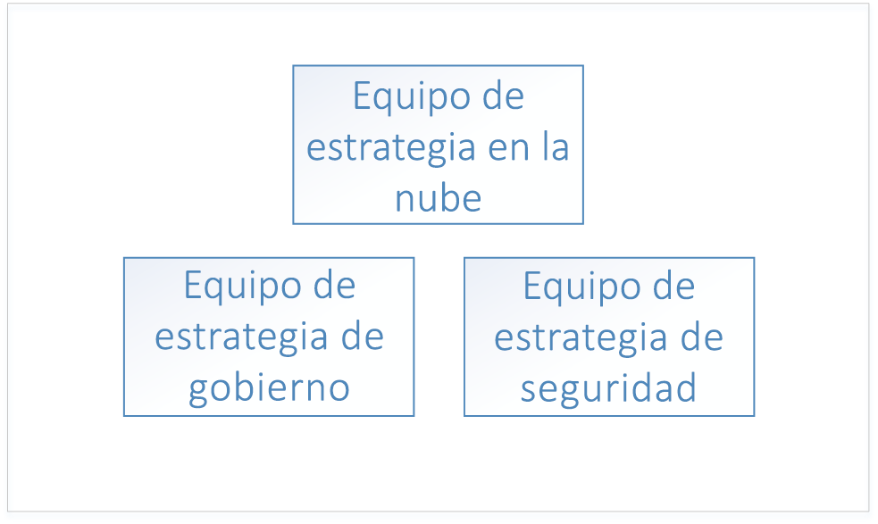
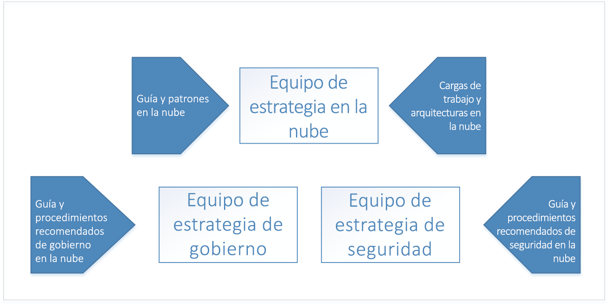
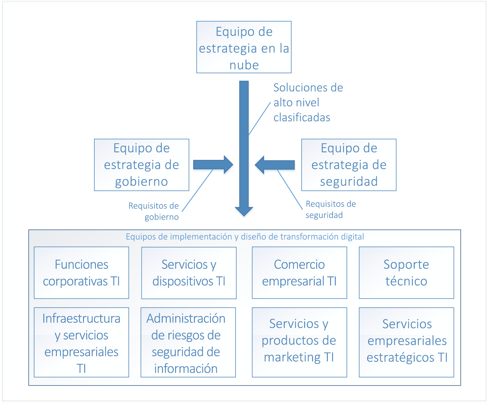

# Adopción de la nube empresarial: IntroducciónEnterprise Cloud Adoption: Getting started 

La **transformación digital** a la informática en la nube representa un cambio desde la operación en el entorno local hacia la operación en la nube.The **digital transformation** to cloud computing represents a shift from operating on-premises to operating in the cloud. Este cambio incluye nuevas formas de hacer negocios; por ejemplo, la transformación digital cambia de inversiones en capital para software y hardware del centro de datos a gastos de operación por el uso de recursos en la nube.This shift includes new ways of doing business - for example, the digital transformation shifts from capital expenditures for software and datacenter hardware to operating expenditures for usage of cloud resources. 

## Transformación digital: procesoDigital transformation: process

Para tener éxito en la adopción de la informática en la nube, una empresa debe preparar su organización, personal y procesos para que estén listos para esta transformación digital.To be successful in adopting the cloud, an enterprise must prepare its organization, people, and processes to be ready for this digital transformation. La estructura organizativa de cada empresa es diferente, por lo que no hay una aproximación única para estos preparativos de la empresa.Every enterprise's organizational structure is different, so there is no one-size-fits-all approach to organizational readiness. Este documento describe los pasos más importantes que su empresa puede seguir para prepararse.This document outlines the high-level steps your enterprise can take to get ready. La organización tendrá que dedicar un tiempo a desarrollar un plan detallado para realizar cada uno de los pasos que se indican.Your organization will have to spend time developing a detailed plan to accomplish each of the listed steps.

El proceso general para la transformación digital es:The high-level process for the digital transformation is:

1. Crear un equipo de estrategia en la nube.Create a cloud strategy team. Este equipo es responsable de dirigir la transformación digital.This team is responsible for leading the digital transformation. También es importante en esta fase formar un equipo de gobierno y un equipo de seguridad para la transformación digital.It's also important at this stage to form a governance team and a security team for the digital transformation.
2. Los miembros del equipo de estrategia en la nube obtienen información sobre las novedades en tecnologías en la nube y sus diferencias.Members of the cloud strategy team learn what's new and different about cloud technologies.  
3. El equipo de estrategia en la nube prepara la empresa mediante la creación del caso de negocio de la transformación digital: enumera todas las brechas actuales en la estrategia empresarial y determina las soluciones de alto nivel para eliminarlos.The cloud strategy team prepares the enterprise by building the business case for digital transformation - enumerates all the current gaps in business strategy and determines the high-level solutions to eliminate them.
4. Alinear las soluciones de alto nivel con los grupos de negocio.Align high-level solutions with business groups. Identificar las partes interesadas en cada grupo de negocio para llevar el diseño e implementación de cada solución.Identify stakeholders in each business group to own the design and implementation for each solution.
5. Traducir los roles, habilidades y procesos existentes para incluir los roles, habilidades y procesos en la nube.Translate existing roles, skills and process to include cloud roles, skills, and process.  
<!--6. Develop processes for operating in the cloud to make solutions more robust in terms of availability, resiliency, and security. 
7. Optimize solutions for performance, scalability, and cost efficiency.-->

## Paso 1: Creación de un equipo de estrategia en la nubeStep 1: create a cloud strategy team

El primer paso en la transformación digital de la empresa es incorporar a responsables empresariales de toda la organización para crear un equipo de estrategia en la nube (CST).The first step in your enterprise's digital transformation is engaging business leaders from across the organization to create a cloud strategy team (CST). Este equipo está formado por responsables empresariales de los grupos de finanzas, infraestructura de TI y aplicaciones.This team consists of business leaders from finance, IT infrastructure, and application groups. Estos equipos pueden ayudar en la fase de análisis y experimentación en la nube.These teams can help with the cloud analysis and experimentation phase.

Por ejemplo, un equipo de estrategia en la nube podría estar a cargo del director de tecnología e incluir miembros del equipo de arquitectura empresarial, finanzas de TI, tecnólogos de distintos grupos de aplicaciones de TI (recursos humanos, finanzas, etc.) y responsables de los equipos de infraestructura, seguridad y redes.For instance, a Cloud Strategy Team could be driven by the CTO and consist of members of the enterprise architecture team, IT finance, senior technologists from various IT applications groups (HR, finance, and so on), and leaders from the infrastructure, security, and networking teams.  

También es importante formar otros dos equipos de alto nivel: un equipo de gobierno y un equipo de seguridad.It's also important to form two other high-level teams: a governance team, and a security team. Estos equipos son responsables del diseño, la implementación y la auditoría en curso de directivas de seguridad y gobierno de la empresa.These teams are responsible for designing, implementing, and the ongoing audit of the enterprise's governance and security policies. El equipo de gobierno precisa de miembros que hayan trabajado con protección de recursos, administración de costos, directivas de grupo y temas relacionados.The governance team requires members that have worked with asset protection, cost management, group policy and related topics. El equipo de seguridad requiere que sus miembros sean expertos en los estándares de seguridad actuales, así como en los requisitos de seguridad de la empresa.The security team requires members that are well versed in current industry security standards as well as the enterprise's security requirements.

El equipo de gobierno es responsable de diseñar e implementar el modelo de gobierno de la empresa en la nube, así como de implementar y mantener los recursos de infraestructura compartida que forman parte de la transformación digital.The governance team is responsible for designing and implementing the enterprise's governance model in the cloud, as well as deploying and maintaining the shared infrastructure assets that are part of the digital transformation. Estos recursos incluyen el hardware, el software y los recursos en la nube necesarios para conectar la red local a una red virtual en la nube.These assets include hardware, software, and cloud resources necessary to connect the on-premises network to virtual networking in the cloud.

El equipo de seguridad es responsable de diseñar e implementar las directivas de seguridad de la empresa en la nube, trabajando estrechamente con el equipo de gobierno.The security team is responsible for designing and implementing the enterprise's security policy in the cloud, working closely with the governance team. El equipo de seguridad lleva la extensión del límite de seguridad de la red local para que incluya una red virtual en la nube.The security team owns the extension of the security boundary of the on-premises network to include virtual networking in the cloud. Esto puede adoptar la forma de propietario y mantenedor de los firewalls de entrada y salida a la red virtual en la nube, así como el papel de garantizar que las herramientas y las directivas impiden la implementación de recursos no autorizados.This may take the form of owning and maintaining the inbound and outbound firewalls on the cloud virtual network as well as ensuring that tools and policy prevent the deployment of unauthorized resources.

## Paso 2: Obtención de información sobre las novedades en tecnologías en la nubeStep 2: learn what's new in the cloud
 
El siguiente paso en la transformación digital de la empresa consiste en que los miembros del equipo de estrategia en la nube obtengan información sobre cómo las tecnologías en la nube cambiarán la forma en la que empresa hace negocios.The next step in your enterprise's digital transformation is for the members of the cloud strategy team to learn about how cloud technology will change the way the enterprise does business. Se trata de preparar y planear los cambios en la empresa, el personal y las tecnologías.This is preparation and planning for the changes to your business, people, and technology. Es importante que los miembros del equipo de estrategia en la nube comprendan qué es nuevo y diferente en la nube en comparación con un entorno local.It's important for the members of the cloud strategy team to understand what's new and different in the cloud as compared to on-premises.

El punto de partida para comprender la nube consiste en aprender [cómo funciona Azure](what-is-azure.md) de un modo general.The starting point for understanding the cloud is learning [how Azure works](what-is-azure.md) at a high level. A continuación, se trata de obtener información sobre los conceptos básicos de [gobierno en Azure](what-is-governance.md) como preparación para [comprender la administración del acceso a los recurso](azure-resource-access.md).Next, learn about the basics of [governance in Azure](what-is-governance.md) in preparation for [understanding resource access management](azure-resource-access.md).

Para un aprendizaje avanzado, el equipo de gobierno debería revisar los conceptos y las guías de diseño de la sección de gobierno de la tabla de contenido.For advanced learning, the governance team should review the concepts and design guides in the governance section of the table of contents. Las secciones de infraestructura y cargas de trabajo son útiles para comprender las arquitecturas y las cargas de trabajo típicas en la nube.The infrastructure and workloads sections are useful for learning about typical architectures and workloads in the cloud.

## Paso 3: Identificación de brechas en la estrategia empresarialStep 3: identify gaps in business strategy

El paso siguiente consiste en que el equipo de estrategia en la nube enumere los problemas empresariales que requieren una solución de transformación digital.The next step is for the cloud strategy team to enumerate the business problems that require a digital transformation solution. Por ejemplo, una empresa puede tener un centro de datos local existente con hardware en el final de su ciclo de vida que precise su sustitución.For example, an enterprise may have an existing on-premises data center with end-of-life hardware that requires replacement. En otro ejemplo, una empresa podría experimentar dificultades con el tiempo de comercialización de nuevas características y servicios y situarse por detrás de la competencia.In another example, an enterprise may be experiencing difficulty with time-to-market for new features and services and may be falling behind to competition. Estas brechas representan los *objetivos* de la transformación digital de la empresa.These gaps represent the *goals* of your enterprise's digital transformation.

Las brechas en la estrategia empresarial se pueden clasificar en las categorías siguientes:Gaps in business strategy can be classified into the following categories:

|CategoríaCategory|DESCRIPCIÓNDescription|
|-----|-----|
|Administración de costosCost management|Representa una brecha en el modo en el que la empresa paga por la tecnología.Represents a gap in the way the Enterprise pays for technology.|
|GobiernoGovernance|Representa una brecha en los procesos utilizados por la empresa para proteger los recursos de un uso inadecuado que podría dar lugar a excesos de costo, problemas de seguridad o problemas de cumplimiento.Represents a gap in the processes used by the Enterprise to protect its assets from improper usage that might result in cost overruns, security issues, or compliance issues. | 
|Cumplimiento normativoCompliance|Representa una brecha en la manera en la que la empresa cumple sus propios procesos y directivas internos, así como leyes, reglamentos y estándares externos.Represents a gap in the way the enterprise adheres to its own internal processes and policies as well as external laws, regulations, and standards. |
|SeguridadSecurity|Representa una brecha en la manera en la que la empresa protege su tecnología y recursos de datos frente a amenazas externas.Represents a gap in the way the enterprise protects its technology and data assets from external threats. |
|Gobierno de datosData governance|Representa una brecha en la manera en la que una empresa administra sus datos, especialmente los datos de los clientes.Represents a gap in the way an enterprise manages its data, especially customer data. Por ejemplo, el nuevo Reglamento general de protección de datos (RGPD) de la Unión Europea tiene requisitos estrictos para la protección de los datos de los clientes que podrían requerir hardware y software nuevo.For example, new General Data Protection Regulation (GDPR) in the European Union has strict requirements for the protection of customer data that may require new hardware and software.|    

Una vez que la empresa ha clasificado todas las brechas de la estrategia empresarial en estas categorías, el siguiente paso es determinar una solución de alto nivel para cada problema.Once your enterprise has classified all business strategy gaps into these categories, the next step is to determine a high-level solution for each problem.

En la tabla siguiente se muestran varios ejemplos:The following table illustrates several examples:

|Brecha de la estrategia empresarialBusiness strategy gap|Categoría &nbsp; &nbsp; &nbsp; &nbsp; &nbsp;Category &nbsp; &nbsp; &nbsp; &nbsp; &nbsp;|Solución &nbsp;&nbsp;&nbsp;&nbsp;&nbsp;&nbsp;&nbsp;&nbsp;&nbsp;&nbsp;&nbsp;&nbsp;&nbsp;&nbsp;Solution &nbsp;&nbsp;&nbsp;&nbsp;&nbsp;&nbsp;&nbsp;&nbsp;&nbsp;&nbsp;&nbsp;&nbsp;&nbsp;&nbsp;|
|-----|-----|-----|
| Los servicios hospedados actualmente en el entorno local experimentan problemas con la disponibilidad, la resistencia y la escalabilidad durante el tiempo de máxima demanda, que es aproximadamente un diez por ciento del uso.Services currently hosted on-premises experience issues with availability, resiliency, and scalability during time of peak demand, which is approximately ten percent of usage. Los servidores del centro de datos local están al final del ciclo de vida.Servers in on-premises datacenter are end-of-life. El departamento de TI empresarial recomienda adquirir nuevo hardware local para el centro de datos con las especificaciones necesarias para controlar los momentos de máxima demanda.Enterprise IT recommends purchasing new on-premises hardware for datacenter with specifications to handle peak demand.| Administración de costosCost management | Migrar las cargas de trabajo locales existentes afectadas a recursos escalables en la nube y pagar solo por el uso.Migrate affected existing on-premises workloads to scalable resources in the cloud, paying for usage only. |
| Las normativas y regulaciones externas de administración de datos exigen que la empresa cumpla un conjunto de controles estándares que requieren el cifrado de datos en reposo, lo que a su vez hace necesario nuevo hardware y software.External data management laws and regulations require the enterprise to adhere to set of standard controls that require encryption of data at rest, requiring new hardware and software. | Gobierno de datosData governance | Trasladar los datos al cifrado del servicio de Azure Storage para datos en reposo.Move data to Azure storage service encryption for data at rest. |
| Los servicios hospedados en centros de datos locales han experimentado ataques por denegación de servicio distribuido (DDoS) en los servicios orientados al público.Services hosted in on-premises datacenter been experiencing distributed denial of service (DDoS) attacks on public-facing services. Los ataques son difíciles de mitigar y requieren nuevo hardware, software y personal de seguridad para controlarlos de forma eficaz.The attacks are difficult to mitigate and require new hardware, software, and security personnel to deal with effectively. | SeguridadSecurity | Migrar los servicios a Azure y aprovechar las ventajas de Azure DDoS Protection.Migrate services to Azure, and take advantage of Azure DDoS protection.|

Cuando se han enumerado todas las brechas en la estrategia empresarial y se han determinado las soluciones de alto nivel, se debe asignar prioridades a la lista.When all of the gaps in business strategy have been enumerated and high-level solutions have been determined, prioritize the list. Se puede asignar prioridades a la lista mediante la alineación de las brechas de la estrategia empresarial con los objetivos a corto y a largo plazo de la empresa en cada categoría.The list can be prioritized by aligning the business strategy gaps with the enterprise's short and long-term goals in each category. Por ejemplo, si la empresa tiene como objetivo a corto plazo reducir el gasto en TI en los dos próximos trimestres fiscales, las brechas de negocio de la categoría de *administración de costos* se pueden priorizar en función del ahorro en costos previsto de cada una.For example, if the enterprise has a short-term goal to reduce IT spend in the next two fiscal quarters, the business gaps in the *cost management* category may be prioritized by the projected cost saving associated with each.

El resultado de este proceso es una lista ordenada de soluciones de alto nivel alineadas con categorías de empresas.The output of this process is a stack-ranked list of high-level solutions aligned with business categories. 

## Paso 4: Alineación de las soluciones de alto nivel con los grupos de negocio para diseñar solucionesStep 4: align high-level solutions with business groups to design solutions 

Ahora que se han enumerado y priorizado los objetivos de la transformación digital y se han propuesto soluciones de alto nivel, el paso siguiente consiste en que el equipo de estrategia en la nube alinee cada una de las soluciones de alto nivel con equipos de diseño e implementación de cada uno de los grupos de negocio.Now that the goals of the digital transformation have been enumerated, prioritized, and high-level solutions proposed, the next step is for the cloud strategy team to align each of the high-level solutions with design and implementation teams in each of the business groups. 

Los equipos reciben las listas con prioridades y trabajan en cada solución de alto nivel para diseñar cada solución.The teams take the prioritized lists and work through each high-level solution to design each solution. El proceso de diseño implica la especificación de nueva infraestructura y nuevas cargas de trabajo.The design process will involve the specification of new infrastructure and new workloads. También puede haber cambios en los roles de las personas y los procesos que siguen.There may also be changes to the roles of the people and the processes they follow. También es muy importante en esta fase que cada uno de los equipos de diseño incluya a los equipos de gobierno y de seguridad para que revise cada diseño.It's also extremely important at this stage for each of the design teams to include both the governance and security teams for review of each design. Cada diseño debe cumplir las directivas y procedimientos definidos por los equipos de gobierno y de seguridad y estos equipos se deben incluir en la aprobación final de cada diseño.Each design must fall within with the policies and procedures defined by the governance and security teams, and these teams must be included in the final sign off of each design.

El diseño de cada solución no es una tarea trivial y, en su creación, se debe considerar en el contexto junto con otros diseños de soluciones de otros equipos.The design of each solution is a non-trivial task and as designs are created, must be considered in context with other solution designs from other teams. Por ejemplo, si varios de los diseños provocan una migración de servicios y aplicaciones locales existentes a la nube, puede ser más eficaz agruparlos y diseñar una estrategia de migración general.For example, if several of the designs result in a migration of existing on-premises applications and services to the cloud, it may be more efficient to group these together and design an overall migration strategy. En otro ejemplo, podría no resultar posible migrar algunas aplicaciones y servicios locales existentes y la solución puede ser reemplazarlos por un nuevo desarrollo o servicios de terceros.In another example, it may not be possible to migrate some existing on-premises applications and services and the solution may be to replace them with either new development or third-party services. En este caso, puede resultar más eficaz agruparlos y determinar la superposición entre ellos para decidir si se puede usar un servicio de terceros para más de una solución.In this case, it may be more efficient to group these together and determine the overlap between them to determine if a third-party service can be used for more than one solution.

Una vez completado el diseño de la solución, el equipo pasa a la fase de implementación de cada diseño.Once the design of the solution is complete, the team moves on to the implementation phase for each design. La fase de implementación de cada diseño de solución se puede llevar a cabo mediante el uso de los procesos de administración de proyectos estándar.The implementation phase for each solution design can be run using standard project management processes.

## Paso 5: Traducir los roles, habilidades y procesos existentes a la nubeStep 5: translate existing roles, skills, and process for the cloud

En cada fase evolutiva durante la historia de la industria de TI, los cambios más importantes del sector vienen a menudo marcados por cambios en los roles del personal.At each evolutionary phase during the history of the IT industry, the most notable industry changes are often marked by changes in staff roles. Durante la transición de los sistemas mainframe al modelo cliente/servidor, el rol del operador de equipo en gran medida desapareció, reemplazado por el administrador del sistema.During the transition from mainframes to the client/server model, the role of the computer operator largely disappeared, replaced by the system administrator. Cuando llegó la era de la virtualización, disminuye el número de personas que trabajan con servidores físicos, reemplazado por una necesidad de especialistas en virtualización.When the age of virtualization arrived, the requirement for individuals working with physical servers diminished, replaced with a need for virtualization specialists. De forma similar, a medida que las instituciones se desplacen a la informática en la nube, los roles probablemente cambiarán de nuevo.Similarly, as institutions shift to cloud computing, roles will likely change again. Por ejemplo, los especialistas en centros de datos podrían reemplazarse por analistas financieros de la nube.For example, datacenter specialists might be replaced with cloud financial analysts. Incluso en casos en los que no han cambiado los nombres de los puestos de trabajo de TI, los roles de trabajo diarios han evolucionado significativamente.Even in cases where IT job titles have not changed, the daily work roles have evolved significantly. 

Los miembros del personal de TI pueden sentirse preocupados por sus roles y puestos a medida que se dan cuenta de que se necesita un conjunto diferente de habilidades para el trabajo con soluciones en la nube.IT staff members may feel anxious about their roles and positions as they realize that a different set of skills is needed for the support of cloud solutions. Pero los empleados ágiles que exploran y aprenden las nuevas tecnologías en la nube no tienen por qué preocuparse.But agile employees who explore and learn new cloud technologies don’t need to have that fear. Pueden dirigir la adopción de los servicios en la nube y ayudar a la organización a comprender y adoptar los cambios asociados.They can lead the adoption of cloud services and help the organization understand and embrace the associated changes. 

### Registro de preocupacionesCapturing concerns

Durante la transformación digital, cada equipo debe capturar cualquier preocupación del personal que surja.During the digital transformation, each team should capture any staff concerns as they arise. Al capturar las preocupaciones, identifique lo siguiente:When capturing concerns, identify the following: 
* Tipo de preocupación.The type of concern. Por ejemplo, los trabajadores pueden ser reacios a los cambios en las tareas del trabajo que acompañan a la transformación digital.For example, workers may be resistant to the changes in job duties that accompany the digital transformation.
* El impacto de la preocupación si no se soluciona.The impact of the concern if it is not addressed. Por ejemplo, la resistencia a la transformación digital puede provocar que los trabajadores sean lentos al ejecutar los cambios necesarios.For example, resistance to the digital transformation may be result in workers being slow to execute the changes necessary. 
* El área preparada para solucionar el problema.The area equipped to address the concern. Por ejemplo, si los empleados del departamento de TI son reacios a adquirir nuevas habilidades, el área de responsables de TI está mejor preparada para solucionar este problema.For example, if workers in the IT department are reluctant to acquire new skills, the IT stakeholder's area is best equipped to address this concern. La identificación del área puede no estar clara para algunas preocupaciones y, en estos casos, es posible que se deban escalar a un responsable ejecutivo.Identifying the area may be clear for some concerns, and in these cases you may need to escalate to executive leadership. 

### Identificación de brechasIdentify gaps

Otro aspecto que aparece al repasar los problemas de la transformación digital de la empresa es la identificación de las **brechas**.Another aspect of working through the issues with your enterprise's digital transformation is identifying **gaps**. Una brecha es un rol, habilidad o proceso necesario para la transformación digital que no existe actualmente en la empresa.A gap is a role, skill, or process required for your digital transformation that does not currently exist in your enterprise. 

Comience por enumerar las responsabilidades nuevas que acompañan a la transformación digital, con énfasis en las nuevas responsabilidades y las responsabilidades actuales que se retirarán.Begin by enumerating the new responsibilities that accompany the digital transformation, with an emphasis on new responsibilities and current responsibilities to be retired. Identifique el área que se alinea con cada responsabilidad.Identify the area that is aligned with each responsibility. Para las nuevas responsabilidades, determine el grado de alineación con el área.For new responsibilities, determine how closely aligned it is with the area. Algunas responsabilidades pueden abarcar varias áreas y esto representa una oportunidad para mejorar la alineación que se debería registrar como una preocupación.Some responsibilities may span several areas, and this represents an opportunity for better alignment that should be captured as a concern. En el caso de que ningún área se pueda identificar como responsable, regístrelo como una brecha.In the case where no area is identified as being responsible, capture this as a gap.

A continuación, identifique las habilidades necesarias para posibilitar la responsabilidad.Next, identify the skills necessary to support the responsibility. Determine si la empresa tiene recursos existentes con estas habilidades.Determine if your enterprise has existing resources with these skills. Si no hay ningún recurso existente, determine los programas de entrenamiento o la adquisición de talentos necesarios.If there are no existing resources, determine what training programs or talent acquisition is necessary. Determine el período de tiempo que debe estar lista la responsabilidad para mantener la transformación digital por un camino controlado.Determine the time frame by which the responsibility must be supported to keep your digital transformation on track.

Por último, identifique los roles que ejecutarán estas habilidades.Finally, identify the roles that will execute these skills. Algunos de los trabajadores existentes asumirán partes del rol y en otros casos puede ser necesario un rol completamente nuevo.Some of your existing workforce will assume parts of the role, and in other cases an entirely new role may be necessary. 

### Trabajo entre equiposPartner across teams

Las habilidades necesarias para llenar las brechas de la transformación digital de la organización normalmente no estarán limitadas a un solo rol o incluso un único departamento.The skills necessary to fill the gaps in your organization's digital transformation will typically not be confined to a single role, or even a single department. Las habilidades tendrán relaciones y dependencias que pueden abarcar un único rol o varios y esos roles pueden estar en varios departamentos.Skills will have relationships and dependencies that can span a single role or multiple roles, and those roles may exist in several departments. Por ejemplo, un propietario de la carga de trabajo puede requerir una persona de un rol de TI para aprovisionar recursos básicos como las suscripciones y los grupos de recursos.For example, a workload owner may require someone in an IT role to provision core resources such as subscriptions and resource groups.

Estas dependencias representan nuevos procesos que la organización implementa para administrar el flujo de trabajo entre los roles.These dependencies represent new processes that your organization implements to manage the workflow between roles. En el ejemplo anterior, hay varios tipos diferentes de proceso que puede admitir la relación entre el propietario de la carga de trabajo y el rol de TI.In the above example, there are several different types of process that can support the relationship between the workload owner and the IT role. Por ejemplo, se puede crear una herramienta de flujos de trabajo para administrar el proceso o se puede usar una simple plantilla de correo electrónico.For example, a workflow tool can be created to manage the process, or, a simple email template can be used.

Realice un seguimiento de estas dependencias y tome nota de los procesos que las posibilitarán y si el proceso existe actualmente o no.Track these dependencies and make note of the processes that will support them, and whether or not the process currently exists. Para aquellos procesos que precisen de herramientas, asegúrese de que la escala de tiempo para la implementación de las herramientas se alinea con la programación de la transformación digital en general.For process that require tooling, ensure that the timeline for deploying any tools aligns with the overall digital transformation schedule.

## Pasos siguientesNext steps

La transformación digital es un proceso iterativo y con cada iteración los equipos implicados serán más eficaces.The digital transformation is an iterative process, and with each iteration the teams involved will become more efficient. 

> [!div class="nextstepaction"]
> [Funcionamiento de AzureUnderstand how Azure works](what-is-azure.md)