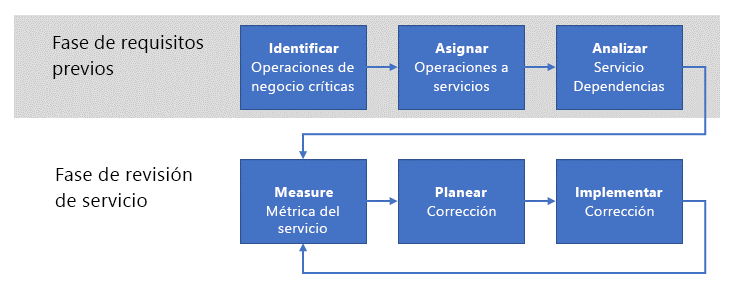

# Establecimiento de una revisión de adecuación operativaEstablishing an operational fitness review

Una vez que su empresa empieza a operar las cargas de trabajo en Azure, el paso siguiente consiste en establecer un proceso de **revisión de adecuación operativa** para enumerar, implementar y revisar de forma iterativa los requisitos **no funcionales** de estas cargas de trabajo.As your enterprise begins to operate workloads in Azure, the next step is to establish an **operational fitness review** process to enumerate, implement, and iteratively review the **non-functional** requirements for these workloads. Los requisitos _no funcionales_ están relacionados con el comportamiento operativo esperado del servicio._Non-functional_ requirements are related to the expected operational behavior of the service. Existen cinco categorías básicas de requisitos no funcionales que se conocen como [fundamentos de calidad del software](../../guide/pillars.md): escalabilidad, disponibilidad, resistencia (lo que incluye la continuidad del negocio y la recuperación ante desastres), administración y seguridad.There are five essential categories of non-functional requirements referred to as the [pillars of software quality](../../guide/pillars.md): scalability, availability, resiliency (including business continuity and disaster recovery), management, and security. La finalidad de un proceso de revisión de adecuación operativa es garantizar que sus cargas de trabajo críticas cumplen las expectativas de la empresa con respecto a los fundamentos de calidad.The purpose of an operational fitness review process is ensuring that your mission critical workloads meet the expectations of your business with respect to the quality pillars.

Por este motivo, la empresa debe llevar a cabo un proceso de revisión de adecuación operativa para entender totalmente los problemas derivados de ejecutar la carga de trabajo en un entorno de producción, determinar cómo solucionar los problemas y resolverlos.For this reason,  your enterprise should undertake an operational fitness review process to fully understand the issues that result from running the workload in a production environment, determine how to remediate the issues, then resolve them. En este artículo se describe un proceso de revisión de adecuación operativa de alto nivel que puede usar su empresa para conseguir este objetivo.This article outlines a high-level operational fitness review process that your enterprise can use to achieve this goal.

## Adecuación operativa en MicrosoftOperational fitness at Microsoft

Desde el principio, el desarrollo de la plataforma Azure ha sido un proyecto de integración y desarrollo continuados acometido por muchos equipos en Microsoft.From the outset, the development of the Azure platform has been a continuous development and integration project undertaken by many teams across Microsoft. Sería muy difícil garantizar la calidad y la coherencia de un proyecto del tamaño y la complejidad de Azure sin un proceso sólido para enumerar e implementar los requisitos no funcionales esenciales periódicamente.It would be very difficult to ensure quality and consistency for a project of Azure's size and complexity without a robust process for enumerating and implementing the fundamental non-functional requirements on a regular basis.

Estos procesos que sigue Microsoft constituyen la base de los descritos en este documento.These processes followed by Microsoft form the basis for those outlined in this document.

## Comprensión del problemaUnderstanding the problem

Como aprendió en la [Introducción](../../cloud-adoption/getting-started/overview.md), el primer paso en la transformación digital de una empresa es identificar los problemas empresariales que se van a resolver con la adopción de Azure.As you learned in [Getting started](../../cloud-adoption/getting-started/overview.md), the first step in an enterprise's digital transformation is identifying the business problems to be solved by adopting Azure. El siguiente paso es determinar una solución de alto nivel para el problema, como la migración de una carga de trabajo a la nube o la adaptación de un servicio local existente para incluir funcionalidad de nube.The next step is to determine a high-level solution to the problem, such as migrating a workload to the cloud, or adapting an existing on-premises service to include cloud functionality. Finalmente, la solución está diseñada e implementada.Finally, the solution is designed and implemented.

Durante este proceso, el foco está con frecuencia sobre las _características_ del servicio.During this process, the focus is often on the _features_ of the service. Es decir, hay un conjunto de requisitos _funcionales_ deseados que el servicio debe realizar.That is, there are a set of desired _functional_ requirements for the service to perform. Por ejemplo, un servicio de entrega de productos requiere características para determinar las ubicaciones de origen y destino del producto, realizar el seguimiento del producto durante la entrega, enviar notificaciones al cliente, etc.For example, a product delivery service requires features for determining the source and destination locations of the product, tracking the product during delivery, customer notifications, and others.

En cambio, los requisitos _no funcionales_ se relacionan con propiedades como la [disponibilidad](../../checklist/availability.md), la [resistencia](../../resiliency/index.md) y la [escalabilidad](../../checklist/scalability.md) del servicio.In contrast, the _non-functional_ requirements relate to properties such as the service's [availability](../../checklist/availability.md), [resiliency](../../resiliency/index.md), and [scalability](../../checklist/scalability.md). Estas propiedades se diferencian de los requisitos funcionales en que no influyen directamente sobre la función final de ninguna característica en particular del servicio.These properties differ from the functional requirements because they do not directly affect the final function of any particular feature in the service. Sin embargo, estos requisitos no funcionales están relacionados con el _rendimiento_ y la _continuidad_ del servicio.However, these non-functional requirements are related to the _performance_ and _continuity_ of the service.

Algunos requisitos no funcionales se pueden especificar en los términos de un Acuerdo de Nivel de Servicio (SLA).Some non-functional requirements can be specified in terms of a service level agreement (SLA). Por ejemplo, en el caso de la continuidad del servicio, un requisito de disponibilidad del servicio se puede expresar como un porcentaje, por ejemplo, **disponible el 99,99 % del tiempo**.For example, with regard to service continuity, an availability requirement for the service can be expressed as a percentage such as **available 99.99% of the time**. Otros requisitos no funcionales pueden ser más difíciles de definir y pueden cambiar a medida que evolucionan las necesidades de producción.Other non-functional requirements may be more difficult to define and may change as production needs evolve. Por ejemplo, un servicio orientado al consumidor podría comenzar a toparse con requisitos de rendimiento no anticipados tras un aumento repentino de popularidad.For example, a consumer-facing service might start facing unanticipated throughput requirements after a surge of popularity.

[NOTA] La definición de los requisitos de resistencia, incluidas las explicaciones de RPO, RTO, SLA y conceptos relacionados, se explora con más detalle en [Diseño de aplicaciones resistentes de Azure](../../resiliency/index.md#define-your-availability-requirements).![NOTE] Defining the requirements for resiliency, including explanations of RPO, RTO, SLA, and related concepts, are explored in more depth in [Designing resilient applications for Azure](../../resiliency/index.md#define-your-availability-requirements).

## Proceso de revisión de adecuación operativaOperational fitness review process

La clave para mantener el rendimiento y la continuidad de los servicios de una empresa es implementar un proceso de _revisión de adecuación operativa_.The key to maintaining the performance and continuity of an enterprise's services is to implement an _operational fitness review_ process.

En un nivel alto, el proceso tiene dos fases.At a high level, the process has two phases. En la fase de requisitos previos, los requisitos se establecen y se asignan a servicios complementarios.In the prerequisites phase, the requirements are established and mapped to supporting services. Esto se produce con menos frecuencia; quizás cada año o cuando se introducen nuevas operaciones.This occurs less frequently; perhaps annually or when new operations are introduced. El resultado de la fase de requisitos previos se usa en la fase de flujo.The output of the prerequisites phase is used in the flow phase. La fase de flujo se produce con más frecuencia; se recomienda una vez al mes.The flow phase occurs more frequently; we recommend monthly.

### Fase de requisitos previosPrerequisites phase

Los pasos descritos en esta fase tienen como fin capturar los requisitos necesarios para llevar a cabo una revisión periódica de los servicios importantes.The steps in this phase are intended to capture the necessary requirements for conducting a regular review of the important services.

- **Identificar las operaciones empresariales críticas**.**Identify critical business operations**. Identifique las operaciones empresariales **críticas** de la empresa.Identify the enterprise's **mission critical** business operations. Las operaciones empresariales son independientes de cualquier funcionalidad de servicio complementaria.Business operations are independent from any supporting service functionality. En otras palabras, las operaciones empresariales representan las actividades reales que el negocio debe realizar y están respaldadas por un conjunto de servicios de TI.In other words, business operations represent the actual activities that the business needs to perform and are supported by a set of IT services. El término _crítico_ o también _crítico para el negocio_, refleja un efecto grave sobre la empresa si se impide la operación.The term _mission critical_, or alternatively _business critical_, reflects a severe impact to the business if the operation is impeded. Por ejemplo, un minorista en línea puede tener una operación empresarial del tipo "permitir que un cliente agregue un artículo al carro de la compra" o "procesar un pago con tarjeta de crédito".For example, an online retailer may have a business operation such as "enable a customer to add an item to a shopping cart" or "process a credit card payment". Si alguna de estas operaciones genera un error, el cliente no podrá realizar la transacción y la empresa no podría realizar ventas.If either of these operations were to fail, a customer would be unable to complete the transaction and the enterprise would fail to realize sales.

- **Asignar operaciones a servicios**.**Map operations to services**. Asigne estas operaciones empresariales a los servicios que las respaldan.Map these business operations to the services that support them. En el ejemplo anterior del carro de la compra, pueden intervenir varios servicios: un servicio de administración del stock de inventario, un servicio de carro de la compra y otros.In the above shopping cart example, several services may be involved: an inventory stock management service, a shopping cart service, and others. En el ejemplo anterior de pago con tarjeta de crédito, un servicio de pago local podría interactuar con un servicio de procesamiento de pagos de terceros.In the credit card payment example above, an on-premises payment service may interact with a third-party payment processing service.

- **Analizar las dependencias de los servicios**.**Analyze service dependencies**. La mayoría de las operaciones empresariales requiere la orquestación entre varios servicios complementarios.Most business operations require orchestration between multiple supporting services. Es importante comprender las dependencias entre los servicios y el flujo de transacciones críticas a través de estos servicios.It is important to understand the dependences between the services and the flow of mission critical transactions through these services. También es necesario tener en cuenta las dependencias entre los servicios locales y los servicios de Azure.You should also consider the dependencies between on-premises services and Azure services. En el ejemplo del carro de la compra, el servicio de administración del stock de inventario se podría hospedar en el entorno local e ingerir los datos que especifican los empleados desde un almacén físico, pero podría almacenar los datos en un servicio de Azure como [Azure Storage](/azure/storage/common/storage-introduction) o una base de datos como [Azure Cosmos DB](/azure/cosmos-db/introduction).In the shopping cart example, the inventory stock management service may be hosted on-premises and ingest data input by employees from a physical warehouse, but it may store data in an Azure service such as [Azure storage](/azure/storage/common/storage-introduction) or a database such as [Azure Cosmos DB](/azure/cosmos-db/introduction).

Una salida de estas actividades es un conjunto de **métricas del cuadro de mandos** de las operaciones de servicio.An output from these activities is a set of **scorecard metrics** for service operations. Las métricas se clasifican en términos de criterios no funcionales, como disponibilidad, escalabilidad y recuperación ante desastres.The metrics are categorized in terms of non-functional criteria such as availability, scalability, and disaster recovery. Las métricas del cuadro de mandos expresan los criterios que se espera que cumpla el servicio de forma operativa.Scorecard metrics express the criteria that the service is expected to meet operationally. Estas métricas se pueden expresar con cualquier nivel de pormenorización que sea adecuado para la operación de servicio.These metrics can be expressed at any level of granularity that is appropriate for the service operation.

El cuadro de mandos debe expresarse en términos sencillos para facilitar la comunicación significativa entre los propietarios de empresa y los ingenieros.The scorecard should be expressed in simple terms to facilitate meaningful discussion between the business owners and engineering. Por ejemplo, una métrica del cuadro de mandos de escalabilidad se puede expresar como _verde_ para indicar que el rendimiento se ajusta a los criterios deseados, _amarillo_ para indicar que no se cumplen los criterios deseados, pero se está en proceso de implantar un plan de corrección, y _rojo_ para indicar que no se cumplen los criterios deseados con ningún plan o acción.For example, a scalability scorecard metric could be expressed as _green_ for performing at the desired criteria, _yellow_ for failing to meet the desired criteria but actively implementing a planned remediation, and _red_ for failing to meet the desired criteria with no plan or action.

Es importante destacar que estas métricas deben reflejar directamente las necesidades empresariales.It is important to emphasize that these metrics should directly reflect business needs.

### Fase de revisión de los serviciosService review phase

La fase de revisión de los servicios es el núcleo del proceso de revisión de adecuación operativa.The service review phase is core of the operational fitness review process.

- **Medir las métricas de los servicios**.**Measure service metrics**. Con las métricas del cuadro de mandos, los servicios se deben supervisar para garantizar que cumplen las expectativas empresariales.Using the scorecard metrics, the services should be monitored to ensure that they meet the business expectations. Esto significa que la supervisión de los servicios es fundamental.This means that service monitoring is essential. Si no es capaz de supervisar un conjunto de servicios con respecto a los requisitos no funcionales, las métricas del cuadro de mando correspondientes se deben considerar en rojo.If you are not able to monitor a set of services with respect to the non-functional requirements, then the corresponding scorecard metrics should be considered red. En este caso, el primer paso para solucionarlo es implementar la supervisión de los servicios adecuada.In this case, the first step for remediation is to implement the appropriate service monitoring.
Por ejemplo, si la empresa espera que un servicio funcione con una disponibilidad del 99,99 %, pero no dispone de datos de telemetría de producción para medir la disponibilidad, debe asumir que no satisface el requisito.For example, if the business expects a service to operate with 99.99% availability, but there is no production telemetry in place to measure the availability, you should assume that you're not meeting the requirement.

- **Planear las acciones correctivas**.**Plan remediation**. Con cada operación de servicio con métricas que se encuentren por debajo de un umbral aceptable, determine el costo de corregir el servicio para llevar la operación a una métrica aceptable.For each service operation with metrics that fall below an acceptable threshold, determine the cost of remediating the service to bring operation to an acceptable metric. Si el costo de la corrección del servicio es mayor que la generación de ingresos esperados del servicio, pase a considerar los costos no tangibles como la experiencia del cliente.If the cost of remediating the service is greater than the expected revenue generation of the service, move on to consider the non-tangible costs such as customer experience. Por ejemplo, si los clientes tienen dificultad para realizar pedidos correctamente con el servicio, podrían elegir en su lugar a la competencia.For example, if customers have difficulty placing a successful order using the service, they may choose a competitor instead.

- **Implementar el plan correctivo**.**Implement remediation**. Una vez que los propietarios de empresa y los ingenieros acuerdan un plan, se debe implementar.After the business owners and engineering converge on a plan, it should be implemented. Cada vez que se revisen las métricas del cuadro de mandos, se debe notificar el estado de la implementación.The status of the implementation should be reported whenever scorecard metrics are reviewed.

Este proceso es iterativo, y lo ideal es que la empresa tenga un equipo destinado a apropiarse de él.This process is iterative, and ideally your enterprise should have a team dedicated to owning it. Este equipo debe reunirse periódicamente para revisar los proyectos de corrección existentes, poner en marcha la revisión de aspectos básicos de nuevas cargas de trabajo y realizar un seguimiento del cuadro de mandos general de la empresa.This team should meet regularly to review existing remediation projects, kick off the fundamentals review of new workloads, and track the enterprise's overall scorecard. El equipo debe tener la autoridad para garantizar la responsabilidad de los equipos de corrección que están detrás de la programación o la falta de cumplimiento de las métricas.The team should have the authority to ensure accountability for remediation teams that are behind schedule or fail to meet metrics.

## Estructura del equipo de revisión de adecuación operativaStructure of the operational fitness review team

El equipo de revisión de adecuación operativa se compone de los siguientes roles:The operational fitness review team is composed of the following roles:

1. **Propietario de la empresa**.**Business owner**. Este rol proporciona conocimiento del negocio para identificar y clasificar en orden de prioridad cada operación empresarial "crítica".This role provides knowledge of the business to identify and prioritize each "mission critical" business operation. Este rol también compara el costo de la solución con la repercusión para el negocio y conduce la decisión final sobre la corrección.This role also compares the mitigation cost to the business impact and drives the final decision on remediation.

2. **Defensor del negocio**.**Business advocate**. Este rol es responsable de dividir las operaciones empresariales en partes discretas y de asignar esas partes a la infraestructura y los servicios en la nube y locales.This role is responsible for breaking down business operations into discreet parts and mapping those parts to on-premises and cloud services and infrastructure. El rol requiere un conocimiento profundo de la tecnología asociada con cada operación empresarial.The role requires deep knowledge of the technology associated with each business operation.

3. **Propietario de ingeniería**.**Engineering owner**. Este rol es responsable de implementar los servicios asociados con la operación empresarial.This role is responsible for implementating the services associated with the business operation. Estas personas pueden participar en el diseño y la implementación de posibles soluciones para resolver los problemas de requisitos no funcionales detectados por el equipo de revisión de adecuación operativa.These individuals may participate in the design, implementation, and deployment of any solutions for solving non-functional requirement issues uncovered by the operational fitness review team.

4. **Propietario del servicio**.**Service owner**. Este rol es responsable del funcionamiento de las aplicaciones y los servicios de la empresa.This role is responsible for operating the business's applications and services. Estos individuos recopilan datos de registro y uso de estas aplicaciones y servicios.These individuals collect logging and usage data for these applications and services. Estos datos se usan para identificar problemas y comprobar las soluciones una vez implementadas.This data is used both to identify issues and verify fixes once deployed.

## Reunión de revisión de adecuación operativaOperational fitness review meeting

Es recomendable que el equipo de revisión de adecuación operativa se reúna periódicamente.We recommend that your operational fitness review team meet on a regular basis. Por ejemplo, el equipo se podría reunir todos los meses, e informar del estado y las métricas al personal directivo de forma trimestral.For example, the could team meet on a monthly cadence and report status and metrics to senior leadership on a quarterly basis.

Los detalles del proceso y la reunión se deben adaptar a sus necesidades específicas.The details of the process and meeting should be adapted to fit your specific needs. Como punto de partida, se recomiendan las siguientes tareas:We recommend the following tasks as a starting point:

1. El propietario de la empresa y el defensor del negocio enumeran y determinan los requisitos no funcionales de cada operación empresarial, con la aportación de los propietarios de ingeniería y del servicio.The business owner and business advocate enumerate and determine the non-functional requirements for each business operation, with input from the engineering and service owners. Con las operaciones empresariales que se han identificado anteriormente, se revisa y comprueba la prioridad.For business operations that have been previously identified, the priority is reviewed and verified. Con las operaciones de negocio nuevas, se asigna una prioridad de la lista existente.For new business operations, a priority in the existing list is assigned.

2. Los propietarios de ingeniería y del servicio asignan el **estado actual** de las operaciones empresariales a los servicios en la nube y locales correspondientes.The engineering and service owners map the **current state** of business operations to the corresponding on-premises and cloud services. La asignación se compone de una lista de los componentes de cada servicio, orientada como un árbol de dependencias.The mapping is composed of a list of the components in each service, oriented as a dependency tree. Una vez que se generan la lista y el árbol de dependencias, se determinan las **rutas críticas** a través del árbol.Once the list and dependency tree are generated, the **critical paths** through the tree are determined.

3. Los propietarios de ingeniería y del servicio revisan el estado actual del registro y la supervisión operativos de los servicios enumerados en el paso anterior.The engineering and service owners review the current state of operational logging and monitoring for the services listed in the previous step. Para identificar los componentes del servicio que contribuyen al incumplimiento de los requisitos no funcionales, son esenciales procedimientos de registro y supervisión de gran robustez.Robust logging and monitoring are critical, in order to identify service components that contribute to failuring to meet non-functional requirements. Si no se disponen de suficientes procedimientos de registro y supervisión, se debe crear e implementar un plan para implantarlos.If sufficient logging and monitoring are not in place, a plan must be created and implemented to put them in place.

4. Se crean métricas del cuadro de mandos para la nueva operación empresarial.Scorecard metrics are created for new business operation. El cuadro de mandos se compone de la lista de componentes constituyentes de cada servicio identificado en el paso 2, en consonancia con los requisitos no funcionales y una métrica que representa el grado en que el componente cumple el requisito.The scorecard is composed of the list of constituent components for each service identified in step 2, aligned with the non-functional requirements and a metric representing how well the component meets the requirement.

5. Para los componentes constituyentes que no cumplen los requisitos no funcionales, se diseña una solución de alto nivel y se asigna un propietario de ingeniería.For those constituent components that fail to meet non-functional requirements, a high-level solution is designed and an engineering owner is assigned. En este momento, el propietario de la empresa y el defensor del negocio deben establecer un presupuesto para el trabajo de corrección, en función de los ingresos previstos de la operación empresarial.At this point, the business owner and business advocate should establish a budget for the remediation work, based on the expected revenue of the business operation.

6. Por último, se lleva a cabo una revisión del trabajo de corrección en curso.Finally, a review is conducted of the ongoing remediation work. Cada una de las métricas del cuadro de mandos del trabajo en curso se revisa comparándola con las métricas esperadas.Each of the scorecard metrics for work in progress is reviewed against the expected metrics. En el caso de los componentes constituyentes que satisfacen las métricas, el propietario del servicio presenta los datos de registro y supervisión para confirmar que se cumple la métrica.For constituent components that are meeting metrics, the service owner presents logging and monitoring data to confirm that the metric is met. En cuanto a esos componentes constituyentes que no satisfacen las métricas, cada propietario de ingeniería explica los problemas que impiden que se alcancen las métricas y las posibles nuevas formas de corregir el problema.For those constituent components that are not meeting metrics, each engineering owner explains the issues that are preventing metrics from being reached and any new designs for remediation.

## Recursos recomendadosRecommended resources

- [Fundamentos de calidad del software](../../guide/pillars.md).[Pillars of software quality](../../guide/pillars.md).
En esta sección de la guía de arquitectura de aplicaciones de Azure de describen los cinco fundamentos de la calidad del software: escalabilidad, disponibilidad, resistencia, administración y seguridad.This section of the Azure Application Architecture guide describes the five pillars of software quality: Scalability, availability, resiliency, management, and security.
- [Diez principios de diseño para las aplicaciones de Azure](../../guide/design-principles/index.md).[Ten design principles for Azure applications](../../guide/design-principles/index.md).
En esta sección de la guía de arquitectura de aplicaciones de Azure se analiza un conjunto de principios de diseño para que la aplicación sea más escalable, resistente y fácil de administrar.This section of the Azure Application Architecture guide discusses a set of design principles to make your application more scalable, resilient, and manageable.
- [Diseño de aplicaciones resistentes de Azure](../../resiliency/index.md).[Designing resilient applications for Azure](../../resiliency/index.md).
Esta guía comienza con una definición del término resistencia y los conceptos relacionados.This guide starts with a definition of the term resiliency and related concepts. Después se describe un proceso para lograr resistencia, mediante un enfoque estructurado durante la vigencia de una aplicación, desde el diseño y la puesta en marcha hasta la implementación y operaciones.Then it describes a process for achieving resiliency, using a structured approach over the lifetime of an application, from design and implementation to deployment and operations.
- [Patrones de diseño en la nube](../../patterns/index.md).[Cloud Design Patterns](../../patterns/index.md).
Estos patrones de diseño son útiles para los equipos de ingeniería al compilar aplicaciones sobre los fundamentos de calidad del software.These design patterns are useful for engineering teams when building applications on the pillars of software quality.