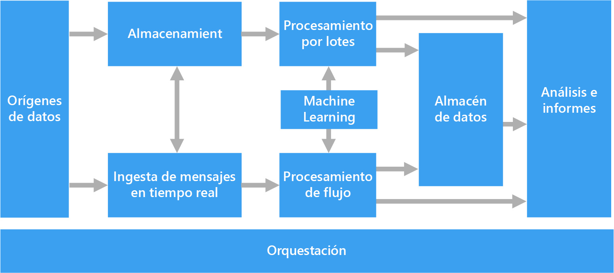
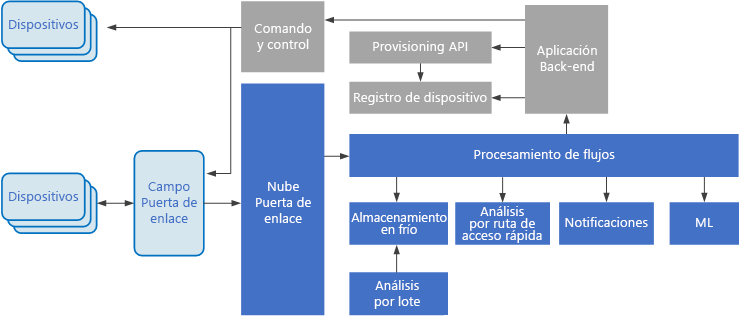

# Arquitecturas de macrodatosBig data architectures

Una arquitectura de macrodatos está diseñada para controlar la ingesta, el procesamiento y el análisis de datos que son demasiado grandes o complejos para los sistemas de bases de datos tradicionales.A big data architecture is designed to handle the ingestion, processing, and analysis of data that is too large or complex for traditional database systems. El umbral en el que las organizaciones entran en el reino de los macrodatos depende de las funcionalidades de los usuarios y sus herramientas.The threshold at which organizations enter into the big data realm differs, depending on the capabilities of the users and their tools. Para algunos, puede significar cientos de gigabytes de datos, mientras que para otros cientos de terabytes.For some, it can mean hundreds of gigabytes of data, while for others it means hundreds of terabytes. A medida que avanzan las herramientas para trabajar con conjuntos de macrodatos, igual lo hace el significado de macrodatos.As tools for working with big data sets advance, so does the meaning of big data. Este término cada vez se relaciona más con el valor que puede extraer de los conjuntos de datos a través del análisis avanzado, en lugar de que sea estrictamente el tamaño de los datos, aunque en estos casos tienden a ser bastante grandes.More and more, this term relates to the value you can extract from your data sets through advanced analytics, rather than strictly the size of the data, although in these cases they tend to be quite large.

Con el paso de los años, el panorama de los datos ha cambiado.Over the years, the data landscape has changed. Lo que se puede hacer, o se espera que se haga, con los datos ha cambiado.What you can do, or are expected to do, with data has changed. El costo del almacenamiento ha caído drásticamente, mientras que los medios por los que se recopilan los datos siguen creciendo.The cost of storage has fallen dramatically, while the means by which data is collected keeps growing. Algunos datos llegan a un ritmo elevado, lo que hace que haya una exigencia constante de recopilación y examen de los mismos.Some data arrives at a rapid pace, constantly demanding to be collected and observed. Otros llegan más lentamente, pero en grandes cantidades, a menudo en forma de décadas de datos históricos.Other data arrives more slowly, but in very large chunks, often in the form of decades of historical data. Es posible que se enfrente a un problema de análisis avanzado o a uno que requiera Machine Learning.You might be facing an advanced analytics problem, or one that requires machine learning. Estos son los problemas que las arquitecturas de macrodatos intentan resolver.These are challenges that big data architectures seek to solve.

Las soluciones de macrodatos suelen implicar uno o varios de los tipos siguientes de cargas de trabajo:Big data solutions typically involve one or more of the following types of workload:

* Procesamiento por lotes de orígenes de macrodatos en reposo.Batch processing of big data sources at rest.
* Procesamiento en tiempo real de macrodatos en movimiento.Real-time processing of big data in motion.
* Exploración interactiva de macrodatos.Interactive exploration of big data.
* Análisis predictivo y aprendizaje automático.Predictive analytics and machine learning.

Considere la posibilidad de usar arquitecturas de macrodatos cuando necesite:Consider big data architectures when you need to:

* Almacenar y procesar datos en volúmenes demasiado grandes para una base de datos tradicional.Store and process data in volumes too large for a traditional database.
* Transformar datos no estructurados para el análisis y la creación de informes.Transform unstructured data for analysis and reporting.
* Capturar, procesar y analizar flujos no asociados de datos en tiempo real, o con una latencia baja.Capture, process, and analyze unbounded streams of data in real time, or with low latency.

## Componentes de una arquitectura de macrodatosComponents of a big data architecture

El siguiente diagrama muestra los componentes lógicos que puede contener una arquitectura de macrodatos.The following diagram shows the logical components that fit into a big data architecture. Es posible que las soluciones individuales no contengan todos los elementos de este diagrama.Individual solutions may not contain every item in this diagram.

 

La mayoría de las arquitecturas de macrodatos incluyen algunos de los componentes siguientes (o todos ellos):Most big data architectures include some or all of the following components:

* **Orígenes de datos**.**Data sources**. Todas las soluciones de macrodatos se inician con uno o varios orígenes de datos.All big data solutions start with one or more data sources. Algunos ejemplos son:Examples include:

    * Almacenes de datos de aplicación, como bases de datos relacionales.Application data stores, such as relational databases.
    * Archivos estáticos generados por aplicaciones, como archivos de registro de servidor web.Static files produced by applications, such as web server log files.
    * Orígenes de datos en tiempo real, como dispositivos de IoT.Real-time data sources, such as IoT devices.

* **Almacenamiento de datos**.**Data storage**. Los datos de las operaciones de procesamiento por lotes se almacenan normalmente en un almacén de archivos distribuido que puede contener importantes cantidades de archivos grandes en diferentes formatos.Data for batch processing operations is typically stored in a distributed file store that can hold high volumes of large files in various formats. Este tipo de almacén se suele denominar *Data Lake*.This kind of store is often called a *data lake*. Las opciones para implementar este almacenamiento son Azure Data Lake Store o lo contenedores de blob en Azure Storage.Options for implementing this storage include Azure Data Lake Store or blob containers in Azure Storage.

* **Procesamiento por lotes**.**Batch processing**. Como los conjuntos de datos son tan grandes, a menudo una solución de macrodatos debe procesar los archivos de datos mediante trabajos por lotes de ejecución prolongada para filtrar, agregar o preparar de cualquier otra forma los datos para su análisis.Because the data sets are so large, often a big data solution must process data files using long-running batch jobs to filter, aggregate, and otherwise prepare the data for analysis. Normalmente estos trabajos implican leer archivos de código fuente, procesarlos y escribir la salida en nuevos archivos.Usually these jobs involve reading source files, processing them, and writing the output to new files. Las opciones incluyen la ejecución de trabajos de U-SQL en Azure Data Lake Analytics, el uso de Hive, Pig o trabajos personalizados de Map/Reduce en un clúster de HDInsight Hadoop, o el uso de programas de Java, Scala o Python en un clúster de HDInsight Spark.Options include running U-SQL jobs in Azure Data Lake Analytics, using Hive, Pig, or custom Map/Reduce jobs in an HDInsight Hadoop cluster, or using Java, Scala, or Python programs in an HDInsight Spark cluster.

* **Ingesta de mensajes en tiempo real**.**Real-time message ingestion**. Si la solución incluye orígenes en tiempo real, la arquitectura debe incluir una manera de capturar y almacenar los mensajes en tiempo real para el procesamiento de flujos.If the solution includes real-time sources, the architecture must include a way to capture and store real-time messages for stream processing. Podría tratarse de un sencillo almacén de datos, donde se colocan los mensajes entrantes en una carpeta para su procesamiento.This might be a simple data store, where incoming messages are dropped into a folder for processing. Sin embargo, muchas soluciones necesitan un almacén de ingesta de mensajes para que actúe como búfer de mensajes y para admitir el procesamiento de escalabilidad horizontal, la entrega confiable y otra semántica de puesta en cola de mensajes.However, many solutions need a message ingestion store to act as a buffer for messages, and to support scale-out processing, reliable delivery, and other message queuing semantics. Esta parte de una arquitectura de streaming a menudo se conoce como almacenamiento en búfer de flujos.This portion of a streaming architecture is often referred to as stream buffering. Entre las opciones se incluyen Azure Event Hubs, Azure IoT Hubs y Kafka.Options include Azure Event Hubs, Azure IoT Hub, and Kafka.

* **Procesamiento de flujos**.**Stream processing**. Una vez capturados los mensajes en tiempo real, la solución debe procesarlos filtrando, agregando o bien preparando los datos para su análisis.After capturing real-time messages, the solution must process them by filtering, aggregating, and otherwise preparing the data for analysis. Los datos de secuencias procesados se escriben entonces en un receptor de salida.The processed stream data is then written to an output sink. Azure Stream Analytics proporciona un servicio de procesamiento de secuencias administrado basado en consultas SQL de ejecución permanente que operan en secuencias sin enlazar.Azure Stream Analytics provides a managed stream processing service based on perpetually running SQL queries that operate on unbounded streams. También puede utilizar tecnologías de streaming de código abierto como Storm y Spark Streaming en un clúster de HDInsight.You can also use open source Apache streaming technologies like Storm and Spark Streaming in an HDInsight cluster.

* **Almacén de datos analíticos**.**Analytical data store**. Muchas soluciones de macrodatos preparan los datos para el análisis y luego sirven los datos procesados en un formato estructurado que se puede consultar mediante herramientas de análisis.Many big data solutions prepare data for analysis and then serve the processed data in a structured format that can be queried using analytical tools. El almacén de datos analíticos que se utiliza para atender estas consultas puede ser un almacén de datos relacional de estilo Kimball, como se ve en la mayoría de soluciones tradicionales de inteligencia empresarial.The analytical data store used to serve these queries can be a Kimball-style relational data warehouse, as seen in most traditional business intelligence (BI) solutions. También es posible que los datos se presenten a través de una tecnología NoSQL de baja latencia como HBase, o una base de datos de Hive interactiva que proporciona una abstracción de metadatos sobre los archivos de datos en el almacén de datos distribuidos.Alternatively, the data could be presented through a low-latency NoSQL technology such as HBase, or an interactive Hive database that provides a metadata abstraction over data files in the distributed data store. Azure SQL Data Warehouse proporciona un servicio administrado para el almacenamiento de datos a gran escala basado en la nube.Azure SQL Data Warehouse provides a managed service for large-scale, cloud-based data warehousing. HDInsight admite Interactive Hive, HBase y Spark SQL, que también se puede utilizar para proporcionar datos par el análisis.HDInsight supports Interactive Hive, HBase, and Spark SQL, which can also be used to serve data for analysis.

* **Análisis e informes**.**Analysis and reporting**. El objetivo de la mayoría de soluciones de macrodatos consiste en proporcionar información sobre los datos a través de análisis e informes.The goal of most big data solutions is to provide insights into the data through analysis and reporting. Para permitir que los usuarios analicen los datos, la arquitectura puede incluir una capa de modelado de datos, como un cubo OLAP multidimensional o un modelo de datos tabulares en Azure Analysis Services.To empower users to analyze the data, the architecture may include a data modeling layer, such as a multidimensional OLAP cube or tabular data model in Azure Analysis Services. También podría admitir inteligencia empresarial con características de autoservicio mediante las tecnologías de modelado y visualización en Microsoft Power BI o Microsoft Excel.It might also support self-service BI, using the modeling and visualization technologies in Microsoft Power BI or Microsoft Excel. Los análisis y la creación de informes también pueden adoptar la forma de exploración interactiva de datos por parte de científicos o analistas de datos.Analysis and reporting can also take the form of interactive data exploration by data scientists or data analysts. En estos casos, muchos servicios de Azure admiten bloc de notas analíticos, como Jupyter, lo cual permite a estos usuarios aprovechar sus conocimientos existentes con Python o R. En el caso de la exploración de datos a gran escala, puede utilizar Microsoft R Server, tanto de manera independiente como con Spark.For these scenarios, many Azure services support analytical notebooks, such as Jupyter, enabling these users to leverage their existing skills with Python or R. For large-scale data exploration, you can use Microsoft R Server, either standalone or with Spark.

* **Orquestación**.**Orchestration**. La mayoría de las soluciones de macrodatos constan de operaciones de procesamiento de datos repetidas, encapsuladas en flujos de trabajo, que transforman los datos de origen, mueven datos entre varios orígenes y receptores, cargan los datos procesados en un almacén de datos analítico o envían los resultados directamente a un informe o un panel.Most big data solutions consist of repeated data processing operations, encapsulated in workflows, that transform source data, move data between multiple sources and sinks, load the processed data into an analytical data store, or push the results straight to a report or dashboard. Para automatizar estos flujos de trabajo, puede utilizar una tecnología de coordinación como Azure Data Factory o Apache Oozie y Sqoop.To automate these workflows, you can use an orchestration technology such Azure Data Factory or Apache Oozie and Sqoop.

## Arquitectura lambdaLambda architecture

Cuando se trabaja con grandes conjuntos de datos, es posible que se tarde mucho tiempo en ejecutar el tipo de consultas que los clientes necesitan.When working with very large data sets, it can take a long time to run the sort of queries that clients need. Dichas consultas no se puede realizar en tiempo real y, a menudo, requieren algoritmos como [MapReduce](https://en.wikipedia.org/wiki/MapReduce) que funcionan en paralelo en todo el conjunto de datos.These queries can't be performed in real time, and often require algorithms such as [MapReduce](https://en.wikipedia.org/wiki/MapReduce) that operate in parallel across the entire data set. Luego, los resultados se almacenan por separado de los datos sin procesar y se utilizan para realizar consultas.The results are then stored separately from the raw data and used for querying.

Un inconveniente de este enfoque es que introduce latencia (si el procesamiento tarda varias horas, una consulta puede devolver resultados con varias horas de antigüedad).One drawback to this approach is that it introduces latency &mdash; if processing takes a few hours, a query may return results that are several hours old. Lo ideal sería que deseara obtener resultados en tiempo real (quizás con alguna pérdida de precisión) y combinar dichos resultados con los de los análisis por lotes.Ideally, you would like to get some results in real time (perhaps with some loss of accuracy), and combine these results with the results from the batch analytics.

El **arquitectura lambda**, que Nathan Marz propuso por primera vez, aborda este problema mediante la creación de dos rutas de acceso para el flujo de datos.The **lambda architecture**, first proposed by Nathan Marz, addresses this problem by creating two paths for data flow. Todos los datos que entran en el sistema atraviesan estas dos rutas de acceso:All data coming into the system goes through these two paths:

* Una **capa por lotes** (ruta de acceso preciso) almacena todos los datos de entrada en su forma sin formato y realiza el procesamiento por lotes de los datos.A **batch layer** (cold path) stores all of the incoming data in its raw form and performs batch processing on the data. El resultado de este procesamiento se almacena en forma de **vista por lotes**.The result of this processing is stored as a **batch view**.

* Una **capa de velocidad** (ruta de acceso rápido) analiza los datos en tiempo real.A **speed layer** (hot path) analyzes data in real time. Este nivel está diseñado para que tenga una latencia baja, a costa de la precisión.This layer is designed for low latency, at the expense of accuracy.

La capa por lotes se distribuye en una **capa de servicios** que indexa la vista por lotes para realizar consultas eficaces.The batch layer feeds into a **serving layer** that indexes the batch view for efficient querying. La capa de velocidad actualiza el nivel de servicios con actualizaciones incrementales en función de los datos más recientes.The speed layer updates the serving layer with incremental updates based on the most recent data.

Los datos que fluyen en la ruta de acceso rápido están limitados por los requisitos de latencia que impone la capa de velocidad, con el fin de que puedan procesarse lo antes posible.Data that flows into the hot path is constrained by latency requirements imposed by the speed layer, so that it can be processed as quickly as possible. A menudo esto requiere ceder cierto nivel de precisión a cambio de que los datos estén listos lo más rápidamente posible.Often, this requires a tradeoff of some level of accuracy in favor of data that is ready as quickly as possible. Por ejemplo, considere un escenario de IoT en el que un gran número de sensores de temperatura envían datos de telemetría.For example, consider an IoT scenario where a large number of temperature sensors are sending telemetry data. La capa de velocidad se puede utilizar para procesar una ventana de tiempo variable de los datos de entrada.The speed layer may be used to process a sliding time window of the incoming data. 

Los datos que fluyen en la ruta de acceso preciso, por otro lado, no están sujetos a los mismos requisitos de latencia baja.Data flowing into the cold path, on the other hand, is not subject to the same low latency requirements. Esto permite que el cálculo tenga gran exactitud en grandes conjuntos de datos, lo que puede requerir mucho tiempo.This allows for high accuracy computation across large data sets, which can be very time intensive. 

Finalmente, las rutas de acceso rápido y preciso convergen en la aplicación de cliente de análisis.Eventually, the hot and cold paths converge at the analytics client application. Si el cliente necesita para mostrar los datos rápidamente, aunque probablemente a costa de algo de precisión, obtendrá el resultado de la ruta de acceso rápido.If the client needs to display timely, yet potentially less accurate data in real time, it will acquire its result from the hot path. En caso contrario, si lo que desea son datos más preciso, aunque no pueda mostrarlos rápidamente, seleccionará los resultados de la ruta de acceso preciso.Otherwise, it will select results from the cold path to display less timely but more accurate data. En otras palabras, la ruta de acceso rápido tiene datos para una ventana de tiempo relativamente pequeña, después de lo cual los resultados se pueden actualizar con datos más precisos de la ruta de acceso preciso.In other words, the hot path has data for a relatively small window of time, after which the results can be updated with more accurate data from the cold path.

Los datos sin formato almacenados en la capa por lotes no de pueden modificar.The raw data stored at the batch layer is immutable. Los datos de entrada siempre se anexan a los datos existentes y los datos anteriores nunca se sobrescriben.Incoming data is always appended to the existing data, and the previous data is never overwritten. Todos los cambios en el valor de un dato concreto se almacenan como un nuevo registro de eventos con marca de tiempo.Any changes to the value of a particular datum are stored as a new timestamped event record. Esto permite el recálculo en cualquier momento del historial de los datos recopilados.This allows for recomputation at any point in time across the history of the data collected. La capacidad para volver a calcular la vista por lotes desde los datos sin formato originales es importante, porque permite que se creen nuevas vistas a medida que el sistema evoluciona.The ability to recompute the batch view from the original raw data is important, because it allows for new views to be created as the system evolves. 

## Arquitectura kappaKappa architecture

Una desventaja de la arquitectura lamba es su complejidad.A drawback to the lambda architecture is its complexity. La lógica de procesamiento aparece en dos lugares diferentes, &mdash; las rutas de acceso rápido y preciso, &mdash; que usan marcos distintos.Processing logic appears in two different places &mdash; the cold and hot paths &mdash; using different frameworks. Esto conduce a la duplicación de la lógica de cálculo y a la complejidad de administrar la arquitectura de ambas rutas de acceso.This leads to duplicate computation logic and the complexity of managing the architecture for both paths.

La **arquitectura kappa** la propuso Jay Kreps como alternativa a la arquitectura lambda.The **kappa architecture** was proposed by Jay Kreps as an alternative to the lambda architecture. Tiene los mismos objetivos básicos que la arquitectura lambda, pero con una diferencia importante: todos los flujos de datos atraviesan una única ruta de acceso, para lo que usan un sistema de procesamiento de flujos.It has the same basic goals as the lambda architecture, but with an important distinction: All data flows through a single path, using a stream processing system. 

Hay algunas similitudes con capa por lotes de la arquitectura lambda, como que los datos de los eventos son inmutables y todos son recopilados, en lugar de ser un subconjunto.There are some similarities to the lambda architecture's batch layer, in that the event data is immutable and all of it is collected, instead of a subset. Los datos se ingieren como un flujo de eventos en un registro unificado distribuido y que tolera errores.The data is ingested as a stream of events into a distributed and fault tolerant unified log. Estos eventos están ordenados y el estado actual de un evento cambia solo cuando se anexa un nuevo evento.These events are ordered, and the current state of an event is changed only by a new event being appended. De forma parecida a la capa de velocidad de la arquitectura lambda, todo el procesamiento de eventos se realiza en el flujo de entrada y se conserva como una vista en tiempo real.Similar to a lambda architecture's speed layer, all event processing is performed on the input stream and persisted as a real-time view. 

Si necesita recalcular todo el conjunto de datos (equivalente a lo que la capa por lotes hace en la arquitectura lambda), solo hay que reproducir el flujo, que normalmente usa el paralelismo para completar el cálculo a tiempo.If you need to recompute the entire data set (equivalent to what the batch layer does in lambda), you simply replay the stream, typically using parallelism to complete the computation in a timely fashion.

## Internet de las cosas (IoT)Internet of Things (IoT)

Desde un punto de vista práctico, Internet de las cosas (IoT) representa cualquier dispositivo conectado a Internet.From a practical viewpoint, Internet of Things (IoT) represents any device that is connected to the Internet. Esto incluye el PC, teléfono móvil, smartwatch, termostato inteligente, refrigerador inteligente, automóvil con conexión a Internet, implantes para el control cardiaco y cualquier otra cosa que se conecte a Internet y envíe o reciba datos.This includes your PC, mobile phone, smart watch, smart thermostat, smart refrigerator, connected automobile, heart monitoring implants, and anything else that connects to the Internet and sends or receives data. El número de dispositivos conectados crece a diario, así como la cantidad de datos que recopilan.The number of connected devices grows every day, as does the amount of data collected from them. A menudo, estos datos se recopilan en entornos muy limitados y, en ocasiones, con una latencia alta.Often this data is being collected in highly constrained, sometimes high-latency environments. En otros casos, miles o millones de dispositivos envían los datos desde entornos de baja latencia, lo que requiere la capacidad para ingerir rápidamente los datos y procesarlos según corresponda.In other cases, data is sent from low-latency environments by thousands or millions of devices, requiring the ability to rapidly ingest the data and process accordingly. Por lo tanto, se requiere un planeamiento adecuado para controlar estas restricciones y requisitos únicos.Therefore, proper planning is required to handle these constraints and unique requirements.

Las arquitecturas basadas en eventos son básicas para las soluciones de IoT.Event-driven architectures are central to IoT solutions. En el siguiente diagrama se muestra una posible arquitectura lógica de IoT.The following diagram shows a possible logical architecture for IoT. En él se resaltan los componentes del flujo de eventos de la arquitectura.The diagram emphasizes the event-streaming components of the architecture.

La **puerta de enlace de nube** ingiere eventos de dispositivo en el límite de nube, mediante un sistema de mensajería confiable y de baja latencia.The **cloud gateway** ingests device events at the cloud boundary, using a reliable, low latency messaging system.

Los dispositivos pueden enviar eventos directamente a la puerta de enlace de nube, o a través de una **puerta de enlace de campo**.Devices might send events directly to the cloud gateway, or through a **field gateway**. Una puerta de enlace de campo es un dispositivo o software especializado, que normalmente se coloca con los dispositivos, que recibe eventos y los reenvía a la puerta de enlace de nube.A field gateway is a specialized device or software, usually collocated with the devices, that receives events and forwards them to the cloud gateway. La puerta de enlace de campo también puede procesar previamente los eventos de dispositivo sin formato y realizar funciones como filtrado, agregación o transformación de protocolo.The field gateway might also preprocess the raw device events, performing functions such as filtering, aggregation, or protocol transformation.

Después de la ingesta, los eventos pasan por uno o varios **procesadores de flujo** que pueden enrutar los datos (por ejemplo, al almacenamiento) o realizar análisis u otras tareas de procesamiento.After ingestion, events go through one or more **stream processors** that can route the data (for example, to storage) or perform analytics and other processing.

Estos son algunos tipos comunes de procesamiento.The following are some common types of processing. (Ciertamente, esta lista no es exhaustiva).(This list is certainly not exhaustive.)

- Escribir datos de eventos en almacenamiento en frío, para archivado o análisis por lotes.Writing event data to cold storage, for archiving or batch analytics.

- Análisis de ruta de acceso activa, que analiza el flujo de eventos (casi) en tiempo real para detectar anomalías, reconocer patrones durante ventanas de tiempo consecutivas o desencadenar alertas cuando se produce una condición especifica en el flujo.Hot path analytics, analyzing the event stream in (near) real time, to detect anomalies, recognize patterns over rolling time windows, or trigger alerts when a specific condition occurs in the stream. 

- El control de los tipos especiales de mensajes que no son de telemetría de los dispositivos, tales como notificaciones y alarmas.Handling special types of nontelemetry messages from devices, such as notifications and alarms. 

- Machine LearningMachine learning.

Los cuadros que aparecen en gris sombreado muestran los componentes de un sistema IoT que no están directamente relacionados con el flujo de eventos, pero se incluyen aquí para ofrecer una visión completa.The boxes that are shaded gray show components of an IoT system that are not directly related to event streaming, but are included here for completeness.

- El **registro de dispositivos** es una base de datos de los dispositivos aprovisionados, incluidos los identificadores de dispositivo y habitualmente los metadatos de dispositivos, como la ubicación.The **device registry** is a database of the provisioned devices, including the device IDs and usually device metadata, such as location.

- La **API de aprovisionamiento** es una interfaz externa común para el aprovisionamiento y el registro de nuevos dispositivos.The **provisioning API** is a common external interface for provisioning and registering new devices.

- Algunas soluciones IoT permiten el envío de **mensajes de comando y control** a los dispositivos.Some IoT solutions allow **command and control messages** to be sent to devices.

Servicios de Azure correspondientes:Relevant Azure services:

- [Azure IoT HubAzure IoT Hub](https://azure.microsoft.com/services/iot-hub/)
- [Azure Event HubsAzure Event Hubs](https://azure.microsoft.com/services/event-hubs/)
- [Azure Stream AnalyticsAzure Stream Analytics](https://azure.microsoft.com/services/stream-analytics/)  

Para más información acerca de IoT en Azure, lea la [arquitectura de referencia de IoT de Azure](https://azure.microsoft.com/updates/microsoft-azure-iot-reference-architecture-available/).Learn more about IoT on Azure by reading the [Azure IoT reference architecture](https://azure.microsoft.com/updates/microsoft-azure-iot-reference-architecture-available/).

