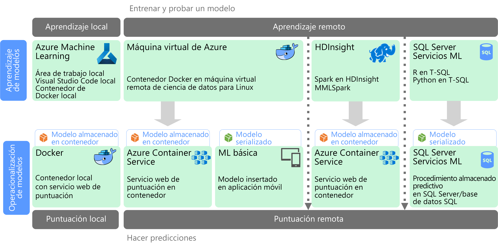

# Aprendizaje automático a escalaMachine learning at scale

El aprendizaje automático es una técnica usada para entrenar modelos predictivos basados en algoritmos matemáticos.Machine learning (ML) is a technique used to train predictive models based on mathematical algorithms. El aprendizaje automático analiza las relaciones entre los campos de datos para predecir valores desconocidos.Machine learning analyzes the relationships between data fields to predict unknown values.

La creación e implementación de un modelo de aprendizaje automático es un proceso iterativo:Creating and deploying a machine learning model is an iterative process:

- Los científicos de datos exploran los datos de origen para determinar las relaciones entre las *características* y las *etiquetas* previstas.Data scientists explore the source data to determine relationships between *features* and predicted *labels*.
- Los científicos de datos entrenan y validan modelos basados en algoritmos adecuados para encontrar el modelo óptimo para la predicción.The data scientists train and validate models based on appropriate algorithms to find the optimal model for prediction.
- El modelo óptimo se implementa en producción, como un servicio web u otra función encapsulada.The optimal model is deployed into production, as a web service or some other encapsulated function.
- A medida que se recopilan datos nuevos, se vuelve a entrenar el modelo periódicamente para mejorar su eficacia.As new data is collected, the model is periodically retrained to improve its effectiveness.

El aprendizaje automático a escala trata dos ámbitos de escalabilidad diferentes.Machine learning at scale addresses two different scalability concerns. La primera es el entrenamiento de un modelo con grandes conjuntos de datos, que necesita las funcionalidades de la escalabilidad horizontal de un clúster para realizar el entrenamiento.The first is training a model against large data sets that require the scale-out capabilities of a cluster to train. El segundo se centra en la puesta en operación del modelo entrenado de manera que se pueda escalar para cumplir las necesidades de las aplicaciones que lo consumen.The second centers is operationalizating the learned model in a way that can scale to meet the demands of the applications that consume it. Normalmente esto se consigue mediante la implementación de las funcionalidades de predicción como un servicio web que, a continuación, se puede escalar horizontalmente.Typically this is accomplished by deploying the predictive capabilities as a web service that can then be scaled out.

El aprendizaje automático a escala tiene la ventaja de que se pueden generar funcionalidades eficaces de predicción, ya que normalmente los mejores modelos parten de datos más extensos.Machine learning at scale has the benefit that it can produce powerful, predictive capabilities because better models typically result from more data. Una vez que se entrena un modelo, se puede implementar como un servicio web sin estado, de alto rendimiento y con escalabilidad horizontal.Once a model is trained, it can be deployed as a stateless, highly-performant, scale-out web service.

## Preparación y entrenamiento de modeloModel preparation and training

Durante la fase de preparación y entrenamiento del modelo, los científicos de datos exploran los datos de forma interactiva mediante lenguajes como Python y R para:During the model preparation and training phase, data scientists explore the data interactively using languages like Python and R to:

- Extraer muestras de almacenes de datos de gran volumen.Extract samples from high volume data stores.
- Buscar y tratar los valores atípicos, los duplicados y los valores que faltan para limpiar los datos.Find and treat outliers, duplicates, and missing values to clean the data.
- Determinar las correlaciones y las relaciones en los datos mediante la visualización y el análisis estadístico.Determine correlations and relationships in the data through statistical analysis and visualization.
- Generar nuevas características calculadas que mejoren la capacidad de predicción de las relaciones estadísticas.Generate new calculated features that improve the predictiveness of statistical relationships.
- Entrenar modelos de aprendizaje automático basados en algoritmos de predicción.Train ML models based on predictive algorithms.
- Validar modelos entrenados utilizando los datos que se han retenido durante el entrenamiento.Validate trained models using data that was withheld during training.

Para posibilitar esta fase de modelado y análisis interactivo, la plataforma de datos debe permitir a los científicos de datos explorar los datos utilizando una variedad de herramientas.To support this interactive analysis and modeling phase, the data platform must enable data scientists to explore data using a variety of tools. Además, el entrenamiento de un modelo de entrenamiento automático complejo puede requerir una gran cantidad de procesamiento intensivo de grandes volúmenes de datos, por lo que serán esenciales los recursos suficientes para escalar horizontalmente el entrenamiento del modelo.Additionally, the training of a complex machine learning model can require a lot of intensive processing of high volumes of data, so sufficient resources for scaling out the model training is essential.

## Implementación y consumo del modeloModel deployment and consumption

Cuando un modelo está listo para su implementación, se puede encapsular como un servicio web e implementarlo en la nube, en un dispositivo perimetral o dentro de un entorno de ejecución de aprendizaje automático empresarial.When a model is ready to be deployed, it can be encapsulated as a web service and deployed in the cloud, to an edge device, or within an enterprise ML execution environment. Este proceso de implementación se conoce como puesta en operación.This deployment process is referred to as operationalization.

## DesafíosChallenges

El aprendizaje a escala automático produce algunos desafíos:Machine learning at scale produces a few challenges:

- Normalmente necesitará una gran cantidad de datos para entrenar un modelo, especialmente en modelos de aprendizaje profundo.You typically need a lot of data to train a model, especially for deep learning models.
- Debe preparar estos conjuntos de macrodatos antes de comenzar incluso a entrenar el modelo.You need to prepare these big data sets before you can even begin training your model.
- La fase de entrenamiento del modelo debe tener acceso a los almacenes de macrodatos.The model training phase must access the big data stores. Es habitual realizar el entrenamiento del modelo utilizando el mismo clúster de macrodatos, por ejemplo Spark, que se usa para la preparación de los datos.It's common to perform the model training using the same big data cluster, such as Spark, that is used for data preparation.
- Para escenarios como el aprendizaje profundo, no solo necesitará un clúster que pueda proporcionar el escalado horizontal en las CPU, sino que el clúster deberá disponer de nodos de GPU habilitados.For scenarios such as deep learning, not only will you need a cluster that can provide you scale out on CPUs, but your cluster will need to consist of GPU-enabled nodes.

## Aprendizaje automático a escala en AzureMachine learning at scale in Azure

Antes de decidir qué servicios de Machine Learning utilizará en el entrenamiento y puesta en operación, considere si necesita entrenar un modelo o bien si un modelo creado previamente puede satisfacer sus requisitos.Before deciding which ML services to use in training and operationalization, consider whether you need to train a model at all, or if a prebuilt model can meet your requirements. En muchos casos, con un modelo creado previamente solo se trata de realizar una llamada a un servicio web o utilizar una biblioteca de aprendizaje automático para cargar un modelo existente.In many cases, using a prebuilt model is just a matter of calling a web service or using an ML library to load an existing model. Entre estas opciones se incluyen:Some options include:

- Utilizar los servicios web proporcionados por Microsoft Cognitive Services.Use the web services provided by Microsoft Cognitive Services.
- Utilizar los modelos de red neuronal previamente entrenados proporcionados por Cognitive Toolkit.Use the pretrained neural network models provided by Cognitive Toolkit.
- Insertar los modelos serializados proporcionados por Core ML para aplicaciones de iOS.Embed the serialized models provided by Core ML for an iOS apps.

Si un modelo creado previamente no se ajusta a sus datos o su escenario, las opciones de Azure incluyen Azure Machine Learning, HDInsight con Spark MLlib y MMLSpark, Azure Databricks, Cognitive Toolkit y SQL Machine Learning Services.If a prebuilt model does not fit your data or your scenario, options in Azure include Azure Machine Learning, HDInsight with Spark MLlib and MMLSpark, Azure Databricks, Cognitive Toolkit, and SQL Machine Learning Services. Si decide usar un modelo personalizado, debe diseñar una canalización que incluya el entrenamiento y la puesta en operación del modelo.If you decide to use a custom model, you must design a pipeline that includes model training and operationalization.

Para obtener una lista de las opciones de tecnología de aprendizaje automático de Azure, consulte los temas siguientes:For a list of technology choices for ML in Azure, see the following topics:

- [Elección de una tecnología de servicios cognitivosChoosing a cognitive services technology](../technology-choices/cognitive-services.md)
- [Elección de una tecnología de aprendizaje automáticoChoosing a machine learning technology](../technology-choices/data-science-and-machine-learning.md)
- [Elección de una tecnología de procesamiento de lenguaje naturalChoosing a natural language processing technology](../technology-choices/natural-language-processing.md)

## Pasos siguientesNext steps

Las arquitecturas de referencia siguientes muestran los escenarios de aprendizaje automático en Azure:The following reference architectures show machine learning scenarios in Azure:

- [Puntuación de Batch en Azure para modelos de aprendizaje profundoBatch scoring on Azure for deep learning models](../../reference-architectures/ai/batch-scoring-deep-learning.md)
- [Puntuación en tiempo real de Scikit-Learn y de los modelos de aprendizaje profundo de Python en AzureReal-time scoring of Python Scikit-Learn and Deep Learning Models on Azure](../../reference-architectures/ai/realtime-scoring-python.md)