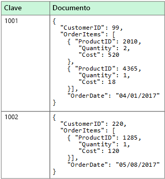
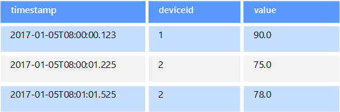
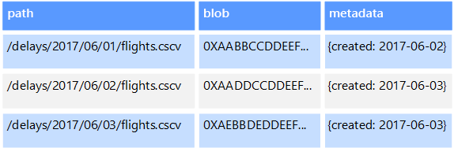
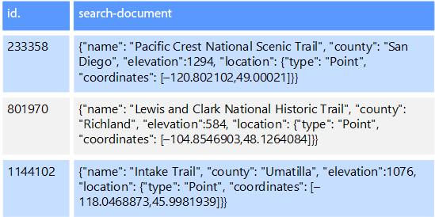

# Datos no relacionales y NoSQL

Una *base de datos no relacional* es aquella que no usa el esquema tabular de filas y columnas que se encuentra en la mayoría de los sistemas de base de datos más tradicionales. En su lugar, las bases de datos no relacionales usan un modelo de almacenamiento que está optimizado para los requisitos específicos del tipo de datos que se almacena. Por ejemplo, los datos se pueden almacenar como pares clave/valor simple, como documentos JSON o como un grafo que consta de bordes y vértices. 

Lo que todos lo que estos almacenes de datos tienen en común están que no utilizan un [modelo relacional](../relational-data/index.md). Además, tienden a ser más específicos en el tipo de datos que admiten y en cómo se pueden consultar los datos. Por ejemplo, los almacenes de datos de serie temporal tiempo se optimizan para las consultas en secuencias de datos basadas en tiempo, mientras que los almacenes de datos de grafos se optimizan optimizados para explorar las relaciones ponderadas entre entidades. Ninguno de los formatos se generalizaría bien en la tarea de administrar datos transaccionales. 

El término *NoSQL* hace referencia a los almacenes de datos que no usan SQL para las consultas, en su lugar, usan otros lenguajes de programación y construcciones para consultar los datos. En la práctica, "NoSQL" significa "base de datos no relacional", aunque muchas de estas bases de datos admiten consultas compatibles con SQL. Sin embargo, la estrategia de ejecución de consultas subyacente normalmente es de la forma en que una RDBMS tradicional ejecutaría la misma consulta SQL.

En las siguientes secciones se describen las categorías principales de base de datos no relacional o NoSQL.

## Almacenes de datos de documentos
Un almacén de datos de documentos administra un conjunto de campos de cadena con nombre y valores de datos de objeto en una entidad que se conoce como un *documento*. Normalmente, estos almacenes guardan los datos en forma de documentos JSON. Cada valor del campo puede ser un elemento escalar, como un número, o un elemento compuesto, como una lista o una colección de elementos primarios y secundarios. Los datos de los campos de un documento se pueden codificar de varias formas, entre las que se incluyen XML, YAML, JSON, BSON, o incluso se pueden almacenar como texto sin formato. Los campos de los documentos se exponen en el sistema de administración de almacenamiento, lo que permite que una aplicación consulte y filtre los datos mediante el uso de los valores de estos campos.  

Normalmente, un documento contiene todos los datos de una entidad. Los elementos que constituyen una entidad son específicos de la aplicación. Por ejemplo, una entidad puede contener los detalles de un cliente, un pedido o una combinación de ambos. Un solo documento puede contener información que se puede distribuir a través de varias tablas relacionales de un sistema de administración de bases de datos relacionales (RDBMS). Un almacén de documentos no requiere que todos los documentos tengan la misma estructura. Este enfoque de forma libre proporciona gran flexibilidad. Por ejemplo, las aplicaciones pueden almacenar datos diferentes en documentos en respuesta a un cambio en los requisitos empresariales.  

  

La aplicación puede recuperar documentos mediante el uso de la clave del documento. Se trata de un identificador exclusivo del documento, al que a menudo se aplica un algoritmo hash para ayudar a distribuir los datos uniformemente. Algunas bases de datos de documentos crean automáticamente la clave del documento. Otras le permiten especificar un atributo del documento para usarlo como clave. La aplicación también puede consultar documentos según el valor de uno o más campos. Algunas bases de datos de documentos admiten la indexación para facilitar la búsqueda rápida de documentos basándose en uno o más campos indexados.  

Muchas bases de datos de documentos admiten actualizaciones en contexto, lo que permite que una aplicación pueda modificar los valores de campos específicos de un documento sin volver a escribir todo el documento. Las operaciones de lectura y escritura en varios campos de un solo documento son normalmente atómicas.

Servicio de Azure correspondiente:  

- [Azure Cosmos DB](https://azure.microsoft.com/services/cosmos-db/)

## Almacenes de datos en columnas
Un almacén de datos de columnas o de familias de columnas organiza los datos en columnas y filas. En su forma más simple, un almacén de datos de familias de columnas se puede parecer mucho a una base de datos relacional, al menos desde el punto de vista conceptual. La potencia real de una base de datos de la familia de columnas radica en su enfoque desnormalizado para la estructuración de datos dispersos, que viene del enfoque orientado hacia las columnas para el almacenamiento de datos.  

Se puede considerar que un almacén de datos de familias de columnas contiene datos tabulares con filas y columnas, pero las columnas se dividen en grupos conocidos como familias de columnas. Cada familia de columnas contiene un conjunto de columnas que están relacionadas de forma lógica y que normalmente se recuperan o se manipulan como una unidad. Otros datos a los que se accede de forma independiente se pueden almacenar en familias de columnas independientes. En una familia de columnas, se pueden agregar nuevas columnas dinámicamente y las filas se pueden dispersar (es decir, no es necesario que una fila tenga un valor para cada columna). 

El siguiente diagrama muestra un ejemplo con dos familias de columnas, `Identity` y `Contact Info`. Los datos de una entidad individual tienen la misma clave de fila en todas las familias de columnas. Esta estructura, en la que las filas de cualquier objeto dado de una familia de columnas pueden variar dinámicamente, supone una ventaja importante del enfoque de familia de columnas, lo que hace que esta forma de almacén de datos resulte muy adecuada para almacenar datos con esquemas variables.

A diferencia de un almacén de clave/valor o una base de datos de documentos, la mayoría de las bases de datos de familias de columnas almacenan físicamente los datos en el orden de la clave, en lugar de mediante el cálculo de un algoritmo hash. La clave de fila se considera el índice principal y permite el acceso basado en clave a través de una clave específica o un intervalo de claves. Algunas implementaciones permiten crear índices secundarios en columnas concretas de una familia de columnas. Los índices secundarios permiten recuperar datos por el valor de las columnas, en lugar de por la clave de fila.

En el disco, todas las columnas de una familia se almacenan juntas en el mismo archivo, con un número concreto de filas en cada archivo. En el caso de los conjuntos de datos grandes, este enfoque mejora el rendimiento, ya que reduce la cantidad de datos que hay que leer del disco cuando solo se consultan unas pocas columnas conjuntamente a la vez. 

Las operaciones de lectura y escritura de una fila son normalmente atómicas en una única familia de columnas, aunque algunas implementaciones proporcionan atomicidad en toda la fila, lo que abarca varias familias de columnas.

Servicio de Azure correspondiente:  

- [HBase en HDInsight](/azure/hdinsight/hdinsight-hbase-overview)

## Almacenes de datos de clave/valor
Un almacén clave/valor es básicamente una tabla hash grande. Puede asociar cada valor de datos con una clave única y el almacén clave/valor usará esta clave para almacenar los datos mediante el uso de una función hash adecuada. La función hash se selecciona para proporcionar una distribución uniforme de claves hash en el almacenamiento de datos.

La mayoría de los almacenes clave valor solo admiten operaciones simples de consulta, inserción y eliminación. Para modificar un valor (parcial o completamente), una aplicación debe sobrescribir los datos existentes para todo el valor. En la mayoría de las implementaciones, leer o escribir un valor único es una operación atómica. Si el valor es grande, la escritura puede tardar algún tiempo.

Una aplicación puede almacenar datos arbitrarios como un conjunto de valores, aunque algunos almacenes clave/valor imponen límites sobre el tamaño máximo de los valores. Los valores almacenados son opacos para el software del sistema de almacenamiento. La aplicación debe ser la que proporcione e interprete toda información de esquema. Básicamente, los valores son blobs y el almacén clave valor solo recupera o almacena el valor por clave.

Los almacenes de clave/valor están muy optimizados para aplicaciones que realizan búsquedas simples mediante el valor de la clave, o por un intervalo de claves, pero son menos adecuados para aquellos sistemas que necesitan consultar datos en diferentes tablas de claves/valores, como combinar datos de varias tablas. 

Los almacenes de clave/valor tampoco están optimizados para aquellos escenarios en los que es importante la realización de consultas o el filtrado por valores no clave, en lugar de que las búsquedas se realicen basándose solo en claves. Por ejemplo, con una base de datos relacional, puede encontrar un registro mediante el uso de una cláusula WHERE para las filtrar las columnas que no sean clave, pero los almacenes clave/valor normalmente no tienen este tipo de funcionalidad de búsqueda de valores, o si la tienen requiere una lenta exploración de todos los valores.

Un único almacén clave/valor puede ser sumamente escalable, ya que el almacén de datos puede distribuir fácilmente los datos entre varios nodos de máquinas independientes.

Servicios de Azure correspondientes:  
- [API de Azure Cosmos DB Table](/azure/cosmos-db/table-introduction)  
- [Azure Redis Cache](https://azure.microsoft.com/services/cache/)  
- [Azure Table Storage](https://azure.microsoft.com/services/storage/tables/)

## Almacenes de datos de grafos
Un almacén de datos de grafos administra dos tipos de información: nodos y bordes. Los nodos representan entidades y los bordes especifican las relaciones entre estas entidades. Los nodos y los bordes pueden tener propiedades que proporcionan información acerca de ese nodo o borde de forma parecida a las columnas de una tabla. Los bordes también pueden tener una dirección que indica la naturaleza de la relación.  

El propósito de un almacén de datos de grafos es permitir a una aplicación realizar consultas de manera eficaz que recorran la red de nodos y bordes y analizar las relaciones entre las entidades. El siguiente diagrama muestra los datos del personal de una organización estructurados en forma de grafo. Las entidades son los empleados y departamentos, y los bordes indican las relaciones jerárquicas y el departamento en el que trabajan los empleados. En este grafo, las flechas de los bordes muestran la dirección de las relaciones.

Esta estructura hace que sea fácil realizar consultas como "buscar todos los empleados que dependen directa o indirectamente de Sarah" o "¿quién trabaja en el mismo departamento que John?". Para grafos de gran tamaño con una gran cantidad de entidades y relaciones, puede realizar análisis muy complejos de forma muy rápida. Muchas bases de datos de grafos proporcionan un lenguaje de consulta que puede usar para recorrer una red de relaciones de forma eficaz.  

Servicio de Azure correspondiente:  
- [Graph API de Azure Cosmos DB](/azure/cosmos-db/graph-introduction)  

## Almacenes de datos de series temporales
Los datos de series temporales son un conjunto de valores organizados por tiempo, y un almacén de datos de está optimizado para este tipo de datos. Los almacenes de datos de series temporales deben admitir un número muy elevado de operaciones de escritura, ya que suelen recopilar grandes cantidades de datos en tiempo real de un gran número de orígenes. Los almacenes de datos de series temporales están optimizados para almacenar datos de telemetría. Los escenarios incluyen sensores de IoT o contadores de sistemas y aplicaciones. Las actualizaciones son poco frecuentes y las eliminaciones se realizan a menudo como operaciones masivas.

Aunque los registros que se escriben en una base de datos de series temporales suelen ser pequeños, a menudo hay un gran número de registros y el tamaño total de los datos puede crecer rápidamente. Los almacenes de datos de series temporales también controlan los datos que llegan tarde y sin orden, la indexación automática de los puntos de datos y las optimizaciones para las consultas que se describen en términos de ventanas de tiempo. Esta última característica permite a las consultas ejecutarse rápidamente en millones de puntos de datos y varios flujos de datos, con el fin de admitir visualizaciones de series temporales, que es una forma habitual de consumir los datos de las series temporales. 

Para más información, consulte [Soluciones de serie temporal](../scenarios/time-series.md)

Servicio de Azure correspondiente:  
- [Azure Time Series Insights](https://azure.microsoft.com/services/time-series-insights/)  
- [OpenTSDB con HBase en HDInsight](/azure/hdinsight/hdinsight-hbase-overview)

## Almacenes de datos de objetos
El almacenamiento de objetos está optimizados para almacenar y recuperar objetos binarios grandes o blobs como imágenes, archivos, transmisiones de vídeo y audio, objetos de datos de aplicación de gran tamaño, documentos e imágenes de disco de máquina virtual. Un objeto se compone de los datos almacenados, algunos metadatos y un identificador único para acceder a él. Los almacenes de objetos están diseñados para admitir archivos que son individualmente muy grandes, así como para proporcionar grandes cantidad de almacenamiento total para administrar todos los archivos.  

Algunos almacenes de datos de objetos replican un blob determinado en varios nodos de servidor, lo que permite rápidas lecturas en paralelo. Esto, a su vez, permite la consulta de la escalabilidad horizontal de los datos contenidos en archivos grandes, ya que varios procesos, que normalmente se ejecutan en servidores diferentes, pueden consultar el archivo de datos grande al mismo tiempo.

Un caso especial de almacenes de datos de objetos es el recurso compartido de archivos de red. El uso de recursos compartidos de archivos permite que se acceda a los archivos a través de una red mediante protocolos de red estándar como el protocolo SMB (Bloque de mensajes del servidor). Con los mecanismos de control de acceso concurrente y de seguridad apropiados, el uso compartido de datos de esta forma puede permitir a los servicios distribuidos proporcionar un acceso altamente escalable a los datos para realizar operaciones básicas, de bajo nivel, como solicitudes sencillas de lectura y escritura.

Servicio de Azure correspondiente:   

- [Azure Blob Storage](https://azure.microsoft.com/services/storage/blobs/)  
- [Azure Data Lake Store](https://azure.microsoft.com/services/data-lake-store/)  
- [Azure File Storage](https://azure.microsoft.com/services/storage/files/)  

## Almacenes de datos de índice externo

Los almacenes de datos de índice externo proporcionan la capacidad de buscar información que se encuentra en otros almacenes de datos y servicios. Un índice externo actúa como un índice secundario de cualquier almacén de datos y puede utilizarse para indexar grandes volúmenes de datos y proporcionar acceso casi en tiempo real acceso a ellos. 

Por ejemplo, pueden almacenarse archivos de texto en un sistema de archivos. La búsqueda de un archivo por su ruta de acceso es rápida, pero si dicha búsquedas se realizara en el contenido del archivo requeriría un examen de todos los archivos, lo que resulta muy lento. Un índice externo le permite crear índices de búsqueda secundarios y, después, encontrar rápidamente la ruta de acceso a los archivos que coincidan con los criterios. Otra aplicación de ejemplo de un índice externo es con los almacenes de clave/valor que solo indexan por la clave. Puede crear un índice secundario con los valores de los datos y consultar rápidamente la clave que identifica de forma única todos los elementos que coinciden. 

Los índices se crean mediante la ejecución de un proceso de indexación. Dicho proceso se puede realizar mediante un modelo de extracción, desencadenado por el almacén de datos, o mediante un modelo de inserción, iniciado por el código de la aplicación. Los índices pueden ser multidimensionales y pueden admitir búsquedas de texto libre en grandes volúmenes de datos de texto. 

Los almacenes de datos de índice externo a menudo se utilizan para admitir la búsqueda de texto completo y basada en web. En estos casos, la búsqueda puede ser exacta o aproximada. Una búsqueda aproximada busca documentos que coinciden con un conjunto de términos y calcula el grado de coincidencia. Algunos índices externos también admiten el análisis lingüístico, que puede devolver coincidencias basadas en sinónimos, expansiones de género (por ejemplo, la coincidencia de "perros" y "mascotas") y lematización (por ejemplo, la búsqueda de "sol" también encuentra como coincidencia "sal" y "solera"). 

Servicio de Azure correspondiente:  

- [Azure Search](https://azure.microsoft.com/services/search/)

## Requisitos típicos
Los almacenes de datos no relacionales a menudo usan una arquitectura de almacenamiento diferente de la que utilizan las bases de datos relacionales. En concreto, que tienden a no tener esquema fijo. También tienden a no admitir transacciones, o bien a restringir el ámbito de las transacciones, y generalmente no incluyen índices secundarios por motivos de escalabilidad.

A continuación, se comparan los requisitos de cada uno de los almacenes de datos no relacionales:

| Requisito | Datos de documento | Datos de familia de columnas | Datos de clave/valor | Datos de grafo | 
| --- | --- | --- | --- | --- | 
| Normalización | Desnormalizado | Desnormalizado | Desnormalizado | Normalizado | 
| Esquema | Esquema de lectura | Familias de columna definidas en la escritura, el esquema de columna en la lectura | Esquema de lectura | Esquema de lectura | 
| Coherencia (en las transacciones simultáneas) | Coherencia ajustable, garantías a nivel de documento | Garantías a nivel de&ndash;familia de columnas | Garantías a nivel de clave | Garantías a nivel de grafo 
| Atomicidad (ámbito de transacción) | Colección | Tabla | Tabla | Grafo | 
| Estrategia de bloqueo | Optimista (bloqueo libre) | Pesimista (bloqueos de filas) | Optimista (ETag) | 
| Patrón de acceso | Acceso aleatorio | Agregados en datos en formato ancho y en formato largo | Acceso aleatorio | Acceso aleatorio |
| Indización | Índices principales y secundarios | Índices principales y secundarios | Solo índice principal | Índices principales y secundarios | 
| Forma de los datos | Documento | Tabular con familias de columnas que contienen columnas | Clave y valor | Grafo que contiene bordes y vértices | 
| Dispersos | Sí | Sí | Sí | Sin  | 
| Ancho (muchas columnas y atributos) | Sí | Sí | Sin  | Sin  |  
| Tamaño de los datos | Pequeño (KB) a mediano (pocos MB) | Mediano (MB) a grande (pocos GB) | Pequeño (KB) | Pequeño (KB) | 
| Escala máxima global | Muy grande (PB) | Muy grande (PB) | Muy grande (PB) | Grande (TB) | 

| Requisito | Datos de serie temporal | Datos de objeto | Datos de índice externo |
| --- | --- | --- | --- |
| Normalización | Normalizado | Desnormalizado | Desnormalizado |
| Esquema | Esquema de lectura | Esquema de lectura | Esquema de escritura | 
| Coherencia (en las transacciones simultáneas) | N/D | N/D | N/D | 
| Atomicidad (ámbito de transacción) | N/D | Objeto | N/D |
| Estrategia de bloqueo | N/D | Pesimista (bloqueos de blob) | N/D |
| Patrón de acceso | Agregación y acceso aleatorio | Acceso secuencial | Acceso aleatorio | 
| Indización | Índices principales y secundarios | Solo índice principal | N/D |
| Forma de los datos | Tabular | Blob y metadatos | Documento |
| Dispersos | Sin  | N/D | Sin  | 
| Ancho (muchas columnas y atributos) |  Sin  | Sí | Sí |  
| Tamaño de los datos | Pequeño (KB) | Grande (GB) a muy grande (TB) | Pequeño (KB) |
| Escala máxima global | Grande (pocos TB)  | Muy grande (PB) | Grande (pocos TB) | 

