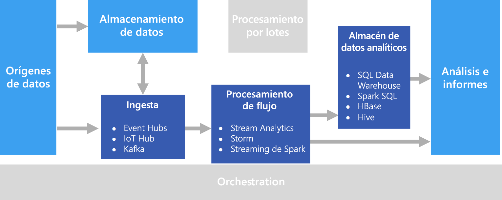

# Procesamiento en tiempo real

El procesamiento en tiempo real trabaja con flujos de datos que se capturan en tiempo real y se procesan con una latencia mínima para generar informes en tiempo real (o casi en tiempo real), o respuestas automatizadas. Por ejemplo, una solución de supervisión del tráfico en tiempo real podría usar datos de sensores para detectar volúmenes de tráfico elevados. Estos datos se pueden utilizar para actualizar dinámicamente un mapa que muestre los atascos o para poner en marcha automáticamente carriles para vehículos con más de un pasajero u otros sistemas de administración de tráfico.

El procesamiento en tiempo real se define como el procesamiento de flujos no asociados de datos de entrada, con requisitos de latencia muy cortos para el procesamiento, que se miden en milisegundos o segundos. Estos datos de entrada normalmente llegan en un formato no estructurado o semiestructurado, como JSON, y tienen los mismos requisitos de procesamiento que el [procesamiento por lotes](./batch-processing.md), pero con tiempos de respuesta más cortos para admitir el consumo en tiempo real.

Los datos procesados a menudo se escriben en un almacén de datos analíticos que está optimizado para el análisis y la visualización. Los datos procesados también se pueden ingerir directamente en el nivel de análisis y de informes para el análisis, la inteligencia empresarial y la visualización de paneles en tiempo real.

## Desafíos

Uno de los grandes desafíos de las soluciones de procesamiento en tiempo real es ingerir, procesar y almacenar mensajes en tiempo real y en grandes volúmenes. El procesamiento se debe realizar de tal forma que no bloquee la canalización de ingesta. El almacén de datos debe admitir la escritura de grandes volúmenes. Otro desafío es poder actuar sobre los datos rápidamente para, por ejemplo, generar alertas en tiempo real o presentar los datos en un panel en tiempo real (o casi en tiempo real).

## Arquitectura

Una arquitectura de procesamiento en tiempo real tiene los siguientes componentes lógicos.

- **Ingesta de mensajes en tiempo real**. La arquitectura debe incluir una manera de capturar y almacenar los mensajes en tiempo real para que los consuma un consumidor de procesamiento de flujos. En los casos más sencillos, este servicio se puede implementar como un almacén de datos simple en el que los mensajes nuevos se depositan en una carpeta. Pero, a menudo, la solución requiere un agente de mensajes, como Azure Event Hubs, que actúa como un búfer para los mensajes. El agente de mensajes debe admitir el procesamiento de escalabilidad horizontal y la entrega confiable.

- **Procesamiento de flujos**. Una vez capturados los mensajes en tiempo real, la solución debe procesarlos filtrando, agregando o bien preparando los datos para su análisis.

- **Almacén de datos analíticos.** Muchas soluciones de macrodatos están diseñadas para preparar los datos para el análisis y luego servir los datos procesados en un formato estructurado que se puede consultar mediante herramientas de análisis. 

- **Análisis e informes.** El objetivo de la mayoría de soluciones de macrodatos consiste en proporcionar información sobre los datos a través de análisis e informes. 

## Opciones de tecnología

Se recomiendan las siguientes tecnologías para soluciones de procesamiento en tiempo real en Azure.

### Ingesta de mensajes en tiempo real

- **Azure Event Hubs**. Azure Event Hubs es una solución de puesta en cola de mensajes para la ingesta de millones de mensajes de eventos por segundo. Varios consumidores en paralelo pueden procesar los datos de eventos capturados.
- **Azure IoT Hub**. Azure IoT Hub proporciona una comunicación bidireccional entre los dispositivos conectados a Internet y una cola de mensajes escalable que puede controlar simultáneamente millones de dispositivos conectados.
- **Apache Kafka**. Kafka es una aplicación de código abierto de puesta en cola de mensajes y procesamiento de flujos que se puede escalar para manejar millones de mensajes por segundo procedentes de varios productores de mensajes y enrutarlos hacia varios consumidores. Kafka está disponible en Azure como un tipo de clúster de HDInsight.

Para más información, consulte [Ingesta de mensajes en tiempo real](../technology-choices/real-time-ingestion.md).

### Almacenamiento de datos

- **Contenedores de blobs de Azure Storage** o **Azure Data Lake Store**. Los datos de entrada en tiempo real normalmente se capturan en un agente de mensajes (consulte más arriba), pero en algunos escenarios puede que tenga sentido supervisar una carpeta para los archivos nuevos y procesarlos a medida que se crean o se actualizan. Además, muchas soluciones de procesamiento en tiempo real combinan los datos de streaming con datos de referencia estáticos que se pueden almacenar en un almacén de archivos. Por último, el almacenamiento de archivos se puede utilizar como destino de salida de datos capturados en tiempo real para el archivado o el procesamiento adicional por lotes en una [arquitectura lambda](../big-data/index.md#lambda-architecture).

Para más información, consulte [Almacenamiento de datos](../technology-choices/data-storage.md).

### Procesamiento de flujos

- **Azure Stream Analytics**. Azure Stream Analytics puede ejecutar consultas perpetuas en un flujo no asociado de datos. Estas consultas consumen flujos de datos procedentes del almacenamiento o de los agentes de mensajes, filtran y agregan los datos basados en períodos temporales, y escriben los resultados en receptores como, por ejemplo, soluciones de almacenamiento, bases de datos o directamente en informes de Power BI. Stream Analytics usa un lenguaje de consulta basado en SQL que admite construcciones temporales y geoespaciales, y que se puede ampliar mediante JavaScript.
- **Storm**. Apache Storm es una plataforma de código abierto para el procesamiento de flujos que usa una topología de spouts y bolts para consumir, procesar y enviar los resultados de orígenes de datos de streaming en tiempo real. Puede aprovisionar Storm en un clúster de Azure HDInsight e implementar una topología en Java o C#.
- **Spark Streaming**. Apache Spark es una plataforma distribuida de código abierto para el procesamiento de datos generales. Spark proporciona la API de Spark Streaming, en la que puede escribir código en cualquier lenguaje de Spark compatible, incluidos Java, Scala y Python. Spark 2.0 introdujo la API de Spark Structured Streaming, que proporciona un modelo de programación más sencillo y coherente. Spark 2.0 está disponible en un clúster de Azure HDInsight.

Para más información, consulte [Procesamiento de flujos](../technology-choices/stream-processing.md).

### Almacén de datos analíticos

- **SQL Data Warehouse**, **HBase**, **Spark** o **Hive**. Los datos procesados en tiempo real se pueden almacenar en una base de datos relacional como Azure SQL Data Warehouse, un almacén NoSQL como Hbase, o como archivos en un almacenamiento distribuido en el que se puedan definir y consultar las tablas de Spark o Hive.

Para más información, consulte [Almacenes de datos analíticos](../technology-choices/analytical-data-stores.md).

### Análisis e informes

- **Azure Analysis Services**, **Power BI**, y **Microsoft Excel**. Los datos procesados en tiempo real que se almacenan en un almacén de datos analíticos se pueden utilizar para realizar informes y análisis históricos de la misma manera que los datos procesados por lotes. Además, Power BI se puede usar para publicar informes y visualizaciones en tiempo real (o casi en tiempo real) desde orígenes de datos analíticos en los que la latencia es lo suficientemente baja o, en algunos casos, directamente desde la salida del procesamiento de flujos.

Para más información, consulte [Análisis e informes](../technology-choices/analysis-visualizations-reporting.md).

En una solución exclusivamente en tiempo real, la mayor parte de la orquestación del procesamiento se administra mediante los componentes de ingesta de mensajes y procesamiento de flujos. Sin embargo, en una arquitectura lambda que combina el procesamiento por lotes y el procesamiento en tiempo real, puede que deba usar una plataforma de orquestación como Azure Data Factory o Apache Oozie y Sqoop para administrar flujos de trabajo por lotes para los datos capturados en tiempo real.

## Pasos siguientes

La siguiente arquitectura de referencia muestra una canalización de procesamiento de flujos de datos de un extremo a otro:

- [Procesamiento de flujos de datos con Azure Stream Analytics](../../reference-architectures/data/stream-processing-stream-analytics.md)