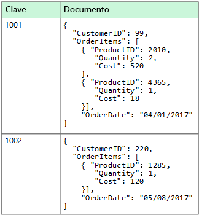
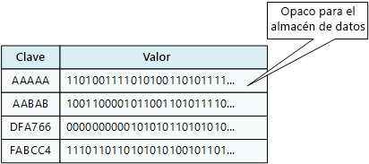
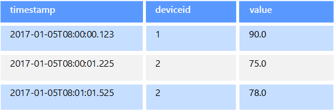
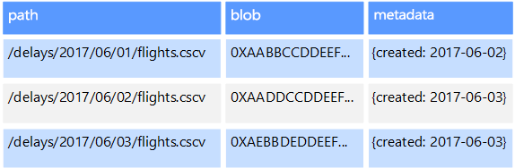

# Datos no relacionales y NoSQLNon-relational data and NoSQL

Una *base de datos no relacional* es aquella que no usa el esquema tabular de filas y columnas que se encuentra en la mayoría de los sistemas de base de datos más tradicionales.A *non-relational database* is a database that does not use the tabular schema of rows and columns found in most traditional database systems. En su lugar, las bases de datos no relacionales usan un modelo de almacenamiento que está optimizado para los requisitos específicos del tipo de datos que se almacena.Instead, non-relational databases use a storage model that is optimized for the specific requirements of the type of data being stored. Por ejemplo, los datos se pueden almacenar como pares clave/valor simple, como documentos JSON o como un grafo que consta de bordes y vértices.For example, data may be stored as simple key/value pairs, as JSON documents, or as a graph consisting of edges and vertices. 

Lo que todos lo que estos almacenes de datos tienen en común están que no utilizan un [modelo relacional](./relational-data.md).What all of these data stores have in common is that they don't use a [relational model](./relational-data.md). Además, tienden a ser más específicos en el tipo de datos que admiten y en cómo se pueden consultar los datos.Also, they tend to be more specific in the type of data they support and how data can be queried. Por ejemplo, los almacenes de datos de serie temporal tiempo se optimizan para las consultas en secuencias de datos basadas en tiempo, mientras que los almacenes de datos de grafos se optimizan optimizados para explorar las relaciones ponderadas entre entidades.For example, time series data stores are optimized for queries over time-based sequences of data, while graph data stores are optimized for exploring weighted relationships between entities. Ninguno de los formatos se generalizaría bien en la tarea de administrar datos transaccionales.Neither format would generalize well to the task of managing transactional data. 

El término *NoSQL* hace referencia a los almacenes de datos que no usan SQL para las consultas, en su lugar, usan otros lenguajes de programación y construcciones para consultar los datos.The term *NoSQL* refers to data stores that do not use SQL for queries, and instead use other programming languages and constructs to query the data. En la práctica, "NoSQL" significa "base de datos no relacional", aunque muchas de estas bases de datos admiten consultas compatibles con SQL.In practice, "NoSQL" means "non-relational database," even though many of these databases do support SQL-compatible queries. Sin embargo, la estrategia de ejecución de consultas subyacente normalmente es de la forma en que una RDBMS tradicional ejecutaría la misma consulta SQL.However, the underlying query execution strategy is usually very different from the way a traditional RDBMS would execute the same SQL query.

En las siguientes secciones se describen las categorías principales de base de datos no relacional o NoSQL.The following sections describe the major categories of non-relational or NoSQL database.

## Almacenes de datos de documentosDocument data stores
Un almacén de datos de documentos administra un conjunto de campos de cadena con nombre y valores de datos de objeto en una entidad que se conoce como un *documento*.A document data store manages a set of named string fields and object data values in an entity referred to as a *document*. Normalmente, estos almacenes guardan los datos en forma de documentos JSON.These data stores typically store data in the form of JSON documents. Cada valor del campo puede ser un elemento escalar, como un número, o un elemento compuesto, como una lista o una colección de elementos primarios y secundarios.Each field value could be a scalar item, such as a number, or a compound element, such as a list or a parent-child collection. Los datos de los campos de un documento se pueden codificar de varias formas, entre las que se incluyen XML, YAML, JSON, BSON, o incluso se pueden almacenar como texto sin formato.The data in the fields of a document can be encoded in a variety of ways, including XML, YAML, JSON, BSON, or even stored as plain text. Los campos de los documentos se exponen en el sistema de administración de almacenamiento, lo que permite que una aplicación consulte y filtre los datos mediante el uso de los valores de estos campos.The fields within documents are exposed to the storage management system, enabling an application to query and filter data by using the values in these fields.  

Normalmente, un documento contiene todos los datos de una entidad.Typically, a document contains the entire data for an entity. Los elementos que constituyen una entidad son específicos de la aplicación.What items constitute an entity are application specific. Por ejemplo, una entidad puede contener los detalles de un cliente, un pedido o una combinación de ambos.For example, an entity could contain the details of a customer, an order, or a combination of both. Un solo documento puede contener información que se puede distribuir a través de varias tablas relacionales de un sistema de administración de bases de datos relacionales (RDBMS).A single document might contain information that would be spread across several relational tables in a relational database management system (RDBMS). Un almacén de documentos no requiere que todos los documentos tengan la misma estructura.A document store does not require that all documents have the same structure. Este enfoque de forma libre proporciona gran flexibilidad.This free-form approach provides a great deal of flexibility. Por ejemplo, las aplicaciones pueden almacenar datos diferentes en documentos en respuesta a un cambio en los requisitos empresariales.For example, applications can store different data in documents in response to a change in business requirements.  

  

La aplicación puede recuperar documentos mediante el uso de la clave del documento.The application can retrieve documents by using the document key. Se trata de un identificador exclusivo del documento, al que a menudo se aplica un algoritmo hash para ayudar a distribuir los datos uniformemente.This is a unique identifier for the document, which is often hashed, to help distribute data evenly. Algunas bases de datos de documentos crean automáticamente la clave del documento.Some document databases create the document key automatically. Otras le permiten especificar un atributo del documento para usarlo como clave.Others enable you to specify an attribute of the document to use as the key. La aplicación también puede consultar documentos según el valor de uno o más campos.The application can also query documents based on the value of one or more fields. Algunas bases de datos de documentos admiten la indexación para facilitar la búsqueda rápida de documentos basándose en uno o más campos indexados.Some document databases support indexing to facilitate fast lookup of documents based on one or more indexed fields.  

Muchas bases de datos de documentos admiten actualizaciones en contexto, lo que permite que una aplicación pueda modificar los valores de campos específicos de un documento sin volver a escribir todo el documento.Many document databases support in-place updates, enabling an application to modify the values of specific fields in a document without rewriting the entire document. Las operaciones de lectura y escritura en varios campos de un solo documento son normalmente atómicas.Read and write operations over multiple fields in a single document are usually atomic.

Servicio de Azure correspondiente:Relevant Azure service:  

- [Azure Cosmos DBAzure Cosmos DB](https://azure.microsoft.com/services/cosmos-db/)

## Almacenes de datos en columnasColumnar data stores
Un almacén de datos de columnas o de familias de columnas organiza los datos en columnas y filas.A columnar or column-family data store organizes data into columns and rows. En su forma más simple, un almacén de datos de familias de columnas se puede parecer mucho a una base de datos relacional, al menos desde el punto de vista conceptual.In its simplest form, a column-family data store can appear very similar to a relational database, at least conceptually. La potencia real de una base de datos de la familia de columnas radica en su enfoque desnormalizado para la estructuración de datos dispersos, que viene del enfoque orientado hacia las columnas para el almacenamiento de datos.The real power of a column-family database lies in its denormalized approach to structuring sparse data, which stems from the column-oriented approach to storing data.  

Se puede considerar que un almacén de datos de familias de columnas contiene datos tabulares con filas y columnas, pero las columnas se dividen en grupos conocidos como familias de columnas.You can think of a column-family data store as holding tabular data with rows and columns, but the columns are divided into groups known as column families. Cada familia de columnas contiene un conjunto de columnas que están relacionadas de forma lógica y que normalmente se recuperan o se manipulan como una unidad.Each column family holds a set of columns that are logically related and are typically retrieved or manipulated as a unit. Otros datos a los que se accede de forma independiente se pueden almacenar en familias de columnas independientes.Other data that is accessed separately can be stored in separate column families. En una familia de columnas, se pueden agregar nuevas columnas dinámicamente y las filas se pueden dispersar (es decir, no es necesario que una fila tenga un valor para cada columna).Within a column family, new columns can be added dynamically, and rows can be sparse (that is, a row doesn't need to have a value for every column). 

El siguiente diagrama muestra un ejemplo con dos familias de columnas, `Identity` y `Contact Info`.The following diagram shows an example with two column families, `Identity` and `Contact Info`. Los datos de una entidad individual tienen la misma clave de fila en todas las familias de columnas.The data for a single entity has the same row key in each column family. Esta estructura, en la que las filas de cualquier objeto dado de una familia de columnas pueden variar dinámicamente, supone una ventaja importante del enfoque de familia de columnas, lo que hace que esta forma de almacén de datos resulte muy adecuada para almacenar datos con esquemas variables.This structure, where the rows for any given object in a column family can vary dynamically, is an important benefit of the column-family approach, making this form of data store highly suited for storing data with varying schemas.

A diferencia de un almacén de clave/valor o una base de datos de documentos, la mayoría de las bases de datos de familias de columnas almacenan físicamente los datos en el orden de la clave, en lugar de mediante el cálculo de un algoritmo hash.Unlike a key/value store or a document database, most column-family databases physically store data in key order, rather than by computing a hash. La clave de fila se considera el índice principal y permite el acceso basado en clave a través de una clave específica o un intervalo de claves.The row key is considered the primary index and enables key-based access via a specific key or a range of keys. Algunas implementaciones permiten crear índices secundarios en columnas concretas de una familia de columnas.Some implementations allow you to create secondary indexes over specific columns in a column family. Los índices secundarios permiten recuperar datos por el valor de las columnas, en lugar de por la clave de fila.Secondary indexes let you retrieve data by columns value, rather than row key.

En el disco, todas las columnas de una familia se almacenan juntas en el mismo archivo, con un número concreto de filas en cada archivo.On disk, all of the columns within a column family are stored together in the same file, with a certain number of rows in each file. En el caso de los conjuntos de datos grandes, este enfoque mejora el rendimiento, ya que reduce la cantidad de datos que hay que leer del disco cuando solo se consultan unas pocas columnas conjuntamente a la vez.With large data sets, this approach creates a performance benefit by reducing the amount of data that needs to be read from disk when only a few columns are queried together at a time. 

Las operaciones de lectura y escritura de una fila son normalmente atómicas en una única familia de columnas, aunque algunas implementaciones proporcionan atomicidad en toda la fila, lo que abarca varias familias de columnas.Read and write operations for a row are usually atomic within a single column family, although some implementations provide atomicity across the entire row, spanning multiple column families.

Servicio de Azure correspondiente:Relevant Azure service:  

- [HBase en HDInsightHBase in HDInsight](/azure/hdinsight/hdinsight-hbase-overview)

## Almacenes de datos de clave/valorKey/value data stores
Un almacén clave/valor es básicamente una tabla hash grande.A key/value store is essentially a large hash table. Puede asociar cada valor de datos con una clave única y el almacén clave/valor usará esta clave para almacenar los datos mediante el uso de una función hash adecuada.You associate each data value with a unique key, and the key/value store uses this key to store the data by using an appropriate hashing function. La función hash se selecciona para proporcionar una distribución uniforme de claves hash en el almacenamiento de datos.The hashing function is selected to provide an even distribution of hashed keys across the data storage.

La mayoría de los almacenes clave valor solo admiten operaciones simples de consulta, inserción y eliminación.Most key/value stores only support simple query, insert, and delete operations. Para modificar un valor (parcial o completamente), una aplicación debe sobrescribir los datos existentes para todo el valor.To modify a value (either partially or completely), an application must overwrite the existing data for the entire value. En la mayoría de las implementaciones, leer o escribir un valor único es una operación atómica.In most implementations, reading or writing a single value is an atomic operation. Si el valor es grande, la escritura puede tardar algún tiempo.If the value is large, writing may take some time.

Una aplicación puede almacenar datos arbitrarios como un conjunto de valores, aunque algunos almacenes clave/valor imponen límites sobre el tamaño máximo de los valores.An application can store arbitrary data as a set of values, although some key/value stores impose limits on the maximum size of values. Los valores almacenados son opacos para el software del sistema de almacenamiento.The stored values are opaque to the storage system software. La aplicación debe ser la que proporcione e interprete toda información de esquema.Any schema information must be provided and interpreted by the application. Básicamente, los valores son blobs y el almacén clave valor solo recupera o almacena el valor por clave.Essentially, values are blobs and the key/value store simply retrieves or stores the value by key.

Los almacenes de clave/valor están muy optimizados para aplicaciones que realizan búsquedas simples mediante el valor de la clave, o por un intervalo de claves, pero son menos adecuados para aquellos sistemas que necesitan consultar datos en diferentes tablas de claves/valores, como combinar datos de varias tablas.Key/value stores are highly optimized for applications performing simple lookups using the value of the key, or by a range of keys, but are less suitable for systems that need to query data across different tables of keys/values, such as joining data across multiple tables. 

Los almacenes de clave/valor tampoco están optimizados para aquellos escenarios en los que es importante la realización de consultas o el filtrado por valores no clave, en lugar de que las búsquedas se realicen basándose solo en claves.Key/value stores are also not optimized for scenarios where querying or filtering by non-key values is important, rather than performing lookups based only on keys. Por ejemplo, con una base de datos relacional, puede encontrar un registro mediante el uso de una cláusula WHERE para las filtrar las columnas que no sean clave, pero los almacenes clave/valor normalmente no tienen este tipo de funcionalidad de búsqueda de valores, o si la tienen requiere una lenta exploración de todos los valores.For example, with a relational database, you can find a record by using a WHERE clause to filter the non-key columns, but key/values stores usually do not have this type of lookup capability for values, or if they do it requires a slow scan of all values.

Un único almacén clave/valor puede ser sumamente escalable, ya que el almacén de datos puede distribuir fácilmente los datos entre varios nodos de máquinas independientes.A single key/value store can be extremely scalable, as the data store can easily distribute data across multiple nodes on separate machines.

Servicios de Azure correspondientes:Relevant Azure services:  
- [API de Azure Cosmos DB TableAzure Cosmos DB Table API](/azure/cosmos-db/table-introduction)  
- [Azure Redis CacheAzure Redis Cache](https://azure.microsoft.com/services/cache/)  
- [Azure Table StorageAzure Table Storage](https://azure.microsoft.com/services/storage/tables/)

## Almacenes de datos de grafosGraph data stores
Un almacén de datos de grafos administra dos tipos de información: nodos y bordes.A graph data store manages two types of information, nodes and edges. Los nodos representan entidades y los bordes especifican las relaciones entre estas entidades.Nodes represent entities, and edges specify the relationships between these entities. Los nodos y los bordes pueden tener propiedades que proporcionan información acerca de ese nodo o borde de forma parecida a las columnas de una tabla.Both nodes and edges can have properties that provide information about that node or edge, similar to columns in a table. Los bordes también pueden tener una dirección que indica la naturaleza de la relación.Edges can also have a direction indicating the nature of the relationship.  

El propósito de un almacén de datos de grafos es permitir a una aplicación realizar consultas de manera eficaz que recorran la red de nodos y bordes y analizar las relaciones entre las entidades.The purpose of a graph data store is to allow an application to efficiently perform queries that traverse the network of nodes and edges, and to analyze the relationships between entities. El siguiente diagrama muestra los datos del personal de una organización estructurados en forma de grafo.The following diagram shows an organization's personnel data structured as a graph. Las entidades son los empleados y departamentos, y los bordes indican las relaciones jerárquicas y el departamento en el que trabajan los empleados.The entities are employees and departments, and the edges indicate reporting relationships and the department in which employees work. En este grafo, las flechas de los bordes muestran la dirección de las relaciones.In this graph, the arrows on the edges show the direction of the relationships.

Esta estructura hace que sea fácil realizar consultas como "buscar todos los empleados que dependen directa o indirectamente de Sarah" o "¿quién trabaja en el mismo departamento que John?".This structure makes it straightforward to perform queries such as "Find all employees who report directly or indirectly to Sarah" or "Who works in the same department as John?" Para grafos de gran tamaño con una gran cantidad de entidades y relaciones, puede realizar análisis muy complejos de forma muy rápida.For large graphs with lots of entities and relationships, you can perform very complex analyses very quickly. Muchas bases de datos de grafos proporcionan un lenguaje de consulta que puede usar para recorrer una red de relaciones de forma eficaz.Many graph databases provide a query language that you can use to traverse a network of relationships efficiently.  

Servicio de Azure correspondiente:Relevant Azure service:  
- [Graph API de Azure Cosmos DBAzure Cosmos DB Graph API](/azure/cosmos-db/graph-introduction)  

## Almacenes de datos de series temporalesTime series data stores
Los datos de series temporales son un conjunto de valores organizados por tiempo, y un almacén de datos de está optimizado para este tipo de datos.Time series data is a set of values organized by time, and a time series data store is optimized for this type of data. Los almacenes de datos de series temporales deben admitir un número muy elevado de operaciones de escritura, ya que suelen recopilar grandes cantidades de datos en tiempo real de un gran número de orígenes.Time series data stores must support a very high number of writes, as they typically collect large amounts of data in real time from a large number of sources. Los almacenes de datos de series temporales están optimizados para almacenar datos de telemetría.Time series data stores are optimized for storing telemetry data. Los escenarios incluyen sensores de IoT o contadores de sistemas y aplicaciones.Scenarios include IoT sensors or application/system counters. Las actualizaciones son poco frecuentes y las eliminaciones se realizan a menudo como operaciones masivas.Updates are rare, and deletes are often done as bulk operations.

Aunque los registros que se escriben en una base de datos de series temporales suelen ser pequeños, a menudo hay un gran número de registros y el tamaño total de los datos puede crecer rápidamente.Although the records written to a time series database are generally small, there are often a large number of records, and total data size can grow rapidly. Los almacenes de datos de series temporales también controlan los datos que llegan tarde y sin orden, la indexación automática de los puntos de datos y las optimizaciones para las consultas que se describen en términos de ventanas de tiempo.Time series data stores also handle out-of-order and late-arriving data, automatic indexing of data points, and optimizations for queries described in terms of windows of time. Esta última característica permite a las consultas ejecutarse rápidamente en millones de puntos de datos y varios flujos de datos, con el fin de admitir visualizaciones de series temporales, que es una forma habitual de consumir los datos de las series temporales.This last feature enables queries to run across millions of data points and multiple data streams quickly, in order to support time series visualizations, which is a common way that time series data is consumed. 

Para más información, consulte [Soluciones de serie temporal](../scenarios/time-series.md)For more information, see [Time series solutions](../scenarios/time-series.md)

Servicio de Azure correspondiente:Relevant Azure service:  
- [Azure Time Series InsightsAzure Time Series Insights](https://azure.microsoft.com/services/time-series-insights/)  
- [OpenTSDB con HBase en HDInsightOpenTSDB with HBase on HDInsight](/azure/hdinsight/hdinsight-hbase-overview)

## Almacenes de datos de objetosObject data stores
El almacenamiento de objetos está optimizados para almacenar y recuperar objetos binarios grandes o blobs como imágenes, archivos, transmisiones de vídeo y audio, objetos de datos de aplicación de gran tamaño, documentos e imágenes de disco de máquina virtual.Object data stores are optimized for storing and retrieving large binary objects or blobs such as images, text files, video and audio streams, large application data objects and documents, and virtual machine disk images. Un objeto se compone de los datos almacenados, algunos metadatos y un identificador único para acceder a él.An object consists of the stored data, some metadata, and a unique ID for accessing the object. Los almacenes de objetos están diseñados para admitir archivos que son individualmente muy grandes, así como para proporcionar grandes cantidad de almacenamiento total para administrar todos los archivos.Object stores are designed to support files that are individually very large, as well provide large amounts of total storage to manage all files.  

Algunos almacenes de datos de objetos replican un blob determinado en varios nodos de servidor, lo que permite rápidas lecturas en paralelo.Some object data stores replicate a given blob across multiple server nodes, which enables fast parallel reads. Esto, a su vez, permite la consulta de la escalabilidad horizontal de los datos contenidos en archivos grandes, ya que varios procesos, que normalmente se ejecutan en servidores diferentes, pueden consultar el archivo de datos grande al mismo tiempo.This in turn enables the scale-out querying of data contained in large files, because multiple processes, typically running on different servers, can each query the large data file simultaneously.

Un caso especial de almacenes de datos de objetos es el recurso compartido de archivos de red.One special case of object data stores is the network file share. El uso de recursos compartidos de archivos permite que se acceda a los archivos a través de una red mediante protocolos de red estándar como el protocolo SMB (Bloque de mensajes del servidor).Using file shares enables files to be accessed across a network using standard networking protocols like server message block (SMB). Con los mecanismos de control de acceso concurrente y de seguridad apropiados, el uso compartido de datos de esta forma puede permitir a los servicios distribuidos proporcionar un acceso altamente escalable a los datos para realizar operaciones básicas, de bajo nivel, como solicitudes sencillas de lectura y escritura.Given appropriate security and concurrent access control mechanisms, sharing data in this way can enable distributed services to provide highly scalable data access for basic, low level operations such as simple read and write requests.

Servicio de Azure correspondiente:Relevant Azure service:   

- [Azure Blob StorageAzure Blob Storage](https://azure.microsoft.com/services/storage/blobs/)  
- [Azure Data Lake StoreAzure Data Lake Store](https://azure.microsoft.com/services/data-lake-store/)  
- [Azure File StorageAzure File Storage](https://azure.microsoft.com/services/storage/files/)  

## Almacenes de datos de índice externoExternal index data stores

Los almacenes de datos de índice externo proporcionan la capacidad de buscar información que se encuentra en otros almacenes de datos y servicios.External index data stores provide the ability to search for information held in other data stores and services. Un índice externo actúa como un índice secundario de cualquier almacén de datos y puede utilizarse para indexar grandes volúmenes de datos y proporcionar acceso casi en tiempo real acceso a ellos.An external index acts as a secondary index for any data store, and can be used to index massive volumes of data and provide near real-time access to these indexes. 

Por ejemplo, pueden almacenarse archivos de texto en un sistema de archivos.For example, you might have text files stored in a file system. La búsqueda de un archivo por su ruta de acceso es rápida, pero si dicha búsquedas se realizara en el contenido del archivo requeriría un examen de todos los archivos, lo que resulta muy lento.Finding a file by its file path is quick, but searching based on the contents of the file would require a scan of all of the files, which is slow. Un índice externo le permite crear índices de búsqueda secundarios y, después, encontrar rápidamente la ruta de acceso a los archivos que coincidan con los criterios.An external index lets you create secondary search indexes and then quickly find the path to the files that match your criteria. Otra aplicación de ejemplo de un índice externo es con los almacenes de clave/valor que solo indexan por la clave.Another example application of an external index is with key/value stores that only index by the key. Puede crear un índice secundario con los valores de los datos y consultar rápidamente la clave que identifica de forma única todos los elementos que coinciden.You can build a secondary index based on the values in the data, and quickly look up the key that uniquely identifies each matched item. 

Los índices se crean mediante la ejecución de un proceso de indexación.The indexes are created by running an indexing process. Dicho proceso se puede realizar mediante un modelo de extracción, desencadenado por el almacén de datos, o mediante un modelo de inserción, iniciado por el código de la aplicación.This can be performed using a pull model, triggered by the data store, or using a push model, initiated by application code. Los índices pueden ser multidimensionales y pueden admitir búsquedas de texto libre en grandes volúmenes de datos de texto.Indexes can be multidimensional and may support free-text searches across large volumes of text data. 

Los almacenes de datos de índice externo a menudo se utilizan para admitir la búsqueda de texto completo y basada en web.External index data stores are often used to support full text and web based search. En estos casos, la búsqueda puede ser exacta o aproximada.In these cases, searching can be exact or fuzzy. Una búsqueda aproximada busca documentos que coinciden con un conjunto de términos y calcula el grado de coincidencia.A fuzzy search finds documents that match a set of terms and calculates how closely they match. Algunos índices externos también admiten el análisis lingüístico, que puede devolver coincidencias basadas en sinónimos, expansiones de género (por ejemplo, la coincidencia de "perros" y "mascotas") y lematización (por ejemplo, la búsqueda de "sol" también encuentra como coincidencia "sal" y "solera").Some external indexes also support linguistic analysis that can return matches based on synonyms, genre expansions (for example, matching "dogs" to "pets"), and stemming (for example, searching for "run" also matches "ran" and "running"). 

Servicio de Azure correspondiente:Relevant Azure service:  

- [Azure SearchAzure Search](https://azure.microsoft.com/services/search/)

## Requisitos típicosTypical requirements
Los almacenes de datos no relacionales a menudo usan una arquitectura de almacenamiento diferente de la que utilizan las bases de datos relacionales.Non-relational data stores often use a different storage architecture from that used by relational databases. En concreto, que tienden a no tener esquema fijo.Specifically, they tend towards having no fixed schema. También tienden a no admitir transacciones, o bien a restringir el ámbito de las transacciones, y generalmente no incluyen índices secundarios por motivos de escalabilidad.Also, they tend not to support transactions, or else restrict the scope of transactions, and they generally don't include secondary indexes for scalability reasons.

A continuación, se comparan los requisitos de cada uno de los almacenes de datos no relacionales:The following compares the requirements for each of the non-relational data stores:

| RequisitoRequirement | Datos de documentoDocument data | Datos de familia de columnasColumn-family data | Datos de clave/valorKey/value data | Datos de grafoGraph data | 
| --- | --- | --- | --- | --- | 
| NormalizaciónNormalization | DesnormalizadoDenormalized | DesnormalizadoDenormalized | DesnormalizadoDenormalized | NormalizadoNormalized | 
| EsquemaSchema | Esquema de lecturaSchema on read | Familias de columna definidas en la escritura, el esquema de columna en la lecturaColumn families defined on write, column schema on read | Esquema de lecturaSchema on read | Esquema de lecturaSchema on read | 
| Coherencia (en las transacciones simultáneas)Consistency (across concurrent transactions) | Coherencia ajustable, garantías a nivel de documentoTunable consistency, document-level guarantees | Garantías a nivel de&ndash;familia de columnasColumn-family&ndash;level guarantees | Garantías a nivel de claveKey-level guarantees | Garantías a nivel de grafoGraph-level guarantees 
| Atomicidad (ámbito de transacción)Atomicity (transaction scope) | ColecciónCollection | TablaTable | TablaTable | GrafoGraph | 
| Estrategia de bloqueoLocking Strategy | Optimista (bloqueo libre)Optimistic (lock free) | Pesimista (bloqueos de filas)Pessimistic (row locks) | Optimista (ETag)Optimistic (ETag) | 
| Patrón de accesoAccess pattern | Acceso aleatorioRandom access | Agregados en datos en formato ancho y en formato largoAggregates on tall/wide data | Acceso aleatorioRandom access | Acceso aleatorioRandom access |
| IndizaciónIndexing | Índices principales y secundariosPrimary and secondary indexes | Índices principales y secundariosPrimary and secondary indexes | Solo índice principalPrimary index only | Índices principales y secundariosPrimary and secondary indexes | 
| Forma de los datosData shape | DocumentoDocument | Tabular con familias de columnas que contienen columnasTabular with column families containing columns | Clave y valorKey and value | Grafo que contiene bordes y vérticesGraph containing edges and vertices | 
| DispersosSparse | SíYes | SíYes | SíYes | Sin No | 
| Ancho (muchas columnas y atributos)Wide (lots of columns/attributes) | SíYes | SíYes | Sin No | Sin No |  
| Tamaño de los datosDatum size | Pequeño (KB) a mediano (pocos MB)Small (KBs) to medium (low MBs) | Mediano (MB) a grande (pocos GB)Medium (MBs) to Large (low GBs) | Pequeño (KB)Small (KBs) | Pequeño (KB)Small (KBs) | 
| Escala máxima globalOverall Maximum Scale | Muy grande (PB)Very Large (PBs) | Muy grande (PB)Very Large (PBs) | Muy grande (PB)Very Large (PBs) | Grande (TB)Large (TBs) | 

| RequisitoRequirement | Datos de serie temporalTime series data | Datos de objetoObject data | Datos de índice externoExternal index data |
| --- | --- | --- | --- |
| NormalizaciónNormalization | NormalizadoNormalized | DesnormalizadoDenormalized | DesnormalizadoDenormalized |
| EsquemaSchema | Esquema de lecturaSchema on read | Esquema de lecturaSchema on read | Esquema de escrituraSchema on write | 
| Coherencia (en las transacciones simultáneas)Consistency (across concurrent transactions) | N/DN/A | N/DN/A | N/DN/A | 
| Atomicidad (ámbito de transacción)Atomicity (transaction scope) | N/DN/A | ObjetoObject | N/DN/A |
| Estrategia de bloqueoLocking Strategy | N/DN/A | Pesimista (bloqueos de blob)Pessimistic (blob locks) | N/DN/A |
| Patrón de accesoAccess pattern | Agregación y acceso aleatorioRandom access and aggregation | Acceso secuencialSequential access | Acceso aleatorioRandom access | 
| IndizaciónIndexing | Índices principales y secundariosPrimary and secondary indexes | Solo índice principalPrimary index only | N/DN/A |
| Forma de los datosData shape | TabularTabular | Blob y metadatosBlob and metadata | DocumentoDocument |
| DispersosSparse | Sin No | N/DN/A | Sin No | 
| Ancho (muchas columnas y atributos)Wide (lots of columns/attributes) |  Sin No | SíYes | SíYes |  
| Tamaño de los datosDatum size | Pequeño (KB)Small (KBs) | Grande (GB) a muy grande (TB)Large (GBs) to Very Large (TBs) | Pequeño (KB)Small (KBs) |
| Escala máxima globalOverall Maximum Scale | Grande (pocos TB)Large (low TBs)  | Muy grande (PB)Very Large (PBs) | Grande (pocos TB)Large (low TBs) | 

