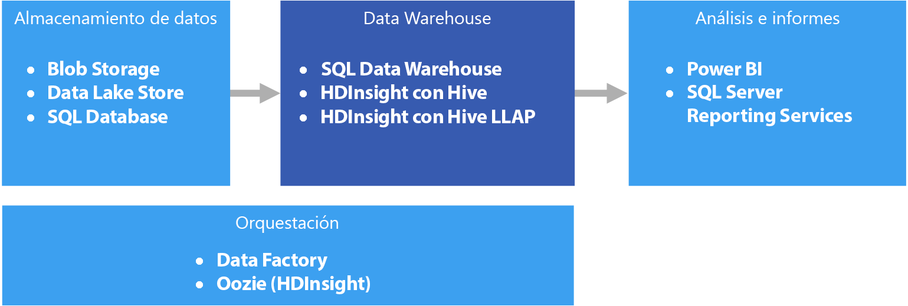

# Almacenamiento de datos y data marts

Un almacenamiento de datos es un repositorio central, empresarial y relacional de datos integrados procedentes de uno o más orígenes dispares que incluye muchas o todas las áreas temáticas. Los almacenamientos de datos almacenan datos históricos y actuales, y se utilizan para realizar informes y análisis de los datos de diferentes maneras.

Para pasar los datos a un almacenamiento de datos, estos se extraen de forma periódica de diversos orígenes que contienen información empresarial de importancia. Cuando se mueven los datos se puede dar formato, limpiar, validar, resumir y reorganizar. Como alternativa, los datos pueden almacenarse en el nivel más bajo de detalle, con vistas agregadas proporcionadas por el almacenamiento de datos para realizar informes. En cualquier caso, el almacenamiento de datos se convierte en un espacio de almacenamiento permanente de los datos utilizados en informes, en el análisis y en la toma de decisiones empresariales importantes mediante herramientas de inteligencia empresarial (BI).

## Data marts y almacenes de datos operativos

La administración de datos a escala es compleja y cada vez es menos habitual tener un almacenamiento de datos único que representa todos los datos de toda la empresa. En su lugar, las organizaciones crean almacenamientos de datos más pequeños y concretos llamados *data marts*, que exponen los datos deseados con fines de análisis. Un proceso de orquestación rellena los data marts con datos que se mantienen en un almacén de datos de tipo operativo. El almacén de datos de tipo operativo actúa como intermediario entre el sistema transaccional de origen y el data mart. Los datos administrados por el almacén de datos operativo son una versión limpia de los datos presentes en el sistema transaccional de origen y normalmente son un subconjunto de los datos históricos mantenidos por el almacenamiento de datos o el data mart. 

## Cuándo se debe utilizar esta solución

Elija un almacenamiento de datos cuando necesite convertir grandes cantidades de datos procedentes de los sistemas operacionales a un formato que sea fácil de entender, actual y preciso. No es necesario que los almacenamientos de datos sigan la misma estructura de datos simplificada utilizada en las bases de datos operativas y de OLTP. Puede usar nombres de columna que tengan sentido para los analistas y los usuarios empresariales, reestructurar el esquema para simplificar las relaciones de datos y consolidar varias tablas en una. Estos pasos ayudan a guiar a los usuarios que necesitan crear informes ad hoc o crear informes y analizar los datos en sistemas de BI, sin la ayuda de un administrador de bases de datos (DBA) o desarrollador de datos.

Considere el uso de un almacenamiento de datos cuando necesite separar los datos históricos de los sistemas transaccionales de origen por motivos de rendimiento. Los almacenamientos de datos facilitan el acceso a los datos históricos desde varias ubicaciones, proporcionando una ubicación centralizada con formatos comunes, claves comunes, modelos de datos comunes y métodos de acceso comunes.

Los almacenamientos de datos están optimizados para el acceso de lectura, lo que produce una generación de informes más rápida en comparación con la ejecución de informes en el sistema transaccional de origen. Además, los almacenamientos de datos proporcionan las siguientes ventajas:

* Es posible almacenar y acceder a todos los datos históricos procedentes de varios orígenes desde un almacenamiento de datos como origen único.
* Puede mejorar la calidad de datos al limpiar estos conforme se importan en el almacenamiento de datos, obteniendo datos más precisos, además de proporcionar descripciones y códigos coherentes.
* Las herramientas de informes no entran en conflicto con los sistemas transaccionales de origen debido a los ciclos de procesamiento de las consultas. Un almacenamiento de datos permite que el sistema transaccional se centre principalmente en el control de las escrituras, mientras que el almacenamiento de datos atiende la mayoría de las solicitudes de lectura.
* Un almacenamiento de datos puede ayudar a consolidar los datos procedentes de software diferentes.
* Las herramientas de minería de datos pueden ayudarle a identificar patrones ocultos mediante metodologías automáticas sobre los datos del almacenamiento.
* Un almacenamiento de datos hace que sea más fácil proporcionar acceso seguro a los usuarios autorizados y restringir el acceso a otros usuarios. No es necesario conceder a los usuarios empresariales acceso a los datos de origen, lo que elimina un vector de ataque potencial contra uno o varios sistemas transaccionales de producción.
* Los almacenamientos de datos hacen que sea más fácil crear soluciones de inteligencia empresarial sobre los datos, como los [cubos OLAP](online-analytical-processing.md).

## Desafíos

Para configurar correctamente un almacenamiento de datos para satisfacer las necesidades de su empresa puede encontrarse algunos de los siguientes desafíos:

* Confirmar el tiempo necesario para modelar correctamente los conceptos del negocio. Se trata de un paso importante, ya que los almacenamientos de datos son controlados por la información y la asignación de conceptos dirige el resto del proyecto. Esto implica la normalización de los términos relacionados con el negocio y el uso de formatos comunes (por ejemplo, la moneda y las fechas) y la reestructuración del esquema de forma que tenga sentido para los usuarios empresariales y al tiempo garantice la precisión de los datos agregados y las relaciones.
* Planificación y configuración de la orquestación de datos. Incluye cómo copiar los datos desde el sistema transaccional de origen al almacenamiento de datos y cuándo se deben mover los datos históricos desde los almacenes de datos operativos al almacenamiento.
* Mantener o mejorar la calidad de los datos mediante la limpieza de los mismos en el momento de su importación en el almacenamiento.

## Almacenamiento de datos en Azure

En Azure, puede tener uno o varios orígenes de datos, ya sea desde las transacciones de los clientes o desde diversas aplicaciones de negocio usadas por varios departamentos. Estos datos se almacenan normalmente en una o varias bases de datos [OLTP](online-transaction-processing.md). Los datos podrían conservarse en otros medios de almacenamiento, como recursos compartidos de red, blobs de Azure Storage o una instancia de Data Lake. Los datos también se pueden almacenar en el propio almacenamiento de datos o en una base de datos relacional como Azure SQL Database. El propósito de la capa de almacenamiento de datos analíticos es satisfacer las consultas emitidas por las herramientas de generación de informes y análisis sobre el almacenamiento de datos o el data mart. En Azure, esta funcionalidad de almacenamiento analítico se puede lograr con Azure SQL Data Warehouse o con Azure HDInsight con Hive o Interactive Query. Además, necesitará cierto nivel de orquestación para mover o copiar los datos del almacén de datos al almacenamiento de datos periódicamente, algo que se puede llevar a cabo mediante Azure Data Factory o Oozie en Azure HDInsight.

Hay varias opciones para la implementación de un almacenamiento de datos en Azure, con el fin de que pueda elegir la que más se ajuste a sus necesidades. Las listas siguientes se dividen en dos categorías: [multiproceso simétrico](https://en.wikipedia.org/wiki/Symmetric_multiprocessing) (SMP) y [procesamiento paralelo masivo](https://en.wikipedia.org/wiki/Massively_parallel) (MPP). 

SMP:

- [Azure SQL Database](/azure/sql-database/)
- [Diagrama de SQL Server en una máquina virtual](/sql/sql-server/sql-server-technical-documentation)

MPP:

- [Azure Data Warehouse](/azure/sql-data-warehouse/sql-data-warehouse-overview-what-is)
- [Apache Hive en HDInsight](/azure/hdinsight/hadoop/hdinsight-use-hive)
- [Interactive Query (Hive LLAP) en HDInsight](/azure/hdinsight/interactive-query/apache-interactive-query-get-started)

Como norma general, los almacenamientos basados en SMP son más adecuados para conjuntos de datos pequeños a medianos (hasta 4-100 TB), mientras que MPP se utiliza a menudo para macrodatos. La delineación entre pequeño/mediano y macrodatos en parte tiene que ver con la infraestructura de soporte y la definición de su organización (consulte [Elección de un almacén de datos de OLTP](online-transaction-processing.md#scalability-capabilities)). 

Más allá de los tamaños de los datos, es probable que el tipo de patrón de la carga de trabajo sea un factor determinante mayor. Por ejemplo, las consultas más complejas pueden ser demasiado lentas para una solución SMP y requerir una solución MPP. Es probable que los sistemas basados en MPP impongan una penalización de rendimiento con tamaños de datos pequeños, debido a la forma en que los trabajos se distribuyen y se consolidan en los nodos. Si el tamaño de los datos ya supera 1 TB y se espera que siga creciendo, considere la posibilidad de elegir una solución MPP. Sin embargo, si el tamaño es menor, pero las cargas de trabajo superan los recursos disponibles de la solución SMP, es posible que MPP sea la mejor opción.

Los datos que el almacenamiento de datos ha guardado, o a los que ha accedido, pueden proceder de varios orígenes de datos, entre los que se incluye un lago de datos, como [Azure Data Lake Store](/azure/data-lake-store/). Para ver una sesión de vídeo en la que se comparan los diversos puntos fuertes de los servicios MPP que pueden usar Azure Data Lake, consulte [Azure Data Lake and Azure Data Warehouse: Applying Modern Practices to Your App](https://azure.microsoft.com/resources/videos/build-2016-azure-data-lake-and-azure-data-warehouse-applying-modern-practices-to-your-app/) (Azure Data Lake y Almacenamiento de datos de Azure: aplicación de prácticas modernas en una aplicación).

Los sistemas SMP se caracterizan por una única instancia de un sistema de administración de bases de datos relacionales que comparte todos los recursos (CPU/memoria/disco). Un sistema SMP se puede escalar verticalmente. En el caso de que SQL Server se ejecute en una máquina virtual, se puede escalar verticalmente el tamaño de la máquina virtual. En el caso de Azure SQL Database, se puede escalar verticalmente seleccionando otro nivel de servicio. 

Los sistemas MPP se pueden escalar horizontalmente mediante la adición de más nodos de proceso (que tienen sus propios subsistemas de CPU, memoria y E/S). Hay limitaciones físicas a la hora de escalar verticalmente un servidor. En ese momento el escalado horizontal es más deseable, en función de la carga de trabajo. Sin embargo, las soluciones MPP requieren un conjunto de habilidades diferente, debido a las variaciones en la consulta, de modelado, creación de particiones de datos y otros factores únicos para el procesamiento en paralelo. 

A la hora de decidir qué solución SMP se va a usar, consulte [Azure SQL Database y SQL Server en Azure Virtual Machines en detalle](/azure/sql-database/sql-database-paas-vs-sql-server-iaas#a-closer-look-at-azure-sql-database-and-sql-server-on-azure-vms). 

Azure SQL Data Warehouse también puede utilizarse para conjuntos de datos pequeños y medianas, donde la carga de trabajo es proceso y la memoria intensiva. Más información acerca de los patrones de SQL Data Warehouse y escenarios comunes:

- [Patrones y antipatrones de SQL Data Warehouse](https://blogs.msdn.microsoft.com/sqlcat/2017/09/05/azure-sql-data-warehouse-workload-patterns-and-anti-patterns/)
- [Azure SQL Data Warehouse loading patterns and strategies](https://blogs.msdn.microsoft.com/sqlcat/2017/05/17/azure-sql-data-warehouse-loading-patterns-and-strategies/) (Patrones y estrategias de carga en Azure SQL Data Warehouse)
- [Migración de datos a Azure SQL Data Warehouse](https://blogs.msdn.microsoft.com/sqlcat/2016/08/18/migrating-data-to-azure-sql-data-warehouse-in-practice/)
- [Patrones comunes de aplicaciones de ISV que usan SQL Data Warehouse](https://blogs.msdn.microsoft.com/sqlcat/2017/09/05/common-isv-application-patterns-using-azure-sql-data-warehouse/)

## Principales criterios de selección

Para restringir las opciones, empiece por responder a estas preguntas:

- ¿Quiere un servicio administrado en lugar de administrar sus propios servidores?

- ¿Trabaja con conjuntos de datos muy grandes o con consultas muy complejas y de larga ejecución? Si es así, considere la posibilidad de usar MPP. 

- En un conjunto de datos grande, ¿es el origen de datos estructurado o no estructurado? Es posible que los datos sin estructura se deban procesar en un entorno de macrodatos como Spark on HDInsight, Azure Databricks, Hive LLAP on HDInsight o Azure Data Lake Analytics. Todos ellos pueden servir como motores ELT (extracción, carga y transformación de datos) y ETL (extracción, transformación y carga de datos). Pueden convertir los datos procesados en los datos estructurados, lo que facilita que su carga en SQL Data Warehouse o en una de las otras opciones. En el caso de los datos estructurados, SQL Data Warehouse tiene un nivel de rendimiento denominado Optimizado para Compute, para las cargas de trabajo con muchos procesos que requieren un rendimiento ultra alto.

- ¿Desea separar los datos históricos de los datos operativos actuales? En ese caso, seleccione una de las opciones en las que se requiera [orquestación](../technology-choices/pipeline-orchestration-data-movement.md). Estos son almacenes independiente optimizados para un acceso de lectura intensivo y son más adecuados como almacén de datos históricos independiente.

- ¿Necesita integrar datos de varios orígenes, más allá de su almacén de datos de OLTP? Si es así, considere la posibilidad de usar opciones que integren fácilmente varios orígenes de datos. 

- ¿Tiene un requisito de multiempresa? En ese caso, SQL Data Warehouse no es ideal para este requisito. Para más información, consulte [Patrones y antipatrones de SQL Data Warehouse](https://blogs.msdn.microsoft.com/sqlcat/2017/09/05/azure-sql-data-warehouse-workload-patterns-and-anti-patterns/).

- ¿Prefiere un almacén de datos relacional? Si es así, limite las opciones a los que tengan un almacén de datos relacional, pero tenga también en cuenta que puede usar una herramienta como PolyBase para consultar los almacenes de datos no relacionales, en caso de que sea necesario. Si decide usar PolyBase, ejecute las pruebas de rendimiento en los conjuntos de datos no estructurados de su carga de trabajo.

- ¿Tiene requisitos de informes en tiempo real? Si requiere cortos tiempos de respuesta a consultas en grandes volúmenes de inserciones singleton, limite las opciones a aquellas que pueden admitir informes en tiempo real.

- ¿Necesita admitir un gran número de usuarios y conexiones simultáneamente? La capacidad para admitir varios usuarios o conexiones simultáneamente depende de varios factores. 

    - En el caso de Azure SQL Database, consulte los [límites de recursos documentados](/azure/sql-database/sql-database-resource-limits) en función de su nivel de servicio. 
    
    - SQL Server permite un máximo de 32 767 conexiones de usuario. Cuando se ejecuta en una máquina virtual, el rendimiento dependerá del tamaño de la máquina virtual y de otros factores. 
    
    - SQL Data Warehouse tiene límites relativos a las consultas simultáneas y a las conexiones simultáneas. Para más información, consulte [Simultaneidad y administración de cargas de trabajo en SQL Data Warehouse](/azure/sql-data-warehouse/sql-data-warehouse-develop-concurrency). Considere la posibilidad de usar servicios complementarios, como [Azure Analysis Services](/azure/analysis-services/analysis-services-overview), para superar los límites de SQL Data Warehouse.

- ¿Qué tipo de carga de trabajo tiene? En general, las soluciones de almacenamiento basado en MPP son más apropiadas para cargas de trabajo de análisis, orientadas al proceso por lotes. Si sus cargas de trabajo son transaccionales por naturaleza y se producen muchas operaciones pequeñas de lectura y escritura, o varias operaciones fila a fila, considere la posibilidad de usar una de las opciones de SMP. Una excepción a esta directriz es cuando se usa el procesamiento de flujos en un clúster de HDInsight, como Spark Streaming, y se almacenan los datos en una tabla de Hive.

## Matriz de funcionalidades

En las tablas siguientes se resumen las diferencias clave en cuanto a funcionalidades.

### Funcionalidades generales

| | Azure SQL Database | SQL Server (máquina virtual) | SQL Data Warehouse | Apache Hive en HDInsight | Hive LLAP en HDInsight |
| --- | --- | --- | --- | --- | --- | -- |
| Es un servicio administrado | Sí | Sin  | Sí | Sí 1 | Sí 1 |
| Requiere la orquestación de datos (contiene una copia de los datos y datos históricos) | Sin  | Sin  | Sí | Sí | Sí |
| Integra fácilmente varios orígenes de datos | Sin  | Sin  | Sí | Sí | Sí |
| Admite la pausa del proceso | Sin  | Sin  | Sí | No 2 | No 2 |
| Almacenes de datos relacionales | Sí | Sí |  Sí | Sin  | Sin  |
| Informes en tiempo real | Sí | Sí | Sin  | Sin  | Sí |
| Puntos de restauración de copia de seguridad flexibles | Sí | Sí | No 3 | Sí 4 | Sí 4 |
| SMP/MPP | SMP | SMP | MPP | MPP | MPP |

[1] Configuración y escalado manuales.

[2] Los clústeres de HDInsight se pueden eliminar cuando no se necesiten y, posteriormente, se pueden volver a crear. Asocie un almacén de datos externo a un clúster para que los datos se conserven cuando se elimine el clúster. Puede utilizar Azure Data Factory para automatizar el ciclo de vida del clúster mediante la creación de un clúster de HDInsight a petición para procesar la carga de trabajo y, después, elimínelo una vez que el procesamiento se haya completado.

[3] Con SQL Data Warehouse puede restaurar una base de datos a cualquier punto de restauración disponible de los últimos siete días. Las instantáneas comienzan cada cuatro a ocho horas y están disponibles durante siete días. Cuando una instantánea tiene una antigüedad superior a siete días, caduca y su punto de restauración ya no está disponible.

[4] Considere la posibilidad de usar una [instancia de Hive Metastore externa](/azure/hdinsight/hdinsight-hadoop-provision-linux-clusters#use-hiveoozie-metastore) de la que se pueda realizar copia de seguridad y que se pueda restaurar cuando sea necesario. Las opciones de copia de seguridad y restauración estándar que se aplican a Blob Storage y Data Lake Store se pueden utilizar para los datos, o bien se pueden usar algunas soluciones de copia de seguridad y restauración de HDInsight de terceros, como [Imanis Data](https://azure.microsoft.com/blog/imanis-data-cloud-migration-backup-for-your-big-data-applications-on-azure-hdinsight/), ya que ofrecen mayor flexibilidad y facilidad de uso.

### Funcionalidades de escalabilidad

| | Azure SQL Database | SQL Server (máquina virtual) |  SQL Data Warehouse | Apache Hive en HDInsight | Hive LLAP en HDInsight |
| --- | --- | --- | --- | --- | --- | -- |
| Servidores regionales redundantes para lograr alta disponibilidad  | Sí | Sí | Sí | Sin  | Sin  |
| Admite escalado horizontal de consultas (consultas distribuidas)  | Sin  | Sin  | Sí | Sí | Sí |
| Escalabilidad dinámica (escalado vertical)  | Sí | Sin  | Sí 1 | Sin  | Sin  |
| Admite el almacenamiento en caché en memoria de datos | Sí |  Sí | Sin  | Sí | Sí |

[1] SQL Data Warehouse le permite realizar el escalado vertical u horizontal ajustando el número de unidades de almacenamiento de datos (DWU). Consulte [Administración de la potencia de proceso en Azure SQL Data Warehouse (información general)](/azure/sql-data-warehouse/sql-data-warehouse-manage-compute-overview).

### Funcionalidades de seguridad

|                         |           Azure SQL Database            |  SQL Server en una máquina virtual  | SQL Data Warehouse |   Apache Hive en HDInsight    |    Hive LLAP en HDInsight     |
|-------------------------|-----------------------------------------|-----------------------------------|--------------------|-------------------------------|-------------------------------|
|     Autenticación      | SQL/Azure Active Directory (Azure AD) | SQL/Azure AD/Active Directory |   SQL/Azure AD   | local/Azure AD 1 | local/Azure AD 1 |
|      Autorización      |                   Sí                   |                Sí                |        Sí         |              Sí              |       Sí 1        |
|        Auditoría         |                   Sí                   |                Sí                |        Sí         |              Sí              |       Sí 1        |
| Cifrado de datos en reposo |            Sí 2             |         Sí 2          |  Sí 2  |       Sí 2        |       Sí 1        |
|   Seguridad de nivel de fila    |                   Sí                   |                Sí                |        Sí         |              Sin                |       Sí 1        |
|   Admite firewalls    |                   Sí                   |                Sí                |        Sí         |              Sí              |       Sí 3        |
|  Enmascaramiento de datos dinámicos   |                   Sí                   |                Sí                |        Sí         |              Sin                |       Sí 1        |

[1] Requiere el uso de un [clúster de HDInsight unido a un dominio](/azure/hdinsight/domain-joined/apache-domain-joined-introduction).

[2] Requiere el uso de cifrado de datos transparente (TDE) para cifrar y descifrar los datos en reposo.

[3] Se admite cuando se [usa en una instancia de Azure Virtual Network](/azure/hdinsight/hdinsight-extend-hadoop-virtual-network).

Más información acerca de cómo proteger un almacenamiento de datos:

* [Protección de SQL Database](/azure/sql-database/sql-database-security-overview#connection-security)
* [Proteger una base de datos en SQL Data Warehouse](/azure/sql-data-warehouse/sql-data-warehouse-overview-manage-security)
* [Extender Azure HDInsight mediante una instancia de Azure Virtual Network](/azure/hdinsight/hdinsight-extend-hadoop-virtual-network)
* [Introducción a la seguridad de Hadoop con clústeres de HDInsight unidos a dominio](/azure/hdinsight/domain-joined/apache-domain-joined-introduction)

