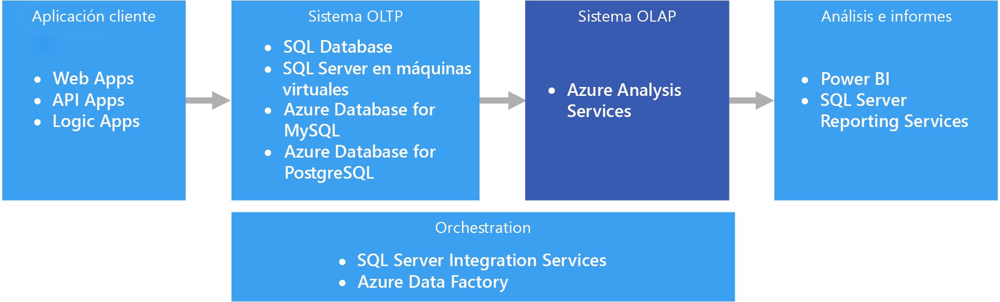
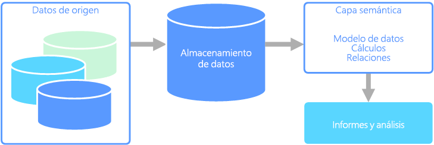

# Procesamiento analítico en línea (OLAP)

El procesamiento analítico en línea (OLAP) es una tecnología que organiza grandes bases de datos empresariales y proporciona análisis complejo. Se puede utilizar para realizar consultas analíticas complejas sin afectar negativamente los sistemas transaccionales.

Las bases de datos que utiliza una empresa para almacenar todas sus transacciones y registros se llaman bases de datos de [procesamiento de transacciones en línea (OLTP)](online-transaction-processing.md). Normalmente, estas bases de datos tienen registros que se introducen uno cada vez. A menudo contienen una gran cantidad de información de valor para la organización. Sin embargo, las bases de datos que se usan para OLTP no se diseñaron para el análisis. Por lo tanto, obtener respuestas de estas bases de datos es costoso en términos de tiempo y esfuerzo. Los sistemas OLAP se han diseñado para ayudar a extraer de los datos esta información de inteligencia empresarial con un alto rendimiento. Esto se debe a que las bases de datos OLAP se optimizan para cargas de trabajo grandes en lecturas y pequeñas en escrituras.

 

## Modelos semánticos

Un modelo de datos semánticos es un modelo conceptual que describe el significado de los elementos de datos que contiene. A menudo, las organizaciones usan sus propios términos, a veces emplean sinónimos o incluso diferentes significados para un mismo término. Por ejemplo, es posible que una base de datos de inventario realice el seguimiento de una pieza de un equipo con un identificador de recurso y un número de serie, mientras que una base de datos de ventas podría hacer referencia al número de serie como el identificador de recurso. No existe una manera sencilla de relacionar estos valores sin un modelo que describa la relación. 

Los modelos semánticos proporcionan un nivel de abstracción sobre el esquema de la base de datos, de forma que los usuarios no necesitan conocer las estructuras de datos subyacentes. Así resulta más fácil para los usuarios finales consultar los datos sin realizar agregados ni uniones sobre el esquema subyacente. Además, normalmente se asignan nombres más descriptivos a las columnas, de forma que el contexto y el significado de los datos resulten más obvios.

Los modelos semánticos se usan predominantemente en escenarios con mucha actividad de lectura, como el análisis y la inteligencia empresarial (OLAP), a diferencia del procesamiento de datos transaccionales (OLTP) con una elevada actividad de escritura. Esto se debe principalmente a la naturaleza de una capa semántica típica:

- Los comportamientos de agregación se establecen para que las herramientas de generación de informes los muestren correctamente.
- Se definen los cálculos y la lógica de negocios.
- Se incluyen cálculos orientados al tiempo.
- Se suelen integrar datos de varios orígenes. 

Tradicionalmente, la capa semántica se coloca sobre un almacenamiento de datos por estos motivos.

Hay dos tipos principales de modelos semánticos:

* **Tabular**. Utiliza construcciones de modelado relacional (modelo, tablas, columnas). Internamente, los metadatos se heredan de construcciones de modelado OLAP (cubos, dimensiones, medidas). El código y los scripts usan metadatos OLAP.
* **Multidimensional**. Usa construcciones de modelado OLAP tradicionales (cubos, dimensiones, medidas).

Servicio de Azure correspondiente:
- [Azure Analysis Services](https://azure.microsoft.com/services/analysis-services/)

## Ejemplo de caso de uso

Una organización tiene datos almacenados en una base de datos grande. Se desea poner estos datos a disposición de clientes y usuarios de negocios para que puedan crear sus propios informes y realizar análisis. Una opción es simplemente dar a dichos usuarios acceso directo a la base de datos. Sin embargo, esta opción tiene varias desventajas, incluida la administración de la seguridad y el control de acceso. Asimismo, el diseño de la base de datos, incluidos los nombres de las tablas y columnas, puede ser difícil de entender para los usuarios. Los usuarios tendrían que saber qué tablas consultar, cómo deberían combinarse esas tablas y conocer otra lógica de negocios que deba aplicarse para obtener los resultados correctos. Además, para empezar, los usuarios deberían conocer un lenguaje de consulta, como SQL. Esto suele provocar que varios usuarios generen informes con las mismas métricas, pero con resultados distintos.

Otra opción consiste en encapsular toda la información que necesitan los usuarios en un modelo semántico. Los usuarios pueden consultar el modelo semántico más fácilmente con la herramienta de generación informes que prefieran. Los datos proporcionados por el modelo semántico se extraen de un almacenamiento de datos, lo que garantiza que todos los usuarios vean una misma versión. El modelo semántico también proporciona nombres descriptivos de tablas y columnas, relaciones entre tablas, descripciones, cálculos y seguridad a nivel de fila.

## Características típicas del modelo semántico

Los modelos semánticos y el procesamiento analítico suelen presentar las siguientes características:

| Requisito | DESCRIPCIÓN |
| --- | --- |
| Esquema | Esquema durante la escritura, altamente aplicado|
| Usa transacciones | Sin  |
| Estrategia de bloqueo | None |
| Actualizable | No (normalmente es necesario recalcular el cubo) |
| Anexable | No (normalmente es necesario recalcular el cubo) |
| Carga de trabajo | Elevada actividad de lectura, solo lectura |
| Indización | Indexación multidimensional |
| Tamaño de los datos | Pequeño a mediano tamaño |
| Modelo | Multidimensional |
| Forma de los datos:| Cubo o esquema de estrella o copo de nieve |
| Flexibilidad de consulta | Muy flexible |
| Escala: | Grande (de decenas a centenares de GB) |

## Cuándo se debe utilizar esta solución

Considere el uso de OLAP en los siguientes escenarios:

- Necesita ejecutar consultas ad hoc y análisis complejos rápidamente, sin afectar negativamente a los sistemas OLTP. 
- Desea proporcionar a los usuarios empresariales una manera sencilla de generar informes a partir de los datos
- Desea proporcionar diversas agregaciones que permitirán a los usuarios obtener resultados rápidos y coherentes. 

OLAP es especialmente útil para aplicar cálculos agregados en grandes cantidades de datos. Los sistemas OLAP están optimizados para escenarios de uso intensivo de lectura, como el análisis y la inteligencia empresarial. OLAP permite a los usuarios dividir datos multidimensionales en segmentos que pueden visualizarse en dos dimensiones (por ejemplo, una tabla dinámica) o filtrar los datos por valores específicos. Este proceso se llama a veces "segmentar y desglosar" los datos y se puede levar a cabo independientemente de si los datos se dividen en varios orígenes de datos. Esto ayuda a los usuarios a encontrar tendencias, detectar patrones y explorar los datos sin tener que conocer los detalles del análisis de datos tradicional.

Los modelos semánticos pueden ayudar a los usuarios empresariales a abstraer las complejidades de las relaciones y facilitan el análisis rápido de los datos.

## Desafíos

A pesar de todas las ventajas que proporcionan los sistemas OLAP, producen algunos desafíos:

- En tanto que los datos en los sistemas OLTP se actualizan constantemente a través de transacciones que fluyen procedentes de diversos orígenes, los almacenes de datos OLAP normalmente se actualizan a intervalos mucho más lentos, en función de las necesidades del negocio. Esto significa que los sistemas OLAP son más adecuados para tomar decisiones empresariales estratégicas, en lugar de dar respuestas inmediatas ante los cambios. Además, se debe planear cierto nivel de limpieza de datos y orquestación para mantener actualizados los almacenes de datos OLAP.
- A diferencia de las tablas tradicionales, normalizadas y relacionales encontradas en los sistemas OLTP, los modelos de datos OLAP suelen ser multidimensionales. Esto hace difícil o imposible la asignación directa a modelos entidad-relación y modelos orientados a objetos, en los que cada atributo se asigna a una columna. Los sistemas OLAP normalmente usan un esquema de estrella o copo de nieve en lugar de la normalización tradicional.

## OLAP en Azure

En Azure, los datos que se mantienen en sistemas OLTP, como Azure SQL Database, se copian en el sistema OLAP, como [Azure Analysis Services](/azure/analysis-services/analysis-services-overview). Las herramientas de exploración y visualización de datos como [Power BI](https://powerbi.microsoft.com), Excel y otras herramientas de terceros se conectan a los servidores de Analysis Services y proporcionan a los usuarios una información interactiva y enriquecida visualmente sobre los datos modelados. El flujo de los datos desde OLTP a OLAP normalmente se orquesta con SQL Server Integration Services, que se puede ejecutar con [Azure Data Factory](/azure/data-factory/concepts-integration-runtime).

En Azure, los almacenes de datos siguientes cumplirán los requisitos principales para OLAP:

- [SQL Server con índices de almacén de columnas](/sql/relational-databases/indexes/get-started-with-columnstore-for-real-time-operational-analytics)
- [Azure Analysis Services](/azure/analysis-services/analysis-services-overview)
- [SQL Server Analysis Services (SSAS)](/sql/analysis-services/analysis-services)

SQL Server Analysis Services (SSAS) ofrece funciones de OLAP y de minería para aplicaciones de inteligencia empresarial. SSAS se puede instalar en servidores locales, o bien se puede hospedar en una máquina virtual en Azure. Azure Analysis Services es un servicio completamente administrado que proporciona las mismas características principales que SSAS. Azure Analysis Services admite la conexión a [varios orígenes de datos](/azure/analysis-services/analysis-services-datasource), que se encuentren tanto en la nube como en el entorno local, de su organización.

Los índices de almacén de columnas en clúster están disponibles en SQL Server 2014, y en las versiones posteriores, así como en Azure SQL Database, y son ideales para cargas de trabajo de OLAP. Sin embargo, a partir de SQL Server 2016 (incluido Azure SQL Database), puede sacar partido del procesamiento transaccional/analítico híbrido (HTAP) mediante el uso de índices de almacén de columnas no agrupados actualizables. HTAP permite realizar el procesamiento de OLTP y OLAP en la misma plataforma, lo que elimina la necesidad de almacenar varias copias de los datos y de tener distintos sistemas de OLTP y OLAP. Para más información, consulte [Introducción al almacén de columnas para análisis operativos en tiempo real](/sql/relational-databases/indexes/get-started-with-columnstore-for-real-time-operational-analytics).

## Principales criterios de selección

Para restringir las opciones, empiece por responder a estas preguntas:

- ¿Quiere un servicio administrado en lugar de administrar sus propios servidores?

- ¿Requiere autenticación segura mediante Azure Active Directory (Azure AD)?

- ¿Desea realizar análisis en tiempo real? En ese caso, limite las opciones a las que admitan análisis en tiempo real. 

    En este contexto, *análisis en tiempo real* se aplica a un origen de datos único, como una aplicación de planificación de recursos empresariales (ERP), que ejecutará una carga de trabajo tanto operativa como de análisis. Si tiene que integrar datos de varios orígenes, o requieren un rendimiento extremo de los análisis mediante el uso de datos previamente agregados, como cubos, puede que necesite un almacén de datos independiente.

- ¿Necesita usar datos previamente agregados, por ejemplo, para proporcionar los modelos semánticos que hacen que los usuarios empresariales entiendan mejor los análisis? En ese caso, elija una opción que admita cubos multidimensionales o modelos semánticos tabulares. 

    El hecho de proporcionar agregados puede ayudar a los usuarios a calcular agregados de datos de forma coherente. Los datos agregados previamente también pueden mejoras significativamente el rendimiento cuando se trabaja con varias columnas en muchas filas. Los datos se pueden agregar previamente en cubos multidimensionales o modelos semánticos tabulares.

- ¿Necesita integrar datos de varios orígenes, más allá de su almacén de datos de OLTP? Si es así, considere la posibilidad de usar opciones que integren fácilmente varios orígenes de datos.

## Matriz de funcionalidades

En las tablas siguientes se resumen las diferencias clave en cuanto a funcionalidades.

### Funcionalidades generales

| | Azure Analysis Services | SQL Server Analysis Services | SQL Server con índices de almacén de columnas | Azure SQL Database con índices de almacén de columnas |
| --- | --- | --- | --- | --- |
| Es un servicio administrado | Sí | Sin  | Sin  | Sí |
| Admite cubos multidimensionales | Sin  | Sí | Sin  | Sin  |
| Admite modelos semánticos tabulares | Sí | Sí | Sin  | Sin  |
| Integra fácilmente varios orígenes de datos | Sí | Sí | No 1 | No 1 |
| Admite análisis en tiempo real | Sin  | Sin  | Sí | Sí |
| Requiere un proceso para copiar los datos de los orígenes | Sí | Sí | Sin  | Sin  |
| Integración de Azure AD | Sí | Sin  | No 2 | Sí |

[1] Aunque SQL Server y Azure SQL Database no se pueden usar para consultar varios orígenes de datos externos, e integrarlos, puede crear una canalización que lo haga automáticamente mediante [SSIS](/sql/integration-services/sql-server-integration-services) o [Azure Data Factory](/azure/data-factory/). SQL Server hospedado en una máquina virtual de Azure tiene opciones adicionales, como los servidores vinculados y [PolyBase](/sql/relational-databases/polybase/polybase-guide). Para más información, consulte [Choosing a data pipeline orchestration technology in Azure](../technology-choices/pipeline-orchestration-data-movement.md) (Elección de una tecnología de orquestación de canalizaciones de datos en Azure).

[2] La conexión a una instancia de SQL Server que se ejecute en Azure Virtual Machine no se admite si se usa una cuenta de Azure AD. Utilice en su lugar una cuenta de Active Directory del dominio.

### Funcionalidades de escalabilidad

|                                                  | Azure Analysis Services | SQL Server Analysis Services | SQL Server con índices de almacén de columnas | Azure SQL Database con índices de almacén de columnas |
|--------------------------------------------------|-------------------------|------------------------------|-------------------------------------|---------------------------------------------|
| Servidores regionales redundantes para lograr alta disponibilidad |           Sí           |              Sin               |                 Sí                 |                     Sí                     |
|             Admite el escalado horizontal de consultas             |           Sí           |              Sin               |                 Sí                 |                     Sin                       |
|          Escalabilidad dinámica (escalado vertical)          |           Sí           |              Sin               |                 Sí                 |                     Sin                       |

