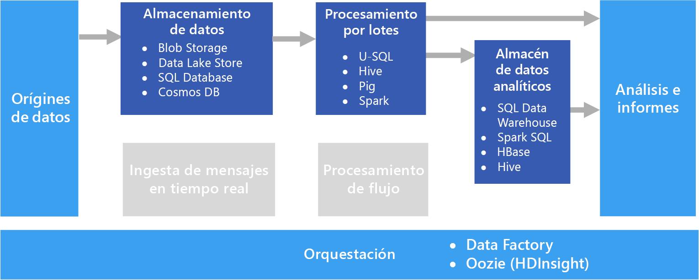

# Procesamiento por lotes

Un escenario de macrodatos común es el procesamiento por lotes de datos en reposo. En este escenario, los datos de origen se cargan en el almacenamiento de datos, ya sea por la propia aplicación de origen o mediante un flujo de trabajo de orquestación. A continuación, se procesan los datos in situ con un trabajo de ejecución en paralelo, que también se puede iniciar desde el flujo de trabajo de orquestación. El procesamiento puede incluir varios pasos iterativos antes de que se carguen los resultados transformados en un almacén de datos analíticos, que puede ser consultado por los componentes de informes y análisis.

Por ejemplo, los registros de un servidor web podrían se copian en una carpeta y, a continuación, se procesan durante la noche para generar informes diarios de la actividad web.

## Cuándo se debe utilizar esta solución

El procesamiento por lotes se usa en diversos escenarios, desde una transformación de datos simple hasta una canalización ETL (extracción, transformación y carga) más completa. En un contexto de macrodatos, el procesamiento por lotes podría operar en conjuntos de datos muy grandes, en los que el cálculo tarda mucho tiempo. (Por ejemplo, consulte la [arquitectura Lambda](../concepts/big-data.md##lambda-architecture)). El procesamiento por lotes normalmente conduce a una exploración posterior interactiva, proporciona los datos de modelado listos para el aprendizaje automático o escribe los datos en un almacén de datos que está optimizado para el análisis y la visualización.

Un ejemplo de procesamiento por lotes sería la transformación de un conjunto grande de archivos sin formato o archivos semiestructurados CSV o JSON en un formato esquematizado y estructurado listo para su consulta posterior. Normalmente, los datos se convierten de formatos sin tratamiento utilizados para la ingesta (por ejemplo, CSV) en formatos binarios que tienen un mayor rendimiento para las consultas porque almacenan los datos en formato de columnas y suelen ofrecer índices y estadísticas en línea acerca de los datos.

## Desafíos

- **Formato de datos y codificación**. Algunos de los problemas más difíciles de depurar ocurren cuando los archivos usan un formato o una codificación inesperados. Por ejemplo, los archivos de origen podrían utilizar una combinación de codificación UTF-16 y UTF-8, contener delimitadores inesperados (espacios en lugar de tabulaciones) o incluir caracteres inesperados. Otro ejemplo común son los campos de texto que contienen tabulaciones, espacios o comas que se interpretan como delimitadores. La carga de datos y la lógica de análisis deben ser lo suficientemente flexibles como para detectar y controlar estos problemas.

- **Orquestación de los segmentos de tiempo.** A menudo, los datos de origen se colocan en una jerarquía de carpetas que refleja las ventanas de procesamiento, organizadas por año, mes, día, hora y así sucesivamente. En algunos casos, los datos pueden llegar tarde. Por ejemplo, suponga que se produce un error en un servidor web y los registros del 7 de marzo no llegan a la carpeta para su procesamiento hasta el 9 de marzo. ¿Se ignoran solo porque llegaron demasiado tarde? ¿Puede la lógica de procesamiento descendente controlar registros desordenados?

## Architecture

Una arquitectura de procesamiento por lotes tiene los siguientes componentes lógicos, según se muestra en el diagrama anterior.

- **Almacenamiento de datos.** Normalmente, un almacén de archivos distribuido que puede actuar como un repositorio para grandes cantidades de archivos grandes en diferentes formatos. Este tipo de almacén se conoce a menudo, de forma genérica, como un lago de datos. 

- **Procesamiento por lotes.** La naturaleza de gran volumen de los macrodatos significa en muchos casos que la solución debe procesar los archivos de datos mediante trabajos por lotes de ejecución prolongada para filtrar, agregar o bien preparar los datos para su análisis. Normalmente estos trabajos implican leer archivos de código fuente, procesarlos y escribir la salida en nuevos archivos. 

- **Almacén de datos analíticos.** Muchas soluciones de macrodatos están diseñadas para preparar los datos para el análisis y luego servir los datos procesados en un formato estructurado que se puede consultar mediante herramientas de análisis. 

- **Análisis e informes.** El objetivo de la mayoría de soluciones de macrodatos consiste en proporcionar información sobre los datos a través de análisis e informes. 

- **Orquestación.** En el procesamiento por lotes normalmente se requiere alguna orquestación para migrar o copiar los datos en las capas de almacenamiento de datos, procesamiento por lotes, almacén de datos analíticos e informes.

## Opciones de tecnología

Se recomiendan las siguientes tecnologías para soluciones de procesamiento por lotes en Azure.

### Almacenamiento de datos

- **Contenedores de blobs de Azure Storage**. Muchos procesos de negocio de Azure existentes ya hacen uso de Azure Blob Storage, lo que la convierte en una buena opción para un almacén de macrodatos.
- **Azure Data Lake Store**. Azure Data Lake Store ofrece almacenamiento prácticamente ilimitado para cualquier tamaño de archivo y opciones de seguridad exhaustivas, resultando una buena elección para soluciones de macrodatos a gran escala que requieren un almacén centralizado para datos en formatos heterogéneos.

Para más información, consulte [Almacenamiento de datos](../technology-choices/data-storage.md).

### Procesamiento por lotes

- **U-SQL**. U-SQL es el lenguaje de procesamiento de consultas usado por Azure Data Lake Analytics. Combina la naturaleza declarativa de SQL con la extensibilidad de procedimientos de C# y aprovecha las ventajas del paralelismo para permitir un procesamiento eficaz de datos a escala masiva.
- **Hive**. Hive es un lenguaje similar a SQL que se admite en la mayoría de las distribuciones de Hadoop, incluido HDInsight. Se puede utilizar para procesar los datos de cualquier almacén compatible con HDFS, incluidos Azure Blob Storage y Azure Data Lake Store.
- **Pig**. Pig es un lenguaje de procesamiento de macrodatos declarativo utilizado en muchas distribuciones de Hadoop, incluido HDInsight. Es especialmente útil para el procesamiento de datos no estructurados o semiestructurados.
- **Spark**. El motor de Spark admite el procesamiento por lotes de programas escritos en una variedad de lenguajes, como Java, Scala y Python. Spark utiliza una arquitectura distribuida para procesar los datos en paralelo en varios nodos de trabajo.

Para más información, consulte [Procesamiento por lotes](../technology-choices/batch-processing.md).

### Almacén de datos analíticos

- **SQL Data Warehouse**. Azure SQL Data Warehouse es un servicio administrado que se basa en las tecnologías de base de datos de SQL Server y está optimizado para admitir cargas de trabajo de almacenamiento de datos a gran escala.
- **Spark SQL**. Spark SQL es una API basada en Spark que admite la creación de tramas de datos y tablas que se pueden consultar mediante la sintaxis de SQL.
- **HBase**. HBase es un almacén no SQL de baja latencia que ofrece una opción de alto rendimiento y flexible para consultar datos estructurados y semiestructurados.
- **Hive**. Además de ser útil para el procesamiento por lotes, Hive ofrece una arquitectura de base de datos que es conceptualmente similar a la de los sistemas de administración de bases de datos relacionales habituales. Las mejoras en el rendimiento de las consultas de Hive a través de innovaciones como el motor Tez y la iniciativa Stinger hacen que se puedan utilizar las tablas de Hive eficazmente como orígenes para consultas analíticas en algunos escenarios.

Para más información, consulte [Almacenes de datos analíticos](../technology-choices/analytical-data-stores.md).

### Análisis e informes

- **Azure Analysis Services**. Muchas soluciones de macrodatos emulan arquitecturas de inteligencia de negocio empresarial tradicional mediante la inclusión de un modelo de datos de procesamiento analítico en línea (OLAP) centralizado (a menudo denominado un cubo) en el que se basan los informes, paneles y el análisis interactivo "segmentar y desglosar". Azure Analysis Services admite la creación de modelos multidimensionales y tabulares para satisfacer esta necesidad.
- **Power BI**. Power BI permite a los analistas de datos crear visualizaciones de datos interactivas basadas en modelos de datos en un modelo OLAP o directamente desde un almacén de datos analíticos.
- **Microsoft Excel**. Microsoft Excel es una de las aplicaciones de software más usadas en el mundo y ofrece una gran variedad de funcionalidades de análisis de datos y visualización. Los analistas de datos pueden utilizar Excel para crear modelos de datos de documentos desde almacenes de datos analíticos o para recuperar datos desde modelos de datos OLAP en tablas dinámicas interactivas y gráficos.

Para más información, consulte [Análisis e informes](../technology-choices/analysis-visualizations-reporting.md).

### Orquestación

- **Azure Data Factory**. Las canalizaciones de Azure Data Factory pueden utilizarse para definir una secuencia de actividades, programadas en ventanas temporales periódicas. Estas actividades pueden iniciar operaciones de copia de datos, además de trabajos de Hive, Pig, MapReduce o Spark en clústeres de HDInsight bajo demanda, trabajos de U-SQL en Azure Data Lake Analytics y procedimientos almacenados en Azure SQL Data Warehouse o Azure SQL Database.
- **Oozie** y **Sqoop**. Oozie es un motor de automatización de trabajos para el ecosistema de Apache Hadoop y puede utilizarse para iniciar operaciones de copia de datos, así como trabajos de Hive, Pig y MapReduce para procesar datos y trabajos de Sqoop para copiar datos entre HDFS y las bases de datos SQL.

Para más información, consulte [Orquestación de canalizaciones](../technology-choices/pipeline-orchestration-data-movement.md)