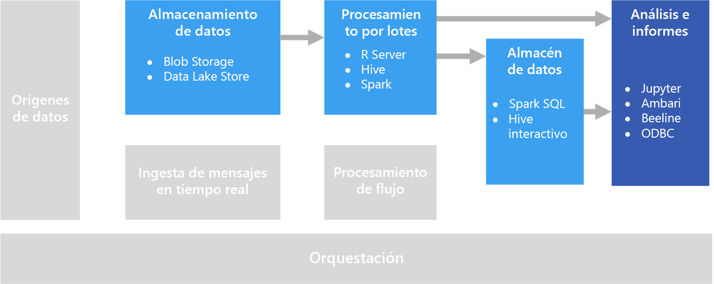

# Exploración interactiva de datosInteractive data exploration

En muchas soluciones corporativas de inteligencia empresarial (BI), los especialistas en inteligencia empresarial crean informes y modelos semánticos y los administran de forma centralizada.In many corporate business intelligence (BI) solutions, reports and semantic models are created by BI specialists and managed centrally. Cada vez más, sin embargo, las organizaciones desean permitir a los usuarios tomar decisiones basadas en los datos.Increasingly, however, organizations want to enable users to make data-driven decisions. Además, un número creciente de organizaciones están contratando *científicos de datos* o *analistas de datos* cuyo trabajo es explorar datos de forma interactiva y aplicar los modelos estadísticos y las técnicas analíticas para buscar tendencias y patrones en los datos.Additionally, a growing number of organizations are hiring *data scientists* or *data analysts*, whose job is to explore data interactively and apply statistical models and analytical techniques to find trends and patterns in the data. La exploración interactiva de datos requiere herramientas y plataformas que proporcionen un procesamiento de baja latencia para consultas ad-hoc y visualizaciones de datos.Interactive data exploration requires tools and platforms that provide low-latency processing for ad-hoc queries and data visualizations.

## Inteligencia artificial con características de autoservicioSelf-service BI

Inteligencia artificial con características de autoservicio es un nombre asignado a un enfoque moderno para la toma de decisiones empresariales en el que los usuarios pueden buscar, explorar y compartir información a partir de datos con toda la empresa.Self-service BI is a name given to a modern approach to business decision making in which users are empowered to find, explore, and share insights from data across the enterprise. Para lograr esto, la solución de datos debe admitir varios requisitos:To accomplish this, the data solution must support several requirements:

* Detección de orígenes de datos empresariales a través de un catálogo de datos.Discovery of business data sources through a data catalog.
* Administración de datos maestros para asegurar la coherencia entre las definiciones y los valores de las entidades de datos.Master data management to ensure consistency of data entity definitions and values.
* Modelado de datos interactivo y herramientas de visualización para usuarios empresariales.Interactive data modeling and visualization tools for business users.

En una solución de inteligencia empresarial con características de autoservicio, los usuarios empresariales suelen encontrar y utilizar orígenes de datos que son relevantes para su área concreta del negocio, y utilizan herramientas intuitivas y aplicaciones de productividad para definir los modelos de datos personales y los informes que pueden compartir con los compañeros.In a self-service BI solution, business users typically find and consume data sources that are relevant to their particular area of the business, and use intuitive tools and productivity applications to define personal data models and reports that they can share with their colleagues.

Servicios de Azure correspondientes:Relevant Azure services:

- [Azure Data CatalogAzure Data Catalog](/azure/data-catalog/data-catalog-what-is-data-catalog)
- [Microsoft Power BIMicrosoft Power BI](https://powerbi.microsoft.com/)

## Experimentación en ciencia de datosData science experimentation
Si una organización requiere un análisis avanzado y modelado predictivo, el trabajo de preparación inicial normalmente lo llevan a cabo científicos de datos especializados.When an organization requires advanced analytics and predictive modeling, the initial preparation work is usually undertaken by specialist data scientists. Un científico de datos explora los datos y aplica técnicas de análisis estadístico para encontrar relaciones entre las *características* de los datos y las *etiquetas* predichas deseadas.A data scientist explores the data and applies statistical analytical techniques to find relationships between data *features* and the desired predicted *labels*. La exploración de los datos se suele realizar mediante lenguajes de programación como Python o R que admiten el modelo estadístico y la visualización de forma nativa.Data exploration is typically done using programming languages such as Python or R that natively support statistical modeling and visualization. Los scripts que se usan para explorar los datos normalmente se hospedan en entornos especializados como Jupyter Notebooks.The scripts used to explore the data are typically hosted in specialized environments such as Jupyter Notebooks. Estas herramientas permiten a los científicos de datos explorar los datos mediante programación mientras documentan y comparten la información que encuentran.These tools enable data scientists to explore the data programmatically while documenting and sharing the insights they find.

Servicios de Azure correspondientes:Relevant Azure services:

- [Azure NotebooksAzure Notebooks](https://notebooks.azure.com/)
- [Azure Machine Learning StudioAzure Machine Learning Studio](/azure/machine-learning/studio/what-is-ml-studio)
- [Servicio Experimentación de Azure Machine LearningAzure Machine Learning Experimentation Services](/azure/machine-learning/preview/experimentation-service-configuration)
- [Data Science Virtual MachineThe Data Science Virtual Machine](/azure/machine-learning/data-science-virtual-machine/overview)

## DesafíosChallenges

- **Cumplimiento de las normas de privacidad de datos.****Data privacy compliance.** Debe ser cuidadoso a la hora de hacer que los datos personales estén disponibles para los usuarios para su posterior análisis y generación de informes en modo de autoservicio.You need to be careful about making personal data available to users for self-service analysis and reporting. Es probable que haya algunas consideraciones de cumplimiento normativo, debido a las directivas de la organización, e incluso problemas legales.There are likely to be compliance considerations, due to organizational policies and also regulatory issues. 

- **Volumen de datos**.**Data volume.** Aunque puede ser útil proporcionar a los usuarios acceso al origen de datos completo, esto puede dar lugar a operaciones de Excel o Power BI de ejecución prolongada, o a consultas de Spark SQL que utilizan muchos recursos de un clúster.While it may be useful to give users access to the full data source, it can result in very long-running Excel or Power BI operations, or Spark SQL queries that use a lot of cluster resources.

- **Conocimientos del usuario**.**User knowledge.** Los usuarios crean sus propias consultas y agregaciones para tomar decisiones empresariales fundamentadas.Users create their own queries and aggregations in order to inform business decisions. ¿Está seguro de que los usuarios tienen los conocimientos analíticos y de consultas necesarios para obtener resultados precisos?Are you confident that users have the necessary analytical and querying skills to get accurate results?

- **Uso compartido de los resultados**.**Sharing results.** Puede haber algunas consideraciones de seguridad a tener en cuenta si los usuarios pueden crear y compartir informes o visualizaciones de datos.There may be security considerations if users can create and share reports or data visualizations.

## ArchitectureArchitecture

Aunque el objetivo de este escenario es permitir el análisis de datos interactivo, las tareas de limpieza de datos, muestreo y estructuración que implica la ciencia de datos, a menudo incluyen procesos de ejecución prolongada.Although the goal of this scenario is to support interactive data analysis, the data cleansing, sampling, and structuring tasks involved in data science often include long-running processes. Esto hace que una arquitectura de [procesamiento por lotes](../big-data/batch-processing.md) sea adecuada.That makes a [batch processing](../big-data/batch-processing.md) architecture appropriate.

## Opciones de tecnologíaTechnology choices

Se recomiendan las siguientes tecnologías para la exploración de datos interactiva en Azure.The following technologies are recommended choices for interactive data exploration in Azure.

### Almacenamiento de datosData storage

- **Contenedores de blobs de Azure Storage** o **Azure Data Lake Store**.**Azure Storage Blob Containers** or **Azure Data Lake Store**. Los científicos de datos suelen trabajar con datos de origen sin procesar para asegurarse de que tienen acceso a todas las características, valores atípicos y errores posibles de los datos.Data scientists generally work with raw source data, to ensure they have access to all possible features, outliers, and errors in the data. En un escenario de macrodatos, estos datos normalmente tienen la forma de archivos en un almacén de datos.In a big data scenario, this data usually takes the form of files in a data store.

Para más información, consulte [Almacenamiento de datos](../technology-choices/data-storage.md).For more information, see [Data storage](../technology-choices/data-storage.md).

### Procesamiento por lotesBatch processing

- **R Server** o **Spark**.**R Server** or **Spark**. La mayoría de los científicos de datos usan lenguajes de programación con gran compatibilidad para paquetes matemáticos y estadísticos, como R o Python.Most data scientists use programming languages with strong support for mathematical and statistical packages, such as R or Python. A la hora de trabajar con grandes volúmenes de datos, puede reducir la latencia mediante el uso de plataformas que permiten a estos lenguajes usar un procesamiento distribuido.When working with large volumes of data, you can reduce latency by using platforms that enable these languages to use distributed processing. R Server se puede utilizar por sí solo o en combinación con Spark para escalar horizontalmente las funciones de procesamiento de R. Spark admite de forma nativa Python para funcionalidades similares de escalabilidad horizontal en ese lenguaje.R Server can be used on its own or in conjunction with Spark to scale out R processing functions, and Spark natively supports Python for similar scale-out capabilities in that language.
- **Hive**.**Hive**. Hive es una buena opción para transformar los datos mediante una semántica similar a SQL.Hive is a good choice for transforming data using SQL-like semantics. Los usuarios pueden crear y cargar las tablas mediante instrucciones de HiveQL que son semánticamente parecidas a SQL.Users can create and load tables using HiveQL statements, which are semantically similar to SQL.

Para más información, consulte [Procesamiento por lotes](../technology-choices/batch-processing.md).For more information, see [Batch processing](../technology-choices/batch-processing.md).

### Almacén de datos analíticosAnalytical Data Store

- **Spark SQL**.**Spark SQL**. Spark SQL es una API basada en Spark que admite la creación de tramas de datos y tablas que se pueden consultar mediante la sintaxis de SQL.Spark SQL is an API built on Spark that supports the creation of dataframes and tables that can be queried using SQL syntax. Independientemente de si los archivos de datos que se analizan son archivos de código fuente sin procesar o nuevos archivos que se han limpiado y preparado mediante un proceso por lotes, los usuarios pueden definir tablas de Spark SQL en ellos para realizar consultas adicionales en un análisis.Regardless of whether the data files to be analyzed are raw source files or new files that have been cleaned and prepared by a batch process, users can define Spark SQL tables on them for further querying an analysis. 
- **Hive**.**Hive**. Además de realizar un procesamiento por lotes de los datos sin procesar mediante Hive, puede crear una base de datos de Hive que contiene tablas y vistas basadas en las carpetas en las que se almacenan los datos, permitiendo las consultas interactivas para el análisis y la generación de informes.In addition to batch processing raw data by using Hive, you can create a Hive database that contains Hive tables and views based on the folders where the data is stored, enabling interactive queries for analysis and reporting. HDInsight incluye un tipo de clúster de Hive interactivo que usa el almacenamiento en caché en memoria para reducir los tiempos de respuesta de las consultas de Hive.HDInsight includes an Interactive Hive cluster type that uses in-memory caching to reduce Hive query response times. Los usuarios que se sienten cómodos con una sintaxis parecida a SQL pueden usar Hive interactivo para explorar los datos.Users who are comfortable with SQL-like syntax can use Interactive Hive to explore data.

Para más información, consulte [Almacenes de datos analíticos](../technology-choices/analytical-data-stores.md).For more information, see [Analytical data stores](../technology-choices/analytical-data-stores.md).

### Análisis e informesAnalytics and reporting

- **Jupyter**.**Jupyter**. Jupyter Notebooks proporciona una interfaz basada en el explorador para ejecutar código en lenguajes como R, Python o Scala.Jupyter Notebooks provides a browser-based interface for running code in languages such as R, Python, or Scala. Cuando se usa R Server o Spark para procesar los datos por lotes, o al usar Spark SQL para definir un esquema de tablas para las consultas, Jupyter puede ser una buena opción para consultar los datos.When using R Server or Spark to batch process data, or when using Spark SQL to define a schema of tables for querying, Jupyter can be a good choice for querying the data. Si usa Spark, puede usar la API de trama de datos de Spark o la API de Spark SQL, así como instrucciones de SQL insertadas, para consultar los datos y producir visualizaciones.When using Spark, you can use the standard Spark dataframe API or the Spark SQL API as well as embedded SQL statements to query the data and produce visualizations.
- **Clientes de Hive interactivo**.**Interactive Hive Clients**. Si utiliza un clúster de Hive interactivo para consultar los datos, puede usar la vista de Hive en el panel de clústeres de Ambari, la herramienta de línea de comandos Beeline o cualquier herramienta basada en ODBC (mediante el controlador ODBC de Hive), como Microsoft Excel o Power BI.If you use an Interactive Hive cluster to query the data, you can use the Hive view in the Ambari cluster dashboard, the Beeline command line tool, or any ODBC-based tool (using the Hive ODBC driver), such as Microsoft Excel or Power BI.

Para más información, consulte [Tecnología de análisis de datos e informes](../technology-choices/analysis-visualizations-reporting.md).For more information, see [Data analytics and reporting technology](../technology-choices/analysis-visualizations-reporting.md).