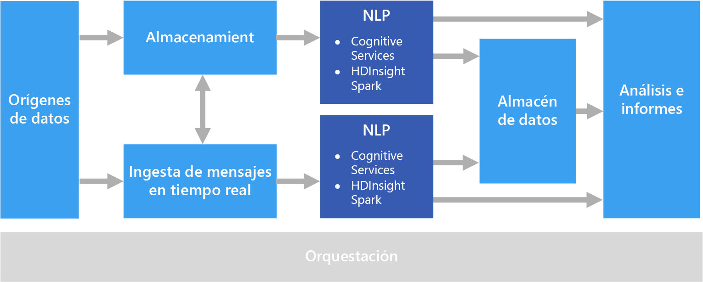

# Procesamiento de lenguaje naturalNatural language processing

El procesamiento de lenguaje natural (NLP) se utiliza para tareas como el análisis de opiniones, la detección de temas, la detección de idioma, la extracción de frases clave y la clasificación de documentos.Natural language processing (NLP) is used for tasks such as sentiment analysis, topic detection, language detection, key phrase extraction, and document categorization.

## Cuándo se debe utilizar esta soluciónWhen to use this solution

El procesamiento de lenguaje natural se puede usar para clasificar documentos, por ejemplo, etiquetar documentos como confidenciales o como correo no deseado.NLP can be use to classify documents, such as labeling documents as sensitive or spam. La salida del procesamiento de lenguaje natural se puede usar para su procesamiento subsiguiente o para búsquedas.The output of NLP can be used for subsequent processing or search. Otro uso del procesamiento de lenguaje natural es resumir texto mediante la identificación de las entidades presentes en el documento.Another use for NLP is to summarize text by identifying the entities present in the document. Estas entidades también pueden utilizarse para etiquetar documentos con palabras clave, lo que permite la búsqueda y recuperación basadas en el contenido.These entities can also be used to tag documents with keywords, which enables search and retrieval based on content. Las entidades pueden combinarse en temas, con resúmenes que describen los temas importantes presentes en cada documento.Entities might be combined into topics, with summaries that describe the important topics present in each document. Los temas detectados pueden utilizarse para clasificar los documentos para la navegación o para enumerar los documentos relacionados con un tema seleccionado.The detected topics may be used to categorize the documents for navigation, or to enumerate related documents given a selected topic. Otro uso del procesamiento de lenguaje natural es la puntuación del texto según la opinión, para evaluar el tono positivo o negativo de un documento.Another use for NLP is to score text for sentiment, to assess the positive or negative tone of a document. Estos enfoques utilizan muchas técnicas del procesamiento de lenguaje natural, como:These approaches use many techniques from natural language processing, such as: 

- **Tokenizador**.**Tokenizer**. Dividir el texto en palabras o frases.Splitting the text into words or phrases.
- **Lematización**.**Stemming and lemmatization**. Normalizar las palabras para asignar las distintas formas a la palabra canónica con el mismo significado.Normalizing words so that that different forms map to the canonical word with the same meaning. Por ejemplo, "corriendo" y "corrió" se asignan a "correr".For example, "running" and "ran" map to "run." 
- **Extracción de entidades**.**Entity extraction**. Identificación de sujetos en el texto.Identifying subjects in the text.
- **Detección de partes de la oración**.**Part of speech detection**. Identifica el texto como un verbo, nombre, participio, frase verbal, etc.Identifying text as a verb, noun, participle, verb phrase, and so on.
- **Detección del límite de las frases**.**Sentence boundary detection**. Detectar frases completas en párrafos de texto.Detecting complete sentences within paragraphs of text.

Cuando se utiliza el procesamiento de lenguaje natural para extraer información y datos a partir de texto sin formato, el punto inicial son normalmente los documentos sin formato almacenados en el almacenamiento de objetos, como Azure Storage o Azure Data Lake Store.When using NLP to extract information and insight from free-form text, the starting point is typically the raw documents stored in object storage such as Azure Storage or Azure Data Lake Store. 

## DesafíosChallenges

- El procesamiento de una colección de documentos de texto sin formato suele consumir muchos recursos de cálculo y también en términos de tiempo.Processing a collection of free-form text documents is typically computationally resource intensive, as well as being time intensive.
- Sin un formato de documento estándar, puede ser muy difícil lograr resultados coherentes y precisos del procesamiento de texto sin formato para extraer datos concretos de un documento.Without a standardized document format, it can be very difficult to achieve consistently accurate results using free-form text processing to extract specific facts from a document. Por ejemplo, imagine una representación en texto de una factura; puede ser difícil crear un proceso que extraiga correctamente la fecha de la factura y el número de la factura de las facturas de múltiples proveedores.For example, think of a text representation of an invoice&mdash;it can be difficult to build a process that correctly extracts the invoice number and invoice date for invoices across any number of vendors.

## ArchitectureArchitecture

En una solución de procesamiento de lenguaje natural, el procesamiento de texto sin formato se realiza en documentos que contienen párrafos de texto.In an NLP solution, free-form text processing is performed against documents containing paragraphs of text. La arquitectura general puede ser una arquitectura de [procesamiento por lotes](../big-data/batch-processing.md) o de [procesamiento de flujos en tiempo real](../big-data/real-time-processing.md).The overall architecture can be a [batch processing](../big-data/batch-processing.md) or [real-time stream processing](../big-data/real-time-processing.md) architecture.

El procesamiento real varía según el resultado deseado, pero, en cuanto a la canalización, se puede aplicar el procesamiento de lenguaje natural sobre un lote o en tiempo real.The actual processing varies based on the desired outcome, but in terms of the pipeline, NLP may be applied in a batch or real-time fashion. Por ejemplo, el análisis de opiniones se puede usar en bloques de texto para generar una puntuación de opinión.For example, sentiment analysis can be used against blocks of text to produce a sentiment score. Esto se puede realizar mediante la ejecución de un proceso por lotes con los datos del almacenamiento o en tiempo real mediante fragmentos más pequeños de datos que fluyen a través de un servicio de mensajería.This can could be done by running a batch process against data in storage, or in real time using smaller chunks of data flowing through a messaging service.

## Opciones de tecnologíaTechnology choices

- [Procesamiento de lenguaje naturalNatural language processing](../technology-choices/natural-language-processing.md)