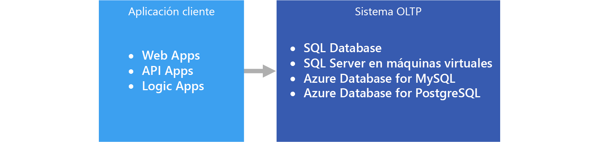

# Procesamiento de transacciones en línea (OLTP)Online transaction processing (OLTP)

La administración de [datos transaccionales](../concepts/transactional-data.md) mediante sistemas de equipos se conoce como procesamiento de transacciones en línea (OLTP).The management of [transactional data](../concepts/transactional-data.md) using computer systems is referred to as Online Transaction Processing (OLTP). Los sistemas de OLTP registran interacciones empresariales a medida que se producen en el funcionamiento diario de la organización y admiten consultas de estos datos para realizar inferencias.OLTP systems record business interactions as they occur in the day-to-day operation of the organization, and support querying of this data to make inferences.

## Cuándo se debe utilizar esta soluciónWhen to use this solution

Elija OLTP cuando necesite procesar y almacenar eficazmente transacciones comerciales, y que estén inmediatamente disponibles para las aplicaciones cliente de una manera coherente.Choose OLTP when you need to efficiently process and store business transactions and immediately make them available to client applications in a consistent way. Use esta arquitectura cuando cualquier retraso tangible en el procesamiento pueda tener un impacto negativo en el funcionamiento diario de la empresa.Use this architecture when any tangible delay in processing would have a negative impact on the day-to-day operations of the business.

Los sistemas de OLTP están diseñados para procesar y almacenar de forma eficaz las transacciones, así como para consultar los datos transaccionales.OLTP systems are designed to efficiently process and store transactions, as well as query transactional data. El objetivo de procesar y almacenar eficazmente las transacciones individuales por parte de un sistema de OLTP se logra parcialmente mediante la normalización de datos (es decir, dividir los datos en fragmentos más pequeños que sean menos redundantes).The goal of efficiently processing and storing individual transactions by an OLTP system is partly accomplished by data normalization &mdash; that is, breaking the data up into smaller chunks that are less redundant. La eficacia se debe a que permite que el sistema de OLTP procese grandes cantidades de transacciones de forma independiente y evita el procesamiento adicional necesario para mantener la integridad de los datos en presencia de datos redundantes.This supports efficiency because it enables the OLTP system to process large numbers of transactions independently, and avoids extra processing needed to maintain data integrity in the presence of redundant data.

## DesafíosChallenges
La implementación y el uso de un sistema de OLTP pueden crear algunos problemas:Implementing and using an OLTP system can create a few challenges:

- Los sistemas de OLTP no siempre son buenos para controlar agregados en grandes cantidades de datos, aunque hay excepciones, como una solución basada en SQL Server bien planeada.OLTP systems are not always good for handling aggregates over large amounts of data, although there are exceptions, such as a well-planned SQL Server-based solution. Los análisis de los datos, que se basan en cálculos agregados de millones de transacciones individuales, hacen un uso muy intensivo de los recursos en un sistema de OLTP.Analytics against the data, that rely on aggregate calculations over millions of individual transactions, are very resource intensive for an OLTP system. Pueden tardar en ejecutarse y puede provocar una ralentización porque bloqueen otras transacciones de la base de datos.They can be slow to execute and can cause a slow-down by blocking other transactions in the database.
- Si se realizan informes y análisis de los datos que estén muy normalizados, las consultas tienden a ser complejas, ya que la mayor parte de ellas tienen que anular la normalización de los datos mediante réplicas.When conducting analytics and reporting on data that is highly normalized, the queries tend to be complex, because most queries need to de-normalize the data by using joins. Además, las convenciones de nomenclatura de los objetos de base de datos en los sistemas de OLTP tienden a ser breves y concisas.Also, naming conventions for database objects in OLTP systems tend to be terse and succinct. El aumento de la normalización, junto con unas convenciones de nomenclatura breves, hacen que sea difícil para los usuarios empresariales realizar consultas en los sistemas de OLTP sin la ayuda de un DBA o desarrollador de datos.The increased normalization coupled with terse naming conventions makes OLTP systems difficult for business users to query, without the help of a DBA or data developer.
- El almacenamiento del historial de transacciones de forma indefinida y el almacenamiento de demasiados datos en cualquier tabla puede provocar una ralentización del rendimiento de las consultas, en función del número de transacciones almacenadas.Storing the history of transactions indefinitely and storing too much data in any one table can lead to slow query performance, depending on the number of transactions stored. La solución habitual consiste en mantener una ventana de tiempo relevante (por ejemplo, el año fiscal actual) en el sistema de OLTP y descargar los datos históricos a otros sistemas, como un data mart o un [almacenamiento de datos](../technology-choices/data-warehouses.md).The common solution is to maintain a relevant window of time (such as the current fiscal year) in the OLTP system and offload historical data to other systems, such as a data mart or [data warehouse](../technology-choices/data-warehouses.md).

## OLTP en AzureOLTP in Azure

Aplicaciones como los sitios web hospedados en [App Service Web Apps](/azure/app-service/app-service-web-overview), REST API que se ejecutan en App Service o las aplicaciones de escritorio o móviles se comunican con el sistema de OLTP normalmente a través de una REST API intermediaria.Applications such as websites hosted in [App Service Web Apps](/azure/app-service/app-service-web-overview), REST APIs running in App Service, or mobile or desktop applications communicate with the OLTP system, typically via a REST API intermediary.

En la práctica, la mayoría de las cargas de trabajo no son OLTP puras.In practice, most workloads are not purely OLTP. Tiende a haber también un [componente analítico](../scenarios/online-analytical-processing.md).There tends to be an [analytical component](../scenarios/online-analytical-processing.md) as well. Además, hay una creciente demanda de informes en tiempo real, como los informes activos en el sistema operativo.In addition, there is an increasing demand for real-time reporting, such as running reports against the operational system. Esto también se denomina HTAP (procesamiento transaccional y analítico híbrido).This is also referred to as HTAP (Hybrid Transactional and Analytical Processing). Para más información, consulte [Choosing an OLAP data store in Azure](../technology-choices/olap-data-stores.md) (Elección de un almacén de datos OLAP en Azure).For more information, see [Online Analytical Processing (OLAP) data stores](../technology-choices/olap-data-stores.md).

## Opciones de tecnologíaTechnology choices

Almacenamiento de datos:Data storage:

- [Azure SQL DatabaseAzure SQL Database](/azure/sql-database/)
- [SQL Server en una máquina virtual de AzureSQL Server in an Azure VM](/azure/virtual-machines/windows/sql/virtual-machines-windows-sql-server-iaas-overview?toc=%2Fazure%2Fvirtual-machines%2Fwindows%2Ftoc.json)
- [Azure Database for MySQLAzure Database for MySQL](/azure/mysql/)
- [Azure Database para PostgreSQLAzure Database for PostgreSQL](/azure/postgresql/)

Para más información, consulte [Elección de un almacén de datos de OLTP](../technology-choices/oltp-data-stores.md).For more information, see [Choosing an OLTP data store](../technology-choices/oltp-data-stores.md)

Orígenes de datos:Data sources:

- [App ServiceApp service](/azure/app-service/)
- [Mobile AppsMobile Apps](/azure/app-service-mobile/)

