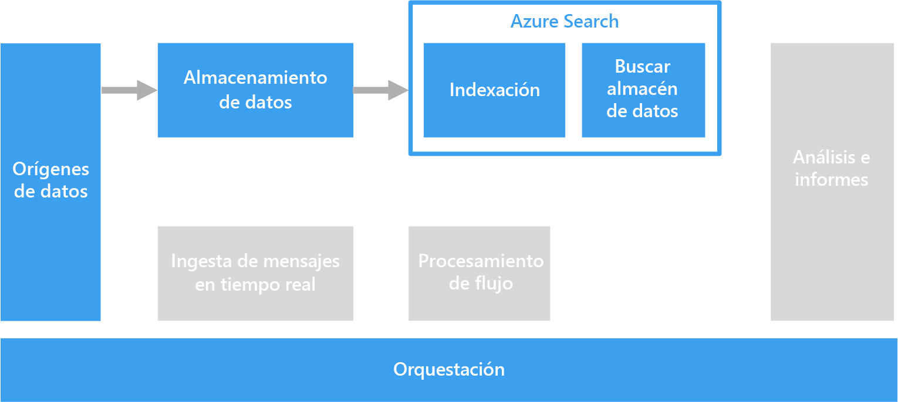

# Procesamiento de texto sin formato para búsquedas

Para poder realizar búsquedas, el procesamiento de texto sin formato se puede realizar en documentos que contienen párrafos de texto.

La búsqueda de texto funciona mediante la creación de un índice especializado que se calcula previamente en una colección de documentos. Una aplicación cliente envía una consulta que contiene los términos de búsqueda. La consulta devuelve un conjunto de resultados conformado por una lista de documentos que se ordenan por el grado de coincidencia de cada documento con los criterios de búsqueda. El conjunto de resultados también puede incluir el contexto en el que el documento cumple los criterios, lo que permite a la aplicación resaltar la frase coincidente en el documento. 

El procesamiento de texto sin formato puede producir datos útiles y procesables a partir de grandes cantidades de datos de texto farragosos. Los resultados pueden dotar a documentos no estructurados de una estructura bien definida y consultable.

## Desafíos

- El procesamiento de una colección de documentos de texto sin formato suele consumir muchos recursos de cálculo y también una gran cantidad de tiempo.
- Para buscar texto sin formato de forma eficaz, el índice de búsqueda debe admitir la búsqueda aproximada basándose en términos que tengan una construcción similar. Por ejemplo, los índices de búsqueda se crean con lematización, de forma que las consultas de "ejecutar" encuentren documentos que contengan "ejecutó" y "ejecución".

## Architecture

En la mayoría de los casos, los documentos de texto de origen se cargan en un servicio de almacenamiento de objetos, como Azure Storage o Azure Data Lake Store. Una excepción es la realización de una búsqueda de texto completo en SQL Server o Azure SQL Database. En este caso, los datos del documento se cargan en tablas administradas por la base de datos. Una vez almacenados, los documentos se procesan en un lote para crear el índice.

## Opciones de tecnología

Entre las opciones para crear un índice de búsqueda se incluyen Azure Search, Elasticsearch y HDInsight con Solr. Cada una de estas tecnologías puede completar un índice de búsqueda a partir de una colección de documentos. Azure Search proporciona indizadores que pueden rellenar automáticamente el índice para documentos de texto sin formato o con formato Excel y PDF. En HDInsight, Apache Solr puede indexar archivos binarios de muchos tipos, incluidos documentos de texto sin formato, Word y PDF. Una vez que se crea el índice, los clientes pueden acceder a la interfaz de búsqueda por medio de una API REST. 

Si los datos de texto se almacenan en SQL Server o Azure SQL Database, puede usar la búsqueda de texto completo integrada en la base de datos. La base de datos rellena el índice a partir de datos de texto, binarios o XML almacenados en la misma base de datos. Los clientes realizan búsquedas mediante consultas T-SQL. 

Para más información, consulte los [Buscar almacenes de datos](../technology-choices/search-options.md).
