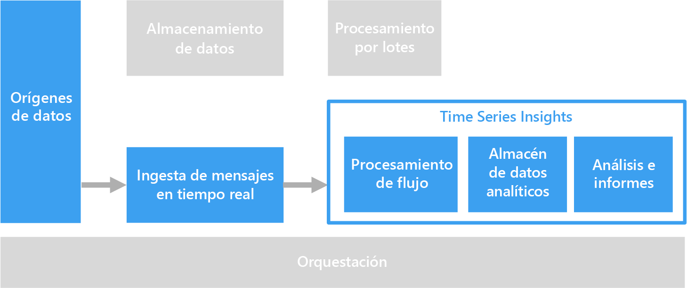

# Soluciones de serie temporal

Los datos de series temporales son un conjunto de valores que se organizan por horas. Ejemplos de datos de series temporales incluyen datos de sensores, cotizaciones bursátiles, datos de secuencia de clics y datos de telemetría de aplicación. Los datos de series temporales se pueden analizar para buscar tendencias históricas, alertas en tiempo real o para el modelado predictivo.

Los datos de serie temporal representan cómo cambia un recurso o un proceso con el tiempo. Los datos tienen una marca de tiempo, pero lo que es más importante, el tiempo es el eje más significativo para ver o analizar los datos. Normalmente, los datos de serie temporal llegan en orden cronológico y suelen tratarse como inserción en lugar de actualización de la base de datos. Por este motivo, el cambio se mide con el tiempo, lo cual le permite buscar hacia atrás y predecir cambios futuros. Por tanto, los datos de serie temporal se visualizan mejor con gráficos de dispersión o de líneas.

Algunos ejemplos de datos de serie temporal son:

- Cotizaciones bursátiles capturadas en el tiempo para detectar tendencias.
- Rendimiento del servidor como, por ejemplo, el uso de la CPU, carga de E/S, uso de memoria y consumo de ancho de banda de red.
- Telemetría de sensores de equipos industriales que se puede usar para detectar averías pendientes de los equipos y para desencadenar notificaciones de alerta.
- Los datos de telemetría del automóvil en tiempo real como velocidad, frenos y aceleración a lo largo de un espacio de tiempo para generar una puntuación del riesgo agregado para el conductor.

En cada uno de estos casos, puede ver cómo el tiempo es el eje más significativo. La visualización de eventos en el orden en el que se han producido es una característica clave de los datos de serie temporal, ya que se trata de un orden temporal natural. Esto difiere de los datos capturados para las canalizaciones de datos de OLTP estándares en las que los datos se pueden introducir en cualquier orden y actualizar en cualquier momento.

## Cuándo se debe utilizar esta solución

Elija una solución de serie temporal cuando sea necesario ingerir datos cuyo valor estratégico se centra en los cambios a lo largo de un período de tiempo, y está insertando principalmente nuevos y actualizándolos solo en contadas ocasiones, si es que se actualizan alguna vez. Puede utilizar esta información para detectar anomalías, visualizar tendencias y comparar datos actuales con datos históricos, entre otras cosas. Este tipo de arquitectura también es idóneo para el modelado predictivo y la previsión de resultados, ya que dispone del registro histórico de cambios a lo largo del tiempo, el cual se puede aplicar a cualquier número de modelos de previsión.

El uso de series temporales ofrece las siguientes ventajas:

- Representan con claridad cómo cambia un recurso o un proceso con el tiempo.
- Ayudan a detectar rápidamente los cambios en una serie de orígenes relacionados, lo cual permite destacar las anomalías y las tendencias emergentes con claridad.
- Más adecuado para el modelado predictivo y la previsión.

### Internet de las cosas (IoT)

Los datos recopilados por dispositivos de IoT son una opción natural para el almacenamiento y el análisis de series temporales. Los datos de entrada se insertan y rara vez se actualizan, si es que lo hacen alguna vez. Los datos tienen una marca de tiempo y se insertan en el orden en que se recibieron, y se muestran normalmente en orden cronológico, lo cual permite a los usuarios descubrir tendencias, detectar anomalías y usar la información para un análisis predictivo.

Para más información, consulte [Internet de las cosas](../big-data/index.md#internet-of-things-iot).

### Análisis en tiempo real

Los datos de series temporales están normalmente sujetos a limitación temporal, es decir, se debe actuar sobre ellos rápidamente, para detectar tendencias en tiempo real o generar alertas. En estos casos, cualquier retraso en la información puede provocar tiempo de inactividad y afectar a la empresa. Además, a menudo se necesita poner en correlación datos de varios orígenes diferentes como, por ejemplo, sensores.

Idealmente, debería tener una capa de procesamiento de flujos que pueda manejar los datos de entrada en tiempo real y procesarlos todos con una elevada precisión y granularidad. Esto no siempre es posible, depende de la arquitectura de streaming y de los componentes de la capa de almacenamiento en búfer de los flujos y de la del procesamiento de los flujos. Puede que tenga que sacrificar algo de precisión de los datos de series temporales reduciendo estos. Esto se hace mediante el procesamiento de ventanas de tiempo variables (de varios segundos, por ejemplo), lo que permite a la capa de procesamiento realizar los cálculos de manera oportuna. También puede que sea necesario reducir el tamaño y agregar los datos al mostrar períodos más largos de tiempo, por ejemplo, cuando amplía para mostrar los datos capturados durante varios meses.

## Desafíos

- Los datos de series temporales a menudo tienen un volumen muy elevado, especialmente en escenarios de IoT. Almacenar, indexar, consultar, analizar y visualizar datos de series temporales puede suponer un desafío.

- Puede resultar complicado encontrar la combinación correcta entre almacenamiento de alta velocidad y operaciones de proceso eficaz para controlar el análisis en tiempo real, al tiempo que se minimiza el tiempo de comercialización y el costo de la inversión total.

## Arquitectura

En muchos escenarios que implican datos de series temporales, como IoT, los datos se capturan en tiempo real. Por lo tanto, una arquitectura de [procesamiento en tiempo real](../big-data/real-time-processing.md) resulta adecuada.

[IoT Hub](/azure/iot-hub/), [Event Hubs](/azure/event-hubs/) o [Kafka en HDInsight](/azure/hdinsight/kafka/apache-kafka-introduction) ingieren los datos de uno o varios orígenes de datos en la capa de almacenamiento en búfer de los flujos. Posteriormente, los datos se procesan en la capa de procesamiento de flujos que puede, opcionalmente, enviar los datos procesados a un servicio de aprendizaje automático para un análisis predictivo. Los datos procesados se almacenan en un almacén de datos analíticos como [HBase](/azure/hdinsight/hbase/apache-hbase-overview), [Azure Cosmos DB](/azure/cosmos-db/), Azure Data Lake o Blob Storage. Se puede usar una aplicación o servicio de análisis e informes como Power BI o OpenTSDB (si los datos están almacenados en HBase) para mostrar los datos de series temporales para su análisis.

Otra opción es utilizar [Azure Time Series Insights](/azure/time-series-insights/). Time Series Insights. es un servicio completamente administrado para datos de series temporales. En esta arquitectura, Time Series Insights lleva a cabo las funciones de procesamiento de flujos, almacén de datos y análisis e informes. Acepta el streaming de datos desde IoT Hub o Event Hubs, y almacena, procesa, analiza y muestra los datos casi en tiempo real. No agrega previamente los datos, pero almacena los eventos sin procesar.

Time Series Insights se adapta al esquema, lo que significa que no es necesario realizar ninguna preparación de los datos para empezar a derivar información. Esto le permite explorar, comparar y poner en correlación una variedad de orígenes de datos sin problemas. También proporciona filtros y agregados similares a SQL, y la posibilidad de generar, visualizar, comparar y superponer varios patrones de serie temporal, mapas térmicos, y la capacidad de guardar y compartir las consultas.

## Opciones de tecnología

- [Almacenamiento de datos](../technology-choices/data-storage.md)
- [Análisis, visualizaciones e informes](../technology-choices/analysis-visualizations-reporting.md)
- [Almacenes de datos analíticos](../technology-choices/analytical-data-stores.md)
- [Procesamiento de flujos](../technology-choices/stream-processing.md)