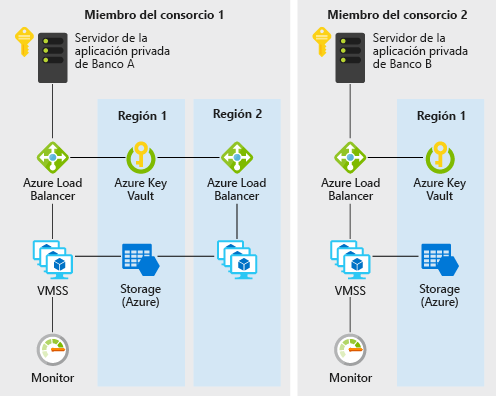

# Confianza descentralizada entre bancos en Azure

Este escenario de ejemplo es útil para bancos o cualesquiera otras entidades que deseen establecer un entorno de confianza para el uso compartido de información sin tener que recurrir a una base de datos centralizada. Para este ejemplo vamos a describir el escenario en el contexto del mantenimiento de la información de la puntuación de crédito entre bancos, pero la arquitectura se puede aplicar a cualquier escenario en el que un consorcio de organizaciones desea compartir información validada sin tener que recurrir al uso de un sistema central ejecutado por una única entidad.

Tradicionalmente, los bancos de un sistema financiero confían en orígenes centralizados, como las oficinas de crédito, para obtener información sobre la puntuación de crédito de un individuo y su historial. Un enfoque centralizado presenta una concentración de riesgos operativos y, a veces, un tercero innecesario.

Con DLT (tecnología de libro de contabilidad distribuida), un consorcio de bancos puede establecer un sistema descentralizado que puede ser más eficiente y menos susceptible a ataques y actuar como una nueva plataforma en la que se pueden implementar estructuras innovadoras para resolver los desafíos tradicionales en materia de privacidad, velocidad y costo.

En este ejemplo se mostrará cómo se pueden aprovisionar rápidamente los servicios de Azure, como los conjuntos de escalado de máquinas virtuales, Virtual Network, Key Vault, Storage, Load Balancer y Monitor para la implementación de una cadena de bloques Ethereum PoA privada eficaz en la que los bancos miembros pueden establecer sus propios nodos.

## Casos de uso pertinentes

Otros casos de uso pertinentes incluyen:

- Movimiento de los presupuestos asignados entre distintas unidades empresariales de una organización multinacional
- Pagos transfronterizos
- Escenarios de comercio financiero
- Sistemas de fidelidad que implican a diferentes empresas
- Ecosistemas de la cadena de suministro

## Arquitectura

Este escenario trata los componentes de back-end necesarios para crear una red de cadena de bloques empresarial privada escalable, segura y supervisada dentro de un consorcio de dos o más miembros. Los detalles de cómo se aprovisionan estos componentes (es decir, dentro de distintas suscripciones y grupos de recursos), así como los requisitos de conectividad (es decir, VPN o ExpressRoute) quedan para su consideración en función de los requisitos de directivas de la organización. Los datos fluyen del siguiente modo:

1. El banco A crea o actualiza el historial crediticio de un individuo mediante el envío de una transacción a la red de la cadena de bloques con JSON-RPC.
2. Los datos fluyen del servidor de aplicación privado del banco A al equilibrador de carga de Azure y posteriormente a una máquina virtual de nodo de validación del conjunto de escalado de máquinas virtuales.
3. La red Ethereum PoA crea un bloque a una hora predeterminada (2 segundos en este escenario).
4. La transacción se agrupa en el bloque creado y se valida en la red de la cadena de bloques.
5. De forma similar, el banco B puede leer el historial crediticio creado por el banco A mediante la comunicación con su propio nodo con JSON-RPC.

### Componentes

- Las máquinas virtuales de los conjuntos de escalado de máquinas virtuales proporcionan la capacidad de proceso a petición para hospedar los procesos del validador para la cadena de bloques
- Key Vault se usa como la instalación de almacenamiento seguro para las claves privadas de cada validador
- Azure Load Balancer distribuye las solicitudes de RPC, de emparejamiento y de aplicaciones descentralizadas de gobierno
- Azure Storage para hospedar la información de red persistente y coordinar la concesión
- Operations Management Suite (una unión de algunos servicios de Azure) proporciona una visión de los nodos disponibles, las transacciones por minuto y los miembros del consorcio

### Alternativas

Se elige el enfoque de Ethereum PoA para este ejemplo porque resulta un buen punto de entrada para un consorcio de organizaciones que desea crear un entorno donde se puede intercambiar información y compartirla con otros fácilmente, de una forma de confianza, descentralizada y fácil de entender. Las plantillas de la solución de Azure disponibles también proporcionan un modo cómodo y rápido no solo para que un líder del consorcio inicie una cadena de bloques Ethereum PoA, sino también para que las organizaciones miembro del consorcio pongan en marcha sus propios recursos de Azure en su propio grupo de recursos y suscripción para unirse a una red existente.

Para otros escenarios extendidos o diferentes, pueden surgir problemas como la privacidad de la transacción. Por ejemplo, en un escenario de transferencia de títulos, los miembros de un consorcio pueden no querer que sus transacciones sean visibles incluso para otros miembros. Existen alternativas a Ethereum PoA que abordan estos problemas en su propia manera:

- Corda
- Quorum
- Hyperledger

## Consideraciones

### Disponibilidad

[Azure Monitor][monitor] se usa para supervisar continuamente la red de la cadena de bloques en busca de problemas para garantizar la disponibilidad. Tras una implementación correcta de la plantilla de la solución de cadena de bloques utilizada en este escenario, se le enviará un vínculo a un panel de supervisión personalizado basado en Azure Monitor. El panel muestra los nodos que notifican latidos en los últimos 30 minutos, así como otras estadísticas útiles.

Para ver otros temas de disponibilidad, consulte la [lista de comprobación de disponibilidad][availability] que encontrará en Azure Architecture Center.

### Escalabilidad

Una preocupación popular en las cadenas de bloques es el número de transacciones que puede incluir una cadena de bloques en un período de tiempo preestablecido. Este escenario utiliza la prueba de autoridad, en la que la escalabilidad se puede administrar mejor que en la prueba de trabajo. En las redes con prueba de autoridad, se conocen y administran los participantes de consenso, lo que es más apropiado para una cadena de bloques privada para un consorcio de organizaciones que se conozcan entre sí. Mediante el panel personalizado, se pueden supervisar fácilmente parámetros como el tiempo medio del bloque, las transacciones por minuto y el consumo de recursos de proceso. A continuación, se pueden ajustar los recursos según corresponda en función de los requisitos de escala.

Para obtener instrucciones generales sobre cómo diseñar soluciones escalables, consulte la [lista de comprobación de escalabilidad][scalability] en el centro de arquitectura de Azure.

### Seguridad

[Azure Key Vault][vault] se usa para almacenar y administrar las claves privadas de los validadores fácilmente. La implementación predeterminada de este ejemplo crea una red de cadena de bloques que es accesible a través de Internet. Para un escenario de producción en el que se desea una red privada, los miembros se pueden conectar entre sí a través de conexiones de puerta de enlace de VPN de red virtual a red virtual. Los pasos para configurar una VPN se incluyen en la siguiente sección de recursos relacionados.

Para obtener instrucciones generales sobre el diseño de soluciones seguras, consulte la [documentación de seguridad de Azure][security].

### Resistencia

La cadena de bloques Ethereum PoA puede proporcionar por sí misma cierto grado de resistencia, ya que los nodos de validador se pueden implementar en distintas regiones. Azure tiene opciones para implementaciones en más de 54 regiones en todo el mundo. Una cadena de bloques como la de este escenario proporciona posibilidades de colaboración únicas para aumentar la resistencia. La resistencia de la red no se proporciona solo para una única entidad centralizada, sino por todos los miembros del consorcio. Una cadena de bloques con prueba de autoridad permite que la resistencia de la red sea más planeada y deliberada aún.

Para obtener instrucciones generales sobre el diseño de soluciones resistentes, consulte [Diseño de aplicaciones resistentes de Azure][resiliency].

## Precios

Para explorar el costo de ejecutar este escenario, todos los servicios están preconfigurados en la calculadora de costos. Para ver cómo cambiarían los precios en su caso específico, cambie las variables pertinentes para que coincidan con los requisitos de rendimiento y disponibilidad esperados.

Hemos incluido tres perfiles de costos de ejemplo basados en el número de instancias de conjuntos de escalado de máquinas virtuales que ejecutan las aplicaciones (las instancias pueden residir en regiones distintas).

- [Pequeño][small-pricing]: este ejemplo de precios representa 2 máquinas virtuales al mes con la supervisión desactivada
- [Mediano][medium-pricing]: este ejemplo de precios representa 7 máquinas virtuales al mes con la supervisión activada
- [Grande][large-pricing]: este ejemplo de precios representa 15 máquinas virtuales al mes con la supervisión activada

Los precios anteriores son para que un miembro del consorcio inicie o se una a una red de cadena de bloques. Por lo general, en un consorcio donde hay varias compañías u organizaciones implicadas, cada miembro obtendrá su propia suscripción de Azure.

## Pasos siguientes

Para ver un ejemplo de este escenario, implemente la [aplicación de demostración de la cadena de bloques Ethereum PoA][deploy] en Azure. y, después, vaya al [Léame del código fuente del escenario][source].

## Recursos relacionados

Para más información sobre el uso de la plantilla de la solución de prueba de autoridad de Ethereum en Azure, consulte esta [Guía de uso][guide].

<!-- links -->
[small-pricing]: https://azure.com/e/4e429d721eb54adc9a1558fae3e67990
[medium-pricing]: https://azure.com/e/bb42cd77437744be8ed7064403bfe2ef
[large-pricing]: https://azure.com/e/e205b443de3e4adfadf4e09ffee30c56
[guide]: /azure/blockchain-workbench/ethereum-poa-deployment
[deploy]: https://portal.azure.com/?pub_source=email&pub_status=success#create/microsoft-azure-blockchain.azure-blockchain-ethereumethereum-poa-consortium
[source]: https://github.com/vitoc/creditscoreblockchain
[monitor]: /azure/monitoring-and-diagnostics/monitoring-overview-azure-monitor
[availability]: /azure/architecture/checklist/availability
[scalability]: /azure/architecture/checklist/scalability
[resiliency]: ../../resiliency/index.md
[security]: /azure/security/
[vault]: https://azure.microsoft.com/services/key-vault/
