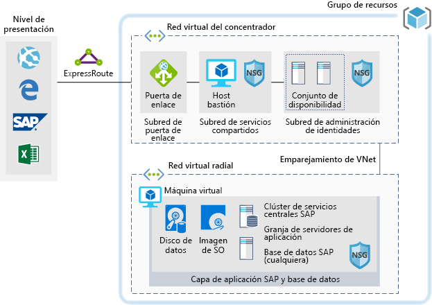

# SAP para cargas de trabajo de desarrollo/pruebasSAP for dev/test workloads

En este ejemplo se proporciona orientación sobre cómo ejecutar una implementación de desarrollo/pruebas de SAP NetWeaver en un entorno de Windows o Linux en Azure.This example provides guidance for how to run a dev/test implementation of SAP NetWeaver in a Windows or Linux environment on Azure. La base de datos empleada es AnyDB, el término de SAP para todos los sistemas de administración de bases de datos compatibles (que no sean SAP HANA).The database used is AnyDB, the SAP term for any supported DBMS (that isn't SAP HANA). Dado que esta arquitectura está diseñada para entornos que no son de producción, se implementa con una sola máquina virtual (VM) y se puede cambiar su tamaño para adaptarse a las necesidades de su organización.Because this architecture is designed for non-production environments, it's deployed with just a single virtual machine (VM) and it's size can be changed to accommodate your organization's needs.

Para casos de uso de producción, revise las arquitecturas de referencia de SAP que están disponibles a continuación:For production use cases review the SAP reference architectures available below:

* [SAP NetWeaver para AnyDB][sap-netweaver][SAP netweaver for AnyDB][sap-netweaver]
* [SAP S/4Hana][sap-hana][SAP S/4Hana][sap-hana]
* [SAP en Azure (instancias grandes)][sap-large][SAP on Azure large instances][sap-large]

## Casos de uso relacionadosRelated use cases

Tenga en cuenta este escenario para los casos de uso siguientes:Consider this scenario for the following use cases:

* Cargas de trabajo no productivas de instancias de SAP no importantes (espacio aislado, desarrollo, prueba, control de calidad)Non-critical SAP non-productive workloads (sandbox, development, test, quality assurance)
* Cargas de trabajo de SAP Business One no importantesNon-critical SAP business one workloads

## ArquitecturaArchitecture

Este escenario trata sobre el aprovisionamiento de una única base de datos del sistema SAP y del servidor de aplicaciones de SAP en una sola máquina virtual. Los datos fluyen a través del escenario como se indica a continuación:This scenario covers the provision of a single SAP system database and SAP application Server on a single virtual machine, the data flows through the scenario as follows:

1. Los clientes del nivel de presentación usan la GUI de SAP, u otras interfaces de usuario (Internet Explorer, Excel o cualquier otra aplicación web) de forma local para acceder al sistema SAP basado en Azure.Customers from the Presentation Tier use their SAP GUI, or other user interfaces (Internet Explorer, Excel, or other web application) on premise to access the Azure-based SAP system.
2. La conectividad se proporciona mediante una conexión de ExpressRoute establecida.Connectivity is provided through the use of an established Express Route. La conexión ExpressRoute finaliza en Azure, en la puerta de enlace de ExpressRoute.The Express Route connection is terminated in Azure at the Express Route Gateway. El tráfico de red se enruta a través de la puerta de enlace de ExpressRoute hacia la subred de puerta de enlace y desde esta a la subred de aplicaciones de nivel spoke (consulte el patrón [hub-and-spoke][hub-spoke]) y a través de una puerta de enlace de seguridad de red hacia la máquina virtual de la aplicación SAP.Network traffic routes through the Express Route gateway to the Gateway Subnet and from the gateway subnet to the Application Tier Spoke subnet (see the [hub-spoke][hub-spoke] pattern) and via a Network Security Gateway to the SAP application virtual machine.
3. Los servidores de administración de identidades proporcionan servicios de autenticación.The identity management servers provide authentication services.
4. JumpBox proporciona funcionalidades de administración local.The jump box provides local management capabilities.

### ComponentesComponents

* Un [grupo de recursos](/azure/azure-resource-manager/resource-group-overview#resource-groups) es un contenedor lógico de recursos de Azure.[Resource Groups](/azure/azure-resource-manager/resource-group-overview#resource-groups) is a logical container for Azure resources.
* [Las redes virtuales](/azure/virtual-network/virtual-networks-overview) son la base de las comunicaciones de red dentro de Azure.[Virtual Networks](/azure/virtual-network/virtual-networks-overview) is the basis of network communications within Azure
* [Máquina virtual](/azure/virtual-machines/windows/overview): Azure Virtual Machines proporciona una infraestructura bajo demanda, a gran escala, segura y virtualizada con Windows o Linux Server.[Virtual Machine](/azure/virtual-machines/windows/overview) Azure Virtual Machines provides on-demand, high-scale, secure, virtualized infrastructure using Windows or Linux Server
* [ExpressRoute](/azure/expressroute/expressroute-introduction) le permite ampliar sus redes locales en la nube de Microsoft a través de una conexión privada que facilita un proveedor de conectividad.[Express Route](/azure/expressroute/expressroute-introduction) lets you extend your on-premises networks into the Microsoft cloud over a private connection facilitated by a connectivity provider.
* Los [grupos de seguridad de red](/azure/virtual-network/security-overview) le permiten limitar el tráfico a los recursos de una red virtual.[Network Security Group](/azure/virtual-network/security-overview) lets you limit network traffic to resources in a virtual network. Un grupo de seguridad de red contiene una lista de reglas de seguridad que permiten o deniegan el tráfico de red entrante o saliente en función de las direcciones IP de origen o destino, el puerto y el protocolo.A network security group contains a list of security rules that allow or deny inbound or outbound network traffic based on source or destination IP address, port, and protocol. 

## ConsideracionesConsiderations

### DisponibilidadAvailability

 Microsoft ofrece un Acuerdo de Nivel de Servicio (SLA) para instancias únicas de máquina virtual.Microsoft offers a service level agreement (SLA) for single VM instances. Para más información, consulte el [Acuerdo de Nivel de Servicio de Microsoft Azure para máquinas virtuales](https://azure.microsoft.com/support/legal/sla/virtual-machines)For more information on Microsoft Azure Service Level Agreement for Virtual Machines [SLA For Virtual Machines](https://azure.microsoft.com/support/legal/sla/virtual-machines)

### EscalabilidadScalability

Para obtener instrucciones generales sobre cómo diseñar soluciones escalables, consulte la [lista de comprobación de escalabilidad][scalability] en el centro de arquitectura de Azure.For general guidance on designing scalable solutions, see the [scalability checklist][scalability] in the Azure Architecture Center.

### SeguridadSecurity

Para obtener instrucciones generales sobre el diseño de soluciones seguras, consulte la [documentación de seguridad de Azure][security].For general guidance on designing secure solutions, see the [Azure Security Documentation][security].

### ResistenciaResiliency

Para obtener instrucciones generales sobre el diseño de soluciones resistentes, consulte [Diseño de aplicaciones resistentes de Azure][resiliency].For general guidance on designing resilient solutions, see [Designing resilient applications for Azure][resiliency].

## PreciosPricing

Para explorar el costo de ejecutar este escenario, todos los servicios están preconfigurados en la calculadora de costos.Explore the cost of running this scenario, all of the services are pre-configured in the cost calculator.  Para ver cómo cambiarían los precios en su caso concreto, cambie las variables pertinentes para que coincidan con el tráfico esperado.To see how the pricing would change for your particular use case change the appropriate variables to match your expected traffic.

Hemos proporcionado cuatro ejemplos de perfiles de costo según la cantidad de tráfico que se espera obtener:We have provided four sample cost profiles based on amount of traffic you expect to get:

|TamañoSize|SAPSAPs|Tipo de máquina virtualVM Type|StorageStorage|Calculadora de precios de AzureAzure Pricing Calculator|
|----|----|-------|-------|---------------|
|PequeñaSmall|80008000|D8s_v3D8s_v3|2xP20, 1xP102xP20, 1xP10|[PequeñoSmall](https://azure.com/e/9d26b9612da9466bb7a800eab56e71d1)|
|MedianoMedium|1600016000|D16s_v3D16s_v3|3xP20, 1xP103xP20, 1xP10|[MedianoMedium](https://azure.com/e/465bd07047d148baab032b2f461550cd)|
grandeLarge|3200032000|E32s_v3E32s_v3|3xP20, 1xP103xP20, 1xP10|[GrandeLarge](https://azure.com/e/ada2e849d68b41c3839cc976000c6931)|
ExtragrandeExtra Large|6400064000|M64sM64s|4xP20, 1xP104xP20, 1xP10|[ExtragrandeExtra Large](https://azure.com/e/975fb58a965c4fbbb54c5c9179c61cef)|

Nota: La información sobre precios es una orientación y solo indica los costos de máquinas virtuales y de almacenamiento (no incluye los gastos de redes, almacenamiento de copia de seguridad y entrada o salida de datos).Note: pricing is a guide and only indicates the VMs and storage costs (excludes, networking, backup storage, and data ingress/egress charges).

* [Pequeño](https://azure.com/e/9d26b9612da9466bb7a800eab56e71d1): un sistema pequeño que consta de una máquina virtual del tipo D8s_v3 con 8 vCPU, 32 GB de RAM y almacenamiento temporal de 200 GB, además de dos discos de almacenamiento premium de 512 GB y uno de 128 GB.[Small](https://azure.com/e/9d26b9612da9466bb7a800eab56e71d1): A small system consists of VM type D8s_v3 with 8x vCPUs, 32 GB RAM and 200 GB temp storage, additionally two 512 GB and one 128 GB premium storage disks.
* [Mediano](https://azure.com/e/465bd07047d148baab032b2f461550cd): un sistema mediano que consta de una máquina virtual del tipo D16s_v3 con 16 vCPU, 64 GB de RAM y almacenamiento temporal de 400 GB, además de tres discos de almacenamiento premium de 512 GB y uno de 128 GB.[Medium](https://azure.com/e/465bd07047d148baab032b2f461550cd): A medium system consists of VM type D16s_v3 with 16x vCPUs, 64 GB RAM and 400 GB temp storage, additionally three 512 GB and one 128 GB premium storage disks.
* [Grande](https://azure.com/e/ada2e849d68b41c3839cc976000c6931): un sistema grande que consta de una máquina virtual del tipo E32s_v3 con 32 vCPU, 256 GB de RAM y almacenamiento temporal de 512 GB, además de tres discos de almacenamiento premium de 512 GB y uno de 128 GB.[Large](https://azure.com/e/ada2e849d68b41c3839cc976000c6931): A large system consists of VM type E32s_v3 with 32x vCPUs, 256 GB RAM and 512 GB temp storage, additionally three 512GB and one 128GB premium storage disks.
* [Extragrande](https://azure.com/e/975fb58a965c4fbbb54c5c9179c61cef): un sistema extra grande que consta de una máquina virtual del tipo M64s con 64 vCPU, 1024 GB de RAM y almacenamiento temporal de 2000 GB, además de cuatro discos de almacenamiento premium de 512 GB y uno de 128 GB.[Extra Large](https://azure.com/e/975fb58a965c4fbbb54c5c9179c61cef): An extra large system consists of a VM type M64s with 64x vCPUs, 1024 GB RAM and 2000 GB temp storage, additionally four 512 GB and one 128 GB premium storage disks.

## ImplementaciónDeployment

Para implementar una infraestructura subyacente parecida a la del escenario anterior, use el botón Implementar.To deploy the underlying infrastructure similar to the scenario above, use the deploy button

\* SAP no se instala automáticamente; debe instalarlo manualmente una vez creada la infraestructura.\* SAP won't be automatically installed, manually install it after the infrastructure has been built.

<!-- links -->
[reference architecture]:  /azure/architecture/reference-architectures/sap
[resiliency]: /azure/architecture/resiliency/
[security]: /azure/security/
[scalability]: /azure/architecture/checklist/scalability
[sap-netweaver]: /azure/architecture/reference-architectures/sap/sap-netweaver
[sap-hana]: /azure/architecture/reference-architectures/sap/sap-s4hana
[sap-large]: /azure/architecture/reference-architectures/sap/hana-large-instances
[hub-spoke]: /azure/architecture/reference-architectures/hybrid-networking/hub-spoke