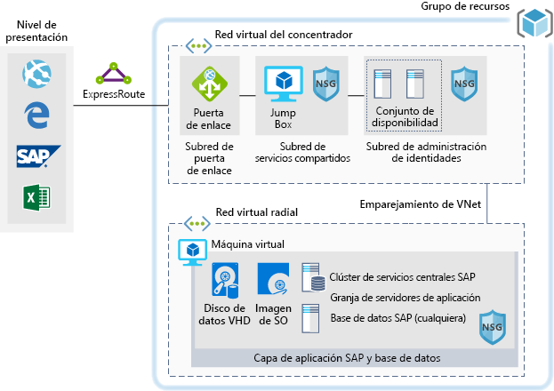

# Entornos de desarrollo y pruebas para cargas de trabajo SAP en Azure

En este ejemplo se muestra cómo establecer un entorno de desarrollo y pruebas para SAP NetWeaver en un entorno Windows o Linux en Azure. La base de datos empleada es AnyDB, el término de SAP para todos los sistemas de administración de bases de datos compatibles (que no sean SAP HANA). Dado que esta arquitectura está diseñada para entornos que no son de producción, se implementa con una sola máquina virtual (VM) y se puede cambiar su tamaño para adaptarse a las necesidades de su organización.

Para casos de uso de producción, revise las arquitecturas de referencia de SAP que están disponibles a continuación:

* [SAP NetWeaver para AnyDB][sap-netweaver]
* [SAP S/4Hana][sap-hana]
* [SAP en Azure (instancias grandes)][sap-large]

## Casos de uso pertinentes

Otros casos de uso pertinentes incluyen:

* Cargas de trabajo no productivas de instancias de SAP no importantes (espacio aislado, desarrollo, prueba, control de calidad)
* Cargas de trabajo empresariales de SAP no críticas

## Arquitectura

Este escenario muestra el aprovisionamiento de una sola base de datos del sistema SAP y del servidor de aplicaciones de SAP en una sola máquina virtual. Los datos fluyen por el escenario de la siguiente manera:

1. Los clientes usan la interfaz de usuario de SAP u otras herramientas de cliente (Excel, un explorador web u otra aplicación web) para tener acceso al sistema SAP basado en Azure.
2. La conectividad se proporciona mediante una conexión de ExpressRoute establecida. La conexión de ExpressRoute finaliza en Azure, en la puerta de enlace de ExpressRoute. El tráfico de red se enruta a través de la puerta de enlace de ExpressRoute hacia la subred de la puerta de enlace y desde esta a la subred de aplicaciones de nivel spoke (consulte el patrón [hub-and-spoke][hub-spoke]) y a través de una puerta de enlace de seguridad de red hacia la máquina virtual de la aplicación SAP.
3. Los servidores de administración de identidades proporcionan servicios de autenticación.
4. JumpBox proporciona funcionalidades de administración local.

### Componentes

* Las [redes virtuales](/azure/virtual-network/virtual-networks-overview) son la base de las comunicaciones de red dentro de Azure.
* [Máquina virtual](/azure/virtual-machines/windows/overview): Azure Virtual Machines proporciona una infraestructura bajo demanda, a gran escala, segura y virtualizada con servidores Windows o Linux.
* [ExpressRoute](/azure/expressroute/expressroute-introduction) permite ampliar las redes locales en la nube de Microsoft a través de una conexión privada que facilita un proveedor de conectividad.
* Los [grupos de seguridad de red](/azure/virtual-network/security-overview) le permiten limitar el tráfico a los recursos de una red virtual. Un grupo de seguridad de red contiene una lista de reglas de seguridad que permiten o deniegan el tráfico de red entrante o saliente en función de las direcciones IP de origen o destino, el puerto y el protocolo. 
* Los [grupos de recursos](/azure/azure-resource-manager/resource-group-overview#resource-groups) actúan como contenedores lógicos de recursos de Azure.

## Consideraciones

### Disponibilidad

 Microsoft ofrece un Acuerdo de Nivel de Servicio (SLA) para instancias únicas de máquina virtual. Para más información, consulte el [Acuerdo de Nivel de Servicio de Microsoft Azure para máquinas virtuales](https://azure.microsoft.com/support/legal/sla/virtual-machines)

### Escalabilidad

Para obtener instrucciones generales sobre cómo diseñar soluciones escalables, consulte la [lista de comprobación de escalabilidad][scalability] en el centro de arquitectura de Azure.

### Seguridad

Para obtener instrucciones generales sobre el diseño de soluciones seguras, consulte la [documentación de seguridad de Azure][security].

### Resistencia

Para obtener instrucciones generales sobre el diseño de soluciones resistentes, consulte [Diseño de aplicaciones resistentes de Azure][resiliency].

## Precios

Para ayudarle a explorar el costo de ejecución de este escenario, todos los servicios están preconfigurados en los siguientes ejemplos de la calculadora de costos. Para ver cómo cambiarían los precios en su caso concreto, cambie las variables pertinentes para que coincidan con el tráfico esperado.

Se proporcionan cuatro ejemplos de perfiles de costo según la cantidad de tráfico que se espera recibir:

|Tamaño|SAP|Tipo de máquina virtual|Storage|Calculadora de precios de Azure|
|----|----|-------|-------|---------------|
|Pequeña|8000|D8s_v3|2xP20, 1xP10|[Pequeño](https://azure.com/e/9d26b9612da9466bb7a800eab56e71d1)|
|Mediano|16000|D16s_v3|3xP20, 1xP10|[Mediano](https://azure.com/e/465bd07047d148baab032b2f461550cd)|
grande|32000|E32s_v3|3xP20, 1xP10|[Grande](https://azure.com/e/ada2e849d68b41c3839cc976000c6931)|
Extragrande|64000|M64s|4xP20, 1xP10|[Extragrande](https://azure.com/e/975fb58a965c4fbbb54c5c9179c61cef)|

> [!NOTE]
> Estos precios son una guía que solo indica los costos de las máquinas virtuales y el almacenamiento. Se excluyen las redes, el almacenamiento de copia de seguridad y los cargos de entrada y salida de datos.

* [Pequeño](https://azure.com/e/9d26b9612da9466bb7a800eab56e71d1): un sistema pequeño que consta de una máquina virtual del tipo D8s_v3 con 8 vCPU, 32 GB de RAM y almacenamiento temporal de 200 GB, además de dos discos de almacenamiento premium de 512 GB y uno de 128 GB.
* [Mediano](https://azure.com/e/465bd07047d148baab032b2f461550cd): un sistema mediano que consta de una máquina virtual del tipo D16s_v3 con 16 vCPU, 64 GB de RAM y almacenamiento temporal de 400 GB, además de tres discos de almacenamiento premium de 512 GB y uno de 128 GB.
* [Grande](https://azure.com/e/ada2e849d68b41c3839cc976000c6931): un sistema grande que consta de una máquina virtual del tipo E32s_v3 con 32 vCPU, 256 GB de RAM y almacenamiento temporal de 512 GB, además de tres discos de almacenamiento premium de 512 GB y uno de 128 GB.
* [Extragrande](https://azure.com/e/975fb58a965c4fbbb54c5c9179c61cef): un sistema extra grande que consta de una máquina virtual del tipo M64s con 64 vCPU, 1024 GB de RAM y almacenamiento temporal de 2000 GB, además de cuatro discos de almacenamiento premium de 512 GB y uno de 128 GB.

## Implementación

Haga clic aquí para implementar la infraestructura subyacente para este escenario.

> [!NOTE]
> SAP y Oracle no se instalan durante esta implementación. Debe implementar estos componentes por separado.

<!-- links -->
[resiliency]: /azure/architecture/resiliency/
[security]: /azure/security/
[scalability]: /azure/architecture/checklist/scalability
[sap-netweaver]: /azure/architecture/reference-architectures/sap/sap-netweaver
[sap-hana]: /azure/architecture/reference-architectures/sap/sap-s4hana
[sap-large]: /azure/architecture/reference-architectures/sap/hana-large-instances
[hub-spoke]: /azure/architecture/reference-architectures/hybrid-networking/hub-spoke
