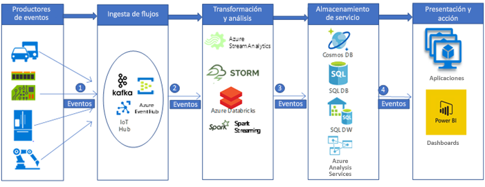

# Ingesta y procesamiento de datos de IoT de automoción en tiempo real

Este escenario de ejemplo crea una canalización de ingesta y procesamiento de datos en tiempo real para ingerir y procesar mensajes desde dispositivos de IoT (en general, sensores) en una plataforma de análisis de macrodatos en Azure. Las plataformas de ingesta y procesamiento de datos telemáticos de vehículos son la clave para crear soluciones de automóvil conectado. Este escenario específico viene motivado por los sistemas de ingesta y procesamiento de datos telemáticos del automóvil. Sin embargo, los patrones de diseño son apropiados para varios sectores que utilizan sensores para administrar y supervisar sistemas complejos en industrias como edificios inteligentes, comunicaciones, fabricación, venta directa y asistencia sanitaria.

En este ejemplo se muestra una canalización de ingesta y procesamiento de datos en tiempo real para mensajes procedentes de los dispositivos de IoT instalados en los vehículos. Los dispositivos y sensores de IoT generan miles y millones de mensajes (o eventos). Al capturar y analizar estos mensajes, podemos descifrar información valiosa y tomar las medidas adecuadas. Por ejemplo, con automóviles equipados con dispositivos telemáticos, si podemos capturar los mensajes del dispositivo (IoT) en tiempo real, podríamos supervisar la ubicación de los vehículos en vivo, planear rutas optimizadas, proporcionar asistencia a los conductores y proveer compatibilidad con sectores relacionados con la telemática, como los seguros de automóviles.

Para esta demostración de ejemplo, imagine una empresa automovilística que desea crear un sistema en tiempo real para ingerir y procesar mensajes de dispositivos telemáticos. Los objetivos de la empresa incluyen:
* Ingerir y almacenar datos en tiempo real procedentes de los dispositivos y sensores de los vehículos.
* Analizar los mensajes para conocer la ubicación del vehículo y otra información emitida mediante diferentes tipos de sensores (por ejemplo, sensores relacionados con el motor y sensores de entorno).
* Almacenar los datos después del análisis para otro procesamiento posterior para proporcionar información útil (por ejemplo, en escenarios de accidentes, las agencias de seguros pueden estar interesadas en saber qué ha sucedido durante un accidente, etc).

## Casos de uso pertinentes

Otros casos de uso pertinentes incluyen:

* Recordatorios y alertas de mantenimiento del vehículo.
* Servicios basados en la ubicación para los pasajeros del vehículo (es decir, servicios de asistencia).
* Vehículos autónomos (conducción automática).

## Arquitectura

En una implementación de canalización de procesamiento de macrodatos típica, los datos fluyen de izquierda a derecha. En esta canalización de procesamiento de macrodatos en tiempo real, los datos fluyen por la solución del modo siguiente:

1. Los eventos generados a partir de los orígenes de datos de IoT se envían a la capa de ingesta de flujo mediante Kafka de Azure HDInsight como un flujo de mensajes. Kafka de HDInsight almacena los flujos de datos en temas durante un tiempo configurable.
2. El consumidor de Kafka, Azure Databricks, recoge el mensaje en tiempo real desde el tema de Kafka para procesar los datos según la lógica de negocio y, a continuación, puede enviarlo a la capa de servicios para su almacenamiento.
3. Los servicios de almacenamiento subsiguientes, como Azure Cosmos DB, Azure SQL Data Warehouse o Azure SQL DB, a continuación, serán un origen de datos para la capa de presentación y acción.
4. Los analistas de negocios pueden usar Microsoft Power BI para analizar los datos del almacén. También se pueden crear otras aplicaciones sobre la capa de servicios. Por ejemplo, podemos exponer API basadas en los datos de la capa de servicios para su uso por terceros.

### Componentes
Los eventos generados por los dispositivos de IoT (datos o mensajes) se ingieren, procesan y, a continuación, se almacenan para análisis, presentación y acciones posteriores mediante los siguientes componentes de Azure:
* [Apache Kafka en HDInsight](/azure/hdinsight/kafka/apache-kafka-introduction) está en la capa de ingesta. Los datos se escriben en el tema de Kafka mediante una API de productor de Kafka.
* [Azure Databricks](/services/databricks) se encuentra en la capa de transformación y análisis. Los cuadernos de Databricks implementan una API de consumidor de Kafka para leer los datos desde el tema de Kafka.
* [Azure Cosmos DB](/services/cosmos-db), [Azure SQL Database](/azure/sql-database/sql-database-technical-overview) y Azure SQL Data Warehouse se encuentran en la capa de almacenamiento del servicio, en la que Azure Databricks puede escribir los datos mediante conectores de datos.
* [Azure SQL Data Warehouse](/azure/sql-data-warehouse/sql-data-warehouse-overview-what-is) es un sistema distribuido para almacenar y analizar grandes conjuntos de datos. Su uso del procesamiento paralelo masivo (MPP) lo hace idóneo para ejecutar análisis de alto rendimiento.
* [Power BI](https://docs.microsoft.com/power-bi) es un conjunto de herramientas de análisis de negocios que sirve para analizar datos y compartir conocimientos. Power BI puede consultar un modelo semántico almacenado en Analysis Services o SQL Data Warehouse directamente.
* [Azure Active Directory (Azure AD)](/azure/active-directory) autentica a los usuarios al conectarse a [Azure Databricks](https://azure.microsoft.com/services/databricks). Si se desea crear un cubo en [Analysis Services](/azure/analysis-services) según el modelo basado en los datos de Azure SQL Data Warehouse, podríamos usar AAD para conectarse al servidor de Analysis Services mediante Power BI. Data Factory puede usar también Azure AD para autenticarse en SQL Data Warehouse mediante el uso de una entidad de servicio o de Managed Service Identity (MSI).
* Se puede utilizar [Azure App Services](/azure/app-service/app-service-web-overview), en particular [Aplicación de API](/services/app-service/api), para exponer los datos a terceros, en función de los datos almacenados en la capa de servicios.

## Alternativas

Se podría implementar una canalización de macrodatos más generalizada mediante otros componentes de Azure.
* En la capa de ingesta de flujo, podríamos usar [IoT Hub](https://azure.microsoft.com/services/iot-hub) o [Event Hubs](https://azure.microsoft.com/services/event-hubs) en lugar de [Kafka de HDInsight](/azure/hdinsight/kafka/apache-kafka-introduction) para ingerir los datos.
* En la capa de transformación y análisis, podríamos usar [HDInsight Storm](/azure/hdinsight/storm/apache-storm-overview), [HDInsight Spark](/azure/hdinsight/spark/apache-spark-overview) o [Azure Stream Analytics](https://azure.microsoft.com/services/stream-analytics).
* [Analysis Services](/azure/analysis-services) proporciona un modelo semántico para los datos. También puede aumentar el rendimiento del sistema al analizar los datos. Puede crear el modelo en función de los datos de Azure DW.

## Consideraciones

Las tecnologías de esta arquitectura se eligieron en función de la escala necesaria para procesar los eventos, el SLA de los servicios, la administración de costos y la facilidad de administración de los componentes.
* [Kafka de HDInsight](/azure/hdinsight/kafka/apache-kafka-introduction) administrado viene con un SLA del 99,9% y se integra con Azure Managed Disks
* [Azure Databricks](/azure/azure-databricks/what-is-azure-databricks) está optimizado desde cero para el rendimiento y la rentabilidad en la nube. El entorno de ejecución de Databricks agrega varias funcionalidades clave para las cargas de trabajo de Apache Spark que pueden aumentar el rendimiento y reducir los costos en un factor entre 10 y 100 cuando se ejecuta en Azure e incluye:
* Azure Databricks se integra totalmente con los almacenes y las bases de datos de Azure: [Azure SQL Data Warehouse](/azure/sql-data-warehouse), [Azure Cosmos DB](https://azure.microsoft.com/services/cosmos-db), [Azure Data Lake Storage](https://azure.microsoft.com/services/storage/data-lake-storage) y [Azure Blob Storage](https://azure.microsoft.com/services/storage/blobs)
    * Escalabilidad y finalización automáticas de los clústeres de Spark para minimizar automáticamente los costos.
    * Optimizaciones de rendimiento como el almacenamiento en caché, la indexación y la optimización de consultas avanzada, que pueden mejorar el rendimiento en un factor entre 10 y 100 frente a las implementaciones tradicionales de Apache Spark en la nube o en el entorno local.
    * La integración con Azure Active Directory permite ejecutar soluciones completas basadas en Azure con Azure Databricks.
    * El acceso basado en rol de Azure Databricks permite permisos de usuario específicos para los cuadernos, los clústeres, los trabajos y los datos.
    * Viene con Acuerdos de Nivel de Servicio de clase empresarial.
* Azure Cosmos DB es la base de datos multimodelo de distribución global de Microsoft. Azure Cosmos DB se creó desde el principio con la distribución global y el escalado horizontal como características fundamentales. Ofrece distribución global llave en mano en cualquier número de regiones de Azure, con un proceso transparente de escalado y replicación de los datos dondequiera que estén los usuarios. Puede escalar el rendimiento y el almacenamiento de forma elástica en todo el mundo y pagar solo por la cantidad que necesite.
* La arquitectura de procesamiento paralelo masivo de SQL Data Warehouse proporciona escalabilidad y alto rendimiento.
* Azure SQL Data Warehouse tiene Acuerdos de Nivel de Servicio garantizados y procedimientos recomendados para una alta disponibilidad.
* Cuando haya poca actividad de análisis, la empresa puede escalar Azure SQL Data Warehouse a petición, lo que reduce o incluso pausa el proceso para reducir los costos.
* El modelo de seguridad de Azure SQL Data Warehouse proporciona seguridad de conexión, autenticación y autorización a través de la autenticación de Azure AD o SQL Server y el cifrado.

## Precios

Revise los [precios de Azure Databricks](https://azure.microsoft.com/pricing/details/databricks), los [precios de Azure HDInsight](https://azure.microsoft.com/pricing/details/hdinsight) y el [ejemplo de precios para un escenario de almacenamiento de datos](https://azure.com/e/b798fb70c53e4dd19fdeacea4db78276) con la calculadora de precios de Azure. Ajuste los valores para ver cómo afectan los requisitos a los costos.
* [Azure HDInsight](/azure/hdinsight) es un servicio en la nube totalmente administrado que logra que el procesamiento de grandes cantidades de datos sea sencillo, rápido y rentable
* [Azure Databricks](https://azure.microsoft.com/services/databricks) ofrece dos cargas de trabajo diferentes en varias [instancias de máquina virtual](https://azure.microsoft.com/pricing/details/databricks/#instances) adaptadas a su flujo de trabajo de análisis de datos: la carga de trabajo Ingeniería de datos facilita a los ingenieros de datos la creación y ejecución de trabajos, mientras que la carga de trabajo Análisis de datos facilita a los científicos de datos la exploración, la visualización, la manipulación y el uso compartido de datos y de conocimiento de forma interactiva.
* [Azure Cosmos DB](https://azure.microsoft.com/services/cosmos-db) garantiza valores de latencia inferiores a 10 milisegundos en el percentil 99 en cualquier parte del mundo, ofrece [varios modelos de coherencia bien definidos](/azure/cosmos-db/consistency-levels) para ajustar el rendimiento y garantiza alta disponibilidad con funciones de multi-homing, todo ello respaldado por los [Acuerdos de Nivel de Servicio](https://azure.microsoft.com/support/legal/sla/cosmos-db) (SLA) más completos del sector.
* [Azure SQL Data Warehouse](https://azure.microsoft.com/pricing/details/sql-data-warehouse/gen2) permite escalar los niveles de proceso y almacenamiento por separado. Los recursos de proceso se cobran por hora; además, estos recursos se pueden escalar o pausar a petición. Los recursos de almacenamiento se facturan por terabyte, por lo que los costos aumentan con la ingesta de datos.
* [Analysis Services](https://azure.microsoft.com/pricing/details/analysis-services) está disponible en los planes de tarifa estándar, básico y desarrollador. Las instancias se pagan en función de las unidades de procesamiento de consultas (QPU) y la memoria disponible. Para mantener los costos más bajos, minimice el número de consultas que ejecuta, la cantidad de datos que procesan y la frecuencia de ejecución.
* [Power BI](https://powerbi.microsoft.com/pricing) tiene opciones de producto diferentes para distintos requisitos. [Power BI Embedded](https://azure.microsoft.com/pricing/details/power-bi-embedded) proporciona una opción basada en Azure para insertar la funcionalidad de Power BI en las aplicaciones. En el precio de ejemplo anterior se incluye una instancia de Power BI Embedded.

## Pasos siguientes

* Revise la arquitectura de referencia del [análisis en tiempo real](https://azure.microsoft.com/solutions/architecture/real-time-analytics) que incluye el flujo de la canalización de macrodatos.
* Revise la arquitectura de referencia del [análisis avanzado de macrodatos](https://azure.microsoft.com/solutions/architecture/advanced-analytics-on-big-data) para obtener una visión sobre cómo pueden ayudar los diferentes componentes de Azure a crear una canalización de macrodatos.
* Consulte la documentación de Azure de [procesamiento en tiempo Real](/azure/architecture/data-guide/big-data/real-time-processing) para obtener una vista rápida de cómo ayudan los distintos componentes de Azure en el procesamiento de flujos de datos en tiempo real.
* En la [Guía de arquitectura de datos de Azure](/azure/architecture/data-guide) encontrará información estructural completa sobre las canalizaciones de datos, el almacenamiento de datos, el procesamiento analítico en línea (OLAP) y los macrodatos.
