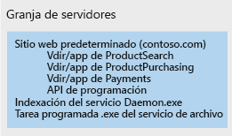
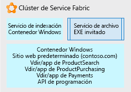

# Uso de Service Fabric para descomponer aplicaciones monolíticasUsing Service Fabric to decompose monolithic applications

En este escenario de ejemplo, analizaremos un enfoque que usa [Service Fabric](/azure/service-fabric/service-fabric-overview) como plataforma para descomponer una aplicación monolítica difícil de manejar.In this example scenario, we walk through an approach using [Service Fabric](/azure/service-fabric/service-fabric-overview) as a platform for decomposing an unwieldy monolithic application. Se considera un enfoque iterativo para descomponer un sitio web de IIS/ASP.NET en una aplicación formada por varios microservicios fáciles de administrar.Here we consider an iterative approach to decomposing an IIS/ASP.NET web site into an application composed of multiple, manageable microservices.

El cambio de una arquitectura monolítica a una arquitectura de microservicios ofrece las siguientes ventajas:Moving from a monolithic architecture to a microservice architecture provides the following benefits:

- Puede cambiar una unidad pequeña y comprensible de código e implementar solo dicha unidad.You can change one small, understandable unit of code and deploy only that unit.
- Cada unidad de código requiere solo unos pocos minutos o menos para su implementación.Each code unit requires just a few minutes or less to deploy.
- Si se produce un error en esa unidad pequeña, solo esa unidad deja de funcionar, no toda la aplicación.If there is an error in that small unit, only that unit stops working, not the whole application.
- Las unidades pequeñas de código se pueden distribuir de forma discreta y fácil entre varios equipos de desarrollo.Small units of code can be distributed easily and discretely among multiple development teams.
- Los nuevos desarrolladores pueden entender rápida y fácilmente la funcionalidad discreta de cada unidad.New developers can quickly and easily grasp the discrete functionality of each unit.

En este ejemplo se usa una aplicación de IIS grande en una granja de servidores, pero los conceptos de descomposición iterativa y de hospedaje se pueden usar para cualquier tipo de aplicación de gran tamaño.A large IIS application on a server farm is used in this example, but the concepts of iterative decomposition and hosting can be used for any type of large application. Aunque esta solución usa Windows, también se puede ejecutar Service Fabric en Linux.While this solution uses Windows, Service Fabric can also run on Linux. Se puede ejecutar de forma local, en Azure o en nodos de máquina virtual en el proveedor en la nube de su elección.It can be run on-premises, in Azure, or on VM nodes in the cloud provider of your choice.

## Casos de uso pertinentesRelevant use cases

Este escenario es apropiado para organizaciones con grandes aplicaciones web monolíticas que están experimentando:This scenario is relevant to organizations with large monolithic Web applications that are experiencing:

- Errores en pequeños cambios de código que interrumpen todo el sitio web.Errors in small code changes that break the entire website.
- La versiones tardan varios días debido a la necesidad de liberar la actualización todo el sitio web.Releases taking multiple days due to the need to release update the entire website.
- Largos tiempos de preparación al incorporar nuevos desarrolladores o equipos debido al complejo código base, que requiere que un usuario individual conozca más de lo que es posible.Long ramp-up times when onboarding new developers or teams due to the complex code base, requiring a single individual to know more than is feasible.

## ArquitecturaArchitecture

Mediante el uso de Service Fabric como plataforma de hospedaje podemos convertir un sitio web de IIS de gran tamaño en una colección de microservicios, como se muestra a continuación:Using Service Fabric as the hosting platform, we can convert a large IIS web site into a collection of microservices as shown below:

En la imagen anterior, se descomponen todas las partes de una aplicación de IIS de gran tamaño en:In the picture above, we decomposed all the parts of a large IIS application into:

- Un servicio de enrutamiento o de puerta de enlace que acepta las solicitudes entrantes del explorador, las analiza para determinar qué servicio debería procesarlas y reenvía la solicitud a ese servicio.A routing or gateway service that accepts incoming browser requests, parses them to determine what service should handle them, and forwards the request to that service.
- Cuatro aplicaciones ASP.NET Core que eran anteriormente directorios virtuales de un único sitio IIS que se ejecutan como aplicaciones ASP.NET.Four ASP.NET Core applications that were formally virtual directories under the single IIS site running as ASP.NET applications. Las aplicaciones se han separado en sus propios microservicios independientes.The applications were separated into their own independent microservices. El efecto es que se pueden modificar, generar versiones y actualizar por separado.The effect is that they can be changed, versioned, and upgraded separately. En este ejemplo, se ha vuelto a escribir cada aplicación con .Net Core y ASP.NET Core.In this example, we rewrote each application using .Net Core and ASP.NET Core. Se han escrito como [Reliable Services](/azure/service-fabric/service-fabric-reliable-services-introduction) para que puedan acceder de forma nativa a las funcionalidades completas de la plataforma de Service Fabric y sus ventajas (servicios de comunicación, informes de mantenimiento, notificaciones, etc).These were written as [Reliable Services](/azure/service-fabric/service-fabric-reliable-services-introduction) so they can natively access the full Service Fabric platform capabilities and benefits (communication services, health reports, notifications, etc.).
- Un servicio de Windows llamado *servicio de indexación*, situado en un contenedor Windows para que no haga más cambios directos en el registro del servidor subyacente, pero que se puede ejecutar de manera independiente y se implementa con todas sus dependencias como una única unidad.A Windows service called *Indexing Service*, placed in a Windows container so that it no longer makes direct changes to registry of the underlying server, but can run self-contained and be deployed with all its dependencies as a single unit.
- Un servicio de archivo, que es simplemente un archivo ejecutable que se ejecuta según una programación y realiza algunas tareas para los sitios.An Archive service, which is just an executable that runs according to a schedule and performs some tasks for the sites. Se hospeda directamente como un ejecutable independiente porque se ha determinado que realiza su función sin modificaciones y no vale la pena invertir en cambios.It is hosted directly as a stand-alone executable because we determined it does what it needs to do without modification and it is not worth the investment to change.

## ConsideracionesConsiderations

El primer desafío consiste en empezar a identificar fragmentos de código más pequeños que se pueden extraer de la estructura monolítica para formar microservicios a los que esta puede llamar.The first challenge is to begin to identify smaller bits of code that can be factored out from the monolith into microservices that the monolith can call. De forma iterativa en el tiempo, la estructura monolítica se divide en una colección de estos microservicios que los desarrolladores pueden comprender fácilmente, cambiar e implementar rápidamente con un riesgo mínimo.Iteratively over time, the monolith is broken up into a collection of these microservices that developers can easily understand, change, and quickly deploy at low risk.

Se eligió Service Fabric porque es capaz de admitir la ejecución de todos los microservicios en sus diversas formas.Service Fabric was chosen because it is capable of supporting running all the microservices in their various forms. Por ejemplo, puede tener una combinación de ejecutables independientes, nuevos sitios web pequeños, nuevas API pequeñas, servicios en contenedores, etc. Service Fabric puede combinar todos estos tipos de servicio en un único clúster.For example you may have a mix of stand-alone executables, new small web sites, new small APIs, and containerized services, etc. Service Fabric can combine all these service types onto a single cluster.

Para llegar a esta aplicación final descompuesta, se ha utilizado un enfoque iterativo.To get to this final, decomposed application, we used an iterative approach. Partimos de un sitio web de IIS/ASP.NET grande en una granja de servidores.We started with a large IIS/ASP.NET web site on a server farm. A continuación, se muestra un único nodo de la granja de servidores.A single node of the server farm is pictured below. Contiene el sitio web original con varios directorios virtuales, un servicio de Windows adicional al que el sitio llama y un archivo ejecutable que efectúa cierto mantenimiento de archivo del sitio de forma periódica.It contains the original web site with several virtual directories, an additional Windows Service the site calls, and an executable that does some periodic site archive maintenance.

En la primera iteración de desarrollo, el sitio de IIS y los directorios virtuales se colocan en un [contenedor Windows](/azure/service-fabric/service-fabric-containers-overview).On the first development iteration, the IIS site and its virtual directories placed in a [Windows Container](/azure/service-fabric/service-fabric-containers-overview). Esto permite que el sitio permanezca operativo, pero no está enlazado estrechamente con el sistema operativo del nodo de servidor subyacente.Doing this allows the site to remain operational, but not tightly bound to the underlying server node OS. El nodo de Service Fabric subyacente ejecuta y orquesta el contenedor, pero el nodo no tiene que tener ningún estado del que dependa el sitio (entradas del registro, archivos, etc.).The container is run and orchestrated by the underlying Service Fabric node, but the node does not have to have any state that the site is dependent on (registry entries, files, etc.). Todos estos elementos están en el contenedor.All of those items are in the container. También se ha colocado el servicio de indexación en un contenedor de Windows por las mismas razones.We have also placed the Indexing service in a Windows Container for the same reasons. Los contenedores se pueden ser implementar, generar versiones y escalar de forma independiente.The containers can be deployed, versioned, and scaled independently. Por último, se hospeda el servicio de archivo como un [archivo ejecutable independiente](/azure/service-fabric/service-fabric-guest-executables-introduction) simple, ya que es un archivo .exe independiente sin requisitos especiales.Finally, we hosted the Archive Service a simple [stand-alone executable file](/azure/service-fabric/service-fabric-guest-executables-introduction) since it is a self-contained .exe with no special requirements.

La siguiente imagen muestra cómo se descompone parcialmente el sitio web grande en unidades independientes listas para descomponerse más cuando el tiempo lo permita.The picture below shows how our large web site is now partially decomposed into independent units and ready to be decomposed more as time allows.

El desarrollo posterior se centra en separar el contenedor del sitio web predeterminado de gran tamaño descrito anteriormente.Further development focuses on separating the single large Default Web site container pictured above. Cada una de las aplicaciones ASP.NET del directorio virtual se eliminan del contenedor de una en una y se migran a [Reliable Services](/azure/service-fabric/service-fabric-reliable-services-introduction) de ASP.NET Core.Each of the virtual directory ASP.NET apps is removed from the container one at a time and ported to ASP.NET Core [reliable services](/azure/service-fabric/service-fabric-reliable-services-introduction).

Después de extraer cada uno de los directorios virtuales, el sitio web predeterminado se escribe como una instancia de Reliable Services de ASP.NET Core, que acepta solicitudes entrantes del explorador y las enruta a la aplicación ASP.NET correcta.Once each of the virtual directories has been factored out, the Default Web site is written as an ASP.NET Core reliable service, which accepts incoming browser requests and routes them to the correct ASP.NET application.

### Disponibilidad, escalabilidad y seguridadAvailability, Scalability, and Security

Service Fabric es [capaz de admitir distintas formas de microservicios](/azure/service-fabric/service-fabric-choose-framework) y de conservar al mismo tiempo la facilidad y la velocidad de las llamadas entre ellos en el mismo clúster.Service Fabric is [capable of supporting various forms of microservices](/azure/service-fabric/service-fabric-choose-framework) while keeping calls between them on the same cluster fast and simple. Service Fabric es un clúster de recuperación automática y [tolerancia a errores](/azure/service-fabric/service-fabric-availability-services) que puede ejecutar contenedores, archivos ejecutables e incluso tiene una API nativa para escribir microservicios directamente en ella (el modelo de programación "Reliable Services" mencionado anteriormente).Service Fabric is a [fault tolerant](/azure/service-fabric/service-fabric-availability-services), self-healing cluster that can run containers, executables, and even has a native API for writing microservices directly to it (the 'Reliable Services' referred to above). La plataforma facilita las actualizaciones graduales y el control de versiones de cada microservicio.The platform facilitates rolling upgrades and versioning of each microservice. Puede indicar a la plataforma que ejecute más o menos instancias de cualquier microservicio específico distribuido en el clúster de Service Fabric para [escalar](/azure/service-fabric/service-fabric-concepts-scalability) solo los microservicios que necesita.You can tell the platform to run more or fewer of any given microservice distributed across the Service Fabric cluster in order to [scale](/azure/service-fabric/service-fabric-concepts-scalability) in or out only the microservices you need.

Service Fabric es un clúster basado en una infraestructura de nodos virtuales (o físicos) que tiene redes, almacenamiento y un sistema operativo.Service Fabric is a cluster built on an infrastructure of virtual (or physical) nodes, which have networking, storage, and an operating system. Por lo tanto, tiene un conjunto de tareas administrativas, de mantenimiento y de supervisión.As such, it has a set of administrative, maintenance, and monitoring tasks.

También conviene que considere el gobierno y control del clúster.You'll also want to consider governance and control of the cluster. Del mismo modo que no querría que los usuarios implementaran bases de datos de forma arbitraria en el servidor de base de datos de producción, no querrá que se implementen aplicaciones en el clúster de Service Fabric sin supervisión.Just as you would not want people arbitrarily deploying databases to your production database server, neither would you want people deploying applications to the Service Fabric cluster without some oversight.

Service Fabric puede hospedar distintos [escenarios de aplicación](/azure/service-fabric/service-fabric-application-scenarios); tómese un tiempo para ver las que son aplicables en su escenario.Service Fabric is capable of hosting many different [application scenarios](/azure/service-fabric/service-fabric-application-scenarios), take some time to see which ones apply to your scenario.

## PreciosPricing

Para un clúster de Service Fabric hospedado en Azure, la mayor parte del costo procede del número y tamaño de los nodos del clúster.For a Service Fabric cluster hosted in Azure, the largest part of the cost is the number and size of the nodes in your cluster. Azure permite crear de forma rápida y sencilla un clúster compuesto por el tamaño de nodo subyacente que especifique, pero los cargos de proceso se basan en el tamaño del nodo multiplicado por el número de nodos.Azure allows quick and simple creation of a cluster composed of the underlying node size you specify, but the compute charges are based on the node size multiplied by the number of nodes.

Otros componentes de menor costo son los cargos de almacenamiento por los discos virtuales de cada nodo y los cargos de salida de E/S de red desde Azure (por ejemplo, el tráfico de red que sale de Azure y va al explorador del usuario).Other less costly components of cost are the storage charges for each node's virtual disks and network IO egress charges from Azure (for example network traffic out of Azure to a user's browser).

Para hacerse una idea del costo, se ha creado un ejemplo que usa algunos valores predeterminados para el tamaño del clúster, las redes y el almacenamiento: Eche un vistazo a la [Calculadora de precios](https://azure.com/e/52dea096e5844d5495a7b22a9b2ccdde).To get an idea of cost, we have created an example using some default values for cluster size, networking, and storage: Take a look at the [pricing calculator](https://azure.com/e/52dea096e5844d5495a7b22a9b2ccdde). No dude en actualizar los valores predeterminados de esta calculadora por los correspondientes a su situación.Feel free to update the values in this default calculator to those relevant to your situation.

## Pasos siguientesNext Steps

Tómese tiempo para familiarizarse con la plataforma y revise la [documentación](/azure/service-fabric/service-fabric-overview) y los distintos [escenarios de aplicaciones](/azure/service-fabric/service-fabric-application-scenarios) para Service Fabric.Take some time to familiarize yourself with the platform by going through the [documentation](/azure/service-fabric/service-fabric-overview) and reviewing the many different [application scenarios](/azure/service-fabric/service-fabric-application-scenarios) for Service Fabric. La documentación le indicará de qué consta un clúster, lo que se puede ejecutar en él, la arquitectura de software y el mantenimiento.The documentation will tell you what a cluster consists of, what it can run on, software architecture, and maintenance for it.

Para ver una demostración de Service Fabric para una aplicación de .NET existente, implemente la [guía de inicio rápido](/azure/service-fabric/service-fabric-quickstart-dotnet) de Service Fabric.To see a demonstration of Service Fabric for an existing .NET application, deploy the Service Fabric [quickstart](/azure/service-fabric/service-fabric-quickstart-dotnet).

Desde la perspectiva de la aplicación actual, comience a pensar sobre sus diferentes funciones.From the standpoint of your current application, begin to think about its different functions. Elija una de ellas y piense en cómo se puede separar solo esa función del conjunto.Choose one of them and think through how you can separate only that function from the whole. Tome una pieza discreta y comprensible cada vez.Take it one discrete, understandable, piece at a time.

## Recursos relacionadosRelated resources

- [Creación de microservicios en AzureBuilding Microservices on Azure](/azure/architecture/microservices)
- [Introducción a Service FabricService Fabric Overview](/azure/service-fabric/service-fabric-overview)
- [Modelo de programación de Service FabricService Fabric Programming Model](/azure/service-fabric/service-fabric-choose-framework)
- [Disponibilidad de Service FabricService Fabric Availability](/azure/service-fabric/service-fabric-availability-services)
- [Escalado de Service FabricScaling Service Fabric](/azure/service-fabric/service-fabric-concepts-scalability)
- [Hospedaje de contenedores en Service FabricHosting Containers in Service Fabric](/azure/service-fabric/service-fabric-containers-overview)
- [Hospedaje de archivos ejecutables independientes en Service FabricHosting Stand-Alone Executables in Service Fabric](/azure/service-fabric/service-fabric-guest-executables-introduction)
- [Reliable Services nativo de Service FabricService Fabric Native Reliable Services](/azure/service-fabric/service-fabric-reliable-services-introduction)
- [Escenarios de aplicación de Service FabricService Fabric Application Scenarios](/azure/service-fabric/service-fabric-application-scenarios)