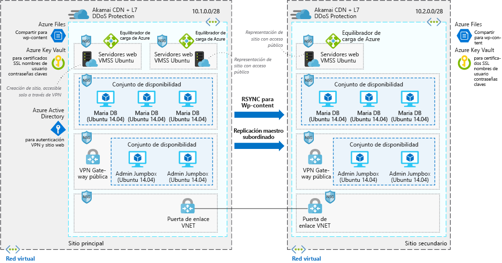

# Sitio web altamente escalable y seguro de WordPressHighly scalable and secure WordPress website

Este escenario de ejemplo es aplicable a las empresas que necesitan una instalación segura y altamente escalable de WordPress.This example scenario is applicable to companies that need a highly scalable and secure installation of WordPress. Este escenario se basa en una implementación que utilizó para una gran convención y se pudo escalar correctamente para satisfacer el incremento del tráfico que las sesiones generaban en el sitio.This scenario is based on a deployment that was used for a large convention and was successfully able to scale to meet the spike traffic that sessions drove to the site.

## Casos de uso pertinentesRelevant use cases

Tenga en cuenta este escenario para los casos de uso siguientes:Consider this scenario for the following use cases:

* Eventos de medios que provocan picos de tráfico.Media events that cause traffic surges.
* Blogs que usan WordPress como su sistema de administración de contenido.Blogs that use WordPress as their content management system.
* Sitios web de empresa o de comercio electrónico que usan WordPress.Business or e-commerce websites that use WordPress.
* Sitios web creados con otros sistemas de administración de contenido.Web sites built using other content management systems.

## ArquitecturaArchitecture

Este escenario incluye una instalación segura y escalable de WordPress que utiliza servidores web de Ubuntu y MariaDB.This scenario covers a scalable and secure installation of WordPress that uses Ubuntu web servers and MariaDB. Hay dos flujos de datos distintos en este escenario, el primero son los usuarios que acceden al sitio web:There are two distinct data flows in this scenario the first is users access the website:

1. Los usuarios acceden al sitio web front-end a través de una red CDN.Users access the front-end website through a CDN.
2. La red CDN usa un equilibrador de carga de Azure como origen y extrae los datos que no se almacenan en caché desde allí.The CDN uses an Azure load balancer as the origin, and pulls any data that isn't cached from there.
3. El equilibrador de carga de Azure distribuye las solicitudes a los conjuntos de escalado de máquinas virtuales de servidores web.The Azure load balancer distributes requests to the virtual machine scale sets of web servers.
4. La aplicación WordPress extrae cualquier información dinámica de los clústeres de MariaDB; todo el contenido estático se hospeda en Azure Files.The WordPress application pulls any dynamic information out of the Maria DB clusters, all static content is hosted in Azure Files.
5. Las claves SSL se almacenan en Azure Key Vault.SSL keys are stored Azure Key Vault.

El segundo flujo de trabajo es cómo contribuyen los autores al nuevo contenido:The second workflow is how authors contribute new content:

1. Los autores de conectan de forma segura a la puerta de enlace de VPN pública.Authors connect securely to the public VPN gateway.
2. La información de autenticación de VPN se almacena en Azure Active Directory.VPN authentication information is stored in Azure Active Directory.
3. A continuación, se establece una conexión con el JumpBox de administración.A connection is then established to the Admin jump boxes.
4. Desde el JumpBox de administración, el autor puede conectarse al equilibrador de carga de Azure para la creación de clústeres.From the admin jump box, the author is then able to connect to the Azure load balancer for the authoring cluster.
5. El equilibrador de carga de Azure distribuye el tráfico a los conjuntos de escalado de máquinas virtuales de servidores web que tienen acceso de escritura al clúster de MariaDB.The Azure load balancer distributes traffic to the virtual machine scale sets of web servers that have write access to the Maria DB cluster.
6. El nuevo contenido estático se carga en los archivos de Azure y el contenido dinámico se escribe en el clúster de MariaDB.New static content is uploaded to Azure files and dynamic content is written into the Maria DB cluster.
7. Estos cambios se replican, a continuación, en la región alternativa mediante rsync o la replicación maestro/subordinado.These changes are then replicated to the alternate region via rsync or master/slave replication.

### ComponentesComponents

* [Azure Content Delivery Network (CDN)](/azure/cdn/cdn-overview) es una red distribuida de servidores que proporciona contenido web a los usuarios de manera eficaz.[Azure Content Delivery Network (CDN)](/azure/cdn/cdn-overview) is a distributed network of servers that efficiently delivers web content to users. Las redes CDN minimizan la latencia al guardar contenido almacenado en caché en servidores perimetrales en ubicaciones de punto de presencia cercanas a los usuarios finales.CDNs minimize latency by storing cached content on edge servers in point-of-presence locations near to end users.
* [Las redes virtuales](/azure/virtual-network/virtual-networks-overview) permiten que varios recursos como, por ejemplo, máquinas virtuales, se puedan comunicar de forma segura entre ellos, con Internet y con redes locales.[Virtual networks](/azure/virtual-network/virtual-networks-overview) allow resources such as VMs to securely communicate with each other, the Internet, and on-premises networks. Las redes virtuales proporcionan aislamiento y segmentación, filtrado y enrutamiento de tráfico, y permiten la conexión entre ubicaciones.Virtual networks provide isolation and segmentation, filter and route traffic, and allow connection between locations. Las dos redes están conectadas mediante emparejamiento de VNET.The two networks are connected via Vnet peering.
* Los [grupos de seguridad de red](/azure/virtual-network/security-overview) contienen una lista de reglas de seguridad que permiten o deniegan el tráfico entrante o saliente en función de las direcciones IP de origen o destino, el puerto y el protocolo.[Network security groups](/azure/virtual-network/security-overview) contain a list of security rules that allow or deny inbound or outbound network traffic based on source or destination IP address, port, and protocol. Las redes virtuales de este escenario se protegen con reglas de grupo de seguridad de red que restringen el flujo de tráfico entre los componentes de la aplicación.The virtual networks in this scenario are secured with network security group rules that restrict the flow of traffic between the application components.
* Los [equilibradores de carga](/azure/load-balancer/load-balancer-overview) distribuyen el tráfico entrante según reglas y sondeos de mantenimiento.[Load balancers](/azure/load-balancer/load-balancer-overview) distribute inbound traffic according to rules and health probes. Una instancia de Load Balancer proporciona baja latencia y alto rendimiento, y puede escalar hasta millones de flujos para todas las aplicaciones TCP y UDP.A load balancer provides low latency and high throughput, and scales up to millions of flows for all TCP and UDP applications. En este escenario, se utiliza un equilibrador de carga para distribuir el tráfico de la red de entrega de contenido a los servidores web front-end.A load balancer is used in this scenario to distribute traffic from the content deliver network to the front-end web servers.
* Los [conjuntos de escalado de máquinas virtuales][docs-vmss] permiten crear y administrar un grupo de máquinas virtuales idénticas con equilibrio de carga.[Virtual machine scale sets][docs-vmss] let you create and manage a group of identical load-balanced VMs. El número de instancias de máquina virtual puede aumentar o disminuir automáticamente según la demanda, o de acuerdo a una programación definida.The number of VM instances can automatically increase or decrease in response to demand or a defined schedule. En este escenario se utilizan dos conjuntos de escalado de máquinas virtuales independientes: uno para servidores web front-end que sirven contenido y otro para servidores web front-end utilizados para crear nuevo contenido.Two separate virtual machine scale sets are used in this scenario - one for the front-end web-servers serving content, and one for the front-end webservers used to author new content.
* [Azure Files](/azure/storage/files/storage-files-introduction) proporciona un recurso compartido de archivos totalmente administrados en la nube que hospeda todo el contenido de WordPress en este escenario, para que todas las máquinas virtuales tengan acceso a los datos.[Azure Files](/azure/storage/files/storage-files-introduction) provides a fully-managed file share in the cloud that hosts all of the WordPress content in this scenario, so that all of the VMs have access to the data.
* [Azure Key Vault](/azure/key-vault/key-vault-overview) se usa para almacenar y controlar estrechamente el acceso a las contraseñas, certificados y claves.[Azure Key Vault](/azure/key-vault/key-vault-overview) is used to store and tightly control access to passwords, certificates, and keys.
* [Azure Active Directory (Azure AD)](/azure/active-directory/fundamentals/active-directory-whatis) es un directorio multiinquilino, basado en la nube y un servicio de administración de identidades.[Azure Active Directory (Azure AD)](/azure/active-directory/fundamentals/active-directory-whatis) is a multi-tenant, cloud-based directory and identity management service. En este escenario, Azure AD proporciona servicios de autenticación para el sitio web y los túneles VPN.In this scenario, Azure AD provides authentication services for the website and the VPN tunnels.

### AlternativasAlternatives

* [SQL Server para Linux](/azure/virtual-machines/linux/sql/sql-server-linux-virtual-machines-overview) puede reemplazar el almacén de datos de MariaDB.[SQL Server for Linux](/azure/virtual-machines/linux/sql/sql-server-linux-virtual-machines-overview) can replace the MariaDB data store.
* [Azure Database for MySQL](/azure/mysql/overview) puede reemplazar el almacén de datos de MariaDB si prefiere una solución totalmente administrada.[Azure database for MySQL](/azure/mysql/overview) can replace the MariaDB data store if you prefer a fully managed solution.

## ConsideracionesConsiderations

### DisponibilidadAvailability

Las instancias de máquinas virtuales de este escenario están implementadas en varias regiones, con los datos replicados entre las dos a través de RSYNC para el contenido de WordPress y replicación maestro/subordinado para los clústeres de MariaDB.The VM instances in this scenario are deployed across multiple regions, with the data replicated between the two via RSYNC for the WordPress content and master slave replication for the MariaDB clusters.

Para ver otros temas de disponibilidad, consulte la [lista de comprobación de disponibilidad][availability] que encontrará en Azure Architecture Center.For other availability topics, see the [availability checklist][availability] in the Azure Architecture Center.

### EscalabilidadScalability

Este escenario utiliza conjuntos de escalado de máquinas virtuales para los dos clústeres de servidores web front-end en cada región.This scenario uses virtual machine scale sets for the two front-end web server clusters in each region. Con los conjuntos de escalado, el número de instancias de máquina virtual que se ejecutan en la capa de aplicación de front-end se puede escalar de forma automática en respuesta a la demanda del cliente, o según una programación definida.With scale sets, the number of VM instances that run the front-end application tier can automatically scale in response to customer demand, or based on a defined schedule. Para más información, consulte [Introducción al escalado automático con conjuntos de escalado de máquinas virtuales][docs-vmss-autoscale].For more information, see [Overview of autoscale with virtual machine scale sets][docs-vmss-autoscale].

El back-end es un clúster de MariaDB en un conjunto de disponibilidad.The back end is a MariaDB cluster in an availability set. Para más información, consulte el [tutorial sobre clústeres de MariaDB][mariadb-tutorial].For more information, see the [MariaDB cluster tutorial][mariadb-tutorial].

Para ver otros temas de escalabilidad, consulte la [lista de comprobación de escalabilidad][scalability] que encontrará en el centro de arquitectura de Azure.For other scalability topics, see the [scalability checklist][scalability] in the Azure Architecture Center.

### SeguridadSecurity

Los grupos de seguridad de red protegen todo el tráfico de la red virtual hacia la capa de aplicación de front-end.All the virtual network traffic into the front-end application tier and protected by network security groups. Las reglas limitan el flujo de tráfico de forma que solo las instancias de máquinas virtuales de la capa de aplicación de front-end pueden acceder al nivel de la base de datos de back-end.Rules limit the flow of traffic so that only the front-end application tier VM instances can access the back-end database tier. No se permite ningún tráfico de Internet saliente procedente del nivel de la base de datos.No outbound Internet traffic is allowed from the database tier. Para reducir la superficie de ataque, no hay ningún puerto de administración remota directa abierto.To reduce the attack footprint, no direct remote management ports are open. Para más información, consulte [Grupos de seguridad de red de Azure][docs-nsg].For more information, see [Azure network security groups][docs-nsg].

Para obtener instrucciones generales sobre el diseño de escenarios seguros, consulte la [documentación de seguridad de Azure][security].For general guidance on designing secure scenarios, see the [Azure Security Documentation][security].

### ResistenciaResiliency

Junto con el uso de múltiples regiones, la replicación de datos y los conjuntos de escalado de máquinas virtuales, este escenario utiliza equilibradores de carga de Azure.In combination with the use of multiple regions, data replication and virtual machine scale sets, this scenario uses Azure load balancers. Estos componentes de redes distribuyen el tráfico a las instancias de máquinas virtuales conectadas e incluyen sondeos de estado que garantizan que el tráfico solo se distribuye a las máquinas virtuales correctas.These networking components distribute traffic to the connected VM instances, and include health probes that ensure traffic is only distributed to healthy VMs. Todos estos componentes de red están dirigidos a través de una red CDN.All of these networking components are fronted via a CDN. Esto hace que los recursos y aplicaciones de red sean resistentes frente a problemas que, de lo contrario, interrumpirían el tráfico y afectarían al acceso de los usuarios finales.This makes the networking resources and application resilient to issues that would otherwise disrupt traffic and impact end-user access.

Para obtener instrucciones generales sobre el diseño de escenarios resistentes, consulte [Diseño de aplicaciones resistentes de Azure][resiliency].For general guidance on designing resilient scenarios, see [Designing resilient applications for Azure][resiliency].

## PreciosPricing

Para explorar el costo de ejecutar este escenario, todos los servicios están preconfigurados en la calculadora de costos.To explore the cost of running this scenario, all of the services are pre-configured in the cost calculator. Para ver cómo cambiarían los precios en su caso concreto, cambie las variables pertinentes para que coincidan con el tráfico esperado.To see how the pricing would change for your particular use case, change the appropriate variables to match your expected traffic.

Hemos proporcionado un [perfil de costo][pricing] previamente configurado basado en el diagrama de arquitectura proporcionado anteriormente.We have provided a pre-configured [cost profile][pricing] based on the architecture diagram provided above. Para configurar la calculadora de precios para el caso de uso, hay un par de puntos importantes que se deben tener en cuenta:To configure the pricing calculator for your use case, there are a couple main things to consider:

* ¿Cuánto tráfico espera en términos de GB/mes?How much traffic are you expecting in terms of GB/month? La cantidad de tráfico tendrá el impacto más importante en el costo, ya que afectará al número de máquinas virtuales necesarias para mostrar los datos en el conjunto de escalado de máquinas virtuales.The amount of traffic will have the biggest impact on your cost, as it will impact the number of VMs that are required to surface the data in the virtual machine scale set. Además, estará directamente correlacionado con la cantidad de datos que se muestran a través de la red CDN.Additionally, it will directly correlate with the amount of data that is surfaced via the CDN.
* ¿Qué cantidad de datos nuevos va a escribir en su sitio web?How much new data are you going to be writing to your website? Los datos nuevos escritos en el sitio web están correlacionados con la cantidad de datos que se reflejan entre las regiones.New data written to your website correlates with how much data is mirrored across the regions.
* ¿Qué parte de su contenido es dinámico?How much of your content is dynamic? ¿Qué parte es estática?How much is static? La varianza entre el contenido dinámico y estático influye en la cantidad de datos que se van a recuperar de la capa de base de datos frente a la cantidad de datos que se almacenará en caché en la red CDN.The variance around dynamic and static content influences how much data has to be retrieved from the database tier versus how much will be cached in the CDN.

<!-- links -->
[architecture]: ./media/architecture-secure-scalable-wordpress.png
[mariadb-tutorial]: /azure/virtual-machines/linux/classic/mariadb-mysql-cluster
[docs-vmss]: /azure/virtual-machine-scale-sets/overview
[docs-vmss-autoscale]: /azure/virtual-machine-scale-sets/virtual-machine-scale-sets-autoscale-overview
[docs-nsg]: /azure/virtual-network/security-overview
[security]: /azure/security/
[availability]: ../../checklist/availability.md
[resiliency]: /azure/architecture/resiliency/
[scalability]: /azure/architecture/checklist/scalability
[pricing]: https://azure.com/e/a8c4809dab444c1ca4870c489fbb196b
