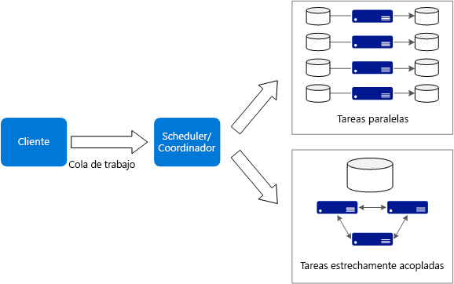
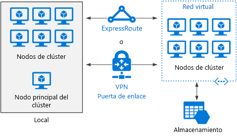

# Estilo de arquitectura Big Compute

El término *Big Compute* describe cargas de trabajo a gran escala que requieren un gran número de núcleos, a menudo cientos o miles. Los escenarios incluyen representación de imágenes, dinámica de fluidos, modelado de riesgos financieros, exploración petrolífera, diseño de fármacos y análisis de esfuerzos en ingeniería, entre otros.

Estas son algunas características típicas de las aplicaciones Big Compute:

- El trabajo se puede dividir en tareas discretas, que se pueden ejecutar simultáneamente en numerosos núcleos.
- Cada tarea está limitada. Toma una entrada, realiza un procesamiento y genera una salida. Toda la aplicación se ejecuta durante una cantidad limitada de tiempo (de minutos a días). Un patrón común consiste en aprovisionar un gran número de núcleos en una ráfaga y reducir luego hasta cero una vez que se complete la aplicación. 
- La aplicación no debe permanecer activa de manera ininterrumpida. Sin embargo, el sistema debe controlar los errores de nodo o los bloqueos de aplicación.
- Para algunas aplicaciones, las tareas son independientes y se pueden ejecutar en paralelo. En otros casos, las tareas están estrechamente acopladas, lo que significa que deben interactuar o intercambiar resultados intermedios. En ese caso, considere la posibilidad de utilizar tecnologías de redes de alta velocidad como InfiniBand y acceso directo a memoria remota (RDMA). 
- En función de la carga de trabajo, puede usar tamaños de máquinas virtuales de proceso intensivo (H16r, H16mr y A9).

## Cuándo utilizar esta arquitectura

- En operaciones de cálculo intensivas como simulación y procesamiento de números.
- En simulaciones de cálculo intensivas y que se deben dividir entre CPU de varios equipos (de decenas a miles).
- En simulaciones que requieren gran cantidad de memoria para un equipo y que se deben dividir en varios equipos.
- En cálculos de ejecución prolongada que tardarían demasiado tiempo en finalizar en un único equipo.
- En cálculos más pequeños que se deben ejecutar cientos o miles de veces, como simulaciones Monte Carlo.

## Ventajas

- Alto rendimiento con procesamiento "[embarazosamente paralelo][embarrassingly-parallel]".
- Puede aprovechar cientos o miles de núcleos de equipos para resolver problemas de gran tamaño con mayor rapidez.
- Acceso a hardware especializado de alto rendimiento, con redes dedicadas de alta velocidad InfiniBand.
- Puede aprovisionar máquinas virtuales según sea necesario para trabajar y luego anularlas. 

## Desafíos

- Administración de la infraestructura de la máquina virtual.
- Administración del volumen del procesamiento de números. 
- Aprovisionamiento de miles de núcleos de manera puntual.
- Para tareas estrechamente acopladas, agregar más núcleos puede provocar un rendimiento decreciente. Es posible que deba experimentar para encontrar el número de núcleos óptimo.

## Big compute con Azure Batch

[Azure Batch][batch] es un servicio administrado para ejecutar aplicaciones a gran escala y de informática de alto rendimiento (HPC).

Con Azure Batch, configura un grupo de máquinas virtuales, y carga las aplicaciones y los archivos de datos. A continuación, el servicio Batch aprovisiona las máquinas virtuales, asigna tareas a estas, ejecuta las tareas y supervisa el progreso. Batch puede escalar horizontalmente las máquinas virtuales de forma automática en respuesta a la carga de trabajo. Batch también proporciona la programación de trabajos.

 

## Big Compute en ejecución en máquinas virtuales

Puede usar [Microsoft HPC Pack][hpc-pack] para administrar un clúster de máquinas virtuales, así como programar y supervisar trabajos de HPC. Con este enfoque, debe aprovisionar y administrar las máquinas virtuales y la infraestructura de red. Tenga en cuenta este enfoque si tienen cargas de trabajo de HPC existentes y desea mover algunas o todas a Azure. Puede mover todo el clúster de HPC a Azure o mantener el clúster de HPC en modo local pero usar Azure para la capacidad de ráfaga. Para más información, consulte [Soluciones de Batch y HPC para cargas de trabajo de procesos a gran escala][batch-hpc-solutions].

### HPC Pack implementado en Azure

En este escenario, el clúster de HPC se crea por completo dentro de Azure.

 
 
El nodo principal proporciona servicios de programación de trabajos y de administración para el clúster. Para tareas estrechamente acopladas, use una red RDMA que proporcione un ancho de banda muy alto y una comunicación de baja latencia entre las máquinas virtuales. Para más información, consulte [Implementación de un clúster de HPC Pack 2016 en Azure][deploy-hpc-azure].

### Expansión de clúster de HPC a Azure

En este escenario, una organización ejecuta HPC Pack local y usa máquinas virtuales de Azure para la capacidad de ráfaga. El nodo principal del clúster es local. ExpressRoute o VPN Gateway conecta la red local a la red virtual de Azure.

 

[batch]: /azure/batch/
[batch-hpc-solutions]: /azure/batch/batch-hpc-solutions
[deploy-hpc-azure]: /azure/virtual-machines/windows/hpcpack-2016-cluster
[embarrassingly-parallel]: https://en.wikipedia.org/wiki/Embarrassingly_parallel
[hpc-pack]: https://technet.microsoft.com/library/cc514029

 
