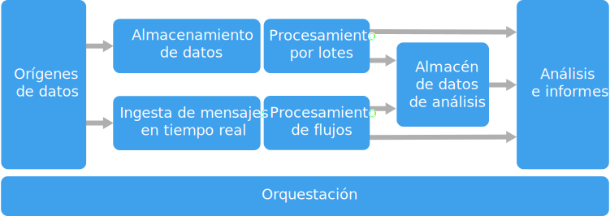

# Estilo de arquitectura de macrodatos

Una arquitectura de macrodatos está diseñada para controlar la ingesta, el procesamiento y el análisis de datos que son demasiado grandes o complejos para los sistemas de bases de datos tradicionales.

 Las soluciones de macrodatos suelen implicar uno o varios de los tipos siguientes de cargas de trabajo:

- Procesamiento por lotes de orígenes de macrodatos en reposo.
- Procesamiento en tiempo real de macrodatos en movimiento.
- Exploración interactiva de macrodatos.
- Análisis predictivo y aprendizaje automático.

La mayoría de las arquitecturas de macrodatos incluyen algunos de los componentes siguientes (o todos ellos):

- **Orígenes de datos**: todas las soluciones de macrodatos se inician con uno o varios orígenes de datos. Algunos ejemplos son:

    - Almacenes de datos de aplicación, como bases de datos relacionales.
    - Archivos estáticos generados por aplicaciones, como archivos de registro de servidor web.
    - Orígenes de datos en tiempo real, como dispositivos de IoT.

- **Almacenamiento de datos**: los datos de las operaciones de procesamiento por lotes se almacenan normalmente en un almacén de archivos distribuido que puede contener importantes cantidades de archivos grandes en diferentes formatos. Este tipo de almacén se suele denominar *Data Lake*. Las opciones para implementar este almacenamiento son Azure Data Lake Store o lo contenedores de blob en Azure Storage. 

- **Procesamiento por lotes**: como los conjuntos de datos son tan grandes, a menudo una solución de macrodatos debe procesar los archivos de datos mediante trabajos por lotes de ejecución prolongada para filtrar, agregar o bien preparar los datos para su análisis. Normalmente estos trabajos implican leer archivos de código fuente, procesarlos y escribir la salida en nuevos archivos. Las opciones incluyen la ejecución de trabajos de U-SQL en Azure Data Lake Analytics, el uso de Hive, Pig o trabajos personalizados de Map/Reduce en un clúster de HDInsight Hadoop, o el uso de programas de Java, Scala o Python en un clúster de HDInsight Spark.

- **Ingesta de mensajes en tiempo real**: si la solución incluye orígenes en tiempo real, la arquitectura debe incluir una manera de capturar y almacenar los mensajes en tiempo real para el procesamiento de secuencias. Podría tratarse de un sencillo almacén de datos, donde se colocan los mensajes entrantes en una carpeta para su procesamiento. Sin embargo, muchas soluciones necesitan un almacén de ingesta de mensajes para que actúe como búfer de mensajes y para admitir el procesamiento de escalabilidad horizontal, la entrega confiable y otra semántica de puesta en cola de mensajes. Entre las opciones se encuentra Azure Event Hubs, Azure IoT Hubs y Kafka.

- **Procesamiento de flujos**: una vez capturados los mensajes en tiempo real, la solución debe procesarlos filtrando, agregando o bien preparando los datos para su análisis. Los datos de secuencias procesados se escriben entonces en un receptor de salida. Azure Stream Analytics proporciona un servicio de procesamiento de secuencias administrado basado en consultas SQL de ejecución permanente que operan en secuencias sin enlazar. También puede utilizar tecnologías de streaming de código abierto como Storm y Spark Streaming en un clúster de HDInsight.

- **Almacén de datos analíticos**: muchas soluciones de macrodatos preparan los datos para el análisis y luego sirven los datos procesados en un formato estructurado que se puede consultar mediante herramientas de análisis. El almacén de datos analíticos que se utiliza para atender estas consultas puede ser un almacén de datos relacional de estilo Kimball, como se ve en la mayoría de soluciones tradicionales de inteligencia empresarial. También es posible que los datos se presenten a través de una tecnología NoSQL de baja latencia como HBase, o una base de datos de Hive interactiva que proporciona una abstracción de metadatos sobre los archivos de datos en el almacén de datos distribuidos. Azure SQL Data Warehouse proporciona un servicio administrado para el almacenamiento de datos a gran escala basado en la nube. HDInsight admite Interactive Hive, HBase y Spark SQL, que también se puede utilizar para proporcionar datos par el análisis.

- **Análisis y creación de informes**: el objetivo de la mayoría de soluciones de macrodatos consiste en proporcionar información sobre los datos a través de análisis e informes. Para permitir que los usuarios analicen los datos, la arquitectura puede incluir una capa de modelado de datos, como un cubo OLAP multidimensional o un modelo de datos tabulares en Azure Analysis Services. También podría admitir inteligencia empresarial con características de autoservicio mediante las tecnologías de modelado y visualización en Microsoft Power BI o Microsoft Excel. Los análisis y la creación de informes también pueden adoptar la forma de exploración interactiva de datos por parte de científicos o analistas de datos. En estos casos, muchos servicios de Azure admiten bloc de notas analíticos, como Jupyter, lo cual permite a estos usuarios aprovechar sus conocimientos existentes con Python o R. En el caso de la exploración de datos a gran escala, puede utilizar Microsoft R Server, tanto de manera independiente como con Spark.

- **Coordinación**: la mayoría de las soluciones de macrodatos constan de operaciones de procesamiento de datos repetidas, encapsuladas en flujos de trabajo, que transforman los datos de origen, mueven datos entre varios orígenes y receptores, cargan los datos procesados en un almacén de datos analítico o envían los resultados directamente a un informe o un panel. Para automatizar estos flujos de trabajo, puede utilizar una tecnología de coordinación como Azure Data Factory o Apache Oozie y Sqoop.

Azure incluye muchos servicios que se pueden usar en una arquitectura de macrodatos. Se dividen aproximadamente en dos categorías:

- Servicios administrados, como Azure Data Lake Store, Azure Data Lake Analytics, Azure Data Warehouse, Azure Stream Analytics, Azure Event Hub, Azure IoT Hub y Azure Data Factory.
- Tecnologías de código abierto basadas en la plataforma de Apache Hadoop, como HDFS, HBase, Hive, Pig, Spark, Storm, Oozie, Sqoop y Kafka. Estas tecnologías están disponibles en Azure en el servicio Azure HDInsight.

Estas opciones no son mutuamente excluyentes, y muchas soluciones combinan las tecnologías de código abierto con servicios de Azure.

## Cuándo utilizar esta arquitectura

Considere este estilo de arquitectura cuando necesite:

- Almacenar y procesar datos en volúmenes demasiado grandes para una base de datos tradicional.
- Transformar datos no estructurados para el análisis y la creación de informes.
- Capturar, procesar y analizar flujos no asociados de datos en tiempo real, o con una latencia baja.
- Usar Azure Machine Learning o Microsoft Cognitive Services.

## Ventajas

- **Opciones de tecnología**. Puede mezclar y combinar servicios administrados de Azure y tecnologías de Apache en clústeres de HDInsight, a fin de aprovechar los conocimientos existentes o las inversiones en tecnología.
- **Rendimiento mediante paralelismo**. Las soluciones de macrodatos aprovechan el paralelismo, habilitando soluciones de alto rendimiento que escalan a grandes volúmenes de datos.
- **Escalado elástico** Todos los componentes de la arquitectura de macrodatos admiten el aprovisionamiento de escalabilidad horizontal, de manera que puede ajustar la solución para cargas de trabajo pequeñas o grandes y pagar solo por los recursos que use.
- **Interoperabilidad con soluciones existentes**. Los componentes de la arquitectura de macrodatos también se usan para el procesamiento de IoT y las soluciones de inteligencia empresarial en las compañías, lo que le permite crear una solución integrada entre las cargas de trabajo de datos.

## Desafíos

- **Complejidad**. Las soluciones de macrodatos pueden ser muy complejas, con numerosos componentes para controlar la ingesta de datos procedentes de varios orígenes de datos. Puede resultar complicado compilar, probar y solucionar problemas derivados de los procesos de macrodatos. Además, puede haber un gran número de valores de configuración entre varios sistemas que se deben utilizar con el fin de optimizar el rendimiento.
- **Conjunto de habilidades**. Muchas tecnologías de macrodatos están muy especializadas y usan marcos de trabajo y lenguajes que no son habituales en arquitecturas de aplicación más generales. Por otro lado, las tecnologías de macrodatos están desarrollando nuevas API que se basan en lenguajes más establecidos. Por ejemplo, el lenguaje U-SQL de Azure Data Lake Analytics se basa en una combinación de Transact-SQL y C#. De forma similar, las API basadas en SQL están disponibles para Hive, HBase y Spark.
- **Consolidación tecnológica**. Muchas de las tecnologías utilizadas en macrodatos están evolucionando. Mientras que tecnologías básicas de Hadoop como Hive y Pig se han estabilizado, las nuevas tecnologías como Spark introducen amplios cambios y mejoras con cada nueva versión. Los servicios administrados como Azure Data Lake Analytics y Azure Data Factory son relativamente jóvenes en comparación con otros servicios de Azure, y probablemente evolucionarán con el tiempo.
- **Seguridad**. Las soluciones de macrodatos normalmente dependen del almacenamiento de todos los datos estáticos en una instancia de Data Lake centralizada. La protección del acceso a estos datos puede ser complicada, especialmente cuando los datos deben ser recibidos y utilizados por varias aplicaciones y plataformas.

## Prácticas recomendadas

- **Aproveche el paralelismo**. Las tecnologías de procesamiento de macrodatos distribuyen la carga de trabajo entre varias unidades de procesamiento. Esto requiere que los archivos de datos estáticos se creen y almacenen en un formato divisible. Los sistemas de archivos distribuidos, como HDFS, pueden optimizar el rendimiento de lectura y escritura, y el procesamiento real se lleva a cabo por varios nodos de clúster en paralelo, lo cual reduce los tiempos de trabajo global.

- **Cree particiones de datos**. El procesamiento por lotes normalmente tiene lugar según una programación periódica; por ejemplo, semanal o mensualmente. Cree particiones de archivos de datos y estructuras de datos, como tablas, en función de periodos temporales que coinciden con la programación del procesamiento. Con esto se simplifica la programación de trabajos y la ingesta de datos y se facilita la solución de problemas. Ademas, la creación de particiones en tablas que se usan en consultas de Hive, U-SQL o SQL pueden mejorar sustancialmente el rendimiento de las consultas.

- **Aplique la semántica de esquema en lectura**. El uso de una instancia de Data Lake permite combinar el almacenamiento de archivos en varios formatos, ya sea estructurados, semiestructurados o no estructurados. Use la semántica de *esquema en lectura*, que proyecta un esquema en los datos cuando estos se procesan, no cuando se almacenan. Esto agrega flexibilidad a la solución y evita los cuellos de botella durante la ingesta de datos causados por la validación de datos y la comprobación de tipos.

- **Procese los datos in situ**. Las soluciones tradicionales de inteligencia empresarial suelen usar un proceso de extracción, transformación y carga para mover datos a un almacén de datos. Con datos de volúmenes más grandes y una gran variedad de formatos, las soluciones de macrodatos normalmente usan variaciones del proceso de extracción, transformación y carga; por ejemplo, cambiando el orden a transformación, extracción y carga. Con este planteamiento, los datos se procesan en el almacén de datos distribuidos, transformándolos a la estructura necesaria, antes de mover los datos transformados a un almacén de datos analíticos.

- **Equilibre los costes de uso y tiempo**. En el caso de los trabajos de procesamiento por lotes, es importante tener en cuenta dos factores: el costo por unidad de los nodos de proceso y el costo por minuto del uso de esos nodos para completar el trabajo. Por ejemplo, un trabajo por lotes puede tardar ocho horas con cuatro nodos de clúster. Sin embargo, podría ocurrir que el trabajo utilice los cuatro nodos solo durante las dos primeras horas y, después, solo fueran necesarios dos nodos. En ese caso, la ejecución de todo el trabajo en dos nodos podría aumentar el tiempo total del trabajo, pero no lo duplicaría, por lo que el coste total sería menor. En algunos escenarios empresariales, un mayor tiempo de procesamiento puede ser preferible al mayor costo de contar con recursos de clúster infrautilizados

- **Separe los recursos de clúster**. Al implementar clústeres de HDInsight, normalmente conseguirá un mejor rendimiento mediante el aprovisionamiento de recursos de clúster por separado para cada tipo de carga de trabajo. Por ejemplo, aunque los clústeres de Spark incluyen Hive, si necesita realizar procesamientos exhaustivos con Hive y Spark, probablemente le convenga implementar clústeres de Spark y Hadoop dedicados de manera independiente. De forma similar, si usa HBase y Storm para el procesamiento de secuencias de baja latencia y también Hive para el procesamiento por lotes, considere la posibilidad de disponer de clústeres independientes para Storm, HBase y Hadoop.

- **Coordine la ingesta de datos**. En algunos casos, las aplicaciones empresariales existentes pueden escribir archivos de datos para el procesamiento por lotes directamente en los contenedores de blobs de Azure Storage, donde los pueden utilizar HDInsight o Azure Data Lake Analytics. Sin embargo, a menudo necesitará coordinar la ingesta de datos desde orígenes de datos externos o locales en la instancia de Data Lake. Utilice un flujo de trabajo o una canalización de coordinación, como los que admite Azure Data Factory o bien Oozie, a fin de lograr esto de forma predecible y fácil de administrar centralmente.

- **Omita los datos confidenciales al principio**. El flujo de trabajo de la ingesta de datos debería omitir los datos confidenciales al principio del proceso a fin de evitar su almacenamiento en la instancia de Data Lake.
