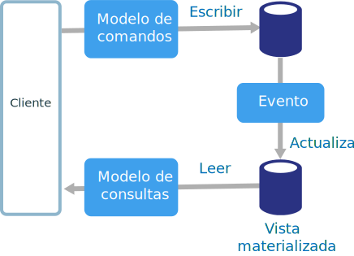
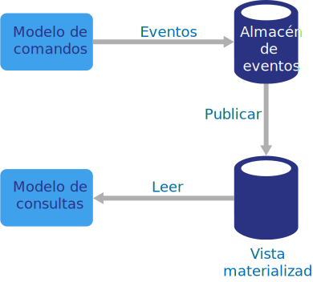

# Estilo de arquitectura CQRS

La segregación de responsabilidades de consultas y comandos (CQRS) es un estilo de arquitectura que separa las operaciones de lectura de las operaciones de escritura. 

En las arquitecturas tradicionales, se utiliza el mismo modelo de datos para consultar y actualizar una base de datos. Es sencillo y funciona bien para las operaciones CRUD básicas. Sin embargo, en aplicaciones más complejas, este enfoque puede resultar difícil de manejar. Por ejemplo, en el lado de lectura, la aplicación puede realizar muchas consultas diferentes y devolver objetos de transferencia de datos (DTO) con distintas formas. La asignación de objetos puede llegar a ser algo complicado. En el lado de escritura, el modelo puede implementar una validación y una lógica de negocios complejas. En consecuencia, puede acabar con un modelo excesivamente complejo que haga demasiado.

Otro posible problema es que las cargas de trabajo de lectura y escritura suelen ser asimétricas, con requisitos de rendimiento y escalabilidad muy diferentes. 

CQRS aborda estos problemas mediante la separación de lecturas y escrituras en modelos independientes, con **comandos** para actualizar datos y **consultas** para leer datos.

- Los comandos deberían basarse en tareas, en lugar de centrarse en datos. ("Reservar habitación de hotel" y no "Establecer ReservationStatus en Reservado"). Los comandos se pueden colocar en una cola para un procesamiento asincrónico, en lugar de que se procesen de forma sincrónica.

- Las consultas nunca modifican la base de datos. Una consulta devuelve un DTO que no encapsula ningún conocimiento del dominio.

Para lograr un mayor aislamiento, puede separar físicamente los datos de lectura de los datos de escritura. En ese caso, la base de datos de lectura puede utilizar su propio esquema de datos que está optimizado para las consultas. Por ejemplo, puede almacenar una [vista materializada][materialized-view] de los datos para evitar combinaciones complejas o asignaciones del asignador relacional de objetos complejas. Incluso puede usar un tipo de almacén de datos diferente. Por ejemplo, la base de datos de escritura puede ser relacional, mientras que la base de datos de lectura es una base de datos de documentos.

Si se utilizan bases de datos de escritura y de lectura independientes, se deben mantener sincronizados. Normalmente esto se consigue haciendo que el modelo de escritura publique un evento cada vez que actualiza la base de datos. La actualización de la base de datos y la publicación del evento deben tener lugar en una sola transacción. 

Algunas implementaciones de CQRS utilizan el [patrón Event Sourcing][event-sourcing]. Con este patrón, el estado de la aplicación se almacena como una secuencia de eventos. Cada evento representa un conjunto de cambios en los datos. El estado actual se construye mediante la reproducción de los eventos. En un contexto de CQRS, una ventaja de Event Sourcing es que se pueden utilizar los mismos eventos para notificar otros componentes, en particular, para notificar el modelo de lectura. El modelo de lectura utiliza los eventos para crear una instantánea del estado actual, que es más eficaz para las consultas. Sin embargo, Event Sourcing agrega complejidad al diseño.

## Cuándo utilizar esta arquitectura

Considere la posibilidad de utilizar CQRS para los dominios de colaboración en los que varios usuarios tienen acceso a los mismos datos, especialmente cuando las cargas de trabajo de lectura y escritura son asimétricas.

CQRS no es una arquitectura de nivel superior que se aplica a todo un sistema. Aplique CQRS solo a aquellos subsistemas en los que se obtiene un valor evidente de la separación de lecturas y escrituras. En caso contrario, está creando una complejidad adicional pero sin obtener ventaja alguna.

## Ventajas

- **Escalado de forma independiente**. CQRS permite las cargas de trabajo de lectura y escritura que se escalen de forma independiente, lo que puede dar lugar a menos contenciones de bloqueo.
- **Esquemas de datos optimizados.**  El lado de lectura puede usar un esquema que está optimizado para las consultas, mientras que el lado de escritura utiliza un esquema que está optimizado para las actualizaciones.  
- **Seguridad**. Es más fácil asegurarse de que solo las entidades de dominio correctas realicen escrituras en los datos.
- **Separación de cuestiones**. La separación de los lados de lectura y escritura puede dar lugar a modelos que sean más flexibles y fáciles de mantener. La mayor parte de la lógica de negocios compleja entra en el modelo de escritura. El modelo de lectura puede ser relativamente sencillo.
- **Consultas más sencillas**. Al almacenar una vista materializada en la base de datos de lectura, la aplicación puede evitar combinaciones complejas cuando realiza consultas.

## Desafíos

- **Complejidad**. La idea básica de CQRS es sencilla. Pero puede generar un diseño de aplicación más complejo, especialmente si incluye el patrón Event Sourcing.

- **Mensajería**. Aunque CQRS no requiere mensajería, es normal usarla para procesar comandos y publicar eventos de actualización. En ese caso, la aplicación debe gestionar errores de mensaje o mensajes duplicados. 

- **Coherencia final**. Si separa las bases de datos de lectura y escritura, los datos de lectura pueden estar obsoletos. 

## Prácticas recomendadas

- Para más información acerca de cómo implementar CQRS, consulte [Patrón CQRS][cqrs-pattern].

- Considere la posibilidad de usar el patrón [Event Sourcing][event-sourcing] para evitar conflictos de actualización.

- Considere la posibilidad de usar el [patrón Materialized View] [materialized-view] para el modelo de lectura y optimizar el esquema para las consultas.

## CQRS en microservicios

CQRS puede ser especialmente útil en una [arquitectura de microservicios][microservices]. Uno de los principios de los microservicios es que un servicio no tiene acceso directo al almacén de datos de otro servicio.

En el siguiente diagrama, el Servicio A escribe en un almacén de datos y el Servicio B mantiene una vista materializada de los datos. El Servicio A publica un evento cada vez que escribe en el almacén de datos. El Servicio B se suscribe al evento.

<!-- links -->

[cqrs-pattern]: ../../patterns/cqrs.md
[event-sourcing]: ../../patterns/event-sourcing.md
[materialized-view]: ../../patterns/materialized-view.md
[microservices]: ./microservices.md
