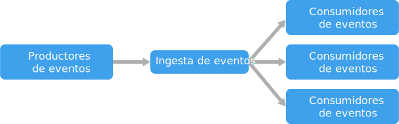

# Estilo de arquitectura basada en eventos

Una arquitectura basada en eventos consta de **productores de eventos** que generan un flujo de eventos, y **consumidores de eventos** que escuchan los eventos. 

Los eventos se entregan casi en tiempo real, de modo que los consumidores pueden responder inmediatamente a los eventos cuando se producen. Los productores se desconectan de los consumidores &mdash; un productor no sabe que los consumidores están escuchando. Los consumidores también se desconectan entre sí, y cada consumidor ve todos los eventos. Esto difiere de un patrón [Competing Consumers][competing-consumers], donde los consumidores extraen los mensajes de una cola y los mensajes solo se procesan una vez (suponiendo que no haya errores). En algunos sistemas, como IoT, los eventos se deben ingerir en volúmenes muy altos.

Una arquitectura basada en eventos puede usar un modelo pub/sub o un modelo de flujo de eventos. 

- **Pub/sub**: la infraestructura de mensajería mantiene un seguimiento de las suscripciones. Cuando se publica un evento, se envía el evento a cada suscriptor. Después de que se recibe un evento, no se puede reproducir, y los nuevos suscriptores no ven el evento. 

- **Flujo de eventos**: los eventos se escriben en un registro. Los eventos siguen un orden estricto (dentro de una partición) y son duraderos. Los clientes no se suscriben al flujo, sino que un cliente puede leer desde cualquiera de sus partes. El cliente es responsable de avanzar su posición en el flujo. Esto significa que un cliente puede unirse en cualquier momento y puede reproducir los eventos.

En el lado del consumidor, hay algunas variaciones comunes:

- **Procesamiento sencillo de eventos**. Un evento desencadena inmediatamente una acción en el consumidor. Por ejemplo, podría usar Azure Functions con un desencadenador de Service Bus para que una función se ejecute cada vez que se publica un mensaje en un tema de Service Bus.

- **Procesamiento de eventos complejos**. Un consumidor procesa una serie de eventos, en busca de patrones en los datos de eventos, mediante una tecnología como Azure Stream Analytics o Apache Storm. Por ejemplo, podría agregar las lecturas de un dispositivo insertado durante una ventana de tiempo y generar una notificación si la media móvil supera un umbral determinado. 

- **Procesamiento de flujo de eventos**. Use una plataforma de flujo de datos, como Azure IoT Hub o Apache Kafka, como canalización para ingerir eventos y suministrarlos a procesadores de flujo. Los procesadores de flujos sirven para procesar o transformar el flujo. Puede haber varios procesadores de flujo para diferentes subsistemas de la aplicación. Este enfoque es una buena opción para las cargas de trabajo de IoT.

El origen de los eventos puede ser externo con respecto al sistema, como dispositivos físicos en una solución de IoT. En ese caso, el sistema debe ser capaz de ingerir los datos según el volumen y el rendimiento que requiere el origen de datos.

En el diagrama lógico anterior, se muestra cada tipo de consumidor como un solo cuadro. En la práctica, es habitual tener varias instancias de un consumidor para evitar hacer que el consumidor se convierta en un único punto de error en el sistema. También podrían ser necesarias varias instancias para administrar el volumen y la frecuencia de los eventos. Además, un único consumidor podría procesar eventos en varios subprocesos. Esto puede crear dificultades si los eventos se deben procesar en orden o requieren la semántica exactly-once. Consulte [Minimizar la coordinación][minimize-coordination]. 

## Cuándo utilizar esta arquitectura

- Varios subsistemas deben procesar los mismos eventos. 
- Procesamiento en tiempo real con retardo mínimo.
- Procesamiento de eventos complejos, como coincidencia de patrones o agregación durante ventanas de tiempo.
- Gran volumen y alta velocidad de datos, como IoT.

## Ventajas

- Se desvinculan productores y consumidores.
- Ninguna integración punto a punto. Es fácil agregar nuevos consumidores al sistema.
- Los consumidores pueden responder a eventos inmediatamente a medida que llegan. 
- Muy escalable y distribuida. 
- Los subsistemas tienen vistas independientes del flujo de eventos.

## Desafíos

- Entrega garantizada. En algunos sistemas, especialmente en escenarios de IoT, es fundamental garantizar la entrega de los eventos.
- Procesamiento de eventos en orden o exactamente una vez. Cada tipo de consumidor normalmente se ejecuta en varias instancias, a fin de conseguir resistencia y escalabilidad. Esto puede suponer un desafío si se deben procesar los eventos en orden (dentro de un tipo de consumidor), o si la lógica de procesamiento no es idempotente.

 <!-- links -->

[competing-consumers]: ../../patterns/competing-consumers.md
[minimize-coordination]: ../design-principles/minimize-coordination.md

