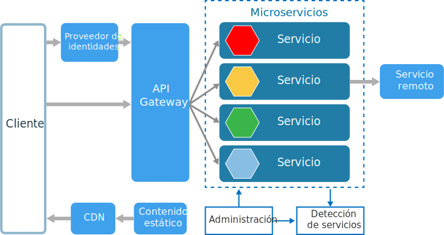
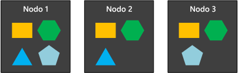

# Estilo de arquitectura de microserviciosMicroservices architecture style

Una arquitectura de microservicios consta de una colección de servicios autónomos y pequeños.A microservices architecture consists of a collection of small, autonomous services. Los servicios son independientes entre sí y cada uno debe implementar una funcionalidad de negocio individual.Each service is self-contained and should implement a single business capability. 

 
En cierto modo, los microservicios son la evolución natural de las arquitecturas orientadas a servicios, pero hay diferencias entre los microservicios y estas arquitecturas.In some ways, microservices are the natural evolution of service oriented architectures (SOA), but there are differences between microservices and SOA. Estas son algunas de las características que definen un microservicio:Here are some defining characteristics of a microservice:

- En una arquitectura de microservicios, los servicios son pequeños e independientes y están acoplados de forma flexible.In a microservices architecture, services are small, independent, and loosely coupled.

- Cada servicio es un código base independiente, que puede administrarse por un equipo de desarrollo pequeño.Each service is a separate codebase, which can be managed by a small development team.

- Los servicios pueden implementarse de manera independiente.Services can be deployed independently. Un equipo puede actualizar un servicio existente sin tener que volver a generar e implementar toda la aplicación.A team can update an existing service without rebuilding and redeploying the entire application.

- Los servicios son los responsables de conservar sus propios datos o estado externo.Services are responsible for persisting their own data or external state. Esto difiere del modelo tradicional, donde una capa de datos independiente controla la persistencia de los datos.This differs from the traditional model, where a separate data layer handles data persistence.

- Los servicios se comunican entre sí mediante API bien definidas.Services communicate with each other by using well-defined APIs. Los detalles de la implementación interna de cada servicio se ocultan frente a otros servicios.Internal implementation details of each service are hidden from other services.

- No es necesario que los servicios compartan la misma pila de tecnología, las bibliotecas o los marcos de trabajo.Services don't need to share the same technology stack, libraries, or frameworks.

Además de los propios servicios, hay otros componentes que aparecen en una arquitectura típica de microservicios:Besides for the services themselves, some other components appear in a typical microservices architecture:

**Administración**.**Management**. El componente de administración es responsable de la colocación de servicios en los nodos, la identificación de errores, el reequilibrio de servicios entre nodos, etc.The management component is responsible for placing services on nodes, identifying failures, rebalancing services across nodes, and so forth.  

**Detección de servicios**.**Service Discovery**.  Mantiene una lista de servicios y los nodos en que se encuentran.Maintains a list of services and which nodes they are located on. Permite la búsqueda de servicios para localizar el punto de conexión de un servicio.Enables service lookup to find the endpoint for a service. 

**Puerta de enlace de API****API Gateway**. La puerta de enlace de API es el punto de entrada para los clientes.The API gateway is the entry point for clients. Los clientes no llaman directamente a los servicios.Clients don't call services directly. En su lugar, llaman a la puerta de enlace de API, que reenvía la llamada a los servicios apropiados en el back-end.Instead, they call the API gateway, which forwards the call to the appropriate services on the back end. La puerta de enlace de API podría agregar las respuestas de varios servicios y devolver la respuesta agregada.The API gateway might aggregate the responses from several services and return the aggregated response. 

Entre las ventajas del uso de una puerta de enlace de API se encuentran las siguientes:The advantages of using an API gateway include:

- Desacoplan los clientes de los servicios.It decouples clients from services. Los servicios pueden cambiar de versión o refactorizarse sin necesidad de actualizar todos los clientes.Services can be versioned or refactored without needing to update all of the clients.

-  Los servicios pueden utilizar los protocolos de mensajería que no son fáciles de usar para un servicio web, como AMQP.Services can use messaging protocols that are not web friendly, such as AMQP.

- La puerta de enlace de API puede realizar otras funciones transversales como la autenticación, el registro, la terminación SSL y el equilibrio de carga.The API Gateway can perform other cross-cutting functions such as authentication, logging, SSL termination, and load balancing.

## Cuándo utilizar esta arquitecturaWhen to use this architecture

Considere este estilo de arquitectura para:Consider this architecture style for:

- Aplicaciones grandes que requieren una alta velocidad de publicación.Large applications that require a high release velocity.

- Aplicaciones complejas que necesitan gran escalabilidad.Complex applications that need to be highly scalable.

- Aplicaciones con dominios complejos o muchos subdominios.Applications with rich domains or many subdomains.

- Una organización que disponga de pequeños equipos de desarrollo.An organization that consists of small development teams.

## VentajasBenefits 

- **Implementaciones independientes**.**Independent deployments**. Puede actualizar un servicio sin volver a implementar toda la aplicación y revertir o poner al día una actualización si algo va mal.You can update a service without redeploying the entire application, and roll back or roll forward an update if something goes wrong. Las correcciones de errores y las publicaciones de características son más fáciles de administrar y entrañan menos riesgo.Bug fixes and feature releases are more manageable and less risky.

- **Desarrollo independiente**.**Independent development**. Un solo equipo de desarrollo puede compilar, probar e implementar un servicio.A single development team can build, test, and deploy a service. El resultado es la innovación continua y un ritmo más rápido de publicación.The result is continuous innovation and a faster release cadence. 

- **Equipos pequeños y centrados**.**Small, focused teams**. Los equipos pueden centrarse en un servicio.Teams can focus on one service. El menor ámbito de cada servicio hace que la base del código sea más fácil de entender, con lo que los nuevos miembros de los equipos pueden ponerse al día con mayor facilidad.The smaller scope of each service makes the code base easier to understand, and it's easier for new team members to ramp up.

- **Aislamiento de errores**.**Fault isolation**. Si un servicio deja de funcionar, no es necesario paralizar toda la aplicación.If a service goes down, it won't take out the entire application. Sin embargo, eso no significa que obtenga resistencia sin nada a cambio.However, that doesn't mean you get resiliency for free. Tendrá que seguir los procedimientos recomendados de resistencia y los patrones de diseño.You still need to follow resiliency best practices and design patterns. Vea [Diseño de aplicaciones resistentes de Azure][resiliency-overview].See [Designing resilient applications for Azure][resiliency-overview].

- **Pilas de tecnología mixta**.**Mixed technology stacks**. Los equipos pueden elegir la tecnología que mejor se adapte a su servicio.Teams can pick the technology that best fits their service. 

- **Escalado pormenorizado**.**Granular scaling**. Los servicios pueden escalarse de manera independiente.Services can be scaled independently. Al mismo tiempo, la mayor densidad de servicios por máquina virtual implica que los recursos de máquinas virtuales funcionan a máxima capacidad.At the same time, the higher density of services per VM means that VM resources are fully utilized. Con las restricciones de posición, un servicio puede asociarse con un perfil de VM (alta CPU, alta memoria, etc.).Using placement constraints, a services can be matched to a VM profile (high CPU, high memory, and so on).

## DesafíosChallenges

- **Complejidad**.**Complexity**. Una aplicación de microservicios tiene más partes en movimiento que la aplicación monolítica equivalente.A microservices application has more moving parts than the equivalent monolithic application. Cada servicio es más sencillo, pero el sistema como un todo es más complejo.Each service is simpler, but the entire system as a whole is more complex.

- **Desarrollo y pruebas**.**Development and test**. El desarrollo con dependencias de servicios requiere un enfoque diferente.Developing against service dependencies requires a different approach. Las herramientas existentes no están necesariamente diseñadas para trabajar con dependencias de servicios.Existing tools are not necessarily designed to work with service dependencies. La refactorización en los límites del servicio puede resultar difícil.Refactoring across service boundaries can be difficult. También supone un desafío probar las dependencias de los servicios, especialmente cuando la aplicación está evolucionando rápidamente.It is also challenging to test service dependencies, especially when the application is evolving quickly.

- **Falta de gobernanza**.**Lack of governance**. El enfoque descentralizado para la generación de microservicios tiene ventajas, pero también puede causar problemas.The decentralized approach to building microservices has advantages, but it can also lead to problems. Puede acabar con tantos lenguajes y marcos de trabajo diferentes que la aplicación puede ser difícil de mantener.You may end up with so many different languages and frameworks that the application becomes hard to maintain. Puede resultar útil establecer algunos estándares para todo el proyecto sin restringir excesivamente la flexibilidad de los equipos.It may be useful to put some project-wide standards in place, without overly restricting teams' flexibility. Esto se aplica especialmente a las funcionalidades transversales, como el registro.This especially applies to cross-cutting functionality such as logging.

- **Congestión y latencia de red**.**Network congestion and latency**. El uso de muchos servicios pequeños y detallados puede dar lugar a más comunicación interservicios.The use of many small, granular services can result in more interservice communication. Además, si la cadena de dependencias del servicio se hace demasiado larga (el servicio A llama a B, que llama a C...), la latencia adicional puede constituir un problema.Also, if the chain of service dependencies gets too long (service A calls B, which calls C...), the additional latency can become a problem. Tendrá que diseñar las API con atención.You will need to design APIs carefully. Evite que las API se comuniquen demasiado, piense en formatos de serialización y busque lugares para utilizar patrones de comunicación asincrónica.Avoid overly chatty APIs, think about serialization formats, and look for places to use asynchronous communication patterns.

- **Integridad de datos**.**Data integrity**. Cada microservicio es responsable de la conservación de sus propios datos.With each microservice responsible for its own data persistence. Como consecuencia, la coherencia de los datos puede suponer un problema.As a result, data consistency can be a challenge. Adopte una coherencia final cuando sea posible.Embrace eventual consistency where possible.

- **Administración**.**Management**. Para tener éxito con los microservicios se necesita una cultura de DevOps consolidada.To be successful with microservices requires a mature DevOps culture. El registro correlacionado entre servicios puede resultar un desafío.Correlated logging across services can be challenging. Normalmente, el registro debe correlacionar varias llamadas de servicio para una sola operación de usuario.Typically, logging must correlate multiple service calls for a single user operation.

- **Control de versiones**.**Versioning**. Las actualizaciones de un servicio no deben interrumpir servicios que dependen de él.Updates to a service must not break services that depend on it. Es posible que varios servicios se actualicen en cualquier momento; por lo tanto, sin un cuidadoso diseño, podrían surgir problemas con la compatibilidad con versiones anteriores o posteriores.Multiple services could be updated at any given time, so without careful design, you might have problems with backward or forward compatibility.

- **Conjunto de habilidades**.**Skillset**. Los microservicios son sistemas muy distribuidos.Microservices are highly distributed systems. Evalúe cuidadosamente si el equipo tiene los conocimientos y la experiencia para desenvolverse correctamente.Carefully evaluate whether the team has the skills and experience to be successful.

## Prácticas recomendadasBest practices

- Adapte los servicios al dominio empresarial.Model services around the business domain. 

- Descentralice todo.Decentralize everything. Los equipos individuales son responsables de diseñar y compilar servicios.Individual teams are responsible for designing and building services. Evite el uso compartido de código o esquemas de datos.Avoid sharing code or data schemas. 

- El almacenamiento de datos debería ser privado para el servicio que posee los datos.Data storage should be private to the service that owns the data. Use el almacenamiento recomendado para cada tipo de servicio y de datos.Use the best storage for each service and data type. 

- Los servicios se comunican a través de API bien diseñadas.Services communicate through well-designed APIs. Evite la pérdida de detalles de la implementación.Avoid leaking implementation details. Las API deben modelar el dominio, no la implementación interna del servicio.APIs should model the domain, not the internal implementation of the service.

- Evite el acoplamiento entre servicios.Avoid coupling between services. Entre las causas de acoplamiento se encuentran los protocolos de comunicación rígidos y los esquemas de bases de datos compartidos.Causes of coupling include shared database schemas and rigid communication protocols.

- Descargue a la puerta de enlace de cuestiones transversales, como la autenticación y la terminación SSL.Offload cross-cutting concerns, such as authentication and SSL termination, to the gateway.

- Conserve el conocimiento del dominio fuera de la puerta de enlace.Keep domain knowledge out of the gateway. La puerta de enlace debe controlar y enrutar las solicitudes de cliente sin ningún conocimiento de las reglas de negocios o la lógica de dominio.The gateway should handle and route client requests without any knowledge of the business rules or domain logic. En caso contrario, la puerta de enlace se convierte en una dependencia y puede provocar el acoplamiento entre servicios.Otherwise, the gateway becomes a dependency and can cause coupling between services.

- Los servicios deben tener un acoplamiento flexible y una alta cohesión funcional.Services should have loose coupling and high functional cohesion. Las funciones que es probable que cambien juntas se deben empaquetar e implementar en conjunto.Functions that are likely to change together should be packaged and deployed together. Si residen en distintos servicios, estos terminan estrechamente acoplados, porque un cambio en un servicio requerirá la actualización del otro servicio.If they reside in separate services, those services end up being tightly coupled, because a change in one service will require updating the other service. La comunicación demasiado intensa entre dos servicios puede ser un síntoma de un acoplamiento estrecho y una cohesión baja.Overly chatty communication between two services may be a symptom of tight coupling and low cohesion. 

- Aísle los errores.Isolate failures. Utilice estrategias de resistencia para impedir que los errores dentro de un servicio se reproduzcan en cascada.Use resiliency strategies to prevent failures within a service from cascading. Vea [Resiliency patterns][resiliency-patterns] (Patrones de resistencia) y [Diseño de aplicaciones resistentes de Azure][resiliency-overview].See [Resiliency patterns][resiliency-patterns] and [Designing resilient applications][resiliency-overview].

## Microservicios que utilizan Azure Container ServiceMicroservices using Azure Container Service 

Puede usar Azure Container Service para configurar y aprovisionar un clúster de Docker.You can use Azure Container Service to configure and provision a Docker cluster. Azure Container Service admite diferentes orquestadores de contenedores populares, como Kubernetes, DC/OS y Docker Swarm.Azure Container Services supports several popular container orchestrators, including Kubernetes, DC/OS, and Docker Swarm.

 
**Nodos públicos**.**Public nodes**. Estos nodos son accesibles a través de un equilibrador de carga orientado al público.These nodes are reachable through a public-facing load balancer. La puerta de enlace de API se hospeda en esos nodos.The API gateway is hosted on these nodes.

**Nodos de back-end**.**Backend nodes**. Estos nodos ejecutan servicios a los que acceden los clientes a través de la puerta de enlace de API.These nodes run services that clients reach via the API gateway. Estos nodos no reciben el tráfico de Internet directamente.These nodes don't receive Internet traffic directly. Los nodos de back-end pueden incluir más de un grupo de máquinas virtuales, cada uno con un perfil de hardware diferente.The backend nodes might include more than one pool of VMs, each with a different hardware profile. Por ejemplo, podría crear grupos diferentes para cargas de trabajo de proceso generales, cargas de trabajo de CPU elevadas y cargas de trabajo de memoria elevadas.For example, you could create separate pools for general compute workloads, high CPU workloads, and high memory workloads. 

**Máquinas virtuales de administración****Management VMs**. Estas máquinas virtuales ejecutan los nodos principales para el orquestador de contenedores.These VMs run the master nodes for the container orchestrator. 

**Redes**.**Networking**. Los nodos públicos, los nodos de back-end y las máquinas virtuales de administración se colocan en subredes diferentes dentro de la misma red virtual (VNet).The public nodes, backend nodes, and management VMs are placed in separate subnets within the same virtual network (VNet). 

**Equilibradores de carga.****Load balancers**.  Un equilibrador de carga con orientación externa se coloca delante de los nodos públicos.An externally facing load balancer sits in front of the public nodes. Distribuye las solicitudes de Internet a los nodos públicos.It distributes internet requests to the public nodes. Otro equilibrador de carga se coloca delante de las máquinas virtuales de administración para permitir el tráfico de Secure Shell (ssh) a las máquinas virtuales de administración mediante las reglas NAT.Another load balancer is placed in front of the management VMs, to allow secure shell (ssh) traffic to the management VMs, using NAT rules.

Por motivos de confiabilidad y escalabilidad, cada servicio se replica a través de varias máquinas virtuales.For reliability and scalability, each service is replicated across multiple VMs. Sin embargo, como los servicios son relativamente ligeros (en comparación con una aplicación monolítica), varios servicios normalmente se empaquetan en una sola máquina virtual.However, because services are also relatively lightweight (compared with a monolithic application), multiple services are usually packed into a single VM. Una mayor densidad permite una mejor utilización de recursos.Higher density allows better resource utilization. Si un servicio determinado no usa una gran cantidad de recursos, no es necesario dedicar una máquina virtual completa a la ejecución de ese servicio.If a particular service doesn't use a lot of resources, you don't need to dedicate an entire VM to running that service.

El siguiente diagrama muestra tres nodos que ejecutan cuatro servicios diferentes (indicados mediante distintas formas).The following diagram shows three nodes running four different services (indicated by different shapes). Observe que cada servicio tiene al menos dos instancias.Notice that each service has at least two instances. 
 

## Microservicios que utilizan Azure Service FabricMicroservices using Azure Service Fabric

El siguiente diagrama muestra una arquitectura de microservicios que utiliza Azure Service Fabric.The following diagram shows a microservices architecture using Azure Service Fabric.

El clúster de Service Fabric se implementa en uno o varios conjuntos de escalado de máquina virtual.The Service Fabric Cluster is deployed to one or more VM scale sets. Puede que tenga más de un conjunto de escalado de máquina virtual en el clúster, con el fin de tener una combinación de tipos de máquinas virtuales.You might have more than one VM scale set in the cluster, in order to have a mix of VM types. Una puerta de enlace de API se coloca delante del clúster de Service Fabric, con un equilibrador de carga externo para recibir las solicitudes de cliente.An API Gateway is placed in front of the Service Fabric cluster, with an external load balancer to receive client requests.

El tiempo de ejecución de Service Fabric se ocupa de la administración del clúster; esto es, la selección de ubicación de los servicios, la conmutación por error de los nodos y el seguimiento de los estados, entre otros.The Service Fabric runtime performs cluster management, including service placement, node failover, and health monitoring. El tiempo de ejecución se implementa en los propios nodos del clúster.The runtime is deployed on the cluster nodes themselves. No hay un conjunto independiente de máquinas virtuales de administración del clúster.There isn't a separate set of cluster management VMs.

Los servicios se comunican entre sí mediante el proxy inverso que está integrado en Service Fabric.Services communicate with each other using the reverse proxy that is built into Service Fabric. Service Fabric proporciona un servicio de detección que puede resolver el punto de conexión para un servicio con nombre.Service Fabric provides a discovery service that can resolve the endpoint for a named service.

<!-- links -->

[resiliency-overview]: ../../resiliency/index.md
[resiliency-patterns]: ../../patterns/category/resiliency.md

