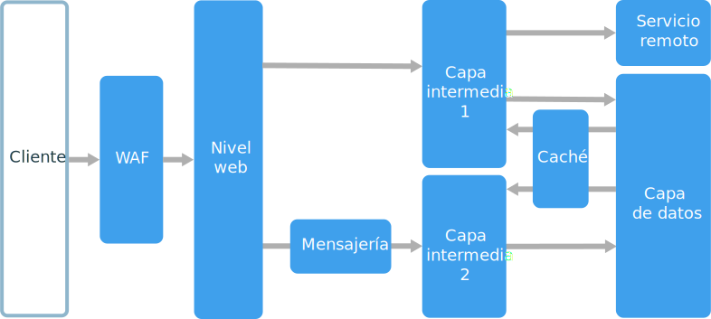

# Estilo de arquitectura de n niveles

Una arquitectura de n niveles divide una aplicación en **capas lógicas** y **niveles físicos**. 

Las capas son una forma de separar responsabilidades y administrar dependencias. Cada capa tiene una responsabilidad específica. Una capa superior puede utilizar los servicios de una capa inferior, pero no al revés. 

Los niveles están físicamente separados y se ejecutan en máquinas diferentes. Un nivel puede llamar a otro nivel directamente o usar mensajería asincrónica (cola de mensajes). Aunque cada capa se puede hospedar en su propio nivel, esto no es necesario. Se pueden hospedar varias capas en el mismo nivel. La separación física de los niveles mejora la escalabilidad y la resistencia, pero también agrega latencia a la comunicación de red adicional. 

Una aplicación tradicional de tres niveles tiene un nivel de presentación, un nivel intermedio y una capa de datos. El nivel intermedio es opcional. Las aplicaciones más complejas pueden tener más de tres niveles. El diagrama anterior muestra una aplicación con dos niveles intermedios, que encapsulan diferentes áreas de funcionalidad. 

Una aplicación con n niveles puede tener una **arquitectura de capa cerrada** o una **arquitectura de capa abierta**:

- En la arquitectura de capa cerrada, una capa solo puede llamar a la capa inmediatamente inferior. 
- En una arquitectura de capa abierta, una capa puede llamar a cualquiera de las capas que se encuentran debajo de ella. 

Una arquitectura de capa cerrada limita las dependencias entre las capas. Sin embargo, puede crear tráfico de red innecesario si una capa simplemente pasa solicitudes a la capa siguiente. 

## Cuándo utilizar esta arquitectura

Las arquitecturas de n niveles se implementan normalmente como aplicaciones de infraestructura como servicio (IaaS), donde cada nivel se ejecuta en un conjunto independiente de máquinas virtuales. Sin embargo, una aplicación de n niveles no tiene que ser IaaS puro. A menudo, resulta ventajoso utilizar servicios administrados para algunas partes de la arquitectura, en particular el almacenamiento en caché, la mensajería y el almacenamiento de datos.

Considere una arquitectura de n niveles para:

- Aplicaciones web simples. 
- La migración de una aplicación local a Azure con mínima refactorización.
- El desarrollo unificado de aplicaciones locales y en la nube.

Las arquitecturas de n niveles son muy comunes en las aplicaciones locales tradicionales, por lo que es una opción ideal para migrar las cargas de trabajo existentes a Azure.

## Ventajas

- Portabilidad entre la nube y entornos locales, y entre plataformas en la nube.
- Menor curva de aprendizaje para la mayoría de los desarrolladores.
- Evolución natural desde el modelo de aplicaciones tradicional.
- Abiertas a entornos heterogéneos (Windows o Linux)

## Desafíos

- Es fácil terminar con un nivel intermedio que solo realiza operaciones CRUD en la base de datos, agregando latencia adicional sin hacer ningún trabajo útil. 
- El diseño monolítico impide la implementación independiente de características.
- La administración de una aplicación IaaS es más trabajo que una aplicación que utiliza solo los servicios administrados. 
- Puede ser difícil administrar la seguridad de red en un sistema grande.

## Prácticas recomendadas

- Utilice el escalado automático para tratar los cambios en la carga. Consulte [Procedimientos recomendados de escalado automático][autoscaling]
- Utilice la mensajería asincrónica para desacoplar niveles.
- Almacene en caché datos semiestáticos. Consulte [Procedimientos recomendados para el almacenamiento en caché][caching].
- Configure la capa de datos para lograr alta disponibilidad, mediante una solución como [Grupos de disponibilidad AlwaysOn de SQL Server][sql-always-on].
- Coloque un firewall de aplicaciones web (WAF) entre el front-end e Internet.
- Coloque cada nivel en su propia subred y utilice las subredes como límite de seguridad. 
- Restrinja el acceso a la capa de datos, permitiendo solicitudes únicamente de los niveles intermedios.

## Arquitectura de n niveles en máquinas virtuales

En esta sección se describe una arquitectura de n niveles recomendada que se ejecuta en máquinas virtuales. 

Cada nivel está formado por dos o más máquinas virtuales, colocadas en un conjunto de disponibilidad o un conjunto de escalado de máquina virtual. Varias máquinas virtuales ofrecen resistencia en caso de que se produzca un error en una máquina virtual. Los equilibradores de carga se utilizan para distribuir solicitudes a través de las máquinas virtuales de un nivel. Un nivel se puede escalar horizontalmente mediante la adición de más máquinas virtuales al grupo. 

Cada nivel también se coloca dentro de su propia subred, lo que significa que sus direcciones IP internas están dentro del mismo rango de direcciones. Esto facilita la aplicación de reglas del grupo de seguridad de red y tablas de rutas a niveles individuales.

Los niveles web y empresarial no tienen estado. Cualquier máquina virtual puede manejar cualquier solicitud para ese nivel. La capa de datos debe consistir en una base de datos replicada. Para Windows, se recomiendan SQL Server, mediante los grupos de disponibilidad AlwaysOn para alta disponibilidad. Para Linux, elija una base de datos que admita la replicación, como Apache Cassandra. 

Los grupos de seguridad de red (NSG) restringen el acceso a cada nivel. Por ejemplo, la capa de datos solo permite el acceso desde el nivel empresarial.

Para obtener más información y una plantilla de Resource Manager que se puede implementar, consulte las siguientes arquitecturas de referencia:

- [Ejecución de máquinas virtuales Windows para una arquitectura de n niveles][n-tier-windows]
- [Ejecución de máquinas virtuales Linux para una aplicación de n niveles][n-tier-linux]

### Consideraciones adicionales

- Las arquitecturas de n niveles no están restringidas a tres niveles. Para aplicaciones más complejas, es habitual tener más niveles. En ese caso, considere utilizar el enrutamiento de nivel 7 para enrutar las solicitudes a un nivel determinado.

- Los niveles son los límites de escalabilidad, confiabilidad y seguridad. Considere la posibilidad de tener niveles separados para los servicios con diferentes requisitos en esas áreas.

- Utilice Conjuntos de escalado de máquinas virtuales para el escalado automático.

- Busque lugares en la arquitectura donde pueda utilizar un servicio administrado sin necesidad de refactorización significativa. En concreto, examine el almacenamiento en caché, la mensajería, el almacenamiento y las bases de datos. 

- Para mayor seguridad, coloque una red perimetral delante de la aplicación. La red perimetral incluye aplicaciones virtuales de red que implementan la funcionalidad de seguridad, como firewalls e inspección de paquetes. Para más información, consulte el artículo sobre la [arquitectura de referencia de la red perimetral][dmz].

- Para una alta disponibilidad, coloque dos o más aplicaciones virtuales de red en un conjunto de disponibilidad, con un equilibrador de carga externo para distribuir las solicitudes de Internet por todas las instancias. Para más información, consulte [Implementación de aplicaciones virtuales de red de alta disponibilidad][ha-nva].

- No permita el acceso directo de RDP o SSH a las máquinas virtuales que ejecutan código de aplicación. En su lugar, los operadores deben iniciar sesión en un JumpBox, que también se denomina host de tipo bastión. Se trata de una máquina virtual en la red que usan los administradores para conectarse al resto de máquinas virtuales. El JumpBox tiene un grupo de seguridad de red que solo permite RDP o SSH de direcciones IP públicas.

- Puede extender la red virtual de Azure a una red local mediante una red privada virtual (VPN) de sitio a sitio o Azure ExpressRoute. Para más información, consulte el artículo sobre la [arquitectura de referencia de la red híbrida][hybrid-network].

- Si su organización utiliza Active Directory para administrar la identidad, puede que desee extender su entorno de Active Directory a la red virtual de Azure. Para más información, consulte el artículo sobre la [arquitectura de referencia de administración de identidades][identity].

- Si necesita más disponibilidad de la que proporciona el Acuerdo de Nivel de Servicio de Azure para máquinas virtuales, replique la aplicación entre dos regiones y use Azure Traffic Manager para la conmutación por error. Para más información, consulte [Run Linux VMs in multiple regions for high availability][multiregion-windows] (Ejecución de máquinas virtuales Linux en varias regiones para alta disponibilidad) o [Run Linux VMs in multiple regions][multiregion-linux] (Ejecución de máquinas virtuales Linux en varias regiones).

[autoscaling]: ../../best-practices/auto-scaling.md
[caching]: ../../best-practices/caching.md
[dmz]: ../../reference-architectures/dmz/index.md
[ha-nva]: ../../reference-architectures/dmz/nva-ha.md
[hybrid-network]: ../../reference-architectures/hybrid-networking/index.md
[identity]: ../../reference-architectures/identity/index.md
[multiregion-linux]: ../../reference-architectures/virtual-machines-linux/multi-region-application.md
[multiregion-windows]: ../../reference-architectures/virtual-machines-windows/multi-region-application.md
[n-tier-linux]: ../../reference-architectures/virtual-machines-linux/n-tier.md
[n-tier-windows]: ../../reference-architectures/virtual-machines-windows/n-tier.md
[sql-always-on]: /sql/database-engine/availability-groups/windows/always-on-availability-groups-sql-server