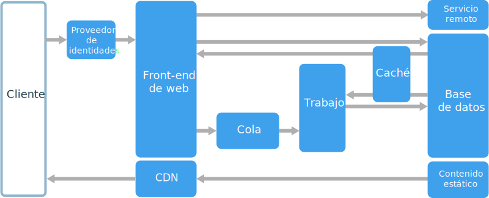
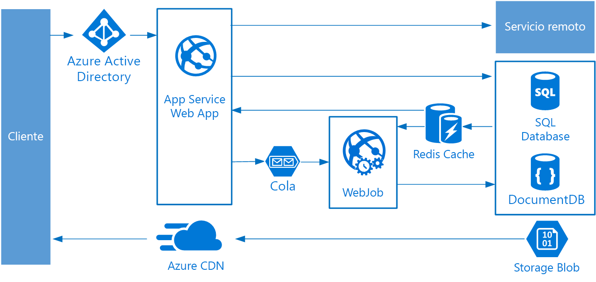

# Estilo de arquitectura web-cola-trabajo

Los componentes principales de esta arquitectura son un **front-end web** que atiende solicitudes de cliente y un **trabajo** que realiza tareas que consumen muchos recursos, flujos de trabajo de ejecución prolongada o trabajos por lotes.  El front-end web se comunica con el trabajo a través de una **cola de mensajes**.  

Otros componentes que normalmente se incorporan a esta arquitectura son:

- Una o más bases de datos. 
- Una caché para almacenar los valores de la base de datos para las lecturas rápidas.
- Una red CDN para atender contenido estático.
- Servicios remotos, como correo electrónico o un servicio de SMS. A menudo, son terceros los que los proporcionan.
- Un proveedor de identidades para la autenticación.

La web y el trabajo son ambos sin estado. El estado de sesión se puede almacenar en una memoria caché distribuida. El trabajo realiza cualquier trabajo de ejecución prolongada de forma asincrónica. El trabajo pueden desencadenarlo mensajes en la cola o se puede ejecutar según una programación para el procesamiento por lotes. El trabajo es un componente opcional. Si no hay ninguna operación de ejecución prolongada, se puede omitir el trabajo.  

El front-end puede consistir en una API web. En el lado del cliente, una aplicación de página única que realiza llamadas AJAX o una aplicación cliente nativa puede consumir la API web.

## Cuándo utilizar esta arquitectura

La arquitectura web-cola-trabajo se suele implementar mediante servicios de proceso administrados, ya sea Azure App Service o Azure Cloud Services. 

Considere este estilo de arquitectura para:

- Aplicaciones con un dominio relativamente sencillo.
- Aplicaciones con algunos flujos de trabajo de ejecución prolongada u operaciones por lotes.
- Si desea utilizar servicios administrados, en lugar de infraestructura como servicio (IaaS).

## Ventajas

- Arquitectura relativamente sencilla que sea fácil de entender.
- Fácil de implementar y administrar.
- Separación clara de cuestiones.
- El front-end se desacopla del trabajo mediante mensajería asincrónica.
- El front-end y el trabajo se pueden escalar de forma independiente.

## Desafíos

- Sin un diseño cuidado, el front-end y el trabajo se pueden convertir en componentes grandes y monolíticos que son difíciles de mantener y actualizar.
- Puede haber dependencias ocultas si el servidor front-end y el trabajo comparten esquemas de datos o módulos de código. 

## Procedimientos recomendados

- Exponer una API bien diseñada al cliente. Consulte [Procedimientos recomendados para el diseño de API][api-design].
- Utilizar el escalado automático para tratar los cambios en la carga. Consulte [Procedimientos recomendados de escalado automático][autoscaling]
- Almacene en caché datos semiestáticos. Consulte [Procedimientos recomendados para el almacenamiento en caché][caching].
- Utilizar una red CDN para hospedar contenido estático. Consulte [Procedimientos recomendados para la red CDN][cdn].
- Utilizar la persistencia de Polyglot cuando corresponda. Consulte [Uso del mejor almacén de datos para el trabajo][polyglot].
- Crear particiones de datos para mejorar la escalabilidad, reducir la contención y optimizar el rendimiento. Consulte [Procedimientos recomendados para las particiones de datos][data-partition].

## Web-cola-trabajo en Azure App Service

En esta sección se describe una arquitectura recomendada web-cola-trabajo que utiliza Azure App Service. 

El front-end se implementa como una aplicación web de Azure App Service y el trabajo se implementa como WebJob. La aplicación web y WebJob están asociados a un plan de App Service que proporciona las instancias de máquina virtual. 

Puede usar las colas de Azure Service Bus o de Azure Storage para la cola de mensajes. (El diagrama muestra una cola de Azure Storage).

Azure Redis Cache almacena el estado de sesión y otros datos que necesitan acceso de baja latencia.

La red CDN de Azure se usa para almacenar en caché contenido estático como imágenes, CSS o HTML.

Para el almacenamiento, elija las tecnologías de almacenamiento que mejor se adapten a las necesidades de la aplicación. Puede usar varias tecnologías de almacenamiento (persistencia de Polyglot). Para ilustrar esta idea, el diagrama muestra de Azure SQL Database y Azure Cosmos DB.  

Para más información, consulte [Arquitectura de referencia de aplicación web de App Service][scalable-web-app].

### Consideraciones adicionales

- No todas las transacciones tienen que pasar a través de la cola y el trabajo para ir al almacenamiento. El front-end web puede realizar directamente operaciones de lectura/escritura sencillas. Los trabajos están diseñados para tareas que consumen muchos recursos o flujos de trabajo de ejecución prolongada. En algunos casos, es posible que no necesite ningún trabajo en absoluto.

- Use la característica de escalado automático integrado de App Service para escalar horizontalmente el número de instancias de máquina virtual. Si la carga de la aplicación sigue patrones predecibles, use el escalado automático basado en programación. Si la carga es imprevisible, use reglas de escalado automático basadas en métricas.      

- Considere la posibilidad de poner la aplicación web y WebJob en planes de App Service separados. De este modo, se hospedan en instancias de máquina virtual distintas y se pueden escalar de forma independiente. 

- Use planes de App Service independientes para producción y prueba. En caso contrario, si usa el mismo plan para producción y prueba, significa que las pruebas se ejecutan en las máquinas virtuales de producción.

- Utilice las ranuras de implementación para administrar implementaciones. Esto le permite implementar una versión actualizada en un espacio de ensayo e intercambiar luego a la nueva versión. También le permite volver a la versión anterior si ha habido un problema con la actualización.

<!-- links -->

[api-design]: ../../best-practices/api-design.md
[autoscaling]: ../../best-practices/auto-scaling.md
[caching]: ../../best-practices/caching.md
[cdn]: ../../best-practices/cdn.md
[data-partition]: ../../best-practices/data-partitioning.md
[polyglot]: ../design-principles/use-the-best-data-store.md
[scalable-web-app]: ../../reference-architectures/app-service-web-app/scalable-web-app.md