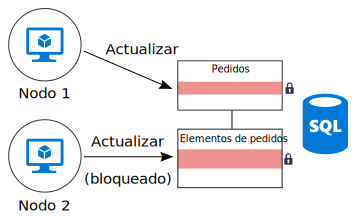
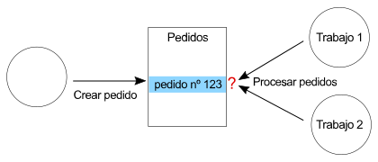

# Minimizar la coordinación 

## Minimizar la coordinación entre los servicios de aplicación para lograr escalabilidad

La mayoría de las aplicaciones de nube constan de varios servicios de aplicación &mdash; servidores web front-end, bases de datos, procesos empresariales, informes y análisis, etc. Para lograr escalabilidad y confiabilidad, cada uno de esos servicios debe ejecutarse en varias instancias. 

¿Qué sucede cuando dos instancias intentan realizar operaciones simultáneas que afectan a algún estado compartido? En algunos casos, debe haber coordinación entre los nodos, por ejemplo, para conservar las garantías ACID. En este diagrama, `Node2` está esperando a que `Node1` libere un bloqueo de base de datos:

La coordinación limita las ventajas del escalado horizontal y crea cuellos de botella. En este ejemplo, a medida que escala horizontalmente la aplicación y agrega más instancias, verá que aumenta la contención de bloqueo. En el peor de los casos, las instancias de front-end pasarán la mayor parte del tiempo esperando los bloqueos.

La semántica "exactly once" es otro origen frecuente de coordinación. Por ejemplo, un pedido debe procesarse exactamente una vez. Dos trabajos escuchan nuevos pedidos. `Worker1` recoge un pedido para su procesamiento. La aplicación debe asegurarse no solo de que `Worker2` no duplique el trabajo, sino también de que si `Worker1` se bloquea, no se pierda el pedido.

Aunque puede usar un patrón como [Scheduler Agent Supervisor][sas-pattern] para coordinar los trabajos, en este caso, un enfoque mejor podría ser dividir el trabajo. Cada trabajo se asigna a un intervalo determinado de pedidos (por ejemplo, por región de facturación). Si se bloquea un trabajo, una nueva instancia lo retoma donde lo dejó la instancia anterior, pero no compiten varias instancias.

## Recomendaciones

**Adoptar coherencia definitiva** Cuando los datos se distribuyen, hace falta coordinación para exigir fuertes garantías de coherencia. Por ejemplo, supongamos que una operación actualiza dos bases de datos. En lugar de colocarla en un único ámbito de transacción, es mejor que el sistema pueda albergar coherencia definitiva, quizás mediante el patrón [Compensating Transaction][compensating-transaction] para realizar la reversión de forma lógica después de un error.

**Usar eventos de dominio para sincronizar el estado**. Un [evento de dominio][domain-event] es un evento que se registra cuando sucede algo que tiene importancia dentro del dominio. Los servicios interesados pueden escuchar el evento, en lugar de usar una transacción global para coordinarlo entre varios servicios. Si se usa este enfoque, el sistema debe tolerar la coherencia definitiva (consulte el elemento anterior). 

**Considerar patrones como CQRS y Event Sourcing**. Estos dos patrones pueden ayudar a reducir la contención entre las cargas de trabajo de lectura y escritura. 

- El [patrón CQRS][cqrs-pattern] separa las operaciones de lectura de las de escritura. En algunas implementaciones, los datos de lectura están separados físicamente de los datos de escritura. 

- En el [patrón Event Sourcing][event-sourcing], los cambios de estado se registran como una serie de eventos en un almacén de datos de solo anexión. Anexar un evento al flujo es una operación atómica, que requiere un bloqueo mínimo. 

Estos dos patrones se complementan entre sí. Si el almacén de solo escritura en CQRS usa Event Sourcing, el almacén de solo lectura puede escuchar los mismos eventos para crear una instantánea legible del estado actual, optimizada para consultas. Sin embargo, antes de adoptar CQRS o Event Sourcing, debe ser consciente de las dificultades de este enfoque. Para más información, consulte [CQRS architecture style][cqrs-style] (Estilo de arquitectura CQRS).

**Crear particiones de los datos**.  Evite colocar todos los datos en un esquema de datos que se comparta entre muchos servicios de aplicación. En una arquitectura de microservicios se aplica este principio al hacer responsable a cada servicio de su propio almacén de datos. Dentro de una única base de datos, la creación de particiones de los datos puede mejorar la simultaneidad, dado que un servicio que escriba en una partición no influye en un servicio que escriba en otra.

**Diseñar operaciones idempotentes**. Siempre que sea posible, diseñe operaciones que sean idempotentes. De este modo, se pueden administrar mediante la semántica at-least-once. Por ejemplo, puede colocar los elementos de trabajo en una cola. Si se bloquea un trabajo en medio de una operación, otro trabajo recoge simplemente el elemento de trabajo.

**Usar el procesamiento paralelo asincrónico**. Si una operación requiere que varios pasos se realicen de forma asincrónica (por ejemplo, llamadas al servicio remoto), podría llamarlos en paralelo y, a continuación, agregar los resultados. En este enfoque se supone que cada paso no depende de los resultados del paso anterior.   

**Usar simultaneidad optimista siempre que sea posible**. El control de simultaneidad pesimista usa bloqueos de base de datos para evitar conflictos. Esto puede provocar un rendimiento deficiente y reducir la disponibilidad. Con el control de simultaneidad optimista, cada transacción modifica una copia o instantánea de los datos. Cuando la transacción se confirma, el motor de base de datos la valida y rechaza las transacciones que podrían afectar a la coherencia de la base de datos. 

Azure SQL Database y SQL Server admiten la simultaneidad optimista gracias al [aislamiento de instantáneas][sql-snapshot-isolation]. Algunos servicios de almacenamiento de Azure admiten la simultaneidad optimista mediante el uso de valores ETag, como [Azure Cosmos DB][cosmosdb-faq] y [Azure Storage][storage-concurrency].

**Considerar MapReduce u otros algoritmos distribuidos paralelos**. En función de los datos y el tipo de trabajo que se va a realizar, puede que tenga que dividir el trabajo en tareas independientes que puedan realizar varios nodos que funcionan en paralelo. Consulte [Big compute architecture style][big-compute] (Estilo de arquitectura Big Compute).

**Usar Leader Election para la coordinación**. En aquellos casos en los que sea necesario coordinar las operaciones, asegúrese de que el coordinador no se convierta en un único punto de error en la aplicación. Mediante el [patrón Leader Election][leader-election], una instancia es la principal en cualquier momento y actúa como coordinador. Si en la principal se produce un error, se elige una nueva instancia como principal. 
 

<!-- links -->

[big-compute]: ../architecture-styles/big-compute.md
[compensating-transaction]: ../../patterns/compensating-transaction.md
[cqrs-style]: ../architecture-styles/cqrs.md
[cqrs-pattern]: ../../patterns/cqrs.md
[cosmosdb-faq]: /azure/cosmos-db/faq
[domain-event]: https://martinfowler.com/eaaDev/DomainEvent.html
[event-sourcing]: ../../patterns/event-sourcing.md
[leader-election]: ../../patterns/leader-election.md
[sas-pattern]: ../../patterns/scheduler-agent-supervisor.md
[sql-snapshot-isolation]: /sql/t-sql/statements/set-transaction-isolation-level-transact-sql
[storage-concurrency]: https://azure.microsoft.com/blog/managing-concurrency-in-microsoft-azure-storage-2/