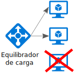
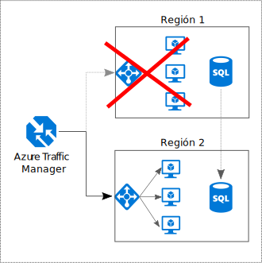

# Hacer que todo sea redundante

## Creación de redundancia en la aplicación, para evitar tener puntos únicos de error

Las aplicaciones resistentes esquivan los errores al enrutar. Identifique las rutas críticas de la aplicación. ¿Hay redundancia en cada punto de la ruta de acceso? Si se produce un error en un subsistema, ¿conmutará por error la aplicación?

## Recomendaciones 

**Considere los requisitos empresariales**. La cantidad de redundancia integrada en un sistema puede afectar tanto al costo como a la complejidad. La arquitectura debe recibir información de los requisitos empresariales, como el objetivo de tiempo de recuperación (RTO). Por ejemplo, las implementaciones en varias regiones son más caras que las de una sola región y son más complicadas de administrar. Necesitará procedimientos operativos para controlar la conmutación por error y la conmutación por recuperación. El costo adicional y la complejidad podrían estar justificados para algunos escenarios empresariales pero no para otros.

**Coloque máquinas virtuales con un equilibrador de carga**. No use una sola máquina virtual para las cargas de trabajo críticas. En su lugar, coloque varias máquinas virtuales con un equilibrador de carga. Si alguna deja de estar disponible, el equilibrador de carga distribuye el tráfico a las demás máquinas virtuales en buen estado. Para aprender a implementar esta configuración, consulte el artículo sobre la ejecución de [varias máquinas virtuales para conseguir escalabilidad y disponibilidad][multi-vm-blueprint].

**Replique las bases de datos**. Azure SQL Database y Cosmos DB replican automáticamente los datos dentro de una región y se puede habilitar la replicación geográfica de una región a otra. Si utiliza una solución de base de datos de IaaS, elija una que admita la replicación y la conmutación por error, como los [grupos de disponibilidad AlwaysOn (SQL Server)][sql-always-on]. 

**Habilite la replicación geográfica**. La replicación geográfica para [Azure SQL Database][sql-geo-replication] y [Cosmos DB][cosmosdb-geo-replication] crea réplicas legibles secundarias de los datos en una o varias regiones secundarias. Si se produce una interrupción, la base de datos puede conmutar por error en la región secundaria para las operaciones de escritura.

**Cree particiones para conseguir disponibilidad**. La creación de particiones de base de datos se suele usar para mejorar la escalabilidad, pero también puede mejorar la disponibilidad. Aunque una partición deje de funcionar, puede acceder a las demás particiones. Un error en una partición solo provocará la interrupción en un subconjunto de transacciones. 

**Realice implementaciones en más de una región**. Para la máxima disponibilidad, implemente la aplicación en más de una región. De este modo, en el caso excepcional de un problema que afecte a toda una región, la aplicación podrá conmutar por error a otra. En el siguiente diagrama se muestra una aplicación en varias regiones que utiliza Azure Traffic Manager para controlar la conmutación por error.

**Sincronice la conmutación por error del front-end y del back-end**. Use Azure Traffic Manager para conmutar por error el front-end. Si el front-end está inaccesible en una región, Traffic Manager enruta las nuevas solicitudes a la región secundaria. Dependiendo de la solución de base de datos, puede que necesite coordinar la conmutación por error de la base de datos. 

**Utilice la conmutación automática por error pero la conmutación por recuperación manual**. Use Traffic Manager para la conmutación automática por error, pero no para la conmutación por recuperación automática. La conmutación por recuperación automática supone el riesgo de cambiar a la región principal antes de que se encuentre totalmente en buen estado. En su lugar, compruebe que todos los subsistemas de aplicación tengan un estado correcto antes de la conmutación por recuperación manual. Además, dependiendo de la base de datos, deberá comprobar la coherencia de los datos antes de la conmutación por recuperación.

**Incluya redundancia para Traffic Manager**. Traffic Manager es un posible punto de error. Revise el Acuerdo de Nivel de Servicio de Traffic Manager y determine si el uso de Traffic Manager por sí solo cumple sus requisitos empresariales de alta disponibilidad. Si no es así, considere la posibilidad de agregar otra solución de administración de tráfico como conmutación por recuperación. Si el servicio Azure Traffic Manager no funciona, cambie los registros CNAME de DNS para que apunten a otro servicio de administración del tráfico.

<!-- links -->

[multi-vm-blueprint]: ../../reference-architectures/virtual-machines-windows/multi-vm.md

[cassandra]: http://cassandra.apache.org/
[cosmosdb-geo-replication]: /azure/cosmos-db/distribute-data-globally
[sql-always-on]: https://msdn.microsoft.com/library/hh510230.aspx
[sql-geo-replication]: /azure/sql-database/sql-database-geo-replication-overview
