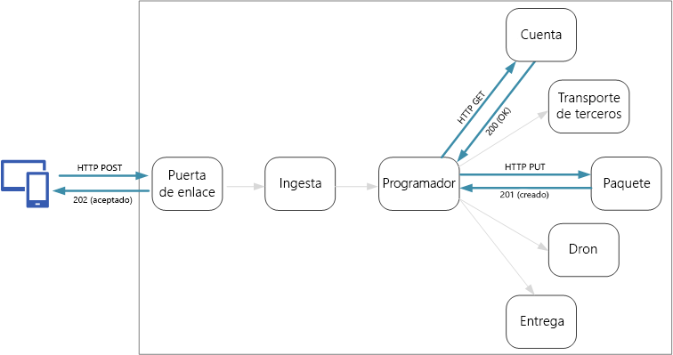
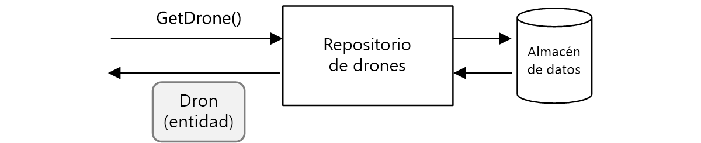
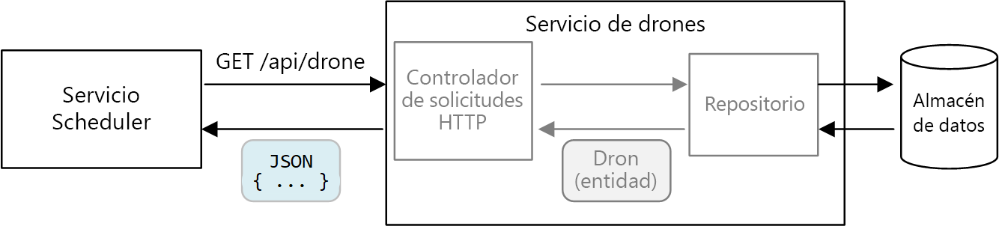
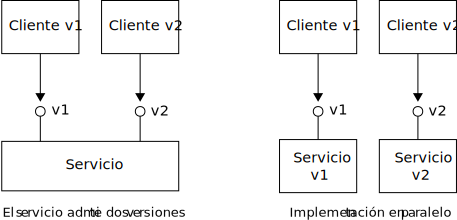

# <a name="designing-microservices-api-design"></a><span data-ttu-id="519f7-103">Diseño de microservicios: diseño de API</span><span class="sxs-lookup"><span data-stu-id="519f7-103">Designing microservices: API design</span></span>

<span data-ttu-id="519f7-104">Las arquitecturas de los microservicios necesitan un buen diseño de API, ya que todos los intercambios de datos entre servicios se producen mediante mensajes o llamadas API.</span><span class="sxs-lookup"><span data-stu-id="519f7-104">Good API design is important in a microservices architecture, because all data exchange between services happens either through messages or API calls.</span></span> <span data-ttu-id="519f7-105">Las API deben ser eficaces para evitar los patrones [Chatty I/O](../antipatterns/chatty-io/index.md).</span><span class="sxs-lookup"><span data-stu-id="519f7-105">APIs must be efficient to avoid creating [chatty I/O](../antipatterns/chatty-io/index.md).</span></span> <span data-ttu-id="519f7-106">Dado que los servicios están diseñados por equipos que trabajan de forma independiente, las API deben tener semántica bien definida y esquemas de control de versiones, de manera que las actualizaciones no interrumpan otros servicios.</span><span class="sxs-lookup"><span data-stu-id="519f7-106">Because services are designed by teams working independently, APIs must have well-defined semantics and versioning schemes, so that updates don't break other services.</span></span>



<span data-ttu-id="519f7-107">Es importante distinguir entre dos tipos de API:</span><span class="sxs-lookup"><span data-stu-id="519f7-107">It's important to distinguish between two types of API:</span></span>

- <span data-ttu-id="519f7-108">Las API públicas que llaman las aplicaciones cliente.</span><span class="sxs-lookup"><span data-stu-id="519f7-108">Public APIs that client applications call.</span></span> 
- <span data-ttu-id="519f7-109">Las API de back-end que se usan para la comunicación entre servicios.</span><span class="sxs-lookup"><span data-stu-id="519f7-109">Backend APIs that are used for interservice communication.</span></span>

<span data-ttu-id="519f7-110">Para estos dos casos, los requisitos son ligeramente distintos.</span><span class="sxs-lookup"><span data-stu-id="519f7-110">These two use cases have somewhat different requirements.</span></span> <span data-ttu-id="519f7-111">Una API pública debe ser compatible con las aplicaciones cliente, normalmente las aplicaciones de explorador o las aplicaciones nativas para dispositivos móviles.</span><span class="sxs-lookup"><span data-stu-id="519f7-111">A public API must be compatible with client applications, typically browser applications or native mobile applications.</span></span> <span data-ttu-id="519f7-112">En la mayoría de los casos, esto significa que la API pública usa REST a través de HTTP.</span><span class="sxs-lookup"><span data-stu-id="519f7-112">Most of the time, that means the public API will use REST over HTTP.</span></span> <span data-ttu-id="519f7-113">Sin embargo, para la API de back-end, es necesario considerar el rendimiento de la red.</span><span class="sxs-lookup"><span data-stu-id="519f7-113">For the backend APIs, however, you need to take network performance into account.</span></span> <span data-ttu-id="519f7-114">Según la granularidad de los servicios, la comunicación entre ellos puede producir una gran cantidad de tráfico.</span><span class="sxs-lookup"><span data-stu-id="519f7-114">Depending on the granularity of your services, interservice communication can result in a lot of network traffic.</span></span> <span data-ttu-id="519f7-115">Los servicios pueden volverse rápidamente dependientes de las operaciones de E/S.</span><span class="sxs-lookup"><span data-stu-id="519f7-115">Services can quickly become I/O bound.</span></span> <span data-ttu-id="519f7-116">Por esa razón, gana importancia la consideración, por ejemplo, de la velocidad de serialización y el tamaño de la carga.</span><span class="sxs-lookup"><span data-stu-id="519f7-116">For that reason, considerations such as serialization speed and payload size become more important.</span></span> <span data-ttu-id="519f7-117">Algunas alternativas populares al uso de REST a través de HTTP incluyen gRPC, Apache Avro y Apache Thrift.</span><span class="sxs-lookup"><span data-stu-id="519f7-117">Some popular alternatives to using REST over HTTP include gRPC, Apache Avro, and Apache Thrift.</span></span> <span data-ttu-id="519f7-118">Estos protocolos admiten la serialización binaria y normalmente son más eficaces que HTTP.</span><span class="sxs-lookup"><span data-stu-id="519f7-118">These protocols support binary serialization and are generally more efficient than HTTP.</span></span>

## <a name="considerations"></a><span data-ttu-id="519f7-119">Consideraciones</span><span class="sxs-lookup"><span data-stu-id="519f7-119">Considerations</span></span>

<span data-ttu-id="519f7-120">Estas son algunas consideraciones que pensar al elegir cómo implementar una API.</span><span class="sxs-lookup"><span data-stu-id="519f7-120">Here are some things to think about when choosing how to implement an API.</span></span>

<span data-ttu-id="519f7-121">**REST frente a RPC**.</span><span class="sxs-lookup"><span data-stu-id="519f7-121">**REST vs RPC**.</span></span> <span data-ttu-id="519f7-122">Tenga en cuenta los inconvenientes de usar una interfaz tipo REST en comparación con una tipo RPC.</span><span class="sxs-lookup"><span data-stu-id="519f7-122">Consider the tradeoffs between using a REST-style interface versus an RPC-style interface.</span></span>

- <span data-ttu-id="519f7-123">REST modela recursos, lo cual puede ser una manera natural de expresar el modelo de dominio.</span><span class="sxs-lookup"><span data-stu-id="519f7-123">REST models resources, which can be a natural way express your domain model.</span></span> <span data-ttu-id="519f7-124">Define una interfaz uniforme en función de verbos HTTP, que fomenta la evolución.</span><span class="sxs-lookup"><span data-stu-id="519f7-124">It defines a uniform interface based on HTTP verbs, which encourages evolvability.</span></span> <span data-ttu-id="519f7-125">Tiene una semántica bien definida en términos de idempotencia, efectos secundarios y códigos de respuesta.</span><span class="sxs-lookup"><span data-stu-id="519f7-125">It has well-defined semantics in terms of idempotency, side effects, and response codes.</span></span> <span data-ttu-id="519f7-126">Además, aplica la comunicación sin estado, lo que mejora la escalabilidad.</span><span class="sxs-lookup"><span data-stu-id="519f7-126">And it enforces stateless communication, which improves scalability.</span></span> 

- <span data-ttu-id="519f7-127">RPC está más orientado a las operaciones o los comandos.</span><span class="sxs-lookup"><span data-stu-id="519f7-127">RPC is more oriented around operations or commands.</span></span> <span data-ttu-id="519f7-128">Como las interfaces RPC parecen llamadas a métodos locales, pueden provocar el diseño de API demasiado fragmentadas.</span><span class="sxs-lookup"><span data-stu-id="519f7-128">Because RPC interfaces look like local method calls, it may lead you to design overly chatty APIs.</span></span> <span data-ttu-id="519f7-129">Sin embargo, eso no significa que la interfaz RPC deba estar demasiado fragmentada.</span><span class="sxs-lookup"><span data-stu-id="519f7-129">However, that doesn't mean RPC must be chatty.</span></span> <span data-ttu-id="519f7-130">Simplemente, hay que tener cuidado al diseñarla.</span><span class="sxs-lookup"><span data-stu-id="519f7-130">It just means you need to use care when designing the interface.</span></span>

<span data-ttu-id="519f7-131">En una interfaz RESTful, la opción más común es REST a través de HTTP con JSON.</span><span class="sxs-lookup"><span data-stu-id="519f7-131">For a RESTful interface, the most common choice is REST over HTTP using JSON.</span></span> <span data-ttu-id="519f7-132">Para una interfaz tipo RPC, hay varias plataformas populares, como gRPC, Apache Avro y Apache Thrift.</span><span class="sxs-lookup"><span data-stu-id="519f7-132">For an RPC-style interface, there are several popular frameworks, including gRPC, Apache  Avro, and Apache Thrift.</span></span>

<span data-ttu-id="519f7-133">**Eficacia**.</span><span class="sxs-lookup"><span data-stu-id="519f7-133">**Efficiency**.</span></span> <span data-ttu-id="519f7-134">Considere la eficacia en cuanto a tamaño de carga, memoria y velocidad.</span><span class="sxs-lookup"><span data-stu-id="519f7-134">Consider efficiency in terms of speed, memory, and payload size.</span></span> <span data-ttu-id="519f7-135">Una interfaz basada en gRPC suele ser más rápida que REST a través de HTTP.</span><span class="sxs-lookup"><span data-stu-id="519f7-135">Typically a gRPC-based interface is faster than REST over HTTP.</span></span>

<span data-ttu-id="519f7-136">**Lenguaje de definición de interfaz (IDL)**.</span><span class="sxs-lookup"><span data-stu-id="519f7-136">**Interface definition language (IDL)**.</span></span> <span data-ttu-id="519f7-137">El lenguaje de definición de interfaz se utiliza para definir los métodos, los parámetros y los valores devueltos de una API.</span><span class="sxs-lookup"><span data-stu-id="519f7-137">An IDL is used to define the methods, parameters, and return values of an API.</span></span> <span data-ttu-id="519f7-138">Puede utilizarse para generar código de cliente, código de serialización y documentación de API.</span><span class="sxs-lookup"><span data-stu-id="519f7-138">An IDL can be used to generate client code, serialization code, and API documentation.</span></span> <span data-ttu-id="519f7-139">Pero también lo pueden consumir herramientas de prueba de API como Postman.</span><span class="sxs-lookup"><span data-stu-id="519f7-139">IDLs can also be consumed by API testing tools such as Postman.</span></span> <span data-ttu-id="519f7-140">Las plataformas como gRPC, Avro y Thrift definen sus propias especificaciones de lenguaje de definición de interfaz.</span><span class="sxs-lookup"><span data-stu-id="519f7-140">Frameworks such as gRPC, Avro, and Thrift define their own IDL specifications.</span></span> <span data-ttu-id="519f7-141">REST a través de HTTP no tiene un formato de lenguaje de definición de interfaz estándar, pero una opción común es OpenAPI (anteriormente denominado Swagger).</span><span class="sxs-lookup"><span data-stu-id="519f7-141">REST over HTTP does not have a standard IDL format, but a common choice is OpenAPI (formerly Swagger).</span></span> <span data-ttu-id="519f7-142">También puede crear una API de REST de HTTP sin un lenguaje de definición formal, pero se perderán las ventajas de la generación de código y las pruebas.</span><span class="sxs-lookup"><span data-stu-id="519f7-142">You can also create an HTTP REST API without using a formal definition language, but then you lose the benefits of code generation and testing.</span></span>

<span data-ttu-id="519f7-143">**Serialización**.</span><span class="sxs-lookup"><span data-stu-id="519f7-143">**Serialization**.</span></span> <span data-ttu-id="519f7-144">¿Cómo se serializan los objetos a través de la conexión?</span><span class="sxs-lookup"><span data-stu-id="519f7-144">How are objects serialized over the wire?</span></span> <span data-ttu-id="519f7-145">Las opciones incluyen formatos de texto (principalmente, JSON) y formatos binarios como el búfer de protocolo.</span><span class="sxs-lookup"><span data-stu-id="519f7-145">Options include text-based formats (primarily JSON) and binary formats such as protocol buffer.</span></span> <span data-ttu-id="519f7-146">Los formatos binarios son generalmente más rápidos que los de texto.</span><span class="sxs-lookup"><span data-stu-id="519f7-146">Binary formats are generally faster than text-based formats.</span></span> <span data-ttu-id="519f7-147">Sin embargo, JSON tiene ventajas en cuanto a interoperabilidad, porque la mayoría de lenguajes y plataformas admiten la serialización de JSON.</span><span class="sxs-lookup"><span data-stu-id="519f7-147">However, JSON has advantages in terms of interoperability, because most languages and frameworks support JSON serialization.</span></span> <span data-ttu-id="519f7-148">Algunos formatos de serialización requieren un esquema fijo y, algunos, la compilación de un archivo de definición de esquemas.</span><span class="sxs-lookup"><span data-stu-id="519f7-148">Some serialization formats require a fixed schema, and some require compiling a schema definition file.</span></span> <span data-ttu-id="519f7-149">En ese caso, debe incorporar este paso al proceso de compilación.</span><span class="sxs-lookup"><span data-stu-id="519f7-149">In that case, you'll need to incorporate this step into your build process.</span></span> 

<span data-ttu-id="519f7-150">**Compatibilidad del lenguaje y la plataforma**.</span><span class="sxs-lookup"><span data-stu-id="519f7-150">**Framework and language support**.</span></span> <span data-ttu-id="519f7-151">HTTP se admite en casi todas las plataformas y lenguajes.</span><span class="sxs-lookup"><span data-stu-id="519f7-151">HTTP is supported in nearly every framework and language.</span></span> <span data-ttu-id="519f7-152">gRPC, Avro y Thrift tienen bibliotecas de C++, C#, Java y Python.</span><span class="sxs-lookup"><span data-stu-id="519f7-152">gRPC, Avro, and Thrift all have libraries for C++, C#, Java, and Python.</span></span> <span data-ttu-id="519f7-153">Thrift y gRPC también admiten Go.</span><span class="sxs-lookup"><span data-stu-id="519f7-153">Thrift and gRPC also support Go.</span></span> 

<span data-ttu-id="519f7-154">**Compatibilidad e interoperabilidad**.</span><span class="sxs-lookup"><span data-stu-id="519f7-154">**Compatibility and interoperability**.</span></span> <span data-ttu-id="519f7-155">Si elige un protocolo como gRPC, puede que necesite una capa de traducción de protocolo entre la API pública y el back-end.</span><span class="sxs-lookup"><span data-stu-id="519f7-155">If you choose a protocol like gRPC, you may need a protocol translation layer between the public API and the back end.</span></span> <span data-ttu-id="519f7-156">Una [puerta de enlace](./gateway.md) puede realizar esa función.</span><span class="sxs-lookup"><span data-stu-id="519f7-156">A [gateway](./gateway.md) can perform that function.</span></span> <span data-ttu-id="519f7-157">Si utiliza una malla de servicio, considere los protocolos compatibles.</span><span class="sxs-lookup"><span data-stu-id="519f7-157">If you are using a service mesh, consider which protocols are compatible with the service mesh.</span></span> <span data-ttu-id="519f7-158">Por ejemplo, linkerd tiene compatibilidad integrada para HTTP, Thrift y gRPC.</span><span class="sxs-lookup"><span data-stu-id="519f7-158">For example, linkerd has built-in support for HTTP, Thrift, and gRPC.</span></span> 

<span data-ttu-id="519f7-159">Nuestra recomendación de base de referencia es elegir REST a través de HTTP, a menos que necesite los beneficios de rendimiento de un protocolo binario.</span><span class="sxs-lookup"><span data-stu-id="519f7-159">Our baseline recommendation is to choose REST over HTTP unless you need the performance benefits of a binary protocol.</span></span> <span data-ttu-id="519f7-160">REST a través de HTTP no necesita bibliotecas especiales.</span><span class="sxs-lookup"><span data-stu-id="519f7-160">REST over HTTP requires no special libraries.</span></span> <span data-ttu-id="519f7-161">Crea un acoplamiento mínimo, dado que los autores de las llamadas no necesitan código auxiliar de cliente para comunicarse con el servicio.</span><span class="sxs-lookup"><span data-stu-id="519f7-161">It creates minimal coupling, because callers don't need a client stub to communicate with the service.</span></span> <span data-ttu-id="519f7-162">No hay ecosistemas enriquecidos de herramientas para admitir las definiciones de esquema, las pruebas y la supervisión de puntos de conexión HTTP de RESTful.</span><span class="sxs-lookup"><span data-stu-id="519f7-162">There is rich ecosystems of tools to support schema definitions, testing, and monitoring of RESTful HTTP endpoints.</span></span> <span data-ttu-id="519f7-163">Por último, HTTP es compatible con los clientes de explorador, por lo que no se necesita una capa de traducción de protocolo entre el cliente y el back-end.</span><span class="sxs-lookup"><span data-stu-id="519f7-163">Finally, HTTP is compatible with browser clients, so you don't need a protocol translation layer between the client and the backend.</span></span> 

<span data-ttu-id="519f7-164">Sin embargo, si elige REST a través de HTTP, debe probar el rendimiento y la carga al principio del desarrollo para asegurarse de si son suficientes para el escenario.</span><span class="sxs-lookup"><span data-stu-id="519f7-164">However, if you choose REST over HTTP, you should do performance and load testing early in the development process, to validate whether it performs well enough for your scenario.</span></span>

## <a name="restful-api-design"></a><span data-ttu-id="519f7-165">Diseño de la API de RESTful</span><span class="sxs-lookup"><span data-stu-id="519f7-165">RESTful API design</span></span>

<span data-ttu-id="519f7-166">Hay muchos recursos para diseñar las API de RESTful.</span><span class="sxs-lookup"><span data-stu-id="519f7-166">There are many resources for designing RESTful APIs.</span></span> <span data-ttu-id="519f7-167">Estos son algunos que pueden resultarle útiles:</span><span class="sxs-lookup"><span data-stu-id="519f7-167">Here are some that you might find helpful:</span></span>

- [<span data-ttu-id="519f7-168">Diseño de API</span><span class="sxs-lookup"><span data-stu-id="519f7-168">API design</span></span>](../best-practices/api-design.md) 

- [<span data-ttu-id="519f7-169">Implementación de API</span><span class="sxs-lookup"><span data-stu-id="519f7-169">API implementation</span></span>](../best-practices/api-implementation.md) 

- [<span data-ttu-id="519f7-170">Directrices para API de REST de Microsoft</span><span class="sxs-lookup"><span data-stu-id="519f7-170">Microsoft REST API Guidelines</span></span>](https://github.com/Microsoft/api-guidelines)

<span data-ttu-id="519f7-171">Estas son algunas consideraciones específicas que tener en cuenta.</span><span class="sxs-lookup"><span data-stu-id="519f7-171">Here are some specific considerations to keep in mind.</span></span>

- <span data-ttu-id="519f7-172">Esté atento a las API con fugas de detalles de implementación internos o que simplemente reflejan un esquema de base de datos interna.</span><span class="sxs-lookup"><span data-stu-id="519f7-172">Watch out for APIs that leak internal implementation details or simply mirror an internal database schema.</span></span> <span data-ttu-id="519f7-173">La API debe modelar el dominio.</span><span class="sxs-lookup"><span data-stu-id="519f7-173">The API should model the domain.</span></span> <span data-ttu-id="519f7-174">Es un contrato entre los servicios y lo ideal es que solo cambie cuando se agreguen nuevas funcionalidades, no solo al refactorizar código o normalizar una tabla de base datos.</span><span class="sxs-lookup"><span data-stu-id="519f7-174">It's a contract between services, and ideally should only change when new functionality is added, not just because you refactored some code or normalized a database table.</span></span> 

- <span data-ttu-id="519f7-175">Distintos tipos de cliente, por ejemplo una aplicación para dispositivos móviles o un explorador web de escritorio, pueden requerir tamaños de carga o patrones de interacción diferentes.</span><span class="sxs-lookup"><span data-stu-id="519f7-175">Different types of client, such as mobile application and desktop web browser, may require different payload sizes or interaction patterns.</span></span> <span data-ttu-id="519f7-176">Considere el uso del [patrón Backends for Frontends](../patterns/backends-for-frontends.md) para crear servidores back-end independientes para cada cliente que expongan una interfaz óptima para ellos.</span><span class="sxs-lookup"><span data-stu-id="519f7-176">Consider using the [Backends for Frontends pattern](../patterns/backends-for-frontends.md) to create separate backends for each client, that expose an optimal interface for that client.</span></span>

- <span data-ttu-id="519f7-177">Para las operaciones con efectos secundarios, considere la posibilidad de hacerlos idempotentes e implementarlos como métodos PUT.</span><span class="sxs-lookup"><span data-stu-id="519f7-177">For operations with side effects, consider making them idempotent and implementing them as PUT methods.</span></span> <span data-ttu-id="519f7-178">Esto protegerá los reintentos y mejorará la resiliencia.</span><span class="sxs-lookup"><span data-stu-id="519f7-178">That will enable safe retries and can improve resiliency.</span></span> <span data-ttu-id="519f7-179">En los capítulos de [ingesta y flujo de trabajo](./ingestion-workflow.md#idempotent-vs-non-idempotent-operations) y [comunicación entre servicios](./interservice-communication.md) se habla de este tema con más detalle.</span><span class="sxs-lookup"><span data-stu-id="519f7-179">The chapters [Ingestion and workflow](./ingestion-workflow.md#idempotent-vs-non-idempotent-operations) and [Interservice communication](./interservice-communication.md) discuss this issue in more detail.</span></span>

- <span data-ttu-id="519f7-180">Los métodos HTTP pueden tener semántica asincrónica, donde el método devuelve una respuesta inmediatamente, pero el servicio lleva a cabo la operación de forma asincrónica.</span><span class="sxs-lookup"><span data-stu-id="519f7-180">HTTP methods can have asynchronous semantics, where the method returns a response immediately, but the service carries out the operation asynchronously.</span></span> <span data-ttu-id="519f7-181">En ese caso, el método debe devolver un código de respuesta [HTTP 202](https://www.w3.org/Protocols/rfc2616/rfc2616-sec10.html), que indica que la solicitud se ha aceptado para el procesamiento, pero este aún no se ha completado.</span><span class="sxs-lookup"><span data-stu-id="519f7-181">In that case, the method should return an [HTTP 202](https://www.w3.org/Protocols/rfc2616/rfc2616-sec10.html) response code, which indicates the request was accepted for processing, but the processing is not yet completed.</span></span>

## <a name="mapping-rest-to-ddd-patterns"></a><span data-ttu-id="519f7-182">Asignación de REST a patrones de diseño basado en el dominio (DDD)</span><span class="sxs-lookup"><span data-stu-id="519f7-182">Mapping REST to DDD patterns</span></span>

<span data-ttu-id="519f7-183">Los patrones como la entidad, el agregado y el objeto de valor están diseñados para difundir determinadas restricciones en los objetos del modelo de dominio.</span><span class="sxs-lookup"><span data-stu-id="519f7-183">Patterns such as entity, aggregate, and value object are designed to place certain constraints on the objects in your domain model.</span></span> <span data-ttu-id="519f7-184">En muchos debates sobre el diseño basado en el dominio, los patrones se modelan con conceptos de lenguaje basado en los objetos como los constructores o los captadores de propiedades y los establecedores.</span><span class="sxs-lookup"><span data-stu-id="519f7-184">In many discussions of DDD, the patterns are modeled using object-oriented (OO) language concepts like constructors or property getters and setters.</span></span> <span data-ttu-id="519f7-185">Por ejemplo, se asume que los *objetos de valor* son inmutables.</span><span class="sxs-lookup"><span data-stu-id="519f7-185">For example, *value objects* are supposed to be immutable.</span></span> <span data-ttu-id="519f7-186">En un lenguaje de programación basado en los objetos, podría aplicar esto al asignar los valores en el constructor y establecer las propiedades de solo lectura:</span><span class="sxs-lookup"><span data-stu-id="519f7-186">In an OO programming language, you would enforce this by assigning the values in the constructor and making the properties read-only:</span></span>

```ts
export class Location {
    readonly latitude: number;
    readonly longitude: number;

    constructor(latitude: number, longitude: number) {
        if (latitude < -90 || latitude > 90) {
            throw new RangeError('latitude must be between -90 and 90');
        }
        if (longitude < -180 || longitude > 180) {
            throw new RangeError('longitude must be between -180 and 180');
        }
        this.latitude = latitude;
        this.longitude = longitude;
    }
}
```

<span data-ttu-id="519f7-187">Este tipo de prácticas de codificación es especialmente importante al compilar una aplicación monolítica tradicional.</span><span class="sxs-lookup"><span data-stu-id="519f7-187">These sorts of coding practices are particularly important when building a traditional monolithic application.</span></span> <span data-ttu-id="519f7-188">Con una base de código de gran tamaño, puede que muchos subsistemas usen el objeto `Location`, por lo que es importante que este fomente el comportamiento correcto.</span><span class="sxs-lookup"><span data-stu-id="519f7-188">With a large code base, many subsystems might use the `Location` object, so it's important for the object to enforce correct behavior.</span></span> 

<span data-ttu-id="519f7-189">Otro ejemplo es el patrón Repository, que garantiza que otras partes de la aplicación no realizan lecturas ni escrituras directas en el almacén de datos:</span><span class="sxs-lookup"><span data-stu-id="519f7-189">Another example is the Repository pattern, which ensures that other parts of the application do not make direct reads or writes to the data store:</span></span>



<span data-ttu-id="519f7-190">Sin embargo, en una arquitectura de microservicios, los servicios no comparten el mismo código base ni almacenes de datos.</span><span class="sxs-lookup"><span data-stu-id="519f7-190">In a microservices architecture, however, services don't share the same code base and don't share data stores.</span></span> <span data-ttu-id="519f7-191">En su lugar, se comunican mediante las API.</span><span class="sxs-lookup"><span data-stu-id="519f7-191">Instead, they communicate through APIs.</span></span> <span data-ttu-id="519f7-192">Considere el caso en que el servicio Scheduler solicita información acerca de un dron al servicio Drone.</span><span class="sxs-lookup"><span data-stu-id="519f7-192">Consider the case where the Scheduler service requests information about a drone from the Drone service.</span></span> <span data-ttu-id="519f7-193">El servicio Drone tiene su modelo interno de dron, que se expresa mediante código.</span><span class="sxs-lookup"><span data-stu-id="519f7-193">The Drone service has its internal model of a drone, expressed through code.</span></span> <span data-ttu-id="519f7-194">Pero Scheduler no lo ve.</span><span class="sxs-lookup"><span data-stu-id="519f7-194">But the Scheduler doesn't see that.</span></span> <span data-ttu-id="519f7-195">En su lugar, recibe una *representación* de la entidad del dron (quizás un objeto JSON en una respuesta HTTP).</span><span class="sxs-lookup"><span data-stu-id="519f7-195">Instead, it gets back a *representation* of the drone entity &mdash; perhaps a JSON object in an HTTP response.</span></span>



<span data-ttu-id="519f7-196">El servicio Scheduler no puede modificar los modelos internos del servicio Drone ni escribir en su almacén de datos.</span><span class="sxs-lookup"><span data-stu-id="519f7-196">The Scheduler service can't modify the Drone service's internal models, or write to the Drone service's data store.</span></span> <span data-ttu-id="519f7-197">Esto significa que el código que implementa el servicio Drone tiene una menor superficie expuesta, en comparación con el código de un monolito tradicional.</span><span class="sxs-lookup"><span data-stu-id="519f7-197">That means the code that implements the Drone service has a smaller exposed surface area, compared with code in a traditional monolith.</span></span> <span data-ttu-id="519f7-198">Si el servicio Drone define una clase Location, se limita el ámbito de esa clase, ningún otro servicio consumirá directamente la clase.</span><span class="sxs-lookup"><span data-stu-id="519f7-198">If the Drone service defines a Location class, the scope of that class is limited &mdash; no other service will directly consume the class.</span></span> 

<span data-ttu-id="519f7-199">Por estas razones, esta guía no se centra mucho en las prácticas de codificación, ya que afectan a los patrones tácticos de diseño basado en el dominio.</span><span class="sxs-lookup"><span data-stu-id="519f7-199">For these reasons, this guidance doesn't focus much on coding practices as they relate to the tactical DDD patterns.</span></span> <span data-ttu-id="519f7-200">Pero resulta que también puede modelar muchos de los patrones de dominio basado en el dominio mediante las API de REST.</span><span class="sxs-lookup"><span data-stu-id="519f7-200">But it turns out that you can also model many of the DDD patterns through REST APIs.</span></span> 

<span data-ttu-id="519f7-201">Por ejemplo: </span><span class="sxs-lookup"><span data-stu-id="519f7-201">For example:</span></span>

- <span data-ttu-id="519f7-202">Los agregados se asignan de forma natural a los *recursos* de REST.</span><span class="sxs-lookup"><span data-stu-id="519f7-202">Aggregates map naturally to *resources* in REST.</span></span> <span data-ttu-id="519f7-203">Por ejemplo, el agregado Delivery se expondría como recurso de Delivery API.</span><span class="sxs-lookup"><span data-stu-id="519f7-203">For example, the Delivery aggregate would be exposed as a resource by the Delivery API.</span></span>

- <span data-ttu-id="519f7-204">Los agregados son los límites de coherencia.</span><span class="sxs-lookup"><span data-stu-id="519f7-204">Aggregates are consistency boundaries.</span></span> <span data-ttu-id="519f7-205">Las operaciones en los agregados nunca deben dejar uno en estado incoherente.</span><span class="sxs-lookup"><span data-stu-id="519f7-205">Operations on aggregates should never leave an aggregate in an inconsistent state.</span></span> <span data-ttu-id="519f7-206">Por lo tanto, es necesario evitar crear API que permitan a un cliente manipular el estado interno de un agregado.</span><span class="sxs-lookup"><span data-stu-id="519f7-206">Therefore, you should avoid creating APIs that allow a client to manipulate the internal state of an aggregate.</span></span> <span data-ttu-id="519f7-207">En su lugar, dé prioridad a las API genéricas que exponen los agregados como recursos.</span><span class="sxs-lookup"><span data-stu-id="519f7-207">Instead, favor coarse-grained APIs that expose aggregates as resources.</span></span>

- <span data-ttu-id="519f7-208">Las entidades tienen identidad única.</span><span class="sxs-lookup"><span data-stu-id="519f7-208">Entities have unique identities.</span></span> <span data-ttu-id="519f7-209">En REST, los recursos tienen identificadores únicos en forma de direcciones URL.</span><span class="sxs-lookup"><span data-stu-id="519f7-209">In REST, resources have unique identifiers in the form of URLs.</span></span> <span data-ttu-id="519f7-210">Cree direcciones URL de recurso que se correspondan con la identidad de dominio de una entidad.</span><span class="sxs-lookup"><span data-stu-id="519f7-210">Create resource URLs that correspond to an entity's domain identity.</span></span> <span data-ttu-id="519f7-211">La asignación de direcciones URL a la identidad de dominio puede ser opaca para el cliente.</span><span class="sxs-lookup"><span data-stu-id="519f7-211">The mapping from URL to domain identity may be opaque to client.</span></span>

- <span data-ttu-id="519f7-212">A las entidades secundarias de un agregado se accede desde la entidad raíz.</span><span class="sxs-lookup"><span data-stu-id="519f7-212">Child entities of an aggregate can be reached by navigating from the root entity.</span></span> <span data-ttu-id="519f7-213">Si sigue los principios [HATEOAS](https://en.wikipedia.org/wiki/HATEOAS), podrá acceder a las entidades secundarias a través de vínculos en la representación de la entidad primaria.</span><span class="sxs-lookup"><span data-stu-id="519f7-213">If you follow [HATEOAS](https://en.wikipedia.org/wiki/HATEOAS) principles, child entities can be reached via links in the representation of the parent entity.</span></span> 

- <span data-ttu-id="519f7-214">Dado que los objetos de valor son inmutables, las actualizaciones se realizan mediante el reemplazo del objeto de valor completo.</span><span class="sxs-lookup"><span data-stu-id="519f7-214">Because value objects are immutable, updates are performed by replacing the entire value object.</span></span> <span data-ttu-id="519f7-215">En REST, implemente las actualizaciones mediante solicitudes PUT o PATCH.</span><span class="sxs-lookup"><span data-stu-id="519f7-215">In REST, implement updates through PUT or PATCH requests.</span></span> 

- <span data-ttu-id="519f7-216">Un repositorio permite a los clientes consultar, añadir o eliminar objetos de una colección y extrae los detalles del almacén de datos subyacente.</span><span class="sxs-lookup"><span data-stu-id="519f7-216">A repository lets clients query, add, or remove objects in a collection, abstracting the details of the underlying data store.</span></span> <span data-ttu-id="519f7-217">En REST, una colección puede ser un recurso distinto, con métodos para consultar la colección o agregar nuevas entidades a esta.</span><span class="sxs-lookup"><span data-stu-id="519f7-217">In REST, a collection can be a distinct resource, with methods for querying the collection or adding new entities to the collection.</span></span>

<span data-ttu-id="519f7-218">Al diseñar las API, tenga en cuenta cómo expresan el modelo de dominio, no solo los datos dentro de este, sino también las operaciones empresariales y las restricciones en los datos.</span><span class="sxs-lookup"><span data-stu-id="519f7-218">When you design your APIs, think about how they express the domain model, not just the data inside the model, but also the business operations and the constraints on the data.</span></span>

| <span data-ttu-id="519f7-219">Concepto de DDD</span><span class="sxs-lookup"><span data-stu-id="519f7-219">DDD concept</span></span> | <span data-ttu-id="519f7-220">Equivalente en REST</span><span class="sxs-lookup"><span data-stu-id="519f7-220">REST equivalent</span></span> | <span data-ttu-id="519f7-221">Ejemplo</span><span class="sxs-lookup"><span data-stu-id="519f7-221">Example</span></span> | 
|-------------|-----------------|---------|
| <span data-ttu-id="519f7-222">Agregado</span><span class="sxs-lookup"><span data-stu-id="519f7-222">Aggregate</span></span> | <span data-ttu-id="519f7-223">Recurso</span><span class="sxs-lookup"><span data-stu-id="519f7-223">Resource</span></span> | `{ "1":1234, "status":"pending"... }` | 
| <span data-ttu-id="519f7-224">Identidad</span><span class="sxs-lookup"><span data-stu-id="519f7-224">Identity</span></span> | <span data-ttu-id="519f7-225">URL</span><span class="sxs-lookup"><span data-stu-id="519f7-225">URL</span></span> | `http://delivery-service/deliveries/1` |
| <span data-ttu-id="519f7-226">Entidades secundarias</span><span class="sxs-lookup"><span data-stu-id="519f7-226">Child entities</span></span> | <span data-ttu-id="519f7-227">Vínculos</span><span class="sxs-lookup"><span data-stu-id="519f7-227">Links</span></span> | `{ "href": "/deliveries/1/confirmation" }` |
| <span data-ttu-id="519f7-228">Actualización de objetos de valor</span><span class="sxs-lookup"><span data-stu-id="519f7-228">Update value objects</span></span> | <span data-ttu-id="519f7-229">PUT o PATCH</span><span class="sxs-lookup"><span data-stu-id="519f7-229">PUT or PATCH</span></span> | `PUT http://delivery-service/deliveries/1/dropoff` |
| <span data-ttu-id="519f7-230">Repositorio</span><span class="sxs-lookup"><span data-stu-id="519f7-230">Repository</span></span> | <span data-ttu-id="519f7-231">Colección</span><span class="sxs-lookup"><span data-stu-id="519f7-231">Collection</span></span> | `http://delivery-service/deliveries?status=pending` |


## <a name="api-versioning"></a><span data-ttu-id="519f7-232">Control de versiones de la API</span><span class="sxs-lookup"><span data-stu-id="519f7-232">API versioning</span></span>

<span data-ttu-id="519f7-233">Una API es un contrato entre un servicio y los clientes o los consumidores de ese servicio.</span><span class="sxs-lookup"><span data-stu-id="519f7-233">An API is a contract between a service and clients or consumers of that service.</span></span> <span data-ttu-id="519f7-234">Si una API cambia, existe el riesgo de afectar a los clientes que dependen de la API, ya sean clientes externos u otros microservicios.</span><span class="sxs-lookup"><span data-stu-id="519f7-234">If an API changes, there is a risk of breaking clients that depend on the API, whether those are external clients or other microservices.</span></span> <span data-ttu-id="519f7-235">Por lo tanto, es buena idea minimizar el número de cambios en la API.</span><span class="sxs-lookup"><span data-stu-id="519f7-235">Therefore, it's a good idea to minimize the number of API changes that you make.</span></span> <span data-ttu-id="519f7-236">A menudo, los cambios en la implementación subyacente no requieren ningún cambio en la API.</span><span class="sxs-lookup"><span data-stu-id="519f7-236">Often, changes in the underlying implementation don't require any changes to the API.</span></span> <span data-ttu-id="519f7-237">En la práctica, sin embargo, en algún momento querrá agregar características o nuevas funcionalidades que necesiten cambiar una API existente.</span><span class="sxs-lookup"><span data-stu-id="519f7-237">Realistically, however, at some point you will want to add new features or new capabilities that require changing an existing API.</span></span>

<span data-ttu-id="519f7-238">Siempre que sea posible, asegúrese de que los cambios en la API sean compatibles con las versiones anteriores.</span><span class="sxs-lookup"><span data-stu-id="519f7-238">Whenever possible, make API changes backward compatible.</span></span> <span data-ttu-id="519f7-239">Por ejemplo, evite eliminar un campo de un modelo, ya que puede afectar a los clientes que esperan que el campo esté ahí.</span><span class="sxs-lookup"><span data-stu-id="519f7-239">For example, avoid removing a field from a model, because that can break clients that expect the field to be there.</span></span> <span data-ttu-id="519f7-240">Agregar un campo no elimina la compatibilidad, dado que los clientes deben prescindir de los campos que no comprendan en las respuestas.</span><span class="sxs-lookup"><span data-stu-id="519f7-240">Adding a field does not break compatibility, because clients should ignore any fields they don't understand in a response.</span></span> <span data-ttu-id="519f7-241">Sin embargo, el servicio debe considerar si un cliente anterior omite el nuevo campo en una solicitud.</span><span class="sxs-lookup"><span data-stu-id="519f7-241">However, the service must handle the case where an older client omits the new field in a request.</span></span> 

<span data-ttu-id="519f7-242">Permita el control de versiones en el contrato de API.</span><span class="sxs-lookup"><span data-stu-id="519f7-242">Support versioning in your API contract.</span></span> <span data-ttu-id="519f7-243">Si el cambio de API puede afectar, introduzca una nueva versión de API.</span><span class="sxs-lookup"><span data-stu-id="519f7-243">If you introduce a breaking API change, introduce a new API version.</span></span> <span data-ttu-id="519f7-244">Siga permitiendo la versión anterior y permita que los clientes seleccionen la versión a la cual llamar.</span><span class="sxs-lookup"><span data-stu-id="519f7-244">Continue to support the previous version, and let clients select which version to call.</span></span> <span data-ttu-id="519f7-245">Hay un par de formas de hacerlo.</span><span class="sxs-lookup"><span data-stu-id="519f7-245">There are a couple of ways to do this.</span></span> <span data-ttu-id="519f7-246">Una es simplemente para exponer ambas versiones en el mismo servicio.</span><span class="sxs-lookup"><span data-stu-id="519f7-246">One is simply to expose both versions in the same service.</span></span> <span data-ttu-id="519f7-247">Otra opción consiste en ejecutar dos versiones del servicio en paralelo y enrutar las solicitudes a una u otra, en función de las reglas de enrutamiento de HTTP.</span><span class="sxs-lookup"><span data-stu-id="519f7-247">Another option is to run two versions of the service side-by-side, and route requests to one or the other version, based on HTTP routing rules.</span></span> 



<span data-ttu-id="519f7-248">La compatibilidad con varias versiones tiene costo en términos de tiempo del desarrollador, las pruebas y la sobrecarga operativa.</span><span class="sxs-lookup"><span data-stu-id="519f7-248">There's a cost to supporting multiple versions, in terms of developer time, testing, and operational overhead.</span></span> <span data-ttu-id="519f7-249">Por lo tanto, es conveniente dejar de utilizar las versiones anteriores tan pronto como sea posible.</span><span class="sxs-lookup"><span data-stu-id="519f7-249">Therefore, it's good to deprecate old versions as quickly as possible.</span></span> <span data-ttu-id="519f7-250">Para las API internas, el equipo que posee la API puede trabajar con otros que le ayuden a migrar a la nueva versión.</span><span class="sxs-lookup"><span data-stu-id="519f7-250">For internal APIs, the team that owns the API can work with other teams to help them migrate to the new version.</span></span> <span data-ttu-id="519f7-251">Aquí resultan útiles los procesos de gobierno entre equipos.</span><span class="sxs-lookup"><span data-stu-id="519f7-251">This is when having a cross-team governance process is useful.</span></span> <span data-ttu-id="519f7-252">Para las API (públicas) externas, puede resultar más difícil dejar de utilizar una versión de API, especialmente si la consumen terceros o aplicaciones cliente nativas.</span><span class="sxs-lookup"><span data-stu-id="519f7-252">For external (public) APIs, it can be harder to deprecate an API version, especially if the API is consumed by third parties or by native client applications.</span></span> 

<span data-ttu-id="519f7-253">Cuando cambia de una implementación de servicio, es útil etiquetar el cambio con una versión.</span><span class="sxs-lookup"><span data-stu-id="519f7-253">When a service implementation changes, it's useful to tag the change with a version.</span></span> <span data-ttu-id="519f7-254">La versión proporciona información importante para solucionar errores.</span><span class="sxs-lookup"><span data-stu-id="519f7-254">The version provides important information when troubleshooting errors.</span></span> <span data-ttu-id="519f7-255">Saber exactamente qué versión del servicio se llamaba puede resultar muy útil para el análisis de la causa principal.</span><span class="sxs-lookup"><span data-stu-id="519f7-255">It can be very helpful for root cause analysis to know exactly which version of the service was called.</span></span> <span data-ttu-id="519f7-256">Considere el uso de [Semantic Versioning](https://semver.org/) para las versiones del servicio.</span><span class="sxs-lookup"><span data-stu-id="519f7-256">Consider using [semantic versioning](https://semver.org/) for service versions.</span></span> <span data-ttu-id="519f7-257">Semantic Versioning usa el formato *MAJOR.MINOR.PATCH*.</span><span class="sxs-lookup"><span data-stu-id="519f7-257">Semantic versioning uses a *MAJOR.MINOR.PATCH* format.</span></span> <span data-ttu-id="519f7-258">Sin embargo, los clientes solo tienen que seleccionar una API por el número de versión principal, o quizá la secundaria, (en caso de cambios considerables, pero sin interrupción, entre las versiones secundarias).</span><span class="sxs-lookup"><span data-stu-id="519f7-258">However, clients should only select an API by the major version number, or possibly the minor version if there are significant (but non-breaking) changes between minor versions.</span></span> <span data-ttu-id="519f7-259">En otras palabras, es razonable que los clientes seleccionen entre las versiones 1 y 2 de una API, pero no que seleccionen la versión 2.1.3.</span><span class="sxs-lookup"><span data-stu-id="519f7-259">In other words, it's reasonable for clients to select between version 1 and version 2 of an API, but not to select version 2.1.3.</span></span> <span data-ttu-id="519f7-260">Si permite este nivel de granularidad, corre el riesgo de tener que admitir la proliferación de versiones.</span><span class="sxs-lookup"><span data-stu-id="519f7-260">If you allow that level of granularity, you risk having to support a proliferation of versions.</span></span> 

<span data-ttu-id="519f7-261">Para más información acerca del control de versiones de API, consulte [Control de versiones de una API web RESTful](../best-practices/api-design.md#versioning-a-restful-web-api).</span><span class="sxs-lookup"><span data-stu-id="519f7-261">For further discussion of API versioning, see [Versioning a RESTful web API](../best-practices/api-design.md#versioning-a-restful-web-api).</span></span>

> [!div class="nextstepaction"]
> [<span data-ttu-id="519f7-262">Ingesta de datos y flujo de trabajo</span><span class="sxs-lookup"><span data-stu-id="519f7-262">Ingestion and workflow</span></span>](./ingestion-workflow.md)