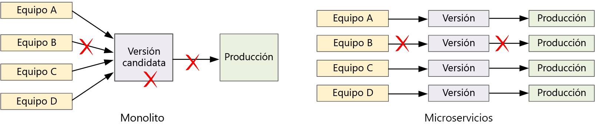

# Diseño de microservicios: integración continuaDesigning microservices: Continuous integration

La integración continua y la entrega continua (CI/CD) son un requisito clave para el buen funcionamiento de los microservicios.Continuous integration and continuous delivery (CI/CD) are a key requirement for achieving success with microservices. Sin un buen proceso de CI/CD, no disfrutará de la agilidad que los microservicios prometen.Without a good CI/CD process, you will not achieve the agility that microservices promise. Algunos de los desafíos de CI/CD para microservicios surgen debido a la existencia de varias bases de código y de entornos de compilación heterogéneos para los diversos servicios.Some of the CI/CD challenges for microservices arise from having multiple code bases and heterogenous build environments for the various services. En este capítulo se describen los desafíos y se recomiendan algunas estrategias para resolver los problemas.This chapter describes the challenges and recommends some approaches to the problem.

Una de las principales razones para adoptar una arquitectura de microservicios es la existencia de ciclos de lanzamiento más rápidos.Faster release cycles are one of the biggest reasons to adopt a microservices architecture. 

En una aplicación completamente monolítica, hay una canalización de compilación única cuya salida es el ejecutable de la aplicación.In a purely monolithic application, there is a single build pipeline whose output is the application executable. Todo el trabajo de desarrollo se envía a esta canalización.All development work feeds into this pipeline. Si se encuentra un error de alta prioridad, debe integrarse, probarse y publicarse una corrección, lo que puede retrasar el lanzamiento de nuevas características.If a high-priority bug is found, a fix must be integrated, tested, and published, which can delay the release of new features. Es cierto que puede mitigar estos problemas con módulos correctamente factorizados y el uso de ramas de características para minimizar el impacto de los cambios de código.It's true that you can mitigate these problems by having well-factored modules and using feature branches to minimize the impact of code changes. No obstante, a medida que la aplicación se hace más compleja y se van añadiendo más características, el proceso de publicación de un monolito tiende a hacerse más frágil, con lo que tiene más posibilidades de presentar errores.But as the application grows more complex, and more features are added, the release process for a monolith tends to become more brittle and likely to break. 

Según la filosofía de los microservicios, nunca debería haber una larga serie de versiones en la que todos los equipos tengan que hacer cola.Following the microservices philosophy, there should never be a long release train where every team has to get in line. El equipo que compila el servicio "A" podrá publicar una actualización en cualquier momento, sin tener que esperar a que los cambios realizados en el servicio "B" se combinen, prueben e implementen.The team that builds service "A" can release an update at any time, without waiting for changes in service "B" to be merged, tested, and deployed. El proceso de CI/CD es fundamental para que esto sea posible.The CI/CD process is critical to making this possible. La canalización de versión debe estar automatizada y ser altamente fiable, de forma que el riesgo de tener que implementar actualizaciones se reduzca al mínimo.Your release pipeline must be automated and highly reliable, so that the risks of deploying updates are minimized. Si va a promover versiones a producción una o varias veces al día, las regresiones e interrupciones del servicio deben ser muy poco frecuentes.If you are releasing to production daily or multiple times a day, regressions or service disruptions must be very rare. Al mismo tiempo, si se implementa una actualización con errores, debe disponer de un método fiable para ponerla al día o revertirla rápidamente a una versión anterior de un servicio.At the same time, if a bad update does get deployed, you must have a reliable way to quickly roll back or roll forward to a previous version of a service.

Cuando hablamos de CI/CD, estamos hablando realmente de varios procesos relacionados: la integración continua, la entrega continua y la implementación continua.When we talk about CI/CD, we are really talking about several related processes: Continuous integration, continuous delivery, and continuous deployment.

- La integración continua implica que los cambios en el código se combinarán frecuentemente en la rama principal mediante procesos de compilación y prueba automatizados, a fin de garantizar que el código de la rama principal siempre tenga calidad de producción.Continuous integration means that code changes are frequently merged into the main branch, using automated build and test processes to ensure that  code in the main branch is always production-quality.

- La entrega continua hace que los cambios en el código que pasan el proceso de integración continua se publiquen automáticamente en un entorno similar a la producción.Continuous delivery means that code changes that pass the CI process are automatically published to a production-like environment. La implementación en el entorno de producción real puede requerir aprobación manual, pero, en caso contrario, se realiza automáticamente.Deployment into the live production environment may require manual approval, but is otherwise automated. El objetivo es que el código siempre esté *listo* para implementarse en producción.The goal is that your code should always be *ready* to deploy into production.

- La implementación continua hace que los cambios en el código que pasan el proceso de CI/CD se implementen automáticamente en producción.Continuous deployment means that code changes that pass the CI/CD process are automatically deployed into production.

En el contexto de Kubernetes y de los microservicios, durante la fase de integración continua se compilan y prueban imágenes de contenedor, además de insertar esas imágenes en un registro de contenedor.In the context of Kubernetes and microservices, the CI stage is concerned with building and testing container images, and pushing those images to a container registry. En la fase de implementación, se actualizan las especificaciones de pod para recoger la imagen de producción más reciente.In the deployment stage, pod specs are updated to pick up the latest production image.

## DesafíosChallenges

- **Muchas bases de código pequeñas e independientes**.**Many small independent code bases**. Cada equipo es responsable de compilar su propio servicio, con su propia canalización de compilación.Each team is responsible for building its own service, with its own build pipeline. En algunas organizaciones, los equipos pueden usar repositorios de código distintos.In some organizations, teams may use separate code repositories. Esto podría provocar una situación en la que los diferentes equipos se especialicen en una parte distinta del proceso de compilación del sistema, pero nadie en la organización sepa realmente cómo implementar la aplicación completa.This could lead to a situation where the knowledge of how to build the system is spread across teams, and nobody in the organization knows how to deploy the entire application. Por ejemplo, ¿qué ocurriría en un escenario de recuperación ante desastres si fuera necesario implementar rápidamente en un nuevo clúster?For example, what happens in a disaster recovery scenario, if you need to quickly deploy to a new cluster?   

- **Varios lenguajes y plataformas**.**Multiple languages and frameworks**. Si cada equipo usa su propio conjunto de tecnologías, puede ser difícil crear un único proceso de compilación que sirva para toda la organización.With each team using its own mix of technologies, it can be difficult to create a single build process that works across the organization. El proceso de compilación debe ser lo suficientemente flexible como para que cada equipo pueda adaptarlo al lenguaje o la plataforma que utiliza.The build process must be flexible enough that every team can adapt it for their choice of language or framework. 

- **Integración y pruebas de carga**.**Integration and load testing**. Si cada equipo publica actualizaciones a su propio ritmo, puede resultar complicado diseñar una solución de pruebas integral sólida, especialmente si los servicios tienen dependencias en otros servicios.With teams releasing updates at their own pace, it can be challenging to design robust end-to-end testing, especially when services have dependencies on other services. Además, poner en marcha un clúster de producción completo puede ser costoso, por lo que resulta poco probable que cada equipo pueda ejecutar su propio clúster completo a escala de producción solo para realizar pruebas.Moreover, running a full production cluster can be expensive, so it's unlikely that every team will be able to run its own full cluster at production scales, just for testing. 

- **Administración de versiones**.**Release management**. Cada equipo debe tener la capacidad de implementar una actualización en producción.Every team should have the ability to deploy an update to production. Eso no significa que cada miembro del equipo tenga permiso para hacerlo.That doesn't mean that every team member has permissions to do so. Sin embargo, contar con un rol de administrador de versiones centralizado puede reducir la velocidad de las implementaciones.But having a centralized Release Manager role can reduce the velocity of deployments. Cuanto más automatizado y fiable sea el proceso de CI/CD, menor será la necesidad de contar con una autoridad central.The more that your CI/CD process is automated and reliable, the less there should be a need for a central authority. No obstante, puede tener una directiva para publicar actualizaciones de características importantes y otra distinta para publicar correcciones de errores menores.That said, you might have different policies for releasing major feature updates versus minor bug fixes. Un enfoque descentralizado no implica la ausencia completa de autoridad.Being decentralized does not mean there should be zero governance.

- **Control de versiones de imágenes de contenedor**.**Container image versioning**. Durante el ciclo de desarrollo y pruebas, el proceso de CI/CD compilará muchas imágenes de contenedor.During the development and test cycle, the CI/CD process will build many container images. Solo algunas de ellas serán candidatas a publicarse y, de estas, solo algunas se enviarán a producción.Only some of those are candidates for release, and then only some of those release candidates will get pushed into production. Debe tener una estrategia de control de versiones clara, para saber qué imágenes se están implementando actualmente en producción y pueda revertir a una versión anterior si es necesario.You should have a clear versioning strategy, so that you know which images are currently deployed to production, and can roll back to a previous version if necessary. 

- **Actualizaciones del servicio**.**Service updates**. Cuando se actualiza un servicio a una nueva versión, no debería interrumpir otros servicios que dependen de él.When you update a service to a new version, it shouldn't break other services that depend on it. Si hace una actualización gradual, durante un tiempo se ejecutarán distintas versiones a la vez.If you do a rolling update, there will be a period of time when a mix of versions is running. 
 
Estos desafíos reflejan una tensión fundamental.These challenges reflect a fundamental tension. Por una parte, los equipos tienen que trabajar con la mayor independencia posible.On the one hand, teams need to work as independently as possible. Por otro lado, se necesita cierta coordinación para que una sola persona pueda realizar tareas como ejecutar una prueba de integración, volver a implementar toda la solución en un nuevo clúster o revertir una actualización con errores.On the other hand, some coordination is needed so that a single person can do tasks like running an integration test, redeploying the entire solution to a new cluster, or rolling back a bad update. 
 
## Estrategias de CI/CD para microserviciosCI/CD approaches for microservices

Es una buena práctica que cada equipo de servicio incluya su entorno de compilación en un contenedor.It's a good practice for every service team to containerize their build environment. Este contenedor debe tener todas las herramientas de compilación necesarias para compilar los artefactos de código para su servicio.This container should have all of the build tools necessary to build the code artifacts for their service. A menudo puede encontrar una imagen de Docker oficial para su lenguaje y plataforma.Often you can find an official Docker image for your language and framework. Puede usar `docker run` o Docker Compose para ejecutar la compilación.Then you can use `docker run` or Docker Compose to run the build. 

Con este enfoque, es muy fácil configurar un nuevo entorno de compilación.With this approach, it's trivial to set up a new build environment. Un desarrollador que desee compilar el código no tendrá que instalar un conjunto de herramientas de compilación, sino que solo tendrá que ejecutar la imagen de contenedor.A developer who wants to build your code doesn't need to install a set of build tools, but simply runs the container image. Y, lo que puede ser más importante: podrá configurarse el servidor de compilación para que haga lo mismo.Perhaps more importantly, your build server can be configured to do the same thing. De este modo, no necesita instalar esas herramientas en el servidor de compilación ni administrar versiones en conflicto de herramientas.That way, you don't need to install those tools onto the build server, or manage conflicting versions of tools. 

Para el desarrollo y las pruebas locales, use Docker para ejecutar el servicio dentro de un contenedor.For local development and testing, use Docker to run the service inside a container. Como parte de este proceso, puede que tenga que ejecutar otros contenedores que tienen servicios ficticios o bases de datos de prueba necesarios para realizar pruebas locales.As part of this process, you may need to run other containers that have mock services or test databases needed for local testing. Podría utilizar Docker Compose para coordinar estos contenedores, o usar Minikube para ejecutar Kubernetes localmente.You could use Docker Compose to coordinate these containers, or use Minikube to run Kubernetes locally. 

Cuando el código esté listo, abra una solicitud de incorporación de cambios y combínelo con la versión maestra.When the code is ready, open a pull request and merge into master. Esto iniciará un trabajo en el servidor de compilación:This will start a job on the build server:

1. Compile los recursos del código.Build the code assets. 
2. Ejecute pruebas unitarias en el código.Run unit tests against the code.
3. Compile la imagen de contenedor.Build the container image.
4. Pruebe la imagen de contenedor mediante la ejecución de pruebas funcionales en un contenedor en ejecución.Test the container image by running functional tests on a running container. Este paso puede detectar errores en el archivo de Docker, como, por ejemplo, un punto de entrada incorrecto.This step can catch errors in the Docker file, such as a bad entry point.
5. Inserte la imagen en el registro de contenedor.Push the image to a container registry.
6. Actualice el clúster de prueba con la nueva imagen para ejecutar pruebas de integración.Update the test cluster with the new image to run integration tests.

Cuando la imagen esté lista para pasar a producción, actualice los archivos de implementación según sea necesario para especificar la imagen más reciente, incluidos los archivos de configuración de Kubernetes.When the image is ready to go into production, update the deployment files as needed to specify the latest image, including any Kubernetes configuration files. A continuación, aplique la actualización al clúster de producción.Then apply the update to the production cluster.

A continuación, se incluyen diversas recomendaciones para que las implementaciones sean más fiables:Here are some recommendations for making deployments more reliable:
 
- Defina convenciones para toda la organización de etiquetas contenedoras, control de versiones y nomenclatura para los recursos implementados en el clúster (pods, servicios, etc.).Define organization-wide conventions for container tags, versioning, and naming conventions for resources deployed to the cluster (pods, services, and so on). Esto puede ayudar a diagnosticar problemas de implementación más fácilmente.That can make it easier to diagnose deployment issues. 

- Cree dos registros de contenedor independientes, uno para desarrollo/pruebas y otro para producción.Create two separate container registries, one for development/testing and one for production. No inserte una imagen en el registro de producción hasta que esté listo para implementarla en producción.Don't push an image to the production registry until you're ready to deploy it into production. Si combina esta práctica con el versionamiento semántico de imágenes de contenedor, puede reducir la posibilidad de implementar accidentalmente una versión que no se ha aprobado para su publicación.If you combine this practice with semantic versioning of container images, it can reduce the chance of accidentally deploying a version that wasn't approved for release.

## Actualización de los serviciosUpdating services

Existen diversas estrategias de actualización de un servicio que ya está en producción.There are various strategies for updating a service that's already in production. Aquí analizaremos tres de las más frecuentes: la actualización gradual, la implementación azul-verde y el lanzamiento controlado.Here we discuss three common options: Rolling update, blue-green deployment, and canary release.

### Actualización gradualRolling update 

En una actualización gradual, se implementan nuevas instancias de un servicio y las instancias nuevas empiezan a recibir solicitudes de forma inmediata.In a rolling update, you deploy new instances of a service, and the new instances start receiving requests right away. A medida que llegan nuevas instancias, se eliminan las anteriores.As the new instances come up, the previous instances are removed.

Las actualizaciones graduales son el comportamiento predeterminado en Kubernetes cuando se actualiza la especificación de pod para una implementación.Rolling updates are the default behavior in Kubernetes when you update the pod spec for a Deployment. El controlador de implementación crea un ReplicaSet nuevo para los pods actualizados.The Deployment controller creates a new ReplicaSet for the updated pods. A continuación, se escala verticalmente el nuevo ReplicaSet mientras se reduce verticalmente el anterior a fin de mantener el número de réplicas deseado.Then it scales up the new ReplicaSet while scaling down the old one, to maintain the desired replica count. Los pods antiguos no se eliminarán hasta que los nuevos estén listos.It doesn't delete old pods until the new ones are ready. Kubernetes mantiene un historial de la actualización, por lo que puede usar kubectl para revertir una actualización si es necesario.Kubernetes keeps a history of the update, so you can use kubectl to roll back an update if needed. 

Si el servicio lleva a cabo una tarea de inicio prolongada, puede definir un sondeo de disponibilidad.If your service performs a long startup task, you can define a readiness probe. El sondeo de disponibilidad indica si el contenedor está listo para empezar a recibir tráfico.The readiness probe reports when the container is ready to start receiving traffic. Kubernetes no enviará tráfico al pod hasta que el sondeo devuelva un resultado satisfactorio.Kubernetes won't send traffic to the pod until the probe reports success. 

Las actualizaciones graduales plantean el desafío de que, durante el proceso de actualización, se ejecuta una combinación de versiones antiguas y nuevas que reciben tráfico.One challenge of rolling updates is that during the update process, a mix of old and new versions are running and receiving traffic. Durante este período, una solicitud podría dirigirse a cualquiera de las dos versiones.During this period, any request could get routed to either of the two versions. Esto podría ser problemático, en función del alcance de los cambios entre las dos versiones.That may or may not cause problems, depending on the scope of the changes between the two versions. 

### Implementación azul-verdeBlue-green deployment

En una implementación azul-verde, se implemente la nueva versión junto con la versión anterior.In a blue-green deployment, you deploy the new version alongside the previous version. Después de validar la nueva versión, se cambia todo el tráfico a la vez desde la versión anterior a la nueva versión.After you validate the new version, you switch all traffic at once from the previous version to the new version. Tras el cambio, deberá supervisar la aplicación para detectar posibles problemas.After the switch, you monitor the application for any problems. Si algo va mal, puede volver a la versión anterior.If something goes wrong, you can swap back to the old version. Si no hubiera ningún problema, puede eliminar la versión anterior.Assuming there are no problems, you can delete the old version.

Con una aplicación de n niveles o monolítica más tradicional, la implementación azul-verde normalmente implicaba el aprovisionamiento de dos entornos idénticos.With a more traditional monolithic or N-tier application, blue-green deployment generally meant provisioning two identical environments. La nueva versión se implementaría en un entorno de ensayo y se redirigiría el tráfico del cliente al entorno de ensayo &mdash;, por ejemplo, intercambiando las direcciones IP virtuales.You would deploy the new version to a staging environment, then redirect client traffic to the staging environment &mdash; for example, by swapping VIP addresses.

En Kubernetes, no es necesario aprovisionar un clúster diferente para realizar implementaciones azul-verde.In Kubernetes, you don't need to provision a separate cluster to do blue-green deployments. En su lugar, puede utilizar selectores.Instead, you can take advantage of selectors. Cree un nuevo recurso de implementación con una nueva especificación de pod y un conjunto diferente de etiquetas.Create a new Deployment resource with a new pod spec and a different set of labels. Cree esta implementación sin eliminar la implementación anterior ni modificar el servicio que hace referencia a ella.Create this deployment, without deleting the previous deployment or modifying the service that points to it. Una vez que se ejecutan los nuevos pods, puede actualizar el selector del servicio para que se corresponda con la nueva implementación.Once the new pods are running, you can update the service's selector to match the new deployment. 

Una de las ventajas de las implementaciones azul-verde es que el servicio cambia todos los pods al mismo tiempo.An advantage of blue-green deployments is that the service switches all the pods at the same time. Después de haber actualizado el servicio, todas las nuevas solicitudes se dirigirán a la nueva versión.After the service is updated, all new requests get routed to the new version. Una desventaja es que durante la actualización, se ejecuta el doble de pods para el servicio (actual y siguiente).One drawback is that during the update, you are running twice as many pods for the service (current and next). Si los pods requieren una gran cantidad de recursos de CPU o memoria, debe escalar horizontalmente el clúster de forma temporal para controlar el consumo de recursos.If the pods require a lot of CPU or memory resources, you may need to scale out the cluster temporarily to handle the resource consumption. 

### Lanzamiento controladoCanary release

En un lanzamiento controlado, se implementa una versión actualizada en un pequeño número de clientes.In a canary release, you roll out an updated version to a small number of clients. A continuación, supervisará el comportamiento del servicio nuevo antes de distribuirlo a todos los clientes.Then you monitor the behavior of the new service before rolling it out to all clients. Esto le permitirá realizar una implementación lenta de un modo controlado, observar datos reales y detectar problemas antes de que se ven afectados todos los clientes.This lets you do a slow rollout in a controlled fashion, observe real data, and spot problems before all customers are affected.

Un lanzamiento controlado es más complejo de administrar que una actualización gradual o azul-verde, ya que debe dirigir de forma dinámica las solicitudes a versiones distintas del servicio.A canary release is more complex to manage than either blue-green or rolling update, because you must dynamically route requests to different versions of the service. En Kubernetes, puede configurar un servicio para abarcar dos conjuntos de réplicas (uno para cada versión) y ajustar manualmente el número de réplicas.In Kubernetes, you can configure a Service to span two replica sets (one for each version) and adjust the replica counts manually. Sin embargo, este enfoque es bastante genérico, debido a la forma en que Kubernetes equilibra la carga entre los pods.However, this approach is rather coarse-grained, because of the way Kubernetes load balances across pods. Por ejemplo, si tiene un total de diez réplicas, solo puede cambiar el tráfico en incrementos del 10 %.For example, if you have a total of ten replicas, you can only shift traffic in 10% increments. Si utiliza una malla de servicio, puede utilizar las reglas de enrutamiento de malla de servicio para implementar una estrategia de lanzamiento controlado más sofisticada.If you are using a service mesh, you can use the service mesh routing rules to implement a more sophisticated canary release strategy. Aquí tiene algunos recursos que pueden serle de ayuda:Here are some resources that may be helpful:

- Kubernetes sin malla de servicio: [Implementaciones de lanzamiento controlado](https://kubernetes.io/docs/concepts/cluster-administration/manage-deployment/#canary-deployments)Kubernetes without service mesh: [Canary deployments](https://kubernetes.io/docs/concepts/cluster-administration/manage-deployment/#canary-deployments)
- Linkerd: [Enrutamiento de solicitud dinámica](https://linkerd.io/features/routing/)Linkerd: [Dynamic request routing](https://linkerd.io/features/routing/)
- Istio: [Implementaciones de lanzamiento controlado con Istio](https://istio.io/blog/canary-deployments-using-istio.html)Istio: [Canary Deployments using Istio](https://istio.io/blog/canary-deployments-using-istio.html)

## ConclusiónConclusion

En los últimos años, ha habido un cambio drástico en el sector, al pasar de la creación de *sistemas de registro* a la creación de *sistemas de interacción*.In recent years, there has been a sea change in the industry, a movement from building *systems of record* to building *systems of engagement*.

Los sistemas de registro son aplicaciones de administración de datos del área de operaciones tradicionales.Systems of record are traditional back-office data management applications. Estos sistemas se basan en un sistema de administración de bases de datos relacionales, que es el único origen de datos.At the heart of these systems there often sits an RDBMS that is the single source of truth. El término "sistema de interacción" (System of Engagement) se atribuye a Geoffrey Moore, que lo acuñó en su trabajo *Systems of Engagement and the Future of Enterprise IT* de 2011.The term "system of engagement" is credited to Geoffrey Moore, in his 2011 paper *Systems of Engagement and the Future of Enterprise IT*. Los sistemas de interacción son aplicaciones que se centran en la comunicación y la colaboración.Systems of engagement are applications focused on communication and collaboration. Conectan personas en tiempo real.They connect people in real time. Deben estar disponibles en todo momento.They must be available 24/7. Se introducen periódicamente nuevas características sin tener que desconectar la aplicación.New features are introduced regularly without taking the application offline. Los usuarios tienen mayores expectativas y menos paciencia con los retrasos o tiempos de inactividad inesperados.Users expect more and are less patient of unexpected delays or downtime.

Para los consumidores, una mejor experiencia de usuario puede tener un valor cuantificable en el negocio.In the consumer space, a better user experience can have measurable business value. La cantidad de tiempo que un usuario interactúe con una aplicación puede traducirse directamente en ingresos.The amount of time that a user engages with an application may translate directly into revenue. Además, en el mundo de los sistemas empresariales, las expectativas de los usuarios han cambiado.And in the realm of business systems, users' expectations have changed. Si estos sistemas tienen como objetivo fomentar la comunicación y la colaboración, deben seguir el ejemplo de aplicaciones orientadas al consumidor.If these systems aim to foster communication and collaboration, they must take their cue from consumer-facing applications.

Los microservicios ofrecen una respuesta a este panorama cambiante.Microservices are a response to this changing landscape. Al descomponer una aplicación monolítica en un grupo de servicios con acoplamiento flexible, podemos controlar el ciclo de versiones de cada servicio y habilitar actualizaciones frecuentes sin tiempo de inactividad ni cambios drásticos.By decomposing a monolithic application into a group of loosely coupled services, we can control the release cycle of each service, and enable frequent updates without downtime or breaking changes. Los microservicios también ayudan con la escalabilidad, el aislamiento de errores y la resistencia.Microservices also help with scalability, failure isolation, and resiliency. Mientras tanto, las plataformas en la nube permiten compilar y ejecutar microservicios cada vez más fácilmente, con aprovisionamiento automatizado de recursos de proceso, orquestadores de contenedor como servicio y entornos sin servidor basados en eventos.Meanwhile, cloud platforms are making it easier to build and run microservices, with automated provisioning of compute resources, container orchestrators as a service, and event-driven serverless environments.

No obstante, como hemos visto, las arquitecturas de microservicios también presentan una gran cantidad de desafíos.But as we've seen, microservices architectures also being a lot of challenges. Para tener éxito, debe empezar con un diseño sólido.To succeed, you must start from a solid design. Debe pensar detenidamente cómo analizar el dominio, elegir las tecnologías, modelar datos, diseñar API y crear una referencia cultural de DevOps consolidada.You must put careful thought into analyzing the domain, choosing technologies, modeling data, designing APIs, and building a mature DevOps culture. Esperamos que esta guía y la [implementación de referencia](https://github.com/mspnp/microservices-reference-implementation) adjunta le hayan ayudado a aclarar el proceso.We hope that this guide, and the accompanying [reference implementation](https://github.com/mspnp/microservices-reference-implementation), has helped to illuminate the journey. 

