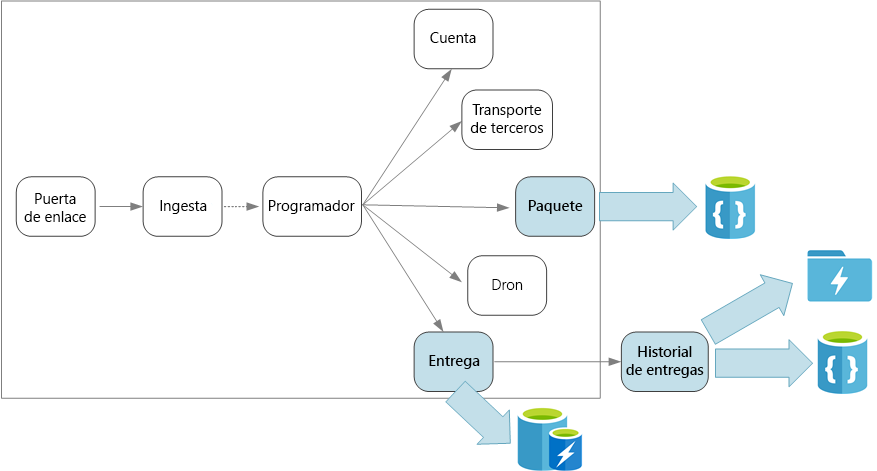
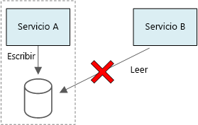

# Diseño de microservicios: consideraciones de datos

Este capítulo describe las consideraciones para administrar los datos en una arquitectura de microservicios. Como cada microservicio administra sus propios datos, la integridad y la coherencia de los datos son desafíos fundamentales.

Un principio básico de los microservicios es que cada servicio administra sus propios datos. Dos servicios no deben compartir un mismo almacén de datos. En su lugar, cada servicio es responsable de su propio almacén de datos privado, al que otros servicios no pueden acceder directamente.

La razón de esta regla es evitar el acoplamiento involuntario entre servicios, lo que puede suceder si los servicios comparten los mismos esquemas de datos subyacentes. Si hay un cambio en el esquema de datos, se debe coordinar en todos los servicios que utilizan esa base de datos. Al aislar el almacén de datos de cada servicio, podemos limitar el ámbito del cambio y conservar la agilidad de las implementaciones realmente independientes. Otro motivo es que cada microservicio puede tener sus propios modelos de datos, consultas o patrones de lectura o escritura. Usar un almacén de datos compartido limita la capacidad de cada equipo para optimizar el almacenamiento de datos para su servicio en particular. 

Naturalmente, este enfoque da lugar a una [persistencia políglota](https://martinfowler.com/bliki/PolyglotPersistence.html), es decir, el uso de varias tecnologías de almacenamiento de datos dentro de una única aplicación. Un servicio podría necesitar las funcionalidades de lectura de esquema de una base de datos de documento. Otro podría requerir la integridad referencial que proporciona un RDBMS. Cada equipo tiene libertad para elegir la mejor opción para su servicio. Para más información sobre el principio general de la persistencia políglota, consulte [Uso del mejor almacén de datos para el trabajo](../guide/design-principles/use-the-best-data-store.md). 

> [!NOTE]
> Es apropiado para servicios que comparten el mismo servidor de base de datos físico. El problema se produce cuando los servicios comparten el mismo esquema, o leen y escriben en el mismo conjunto de tablas de base de datos.

## Desafíos

Este enfoque distribuido de administración de datos plantea algunos desafíos. En primer lugar, puede haber redundancia a través de los almacenes de datos, con el mismo elemento de datos que aparece en varios lugares. Por ejemplo, se podrían almacenar los datos como parte de una transacción y, a continuación, almacenarse en otra ubicación para análisis, creación de informes o para archivarse. Los datos duplicados o con particiones pueden provocar problemas de coherencia e integridad de los datos. Cuando las relaciones entre los datos abarcan varios servicios, no puede usar técnicas de administración de datos tradicionales para hacer que se cumplan las relaciones.

El modelado de datos tradicional usa la regla "un hecho en un solo lugar". Todas las entidades aparecen exactamente una vez en el esquema. Otras entidades pueden contener referencias a él, pero no lo duplican. La ventaja obvia respecto al enfoque tradicional es que las actualizaciones se realizan en un único lugar, lo que evita problemas de coherencia de los datos. En una arquitectura de microservicios, debe tener en cuenta cómo se propagan las actualizaciones a través de los servicios y cómo administrar la posible coherencia cuando los datos aparecen en varios lugares sin una coherencia fuerte. 

## Enfoques para la administración de datos

No existe un enfoque único que sea correcto en todos los casos, pero estas son algunas directrices generales para administrar los datos en una arquitectura de microservicios.

- Adopte una coherencia final cuando sea posible. Conozca los lugares del sistema en los que necesita una coherencia estricta o transacciones ACID, y los lugares donde la posible coherencia es aceptable.

- Cuando se necesitan garantías de coherencia estricta, un servicio puede representar el origen de confianza de una entidad determinada, que se expone a través de una API. Otros servicios podrían mantener su propia copia de los datos, o un subconjunto de los datos, que posiblemente es coherente con los datos maestros pero no se considera el origen de confianza. Por ejemplo, imagine un sistema de comercio electrónico con un servicio de pedidos de cliente y un servicio de recomendaciones. El servicio de recomendaciones podría escuchar los eventos del servicio de pedidos pero, si un cliente solicita un reembolso, es el servicio de pedidos y no el servicio de recomendaciones el que tiene el historial completo de la transacción.

- Para las transacciones, use patrones como [Scheduler Agent Supervisor](../patterns/scheduler-agent-supervisor.md) (Supervisor del agente de Scheduler) y [Compensating Transaction](../patterns/compensating-transaction.md) (Transacción de compensación) para mantener la coherencia de los datos entre varios servicios.  Debe almacenar una parte adicional de los datos que capturan el estado de una unidad de trabajo que abarca varios servicios con el fin de evitar este error parcial entre varios servicios. Por ejemplo, mantenga un elemento de trabajo en una cola duradera mientras una transacción de varios pasos está en curso. 

- Almacene únicamente los datos que necesita un servicio. Un servicio podría necesitar únicamente un subconjunto de información acerca de una entidad del dominio. Por ejemplo, en el contexto limitado de envío, es necesario saber qué cliente está asociado a una entrega determinada. Pero no se necesita la dirección de facturación del cliente; eso lo administra el contexto delimitado de cuentas. Pensar detenidamente en el dominio y usar un enfoque DDD pueden ayudar en este punto. 

- Tenga en cuenta si los servicios son coherentes y con acoplamiento flexible. Si dos servicios intercambian información entre sí continuamente, dando lugar a API "conversadoras", deberá volver a dibujar los límites del servicio mediante la combinación de dos servicios o la refactorización de su funcionalidad.

- Utilice un [estilo de arquitectura basado en eventos](../guide/architecture-styles/event-driven.md). En este estilo de arquitectura, un servicio publica un evento cuando hay cambios en sus entidades o modelos públicos. Los servicios interesados pueden suscribirse a estos eventos. Por ejemplo, otro servicio puede utilizar los eventos para crear una vista materializada de los datos que son más adecuados para realizar consultas. 

- Un servicio que posee eventos debe publicar un esquema que pueda utilizarse para automatizar la serialización y deserialización de los eventos para evitar el acoplamiento rígido entre los anunciantes y los suscriptores. Considere la posibilidad de usar un esquema JSON o un marco de trabajo como [Microsoft Bond](https://github.com/Microsoft/bond), Protobuf o Avro.  
 
- A gran escala, los eventos pueden convertirse en un cuello de botella en el sistema, por lo que puede plantearse usar la agregación o el procesamiento por lotes para reducir la carga total. 

## Drone Delivery: Elección de los almacenes de datos 

Incluso con solo unos pocos servicios, el contexto limitado de envío muestra algunos de los puntos que se tratan en esta sección. 

Cuando un usuario programa una entrega nueva, la solicitud del cliente incluye la información sobre el envío, como las ubicaciones de recogida y entrega, y otros aspectos acerca del paquete, como su tamaño y peso. Esta información define una unidad de trabajo que el servicio de ingesta de datos envía a Event Hubs. Es importante que la unidad de trabajo permanezca en el almacenamiento persistente mientras el servicio Scheduler ejecuta el flujo de trabajo, con el fin de que no se pierda ninguna solicitud de entrega. Para más información sobre el flujo de trabajo, consulte [Ingesta de datos y flujo de trabajo](./ingestion-workflow.md). 

Los diversos servicios back-end se ocupan de las diferentes partes de la información en la solicitud, y también cuentan con diferentes perfiles de lectura y escritura. 

### Servicio de entrega

El servicio de entrega almacena información acerca de cada entrega que actualmente está programada o en curso. Escucha los eventos de los drones y realiza un seguimiento del estado de las entregas que están en curso. También envía eventos de dominio con actualizaciones del estado de entrega.

Se espera que los usuarios comprueben con frecuencia el estado de una entrega mientras esperan la llegada de su paquete. Por lo tanto, el servicio de entrega requiere un almacén de datos que enfatice el rendimiento (lectura y escritura) durante el almacenamiento a largo plazo. Además, el servicio de entrega no lleva a cabo las consultas o los análisis complejos, simplemente captura el estado más reciente de una entrega determinada. El equipo del servicio de entrega eligió Azure Redis Cache por su alto rendimiento de lectura y escritura. La información almacenada en Redis es de una duración relativamente corta. Una vez completada una entrega, el servicio del historial de entrega es el sistema de registro.

### Servicio del historial de entrega

El servicio del historial de entrega escucha los eventos de estado de entrega del servicio de entrega. Almacena estos datos en el almacenamiento a largo plazo. Hay dos casos de uso diferentes para estos datos históricos, que tienen diversos requisitos de almacenamiento de datos. 

El primer escenario es agregar los datos para analizarlos, con el fin de optimizar el negocio o mejorar la calidad del servicio. Tenga en cuenta que el servicio del historial de entrega no realiza el análisis real de los datos. Solo es responsable de la ingesta de datos y el almacenamiento. En este escenario, se debe optimizar el almacenamiento para el análisis de datos a través de un conjunto grande de datos mediante un enfoque de lectura de esquema para dar cabida a una variedad de orígenes de datos. [Azure Data Lake Store](/azure/data-lake-store/) es una buena elección para este escenario. Data Lake Store es un sistema de archivos de Apache Hadoop compatible con el sistema de archivos distribuido de Hadoop (HDFS) y optimizado para obtener rendimiento en escenarios de análisis de datos. 

El otro escenario es permitir que los usuarios busquen el historial de una entrega una vez que se haya completado. Azure Data Lake no está optimizado especialmente para este escenario. Para obtener un rendimiento óptimo, Microsoft recomienda almacenar los datos de serie temporal en Data Lake, en carpetas con particiones por fecha. (Consulte [Ajuste del rendimiento de Azure Data Lake Store](/azure/data-lake-store/data-lake-store-performance-tuning-guidance)). Sin embargo, esa estructura no es óptima para buscar los registros individuales por identificador. A menos que también se conozca la marca de tiempo, una búsqueda por identificador requiere examinar toda la colección. Por lo tanto, el servicio del historial de entrega también almacena un subconjunto de los datos históricos en Cosmos DB para una búsqueda rápida. Los registros no deben permanecer en Cosmos DB indefinidamente. Las entregas anteriores se pueden archivar &mdash; por ejemplo, después de un mes. Puede hacerse mediante la ejecución de un proceso por lotes ocasionales.

### Servicio de paquete

El servicio de paquete almacena información sobre todos los paquetes. Los requisitos de almacenamiento para el paquete son: 

- Almacenamiento a largo plazo.
- Puede controlar un gran volumen de paquetes, para ello necesitará un rendimiento de escritura alto.
- Compatibilidad con consultas sencillas con el identificador del paquete. No hay combinaciones complejas o requisitos para la integridad referencial.

Dado que los datos del paquete no son relacionales, es adecuada una base de datos orientada a documento, y Cosmos DB puede lograr un rendimiento muy alto mediante el uso de colecciones con particiones. El equipo que funciona en el servicio de paquete está familiarizado con la pila MEAN (MongoDB, Express.js, AngularJS y Node.js), por lo que seleccionan la [API de MongoDB](/azure/cosmos-db/mongodb-introduction) para Cosmos DB. Les permite aprovechar su experiencia existente con MongoDB, al mismo tiempo que obtienen las ventajas de Cosmos DB, que es un servicio administrado de Azure.

> [!div class="nextstepaction"]
> [Comunicación entre servicios](./interservice-communication.md)