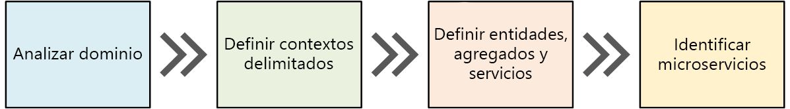
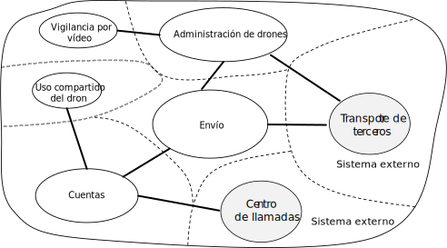
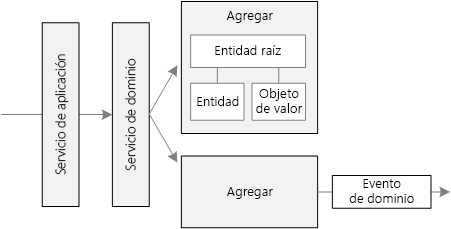
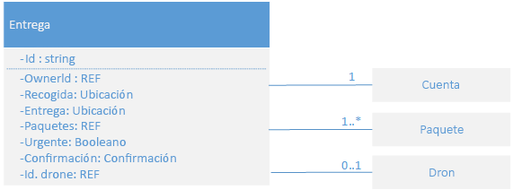
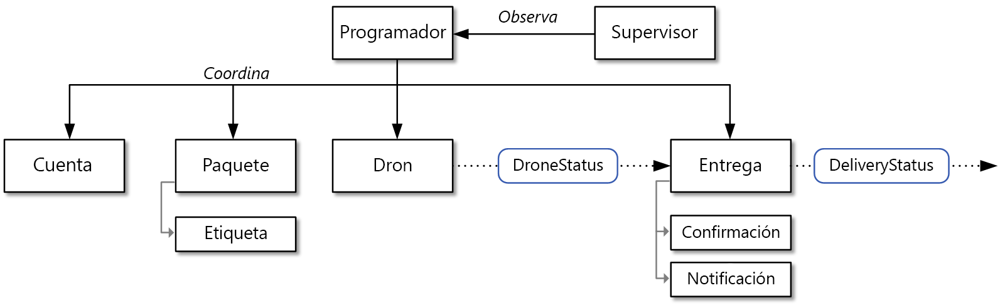

# Diseño de microservicios: análisis de dominiosDesigning microservices: Domain analysis 

Uno de los mayores desafíos de los microservicios es definir los límites de los servicios individuales.One of the biggest challenges of microservices is to define the boundaries of individual services. La regla general es que un servicio debe hacer "algo"; sin embargo, llevarla a la práctica requiere una minuciosa reflexión.The general rule is that a service should do "one thing" &mdash; but putting that rule into practice requires careful thought. No hay ningún proceso mecánico que cree el diseño "correcto".There is no mechanical process that will produce the "right" design. Debe meditar detenidamente sobre el dominio de su empresa, los requisitos y los objetivos.You have to think deeply about your business domain, requirements, and goals. En caso contrario, puede terminar con un diseño incoherente que exhiba algunas características no deseables, como son dependencias ocultas entre servicios, un acoplamiento rígido o interfaces mal diseñadas.Otherwise, you can end up with a haphazard design that exhibits some undesirable characteristics, such as hidden dependencies between services, tight coupling, or poorly designed interfaces. En este capítulo, se adopta un enfoque basado en dominios para el diseño de los microservicios.In this chapter, we take a domain-driven approach to designing microservices. 

Los microservicios deben diseñarse alrededor de las funcionalidades de la empresa, no en capas horizontales como el acceso a datos o la mensajería.Microservices should be designed around business capabilities, not horizontal layers such as data access or messaging. Además, deben tener un acoplamiento flexible y una alta cohesión funcional.In addition, they should have loose coupling and high functional cohesion. Los microservicios exhiben un *acoplamiento flexible* si puede cambiar un servicio sin necesidad de que los demás se actualicen al mismo tiempo.Microservices are *loosely coupled* if you can change one service without requiring other services to be updated at the same time. Un microservicio es *coherente* si tiene un propósito único y bien definido, como administrar las cuentas de usuario o realizar el seguimiento del historial de entregas.A microservice is *cohesive* if it has a single, well-defined purpose, such as managing user accounts or tracking delivery history. Un servicio debe encapsular el conocimiento del dominio y abstraer ese conocimiento ante los clientes.A service should encapsulate domain knowledge and abstract that knowledge from clients. Por ejemplo, un cliente debe poder programar un dron sin conocer los detalles sobre el algoritmo de programación y el modo en que la flota de drones se administra.For example, a client should be able to schedule a drone without knowing the details of the scheduling algorithm or how the drone fleet is managed.

El diseño basado en dominios (DDD) proporciona una plataforma que puede ayudarle en gran medida a diseñar bien los microservicios.Domain-driven design (DDD) provides a framework that can get you most of the way to a set of well-designed microservices. El diseño basado en dominios tiene dos fases distintas, tácticas y estratégicas.DDD has two distinct phases, strategic and tactical. En el diseño basado en dominios estratégico, se define la estructura a gran escala del sistema.In strategic DDD, you are defining the large-scale structure of the system. Ayuda a garantizar que la arquitectura permanece centrada en las funcionalidades del negocio.Strategic DDD helps to ensure that your architecture remains focused on business capabilities. El diseño basado en dominios táctico proporciona un conjunto de modelos de diseño que puede usar para crear el modelo de dominio.Tactical DDD provides a set of design patterns that you can use to create the domain model. Estos modelos incluyen entidades, agregados y servicios de dominio.These patterns include entities, aggregates, and domain services. Los modelos tácticos le ayudarán a diseñar microservicios coherentes y con acoplamiento flexible.These tactical patterns will help you to design microservices that are both loosely coupled and cohesive.

En este capítulo y en el siguiente, usaremos los siguientes pasos con la aplicación Drone Delivery:In this chapter and the next, we'll walk through the following steps, applying them to the Drone Delivery application: 

1. Empiece por analizar el dominio de la empresa para conocer los requisitos funcionales de la aplicación.Start by analyzing the business domain to understand the application's functional requirements. El resultado de este paso es una descripción informal del dominio, que puede perfilarse en un conjunto más formal de modelos de dominio.The output of this step is an informal description of the domain, which can be refined into a more formal set of domain models. 

2. A continuación, defina los *contextos delimitados* del dominio.Next, define the *bounded contexts* of the domain. Cada contexto delimitado contiene un modelo de dominio que representa un subdominio concreto de la aplicación mayor.Each bounded context contains a domain model that represents a particular subdomain of the larger application. 

3. Dentro de un contexto delimitado, se aplican los modelos tácticos de diseño basado en dominios para definir las entidades, los agregados y los servicios de dominio.Within a bounded context, apply tactical DDD patterns to define entities, aggregates, and domain services. 
 
4. Use los resultados del paso anterior para identificar los microservicios en la aplicación.Use the results from the previous step to identity the microservices in your application.

En este capítulo, trataremos los tres primeros pasos, relacionados principalmente con el diseño basado en dominios.In this chapter, we cover the first three steps, which are primarily concerned with DDD. En el próximo capítulo, se identificarán los microservicios.In the next chapter, we will identify the microservices. Sin embargo, es importante recordar que el diseño basado en dominios es un proceso iterativo y en curso.However, it's important to remember that DDD is an iterative, ongoing process. Los límites del servicio no son fijos.Service boundaries aren't fixed in stone. A medida que una aplicación evolucione, puede decidir dividir un servicio en varios menores.As an application evolves, you may decide to break apart a service into several smaller services.

> [!NOTE]
> Este capítulo no está pensado para mostrar un análisis de dominio completo y minucioso.This chapter is not meant to show a complete and comprehensive domain analysis. Hemos hecho deliberadamente que el ejemplo sea breve para ilustrar los puntos principales.We deliberately kept the example brief, in order to illustrate the main points. Para obtener más información sobre el diseño basado en dominios, se recomienda el libro de Eric Evans *Domain-Driven Design* (Diseño basado en dominios), en el que se usó el término por primera vez.For more background on DDD, we recommend Eric Evans' *Domain-Driven Design*, the book that first introduced the term. Otra buena referencia es *Implementing Domain-Driven Design* (Implementación del diseño basado en dominios), de Vaughn Vernon.Another good reference is *Implementing Domain-Driven Design* by Vaughn Vernon. 

## Análisis del dominioAnalyze the domain

El empleo de un método de diseño basado en dominios le ayudará a diseñar los microservicios de modo que cada servicio constituya una solución natural para un requisito empresarial funcional.Using a DDD approach will help you to design microservices so that every service forms a natural fit to a functional business requirement. Puede servirle de ayuda para evitar la trampa que supone permitir que los límites de la organización o las elecciones de tecnología dicten el diseño.It can help you to avoid the trap of letting organizational boundaries or technology choices dictate your design.

Antes de escribir ningún código, necesita una visión general del sistema que se va a crear.Before writing any code, you need a bird's eye view of the system that you are creating. Con el diseño basado en dominios, se empieza por modelar el dominio empresarial y se crea un *modelo de dominio*.DDD starts by modeling the business domain and creating a *domain model*. El modelo de dominio es un modelo abstracto del ámbito empresarial.The domain model is an abstract model of the business domain. Extrae y organiza el conocimiento del dominio, y proporciona un lenguaje común para los desarrolladores y los expertos en los dominios.It distills and organizes domain knowledge, and provides a common language for developers and domain experts. 

Empiece por asignar todas las funciones empresariales y sus conexiones.Start by mapping all of the business functions and their connections. Probablemente, esto requerirá la colaboración de los expertos en dominios, los arquitectos de software y otros actores implicados.This will likely be a collaborative effort that involves domain experts, software architects, and other stakeholders. No es necesario usar ningún formalismo concreto.You don't need to use any particular formalism.  Esboce un diagrama o dibuje en una pizarra.Sketch a diagram or draw on whiteboard.

A medida que rellene el diagrama, puede empezar a identificar subdominios discretos.As you fill in the diagram, you may start to identify discrete subdomains. ¿Qué funciones están estrechamente relacionadas?Which functions are closely related? ¿Cuáles son fundamentales para la empresa y cuáles proporcionan servicios auxiliares?Which functions are core to the business, and which provide ancillary services? ¿Cuál es el gráfico de dependencias?What is the dependency graph? Durante esta fase inicial, no se preocupe de las tecnologías ni de los detalles de implementación.During this initial phase, you aren't concerned with technologies or implementation details. Es decir, debe tener en cuenta el lugar donde la aplicación tendrá que integrarse con sistemas externos, como CRM o sistemas de facturación o de procesamiento de pagos.That said, you should note the place where the application will need to integrate with external systems, such as CRM, payment processing, or billing systems. 

## Drone Delivery: análisis del dominio empresarial.Drone Delivery: Analyzing the business domain.

Después del análisis inicial del dominio, el equipo de Fabrikam ha propuesto un borrador que representa el dominio para Drone Delivery.After some initial domain analysis, the Fabrikam team came up with a rough sketch that depicts the Drone Delivery domain.

 

- El elemento **Shipping** (envío) se coloca en el centro del diagrama, ya que es importante para el negocio.**Shipping** is placed in the center of the diagram, because it's core to the business. Todo lo demás dentro del diagrama existe para habilitar esta funcionalidad.Everything else in the diagram exists to enable this functionality.
- El elemento **Drone management** (administración de drones) también es esencial para la empresa.**Drone management** is also core to the business. La funcionalidad que está estrechamente relacionada con la anterior es **Drone repair** (reparación de drones) y el uso de **predictive analysis**  (análisis predictivos) que permiten predecir el momento en que los drones tienen que someterse a tareas de mantenimiento.Functionality that is closely related to drone management includes **drone repair** and using **predictive analysis** to predict when drones need servicing and maintenance. 
- **ETA analysis** (análisis del tiempo estimado de llegada) proporciona estimaciones de tiempo para la recogida y la entrega.**ETA analysis** provides time estimates for pickup and delivery. 
- La funcionalidad **Third-party transportation** (transporte de terceros) permitirá que la aplicación programe métodos de transporte alternativo, si un dron no puede entregar un paquete completo.**Third-party transportation** will enable the application to schedule alternative transportation methods if a package cannot be shipped entirely by drone.
- La funcionalidad **Drone sharing** (uso compartido de drones) es una posible extensión del negocio principal.**Drone sharing** is a possible extension of the core business. La empresa puede tener drones de sobra durante ciertas horas y alquilar el excedente que, de otro modo, permanecería inactivo.The company may have excess drone capacity during certain hours, and could rent out drones that would otherwise be idle. Esta característica no estará en la versión inicial.This feature will not be in the initial release.
- La funcionalidad **Video surveillance** (vigilancia por vídeo) es otra área que la empresa podría expandir en versiones posteriores.**Video surveillance** is another area that the company might expand into later.
- **User accounts** (cuentas de usuario), **Invoicing** (facturación) y **Call center** (centro de llamadas) son subdominios que contribuyen al negocio principal.**User accounts**, **Invoicing**, and **Call center** are subdomains that support the core business.
 
Tenga en cuenta que, en este punto del proceso, no hemos tomado decisiones sobre la implementación o las tecnologías.Notice that at this point in the process, we haven't made any decisions about implementation or technologies. Algunos de los subsistemas pueden implicar a sistemas de software externos o servicios de terceros.Some of the subsystems may involve external software systems or third-party services. Aun así, la aplicación requiere interactuar con estos sistemas y servicios, por lo que es importante incluirlos en el modelo de dominio.Even so, the application needs to interact with these systems and services, so it's important to include them in the domain model. 

> [!NOTE]
> Cuando una aplicación depende de un sistema externo, existe el riesgo de que el esquema de datos o la API del sistema externo se infiltren en la aplicación, poniendo en peligro a la larga el diseño de la arquitectura.When an application depends on an external system, there is a risk that the external system's data schema or API will leak into your application, ultimately compromising the architectural design. Esto ocurre especialmente con sistemas heredados que pueden no seguir procedimientos recomendados modernos y podrían usar esquemas de datos complejos o API obsoletas.This is particularly true with legacy systems that may not follow modern best practices, and may use convoluted data schemas or obsolete APIs. En ese caso, es importante contar con un límite bien definido entre dichos sistemas externos y la aplicación.In that case, it's important to have a well-defined boundary between these external systems and the application. Considere el uso del [patrón Strangler](../patterns/strangler.md) o del [patrón Anti-Corruption Layer](../patterns/anti-corruption-layer.md) para este propósito.Consider using the [Strangler Pattern](../patterns/strangler.md) or the [Anti-Corruption Layer Pattern](../patterns/anti-corruption-layer.md) for this purpose.

## Definición de contextos delimitadosDefine bounded contexts

El modelo de dominio incluirá representaciones de cosas reales del mundo, como son usuarios, drones, paquetes y otras.The domain model will include representations of real things in the world &mdash; users, drones, packages, and so forth. Pero eso no significa que todas las partes del sistema deban usar las mismas representaciones para las mismas cosas.But that doesn't mean that every part of the system needs to use the same representations for the same things. 

Por ejemplo, los subsistemas que controlan la reparación de drones y el análisis predictivo tendrán que representar los drones con muchas características físicas, como su historial de mantenimiento, kilometraje, antigüedad, número de modelo, características de rendimiento, etcétera.For example, subsystems that handle drone repair and predictive analysis will need to represent many physical characteristics drones, such as their maintenance history, mileage, age, model number, performance characteristics, and so on. Pero, cuando llega el momento de programar una entrega, no importan esos elementos.But when it's time to schedule a delivery, we don't care about those things. El subsistema de programación solo necesita saber si un dron está disponible y el tiempo estimado para la recogida y la entrega.The scheduling subsystem only needs to know whether a drone is available, and the ETA for pickup and delivery. 

Si se ha intentado crear un modelo único para ambos subsistemas, sería innecesariamente complejo.If we tried to create a single model for both of these subsystems, it would be unnecessarily complex. También resultaría más difícil para el modelo evolucionar con el tiempo, porque los cambios deberán satisfacer a varios equipos que trabajen en subsistemas independientes.It would also become harder for the model to evolve over time, because any changes will need to satisfy multiple teams working on separate subsystems. Por lo tanto, a menudo es mejor diseñar modelos independientes que representen la misma entidad del mundo real (en este caso, un dron) en dos contextos diferentes.Therefore, it's often better to design separate models that represent the same real-world entity (in this case, a drone) in two different contexts. Cada modelo contiene solo las características y los atributos que sean pertinentes en su contexto determinado.Each model contains only the features and attributes that are relevant within its particular context.

Aquí es donde entra en juego el concepto del diseño basado en dominios referente a los *contextos limitados*.This is where the DDD concept of *bounded contexts* comes into play. Un contexto delimitado es simplemente el límite dentro de un dominio donde se aplica un modelo de dominio en particular.A bounded context is simply the boundary within a domain where a particular domain model applies. Si examinamos el diagrama anterior, podemos agrupar la funcionalidad teniendo en cuenta si varias funciones compartirán un único modelo de dominio.Looking at the previous diagram, we can group functionality according to whether various functions will share a single domain model. 

 
 
Los contextos delimitados no están necesariamente aislados entre sí.Bounded contexts are not necessarily isolated from one another. En este diagrama, las líneas continuas que conectan los contextos delimitados representan los lugares donde dos de ellos interactúan.In this diagram, the solid lines connecting the bounded contexts represent places where two bounded contexts interact. Por ejemplo, el envío depende de las cuentas de usuario (Accouns) para obtener información sobre los clientes y de la administración de drones (Drone management) para programar los de la flota.For example, Shipping depends on User Accounts to get information about customers, and on Drone Management to schedule drones from the fleet.

En el libro *Domain Driven Design* de Eric Evans, se describen varios patrones para mantener la integridad de un modelo de dominio cuando interactúa con otro contexto delimitado.In the book *Domain Driven Design*, Eric Evans describes several patterns for maintaining the integrity of a domain model when it interacts with another bounded context. Uno de los principios fundamentales de los microservicios es que los servicios se comunican a través de API bien definidas.One of the main principles of microservices is that services communicate through well-defined APIs. Este método se corresponde con dos patrones que Evans llama Open Host Service (servicio de host abierto) y Published Language (lenguaje publicado).This approach corresponds to two patterns that Evans calls Open Host Service and Published Language. La idea subyacente en Open Host Service es que un subsistema define un protocolo formal (API) para que otros se comuniquen con él.The idea of Open Host Service is that a subsystem defines a formal protocol (API) for other subsystems to communicate with it. Published Language amplía esta idea publicando la API de forma que otros equipos puedan usarla para escribir clientes.Published Language extends this idea by publishing the API in a form that other teams can use to write clients. En el capítulo sobre el [diseño de API](./api-design.md), se trata sobre el uso de [OpenAPI Specification](https://www.openapis.org/specification/repo) (Especificación de OpenAPI), conocida anteriormente como Swagger, para definir las descripciones de la interfaz independiente del lenguaje para las API de REST, expresadas en formato JSON o YAML.In the chapter on [API Design](./api-design.md), we discuss using [OpenAPI Specification](https://www.openapis.org/specification/repo) (formerly known as Swagger) to define language-agnostic interface descriptions for REST APIs, expressed in JSON or YAML format.

En el resto de este viaje, nos centraremos en el contexto delimitado del envío.For the rest of this journey, we will focus on the Shipping bounded context. 

## Diseño basado en dominios tácticoTactical DDD

Durante la fase estratégica del diseño basado en dominios (DDD), se asigna el dominio empresarial y se definen los contextos delimitados para los modelos de dominio.During the strategic phase of DDD, you are mapping out the business domain and defining bounded contexts for your domain models. El diseño basado en dominios táctico consiste en definir los modelos de dominio con más precisión.Tactical DDD is when you define your domain models with more precision. Los patrones tácticos se aplican dentro de un único contexto delimitado.The tactical patterns are applied within a single bounded context. En una arquitectura de microservicios, interesan especialmente los patrones de agregados y entidades.In a microservices architecture, we are particularly interested in the entity and aggregate patterns. Aplicar estos patrones nos ayudará a identificar los límites naturales de los servicios de nuestra aplicación (consulte el [siguiente capítulo](./microservice-boundaries.md)).Applying these patterns will help us to identify natural boundaries for the services in our application (see [next chapter](./microservice-boundaries.md)). Como principio general, un microservicio no debe ser menor que un agregado ni mayor que un contexto delimitado.As a general principle, a microservice should be no smaller than an aggregate, and no larger than a bounded context. En primer lugar, revisaremos los patrones tácticos.First, we'll review the tactical patterns. A continuación, se podrán aplicar al contexto delimitado de envío, en la aplicación Drone Delivery.Then we'll apply them to the Shipping bounded context in the Drone Delivery application. 

### Información general sobre los patrones tácticosOverview of the tactical patterns

En esta sección se proporciona un breve resumen de los patrones tácticos del diseño basado en dominios, por lo que, si ya está familiarizado con él, podría omitir esta sección.This section provides a brief summary of the tactical DDD patterns, so if you are already familiar with DDD, you can probably skip this section. Los patrones se describen con más detalle en los capítulos 5 y 6 del libro de Eric Evans, y en el libro *Implementing Domain-Driven Design* de Vaughn Vernon.The patterns are described in more detail in chapters 5 &ndash; 6 of Eric Evans' book, and in *Implementing Domain-Driven Design* by Vaughn Vernon. 

**Entidades**.**Entities**. Una entidad es un objeto con una identidad única que persiste en el tiempo.An entity is an object with a unique identity that persists over time. Por ejemplo, en una aplicación bancaria, las cuentas y los clientes serían entidades.For example, in a banking application, customers and accounts would be entities. 

- Una entidad tiene un identificador único en el sistema, que se puede usar para buscar la entidad o para recuperarla.An entity has a unique identifier in the system, which can be used to look up or retrieve the entity. Eso no significa que el identificador siempre se exponga directamente a los usuarios.That doesn't mean the identifier is always exposed directly to users. Podría ser un identificado único (GUID) o una clave principal de una base de datos.It could be a GUID or a primary key in a database. 
- Una identidad puede abarcar varios contextos delimitados y puede durar más que la aplicación.An identity may span multiple bounded contexts, and may endure beyond the lifetime of the application. Por ejemplo, los números de cuentas bancarias o los identificadores emitidos por entidades gubernamentales no están asociados a la duración de una aplicación en particular.For example, bank account numbers or government-issued IDs are not tied to the lifetime of a particular application.
- Los atributos de una entidad pueden cambiar con el tiempo.The attributes of an entity may change over time. Por ejemplo, el nombre o la dirección de una persona pueden variar, pero ella sigue siendo la misma.For example, a person's name or address might change, but they are still the same person. 
- Una entidad puede contener referencias a otras entidades.An entity can hold references to other entities.
 
**Objetos de valor**.**Value objects**. Un objeto de valor no tiene identidad.A value object has no identity. Se define únicamente mediante los valores de sus atributos.It is defined only by the values of its attributes. Los objetos de valor también son inmutables.Value objects are also immutable. Para actualizar un objeto de valor, siempre hay que crear una nueva instancia que reemplace a la anterior.To update a value object, you always create a new instance to replace the old one. Los objetos de valor pueden tener métodos que encapsulen la lógica del dominio, pero esos métodos no deben afectar al estado del objeto.Value objects can have methods that encapsulate domain logic, but those methods should have no side-effects on the object's state. Ejemplos típicos de objetos de valor son los colores, las fechas y horas, y los valores de divisa.Typical examples of value objects include colors, dates and times, and currency values. 

**Agregados**.**Aggregates**. Un agregado define un límite de coherencia alrededor de una o varias entidades.An aggregate defines a consistency boundary around one or more entities. Una entidad exacta en un agregado es la raíz.Exactly one entity in an aggregate is the root. La búsqueda se realiza con el identificador de la entidad raíz.Lookup is done using the root entity's identifier. Cualquier otra entidad en el agregado es secundaria de la raíz y se hace referencia a ella siguiendo punteros desde esta.Any other entities in the aggregate are children of the root, and are referenced by following pointers from the root. 

El propósito de un agregado es modelar las invariantes transaccionales.The purpose of an aggregate is to model transactional invariants. Las cosas en el mundo real tienen redes complejas de relaciones.Things in the real world have complex webs of relationships. Los clientes crean pedidos, los pedidos contienen productos, los productos tienen proveedores y así sucesivamente.Customers create orders, orders contain products, products have suppliers, and so on. Si la aplicación modifica varios objetos relacionados, ¿cómo podemos garantizar la coherencia?If the application modifies several related objects, how does it guarantee consistency? ¿Cómo se realiza el seguimiento de los elementos invariables y cómo se aplican?How do we keep track of invariants and enforce them?  

A menudo, las aplicaciones tradicionales han usado las transacciones de base de datos para asegurar la coherencia.Traditional applications have often used database transactions to enforce consistency. En una aplicación distribuida, sin embargo, eso a menudo no es factible.In a distributed application, however, that's often not feasible. Una sola transacción comercial puede abarcar varios almacenes de datos, puede ser de ejecución prolongada o implicar a servicios de terceros.A single business transaction may span multiple data stores, or may be long running, or may involve third-party services. En última instancia, depende de la aplicación, no del nivel de datos, el aplicar los valores invariables necesarios para el dominio.Ultimately it's up to the application, not the data layer, to enforce the invariants required for the domain. Eso es lo que los agregados se supone que modelan.That's what aggregates are meant to model.

> [!NOTE]
> Un agregado puede constar de una sola entidad, sin entidades secundarias.An aggregate might consist of a single entity, without child entities. Lo que lo convierte en agregado es el límite transaccional.What makes it an aggregate is the transactional boundary.

**Servicios de aplicación y de dominio**.**Domain and application services**. En la terminología del diseño basado en dominios, un servicio es un objeto que implementa alguna lógica sin mantener ningún estado.In DDD terminology, a service is an object that implements some logic without holding any state. Evans distingue entre *servicios de dominio*, que encapsulan la lógica del dominio, y *servicios de aplicación*, que proporcionan la funcionalidad técnica, como la autenticación del usuario o el envío de un mensaje SMS.Evans distinguishes between *domain services*, which encapsulate domain logic, and *application services*, which provide technical functionality, such as user authentication or sending an SMS message. Los servicios de dominio a menudo se utilizan para modelar el comportamiento que abarca varias entidades.Domain services are often used to model behavior that spans multiple entities. 

> [!NOTE]
> El término *servicio* está saturado en el desarrollo de software.The term *service* is overloaded in software development. La definición aquí no está relacionada directamente con los microservicios.The definition here is not directly related to microservices.

**Eventos de dominio**.**Domain events**. Los eventos de dominio se pueden utilizar para notificar a otras partes del sistema cuando sucede algo.Domain events can be used to notify other parts of the system when something happens. Como sugiere su nombre, los eventos de dominio deben significar algo dentro del dominio.As the name suggests, domain events should mean something within the domain. Por ejemplo, "se inserta un registro en una tabla" no es un evento de dominio.For example, "a record was inserted into a table" is not a domain event. "Se canceló una entrega" es un evento de dominio."A delivery was cancelled" is a domain event. Los eventos de dominio son especialmente importantes en una arquitectura de microservicios.Domain events are especially relevant in a microservices architecture. Dado que los microservicios se distribuyen y no comparten los almacenes de datos, los eventos de dominio proporcionan una manera de que los microservicios se coordinen entre sí.Because microservices are distributed and don't share data stores, domain events provide a way for microservices to coordinate with each other. En el capítulo [Comunicación entre servicios](./interservice-communication.md) se describe la mensajería asincrónica con más detalle.The chapter [Interservice communication](./interservice-communication.md) discusses asynchronous messaging in more detail.
 
Hay otros patrones del diseño basado en dominios que no se mencionan aquí, como son los generadores, los repositorios y los módulos.There are a few other DDD patterns not listed here, including factories, repositories, and modules. Pueden ser patrones útiles cuando se vaya a implementar un microservicio, pero son menos importantes al diseñar los límites entre microservicios.These can be useful patterns for when you are implementing a microservice, but they are less relevant when designing the boundaries between microservice.

## Drone Delivery: aplicación de patronesDrone delivery: Applying the patterns

Empezaremos con los escenarios que el contexto delimitado de envío debe controlar.We start with the scenarios that the Shipping bounded context must handle.

- Un cliente puede solicitar un dron para recoger las mercancías de una empresa que se registre en el servicio de entrega de drones.A customer can request a drone to pick up goods from a business that is registered with the drone delivery service.
- El remitente genera una etiqueta (código de barras o RFID) para colocar en el paquete.The sender generates a tag (barcode or RFID) to put on the package. 
- Un dron recogerá el paquete en la ubicación de origen y lo entregará en la ubicación de destino.A drone will pick up and deliver a package from the source location to the destination location.
- Cuando un cliente programa una entrega, el sistema proporciona un tiempo estimado de llegada (ETA) según la información de la ruta, las condiciones meteorológicas y los datos históricos.When a customer schedules a delivery, the system provides an ETA based on route information, weather conditions, and historical data. 
- Cuando el dron está en vuelo, el usuario puede realizar el seguimiento de la ubicación actual y del tiempo estimado de llegada más reciente.When the drone is in flight, a user can track the current location and the latest ETA. 
- Hasta que un dron recoja el paquete, el cliente puede cancelar una entrega.Until a drone has picked up the package, the customer can cancel a delivery.
- Se notifica al cliente cuándo se completa la entrega.The customer is notified when the delivery is completed.
- El remitente puede solicitar al cliente la confirmación de la entrega, en forma de una firma o de una huella digital.The sender can request delivery confirmation from the customer, in the form of a signature or finger print.
- Los usuarios pueden ver el historial de una entrega completada.Users can look up the history of a completed delivery.

En estos casos, el equipo de desarrollo identificó las siguientes **entidades**.From these scenarios, the development team identified the following **entities**.

- EntregaDelivery
- PaquetePackage
- DronDrone
- CuentaAccount
- ConfirmaciónConfirmation
- NotificaciónNotification
- EtiquetaTag

Las cuatro primeras (entrega, paquete, dron y cuenta) son todos **agregados** que representan los límites de la coherencia transaccional.The first four, Delivery, Package, Drone, and Account, are all **aggregates** that represent transactional consistency boundaries. Las confirmaciones y las notificaciones son las entidades secundarias de las entregas y las etiquetas son las entidades secundarias de los paquetes.Confirmations and Notifications are child entities of Deliveries, and Tags are child entities of Packages. 

Los **objetos de valor** en este diseño incluyen la ubicación (Location), el tiempo estimado (ETA), el peso del paquete (PackageWeight) y su tamaño (PackageSize).The **value objects** in this design include Location, ETA, PackageWeight, and PackageSize. 

Para ilustrar esto, se proporciona un diagrama UML del agregado de entrega.To illustrate, here is a UML diagram of the Delivery aggregate. Tenga en cuenta que contiene referencias a otros agregados, como son la cuenta, el paquete y el dron.Notice that it holds references to other aggregates, including Account, Package, and Drone.

Hay dos eventos de dominio:There are two domain events:

- Mientras un dron está volando, la entidad Dron envía eventos DroneStatus que describen la ubicación y el estado del dron (en vuelo, en tierra).While a drone is in flight, the Drone entity sends DroneStatus events that describe the drone's location and status (in-flight, landed).

- La entidad de entrega (Delivery) envía eventos de seguimiento de la entrega (DeliveryTracking) cada vez que cambia la fase de una entrega.The Delivery entity sends DeliveryTracking events whenever the stage of a delivery changes. Entre estos, se incluyen los de creación, reprogramación, preparada y completada (DeliveryCreated, DeliveryRescheduled, DeliveryHeadedToDropoff y DeliveryCompleted, respectivamente).These include DeliveryCreated, DeliveryRescheduled, DeliveryHeadedToDropoff, and DeliveryCompleted. 

Tenga en cuenta que estos eventos describen aspectos significativos dentro del modelo de dominio.Notice that these events describe things that are meaningful within the domain model. Describen algo sobre este y no están vinculados a una construcción de un lenguaje de programación determinado.They describe something about the domain, and aren't tied to a particular programming language construct.

El equipo de desarrollo identificó un área más de funcionalidad, que no encaja claramente en ninguna de las entidades descritas hasta ahora.The development team identified one more area of functionality, which doesn't fit neatly into any of the entities described so far. Una parte del sistema debe coordinar todos los pasos implicados en la programación o actualización de una entrega.Some part of the system must coordinate all of the steps involved in scheduling or updating a delivery. Por lo tanto, el equipo de desarrollo agrega dos **servicios de dominio** al diseño: un *programador* (Scheduler) que coordina los pasos y un *supervisor* que supervisa el estado de cada paso, con el fin de detectar si en alguno se generó un error o se agotó su tiempo asignado. Esta es una variación del patrón [Scheduler Agent Supervisor](../patterns/scheduler-agent-supervisor.md) (supervisor del agente de programación).Therefore, the development team added two **domain services** to the design: a *Scheduler* that coordinates the steps, and a *Supervisor* that monitors the status of each step, in order to detect whether any steps have failed or timed out. This is a variation of the [Scheduler Agent Supervisor pattern](../patterns/scheduler-agent-supervisor.md).

> [!div class="nextstepaction"]
> [Identificación de los límites de los microserviciosIdentifying microservice boundaries](./microservice-boundaries.md)
