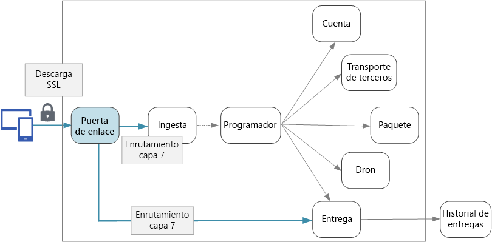

# Diseño de microservicios: puertas de enlace de API

En una arquitectura de microservicios, un cliente puede interactuar con más de un servicio front-end. Así, ¿cómo un cliente sabe a qué puntos de conexión llamar? ¿Qué ocurre cuando se introducen nuevos servicios o los servicios existentes se refactorizan? ¿Cómo abordan los servicios la terminación SSL, la autenticación y otros problemas? Una *puerta de enlace de API* puede ayudar a superar estos desafíos. 

## ¿Qué es una puerta de enlace de API?

Una puerta de enlace de API se ubica entre los clientes y los servicios. Actúa como un proxy inverso, enrutando las solicitudes de los clientes a los servicios. También puede realizar diversas tareas transversales como la autenticación, la terminación SSL y la limitación de velocidad. Si no implementa una puerta de enlace, los clientes deben enviar las solicitudes directamente a los servicios front-end. Sin embargo, hay algunos posibles problemas al exponer los servicios directamente a los clientes:

- Puede dar como resultado un código de cliente complejo. El cliente debe realizar un seguimiento de varios puntos de conexión y controlar los errores de una manera flexible. 
- Crea acoplamiento entre el cliente y el back-end. El cliente debe saber cómo se descomponen los servicios individuales. Eso dificulta mantener al cliente y también refactorizar los servicios.
- Una única operación podría requerir llamadas a varios servicios. Esto puede provocar varios recorridos de ida y vuelta entre el cliente y el servidor, lo que añade una latencia significativa. 
- Cada servicio expuesto al público debe controlar aspectos complejos, como la autenticación, SSL y la limitación de velocidad del cliente. 
- Los servicios deben exponer un protocolo conocido para el cliente, como HTTP o WebSocket. Esto limita la elección de los [protocolos de comunicación](./interservice-communication.md). 
- Los servicios con puntos de conexión públicos constituyen una posible superficie de ataque y deben ser protegidos.

Una puerta de enlace ayuda a solucionar estos problemas al desacoplar los clientes de los servicios. Las puertas de enlace pueden realizar una serie de funciones diferentes y es posible que no necesite todas. Las funciones se pueden agrupar en los siguientes patrones de diseño:

[Enrutamiento de puertas de enlace](../patterns/gateway-routing.md) Use la puerta de enlace como un proxy inverso para enrutar las solicitudes a uno o varios servicios back-end, usando el enrutamiento de nivel 7. La puerta de enlace proporciona un único punto de conexión para los clientes y ayuda a desacoplar a los clientes de los servicios. 

[Agregación de puertas de enlace](../patterns/gateway-aggregation.md). Use una puerta de enlace para agregar varias solicitudes individuales en una sola solicitud. Este patrón se aplica cuando una única operación requiere llamadas a varios servicios de back-end. El cliente envía una solicitud a la puerta de enlace. La puerta de enlace envía las solicitudes a los distintos servicios de back-end y, después, agrega los resultados y los devuelve al cliente. Así se ayuda a reducir el intercambio de mensajes entre el cliente y el back-end. 

[Descarga con puertas de enlace](../patterns/gateway-offloading.md). Use la puerta de enlace para descargar la funcionalidad de los servicios individuales a la puerta de enlace, especialmente cuando se dan cuestiones transversales. Puede ser útil consolidar estas funciones en un solo lugar, en lugar de responsabilizar de su implementación a todos los servicios. En especial, esto es así en el caso de características que requieren habilidades especializadas para una implementación correcta, como la autenticación y la autorización. 

Estos son algunos ejemplos de funcionalidad que puede descargar a una puerta de enlace:

- Terminación de SSL
- Autenticación
- Lista de direcciones IP permitidas
- Limitación de la tasa de clientes
- Registro y supervisión
- Almacenamiento en caché de respuesta
- Firewall de aplicaciones web
- Compresión GZIP
- Mantenimiento de contenido estático

## Elección de una tecnología de puerta de enlace

Aquí tiene algunas opciones para implementar una puerta de enlace de API en una aplicación.

- **Servidor de proxy inverso**. Nginx y HAProxy son servidores de proxy inverso comunes que admiten características tales como el equilibrio de carga, SSL y enrutamiento de nivel 7. Ambos son productos gratuitos y de código abierto, con ediciones de pago que proporcionan características adicionales y opciones de soporte técnico. Nginx y HAProxy son ambos productos consolidados con conjuntos variados de características y un rendimiento elevado. Puede ampliarlos con módulos de terceros o escribiendo scripts personalizados en Lua. Nginx también admite un módulo de scripting basado en JavaScript que se llama NginScript.

- **Controlador de entrada del servicio de malla**. Si utiliza un servicio malla como linkerd o Istio, tenga en cuenta las características que se proporcionan con el controlador de entrada para ese servicio malla. Por ejemplo, el controlador de entrada Istio admite enrutamiento de nivel 7, redirecciones HTTP, reintentos y otras características. 

- [Azure Application Gateway](/azure/application-gateway/). Application Gateway es un servicio de equilibrio de carga administrada que puede realizar el enrutamiento de nivel 7 y la terminación SSL. También proporciona un firewall de aplicación web (WAF).

- [Azure API Management](/azure/api-management/). Azure API Management es una solución completa para publicar API para clientes externos e internos. Proporciona características que resultan útiles para administrar una API expuesta al público, incluida la limitación de velocidad, la lista de direcciones IP permitidas y la autenticación con Azure Active Directory u otros proveedores de identidad. API Management no realiza el equilibrio de carga, por lo que debe usarse junto con un equilibrador de carga como Application Gateway o un proxy inverso.

Al elegir una tecnología de puerta de enlace, tenga en cuenta lo siguiente:

**Características**. Las opciones enumeradas antes admiten el enrutamiento de nivel 7, pero la compatibilidad con otras características variará. Según las características que necesite, puede implementar más de una puerta de enlace. 

**Implementación**. Azure Application Gateway y API Management son servicios administrados. Nginx y HAProxy generalmente se ejecutarán en contenedores dentro del clúster, pero también se pueden implementar en máquinas virtuales dedicadas fuera. Así se aísla la puerta de enlace del resto de la carga de trabajo, pero se genera una mayor sobrecarga de administración.

**Administración**. Cuando los servicios se actualizan o se agregan otros nuevos, las reglas de enrutamiento de puerta de enlace tienen que actualizarse. Tenga en cuenta cómo se administrará este proceso. Algunas consideraciones similares se aplican a la administración de certificados SSL, listas de direcciones IP permitidas y otros aspectos de la configuración.

## Consideraciones de la implementación

### Implementación de Nginx o HAProxy en Kubernetes

Puede implementar Nginx o HAProxy en Kubernetes como [ReplicaSet](https://kubernetes.io/docs/concepts/workloads/controllers/replicaset/) o [DaemonSet](https://kubernetes.io/docs/concepts/workloads/controllers/daemonset/) que especifica la imagen de contenedor de Nginx o HAProxy. Use ConfigMap para almacenar el archivo de configuración del proxy y móntelo como un volumen. Cree un servicio del tipo del equilibrador de carga para exponer la puerta de enlace a través de Azure Load Balancer. 

<!-- - Configure a readiness probe that serves a static file from the gateway (rather than routing to another service). -->

Una alternativa es crear un recurso Ingress Controller. Se trata de un recurso de Kubernetes que implementa un servidor proxy inverso o un equilibrador de carga. Existen varias implementaciones, como son Nginx y HAProxy. Un recurso independiente denominado elemento Ingress define la configuración de Ingress Controller, tales como las reglas de enrutamiento y los certificados TLS. De este modo, no es necesario administrar los complejos archivos de configuración específicos de una tecnología de servidor proxy determinada. Ingress Controllers sigue siendo una característica beta de Kubernetes en el momento de redactar este artículo y continuará evolucionando.

La puerta de enlace es un posible cuello de botella o un único punto de error en el sistema, por lo que siempre debe implementar al menos dos réplicas para lograr una elevada disponibilidad. Puede que deba escalar horizontalmente las réplicas todavía más, según la carga. 

Considere también ejecutar la puerta de enlace en un conjunto dedicado de nodos del clúster. Las ventajas de este enfoque incluyen:

- Aislamiento. Todo el tráfico entrante va a un conjunto fijo de nodos, que se pueden aislar de los servicios de back-end.

- Configuración estable. Si la puerta de enlace está mal configurada, toda la aplicación podría dejar de estar disponible. 

- Rendimiento. Puede utilizar una configuración de máquina virtual específica para la puerta de enlace por motivos de rendimiento.

<!-- - Load balancing. You can configure the external load balancer so that requests always go to a gateway node. That can save a network hop, which would otherwise happen whenever a request lands on a node that isn't running a gateway pod. This consideration applies mainly to large clusters, where the gateway runs on a relatively small fraction of the total nodes. In Azure Container Service (ACS), this approach currently requires [ACS Engine](https://github.com/Azure/acs-engine)) which allows you to create multiple agent pools. Then you can deploy the gateway as a DaemonSet to the front-end pool. -->

### Azure Application Gateway

Para conectar Application Gateway a un clúster de Kubernetes de Azure:

1. Cree una subred vacía en la red virtual del clúster.
2. Implemente Application Gateway.
3. Cree un servicio de Kubernetes con el tipo =[NodePort](https://kubernetes.io/docs/concepts/services-networking/service/#type-nodeport). Así se expone el servicio en cada nodo para que se pueda llegar desde fuera del clúster. No crea un equilibrador de carga.
5. Obtenga el número de puerto asignado para el servicio.
6. Agregue una regla de Application Gateway en la que:
    - El grupo de back-end contenga las máquinas virtuales del agente.
    - La configuración HTTP especifique el número de puerto de servicio.
    - El agente de escucha de la puerta de enlace realice escuchas en los puertos 80 y 443.
    
Establezca el número de instancias en dos o más para lograr una elevada disponibilidad.

### Azure API Management 

Para conectar API Management a un clúster de Kubernetes en Azure:

1. Cree una subred vacía en la red virtual del clúster.
2. Implemente API Management en esa subred.
3. Cree un servicio de Kubernetes del tipo LoadBalancer (equilibrador de carga). Use la anotación del [equilibrador de carga interno](https://kubernetes.io/docs/concepts/services-networking/service/#internal-load-balancer) para crear uno de ese tipo, en lugar de uno expuesto a Internet, que es lo predeterminado.
4. Busque la dirección IP privada del equilibrador de carga interno, mediante kubectl o la CLI de Azure.
5. Use API Management para crear una API que dirija a la dirección IP privada del equilibrador de carga.

Considere la posibilidad de combinar API Management con un proxy inverso, ya sea Nginx, HAProxy o Azure Application Gateway. Para obtener información acerca del uso de API Management con Application Gateway, consulte [Integración de API Management en una red virtual interna con Application Gateway](/azure/api-management/api-management-howto-integrate-internal-vnet-appgateway).

> [!div class="nextstepaction"]
> [Registro y supervisión](./logging-monitoring.md)
