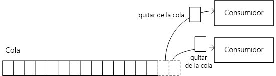
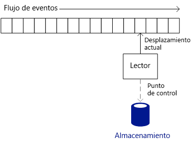
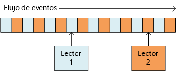
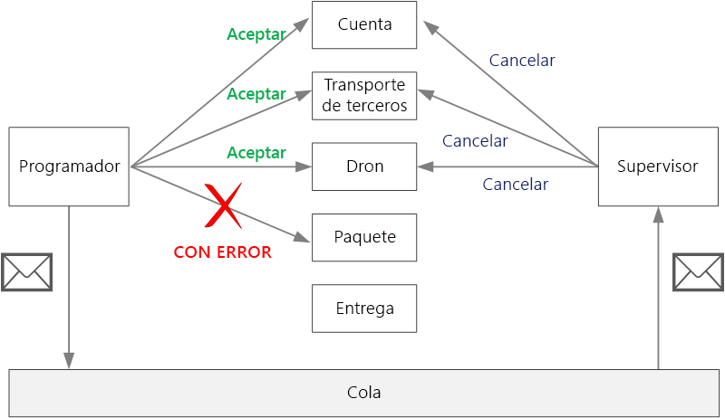

# <a name="designing-microservices-ingestion-and-workflow"></a><span data-ttu-id="8cc05-103">Diseño de microservicios: ingesta y flujo de trabajo</span><span class="sxs-lookup"><span data-stu-id="8cc05-103">Designing microservices: Ingestion and workflow</span></span>

<span data-ttu-id="8cc05-104">Con frecuencia los microservicios tienen un flujo de trabajo que abarca varios servicios en una única transacción.</span><span class="sxs-lookup"><span data-stu-id="8cc05-104">Microservices often have a workflow that spans multiple services for a single transaction.</span></span> <span data-ttu-id="8cc05-105">El flujo de trabajo debe ser confiable; no se pueden perder transacciones ni dejarlas en estado parcialmente completado.</span><span class="sxs-lookup"><span data-stu-id="8cc05-105">The workflow must be reliable; it can't lose transactions or leave them in a partially completed state.</span></span> <span data-ttu-id="8cc05-106">También es fundamental controlar la tasa de ingesta de solicitudes entrantes.</span><span class="sxs-lookup"><span data-stu-id="8cc05-106">It's also critical to control the ingestion rate of incoming requests.</span></span> <span data-ttu-id="8cc05-107">Como hay muchos servicios pequeños que se comunican entre sí, una ráfaga de solicitudes entrantes puede sobrecargar la comunicación entre los servicios.</span><span class="sxs-lookup"><span data-stu-id="8cc05-107">With many small services communicating with each other, a burst of incoming requests can overwhelm the interservice communication.</span></span> 


## <a name="the-drone-delivery-workflow"></a><span data-ttu-id="8cc05-108">El flujo de trabajo de entrega con dron</span><span class="sxs-lookup"><span data-stu-id="8cc05-108">The drone delivery workflow</span></span>

<span data-ttu-id="8cc05-109">En la aplicación Drone Delivery, se deben realizar las siguientes operaciones para programar una entrega:</span><span class="sxs-lookup"><span data-stu-id="8cc05-109">In the Drone Delivery application, the following operations must be performed to schedule a delivery:</span></span>

1. <span data-ttu-id="8cc05-110">Comprobar el estado de la cuenta del cliente (servicio Account)</span><span class="sxs-lookup"><span data-stu-id="8cc05-110">Check the status of the customer's account (Account service).</span></span>
2. <span data-ttu-id="8cc05-111">Crear una nueva entidad de paquete (servicio Package)</span><span class="sxs-lookup"><span data-stu-id="8cc05-111">Create a new package entity (Package service).</span></span>
3. <span data-ttu-id="8cc05-112">Comprobar si se requiere transporte de terceros en esta entrega, según las ubicaciones de recogida y entrega (servicio Third-party Transportation)</span><span class="sxs-lookup"><span data-stu-id="8cc05-112">Check whether any third-party transportation is required for this delivery, based on the pickup and delivery locations (Third-party Transportation service).</span></span>
4. <span data-ttu-id="8cc05-113">Programar un dron para la recogida (servicio Dron)</span><span class="sxs-lookup"><span data-stu-id="8cc05-113">Schedule a drone for pickup (Drone service).</span></span>
5. <span data-ttu-id="8cc05-114">Crear una nueva entidad de entrega (servicio Delivery)</span><span class="sxs-lookup"><span data-stu-id="8cc05-114">Create a new delivery entity (Delivery service).</span></span>

<span data-ttu-id="8cc05-115">Este es el núcleo de la aplicación entera, por lo que el proceso de extremo a extremo debe ser efectivo y confiable.</span><span class="sxs-lookup"><span data-stu-id="8cc05-115">This is the core of the entire application, so the end-to-end process must be performant as well as reliable.</span></span> <span data-ttu-id="8cc05-116">Se deben abordar algunas dificultades en concreto:</span><span class="sxs-lookup"><span data-stu-id="8cc05-116">Some particular challenges must be addressed:</span></span>

- <span data-ttu-id="8cc05-117">**Redistribución de la carga.**</span><span class="sxs-lookup"><span data-stu-id="8cc05-117">**Load leveling**.</span></span> <span data-ttu-id="8cc05-118">Demasiadas solicitudes de cliente pueden sobrecargar el sistema con tráfico de red entre servicios.</span><span class="sxs-lookup"><span data-stu-id="8cc05-118">Too many client requests can overwhelm the system with interservice network traffic.</span></span> <span data-ttu-id="8cc05-119">También se pueden sobrecargar las dependencias de back-end, como almacenamiento o servicios remotos.</span><span class="sxs-lookup"><span data-stu-id="8cc05-119">It can also overwhelm backend dependencies such as storage or remote services.</span></span> <span data-ttu-id="8cc05-120">La reacción de estas dependencias puede ser limitar los servicios que las llaman y crear una resistencia en el sistema.</span><span class="sxs-lookup"><span data-stu-id="8cc05-120">These may react by throttling the services calling them, creating backpressure in the system.</span></span> <span data-ttu-id="8cc05-121">Por lo tanto, es importante distribuir la carga de las solicitudes que entran en el sistema y colocarlas en un búfer o cola para su procesamiento.</span><span class="sxs-lookup"><span data-stu-id="8cc05-121">Therefore, it's important to load level the requests coming into the system, by putting them into a buffer or queue for processing.</span></span> 

- <span data-ttu-id="8cc05-122">**Entrega garantizada**.</span><span class="sxs-lookup"><span data-stu-id="8cc05-122">**Guaranteed delivery**.</span></span> <span data-ttu-id="8cc05-123">Para evitar la eliminación de solicitudes de cliente, el componente de ingesta debe garantizar una entrega por lo menos de mensajes.</span><span class="sxs-lookup"><span data-stu-id="8cc05-123">To avoid dropping any client requests, the ingestion component must guarantee at-least-once delivery of messages.</span></span> 

- <span data-ttu-id="8cc05-124">**Control de errores**.</span><span class="sxs-lookup"><span data-stu-id="8cc05-124">**Error handling**.</span></span> <span data-ttu-id="8cc05-125">Si alguno de los servicios devuelve un código de error o experimenta un error no transitorio, la entrega no se puede programar.</span><span class="sxs-lookup"><span data-stu-id="8cc05-125">If any of the services returns an error code or experiences a non-transient failure, the delivery cannot be scheduled.</span></span> <span data-ttu-id="8cc05-126">Un código de error podría indicar una condición de error esperada (por ejemplo, se suspende la cuenta del cliente) o un error inesperado del servidor (HTTP 5xx).</span><span class="sxs-lookup"><span data-stu-id="8cc05-126">An error code might indicate an expected error condition (for example, the customer's account is suspended) or an unexpected server error (HTTP 5xx).</span></span> <span data-ttu-id="8cc05-127">Un servicio también puede estar no disponible, lo que hace que se agote el tiempo de espera en la llamada de red.</span><span class="sxs-lookup"><span data-stu-id="8cc05-127">A service might also be unavailable, causing the network call to time out.</span></span> 

<span data-ttu-id="8cc05-128">Primero, examinaremos la parte de ingesta de la ecuación &mdash; cómo el sistema puede ingerir solicitudes de usuario entrantes con un alto rendimiento.</span><span class="sxs-lookup"><span data-stu-id="8cc05-128">First we'll look at the ingestion side of the equation &mdash; how the system can ingest incoming user requests at high throughput.</span></span> <span data-ttu-id="8cc05-129">A continuación, se considerará cómo la aplicación de entrega con dron puede implementar un flujo de trabajo confiable.</span><span class="sxs-lookup"><span data-stu-id="8cc05-129">Then we'll consider how the drone delivery application can implement a reliable workflow.</span></span> <span data-ttu-id="8cc05-130">Resulta que el diseño del subsistema de ingesta afecta al back-end de flujo de trabajo.</span><span class="sxs-lookup"><span data-stu-id="8cc05-130">It turns out that the design of the ingestion subsystem affects the workflow backend.</span></span> 

## <a name="ingestion"></a><span data-ttu-id="8cc05-131">Ingesta de datos</span><span class="sxs-lookup"><span data-stu-id="8cc05-131">Ingestion</span></span>

<span data-ttu-id="8cc05-132">En función de los requisitos empresariales, el equipo de desarrollo identificó los siguientes requisitos de ingesta no funcionales:</span><span class="sxs-lookup"><span data-stu-id="8cc05-132">Based on business requirements, the development team identified the following non-functional requirements for ingestion:</span></span>

- <span data-ttu-id="8cc05-133">Rendimiento sostenido de 10 000 solicitudes por segundo.</span><span class="sxs-lookup"><span data-stu-id="8cc05-133">Sustained throughput of 10K requests/sec.</span></span>
- <span data-ttu-id="8cc05-134">Posibilidad de administrar picos de hasta 50 000 por segundo sin rechazar solicitudes de cliente o agotar el tiempo de espera.</span><span class="sxs-lookup"><span data-stu-id="8cc05-134">Able to handle spikes of up to 50K/sec without dropping client requests or timing out.</span></span>
- <span data-ttu-id="8cc05-135">Latencia inferior a 500 ms en el percentil 99.</span><span class="sxs-lookup"><span data-stu-id="8cc05-135">Less than 500ms latency in the 99th percentile.</span></span>

<span data-ttu-id="8cc05-136">El requisito para administrar los picos ocasionales de tráfico presenta una dificultad de diseño.</span><span class="sxs-lookup"><span data-stu-id="8cc05-136">The requirement to handle occasional spikes in traffic presents a design challenge.</span></span> <span data-ttu-id="8cc05-137">En teoría, el sistema se podría escalar horizontalmente para administrar el tráfico máximo esperado.</span><span class="sxs-lookup"><span data-stu-id="8cc05-137">In theory, the system could be scaled out to handle the maximum expected traffic.</span></span> <span data-ttu-id="8cc05-138">Sin embargo, aprovisionar esos muchos recursos no sería muy eficiente.</span><span class="sxs-lookup"><span data-stu-id="8cc05-138">However, provisioning that many resources would be very inefficient.</span></span> <span data-ttu-id="8cc05-139">La mayor parte del tiempo, la aplicación no necesitará esa capacidad tan grande, así que habrá núcleos inactivos, lo que costará dinero sin agregar valor.</span><span class="sxs-lookup"><span data-stu-id="8cc05-139">Most of the time, the application will not need that much capacity, so there would be idle cores, costing money without adding value.</span></span>

<span data-ttu-id="8cc05-140">Un enfoque mejor es colocar las solicitudes entrantes en un búfer y dejar que el búfer actúe como distribuidor de la carga.</span><span class="sxs-lookup"><span data-stu-id="8cc05-140">A better approach is to put the incoming requests into a buffer, and let the buffer act as a load leveler.</span></span> <span data-ttu-id="8cc05-141">Con este diseño, el servicio Ingestion debe poder administrar la tasa máxima de ingesta durante períodos cortos, pero los servicios back-end solo tienen que administrar la carga máxima sostenida.</span><span class="sxs-lookup"><span data-stu-id="8cc05-141">With this design, the Ingestion service must be able to handle the maximum ingestion rate over short periods, but the backend services only need to handle the maximum sustained load.</span></span> <span data-ttu-id="8cc05-142">Al realizar el almacenamiento en búfer en el front-end, los servicios back-end no deberían tener la necesidad de administrar grandes picos de tráfico.</span><span class="sxs-lookup"><span data-stu-id="8cc05-142">By buffering at the front end, the backend services shouldn't need to handle large spikes in traffic.</span></span> <span data-ttu-id="8cc05-143">Con la escala necesaria para la aplicación Drone Delivery, [Azure Event Hubs](/azure/event-hubs/) es una buena elección para la distribución de la carga.</span><span class="sxs-lookup"><span data-stu-id="8cc05-143">At the scale required for the Drone Delivery application, [Azure Event Hubs](/azure/event-hubs/) is a good choice for load leveling.</span></span> <span data-ttu-id="8cc05-144">Event Hubs ofrece baja latencia y alto rendimiento, y es una solución rentable con elevados volúmenes de ingesta.</span><span class="sxs-lookup"><span data-stu-id="8cc05-144">Event Hubs offers low latency and high throughput, and is a cost effective solution at high ingestion volumes.</span></span> 

<span data-ttu-id="8cc05-145">En nuestras pruebas, hemos usado un centro de eventos de nivel estándar con 32 particiones y 100 unidades de procesamiento.</span><span class="sxs-lookup"><span data-stu-id="8cc05-145">For our testing, we used a Standard tier event hub with 32 partitions and 100 throughput units.</span></span> <span data-ttu-id="8cc05-146">Se observó una ingesta de unos 32 000 eventos por segundo, con una latencia de 90 ms aproximadamente.</span><span class="sxs-lookup"><span data-stu-id="8cc05-146">We observed about 32K events / second ingestion, with latency around 90ms.</span></span> <span data-ttu-id="8cc05-147">Actualmente, el límite predeterminado es de 20 unidades de procesamiento, pero los clientes de Azure pueden solicitar más si rellenan una solicitud de soporte técnico.</span><span class="sxs-lookup"><span data-stu-id="8cc05-147">Currently the default limit is 20 throughput units, but Azure customers can request additional throughput units by filing a support request.</span></span> <span data-ttu-id="8cc05-148">Consulte [Cuotas de Event Hubs](/azure/event-hubs/event-hubs-quotas) para más información.</span><span class="sxs-lookup"><span data-stu-id="8cc05-148">See [Event Hubs quotas](/azure/event-hubs/event-hubs-quotas) for more information.</span></span> <span data-ttu-id="8cc05-149">Al igual que con todas las métricas de rendimiento, son muchos los factores que pueden afectar al rendimiento, como el tamaño de la carga de mensajes, así que no interprete estas cifras como un punto de referencia.</span><span class="sxs-lookup"><span data-stu-id="8cc05-149">As with all performance metrics, many factors can affect performance, such as message payload size, so don't interpret these numbers as a benchmark.</span></span> <span data-ttu-id="8cc05-150">Si se necesita más rendimiento, el servicio Ingestion se puede particionar entre más de un centro de eventos.</span><span class="sxs-lookup"><span data-stu-id="8cc05-150">If more throughput is needed, the Ingestion service can shard across more than one event hub.</span></span> <span data-ttu-id="8cc05-151">Para capacidades de proceso incluso mayores, [Event Hubs Dedicated](/azure/event-hubs/event-hubs-dedicated-overview) ofrece implementaciones de un único inquilino que pueden ingresar más de 2 millones de eventos por segundo.</span><span class="sxs-lookup"><span data-stu-id="8cc05-151">For even higher throughput rates, [Event Hubs Dedicated](/azure/event-hubs/event-hubs-dedicated-overview) offers single-tenant deployments that can ingress over 2 million events per second.</span></span>

<span data-ttu-id="8cc05-152">Es importante comprender cómo Event Hubs puede conseguir este rendimiento tan alto, porque eso afecta a cómo el cliente debe consumir los mensajes de Event Hubs.</span><span class="sxs-lookup"><span data-stu-id="8cc05-152">It's important to understand how Event Hubs can achieve such high throughput, because that affects how a client should consume messages from Event Hubs.</span></span> <span data-ttu-id="8cc05-153">Event Hubs no implementa una *cola*,</span><span class="sxs-lookup"><span data-stu-id="8cc05-153">Event Hubs does not implement a *queue*.</span></span> <span data-ttu-id="8cc05-154">sino un *flujo de eventos*.</span><span class="sxs-lookup"><span data-stu-id="8cc05-154">Rather, it implements an *event stream*.</span></span> 

<span data-ttu-id="8cc05-155">Con una cola, un consumidor individual puede quitar un mensaje de la cola y el siguiente consumidor no verá ese mensaje.</span><span class="sxs-lookup"><span data-stu-id="8cc05-155">With a queue, an individual consumer can remove a message from the queue, and the next consumer won't see that message.</span></span> <span data-ttu-id="8cc05-156">Por tanto, las colas le permiten usar un [patrón Competing Consumers](../patterns/competing-consumers.md) para procesar los mensajes en paralelo y mejorar la escalabilidad.</span><span class="sxs-lookup"><span data-stu-id="8cc05-156">Queues therefore allow you to use a [Competing Consumers pattern](../patterns/competing-consumers.md) to process messages in parallel and improve scalability.</span></span> <span data-ttu-id="8cc05-157">Para una mayor resistencia, el consumidor mantiene un bloqueo sobre el mensaje y libera el bloqueo cuando se termina de procesar el mensaje.</span><span class="sxs-lookup"><span data-stu-id="8cc05-157">For greater resiliency, the consumer holds a lock on the message and releases the lock when it's done processing the message.</span></span> <span data-ttu-id="8cc05-158">Si se produce un error en el consumidor &mdash; por ejemplo, el nodo no funciona en los bloqueos &mdash; se agota el tiempo de espera del bloqueo y el mensaje se devuelve a la cola.</span><span class="sxs-lookup"><span data-stu-id="8cc05-158">If the consumer fails &mdash; for example, the node it's running on crashes &mdash; the lock times out and the message goes back onto the queue.</span></span> 



<span data-ttu-id="8cc05-159">Por otro lado, Event Hubs, usa semántica de streaming.</span><span class="sxs-lookup"><span data-stu-id="8cc05-159">Event Hubs, on the other hand, uses streaming semantics.</span></span> <span data-ttu-id="8cc05-160">Los consumidores leen la secuencia de forma independiente, a su propio ritmo.</span><span class="sxs-lookup"><span data-stu-id="8cc05-160">Consumers read the stream independently at their own pace.</span></span> <span data-ttu-id="8cc05-161">Cada consumidor es responsable de realizar el seguimiento de su posición actual en la secuencia.</span><span class="sxs-lookup"><span data-stu-id="8cc05-161">Each consumer is responsible for keeping track of its current position in the stream.</span></span> <span data-ttu-id="8cc05-162">Un consumidor debe escribir su posición actual en el almacenamiento persistente según un intervalo predefinido.</span><span class="sxs-lookup"><span data-stu-id="8cc05-162">A consumer should write its current position to persistent storage at some predefined interval.</span></span> <span data-ttu-id="8cc05-163">De este modo, si el consumidor experimenta un error (por ejemplo, el consumidor se bloquea o se produce un error en el host), una nueva instancia puede reanudar la lectura de la secuencia desde la última posición registrada.</span><span class="sxs-lookup"><span data-stu-id="8cc05-163">That way, if the consumer experiences a fault (for example, the consumer crashes, or the host fails), then a new instance can resume reading the stream from the last recorded position.</span></span> <span data-ttu-id="8cc05-164">Este proceso se denomina *creación de puntos de control*.</span><span class="sxs-lookup"><span data-stu-id="8cc05-164">This process is called *checkpointing*.</span></span> 

<span data-ttu-id="8cc05-165">Por motivos de rendimiento, un consumidor no crea generalmente puntos de control después de cada mensaje, </span><span class="sxs-lookup"><span data-stu-id="8cc05-165">For performance reasons, a consumer generally doesn't checkpoint after each message.</span></span> <span data-ttu-id="8cc05-166">sino que lo hace según intervalos fijos, por ejemplo, después de procesar *n* mensajes, o cada *n* segundos.</span><span class="sxs-lookup"><span data-stu-id="8cc05-166">Instead, it checkpoints at some fixed interval, for example after processing *n* messages, or every *n* seconds.</span></span> <span data-ttu-id="8cc05-167">En consecuencia, si se produce un error en un consumidor, algunos eventos podrían procesarse dos veces, porque las nuevas instancias siempre se toman del último punto de control.</span><span class="sxs-lookup"><span data-stu-id="8cc05-167">As a consequence, if a consumer fails, some events may get processed twice, because a new instance always picks up from the last checkpoint.</span></span> <span data-ttu-id="8cc05-168">Hay una compensación: la existencia de frecuentes puntos de control puede dañar el rendimiento, pero su escasez significa que se reproducirán más eventos tras un error.</span><span class="sxs-lookup"><span data-stu-id="8cc05-168">There is a tradeoff: Frequent checkpoints can hurt performance, but sparse checkpoints mean you will replay more events after a failure.</span></span>  


 
<span data-ttu-id="8cc05-169">Event Hubs no está diseñado para la competencia entre consumidores.</span><span class="sxs-lookup"><span data-stu-id="8cc05-169">Event Hubs is not designed for competing consumers.</span></span> <span data-ttu-id="8cc05-170">Aunque varios consumidores pueden leer una secuencia, cada uno la recorre de forma independiente.</span><span class="sxs-lookup"><span data-stu-id="8cc05-170">Although multiple consumers can read a stream, each traverses the stream independently.</span></span> <span data-ttu-id="8cc05-171">Por el contrario, Event Hubs usa un patrón de consumidores particionados.</span><span class="sxs-lookup"><span data-stu-id="8cc05-171">Instead, Event Hubs uses a partitioned consumer pattern.</span></span> <span data-ttu-id="8cc05-172">Un centro de eventos tiene hasta 32 particiones.</span><span class="sxs-lookup"><span data-stu-id="8cc05-172">An event hub has up to 32 partitions.</span></span> <span data-ttu-id="8cc05-173">El escalado horizontal se logra mediante la asignación de un consumidor independiente a cada partición.</span><span class="sxs-lookup"><span data-stu-id="8cc05-173">Horizontal scale is achieved by assigning a separate consumer to each partition.</span></span>

<span data-ttu-id="8cc05-174">¿Qué significa esto para el flujo de trabajo de entrega con dron?</span><span class="sxs-lookup"><span data-stu-id="8cc05-174">What does this mean for the drone delivery workflow?</span></span> <span data-ttu-id="8cc05-175">Para obtener todas las ventajas de Event Hubs, el programador de entregas no puede esperar a que se procese cada mensaje antes de pasar al siguiente.</span><span class="sxs-lookup"><span data-stu-id="8cc05-175">To get the full benefit of Event Hubs, the Delivery Scheduler cannot wait for each message to be processed before moving onto the next.</span></span> <span data-ttu-id="8cc05-176">Si lo hace, pasará la mayor parte del tiempo esperando a que finalicen las llamadas de red.</span><span class="sxs-lookup"><span data-stu-id="8cc05-176">If it does that, it will spend most of its time waiting for network calls to complete.</span></span> <span data-ttu-id="8cc05-177">En su lugar, es necesario procesar lotes de mensajes en paralelo, mediante llamadas asincrónicas a los servicios back-end.</span><span class="sxs-lookup"><span data-stu-id="8cc05-177">Instead, it needs to process batches of messages in parallel, using asynchronous calls to the backend services.</span></span> <span data-ttu-id="8cc05-178">Como veremos, también es importante elegir la estrategia adecuada de creación de puntos de control.</span><span class="sxs-lookup"><span data-stu-id="8cc05-178">As we'll see, choosing the right checkpointing strategy is also important.</span></span>  

## <a name="workflow"></a><span data-ttu-id="8cc05-179">Flujo de trabajo</span><span class="sxs-lookup"><span data-stu-id="8cc05-179">Workflow</span></span>

<span data-ttu-id="8cc05-180">Hemos examinado tres opciones para leer y procesar los mensajes: Event Processor Host, las colas de Service Bus y la biblioteca IoTHub React.</span><span class="sxs-lookup"><span data-stu-id="8cc05-180">We looked at three options for reading and processing the messages: Event Processor Host, Service Bus queues, and the IoTHub React library.</span></span> <span data-ttu-id="8cc05-181">Hemos elegido IoTHub React pero, para comprender por qué, sirve de ayuda comenzar con Event Processor Host.</span><span class="sxs-lookup"><span data-stu-id="8cc05-181">We chose IoTHub React, but to understand why, it helps to start with Event Processor Host.</span></span> 

### <a name="event-processor-host"></a><span data-ttu-id="8cc05-182">Host del procesador de eventos</span><span class="sxs-lookup"><span data-stu-id="8cc05-182">Event Processor Host</span></span>

<span data-ttu-id="8cc05-183">Event Processor Host está diseñado para el procesamiento por lotes de mensajes.</span><span class="sxs-lookup"><span data-stu-id="8cc05-183">Event Processor Host is designed for message batching.</span></span> <span data-ttu-id="8cc05-184">La aplicación implementa la interfaz `IEventProcessor` y Event Processor Host crea una instancia de procesador de eventos para cada partición del centro de eventos.</span><span class="sxs-lookup"><span data-stu-id="8cc05-184">The application implements the `IEventProcessor` interface, and the Processor Host creates one event processor instance for each partition in the event hub.</span></span> <span data-ttu-id="8cc05-185">Event Processor Host llama entonces al método `ProcessEventsAsync` de cada procesador de eventos con lotes de mensajes de eventos.</span><span class="sxs-lookup"><span data-stu-id="8cc05-185">The Event Processor Host then calls each event processor's `ProcessEventsAsync` method with batches of event messages.</span></span> <span data-ttu-id="8cc05-186">La aplicación controla cuándo crear puntos de control dentro del método `ProcessEventsAsync` y Event Processor Host escribe los puntos de control en Azure Storage.</span><span class="sxs-lookup"><span data-stu-id="8cc05-186">The application controls when to checkpoint inside the `ProcessEventsAsync` method, and the Event Processor Host writes the checkpoints to Azure storage.</span></span> 

<span data-ttu-id="8cc05-187">Dentro de una partición, Event Processor Host espera a que se devuelva `ProcessEventsAsync` antes de llamar de nuevo con el siguiente lote.</span><span class="sxs-lookup"><span data-stu-id="8cc05-187">Within a partition, Event Processor Host waits for `ProcessEventsAsync` to return before calling again with the next batch.</span></span> <span data-ttu-id="8cc05-188">Este enfoque simplifica el modelo de programación, porque el código de procesamiento de eventos no tiene que ser reentrante.</span><span class="sxs-lookup"><span data-stu-id="8cc05-188">This approach simplifies the programming model, because your event processing code doesn't need to be reentrant.</span></span> <span data-ttu-id="8cc05-189">Sin embargo, también significa que el procesador de eventos administra un lote cada vez y esto regula la velocidad a la que Event Processor Host puede bombear mensajes.</span><span class="sxs-lookup"><span data-stu-id="8cc05-189">However, it also means that the event processor handles one batch at a time, and this gates the speed at which the Processor Host can pump messages.</span></span>

> [!NOTE] 
> <span data-ttu-id="8cc05-190">El host de procesador no *espera* realmente en el sentido de bloquear un subproceso.</span><span class="sxs-lookup"><span data-stu-id="8cc05-190">The Processor Host doesn't actually *wait* in the sense of blocking a thread.</span></span> <span data-ttu-id="8cc05-191">El método `ProcessEventsAsync` es asincrónico, así que el host de procesador puede hacer otro trabajo mientras se completa el método.</span><span class="sxs-lookup"><span data-stu-id="8cc05-191">The `ProcessEventsAsync` method is asynchronous, so the Processor Host can do other work while the method is completing.</span></span> <span data-ttu-id="8cc05-192">Pero no se entrega otro lote de mensajes para esa partición hasta que el método finaliza.</span><span class="sxs-lookup"><span data-stu-id="8cc05-192">But it won't deliver another batch of messages for that partition until the method returns.</span></span> 

<span data-ttu-id="8cc05-193">En la aplicación de dron, un lote de mensajes se puede procesar en paralelo.</span><span class="sxs-lookup"><span data-stu-id="8cc05-193">In the drone application, a batch of messages can be processed in parallel.</span></span> <span data-ttu-id="8cc05-194">Pero esperar a que se complete todo el lote puede seguir provocando un cuello de botella.</span><span class="sxs-lookup"><span data-stu-id="8cc05-194">But waiting for the whole batch to complete can still cause a bottleneck.</span></span> <span data-ttu-id="8cc05-195">El procesamiento solo puede ser tan rápido como el mensaje más lento dentro de un lote.</span><span class="sxs-lookup"><span data-stu-id="8cc05-195">Processing can only be as fast as the slowest message within a batch.</span></span> <span data-ttu-id="8cc05-196">Cualquier variación en los tiempos de respuesta puede crear una "cola larga", donde unas cuantas respuestas lentas pueden arruinar todo el sistema.</span><span class="sxs-lookup"><span data-stu-id="8cc05-196">Any variation in response times can create a "long tail," where a few slow responses drag down the entire system.</span></span> <span data-ttu-id="8cc05-197">Nuestras pruebas de rendimiento demostraron que no conseguimos nuestro objetivo de rendimiento con este enfoque.</span><span class="sxs-lookup"><span data-stu-id="8cc05-197">Our performance tests showed that we did not achieve our target throughput using this approach.</span></span> <span data-ttu-id="8cc05-198">Eso *no* significa que se deba evitar el uso de Event Processor Host.</span><span class="sxs-lookup"><span data-stu-id="8cc05-198">This does *not* mean that you should avoid using Event Processor Host.</span></span> <span data-ttu-id="8cc05-199">Pero para conseguir un alto rendimiento, evite realizar tareas de ejecución prolongada dentro del método `ProcesssEventsAsync`.</span><span class="sxs-lookup"><span data-stu-id="8cc05-199">But for high throughput, avoid doing any long-running tasks inside the `ProcesssEventsAsync` method.</span></span> <span data-ttu-id="8cc05-200">Procese cada lote rápidamente.</span><span class="sxs-lookup"><span data-stu-id="8cc05-200">Process each batch quickly.</span></span>

### <a name="iothub-react"></a><span data-ttu-id="8cc05-201">IotHub React</span><span class="sxs-lookup"><span data-stu-id="8cc05-201">IotHub React</span></span> 

<span data-ttu-id="8cc05-202">[IotHub React](https://github.com/Azure/toketi-iothubreact) es una biblioteca de Akka Streams para la lectura de eventos del centro de eventos.</span><span class="sxs-lookup"><span data-stu-id="8cc05-202">[IotHub React](https://github.com/Azure/toketi-iothubreact) is an Akka Streams library for reading events from Event Hub.</span></span> <span data-ttu-id="8cc05-203">Akka Streams es un marco de programación basado en secuencias que implementa la especificación [Reactive Streams](https://www.reactive-streams.org/).</span><span class="sxs-lookup"><span data-stu-id="8cc05-203">Akka Streams is a stream-based programming framework that implements the [Reactive Streams](https://www.reactive-streams.org/) specification.</span></span> <span data-ttu-id="8cc05-204">Proporciona una manera de crear canalizaciones de streaming eficientes, donde las operaciones de streaming se realizan de forma asincrónica y la canalización administra la resistencia fácilmente.</span><span class="sxs-lookup"><span data-stu-id="8cc05-204">It provides a way to build efficient streaming pipelines, where all streaming operations are performed asynchronously, and the pipeline gracefully handles backpressure.</span></span> <span data-ttu-id="8cc05-205">La resistencia se produce cuando el origen de un evento produce eventos a una velocidad tan alta que los consumidores descendentes no pueden recibirlos &mdash; que es exactamente la situación en la que el sistema de entrega con dron tiene un pico en el tráfico.</span><span class="sxs-lookup"><span data-stu-id="8cc05-205">Backpressure occurs when an event source produces events at a faster rate than the downstream consumers can receive them &mdash; which is exactly the situation when the drone delivery system has a spike in traffic.</span></span> <span data-ttu-id="8cc05-206">Si los servicios back-end funcionan más lento, IoTHub React se ralentiza.</span><span class="sxs-lookup"><span data-stu-id="8cc05-206">If backend services go slower, IoTHub React will slow down.</span></span> <span data-ttu-id="8cc05-207">Si se aumenta la capacidad, IoTHub React inserta más mensajes a través de la canalización.</span><span class="sxs-lookup"><span data-stu-id="8cc05-207">If capacity is increased, IoTHub React will push more messages through the pipeline.</span></span>

<span data-ttu-id="8cc05-208">Akka Streams es también un modelo de programación muy natural para eventos de streaming desde Event Hubs.</span><span class="sxs-lookup"><span data-stu-id="8cc05-208">Akka Streams is also a very natural programming model for streaming events from Event Hubs.</span></span> <span data-ttu-id="8cc05-209">En lugar de recorrer en bucle un lote de eventos, se define un conjunto de operaciones que se aplicará a cada evento y se permite que Akka Streams administre el streaming.</span><span class="sxs-lookup"><span data-stu-id="8cc05-209">Instead of looping through a batch of events, you define a set of operations that will be applied to each event, and let Akka Streams handle the streaming.</span></span> <span data-ttu-id="8cc05-210">Akka Streams define una canalización de streaming en términos de *orígenes*, *flujos* y *receptores*.</span><span class="sxs-lookup"><span data-stu-id="8cc05-210">Akka Streams defines a streaming pipeline in terms of *Sources*, *Flows*, and *Sinks*.</span></span> <span data-ttu-id="8cc05-211">Un origen genera una secuencia de salida, un flujo procesa una secuencia de entrada y produce una secuencia de salida y un receptor consume una secuencia sin producir ninguna salida.</span><span class="sxs-lookup"><span data-stu-id="8cc05-211">A source generates an output stream, a flow processes an input stream and produces an output stream, and a sink consumes a stream without producing any output.</span></span>

<span data-ttu-id="8cc05-212">A continuación se muestra el código del servicio Scheduler que configura la canalización de Akka Streams:</span><span class="sxs-lookup"><span data-stu-id="8cc05-212">Here is the code in the Scheduler service that sets up the Akka Streams pipeline:</span></span>

```java
IoTHub iotHub = new IoTHub();
Source<MessageFromDevice, NotUsed> messages = iotHub.source(options);

messages.map(msg -> DeliveryRequestEventProcessor.parseDeliveryRequest(msg))
        .filter(ad -> ad.getDelivery() != null).via(deliveryProcessor()).to(iotHub.checkpointSink())
        .run(streamMaterializer);
```

<span data-ttu-id="8cc05-213">Este código configura Event Hubs como origen.</span><span class="sxs-lookup"><span data-stu-id="8cc05-213">This code configures Event Hubs as a source.</span></span> <span data-ttu-id="8cc05-214">La instrucción `map` deserializa cada mensaje de evento en una clase de Java que representa una solicitud de entrega.</span><span class="sxs-lookup"><span data-stu-id="8cc05-214">The `map` statement deserializes each event message into a Java class that represents a delivery request.</span></span> <span data-ttu-id="8cc05-215">La instrucción `filter` quita cualquier objeto `null` de la secuencia, de forma que ofrece protección en aquellos casos en los que no se pueda deserializar un mensaje.</span><span class="sxs-lookup"><span data-stu-id="8cc05-215">The `filter` statement removes any `null` objects from the stream; this guards against the case where a message can't be deserialized.</span></span> <span data-ttu-id="8cc05-216">La instrucción `via` une el origen a un flujo que procesa cada solicitud de entrega.</span><span class="sxs-lookup"><span data-stu-id="8cc05-216">The `via` statement joins the source to a flow that processes each delivery request.</span></span> <span data-ttu-id="8cc05-217">El método `to` une el flujo al receptor de puntos de control, que se crea en IoTHub React.</span><span class="sxs-lookup"><span data-stu-id="8cc05-217">The `to` method joins the flow to the checkpoint sink, which is built into IoTHub React.</span></span>

<span data-ttu-id="8cc05-218">IoTHub React usa una estrategia de creación de puntos de control diferente a la de Event Processor Host.</span><span class="sxs-lookup"><span data-stu-id="8cc05-218">IoTHub React uses a different checkpointing strategy than Event Host Processor.</span></span> <span data-ttu-id="8cc05-219">El receptor de puntos de control escribe los puntos de control, lo cual constituye la etapa final de la canalización.</span><span class="sxs-lookup"><span data-stu-id="8cc05-219">Checkpoints are written by the checkpoint sink, which is the terminating stage in the pipeline.</span></span> <span data-ttu-id="8cc05-220">El diseño de Akka Streams permite que la canalización continúe el streaming de datos mientras el receptor escribe el punto de control.</span><span class="sxs-lookup"><span data-stu-id="8cc05-220">The design of Akka Streams allows the pipeline to continue streaming data while the sink is writing the checkpoint.</span></span> <span data-ttu-id="8cc05-221">Eso significa que las etapas de procesamiento ascendente no tienen que esperar a que se produzca la creación de puntos de control.</span><span class="sxs-lookup"><span data-stu-id="8cc05-221">That means the upstream processing stages don't need to wait for checkpointing to happen.</span></span> <span data-ttu-id="8cc05-222">Puede configurar la creación de puntos de control de forma que se produzca tras un tiempo de espera o después de que se hayan procesado un número determinado de mensajes.</span><span class="sxs-lookup"><span data-stu-id="8cc05-222">You can configure checkpointing to occur after a timeout or after a certain number of messages have been processed.</span></span>

<span data-ttu-id="8cc05-223">El método `deliveryProcessor` crea el flujo de Akka Streams:</span><span class="sxs-lookup"><span data-stu-id="8cc05-223">The `deliveryProcessor` method creates the Akka Streams flow:</span></span>  

```java
private static Flow<AkkaDelivery, MessageFromDevice, NotUsed> deliveryProcessor() {
    return Flow.of(AkkaDelivery.class).map(delivery -> {
        CompletableFuture<DeliverySchedule> completableSchedule = DeliveryRequestEventProcessor
                .processDeliveryRequestAsync(delivery.getDelivery(), 
                        delivery.getMessageFromDevice().properties());
        
        completableSchedule.whenComplete((deliverySchedule,error) -> {
            if (error!=null){
                Log.info("failed delivery" + error.getStackTrace());
            }
            else{
                Log.info("Completed Delivery",deliverySchedule.toString());
            }
                                
        });
        completableSchedule = null;
        return delivery.getMessageFromDevice();
    });
}
```

<span data-ttu-id="8cc05-224">El flujo llama a un método estático `processDeliveryRequestAsync` que lleva a cabo el trabajo real de procesamiento de cada mensaje.</span><span class="sxs-lookup"><span data-stu-id="8cc05-224">The flow calls a static `processDeliveryRequestAsync` method that does the actual work of processing each message.</span></span>

### <a name="scaling-with-iothub-react"></a><span data-ttu-id="8cc05-225">Escalado con IoTHub React</span><span class="sxs-lookup"><span data-stu-id="8cc05-225">Scaling with IoTHub React</span></span>

<span data-ttu-id="8cc05-226">El servicio Scheduler está diseñado para que cada instancia del contenedor lea una única partición.</span><span class="sxs-lookup"><span data-stu-id="8cc05-226">The Scheduler service is designed so that each container instance reads from a single partition.</span></span> <span data-ttu-id="8cc05-227">Por ejemplo, si el centro de eventos tiene 32 particiones, el servicio Scheduler se implementa con 32 réplicas.</span><span class="sxs-lookup"><span data-stu-id="8cc05-227">For example, if the Event Hub has 32 partitions, the Scheduler service is deployed with 32 replicas.</span></span> <span data-ttu-id="8cc05-228">Esto permite mucha flexibilidad en términos de escalado horizontal.</span><span class="sxs-lookup"><span data-stu-id="8cc05-228">This allows for a lot of flexibility in terms of horizontal scaling.</span></span> 

<span data-ttu-id="8cc05-229">En función del tamaño del clúster, un nodo del clúster podría tener más de un pod del servicio Scheduler ejecutándose en él.</span><span class="sxs-lookup"><span data-stu-id="8cc05-229">Depending on the size of the cluster, a node in the cluster might have more than one Scheduler service pod running on it.</span></span> <span data-ttu-id="8cc05-230">Pero si el servicio Scheduler necesita más recursos, el clúster se puede escalar horizontalmente, con el fin de distribuir los pods entre más nodos.</span><span class="sxs-lookup"><span data-stu-id="8cc05-230">But if the Scheduler service needs more resources, the cluster can be scaled out, in order to distribute the pods across more nodes.</span></span> <span data-ttu-id="8cc05-231">Nuestras pruebas de rendimiento demostraron que el servicio Scheduler está enlazado a la memoria y a los subprocesos, por lo que el rendimiento depende en gran medida del tamaño de la máquina virtual y del número de pods por nodo.</span><span class="sxs-lookup"><span data-stu-id="8cc05-231">Our performance tests showed that the Scheduler service is memory- and thread-bound, so performance depended greatly on the VM size and the number of pods per node.</span></span>

<span data-ttu-id="8cc05-232">Cada instancia debe saber cuál es la partición de Event Hubs que se lee.</span><span class="sxs-lookup"><span data-stu-id="8cc05-232">Each instance needs to know which Event Hubs partition to read from.</span></span> <span data-ttu-id="8cc05-233">Para configurar el número de partición, aprovechamos el tipo de recurso [StatefulSet](https://kubernetes.io/docs/concepts/workloads/controllers/statefulset/) de Kubernetes.</span><span class="sxs-lookup"><span data-stu-id="8cc05-233">To configure the partition number, we took advantage of the [StatefulSet](https://kubernetes.io/docs/concepts/workloads/controllers/statefulset/) resource type in Kubernetes.</span></span> <span data-ttu-id="8cc05-234">Los pods de StatefulSet tienen un identificador persistente que incluye un índice numérico.</span><span class="sxs-lookup"><span data-stu-id="8cc05-234">Pods in a StatefulSet have a persistent identifier that includes a numeric index.</span></span> <span data-ttu-id="8cc05-235">En concreto, el nombre del pod es `<statefulset name>-<index>`, y este valor está disponible para el contenedor a través de [Downward API](https://kubernetes.io/docs/tasks/inject-data-application/downward-api-volume-expose-pod-information/) de Kubernetes.</span><span class="sxs-lookup"><span data-stu-id="8cc05-235">Specifically, the pod name is `<statefulset name>-<index>`, and this value is available to the container through the Kubernetes [Downward API](https://kubernetes.io/docs/tasks/inject-data-application/downward-api-volume-expose-pod-information/).</span></span> <span data-ttu-id="8cc05-236">En tiempo de ejecución, los servicios Scheduler leen el nombre del pod y usan el índice del pod como identificador de partición.</span><span class="sxs-lookup"><span data-stu-id="8cc05-236">At run time, the Scheduler services reads the pod name and uses the pod index as the partition ID.</span></span>

<span data-ttu-id="8cc05-237">Si necesitara escalar horizontalmente aún más el servicio Scheduler, podría asignar más de un pod por partición de centro de eventos, para que varios pod lean cada partición.</span><span class="sxs-lookup"><span data-stu-id="8cc05-237">If you needed to scale out the Scheduler service even further, you could assign more than one pod per event hub partition, so that multiple pods are reading each partition.</span></span> <span data-ttu-id="8cc05-238">Sin embargo, en ese caso, cada instancia leería todos los eventos de la partición asignada.</span><span class="sxs-lookup"><span data-stu-id="8cc05-238">However, in that case, each instance would read all of the events in the assigned partition.</span></span> <span data-ttu-id="8cc05-239">Para evitar el procesamiento duplicado, habría que usar un algoritmo hash, de modo que cada instancia se salte una parte de los mensajes.</span><span class="sxs-lookup"><span data-stu-id="8cc05-239">To avoid duplicate processing, you would need to use a hashing algorithm, so that each instance skips over a portion of the messages.</span></span> <span data-ttu-id="8cc05-240">De este modo, varios lectores pueden consumir la secuencia, pero solo una instancia procesa cada mensaje.</span><span class="sxs-lookup"><span data-stu-id="8cc05-240">That way, multiple readers can consume the stream, but every message is processed by only one instance.</span></span> 
 


### <a name="service-bus-queues"></a><span data-ttu-id="8cc05-241">Colas de Service Bus</span><span class="sxs-lookup"><span data-stu-id="8cc05-241">Service Bus queues</span></span>

<span data-ttu-id="8cc05-242">Una tercera opción que se consideró fue copiar los mensajes de Event Hubs a una cola de Service Bus, y luego hacer que el servicio Scheduler leyera los mensajes de Service Bus.</span><span class="sxs-lookup"><span data-stu-id="8cc05-242">A third option that we considered was to copy messages from Event Hubs into a Service Bus queue, and then have the Scheduler service read the messages from Service Bus.</span></span> <span data-ttu-id="8cc05-243">Podría parecer extraño escribir las solicitudes entrantes en Event Hubs solo para copiarlas en Service Bus.</span><span class="sxs-lookup"><span data-stu-id="8cc05-243">It might seem strange to writing the incoming requests into Event Hubs only to copy them in Service Bus.</span></span>  <span data-ttu-id="8cc05-244">Sin embargo, la idea era aprovechar los distintos puntos fuertes de cada servicio: usar Event Hubs para absorber los picos de tráfico y sacar provecho de la semántica de cola de Service Bus para procesar la carga de trabajo con un patrón de competencia entre consumidores.</span><span class="sxs-lookup"><span data-stu-id="8cc05-244">However, the idea was to leverage the different strengths of each service: Use Event Hubs to absorb spikes of heavy traffic, while taking advantage of the queue semantics in Service Bus to process the workload with a competing consumers pattern.</span></span> <span data-ttu-id="8cc05-245">Recuerde que nuestro objetivo de rendimiento sostenido es menor que la carga máxima esperada, por lo que el procesamiento de la carga de Service Bus no tendría que ser tan rápido como la ingesta de mensajes.</span><span class="sxs-lookup"><span data-stu-id="8cc05-245">Remember that our target for sustained throughput is less than our expected peak load, so processing the Service Bus queue would not need to be as fast the message ingestion.</span></span>
 
<span data-ttu-id="8cc05-246">Con este enfoque, nuestra implementación de prueba de concepto logra aproximadamente 4000 operaciones por segundo.</span><span class="sxs-lookup"><span data-stu-id="8cc05-246">With this approach, our proof-of-concept implementation achieved about 4K operations per second.</span></span> <span data-ttu-id="8cc05-247">En estas pruebas se usan servicios back-end ficticios que no realizan un trabajo real, sino que simplemente agregan una cantidad fija de latencia por servicio.</span><span class="sxs-lookup"><span data-stu-id="8cc05-247">These tests used mock backend services that did not do any real work, but simply added a fixed amount of latency per service.</span></span> <span data-ttu-id="8cc05-248">Tenga en cuenta que las cifras de rendimiento eran mucho menores que el máximo teórico de Service Bus.</span><span class="sxs-lookup"><span data-stu-id="8cc05-248">Note that our performance numbers were much less than the theoretical maximum for Service Bus.</span></span> <span data-ttu-id="8cc05-249">Las posibles razones para la discrepancia incluyen:</span><span class="sxs-lookup"><span data-stu-id="8cc05-249">Possible reasons for the discrepancy include:</span></span>

- <span data-ttu-id="8cc05-250">No tener valores óptimos para diversos parámetros de cliente, como el límite del grupo de conexiones, el grado de ejecución en paralelo, el número de capturas previas y el tamaño del lote.</span><span class="sxs-lookup"><span data-stu-id="8cc05-250">Not having optimal values for various client parameters, such as the connection pool limit, the degree of parallelization, the prefetch count, and the batch size.</span></span>

- <span data-ttu-id="8cc05-251">Cuellos de botella de E/S de red.</span><span class="sxs-lookup"><span data-stu-id="8cc05-251">Network I/O bottlenecks.</span></span>

- <span data-ttu-id="8cc05-252">El uso del modo [PeekLock](/rest/api/servicebus/peek-lock-message-non-destructive-read) en lugar de [ReceiveAndDelete](/rest/api/servicebus/receive-and-delete-message-destructive-read), que fue necesario para garantizar una entrega por lo menos de mensajes.</span><span class="sxs-lookup"><span data-stu-id="8cc05-252">Use of [PeekLock](/rest/api/servicebus/peek-lock-message-non-destructive-read) mode rather than [ReceiveAndDelete](/rest/api/servicebus/receive-and-delete-message-destructive-read), which was needed to ensure at-least-once delivery of messages.</span></span>

<span data-ttu-id="8cc05-253">Otras pruebas de rendimiento nos habría permitido detectar la causa principal y resolver estos problemas.</span><span class="sxs-lookup"><span data-stu-id="8cc05-253">Further performance tests might have discovered the root cause and allowed us to resolve these issues.</span></span> <span data-ttu-id="8cc05-254">Sin embargo, IotHub React satisfacía nuestro objetivo de rendimiento, así que elegimos esa opción.</span><span class="sxs-lookup"><span data-stu-id="8cc05-254">However, IotHub React met our performance target, so we chose that option.</span></span> <span data-ttu-id="8cc05-255">Dicho de otro modo, Service Bus es una opción viable en este escenario.</span><span class="sxs-lookup"><span data-stu-id="8cc05-255">That said, Service Bus is a viable option for this scenario.</span></span>

## <a name="handling-failures"></a><span data-ttu-id="8cc05-256">Administración de errores</span><span class="sxs-lookup"><span data-stu-id="8cc05-256">Handling failures</span></span> 

<span data-ttu-id="8cc05-257">Hay tres clases de errores generales que tener en cuenta.</span><span class="sxs-lookup"><span data-stu-id="8cc05-257">There are three general classes of failure to consider.</span></span>

1. <span data-ttu-id="8cc05-258">Un servicio descendente puede tener un error no transitorio, que es cualquier error que no es probable que desaparezca por sí solo.</span><span class="sxs-lookup"><span data-stu-id="8cc05-258">A downstream service may have a non-transient failure, which is any failure that's unlikely to go away by itself.</span></span> <span data-ttu-id="8cc05-259">Los errores no transitorios incluyen las condiciones de error normales, por ejemplo, la entrada no válida a un método.</span><span class="sxs-lookup"><span data-stu-id="8cc05-259">Non-transient failures include normal error conditions, such as invalid input to a method.</span></span> <span data-ttu-id="8cc05-260">También incluyen las excepciones no controladas en el código de aplicación o el bloqueo de los procesos.</span><span class="sxs-lookup"><span data-stu-id="8cc05-260">They also include unhandled exceptions in application code or a process crashing.</span></span> <span data-ttu-id="8cc05-261">Si se produce este tipo de error, la transacción empresarial completa debe marcarse como error.</span><span class="sxs-lookup"><span data-stu-id="8cc05-261">If this type of error occurs, the entire business transaction must be marked as a failure.</span></span> <span data-ttu-id="8cc05-262">Puede que sea necesario deshacer el resto de pasos de la misma transacción que ya se han realizado.</span><span class="sxs-lookup"><span data-stu-id="8cc05-262">It may be necessary to undo other steps in the same transaction that already succeeded.</span></span> <span data-ttu-id="8cc05-263">(Consulte a continuación las transacciones de compensación).</span><span class="sxs-lookup"><span data-stu-id="8cc05-263">(See Compensating Transactions, below.)</span></span>
 
2. <span data-ttu-id="8cc05-264">Un servicio descendente puede experimentar un error transitorio, como un tiempo de espera de la red.</span><span class="sxs-lookup"><span data-stu-id="8cc05-264">A downstream service may experience a transient failure such as a network timeout.</span></span> <span data-ttu-id="8cc05-265">Con frecuencia, estos errores pueden resolverse con solo reintentar la llamada.</span><span class="sxs-lookup"><span data-stu-id="8cc05-265">These errors can often be resolved simply by retrying the call.</span></span> <span data-ttu-id="8cc05-266">Si la operación continúa con errores tras un determinado número de intentos, se considera un error no transitorio.</span><span class="sxs-lookup"><span data-stu-id="8cc05-266">If the operation still fails after a certain number of attempts, it's considered a non-transient failure.</span></span> 

3. <span data-ttu-id="8cc05-267">El propio servicio Scheduler podría dar error (por ejemplo, debido a un nodo que se bloquea).</span><span class="sxs-lookup"><span data-stu-id="8cc05-267">The Scheduler service itself might fault (for example, because a node crashes).</span></span> <span data-ttu-id="8cc05-268">En ese caso, Kubernetes abrirá una nueva instancia del servicio.</span><span class="sxs-lookup"><span data-stu-id="8cc05-268">In that case, Kubernetes will bring up a new instance of the service.</span></span> <span data-ttu-id="8cc05-269">Sin embargo, las transacciones que estaban ya en curso se deben reanudar.</span><span class="sxs-lookup"><span data-stu-id="8cc05-269">However, any transactions that were already in progress must be resumed.</span></span> 

## <a name="compensating-transactions"></a><span data-ttu-id="8cc05-270">Transacciones de compensación</span><span class="sxs-lookup"><span data-stu-id="8cc05-270">Compensating transactions</span></span>

<span data-ttu-id="8cc05-271">Si se produce un error no transitorio, la transacción actual podría estar en estado de *error parcial*, donde uno o varios pasos ya se completaron correctamente.</span><span class="sxs-lookup"><span data-stu-id="8cc05-271">If a non-transient failure happens, the current transaction might be in a *partially failed* state, where one or more steps already completed successfully.</span></span> <span data-ttu-id="8cc05-272">Por ejemplo, si el servicio Drone ya ha programado un dron, el dron se debe cancelar.</span><span class="sxs-lookup"><span data-stu-id="8cc05-272">For example, if the Drone service already scheduled a drone, the drone must be canceled.</span></span> <span data-ttu-id="8cc05-273">En ese caso, la aplicación debe deshacer los pasos ya realizados mediante una [transacción de compensación](../patterns/compensating-transaction.md).</span><span class="sxs-lookup"><span data-stu-id="8cc05-273">In that case, the application needs to undo the steps that succeeded, by using a [Compensating Transaction](../patterns/compensating-transaction.md).</span></span> <span data-ttu-id="8cc05-274">En algunos casos, esto debe hacerse mediante un sistema externo o incluso un proceso manual.</span><span class="sxs-lookup"><span data-stu-id="8cc05-274">In some cases, this must be done by an external system or even by a manual process.</span></span> 

<span data-ttu-id="8cc05-275">Si la lógica para compensar las transacciones es compleja, considere la posibilidad de crear un servicio independiente que sea responsable de este proceso.</span><span class="sxs-lookup"><span data-stu-id="8cc05-275">If the logic for compensating transactions is complex, consider creating a separate service that is responsible for this process.</span></span> <span data-ttu-id="8cc05-276">En la aplicación Drone Delivery, el servicio Scheduler coloca las operaciones con error en una cola dedicada.</span><span class="sxs-lookup"><span data-stu-id="8cc05-276">In the Drone Delivery application, the Scheduler service puts failed operations onto a dedicated queue.</span></span> <span data-ttu-id="8cc05-277">Un microservicio independiente, llamado Supervisor, lee esta cola y llama a una API de cancelación en los servicios que deben compensarse.</span><span class="sxs-lookup"><span data-stu-id="8cc05-277">A separate microservice, called the Supervisor, reads from this queue and calls a cancellation API on the services that need to compensate.</span></span> <span data-ttu-id="8cc05-278">Esta es una variación del patrón [Scheduler Agent Supervisor][scheduler-agent-supervisor].</span><span class="sxs-lookup"><span data-stu-id="8cc05-278">This is a variation of the [Scheduler Agent Supervisor pattern][scheduler-agent-supervisor].</span></span> <span data-ttu-id="8cc05-279">El servicio Supervisor puede realizar también otras acciones, como notificar al usuario mediante correo electrónico o texto o enviar una alerta a un panel de operaciones.</span><span class="sxs-lookup"><span data-stu-id="8cc05-279">The Supervisor service might take other actions as well, such as notify the user by text or email, or send an alert to an operations dashboard.</span></span> 



## <a name="idempotent-vs-non-idempotent-operations"></a><span data-ttu-id="8cc05-280">Operaciones idempotentes frente a no idempotentes</span><span class="sxs-lookup"><span data-stu-id="8cc05-280">Idempotent vs non-idempotent operations</span></span>

<span data-ttu-id="8cc05-281">Para evitar la pérdida de alguna solicitud, el servicio Scheduler debe garantizar que todos los mensajes se procesan por lo menos una vez.</span><span class="sxs-lookup"><span data-stu-id="8cc05-281">To avoid losing any requests, the Scheduler service must guarantee that all messages are processed at least once.</span></span> <span data-ttu-id="8cc05-282">Event Hubs puede garantizar la entrega por lo menos una vez si el cliente crea los puntos de control correctamente.</span><span class="sxs-lookup"><span data-stu-id="8cc05-282">Event Hubs can guarantee at-least-once delivery if the client checkpoints correctly.</span></span>

<span data-ttu-id="8cc05-283">Si se bloquea el servicio Scheduler, podría estar a mitad del procesamiento de una o varias solicitudes de cliente.</span><span class="sxs-lookup"><span data-stu-id="8cc05-283">If the Scheduler service crashes, it may be in the middle of processing one or more client requests.</span></span> <span data-ttu-id="8cc05-284">Otra instancia de Scheduler recopila esos mensajes y los vuelve a procesar.</span><span class="sxs-lookup"><span data-stu-id="8cc05-284">Those messages will be picked up by another instance of the Scheduler and reprocessed.</span></span> <span data-ttu-id="8cc05-285">¿Qué ocurre si una solicitud se procesa dos veces?</span><span class="sxs-lookup"><span data-stu-id="8cc05-285">What happens if a request is processed twice?</span></span> <span data-ttu-id="8cc05-286">Es importante evitar la duplicación de cualquier trabajo.</span><span class="sxs-lookup"><span data-stu-id="8cc05-286">It's important to avoid duplicating any work.</span></span> <span data-ttu-id="8cc05-287">Después de todo, no queremos que el sistema envíe dos drones para el mismo paquete.</span><span class="sxs-lookup"><span data-stu-id="8cc05-287">After all, we don't want the system to send two drones for the same package.</span></span>

<span data-ttu-id="8cc05-288">Un enfoque consiste en diseñar todas las operaciones para que sean idempotentes.</span><span class="sxs-lookup"><span data-stu-id="8cc05-288">One approach is to design all operations to be idempotent.</span></span> <span data-ttu-id="8cc05-289">Una operación es idempotente si puede llamarse varias veces sin producir efectos secundarios adicionales después de la primera llamada.</span><span class="sxs-lookup"><span data-stu-id="8cc05-289">An operation is idempotent if it can be called multiple times without producing additional side-effects after the first call.</span></span> <span data-ttu-id="8cc05-290">Es decir, un cliente puede invocar la operación una vez, dos veces o muchas veces, y el resultado será el mismo.</span><span class="sxs-lookup"><span data-stu-id="8cc05-290">In other words, a client can invoke the operation once, twice, or many times, and the result will be the same.</span></span> <span data-ttu-id="8cc05-291">Básicamente, el servicio debe ignorar las llamadas duplicadas.</span><span class="sxs-lookup"><span data-stu-id="8cc05-291">Essentially, the service should ignore duplicate calls.</span></span> <span data-ttu-id="8cc05-292">Para que un método con efectos secundarios sea idempotente, el servicio debe poder detectar llamadas duplicadas.</span><span class="sxs-lookup"><span data-stu-id="8cc05-292">For a method with side effects to be idempotent, the service must be able to detect duplicate calls.</span></span> <span data-ttu-id="8cc05-293">Por ejemplo, puede hacer que la persona que llama asigne el identificador, en lugar de hacer que el servicio genere uno nuevo.</span><span class="sxs-lookup"><span data-stu-id="8cc05-293">For example, you can have the caller assign the ID, rather than having the service generate a new ID.</span></span> <span data-ttu-id="8cc05-294">El servicio puede buscar entonces identificadores duplicados.</span><span class="sxs-lookup"><span data-stu-id="8cc05-294">The service can then check for duplicate IDs.</span></span>

> [!NOTE]
> <span data-ttu-id="8cc05-295">La especificación HTTP afirma que los métodos GET, PUT y DELETE deben ser idempotentes.</span><span class="sxs-lookup"><span data-stu-id="8cc05-295">The HTTP specification states that GET, PUT, and DELETE methods must be idempotent.</span></span> <span data-ttu-id="8cc05-296">No se garantiza que los métodos POST sean idempotentes.</span><span class="sxs-lookup"><span data-stu-id="8cc05-296">POST methods are not guaranteed to be idempotent.</span></span> <span data-ttu-id="8cc05-297">Si un método POST crea un nuevo recurso, por lo general no existe garantía de que esta operación sea idempotente.</span><span class="sxs-lookup"><span data-stu-id="8cc05-297">If a POST method creates a new resource, there is generally no guarantee that this operation is idempotent.</span></span> 

<span data-ttu-id="8cc05-298">No siempre es fácil de escribir un método idempotente.</span><span class="sxs-lookup"><span data-stu-id="8cc05-298">It's not always straightforward to write idempotent method.</span></span> <span data-ttu-id="8cc05-299">Otra opción es que Scheduler realice un seguimiento del progreso de todas las transacciones en un almacén duradero.</span><span class="sxs-lookup"><span data-stu-id="8cc05-299">Another option is for the Scheduler to track the progress of every transaction in a durable store.</span></span> <span data-ttu-id="8cc05-300">Cada vez que se procesa un mensaje, se consultaría el estado en el almacén duradero.</span><span class="sxs-lookup"><span data-stu-id="8cc05-300">Whenever it processes a message, it would look up the state in the durable store.</span></span> <span data-ttu-id="8cc05-301">Después de cada paso, se escribiría el resultado en el almacén.</span><span class="sxs-lookup"><span data-stu-id="8cc05-301">After each step, it would write the result to the store.</span></span> <span data-ttu-id="8cc05-302">En este enfoque puede haber implicaciones para el rendimiento.</span><span class="sxs-lookup"><span data-stu-id="8cc05-302">There may be performance implications to this approach.</span></span>

## <a name="example-idempotent-operations"></a><span data-ttu-id="8cc05-303">Ejemplo: Operaciones idempotentes</span><span class="sxs-lookup"><span data-stu-id="8cc05-303">Example: Idempotent operations</span></span>

<span data-ttu-id="8cc05-304">La especificación HTTP afirma que los métodos PUT deben ser idempotentes.</span><span class="sxs-lookup"><span data-stu-id="8cc05-304">The HTTP specification states that PUT methods must be idempotent.</span></span> <span data-ttu-id="8cc05-305">La especificación define idempotente de esta manera:</span><span class="sxs-lookup"><span data-stu-id="8cc05-305">The specification defines idempotent this way:</span></span>

>  <span data-ttu-id="8cc05-306">Un método de solicitud se considera "idempotente" si el efecto deseado en el servidor de varias solicitudes idénticas con ese método es el mismo que el efecto en una única solicitud de este tipo.</span><span class="sxs-lookup"><span data-stu-id="8cc05-306">A request method is considered "idempotent" if the intended effect on the server of multiple identical requests with that method is the   same as the effect for a single such request.</span></span> <span data-ttu-id="8cc05-307">([RFC 7231](https://tools.ietf.org/html/rfc7231#section-4))</span><span class="sxs-lookup"><span data-stu-id="8cc05-307">([RFC 7231](https://tools.ietf.org/html/rfc7231#section-4))</span></span>

<span data-ttu-id="8cc05-308">Es importante comprender la diferencia entre la semántica de PUT y POST al crear una nueva entidad.</span><span class="sxs-lookup"><span data-stu-id="8cc05-308">It's important to understand the difference between PUT and POST semantics when creating a new entity.</span></span> <span data-ttu-id="8cc05-309">En ambos casos, el cliente envía una representación de una entidad en el cuerpo de solicitud.</span><span class="sxs-lookup"><span data-stu-id="8cc05-309">In both cases, the client sends a representation of an entity in the request body.</span></span> <span data-ttu-id="8cc05-310">Pero el significado del URI es diferente.</span><span class="sxs-lookup"><span data-stu-id="8cc05-310">But the meaning of the URI is different.</span></span>

- <span data-ttu-id="8cc05-311">En un método POST, el URI representa un recurso primario de la nueva entidad, como una colección.</span><span class="sxs-lookup"><span data-stu-id="8cc05-311">For a POST method, the URI represents a parent resource of the new entity, such as a collection.</span></span> <span data-ttu-id="8cc05-312">Por ejemplo, para crear una nueva entrega, el URI puede ser `/api/deliveries`.</span><span class="sxs-lookup"><span data-stu-id="8cc05-312">For example, to create a new delivery, the URI might be `/api/deliveries`.</span></span> <span data-ttu-id="8cc05-313">El servidor crea la entidad y le asigna un nuevo URI, como `/api/deliveries/39660`.</span><span class="sxs-lookup"><span data-stu-id="8cc05-313">The server creates the entity and assigns it a new URI, such as `/api/deliveries/39660`.</span></span> <span data-ttu-id="8cc05-314">Este URI se devuelve en el encabezado Location de la respuesta.</span><span class="sxs-lookup"><span data-stu-id="8cc05-314">This URI is returned in the Location header of the response.</span></span> <span data-ttu-id="8cc05-315">Cada vez que el cliente envía una solicitud, el servidor crea una nueva entidad con un nuevo URI.</span><span class="sxs-lookup"><span data-stu-id="8cc05-315">Each time the client sends a request, the server will create a new entity with a new URI.</span></span>

- <span data-ttu-id="8cc05-316">En un método PUT, el URI identifica la entidad.</span><span class="sxs-lookup"><span data-stu-id="8cc05-316">For a PUT method, the URI identifies the entity.</span></span> <span data-ttu-id="8cc05-317">Si ya existe una entidad con ese URI, el servidor reemplaza la entidad existente por la versión de la solicitud.</span><span class="sxs-lookup"><span data-stu-id="8cc05-317">If there already exists an entity with that URI, the server replaces the existing entity with the version in the request.</span></span> <span data-ttu-id="8cc05-318">Si no existe ninguna entidad con ese URI, el servidor crea una.</span><span class="sxs-lookup"><span data-stu-id="8cc05-318">If no entity exists with that URI, the server creates one.</span></span> <span data-ttu-id="8cc05-319">Por ejemplo, suponga que el cliente envía una solicitud PUT a `api/deliveries/39660`.</span><span class="sxs-lookup"><span data-stu-id="8cc05-319">For example, suppose the client sends a PUT request to `api/deliveries/39660`.</span></span> <span data-ttu-id="8cc05-320">Suponiendo que no hay ninguna entrega con ese URI, el servidor crea una nueva.</span><span class="sxs-lookup"><span data-stu-id="8cc05-320">Assuming there is no delivery with that URI, the server creates a new one.</span></span> <span data-ttu-id="8cc05-321">Ahora, si el cliente envía de nuevo la misma solicitud, el servidor reemplazará la entidad existente.</span><span class="sxs-lookup"><span data-stu-id="8cc05-321">Now if the client sends the same request again, the server will replace the existing entity.</span></span>

<span data-ttu-id="8cc05-322">Esta es la implementación del servicio Delivery del método PUT.</span><span class="sxs-lookup"><span data-stu-id="8cc05-322">Here is the Delivery service's implementation of the PUT method.</span></span> 

```csharp
[HttpPut("{id}")]
[ProducesResponseType(typeof(Delivery), 201)]
[ProducesResponseType(typeof(void), 204)]
public async Task<IActionResult> Put([FromBody]Delivery delivery, string id)
{
    logger.LogInformation("In Put action with delivery {Id}: {@DeliveryInfo}", id, delivery.ToLogInfo());
    try
    {
        var internalDelivery = delivery.ToInternal();

        // Create the new delivery entity.
        await deliveryRepository.CreateAsync(internalDelivery);

        // Create a delivery status event.
        var deliveryStatusEvent = new DeliveryStatusEvent { DeliveryId = delivery.Id, Stage = DeliveryEventType.Created };
        await deliveryStatusEventRepository.AddAsync(deliveryStatusEvent);

        // Return HTTP 201 (Created)
        return CreatedAtRoute("GetDelivery", new { id= delivery.Id }, delivery);
    }
    catch (DuplicateResourceException)
    {
        // This method is mainly used to create deliveries. If the delivery already exists then update it.
        logger.LogInformation("Updating resource with delivery id: {DeliveryId}", id);

        var internalDelivery = delivery.ToInternal();
        await deliveryRepository.UpdateAsync(id, internalDelivery);

        // Return HTTP 204 (No Content)
        return NoContent();
    }
}
```

<span data-ttu-id="8cc05-323">Se espera que la mayoría de las solicitudes creen una nueva entidad, por lo que el método llama a `CreateAsync` de forma optimista en el objeto de repositorio y, a continuación, administra las excepciones de recursos duplicados mediante la actualización del recurso.</span><span class="sxs-lookup"><span data-stu-id="8cc05-323">It's expected that most requests will create a new entity, so the method optimistically calls `CreateAsync` on the repository object, and then handles any duplicate-resource exceptions by updating the resource instead.</span></span> 

> [!div class="nextstepaction"]
> [<span data-ttu-id="8cc05-324">Puertas de enlace de API</span><span class="sxs-lookup"><span data-stu-id="8cc05-324">API gateways</span></span>](./gateway.md)

<!-- links -->

[scheduler-agent-supervisor]: ../patterns/scheduler-agent-supervisor.md