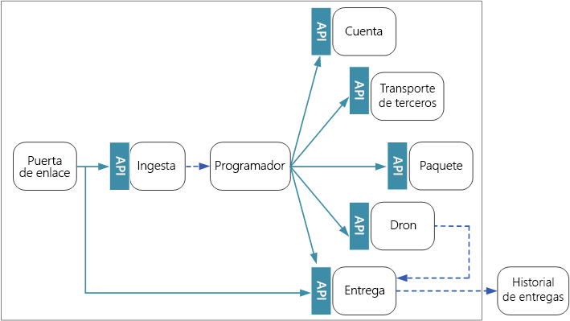
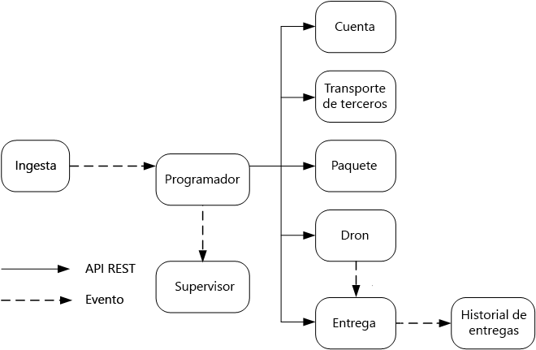

# Diseño de microservicios: comunicación entre serviciosDesigning microservices: Interservice communication

La comunicación entre microservicios tiene que ser eficiente y sólida.Communication between microservices must be efficient and robust. Con una gran cantidad de pequeños servicios interactuando para realizar una sola transacción, esto puede suponer un desafío.With lots of small services interacting to complete a single transaction, this can be a challenge. En este capítulo, veremos los inconvenientes entre la mensajería asincrónica en comparación con las API sincrónicas.In this chapter, we look at the tradeoffs between asynchronous messaging versus synchronous APIs. A continuación, veremos algunos de los desafíos a la hora de diseñar una comunicación resistente entre servicios, y el rol que puede desempeñar una malla de servicio.Then we look at some of the challenges in designing resilient interservice communication, and the role that a service mesh can play.

## DesafíosChallenges 

Estos son algunos de los principales desafíos que se derivan de la comunicación de servicio a servicio.Here are some of the main challenges arising from service-to-service communication. Las mallas de servicio, que se describe más adelante en este capítulo, están diseñadas para controlar muchos de estos desafíos.Service meshes, described later in this chapter, are designed to handle many of these challenges.

**Resistencia.****Resiliency.** Puede haber decenas o incluso centenares de instancias de cualquier microservicio concreto.There may be dozens or even hundreds of instances of any given microservice. Se puede producir un error en una instancia por una serie de motivos.An instance can fail for any number of reasons. Puede haber un error de nivel de nodo, como un error de hardware o un reinicio de máquina virtual.There can be a node-level failure, such as a hardware failure or a VM reboot. Una instancia puede bloquearse o verse abrumada por las solicitudes, y dejar de procesar todas las nuevas solicitudes.An instance might crash, or be overwhelmed with requests and unable to process any new requests. Cualquiera de estos eventos puede provocar que una llamada de red genere un error.Any of these events can cause a network call to fail. Hay dos patrones de diseño que pueden ayudar a que las llamadas de red de servicio a servicio ganen en resistencia:There are two design patterns that can help make service-to-service network calls more resilient:

- **[Retry](../patterns/retry.md)**.**[Retry](../patterns/retry.md)**. Una llamada de red puede producir un error debido a un error transitorio que desaparece por sí solo.A network call may fail because of a transient fault that goes away by itself. En lugar de declarar un error directamente, el autor de la llamada debería reintentar la operación un determinado número de veces o hasta que transcurra un período de tiempo de espera configurado.Rather than fail outright, the caller should typically retry the operation a certain number of times, or until a configured time-out period elapses. Sin embargo, si una operación no es idempotente, los reintentos pueden producir efectos secundarios no deseados.However, if an operation is not idempotent, retries can cause unintended side effects. La llamada original puede realizarse correctamente, pero el autor de la llamada nunca recibe una respuesta.The original call might succeed, but the caller never gets a response. Si el autor de la llamada vuelve a intentar realizarla, se puede invocar la operación dos veces.If the caller retries, the operation may be invoked twice. Por lo general, no es seguro volver a intentar los métodos POST o PATCH, porque no se garantiza que sean idempotentes.Generally, it's not safe to retry POST or PATCH methods, because these are not guaranteed to be idempotent.

- **[Circuit Breaker](../patterns/circuit-breaker.md)**.**[Circuit Breaker](../patterns/circuit-breaker.md)**. Demasiadas solicitudes con error pueden causar un cuello de botella, ya que las solicitudes pendientes se acumulan en la cola.Too many failed requests can cause a bottleneck, as pending requests accumulate in the queue. Estas solicitudes bloqueadas pueden contener recursos críticos del sistema, tales como la memoria, subprocesos o conexiones de base de datos, entre otros, que pueden causar errores en cascada.These blocked requests might hold critical system resources such as memory, threads, database connections, and so on, which can cause cascading failures. El patrón Circuit Breaker puede evitar que un servicio intente repetidamente una operación que probablemente produzca errores.The Circuit Breaker pattern can prevent a service from repeatedly trying an operation that is likely to fail. 

**Equilibrio de carga**.**Load balancing**. Cuando el servicio "A" llama servicio "B", la solicitud tiene que llegar a una instancia en ejecución del servicio "B".When service "A" calls service "B", the request must reach a running instance of service "B". En Kubernetes, el tipo de recurso `Service` proporciona una dirección IP estable para un grupo de pods.In Kubernetes, the `Service` resource type provides a stable IP address for a group of pods. El tráfico de red a la dirección IP del servicio se reenvía a un pod mediante reglas de iptable.Network traffic to the service's IP address gets forwarded to a pod by means of iptable rules. De forma predeterminada, se elige un pod aleatorio.By default, a random pod is chosen. Una malla de servicio (ver abajo) puede proporcionar algoritmos de equilibrio de carga más inteligentes en función de la latencia observada o de otras métricas.A service mesh (see below) can provide more intelligent load balancing algorithms based on observed latency or other metrics.

**Seguimiento distribuido**.**Distributed tracing**. Una sola transacción puede abarcar varios servicios.A single transaction may span multiple services. Esto puede dificultar la supervisión del rendimiento general y del estado del sistema.That can make it hard to monitor the overall performance and health of the system. Incluso si todos los servicios generan registros y métricas, si no hay una manera de unirlos, son de uso limitado.Even if every service generates logs and metrics, without some way to tie them together, they are of limited use. En el capítulo [Registro y supervisión](./logging-monitoring.md) se habla en más detalle acerca del seguimiento distribuido, pero se menciona aquí como un desafío.The chapter [Logging and monitoring](./logging-monitoring.md) talks more about distributed tracing, but we mention it here as a challenge.

**Versiones del servicio**.**Service versioning**. Cuando un equipo implementa una nueva versión de un servicio, tiene que evitar romper otros servicios o clientes externos que dependen de él.When a team deploys a new version of a service, they must avoid breaking any other services or external clients that depend on it. Además, puede ejecutar varias versiones de un servicio en paralelo y enrutar las solicitudes a una versión determinada.In addition, you might want to run multiple versions of a service side-by-side, and route requests to a particular version. Consulte [Control de versiones de la API](./api-design.md#api-versioning) para más información sobre este punto.See [API Versioning](./api-design.md#api-versioning) for more discussion of this issue.

**Cifrado TLS y autenticación de TLS mutua**.**TLS encryption and mutual TLS authentication**. Por motivos de seguridad, puede querer cifrar el tráfico entre los servicios con TLS y utilizar la autenticación de TLS mutua para autenticar a los autores de las llamadas.For security reasons, you may want to encrypt traffic between services with TLS, and use mutual TLS authentication to authenticate callers.

## Mensajería sincrónica frente a la asincrónicaSynchronous versus asynchronous messaging

Hay dos patrones de mensajería básicos que los microservicios pueden usar para comunicarse con otros microservicios.There are two basic messaging patterns that microservices can use to communicate with other microservices. 

1. Comunicación sincrónica.Synchronous communication. En este patrón, un servicio llama a una API que otro servicio expone mediante un protocolo como HTTP o gRPC.In this pattern, a service calls an API that another service exposes, using a protocol such as HTTP or gRPC. Esta opción es un patrón de mensajería sincrónico porque el autor de la llamada espera a la respuesta del receptor.This option is a synchronous messaging pattern because the caller waits for a response from the receiver. 

2. Paso de mensajes asincrónicos.Asynchronous message passing. En este patrón, un servicio envía el mensaje sin esperar por la respuesta, y uno o más servicios procesan el mensaje de forma asincrónica.In this pattern, a service sends message without waiting for a response, and one or more services process the message asynchronously.

Es importante distinguir entre operaciones de E/S asincrónicas y un protocolo asincrónico.It's important to distinguish between asynchronous I/O and an asynchronous protocol. Una operación de E/S asincrónica significa que el subproceso de llamada no se bloquea mientras se completa la E/S.Asynchronous I/O means the calling thread is not blocked while the I/O completes. Esto es importante para el rendimiento, pero es un detalle de implementación en cuanto a la arquitectura.That's important for performance, but is an implementation detail in terms of the architecture. Un protocolo asincrónico significa que el remitente no espera ninguna respuesta.An asynchronous protocol means the sender doesn't wait for a response. HTTP es un protocolo sincrónico, aunque un cliente HTTP puede utilizar operaciones de E/S asincrónicas cuando envía una solicitud.HTTP is a synchronous protocol, even though an HTTP client may use asynchronous I/O when it sends a request. 

Cada patrón tiene sus inconvenientes.There are tradeoffs to each pattern. Solicitud/respuesta es un paradigma conocido, por lo que el diseño de una API puede resultar más natural que diseñar un sistema de mensajería.Request/response is a well-understood paradigm, so designing an API may feel more natural than designing a messaging system. Sin embargo, la mensajería asincrónica tiene algunas ventajas que pueden ser muy útiles en una arquitectura de microservicios:However, asynchronous messaging has some advantages that can be very useful in a microservices architecture:

- **Acoplamiento reducido**.**Reduced coupling**. El remitente del mensaje no tiene que conocer al consumidor.The message sender does not need to know about the consumer. 

- **Varios suscriptores**.**Multiple subscribers**. Al utilizar un modelo de pub/sub, se pueden suscribir varios consumidores para recibir eventos.Using a pub/sub model, multiple consumers can subscribe to receive events. Consulte [Estilo de arquitectura basada en eventos](/azure/architecture/guide/architecture-styles/event-driven).See [Event-driven architecture style](/azure/architecture/guide/architecture-styles/event-driven).

- **Aislamiento de errores**.**Failure isolation**. Si se produce un error en el consumidor, el remitente puede seguir enviando mensajes.If the consumer fails, the sender can still send messages. Los mensajes se recogerán cuando el consumidor se recupere.The messages will be picked up when the consumer recovers. Esta capacidad es especialmente útil en una arquitectura de microservicios, dado que cada servicio tiene su propio ciclo de vida.This ability is especially useful in a microservices architecture, because each service has its own lifecycle. Un servicio puede dejar de estar disponible o se puede sustituir por una versión más reciente en un momento dado.A service could become unavailable or be replaced with a newer version at any given time. La mensajería asincrónica puede controlar los tiempos de inactividad intermitentes.Asynchronous messaging can handle intermittent downtime. Las API sincrónicas, por otro lado, requieren que el servicio de bajada esté disponible o se producirá un error en la operación.Synchronous APIs, on the other hand, require the downstream service to be available or the operation fails. 
 
- **Capacidad de respuesta**.**Responsiveness**. Un servicio ascendente puede responder con mayor rapidez si no espera por los servicios de bajada.An upstream service can reply faster if it does not wait on downstream services. Esto es especialmente útil en una arquitectura de microservicios.This is especially useful in a microservices architecture. Si hay una cadena de dependencias de servicio (servicio A llama a B, que llama a C, y así sucesivamente), la espera de las llamadas sincrónicas puede agregar cantidades inaceptables de latencia.If there is a chain of service dependencies (service A calls B, which calls C, and so on), waiting on synchronous calls can add unacceptable amounts of latency.

- **Redistribución de la carga**.**Load leveling**. Una cola puede actuar como un búfer para redistribuir la carga de trabajo con el fin de que los receptores puedan procesar mensajes a su propio ritmo.A queue can act as a buffer to level the workload, so that receivers can process messages at their own rate. 

- **Flujos de trabajo**.**Workflows**. Las colas pueden usarse para administrar un flujo de trabajo, creando puntos de comprobación del mensaje después de cada paso del flujo de trabajo.Queues can be used to manage a workflow, by check-pointing the message after each step in the workflow.

Sin embargo, el uso eficaz de la mensajería asincrónica también presenta algunos desafíos.However, there are also some challenges to using asynchronous messaging effectively.

- **Acoplamiento con la infraestructura de mensajería**.**Coupling with the messaging infrastructure**. El uso de una infraestructura de mensajería determinada puede producir el acoplamiento rígido con esa infraestructura.Using a particular messaging infrastructure may cause tight coupling with that infrastructure. Esto dificultará el cambio a otra infraestructura de mensajería más adelante.It will be difficult to switch to another messaging infrastructure later.

- **Latencia**.**Latency**. La latencia de un extremo a otro para una operación puede ser alta si las colas de mensajes se llenan.End-to-end latency for an operation may become high if the message queues fill up.  

- **Costo**.**Cost**. Con un rendimiento elevado, el costo económico de la infraestructura de mensajería puede ser significativo.At high throughputs, the monetary cost of the messaging infrastructure could be significant.

- **Complejidad**.**Complexity**. El control de mensajería asincrónica no es una tarea trivial.Handling asynchronous messaging is not a trivial task. Por ejemplo, tiene que controlar los mensajes duplicados, mediante la desduplicación o haciendo que las operaciones sean idempotentes.For example, you must handle duplicated messages, either by de-duplicating or by making operations idempotent. También es difícil implementar la semántica de solicitud-respuesta usando mensajería asincrónica.It's also hard to implement request-response semantics using asynchronous messaging. Para enviar una respuesta, se necesitan otra cola, además de una forma de correlacionar mensajes de solicitud y respuesta.To send a response, you need another queue, plus a way to correlate request and response messages.

- **Rendimiento**.**Throughput**. Si los mensajes requieren *semántica de cola*, la cola puede convertirse en un cuello de botella en el sistema.If messages require *queue semantics*, the queue can become a bottleneck in the system. Cada mensaje requiere por lo menos una operación de cola y una operación de eliminación de cola.Each message requires at least one queue operation and one dequeue operation. Además, la semántica de cola suele necesitar algún tipo de bloqueo dentro de la infraestructura de mensajería.Moreover, queue semantics generally require some kind of locking inside the messaging infrastructure. Si la cola es un servicio administrado, puede haber latencia adicional porque la cola es externa a la red virtual del clúster.If the queue is a managed service, there may be additional latency, because the queue is external to the cluster's virtual network. Para mitigar estos problemas puede procesar mensajes por lotes, pero esto complica el código.You can mitigate these issues by batching messages, but that complicates the code. Si los mensajes no requieren semántica de cola, es posible que pueda usar un *flujo* de eventos en lugar de una cola.If the messages don't require queue semantics, you might be able to use an event *stream* instead of a queue. Para más información, consulte [Estilo de arquitectura basada en eventos](../guide/architecture-styles/event-driven.md).For more information, see [Event-driven architectural style](../guide/architecture-styles/event-driven.md).  

## Drone Delivery: selección de los patrones de mensajeríaDrone Delivery: Choosing the messaging patterns

Con estas consideraciones en mente, el equipo de desarrollo ha realizado las siguientes opciones de diseño para la aplicación Drone DeliveryWith these considerations in mind, the development team made the following design choices for the Drone Delivery application

- El servicio Ingestion expone una API de REST pública que las aplicaciones cliente usan para programar, actualizar o cancelar las entregas.The Ingestion service exposes a public REST API that client applications use to schedule, update, or cancel deliveries.

- El servicio Ingestion usa Event Hubs para enviar mensajes asincrónicos al servicio del Scheduler.The Ingestion service uses Event Hubs to send asynchronous messages to the Scheduler service. Los mensajes asincrónicos son necesarios para implementar la nivelación de carga que se requiere para la ingesta.Asynchronous messages are necessary to implement the load-leveling that is required for ingestion. Para más información sobre cómo interactúan los servicios Ingestion y Scheduler, consulte [Ingesta y flujo de trabajo][ingestion-workflow].For details on how the Ingestion and Scheduler services interact, see [Ingestion and workflow][ingestion-workflow].

- Todos los servicios Account, Delivery, Package, Drone y Third-party Transport exponen las API de REST internas.The Account, Delivery, Package, Drone, and Third-party Transport services all expose internal REST APIs. El servicio Scheduler llama a estas API para llevar a cabo una solicitud de usuario.The Scheduler service calls these APIs to carry out a user request. Una razón para usar las API sincrónicas es que Scheduler necesita obtener una respuesta de cada uno de los servicios de bajada.One reason to use synchronous APIs is that the Scheduler needs to get a response from each of the downstream services. Un error en cualquiera de los servicios de bajada significa un error en la operación completa.A failure in any of the downstream services means the entire operation failed. Sin embargo, un problema potencial es la cantidad de latencia que se introduce a través de una llamada a los servicios back-end.However, a potential issue is the amount of latency that is introduced by calling the backend services. 

- Si cualquier servicio de bajada tiene un error no transitorio, toda la transacción debe marcarse como errónea.If any downstream service has a non-transient failure, the entire transaction should be marked as failed. Para controlar este caso, el servicio Scheduler envía un mensaje asincrónico al Supervisor, para que el Supervisor puede programar transacciones de compensación, como se describe en el capítulo [Ingesta y flujo de trabajo][ingestion-workflow].To handle this case, the Scheduler service sends an asynchronous message to the Supervisor, so that the Supervisor can schedule compensating transactions, as described in the chapter [Ingestion and workflow][ingestion-workflow].   

- El servicio de entrega expone una API pública que los clientes pueden utilizar para obtener el estado de una entrega.The Delivery service exposes a public API that clients can use to get the status of a delivery. En el capítulo [Puertas de enlace de API](./gateway.md), se describe cómo una puerta de enlace de API puede ocultar los servicios subyacentes al cliente, de forma que el cliente no necesita saber qué servicios exponen cada API.In the chapter [API gateway](./gateway.md), we discuss how an API gateway can hide the underlying services from the client, so the client doesn't need to know which services expose which APIs. 

- Mientras un dron está en vuelo, el servicio Drone envía eventos que contienen la ubicación actual del dron y su estado.While a drone is in flight, the Drone service sends events that contain the drone's current location and status. El servicio Delivery escucha a estos eventos para el seguimiento del estado de una entrega.The Delivery service listens to these events in order to track the status of a delivery.

- Cuando el estado de una entrega cambia, el servicio Delivery envía un evento de estado de entrega, como `DeliveryCreated` o `DeliveryCompleted`.When the status of a delivery changes, the Delivery service sends a delivery status event, such as `DeliveryCreated` or `DeliveryCompleted`. Cualquier servicio puede suscribirse a estos eventos.Any service can subscribe to these events. En el diseño actual, el servicio Delivery es el único suscriptor, pero más adelante puede haber otros suscriptores.In the current design, the Delivery service is the only subscriber, but there might be other subscribers later. Por ejemplo, los eventos pueden ir a un servicio de análisis en tiempo real.For example, the events might go to a real-time analytics service. Y dado que Scheduler no tiene que esperar una respuesta, agregar más suscriptores no afecta a la ruta de acceso de flujo de trabajo principal.And because the Scheduler doesn't have to wait for a response, adding more subscribers doesn't affect the main workflow path.

Tenga en cuenta que los eventos de estado de entrega se derivan de los eventos de la ubicación de dron.Notice that delivery status events are derived from drone location events. Por ejemplo, cuando un dron llega a una ubicación de entrega y suelta un paquete, el servicio Delivery traduce esto en un evento DeliveryCompleted.For example, when a drone reaches a delivery location and drops off a package, the Delivery service translates this into a DeliveryCompleted event. Este es un ejemplo de pensamiento en términos de modelos de dominio.This is an example of thinking in terms of domain models. Como se describió anteriormente, Drone Management pertenece a un contexto independiente enlazado.As described earlier, Drone Management belongs in a separate bounded context. Los eventos de dron proporcionan la ubicación física de un dron.The drone events convey the physical location of a drone. Los eventos de entrega, por otro lado, representan los cambios en el estado de una entrega, que es una entidad empresarial diferente.The delivery events, on the other hand, represent changes in the status of a delivery, which is a different business entity.

## Uso de una malla de servicioUsing a service mesh

Una *malla de servicio* es una capa de software que controla la comunicación de servicio al servicio.A *service mesh* is a software layer that handles service-to-service communication. Las mallas del servicio están diseñadas para tratar muchos de los problemas enumerados en la sección anterior, y para mover la responsabilidad de estas preocupaciones fuera de los microservicios a una capa compartida.Service meshes are designed to address many of the concerns listed in the previous section, and to move responsibility for these concerns away from the microservices themselves and into a shared layer. La malla del servicio actúa como un proxy que intercepta la comunicación de red entre microservicios en el clúster.The service mesh acts as a proxy that intercepts network communication between microservices in the cluster. 

> [!NOTE]
> La malla de servicio es un ejemplo del [patrón Ambassador](../patterns/ambassador.md) &mdash;, un servicio de aplicación auxiliar que envía solicitudes de red en nombre de la aplicación.Service mesh is an example of the [Ambassador pattern](../patterns/ambassador.md) &mdash; a helper service that sends network requests on behalf of the application. 

En estos momentos, las opciones principales para una malla de servicio en Kubernetes son [linkerd](https://linkerd.io/) y [Istio](https://istio.io/).Right now, the main options for a service mesh in Kubernetes are [linkerd](https://linkerd.io/) and [Istio](https://istio.io/). Estas dos tecnologías están evolucionando rápidamente.Both of these technologies are evolving rapidly. En el momento de redactar esta guía, la versión más reciente de Istio es 0.2, osea que sigue siendo muy nuevo.At the time we wrote this guide, the latest Istio release is 0.2, so it is still very new. De todas formas, algunas características que tienen en común linkerd y Istio incluyen:However, some features that both linkerd and Istio have in common include: 

- El equilibrio de carga en el nivel de sesión, en función de las latencias observadas o el número de solicitudes pendientes.Load balancing at the session level, based on observed latencies or number of outstanding requests. Esto puede mejorar el rendimiento sobre el equilibrio de carga de nivel 4 que proporciona Kubernetes.This can improve performance over the layer-4 load balancing that is provided by Kubernetes. 

- Enrutamiento de nivel 7 basado en la ruta de acceso URL, encabezado de Host, versión de API u otras reglas de nivel de aplicación.Layer-7 routing based on URL path, Host header, API version, or other application-level rules.

- Reintentos de solicitudes con error.Retry of failed requests. Una malla de servicio entiende los códigos de error HTTP y puede volver a intentar automáticamente las solicitudes que han tenido un error.A service mesh understands HTTP error codes, and can automatically retry failed requests. Puede configurar el número máximo de reintentos, junto con un período de tiempo de espera para limitar la latencia máxima.You can configure that maximum number of retries, along with a timeout period in order to bound the maximum latency. 

- Interrupción de circuito.Circuit breaking. Si una instancia produce errores en las solicitudes de forma consistente, la malla de servicio la marcará temporalmente como no disponible.If an instance consistently fails requests, the service mesh will temporarily mark it as unavailable. Tras un período de interrupción, intentará la instancia de nuevo.After a backoff period, it will try the instance again. Puede configurar el interruptor de circuito en función de diversos criterios, como el número de errores consecutivos,You can configure the circuit breaker based on various criteria, such as the number of consecutive failures,  

- La malla servicio captura métricas sobre llamadas entre servicios, como el volumen de solicitudes, la latencia, las tasas de error y de éxito y los tamaños de respuesta.Service mesh captures metrics about interservice calls, such as the request volume, latency, error and success rates, and response sizes. La malla de servicio también habilita el seguimiento distribuido mediante la incorporación de información de correlación para cada salto en una solicitud.The service mesh also enables distributed tracing by adding correlation information for each hop in a request.

- Autenticación mutua de TLS para las llamadas de servicio a servicio.Mutual TLS Authentication for service-to-service calls.

¿Necesita una malla de servicio?Do you need a service mesh? El valor que se agrega a un sistema distribuido es ciertamente atractivo.The value they add to a distributed system is certainly compelling. Si no dispone de una malla de servicio, debe tener en cuenta cada uno de los retos mencionados al principio del capítulo.If you don't have a service mesh, you will need to consider each of the challenges mentioned at the beginning of the chapter. Puede resolver problemas como reintentos, interruptores de circuito y seguimiento distribuido sin una malla de servicio, pero una malla de servicio mueve estos problemas fuera de los servicios individuales a una capa dedicada.You can solve problems like retry, circuit breaker, and distributed tracing without a service mesh, but a service mesh moves these concerns out of the individual services and into a dedicated layer. Por otro lado, las mallas de servicio son una tecnología relativamente nueva que todavía está en proceso de maduración.On the other hand, service meshes are a relatively new technology that is still maturing. La implementación de una malla de servicio agrega complejidad a la instalación y configuración del clúster.Deploying a service mesh adds complexity to the setup and configuration of the cluster. Puede haber implicaciones de rendimiento, porque las solicitudes se enrutan ahora mediante el proxy de la malla de servicio y porque ahora se ejecutan servicios adicionales en cada nodo del clúster.There may be performance implications, because requests now get routed through the service mesh proxy, and because extra services are now running on every node in the cluster. Antes de implementar una malla de servicio en producción, debe realizar pruebas exhaustivas de rendimiento y carga.You should do thorough performance and load testing before deploying a service mesh in production.

> [!div class="nextstepaction"]
> [Diseño de APIAPI design](./api-design.md)

<!-- links -->

[ingestion-workflow]: ./ingestion-workflow.md
