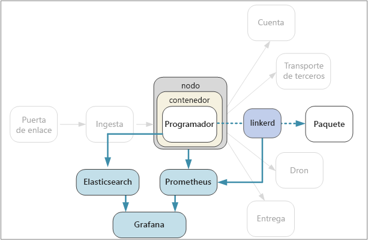

# <a name="designing-microservices-logging-and-monitoring"></a>Diseño de microservicios: registro y supervisión

En las aplicaciones complejas, en algún momento algo puede salir mal. En una aplicación de microservicios, necesita realizar un seguimiento de lo que está sucediendo en docenas o incluso centenares de servicios. El registro y la supervisión son cruciales para tener una visión holística del sistema. 



En una arquitectura de microservicios, puede ser especialmente difícil identificar la causa exacta de los errores o los cuellos de botella de rendimiento. Una única operación de usuario puede abarcar varios servicios. Los servicios pueden experimentar límites de E/S de red dentro del clúster. Una cadena de llamadas a través de los servicios puede provocar una contrapresión en el sistema, y generar una latencia alta o errores en cascada. Además, por lo general, no sabe en qué nodo se va a ejecutar un contenedor determinado. Los contenedores que se encuentran en el mismo nodo pueden competir entre sí por una CPU o una memoria limitada. 

Para facilitar la lectura de lo que está sucediendo, la aplicación debe emitir eventos de telemetría. Puede clasificar estos elementos en métricas y registros basados en texto. 

Las *métricas* son valores numéricos que se pueden analizar. Puede usarlas para observar el sistema en tiempo real (o casi en tiempo real) o para analizar las tendencias de rendimiento a lo largo del tiempo. Entre las métricas se incluyen:

- Métricas del sistema en el nivel de nodo, incluidos CPU, memoria, red, disco y uso del sistema de archivos. Las métricas del sistema le ayudan a comprender la asignación de recursos para cada nodo del clúster y solucionar problemas de valores atípicos.
 
- Métricas de Kubernetes. Dado que los servicios se ejecutan en contenedores, debe recopilar métricas en el nivel de contenedor, no solo en el nivel de máquina virtual. En Kubernetes, cAdvisor (asesor de contenedor) es el agente que recopila estadísticas acerca de la CPU, la memoria, el sistema de archivos y los recursos de red utilizados por cada contenedor. El demonio kubelet recopila estadísticas de recursos de cAdvisor y los expone a través de una API de REST.
   
- Métricas de aplicación. Aquí se incluyen todas las métricas que sean pertinentes para conocer el comportamiento de un servicio. Entre los ejemplos se encuentran el número de solicitudes HTTP entrantes en cola, la latencia de solicitud, la longitud de la cola de mensajes o el número de transacciones procesadas por segundo.

- Métricas de servicios dependientes. Los servicios del clúster pueden llamar a servicios externos que estén fuera del clúster, como los servicios administrados de PaaS. Puede supervisar los servicios de Azure mediante [Azure Monitor](/azure/monitoring-and-diagnostics/monitoring-overview). Los servicios de terceros pueden proporcionar o no todas las métricas. Si no es así, tendrá que depender de sus propias métricas de aplicación para realizar el seguimiento de estadísticas de latencia y tasa de errores.

Los *registros* son registros de eventos que se producen mientras se ejecuta la aplicación. Incluyen elementos como registros de aplicación (instrucciones de seguimiento) o registros de servidor web. Los registros son sobre todo útiles para analizar la causa raíz y los análisis forenses. 

## <a name="considerations"></a>Consideraciones

En el artículo [Supervisión y diagnóstico](../best-practices/monitoring.md) se describen los procedimientos recomendados generales para supervisar una aplicación. Estos son algunos puntos en los que hay que pensar en el contexto de una arquitectura de microservicios.

**Configuración y administración**. ¿Va a utilizar un servicio administrado para el registro y la supervisión o a implementar componentes de registro y supervisión como contenedores dentro del clúster? Para más información sobre estas opciones, consulte la sección [Opciones de tecnología](#technology-options) siguiente.

**Tasa de ingesta**. ¿Cuál es el rendimiento con el que el sistema puede recopilar eventos de telemetría? ¿Qué ocurre si se supera la tasa? Por ejemplo, el sistema puede limitar a los clientes, en cuyo caso se pierden los datos de telemetría o es posible que se reduzcan los datos. A veces puede mitigar este problema reduciendo la cantidad de datos que se recopilan:

  - Agregar métricas mediante el cálculo de estadísticas, como la media y la desviación estándar, y enviar estos datos estadísticos al sistema de supervisión.  

  - Reducir los datos, es decir, procesar solo un porcentaje de los eventos.

  - Procesar por lotes los datos para reducir el número de llamadas de red al servicio de supervisión.

**Costo**. El costo de la ingesta y del almacenamiento de datos de telemetría puede ser elevado, especialmente en volúmenes grandes. En algunos casos podría incluso superar el costo de la ejecución de la aplicación. En ese caso, debe reducir el volumen de telemetría mediante la agregación, la reducción de tamaño o el procesamientos por lotes de los datos, tal como se ha descrito anteriormente. 
        
**Fidelidad de los datos**. ¿Qué grado de precisión tienen las métricas? Las medias pueden ocultar valores atípicos, especialmente a escala. Además, si la frecuencia de muestreo es demasiado baja, puede suavizar las fluctuaciones en los datos. Puede parecer que todas las solicitudes tienen la misma latencia de un extremo a otro cuando, en realidad, una fracción considerable de las solicitudes están tardando mucho más. 

**Latencia**. Para habilitar las alertas y la supervisión en tiempo real, los datos de telemetría deben estar disponibles rápidamente. ¿En qué medida los datos que aparecen en el panel de supervisión son "en tiempo real"? ¿Tienen unos pocos segundos de antigüedad? ¿Más de un minuto?

**Almacenamiento**. Para los registros, puede ser más eficaz escribir los eventos de registro en un almacenamiento efímero del clúster y configurar un agente para enviar los archivos de registro a un almacenamiento más persistente.  Los datos se moverán, por último, a un almacenamiento a largo plazo para que estén disponibles para un análisis retrospectivo. Una arquitectura de microservicios puede generar un gran volumen de datos de telemetría, por lo que el costo del almacenamiento de datos es un punto importante que hay que evaluar. Tenga también en cuenta cómo va a consultar los datos. 

**Panel y la visualización**. ¿Obtiene una vista integral del sistema, a través de todos los servicios, tanto en el clúster como en los servicios externos? Si está escribiendo datos de telemetría y registros en más de una ubicación, ¿puede el panel mostrarlos todos y correlacionarlos? El panel de supervisión debe mostrar al menos la siguiente información:

- Asignación de recursos globales de capacidad y crecimiento. Aquí se incluyen el número de contenedores, las métricas del sistema de archivos, la red y la asignación de núcleos.
- Métricas de contenedor en correlación en el nivel de servicio.
- Métricas del sistema en correlación con contenedores.
- Errores de servicio y valores atípicos.
    

## <a name="distributed-tracing"></a>Seguimiento distribuido

Tal como se ha mencionado, uno de los retos en los microservicios es entender el flujo de eventos a través de los servicios. Una única operación o transacción puede implicar llamadas a varios servicios. Para reconstruir toda la secuencia de pasos, cada servicio debe propagar un *identificador de correlación* que actúa como identificador único para esa operación. El identificador de correlación habilita el [seguimiento distribuido](http://microservices.io/patterns/observability/distributed-tracing.html) a través de los servicios.

El primer servicio que recibe una solicitud de cliente debe generar el identificador de correlación. Si el servicio realiza una llamada HTTP a otro servicio, coloca el identificador de correlación en un encabezado de solicitud. De forma similar, si el servicio envía un mensaje asincrónico, coloca el identificador de correlación en el mensaje. Los servicios descendentes siguen propagando el identificador de correlación para que fluya a través de todo el sistema. Además, todo el código que escribe métricas de aplicación o eventos de registro debe incluir el identificador de correlación.

Cuando se ponen en correlación las llamadas de servicio, puede calcular métricas operativas como la latencia de un extremo a otro para una transacción completa, el número de transacciones correctas por segundo y el porcentaje de transacciones erróneas. La inclusión de identificadores de correlación en registros de aplicación permite realizar análisis de causa raíz. Si se produce un error en una operación, puede encontrar las instrucciones de registro para todas las llamadas de servicio que formaban parte de la misma operación. 

Estas son algunas consideraciones al implementar el seguimiento distribuido:

- Actualmente no hay ningún encabezado HTTP estándar para identificadores de correlación. El equipo debe estandarizar un valor de encabezado personalizado. La decisión depende de su plataforma de registro/supervisión o de la elección de una malla de servicio.

- Para mensajes asincrónicos, si su infraestructura de mensajería admite la incorporación de metadatos a los mensajes, debe incluir el identificador de correlación como metadatos. En caso contrario, inclúyalo como parte del esquema del mensaje.

- En lugar de un único identificador opaco, puede enviar un *contexto de correlación* que incluya información más completa, como las relaciones entre el autor de la llamada y el destinatario. 

- El SDK de Azure Application Insights inserta automáticamente el contexto de correlación en encabezados HTTP e incluye el identificador de correlación en los registros de Application Insights. Si decide usar las características de correlación integradas en Application Insights, es posible que algunos servicios necesiten propagar explícitamente aún los encabezados de correlación, en función de las bibliotecas que se vayan a usar. Para más información, consulte [Correlación de Telemetría en Application Insights](/azure/application-insights/application-insights-correlation).
   
- Si usa Istio o linkerd como malla de servicio, estas tecnologías generan automáticamente encabezados de correlación cuando las llamadas HTTP se enrutan a través de los servidores proxy de mallas de servicio. Los servicios deben reenviar los encabezados pertinentes. 

    - Istio: [Distributed Request Tracing](https://istio-releases.github.io/v0.1/docs/tasks/zipkin-tracing.html) (Seguimiento distribuido de solicitudes)
    
    - linkerd: [Context Headers](https://linkerd.io/config/1.3.0/linkerd/index.html#http-headers) (Encabezados de contexto)
    
- Tenga en cuenta cómo va a agregar los registros. Puede que desee estandarizar entre los equipos el modo de incluir los identificadores de correlación en los registros. Use un formato estructurado o semiestructurado, como JSON, y defina un campo común para contener el identificador de correlación.

## <a name="technology-options"></a>Opciones de tecnología

**Application Insights** es un servicio administrado de Azure que ingiere y almacena datos de telemetría y proporciona herramientas para analizar y buscar datos. Para usar Application Insights, instale un paquete de instrumentación en la aplicación. Este paquete supervisa la aplicación y envía los datos de telemetría al servicio Application Insights. También puede extraer datos de telemetría desde el entorno de host. Application Insights proporciona una correlación y un seguimiento de dependencias integrados. Le permite realizar un seguimiento de las métricas del sistema, las métricas de la aplicación y las métricas de servicio de Azure, en un mismo lugar.

Tenga en cuenta que Application Insights se ve limitado si la velocidad de datos supera un límite máximo; para más información, consulte [Límites de Application Insights](/azure/azure-subscription-service-limits#application-insights-limits). Una única operación puede generar varios eventos de telemetría, por lo que si la aplicación experimenta un gran volumen de tráfico, es probable que se vea limitada. Para mitigar este problema, puede realizar un muestreo para reducir el tráfico de telemetría. El inconveniente es que las métricas serán menos precisas. Para más información, consulte [Muestreo en Application Insights](/azure/application-insights/app-insights-sampling). También puede reducir el volumen de datos mediante la agregación previa de métricas, es decir, calcular valores estadísticos, como la media y la desviación estándar, y enviar esos valores en lugar de la telemetría sin formato. En la siguiente publicación de blog se describe un enfoque sobre el uso de Application Insights a escala: [Azure Monitoring and Analytics at Scale](https://blogs.msdn.microsoft.com/azurecat/2017/05/11/azure-monitoring-and-analytics-at-scale/) (Supervisión de Azure y análisis a escala).

Además, asegúrese de que comprende el modelo de precios para Application Insights porque se le cobrará en función del volumen de datos. Para más información, consulte [Administración de precios y volúmenes de datos de Application Insights](/azure/application-insights/app-insights-pricing). Si la aplicación genera un gran volumen de telemetría y no desea realizar un muestreo ni una agregación de los datos, es posible que Application Insights no sea la opción adecuada. 

Si Application Insights no satisface sus requisitos, le presentamos algunos enfoques sugeridos que emplean tecnologías de código abierto conocidas.

Para las métricas del sistema y de contenedor, considere la posibilidad de exportar las métricas a una base de datos de serie temporal, como **Prometheus** o **InfluxDB**, que se ejecute en el clúster.

- InfluxDB es un sistema basado en la inserción. Un agente tiene que insertar las métricas. Puede usar [Heapster][heapster], que es un servicio que recopila métricas de todo el clúster de kubelet, agrega los datos y los inserta en InfluxDB u otra solución de almacenamiento de serie temporal. Azure Container Service implementa Heapster como parte de la instalación del clúster. Otra opción es [Telegraf](https://www.influxdata.com/time-series-platform/telegraf/), que es un agente para recopilar y notificar métricas. 

- Prometheus es un sistema basado en la extracción. Periódicamente extrae métricas de ubicaciones configuradas. Prometheus puede extraer métricas generadas por cAdvisor o kube-state-metrics. [kube-state-metrics][kube-state-metrics] es un servicio que recopila métricas del servidor de API de Kubernetes y las pone a disposición de Prometheus (o un extractor que sea compatible con un punto de conexión de cliente de Prometheus). Mientras que Heapster agrega las métricas que Kubernetes genera y las reenvía a un receptor, kube-state-metrics genera sus propias métricas y hace que estén disponibles a través de un punto de conexión para la extracción. Para las métricas del sistema, use [node-exporter](https://github.com/prometheus/node_exporter), que es un exportador de Prometheus para las métricas del sistema. Prometheus admite datos de punto flotante pero no datos de cadena, por lo que es adecuado para las métricas del sistema pero no para los registros.

- Use una herramienta de panel como **Kibana** o **Grafana** para visualizar y supervisar los datos. También se puede ejecutar el servicio de panel dentro de un contenedor en el clúster.

Para los registros de aplicación, considere la posibilidad de usar **Fluentd** y **Elasticsearch**. Fluentd es un recopilador de datos de código abierto y Elasticsearch es una base de datos de documentos que está optimizada para actuar como un motor de búsqueda. Con este enfoque, cada servicio envía registros para `stdout` y `stderr`, y Kubernetes escribe estos flujos en el sistema de archivos local. Fluentd recopila los registros, opcionalmente los enriquece con metadatos adicionales de Kubernetes y los envía a Elasticsearch. Use Kibana, Grafana u otra herramienta similar a fin de crear un panel para Elasticsearch. Fluentd se ejecuta como un daemonset en el clúster, lo que garantiza que se asigne un pod Fluentd a cada nodo. Puede configurar Fluentd para recopilar registros de kubelet así como registros de contenedor. En grandes volúmenes, al escribir registros en el sistema de archivos local, se podría generar un cuello de botella de rendimiento especialmente si se ejecutan varios servicios en el mismo nodo. Supervise la latencia de disco y el uso del sistema de archivos en producción.

Una ventaja de usar Fluentd con Elasticsearch para los registros es que los servicios no requieren dependencias de bibliotecas adicionales. Cada servicio se escribe en `stdout` y `stderr`, y Fluentd controla la exportación de los registros a Elasticsearch. Además, los equipos que escriben servicios no necesitan entender cómo se configura la infraestructura de registro. Uno de los retos consiste en configurar el clúster de Elasticsearch para una implementación de producción, a fin de que se escale para administrar el tráfico. 

Otra opción consiste en enviar registros a Log Analytics de Operations Management Suite (OMS). El servicio [Log Analytics][log-analytics] recopila datos de registro en un repositorio central y también puede consolidar datos de otros servicios de Azure que usa su aplicación. Para más información, consulte [Supervisión de un clúster de Azure Container Service con Microsoft Operations Management Suite (OMS)][k8s-to-oms].

## <a name="example-logging-with-correlation-ids"></a>Ejemplo: registro con identificadores de correlación

Para ilustrar algunos de los puntos que se describen en este capítulo, se muestra un ejemplo completo sobre cómo el servicio de paquete implementa el registro. El servicio de paquete está escrito en TypeScript y utiliza la plataforma web [Koa](http://koajs.com/) para Node.js. Hay varias bibliotecas de registro de Node.js para elegir. Hemos elegido [Winston](https://github.com/winstonjs/winston), una biblioteca de registro conocida que ha cumplido nuestros requisitos de rendimiento cuando la hemos probado.

Para encapsular los detalles de implementación, hemos definido una interfaz `ILogger` abstracta:

```ts
export interface ILogger {
    log(level: string, msg: string, meta?: any)
    debug(msg: string, meta?: any)
    info(msg: string, meta?: any)
    warn(msg: string, meta?: any)
    error(msg: string, meta?: any)
}
```

Esta es una implementación `ILogger` que incluye la biblioteca Winston. Toma el identificador de correlación como un parámetro de constructor e inserta el identificador en cada mensaje de registro. 

```ts
class WinstonLogger implements ILogger {
    constructor(private correlationId: string) {}
    log(level: string, msg: string, payload?: any) {
        var meta : any = {};
        if (payload) { meta.payload = payload };
        if (this.correlationId) { meta.correlationId = this.correlationId }
        winston.log(level, msg, meta)
    }
  
    info(msg: string, payload?: any) {
        this.log('info', msg, payload);
    }
    debug(msg: string, payload?: any) {
        this.log('debug', msg, payload);
    }
    warn(msg: string, payload?: any) {
        this.log('warn', msg, payload);
    }
    error(msg: string, payload?: any) {
        this.log('error', msg, payload);
    }
}
```

El servicio de paquete necesita extraer el identificador de correlación de la solicitud HTTP. Por ejemplo, si usa linkerd, el identificador de correlación se encuentra en el encabezado `l5d-ctx-trace`. En Koa, la solicitud HTTP se almacena en un objeto de contexto que pasa a través de la canalización de procesamiento de solicitudes. Se puede definir una función de middleware para obtener el identificador de correlación del contexto e inicializar el registrador. (Una función de middleware en Koa es simplemente una función que se ejecuta para cada solicitud).

```ts
export type CorrelationIdFn = (ctx: Context) => string;

export function logger(level: string, getCorrelationId: CorrelationIdFn) {
    winston.configure({ 
        level: level,
        transports: [new (winston.transports.Console)()]
        });
    return async function(ctx: any, next: any) {
        ctx.state.logger = new WinstonLogger(getCorrelationId(ctx));
        await next();
    }
}
```

Este middleware invoca una función, `getCorrelationId`, definida por el autor de la llamada para obtener el identificador de correlación. Después crea una instancia del registrador y lo guarda provisionalmente dentro de `ctx.state`, que es un diccionario de claves y valores que se usa en Koa para pasar información a través de la canalización. 

El middleware del registrador se agrega a la canalización en el inicio:

```ts
app.use(logger(Settings.logLevel(), function (ctx) {
    return ctx.headers[Settings.correlationHeader()];  
}));
```

Una vez que está todo configurado, es muy sencillo agregar instrucciones de registro al código. Por ejemplo, este es el método que busca un paquete. Realiza dos llamadas al método `ILogger.info`.

```ts
async getById(ctx: any, next: any) {
  var logger : ILogger = ctx.state.logger;
  var packageId = ctx.params.packageId;
  logger.info('Entering getById, packageId = %s', packageId);

  await next();

  let pkg = await this.repository.findPackage(ctx.params.packageId)

  if (pkg == null) {
    logger.info(`getById: %s not found`, packageId);
    ctx.response.status= 404;
    return;
  }

  ctx.response.status = 200;
  ctx.response.body = this.mapPackageDbToApi(pkg);
}
```

No es necesario incluir el identificador de correlación en las instrucciones de registro, ya que la función de middleware lo realiza automáticamente. Esto hace que el código de registro sea más limpio y reduce la posibilidad de que un desarrollador olvide incluir el identificador de correlación. Y dado que todas las instrucciones de registro usan la interfaz `ILogger` abstracta, será fácil reemplazar la implementación del registrador más adelante.

> [!div class="nextstepaction"]
> [Integración y entrega continuas](./ci-cd.md)

<!-- links -->

[app-insights]: /azure/application-insights/app-insights-overview
[heapster]: https://github.com/kubernetes/heapster
[kube-state-metrics]: https://github.com/kubernetes/kube-state-metrics
[k8s-to-oms]: /azure/container-service/kubernetes/container-service-kubernetes-oms
[log-analytics]: /azure/log-analytics/