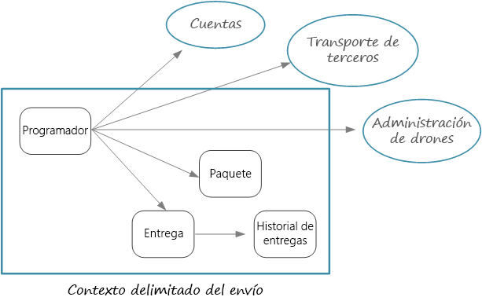
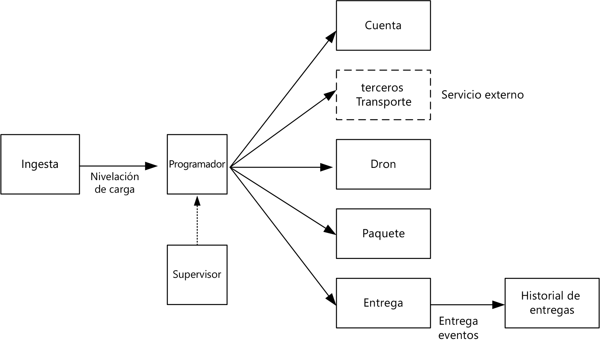

# Diseño de microservicios: identificación de los límites de los microserviciosDesigning microservices: Identifying microservice boundaries

¿Cuál es el tamaño correcto para un microservicio?What is the right size for a microservice? Seguramente oirá afirmaciones del tipo "ni demasiado grande ni demasiado pequeño", y aunque esto es ciertamente correcto, no resulta muy útil en la práctica.You often hear something to the effect of, "not too big and not too small" &mdash; and while that's certainly correct, it's not very helpful in practice. Pero si se empieza desde un modelo de dominio cuidadosamente diseñado, es mucho más fácil razonar acerca de los microservicios.But if you start from a carefully designed domain model, it's much easier to reason about microservices.

## Desde un modelo de dominio a los microserviciosFrom domain model to microservices

En el [capítulo anterior](./domain-analysis.md), definimos un conjunto de contextos delimitados para la aplicación Drone Delivery.In the [previous chapter](./domain-analysis.md), we defined a set of bounded contexts for the Drone Delivery application. Luego observamos más de cerca uno de estos contextos delimitados, el contexto delimitado Shipping, e identificamos un conjunto de entidades, agregados, y servicios de dominio para ese contexto delimitado.Then we looked more closely at one of these bounded contexts, the Shipping bounded context, and identified a set of entities, aggregates, and domain services for that bounded context.

Ahora estamos preparados para pasar del modelo de dominio al diseño de la aplicación.Now we're ready to go from domain model to application design. Este es un enfoque que puede usar para derivar microservicios desde el modelo de dominio.Here's an approach that you can use to derive microservices from the domain model.

1. Comience con un contexto delimitado.Start with a bounded context. En general, la funcionalidad en un microservicio no debe abarcar más de un contexto delimitado.In general, the functionality in a microservice should not span more than one bounded context. Por definición, un contexto delimitado marca el límite de un modelo de dominio en particular.By definition, a bounded context marks the boundary of a particular domain model. Si encuentra que un microservicio mezcla modelos de dominio diferentes, es un signo de que puede que tenga que volver atrás para refinar el análisis de dominio.If you find that a microservice mixes different domain models together, that's a sign that you may need to go back and refine your domain analysis.

2. A continuación, mire los agregados en el modelo de dominio.Next, look at the aggregates in your domain model. Los agregados suelen ser buenos candidatos para microservicios.Aggregates are often good candidates for microservices. Un agregado bien diseñado tiene muchas de las características de un microservicio bien diseñado, como:A well-designed aggregate exhibits many of the characteristics of a well-designed microservice, such as:

    - Un agregado se deriva de los requisitos empresariales más que de las preocupaciones técnicas, como el acceso a datos o la mensajería.An aggregate is derived from business requirements, rather than technical concerns such as data access or messaging.  
    - Un agregado debe tener alta cohesión funcional.An aggregate should have high functional cohesion.
    - Un agregado es un límite de persistencia.An aggregate is a boundary of persistence.
    - Los agregados deben tener un acoplamiento flexible.Aggregates should be loosely coupled. 
    
3. Los servicios de dominio también son buenos candidatos para microservicios.Domain services are also good candidates for microservices. Los servicios de dominio son operaciones sin estado a través de varios agregados.Domain services are stateless operations across multiple aggregates. Un ejemplo típico es un flujo de trabajo que implica varios microservicios.A typical example is a workflow that involves several microservices. Veremos un ejemplo de esto en la aplicación Drone Delivery.We'll see an example of this in the Drone Delivery application.

4. Por último, tenga en cuenta los requisitos no funcionales.Finally, consider non-functional requirements. Observe factores como el tamaño del equipo, los tipos de datos, tecnologías, requisitos de escalabilidad, requisitos de disponibilidad y requisitos de seguridad.Look at factors such as team size, data types, technologies, scalability requirements, availability requirements, and security requirements. Estos factores pueden llevarle a volver a dividir un microservicio en dos o más servicios más pequeños, o a hacer lo contrario combinando varios microservicios en uno.These factors may lead you to further decompose a microservice into two or more smaller services, or do the opposite and combine several microservices into one. 

Después de identificar los microservicios en su aplicación, valide el diseño con los siguientes criterios:After you identify the microservices in your application, validate your design against the following criteria:

- Cada servicio tiene una única responsabilidad.Each service has a single responsibility.
- No hay llamadas que generen mucha conversación entre servicios.There are no chatty calls between services. Si dividir la funcionalidad en dos servicios hace que estos generen demasiada conversación, esto puede ser una indicación de que estas funciones deben estar en el mismo servicio.If splitting functionality into two services causes them to be overly chatty, it may be a symptom that these functions belong in the same service.
- Cada servicio es lo suficientemente pequeño como para que un equipo pequeño lo pueda generar trabajando de forma independiente.Each service is small enough that it can be built by a small team working independently.
- No hay interdependencias que requieran la implementación de dos o más servicios en sincronía.There are no inter-dependencies that will require two or more services to be deployed in lock-step. Siempre debe ser posible implementar un servicio sin tener que volver a implementar ninguno de los demás servicios.It should always be possible to deploy a service without redeploying any other services.
- Los servicios no están estrechamente acoplados y pueden evolucionar independientemente.Services are not tightly coupled, and can evolve independently.
- Los límites de servicio no causarán problemas con la coherencia de datos o la integridad.Your service boundaries will not create problems with data consistency or integrity. A veces es importante mantener la coherencia de datos colocando la funcionalidad en un único microservicio.Sometimes it's important to maintain data consistency by putting functionality into a single microservice. Dicho esto, considere si realmente necesita una fuerte coherencia.That said, consider whether you really need strong consistency. Hay estrategias para resolver la coherencia final en un sistema distribuido, y las ventajas de descomponer servicios generalmente superan los desafíos que supone administrar la coherencia final.There are strategies for addressing eventual consistency in a distributed system, and the benefits of decomposing services often outweigh the challenges of managing eventual consistency.

Sobre todo, es importante ser práctico y recordar que el diseño basado en dominio es un proceso iterativo.Above all, it's important to be pragmatic, and remember that domain-driven design is an iterative process. En caso de duda, empiece con microservicios más generales.When in doubt, start with more coarse-grained microservices. Dividir un microservicio en dos servicios más pequeños es más sencillo que la refactorización de funcionalidad entre varios microservicios existentes.Splitting a microservice into two smaller services is easier than refactoring functionality across several existing microservices.
  
## Drone Delivery: definición de los microserviciosDrone Delivery: Defining the microservices

Recuerde que el equipo de desarrollo había identificado los cuatro agregados &mdash;Delivery, Package, Drone, y Account&mdash; y dos servicios de dominio, Scheduler y Supervisor.Recall that the development team had identified the four aggregates &mdash; Delivery, Package, Drone, and Account &mdash; and two domain services, Scheduler and Supervisor. 

Delivery y Package son candidatos obvios para los microservicios.Delivery and Package are obvious candidates for microservices. Scheduler y Supervisor coordinan las actividades realizadas por otros microservicios, por lo que tiene sentido implementar estos servicios de dominio como microservicios.The Scheduler and Supervisor coordinate the activities performed by other microservices, so it makes sense to implement these domain services as microservices.  

Drone y Account son interesantes porque pertenecen a otros contextos delimitados.Drone and Account are interesting because they belong to other bounded contexts. Una opción es que Scheduler llame a los contextos delimitados Drone y Account directamente.One option is for the Scheduler to call the Drone and Account bounded contexts directly. Otra opción es crear microservicios Drone y Account dentro del contexto delimitado Shipping.Another option is to create Drone and Account microservices inside the Shipping bounded context. Estos microservicios mediarán entre los contextos delimitados a través de la exposición de las API o los esquemas de datos que son más adecuados para el contexto Shipping.These microservices would mediate between the bounded contexts, by exposing APIs or data schemas that are more suited to the Shipping context.

Los detalles de los contextos delimitados Drone y Account quedan fuera del ámbito de esta guía, por lo que hemos creado servicios ficticios para ellos en nuestra implementación de referencia.The details of the Drone and Account bounded contexts are beyond the scope of this guidance, so we created mock services for them in our reference implementation. Pero hay algunos factores a tener en cuenta en esta situación:But here are some factors to consider in this situation:

- ¿Cuál es la sobrecarga de la red al llamar directamente al otro contexto delimitado?What is the network overhead of calling directly into the other bounded context? 

- ¿Es el esquema de datos para el otro contexto delimitado adecuado para este contexto, o es mejor tener un esquema que se adapte a este contexto delimitado?Is the data schema for the other bounded context suitable for this context, or is it better to have a schema that's tailored to this bounded context? 

- ¿Es el otro contexto delimitado un sistema heredado?Is the other bounded context a legacy system? Si es así, podría crear un servicio que actúe como una [capa para evitar daños](../patterns/anti-corruption-layer.md) para traducir entre el sistema heredado y la aplicación moderna.If so, you might create a service that acts as an [anti-corruption layer](../patterns/anti-corruption-layer.md) to translate between the legacy system and the modern application. 

- ¿Cuál es la estructura del equipo?What is the team structure? ¿Es fácil comunicarse con el equipo que se encarga del otro contexto delimitado?Is it easy to communicate with the team that's responsible for the other bounded context? De lo contrario, la creación de un servicio que medie entre los dos contextos puede ayudar a mitigar el costo de la comunicación entre equipos.If not, creating a service that mediates between the two contexts can help to mitigate the cost of cross-team communication.

Hasta ahora, no hemos considerado ningún requisito no funcional.So far, we haven't considered any non-functional requirements. Pensando en los requisitos de rendimiento de la aplicación, el equipo de desarrollo decidió crear un microservicio Ingestion independiente, que se encarga de la ingesta de las solicitudes de cliente.Thinking about the application's throughput requirements, the development team decided to create a separate Ingestion microservice that is responsible for ingesting client requests. Este microservicio implementará la [redistribución de la carga](../patterns/queue-based-load-leveling.md) colocando las solicitudes entrantes en un búfer para su procesamiento.This microservice will implement [load leveling](../patterns/queue-based-load-leveling.md) by putting incoming requests into a buffer for processing. Scheduler leerá las solicitudes desde el búfer y ejecutará el flujo de trabajo.The Scheduler will read the requests from the buffer and execute the workflow. 

Los requisitos no funcionales llevaron al equipo a crear un servicio adicional.Non-functional requirements led the team to create one additional service. Todos los servicios hasta ahora se han dedicado al proceso de programación y entrega de paquetes en tiempo real.All of the services so far have been about the process of scheduling and delivering packages in real time. Pero el sistema también necesita almacenar el historial de cada entrega en un almacenamiento a largo plazo para el análisis de datos.But the system also needs to store the history of every delivery in long-term storage for data analysis. El equipo consideró hacer que esto fuera responsabilidad del servicio Delivery.The team considered making this the responsibility of the Delivery service. Sin embargo, los requisitos de almacenamiento de datos para el análisis histórico son muy distintos a los de las operaciones en vuelo (consulte [Consideraciones de datos](./data-considerations.md)).However, the data storage requirements are quite different for historical analysis versus in-flight operations (see [Data considerations](./data-considerations.md)). Por lo tanto, el equipo decidió crear un servicio Delivery History independiente que realizará escuchas de eventos DeliveryTracking del servicio Delivery, y escribirá los eventos en un almacenamiento a largo plazo.Therefore, the team decided to create a separate Delivery History service, which will listen for DeliveryTracking events from the Delivery service and write the events into long-term storage.

En el siguiente diagrama se muestra el proceso en este punto:The following diagram shows the design at this point:
 

## Selección de una opción de procesoChoosing a compute option

El término *proceso* hace referencia al modelo de hospedaje para los recursos informáticos donde se ejecutan las aplicaciones.The term *compute* refers to the hosting model for the computing resources that your application runs on. Para una arquitectura de microservicios, hay dos enfoques especialmente populares:For a microservices architecture, two approaches are especially popular:

- Un orquestador de servicios que administra los servicios que se ejecutan en nodos dedicados (máquinas virtuales).A service orchestrator that manages services running on dedicated nodes (VMs).
- Una arquitectura sin servidor mediante funciones como un servicio (FaaS).A serverless architecture using functions as a service (FaaS). 

Aunque estas no son las únicas opciones, ambas son métodos probados para generar microservicios.While these aren't the only options, they are both proven approaches to building microservices. Una aplicación puede incluir ambos enfoques.An application might include both approaches.

### Orquestadores de serviciosService orchestrators

Un orquestador controla las tareas relacionadas con la implementación y administración de un conjunto de servicios.An orchestrator handles tasks related to deploying and managing a set of services. Estas tareas incluyen colocar servicios en los nodos, supervisar el estado de los servicios, reiniciar los servicios en mal estado, equilibrar la carga del tráfico de red en todas las instancias de servicio, detectar servicios, escalar el número de instancias de un servicio y aplicar actualizaciones de configuración.These tasks include placing services on nodes, monitoring the health of services, restarting unhealthy services, load balancing network traffic across service instances, service discovery, scaling the number of instances of a service, and applying configuration updates. Entre los orquestadores más populares se encuentran Kubernetes, DC/OS, Docker Swarm y Service Fabric.Popular orchestrators include Kubernetes, DC/OS, Docker Swarm, and Service Fabric. 

- [Azure Container Service](/azure/container-service/) (ACS) es un servicio de Azure que le permite implementar un clúster de Kubernetes, DC/OS o Docker Swarm listo para producción.[Azure Container Service](/azure/container-service/) (ACS) is an Azure service that lets you deploy a production-ready Kubernetes, DC/OS, or Docker Swarm cluster.

- [AKS (Azure Container Service)](/azure/aks/) es un servicio administrado de Kubernetes.[AKS (Azure Container Service)](/azure/aks/) is a managed Kubernetes service. AKS aprovisiona Kubernetes y expone los puntos de conexión de la API de Kubernetes, pero hospeda y administra el plano de control de Kubernetes, realizando actualizaciones automatizadas, correcciones automatizadas, autoescala y otras tareas de administración.AKS provisions Kubernetes and exposes the Kubernetes API endpoints, but hosts and manages the Kubernetes control plane, performing automated upgrades, automated patching, autoscaling, and other management tasks. Se puede considerar AKS como "API de Kubernetes como servicio".You can think of AKS as being "Kubernetes APIs as a service." En el momento de redactar este texto, AKS sigue aún en versión preliminar.At the time of writing, AKS is still in preview. De todas formas, se espera que AKS se convertirá en la mejor manera de ejecutar Kubernetes en Azure.However, it's expected that AKS will become the preferred way to run Kubernetes in Azure. 

- [Service Fabric](/azure/service-fabric/) es una plataforma de sistemas distribuidos para empaquetar, implementar y administrar microservicios.[Service Fabric](/azure/service-fabric/) is a distributed systems platform for packaging, deploying, and managing microservices. Los microservicios pueden implementarse en Service Fabric como contenedores, como archivos ejecutables binarios o como [Reliable Services](/azure/service-fabric/service-fabric-reliable-services-introduction).Microservices can be deployed to Service Fabric as containers, as binary executables, or as [Reliable Services](/azure/service-fabric/service-fabric-reliable-services-introduction). Usando el modelo de programación de Reliable Services, los servicios pueden utilizar directamente las API de programación de Service Fabric para consultar el sistema, informar del estado, recibir notificaciones acerca de la configuración y los cambios de código y detectar otros servicios.Using the Reliable Services programming model, services can directly use Service Fabric programming APIs to query the system, report health, receive notifications about configuration and code changes, and discover other services. Una diferencia clave con Service Fabric es el enfoque prioritario dado a la creación de servicios con estado mediante [Reliable Collections](/azure/service-fabric/service-fabric-reliable-services-reliable-collections).A key differentiation with Service Fabric is its strong focus on building stateful services using [Reliable Collections](/azure/service-fabric/service-fabric-reliable-services-reliable-collections).

### ContenedoresContainers

A veces se habla de contenedores y microservicios como si fueran lo mismo.Sometimes people talk about containers and microservices as if they were the same thing. Aunque esto no es cierto (los contenedores no son necesarios para generar microservicios), los contenedores tienen algunas de las ventajas que son especialmente apropiadas para los microservicios, como:While that's not true &mdash; you don't need containers to build microservices &mdash; containers do have some benefits that are particularly relevant to microservices, such as:

- **Portabilidad**.**Portability**. Una imagen de contenedor es un paquete independiente que se ejecuta sin necesidad de instalar las bibliotecas u otras dependencias.A container image is a standalone package that runs without needing to install libraries or other dependencies. Esto hace que sean fáciles de implementar.That makes them easy to deploy. Los contenedores pueden iniciarse y detenerse rápidamente, por lo que puede poner en marcha nuevas instancias para controlar más carga o para recuperarse de errores de nodo.Containers can be started and stopped quickly, so you can spin up new instances to handle more load or to recover from node failures. 

- **Densidad**.**Density**. Los contenedores son ligeros en comparación con la ejecución de una máquina virtual, ya que comparten recursos de sistema operativo.Containers are lightweight compared with running a virtual machine, because they share OS resources. Esto permite empaquetar varios contenedores en un nodo único, lo que es especialmente útil cuando la aplicación consta de muchos servicios pequeños.That makes it possible to pack multiple containers onto a single node, which is especially useful when the application consists of many small services.

- **Aislamiento de recursos**.**Resource isolation**. Puede limitar la cantidad de memoria y CPU que están disponibles para un contenedor, lo que puede ayudar a garantizar que un proceso descontrolado no agotará los recursos del host.You can limit the amount of memory and CPU that is available to a container, which can help to ensure that a runaway process doesn't exhaust the host resources. Consulte el [patrón Bulkhead](../patterns/bulkhead.md) para más información.See the [Bulkhead Pattern](../patterns/bulkhead.md) for more information.

### Arquitectura sin servidor (funciones como un servicio)Serverless (Functions as a Service)

Con una arquitectura sin servidor, no se administran las máquinas virtuales ni la infraestructura de red virtual.With a serverless architecture, you don't manage the VMs or the virtual network infrastructure. En su lugar, se implementa código y el servicio de hospedaje controla la colocación de ese código en una máquina virtual y lo ejecuta.Instead, you deploy code and the hosting service handles putting that code onto a VM and executing it. Este enfoque tiende a favorecer a las pequeñas funciones pormenorizadas que se coordinan mediante el uso de los desencadenadores basados en eventos.This approach tends to favor small granular functions that are coordinated using event-based triggers. Por ejemplo, un mensaje que se colocan en una cola puede desencadenar una función que lee de la cola y procesa el mensaje.For example, a message being placed onto a queue might trigger a function that reads from the queue and processes the message.

[Azure Functions][functions] es un servicio de proceso sin servidor que admite varios desencadenadores de función, incluidas las solicitudes HTTP, las colas de Service Bus y los eventos de Event Hubs.[Azure Functions][functions] is a serverless compute service that supports various function triggers, including HTTP requests, Service Bus queues, and Event Hubs events. Si desea una lista completa consulte [Conceptos básicos sobre los enlaces y desencadenadores de Azure Functions][functions-triggers].For a complete list, see [Azure Functions triggers and bindings concepts][functions-triggers]. Tenga en cuenta también a [Azure Event Grid][event-grid], que es un servicio de enrutamiento de evento administrado de Azure.Also consider [Azure Event Grid][event-grid], which is a managed event routing service in Azure.

### ¿Orquestador o sin servidor?Orchestrator or serverless?

Estos son algunos de los factores a considerar a la hora de elegir entre un enfoque con orquestador y un enfoque sin servidor.Here are some factors to consider when choosing between an orchestrator approach and a serverless approach.

**Capacidad de administración** una aplicación sin servidor es fácil de administrar, porque la plataforma administra todos los recursos de proceso.**Manageability** A serverless application is easy to manage, because the platform manages all the of compute resources for you. Un orquestador aunque abstrae algunos aspectos de la administración y la configuración de un clúster, no oculta por completo las máquinas virtuales subyacentes.While an orchestrator abstracts some aspects of managing and configuring a cluster, it does not completely hide the underlying VMs. Con un orquestador, tendrá que pensar en problemas, como el equilibrio de carga, uso de CPU y memoria y funciones de red.With an orchestrator, you will need to think about issues such as load balancing, CPU and memory usage, and networking.

**Flexibilidad y control**.**Flexibility and control**. Un orquestador le ofrece un gran control sobre la configuración y administración de los servicios y del clúster.An orchestrator gives you a great deal of control over configuring and managing your services and the cluster. Como contrapartida tiene una complejidad adicional.The tradeoff is additional complexity. Con una arquitectura sin servidor, se renuncia a un cierto grado de control porque se extraen estos detalles.With a serverless architecture, you give up some degree of control because these details are abstracted.

**Portabilidad**.**Portability**. Todos los orquestadores enumerados aquí (Kubernetes, DC/OS, Docker Swarm y Service Fabric) se pueden ejecutar de forma local o en varias nubes públicas.All of the orchestrators listed here (Kubernetes, DC/OS, Docker Swarm, and Service Fabric) can run on-premises or in multiple public clouds. 

**Integración de aplicaciones**.**Application integration**. Puede resultar complicado crear una aplicación compleja con una arquitectura sin servidor.It can be challenging to build a complex application using a serverless architecture. Una opción en Azure consiste en usar [Azure Logic Apps](/azure/logic-apps/) para coordinar un conjunto de Azure Functions.One option in Azure is to use [Azure Logic Apps](/azure/logic-apps/) to coordinate a set of Azure Functions. Para encontrar un ejemplo de este enfoque, consulte [Creación de una función que se integre con Azure Logic Apps](/azure/azure-functions/functions-twitter-email).For an example of this approach, see [Create a function that integrates with Azure Logic Apps](/azure/azure-functions/functions-twitter-email).

**Costo**.**Cost**. Con un orquestador, se paga por las máquinas virtuales que se ejecutan en el clúster.With an orchestrator, you pay for the VMs that are running in the cluster. Con una aplicación sin servidor, solo se paga por el consumo real de los recursos de proceso.With a serverless application, you pay only for the actual compute resources consumed. En ambos casos, debe tener en cuenta el costo de los servicios adicionales, como almacenamiento, bases de datos y servicios de mensajería.In both cases, you need to factor in the cost of any additional services, such as storage, databases, and messaging services.

**Escalabilidad**.**Scalability**. Azure Functions se escala automáticamente para satisfacer la demanda en función del número de eventos de entrada.Azure Functions scales automatically to meet demand, based on the number of incoming events. Con un orquestador, puede escalar horizontalmente aumentando el número de instancias de servicio que se ejecutan en el clúster.With an orchestrator, you can scale out by increasing the number of service instances running in the cluster. También puede escalar agregando máquinas virtuales adicionales al clúster.You can also scale by adding additional VMs to the cluster.

Nuestra implementación de referencia, usa principalmente Kubernetes, pero hemos usado Azure Functions para un servicio: el servicio Delivery History.Our reference implementation primarily uses Kubernetes, but we did use Azure Functions for one service, namely the Delivery History service. Azure Functions era una buena opción para este servicio en concreto porque es una carga de trabajo basada en eventos.Azure Functions was a good fit for this particular service, because it's is an event-driven workload. Mediante el uso de un desencadenador de Event Hubs para invocar la función, el servicio necesitó una cantidad mínima de código.By using an Event Hubs trigger to invoke the function, the service needed a minimal amount of code. Además, el servicio Delivery History no forma parte del flujo de trabajo principal, por lo que ejecutarlo fuera del clúster Kubernetes no afecta a la latencia de un extremo a otro de las operaciones iniciadas por el usuario.Also, the Delivery History service is not part of the main workflow, so running it outside of the Kubernetes cluster doesn't affect the end-to-end latency of user-initiated operations. 

> [!div class="nextstepaction"]
> [Consideraciones sobre los datosData considerations](./data-considerations.md)

<!-- links -->

[acs-engine]: https://github.com/Azure/acs-engine
[acs-faq]: /azure/container-service/dcos-swarm/container-service-faq
[event-grid]: /azure/event-grid/
[functions]: /azure/azure-functions/functions-overview
[functions-triggers]: /azure/azure-functions/functions-triggers-bindings
