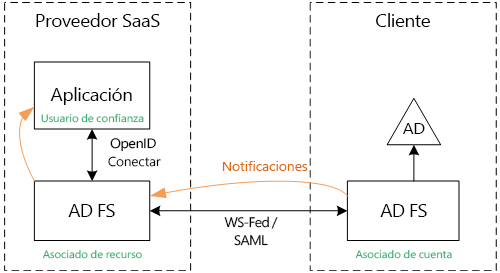
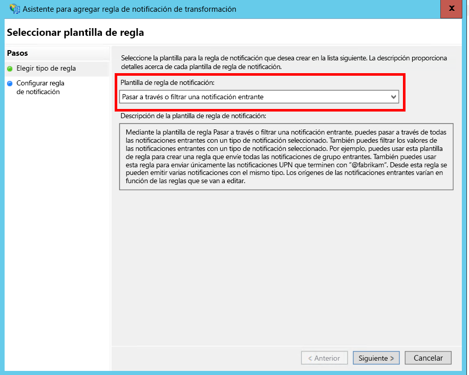
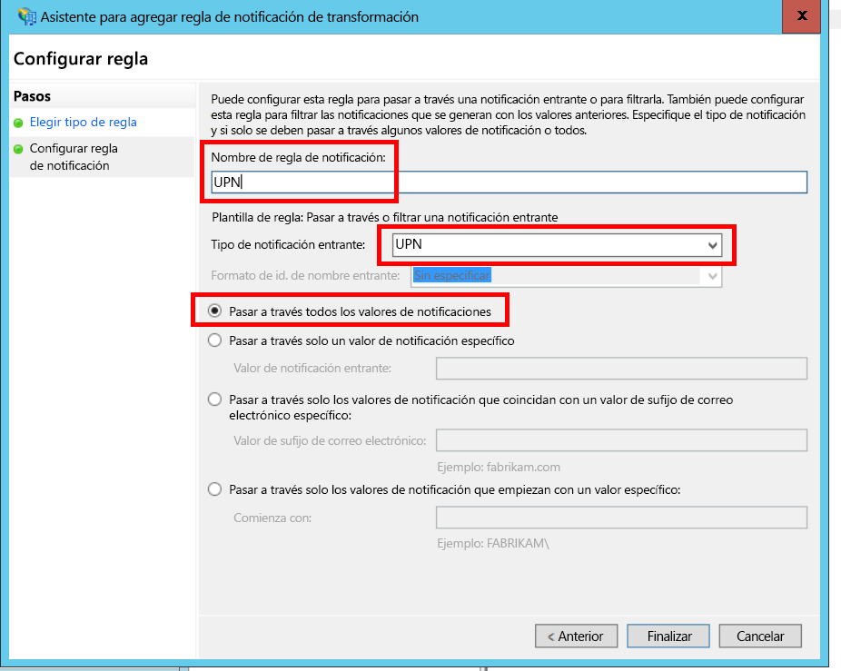
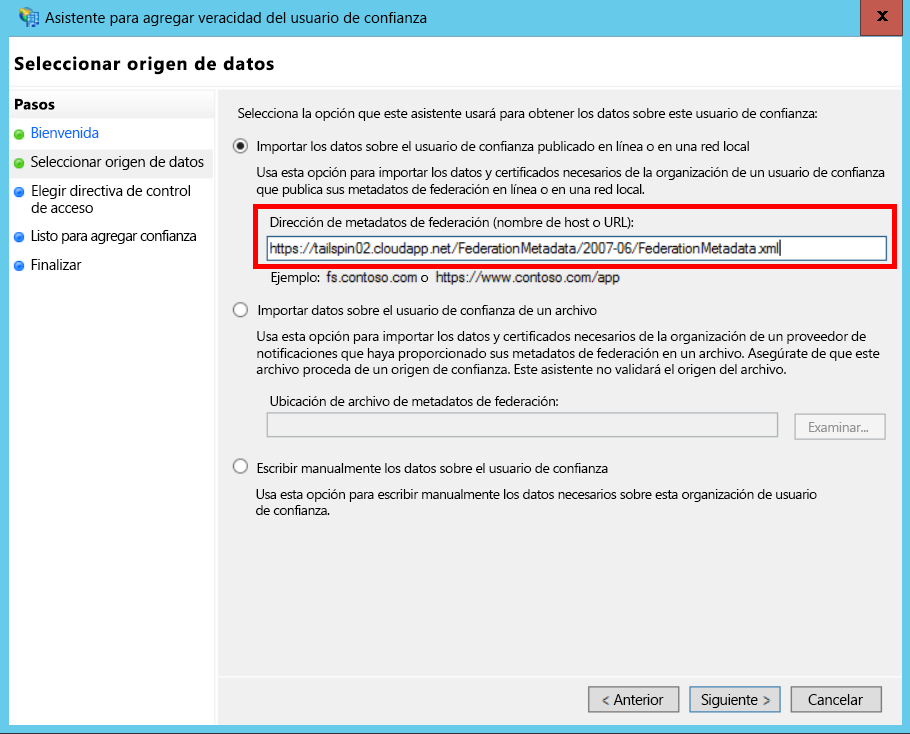
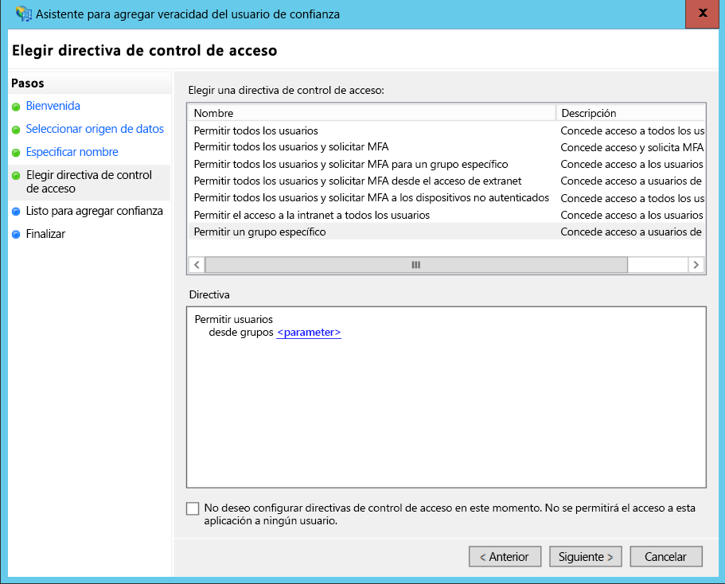
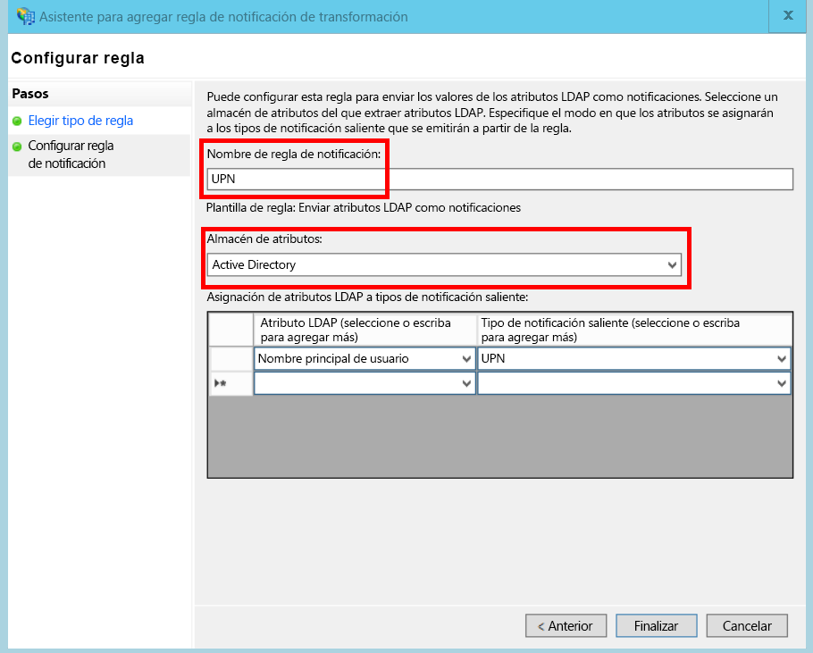
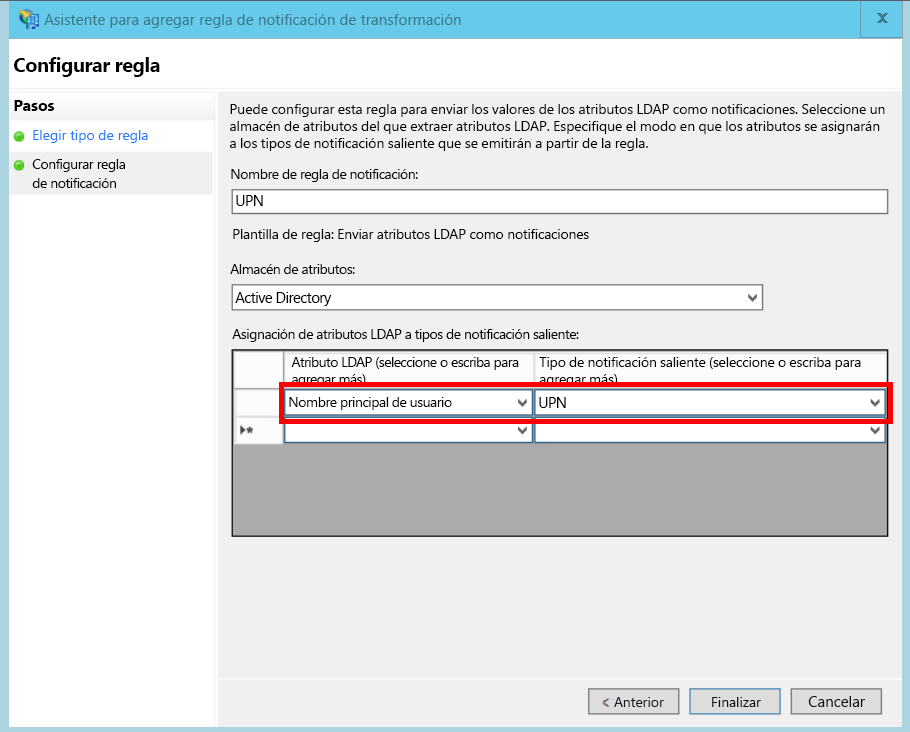

# <a name="federate-with-a-customers-ad-fs"></a><span data-ttu-id="1e438-103">Federación con un servicio AD FS de un cliente</span><span class="sxs-lookup"><span data-stu-id="1e438-103">Federate with a customer's AD FS</span></span>

<span data-ttu-id="1e438-104">Este artículo describe cómo una aplicación SaaS multiinquilino puede admitir la autenticación mediante Servicios de federación de Active Directory (AD FS), para federarse con AD FS de un cliente.</span><span class="sxs-lookup"><span data-stu-id="1e438-104">This article describes how a multi-tenant SaaS application can support authentication via Active Directory Federation Services (AD FS), in order to federate with a customer's AD FS.</span></span>

## <a name="overview"></a><span data-ttu-id="1e438-105">Información general</span><span class="sxs-lookup"><span data-stu-id="1e438-105">Overview</span></span>
<span data-ttu-id="1e438-106">Azure Active Directory (Azure AD) facilita el inicio de sesión de los usuarios desde inquilinos de Azure AD, incluidos los clientes de Office 365 y Dynamics CRM Online.</span><span class="sxs-lookup"><span data-stu-id="1e438-106">Azure Active Directory (Azure AD) makes it easy to sign in users from Azure AD tenants, including Office365 and Dynamics CRM Online customers.</span></span> <span data-ttu-id="1e438-107">Pero, ¿qué sucede con los clientes que usan instalaciones locales de Active Directory en una intranet corporativa?</span><span class="sxs-lookup"><span data-stu-id="1e438-107">But what about customers who use on-premise Active Directory on a corporate intranet?</span></span>

<span data-ttu-id="1e438-108">Es una opción es que estos clientes sincronicen su instalación local de AD con Azure AD mediante [Azure AD Connect].</span><span class="sxs-lookup"><span data-stu-id="1e438-108">One option is for these customers to sync their on-premise AD with Azure AD, using [Azure AD Connect].</span></span> <span data-ttu-id="1e438-109">Sin embargo, algunos clientes quizás no puedan usar este método debido a la directiva de TI corporativa u otras razones.</span><span class="sxs-lookup"><span data-stu-id="1e438-109">However, some customers may be unable to use this approach, due to corporate IT policy or other reasons.</span></span> <span data-ttu-id="1e438-110">En ese caso, otra opción es federar mediante los Servicios de federación de Active Directory (AD FS).</span><span class="sxs-lookup"><span data-stu-id="1e438-110">In that case, another option is to federate through Active Directory Federation Services (AD FS).</span></span>

<span data-ttu-id="1e438-111">Para habilitar este escenario:</span><span class="sxs-lookup"><span data-stu-id="1e438-111">To enable this scenario:</span></span>

* <span data-ttu-id="1e438-112">El cliente debe tener una granja de servidores de ADFS con conexión a Internet.</span><span class="sxs-lookup"><span data-stu-id="1e438-112">The customer must have an Internet-facing AD FS farm.</span></span>
* <span data-ttu-id="1e438-113">El proveedor de SaaS implementa su propia granja de servidores de AD FS.</span><span class="sxs-lookup"><span data-stu-id="1e438-113">The SaaS provider deploys their own AD FS farm.</span></span>
* <span data-ttu-id="1e438-114">El cliente y el proveedor de SaaS deben configurar la [confianza de federación].</span><span class="sxs-lookup"><span data-stu-id="1e438-114">The customer and the SaaS provider must set up [federation trust].</span></span> <span data-ttu-id="1e438-115">Se trata de un proceso manual.</span><span class="sxs-lookup"><span data-stu-id="1e438-115">This is a manual process.</span></span>

<span data-ttu-id="1e438-116">Hay tres roles principales en la relación de confianza:</span><span class="sxs-lookup"><span data-stu-id="1e438-116">There are three main roles in the trust relation:</span></span>

* <span data-ttu-id="1e438-117">El servicio AD FS del cliente es el [asociado de cuentas], responsable de autenticar los usuarios del directorio AD del cliente y de crear los tokens de seguridad con las notificaciones de usuario.</span><span class="sxs-lookup"><span data-stu-id="1e438-117">The customer's AD FS is the [account partner], responsible for authenticating users from the customer's AD, and creating security tokens with user claims.</span></span>
* <span data-ttu-id="1e438-118">El servicio AD FS del proveedor de SaaS es el [asociado de recursos], que confía en el asociado de cuentas y recibe las notificaciones de usuario.</span><span class="sxs-lookup"><span data-stu-id="1e438-118">The SaaS provider's AD FS is the [resource partner], which trusts the account partner and receives the user claims.</span></span>
* <span data-ttu-id="1e438-119">La aplicación se configura como un usuario de confianza (RP) en el servicio AD FS del proveedor de SaaS.</span><span class="sxs-lookup"><span data-stu-id="1e438-119">The application is configured as a relying party (RP) in the SaaS provider's AD FS.</span></span>
  
  

> [!NOTE]
> <span data-ttu-id="1e438-121">En este artículo se da por hecho que la aplicación usa OpenID Connect como protocolo de autenticación.</span><span class="sxs-lookup"><span data-stu-id="1e438-121">In this article, we assume the application uses OpenID connect as the authentication protocol.</span></span> <span data-ttu-id="1e438-122">Otra opción es usar WS-Federation.</span><span class="sxs-lookup"><span data-stu-id="1e438-122">Another option is to use WS-Federation.</span></span>
> 
> <span data-ttu-id="1e438-123">Para OpenID Connect, el proveedor de SaaS debe usar AD FS 2016, que se ejecuta en Windows Server 2016.</span><span class="sxs-lookup"><span data-stu-id="1e438-123">For OpenID Connect, the SaaS provider must use AD FS 2016, running in Windows Server 2016.</span></span> <span data-ttu-id="1e438-124">AD FS 3.0 no admite OpenID Connect.</span><span class="sxs-lookup"><span data-stu-id="1e438-124">AD FS 3.0 does not support OpenID Connect.</span></span>
> 
> <span data-ttu-id="1e438-125">ASP.NET Core no incluye compatibilidad integrada para WS-Federation.</span><span class="sxs-lookup"><span data-stu-id="1e438-125">ASP.NET Core does not include out-of-the-box support for WS-Federation.</span></span>
> 
> 

<span data-ttu-id="1e438-126">Para obtener un ejemplo del uso de WS-Federation con ASP.NET 4, consulte el [ejemplo active-directory-dotnet-webapp-wsfederation][active-directory-dotnet-webapp-wsfederation].</span><span class="sxs-lookup"><span data-stu-id="1e438-126">For an example of using WS-Federation with ASP.NET 4, see the [active-directory-dotnet-webapp-wsfederation sample][active-directory-dotnet-webapp-wsfederation].</span></span>

## <a name="authentication-flow"></a><span data-ttu-id="1e438-127">Flujo de autenticación</span><span class="sxs-lookup"><span data-stu-id="1e438-127">Authentication flow</span></span>
1. <span data-ttu-id="1e438-128">Cuando el usuario hace clic en "iniciar sesión", la aplicación se redirige a un punto de conexión de OpenID Connect en el servicio AD FS del proveedor de SaaS.</span><span class="sxs-lookup"><span data-stu-id="1e438-128">When the user clicks "sign in", the application redirects to an OpenID Connect endpoint on the SaaS provider's AD FS.</span></span>
2. <span data-ttu-id="1e438-129">El usuario escribe su nombre de usuario de la organización ("`alice@corp.contoso.com`").</span><span class="sxs-lookup"><span data-stu-id="1e438-129">The user enters his or her organizational user name ("`alice@corp.contoso.com`").</span></span> <span data-ttu-id="1e438-130">AD FS usa la detección del dominio de inicio para redirigir al servicio AD FS del cliente, donde el usuario escribe sus credenciales.</span><span class="sxs-lookup"><span data-stu-id="1e438-130">AD FS uses home realm discovery to redirect to the customer's AD FS, where the user enters their credentials.</span></span>
3. <span data-ttu-id="1e438-131">El servicio AD FS del cliente envían notificaciones de usuario al servicio AD FS del proveedor de SaaS, mediante WF-Federation (o SAML).</span><span class="sxs-lookup"><span data-stu-id="1e438-131">The customer's AD FS sends user claims to the SaaS provider's AD FS, using WF-Federation (or SAML).</span></span>
4. <span data-ttu-id="1e438-132">Las notificaciones se dirigen desde AD FS a la aplicación mediante OpenID Connect.</span><span class="sxs-lookup"><span data-stu-id="1e438-132">Claims flow from AD FS to the app, using OpenID Connect.</span></span> <span data-ttu-id="1e438-133">Esto requiere una transición de protocolo desde WS-Federation.</span><span class="sxs-lookup"><span data-stu-id="1e438-133">This requires a protocol transition from WS-Federation.</span></span>

## <a name="limitations"></a><span data-ttu-id="1e438-134">Limitaciones</span><span class="sxs-lookup"><span data-stu-id="1e438-134">Limitations</span></span>
<span data-ttu-id="1e438-135">De forma predeterminada, la aplicación de usuario de confianza recibe solo un conjunto fijo de notificaciones disponibles en id_token, que se muestra en la tabla siguiente.</span><span class="sxs-lookup"><span data-stu-id="1e438-135">By default, the relying party application receives only a fixed set of claims available in the id_token, shown in the following table.</span></span> <span data-ttu-id="1e438-136">Con AD FS 2016, puede personalizar el valor de id_token en escenarios de OpenID Connect.</span><span class="sxs-lookup"><span data-stu-id="1e438-136">With AD FS 2016, you can customize the id_token in OpenID Connect scenarios.</span></span> <span data-ttu-id="1e438-137">Para obtener más información, vea [Tokens de identificador personalizado en AD FS](/windows-server/identity/ad-fs/development/customize-id-token-ad-fs-2016).</span><span class="sxs-lookup"><span data-stu-id="1e438-137">For more information, see [Custom ID Tokens in AD FS](/windows-server/identity/ad-fs/development/customize-id-token-ad-fs-2016).</span></span>

| <span data-ttu-id="1e438-138">Notificación</span><span class="sxs-lookup"><span data-stu-id="1e438-138">Claim</span></span> | <span data-ttu-id="1e438-139">DESCRIPCIÓN</span><span class="sxs-lookup"><span data-stu-id="1e438-139">Description</span></span> |
| --- | --- |
| <span data-ttu-id="1e438-140">aud</span><span class="sxs-lookup"><span data-stu-id="1e438-140">aud</span></span> |<span data-ttu-id="1e438-141">Audiencia.</span><span class="sxs-lookup"><span data-stu-id="1e438-141">Audience.</span></span> <span data-ttu-id="1e438-142">La aplicación para que la que se emitieron las notificaciones.</span><span class="sxs-lookup"><span data-stu-id="1e438-142">The application for which the claims were issued.</span></span> |
| <span data-ttu-id="1e438-143">authenticationinstant</span><span class="sxs-lookup"><span data-stu-id="1e438-143">authenticationinstant</span></span> |<span data-ttu-id="1e438-144">[Instante de autenticación].</span><span class="sxs-lookup"><span data-stu-id="1e438-144">[Authentication instant].</span></span> <span data-ttu-id="1e438-145">La hora en que se produjo la autenticación.</span><span class="sxs-lookup"><span data-stu-id="1e438-145">The time at which authentication occurred.</span></span> |
| <span data-ttu-id="1e438-146">c_hash</span><span class="sxs-lookup"><span data-stu-id="1e438-146">c_hash</span></span> |<span data-ttu-id="1e438-147">Valor de código hash.</span><span class="sxs-lookup"><span data-stu-id="1e438-147">Code hash value.</span></span> <span data-ttu-id="1e438-148">Se trata de un valor hash del contenido del token.</span><span class="sxs-lookup"><span data-stu-id="1e438-148">This is a hash of the token contents.</span></span> |
| <span data-ttu-id="1e438-149">exp</span><span class="sxs-lookup"><span data-stu-id="1e438-149">exp</span></span> |<span data-ttu-id="1e438-150">[Fecha de expiración].</span><span class="sxs-lookup"><span data-stu-id="1e438-150">[Expiration time].</span></span> <span data-ttu-id="1e438-151">El momento después del cual el token ya no se aceptará.</span><span class="sxs-lookup"><span data-stu-id="1e438-151">The time after which the token will no longer be accepted.</span></span> |
| <span data-ttu-id="1e438-152">iat</span><span class="sxs-lookup"><span data-stu-id="1e438-152">iat</span></span> |<span data-ttu-id="1e438-153">Emitido a las.</span><span class="sxs-lookup"><span data-stu-id="1e438-153">Issued at.</span></span> <span data-ttu-id="1e438-154">La hora a la que se generó el token.</span><span class="sxs-lookup"><span data-stu-id="1e438-154">The time when the token was issued.</span></span> |
| <span data-ttu-id="1e438-155">iss</span><span class="sxs-lookup"><span data-stu-id="1e438-155">iss</span></span> |<span data-ttu-id="1e438-156">Emisor.</span><span class="sxs-lookup"><span data-stu-id="1e438-156">Issuer.</span></span> <span data-ttu-id="1e438-157">El valor de esta notificación siempre es el servicio AD FS del asociado de recursos.</span><span class="sxs-lookup"><span data-stu-id="1e438-157">The value of this claim is always the resource partner's AD FS.</span></span> |
| <span data-ttu-id="1e438-158">Nombre</span><span class="sxs-lookup"><span data-stu-id="1e438-158">name</span></span> |<span data-ttu-id="1e438-159">Nombre de usuario.</span><span class="sxs-lookup"><span data-stu-id="1e438-159">User name.</span></span> <span data-ttu-id="1e438-160">Ejemplo: `john@corp.fabrikam.com`</span><span class="sxs-lookup"><span data-stu-id="1e438-160">Example: `john@corp.fabrikam.com`</span></span> |
| <span data-ttu-id="1e438-161">nameidentifier</span><span class="sxs-lookup"><span data-stu-id="1e438-161">nameidentifier</span></span> |<span data-ttu-id="1e438-162">[Identificador de nombre].</span><span class="sxs-lookup"><span data-stu-id="1e438-162">[Name identifier].</span></span> <span data-ttu-id="1e438-163">El identificador para el nombre de la entidad para la que se emitió el token.</span><span class="sxs-lookup"><span data-stu-id="1e438-163">The identifier for the name of the entity for which the token was issued.</span></span> |
| <span data-ttu-id="1e438-164">valor de seguridad</span><span class="sxs-lookup"><span data-stu-id="1e438-164">nonce</span></span> |<span data-ttu-id="1e438-165">Nonce de sesión.</span><span class="sxs-lookup"><span data-stu-id="1e438-165">Session nonce.</span></span> <span data-ttu-id="1e438-166">Un valor único generado por AD FS para ayudar a evitar ataques de reproducción.</span><span class="sxs-lookup"><span data-stu-id="1e438-166">A unique value generated by AD FS to help prevent replay attacks.</span></span> |
| <span data-ttu-id="1e438-167">upn</span><span class="sxs-lookup"><span data-stu-id="1e438-167">upn</span></span> |<span data-ttu-id="1e438-168">Nombre principal de usuario (UPN).</span><span class="sxs-lookup"><span data-stu-id="1e438-168">User principal name (UPN).</span></span> <span data-ttu-id="1e438-169">Ejemplo: `john@corp.fabrikam.com`</span><span class="sxs-lookup"><span data-stu-id="1e438-169">Example: `john@corp.fabrikam.com`</span></span> |
| <span data-ttu-id="1e438-170">pwd_exp</span><span class="sxs-lookup"><span data-stu-id="1e438-170">pwd_exp</span></span> |<span data-ttu-id="1e438-171">Período de expiración de contraseña.</span><span class="sxs-lookup"><span data-stu-id="1e438-171">Password expiration period.</span></span> <span data-ttu-id="1e438-172">El número de segundos hasta que caduca la contraseña del usuario o un secreto de autenticación similar,</span><span class="sxs-lookup"><span data-stu-id="1e438-172">The number of seconds until the user's password or a similar authentication secret, such as a PIN.</span></span> <span data-ttu-id="1e438-173">como un PIN.</span><span class="sxs-lookup"><span data-stu-id="1e438-173">expires.</span></span> |

> [!NOTE]
> <span data-ttu-id="1e438-174">La notificación "iss" contiene el AD FS del asociado (esta notificación normalmente identificará al proveedor de SaaS como emisor).</span><span class="sxs-lookup"><span data-stu-id="1e438-174">The "iss" claim contains the AD FS of the partner (typically, this claim will identify the SaaS provider as the issuer).</span></span> <span data-ttu-id="1e438-175">No identifica el AD FS del cliente.</span><span class="sxs-lookup"><span data-stu-id="1e438-175">It does not identify the customer's AD FS.</span></span> <span data-ttu-id="1e438-176">Puede encontrar el dominio del cliente como parte de UPN.</span><span class="sxs-lookup"><span data-stu-id="1e438-176">You can find the customer's domain as part of the UPN.</span></span>
> 
> 

<span data-ttu-id="1e438-177">El resto de este artículo describe cómo configurar la relación de confianza entre el usuario de confianza (la aplicación) y el asociado de cuentas (el cliente).</span><span class="sxs-lookup"><span data-stu-id="1e438-177">The rest of this article describes how to set up the trust relationship between the RP (the app) and the account partner (the customer).</span></span>

## <a name="ad-fs-deployment"></a><span data-ttu-id="1e438-178">Implementación de AD FS</span><span class="sxs-lookup"><span data-stu-id="1e438-178">AD FS deployment</span></span>
<span data-ttu-id="1e438-179">El proveedor de SaaS puede implementar AD FS en máquinas virtuales de Azure o locales.</span><span class="sxs-lookup"><span data-stu-id="1e438-179">The SaaS provider can deploy AD FS either on-premise or on Azure VMs.</span></span> <span data-ttu-id="1e438-180">Por motivos de seguridad y disponibilidad, son importantes las siguientes directrices:</span><span class="sxs-lookup"><span data-stu-id="1e438-180">For security and availability, the following guidelines are important:</span></span>

* <span data-ttu-id="1e438-181">Implemente al menos dos servidores de AD FS y dos servidores proxy de AD FS para lograr la mejor disponibilidad del servicio AD FS.</span><span class="sxs-lookup"><span data-stu-id="1e438-181">Deploy at least two AD FS servers and two AD FS proxy servers to achieve the best availability of the AD FS service.</span></span>
* <span data-ttu-id="1e438-182">Los controladores de dominio y los servidores de AD FS nunca deben exponerse directamente a Internet y deben estar en una red virtual con acceso directo a ellos.</span><span class="sxs-lookup"><span data-stu-id="1e438-182">Domain controllers and AD FS servers should never be exposed directly to the Internet and should be in a virtual network with direct access to them.</span></span>
* <span data-ttu-id="1e438-183">Se deben usar servidores proxy de aplicación web (antes, servidores proxy de AD FS) para publicar servidores de AD FS en Internet.</span><span class="sxs-lookup"><span data-stu-id="1e438-183">Web application proxies (previously AD FS proxies) must be used to publish AD FS servers to the Internet.</span></span>

<span data-ttu-id="1e438-184">Para configurar una topología similar en Azure, es necesario usar redes virtuales, NSG, máquinas virtuales de VM y conjuntos de disponibilidad.</span><span class="sxs-lookup"><span data-stu-id="1e438-184">To set up a similar topology in Azure requires the use of Virtual networks, NSG’s, azure VM’s and availability sets.</span></span> <span data-ttu-id="1e438-185">Para más información, consulte [Directrices para implementar Windows Server Active Directory en Azure Virtual Machines][active-directory-on-azure].</span><span class="sxs-lookup"><span data-stu-id="1e438-185">For more details, see [Guidelines for Deploying Windows Server Active Directory on Azure Virtual Machines][active-directory-on-azure].</span></span>

## <a name="configure-openid-connect-authentication-with-ad-fs"></a><span data-ttu-id="1e438-186">Configuración de la autenticación de OpenID Connect con AD FS</span><span class="sxs-lookup"><span data-stu-id="1e438-186">Configure OpenID Connect authentication with AD FS</span></span>
<span data-ttu-id="1e438-187">El proveedor de SaaS debe habilitar OpenID Connect entre la aplicación y AD FS.</span><span class="sxs-lookup"><span data-stu-id="1e438-187">The SaaS provider must enable OpenID Connect between the application and AD FS.</span></span> <span data-ttu-id="1e438-188">Para ello, agregue un grupo de aplicaciones a AD FS.</span><span class="sxs-lookup"><span data-stu-id="1e438-188">To do so, add an application group in AD FS.</span></span>  <span data-ttu-id="1e438-189">Encontrará instrucciones detalladas en esta [entrada de blog], en “Setting up a Web App for OpenId Connect sign in AD FS” (Configuración de una aplicación web para el inicio de sesión de OpenId Connect en AD FS).</span><span class="sxs-lookup"><span data-stu-id="1e438-189">You can find detailed instructions in this [blog post], under " Setting up a Web App for OpenId Connect sign in AD FS."</span></span> 

<span data-ttu-id="1e438-190">Después, configure el middleware de OpenID Connect.</span><span class="sxs-lookup"><span data-stu-id="1e438-190">Next, configure the OpenID Connect middleware.</span></span> <span data-ttu-id="1e438-191">El punto de conexión de metadatos es `https://domain/adfs/.well-known/openid-configuration`, donde domain es el dominio del servicio AD FS del proveedor de SaaS.</span><span class="sxs-lookup"><span data-stu-id="1e438-191">The metadata endpoint is `https://domain/adfs/.well-known/openid-configuration`, where domain is the SaaS provider's AD FS domain.</span></span>

<span data-ttu-id="1e438-192">Normalmente se puede combinar con otros puntos de conexión de OpenID Connect (como AAD).</span><span class="sxs-lookup"><span data-stu-id="1e438-192">Typically you might combine this with other OpenID Connect endpoints (such as AAD).</span></span> <span data-ttu-id="1e438-193">Necesitará dos botones de inicio de sesión diferentes o alguna otra forma de distinguirlos, para enviar al usuario al punto de conexión de autenticación correcto.</span><span class="sxs-lookup"><span data-stu-id="1e438-193">You'll need two different sign-in buttons or some other way to distinguish them, so that the user is sent to the correct authentication endpoint.</span></span>

## <a name="configure-the-ad-fs-resource-partner"></a><span data-ttu-id="1e438-194">Configuración del asociado de recursos de AD FS</span><span class="sxs-lookup"><span data-stu-id="1e438-194">Configure the AD FS Resource Partner</span></span>
<span data-ttu-id="1e438-195">El proveedor de SaaS debe hacer lo siguiente para cada cliente que desee conectarse mediante AD FS:</span><span class="sxs-lookup"><span data-stu-id="1e438-195">The SaaS provider must do the following for each customer that wants to connect via ADFS:</span></span>

1. <span data-ttu-id="1e438-196">Agregar confianza para el proveedor de notificaciones.</span><span class="sxs-lookup"><span data-stu-id="1e438-196">Add a claims provider trust.</span></span>
2. <span data-ttu-id="1e438-197">Agregar reglas de notificaciones.</span><span class="sxs-lookup"><span data-stu-id="1e438-197">Add claims rules.</span></span>
3. <span data-ttu-id="1e438-198">Habilitar la detección del dominio principal.</span><span class="sxs-lookup"><span data-stu-id="1e438-198">Enable home-realm discovery.</span></span>

<span data-ttu-id="1e438-199">Estos son los pasos con más detalle.</span><span class="sxs-lookup"><span data-stu-id="1e438-199">Here are the steps in more detail.</span></span>

### <a name="add-the-claims-provider-trust"></a><span data-ttu-id="1e438-200">Adición de confianza para el proveedor de notificaciones</span><span class="sxs-lookup"><span data-stu-id="1e438-200">Add the claims provider trust</span></span>
1. <span data-ttu-id="1e438-201">En el Administrador del servidor, haga clic en **Herramientas** y, luego, seleccione **Administración de AD FS**.</span><span class="sxs-lookup"><span data-stu-id="1e438-201">In Server Manager, click **Tools**, and then select **AD FS Management**.</span></span>
2. <span data-ttu-id="1e438-202">En el árbol de consola, bajo **AD FS**, haga clic en **Confianzas de proveedores de notificaciones**.</span><span class="sxs-lookup"><span data-stu-id="1e438-202">In the console tree, under **AD FS**, right click **Claims Provider Trusts**.</span></span> <span data-ttu-id="1e438-203">Seleccione **Agregar confianza de proveedor de notificaciones**.</span><span class="sxs-lookup"><span data-stu-id="1e438-203">Select **Add Claims Provider Trust**.</span></span>
3. <span data-ttu-id="1e438-204">Haga clic en **Iniciar** para iniciar el asistente.</span><span class="sxs-lookup"><span data-stu-id="1e438-204">Click **Start** to start the wizard.</span></span>
4. <span data-ttu-id="1e438-205">Seleccione la opción "Importar datos acerca del proveedor de notificaciones publicado en línea o en una red local".</span><span class="sxs-lookup"><span data-stu-id="1e438-205">Select the option "Import data about the claims provider published online or on a local network".</span></span> <span data-ttu-id="1e438-206">Escriba el identificador URI del punto de conexión de metadatos de federación del cliente.</span><span class="sxs-lookup"><span data-stu-id="1e438-206">Enter the URI of the customer's federation metadata endpoint.</span></span> <span data-ttu-id="1e438-207">(Ejemplo: `https://contoso.com/FederationMetadata/2007-06/FederationMetadata.xml`). Tendrá que obtenerlo del cliente.</span><span class="sxs-lookup"><span data-stu-id="1e438-207">(Example: `https://contoso.com/FederationMetadata/2007-06/FederationMetadata.xml`.) You will need to get this from the customer.</span></span>
5. <span data-ttu-id="1e438-208">Complete el asistente usando las opciones predeterminadas.</span><span class="sxs-lookup"><span data-stu-id="1e438-208">Complete the wizard using the default options.</span></span>

### <a name="edit-claims-rules"></a><span data-ttu-id="1e438-209">Edición de reglas de notificaciones</span><span class="sxs-lookup"><span data-stu-id="1e438-209">Edit claims rules</span></span>
1. <span data-ttu-id="1e438-210">Haga clic con el botón derecho en la confianza de proveedor de notificaciones recién agregada y seleccione **Editar reglas de notificaciones**.</span><span class="sxs-lookup"><span data-stu-id="1e438-210">Right-click the newly added claims provider trust, and select **Edit Claims Rules**.</span></span>
2. <span data-ttu-id="1e438-211">Haga clic en **Agregar regla**.</span><span class="sxs-lookup"><span data-stu-id="1e438-211">Click **Add Rule**.</span></span>
3. <span data-ttu-id="1e438-212">Seleccione "Pasar a través o filtrar una notificación entrante" y haga clic en **Siguiente**.</span><span class="sxs-lookup"><span data-stu-id="1e438-212">Select "Pass Through or Filter an Incoming Claim" and click **Next**.</span></span>
   <span data-ttu-id="1e438-213"></span><span class="sxs-lookup"><span data-stu-id="1e438-213"></span></span>
4. <span data-ttu-id="1e438-214">Escriba un nombre para la regla.</span><span class="sxs-lookup"><span data-stu-id="1e438-214">Enter a name for the rule.</span></span>
5. <span data-ttu-id="1e438-215">En "Tipo de notificación entrante", seleccione **UPN**.</span><span class="sxs-lookup"><span data-stu-id="1e438-215">Under "Incoming claim type", select **UPN**.</span></span>
6. <span data-ttu-id="1e438-216">Seleccione "Pasar todos los valores de notificación".</span><span class="sxs-lookup"><span data-stu-id="1e438-216">Select "Pass through all claim values".</span></span>
   <span data-ttu-id="1e438-217"></span><span class="sxs-lookup"><span data-stu-id="1e438-217"></span></span>
7. <span data-ttu-id="1e438-218">Haga clic en **Finalizar**</span><span class="sxs-lookup"><span data-stu-id="1e438-218">Click **Finish**.</span></span>
8. <span data-ttu-id="1e438-219">Repita los pasos 2 a 7 y especifique **Tipo de delimitador de notificación** para el tipo de notificación entrante.</span><span class="sxs-lookup"><span data-stu-id="1e438-219">Repeat steps 2 - 7, and specify **Anchor Claim Type** for the incoming claim type.</span></span>
9. <span data-ttu-id="1e438-220">Haga clic en **Aceptar** para completar el asistente.</span><span class="sxs-lookup"><span data-stu-id="1e438-220">Click **OK** to complete the wizard.</span></span>

### <a name="enable-home-realm-discovery"></a><span data-ttu-id="1e438-221">Habilitación de la detección del dominio principal</span><span class="sxs-lookup"><span data-stu-id="1e438-221">Enable home-realm discovery</span></span>
<span data-ttu-id="1e438-222">Ejecute el siguiente script de PowerShell:</span><span class="sxs-lookup"><span data-stu-id="1e438-222">Run the following PowerShell script:</span></span>

```
Set-ADFSClaimsProviderTrust -TargetName "name" -OrganizationalAccountSuffix @("suffix")
```

<span data-ttu-id="1e438-223">donde "name" es el nombre descriptivo de la confianza de proveedor de notificaciones, y "suffix" es el sufijo UPN del directorio AD del cliente (ejemplo, "corp.fabrikam.com").</span><span class="sxs-lookup"><span data-stu-id="1e438-223">where "name" is the friendly name of the claims provider trust, and "suffix" is the UPN suffix for the customer's AD (example, "corp.fabrikam.com").</span></span>

<span data-ttu-id="1e438-224">Con esta configuración, los usuarios finales pueden escribir sus cuentas de la organización y AD FS selecciona automáticamente el proveedor de notificaciones correspondiente.</span><span class="sxs-lookup"><span data-stu-id="1e438-224">With this configuration, end users can type in their organizational account, and AD FS automatically selects the corresponding claims provider.</span></span> <span data-ttu-id="1e438-225">Consulte [Personalizar las páginas de inicio de sesión de AD FS], en la sección "Configuración del proveedor de identidades para utilizar ciertos sufijos de correo electrónico".</span><span class="sxs-lookup"><span data-stu-id="1e438-225">See [Customizing the AD FS Sign-in Pages], under the section "Configure Identity Provider to use certain email suffixes".</span></span>

## <a name="configure-the-ad-fs-account-partner"></a><span data-ttu-id="1e438-226">Configuración del asociado de cuentas de AD FS</span><span class="sxs-lookup"><span data-stu-id="1e438-226">Configure the AD FS Account Partner</span></span>
<span data-ttu-id="1e438-227">Los usuarios deben hacer lo siguiente:</span><span class="sxs-lookup"><span data-stu-id="1e438-227">The customer must do the following:</span></span>

1. <span data-ttu-id="1e438-228">Agregar una confianza para usuario de confianza.</span><span class="sxs-lookup"><span data-stu-id="1e438-228">Add a relying party (RP) trust.</span></span>
2. <span data-ttu-id="1e438-229">Agregar reglas de notificaciones.</span><span class="sxs-lookup"><span data-stu-id="1e438-229">Adds claims rules.</span></span>

### <a name="add-the-rp-trust"></a><span data-ttu-id="1e438-230">Adición de confianzas para usuarios de confianza</span><span class="sxs-lookup"><span data-stu-id="1e438-230">Add the RP trust</span></span>
1. <span data-ttu-id="1e438-231">En el Administrador del servidor, haga clic en **Herramientas** y, luego, seleccione **Administración de AD FS**.</span><span class="sxs-lookup"><span data-stu-id="1e438-231">In Server Manager, click **Tools**, and then select **AD FS Management**.</span></span>
2. <span data-ttu-id="1e438-232">En el árbol de consola, bajo **AD FS**, haga clic en **Veracidades de usuarios de confianza**.</span><span class="sxs-lookup"><span data-stu-id="1e438-232">In the console tree, under **AD FS**, right click **Relying Party Trusts**.</span></span> <span data-ttu-id="1e438-233">Seleccione **Agregar confianza para usuario de confianza**.</span><span class="sxs-lookup"><span data-stu-id="1e438-233">Select **Add Relying Party Trust**.</span></span>
3. <span data-ttu-id="1e438-234">Seleccione **Compatible con notificaciones** y haga clic en **Iniciar**.</span><span class="sxs-lookup"><span data-stu-id="1e438-234">Select **Claims Aware** and click **Start**.</span></span>
4. <span data-ttu-id="1e438-235">En la página **Seleccionar origen de datos** , seleccione la opción "Importar datos acerca del proveedor de notificaciones publicado en línea o en una red local".</span><span class="sxs-lookup"><span data-stu-id="1e438-235">On the **Select Data Source** page, select the option "Import data about the claims provider published online or on a local network".</span></span> <span data-ttu-id="1e438-236">Escriba el identificador URI del punto de conexión de metadatos de federación del proveedor de SaaS.</span><span class="sxs-lookup"><span data-stu-id="1e438-236">Enter the URI of the SaaS provider's federation metadata endpoint.</span></span>
   <span data-ttu-id="1e438-237"></span><span class="sxs-lookup"><span data-stu-id="1e438-237"></span></span>
5. <span data-ttu-id="1e438-238">En la página **Especificar nombre para mostrar** , escriba cualquier nombre.</span><span class="sxs-lookup"><span data-stu-id="1e438-238">On the **Specify Display Name** page, enter any name.</span></span>
6. <span data-ttu-id="1e438-239">En la página **Elegir la directiva de control de acceso** , elija una directiva.</span><span class="sxs-lookup"><span data-stu-id="1e438-239">On the **Choose Access Control Policy** page, choose a policy.</span></span> <span data-ttu-id="1e438-240">Puede dar permiso a todos los usuarios de la organización o elegir un grupo de seguridad específico.</span><span class="sxs-lookup"><span data-stu-id="1e438-240">You could permit everyone in the organization, or choose a specific security group.</span></span>
   <span data-ttu-id="1e438-241"></span><span class="sxs-lookup"><span data-stu-id="1e438-241"></span></span>
7. <span data-ttu-id="1e438-242">Escriba los parámetros necesarios en el cuadro **Directiva**.</span><span class="sxs-lookup"><span data-stu-id="1e438-242">Enter any parameters required in the **Policy** box.</span></span>
8. <span data-ttu-id="1e438-243">Haga clic en **Siguiente** para completar el asistente.</span><span class="sxs-lookup"><span data-stu-id="1e438-243">Click **Next** to complete the wizard.</span></span>

### <a name="add-claims-rules"></a><span data-ttu-id="1e438-244">Adición de reglas de notificaciones</span><span class="sxs-lookup"><span data-stu-id="1e438-244">Add claims rules</span></span>
1. <span data-ttu-id="1e438-245">Haga clic con el botón derecho en la confianza para usuario de confianza recién agregada y seleccione **Editar directiva de emisión de notificación**.</span><span class="sxs-lookup"><span data-stu-id="1e438-245">Right-click the newly added relying party trust, and select **Edit Claim Issuance Policy**.</span></span>
2. <span data-ttu-id="1e438-246">Haga clic en **Agregar regla**.</span><span class="sxs-lookup"><span data-stu-id="1e438-246">Click **Add Rule**.</span></span>
3. <span data-ttu-id="1e438-247">Seleccione "Enviar atributos LDAP como notificaciones" y haga clic en **Siguiente**.</span><span class="sxs-lookup"><span data-stu-id="1e438-247">Select "Send LDAP Attributes as Claims" and click **Next**.</span></span>
4. <span data-ttu-id="1e438-248">Escriba un nombre para la regla, por ejemplo, “UPN”.</span><span class="sxs-lookup"><span data-stu-id="1e438-248">Enter a name for the rule, such as "UPN".</span></span>
5. <span data-ttu-id="1e438-249">En el **almacén de atributos**, seleccione **Active Directory**.</span><span class="sxs-lookup"><span data-stu-id="1e438-249">Under **Attribute store**, select **Active Directory**.</span></span>
   <span data-ttu-id="1e438-250"></span><span class="sxs-lookup"><span data-stu-id="1e438-250"></span></span>
6. <span data-ttu-id="1e438-251">En la sección **Asignación de atributos LDAP** :</span><span class="sxs-lookup"><span data-stu-id="1e438-251">In the **Mapping of LDAP attributes** section:</span></span>
   * <span data-ttu-id="1e438-252">En **Atributo LDAP**, seleccione **User-Principal-Name**.</span><span class="sxs-lookup"><span data-stu-id="1e438-252">Under **LDAP Attribute**, select **User-Principal-Name**.</span></span>
   * <span data-ttu-id="1e438-253">En **Tipo de notificación saliente**, seleccione **UPN**.</span><span class="sxs-lookup"><span data-stu-id="1e438-253">Under **Outgoing Claim Type**, select **UPN**.</span></span>
     <span data-ttu-id="1e438-254"></span><span class="sxs-lookup"><span data-stu-id="1e438-254"></span></span>
7. <span data-ttu-id="1e438-255">Haga clic en **Finalizar**</span><span class="sxs-lookup"><span data-stu-id="1e438-255">Click **Finish**.</span></span>
8. <span data-ttu-id="1e438-256">Haga clic en **Agregar regla** de nuevo.</span><span class="sxs-lookup"><span data-stu-id="1e438-256">Click **Add Rule** again.</span></span>
9. <span data-ttu-id="1e438-257">Seleccione “Enviar notificaciones con una regla personalizada” y haga clic en **No**.</span><span class="sxs-lookup"><span data-stu-id="1e438-257">Select "Send Claims Using a Custom Rule" and click **Next**.</span></span>
10. <span data-ttu-id="1e438-258">Escriba un nombre para la regla, por ejemplo, "Delimitar tipo de notificación".</span><span class="sxs-lookup"><span data-stu-id="1e438-258">Enter a name for the rule, such as "Anchor Claim Type".</span></span>
11. <span data-ttu-id="1e438-259">En **Regla personalizada**, escriba lo siguiente:</span><span class="sxs-lookup"><span data-stu-id="1e438-259">Under **Custom rule**, enter the following:</span></span>
    
    ```
    EXISTS([Type == "http://schemas.microsoft.com/ws/2014/01/identity/claims/anchorclaimtype"])=>
    issue (Type = "http://schemas.microsoft.com/ws/2014/01/identity/claims/anchorclaimtype",
          Value = "http://schemas.xmlsoap.org/ws/2005/05/identity/claims/upn");
    ```
    
    <span data-ttu-id="1e438-260">Esta regla emite una notificación de tipo `anchorclaimtype`.</span><span class="sxs-lookup"><span data-stu-id="1e438-260">This rule issues a claim of type `anchorclaimtype`.</span></span> <span data-ttu-id="1e438-261">La notificación indica al usuario de confianza que use el UPN como identificador inmutable del usuario.</span><span class="sxs-lookup"><span data-stu-id="1e438-261">The claim tells the relying party to use UPN as the user's immutable ID.</span></span>
12. <span data-ttu-id="1e438-262">Haga clic en **Finalizar**</span><span class="sxs-lookup"><span data-stu-id="1e438-262">Click **Finish**.</span></span>
13. <span data-ttu-id="1e438-263">Haga clic en **Aceptar** para completar el asistente.</span><span class="sxs-lookup"><span data-stu-id="1e438-263">Click **OK** to complete the wizard.</span></span>


<!-- Links -->
[Azure AD Connect]: /azure/active-directory/hybrid/whatis-hybrid-identity
[confianza de federación]: https://technet.microsoft.com/library/cc770993(v=ws.11).aspx
[federation trust]: https://technet.microsoft.com/library/cc770993(v=ws.11).aspx
[asociado de cuentas]: https://technet.microsoft.com/library/cc731141(v=ws.11).aspx
[account partner]: https://technet.microsoft.com/library/cc731141(v=ws.11).aspx
[asociado de recursos]: https://technet.microsoft.com/library/cc731141(v=ws.11).aspx
[resource partner]: https://technet.microsoft.com/library/cc731141(v=ws.11).aspx
[Instante de autenticación]: https://msdn.microsoft.com/library/system.security.claims.claimtypes.authenticationinstant%28v=vs.110%29.aspx
[Authentication instant]: https://msdn.microsoft.com/library/system.security.claims.claimtypes.authenticationinstant%28v=vs.110%29.aspx
[Fecha de expiración]: https://tools.ietf.org/html/draft-ietf-oauth-json-web-token-25#section-4.1.
[Expiration time]: https://tools.ietf.org/html/draft-ietf-oauth-json-web-token-25#section-4.1.
[Identificador de nombre]: https://msdn.microsoft.com/library/system.security.claims.claimtypes.nameidentifier(v=vs.110).aspx
[Name identifier]: https://msdn.microsoft.com/library/system.security.claims.claimtypes.nameidentifier(v=vs.110).aspx
[active-directory-on-azure]: https://msdn.microsoft.com/library/azure/jj156090.aspx
[entrada de blog]: https://www.cloudidentity.com/blog/2015/08/21/OPENID-CONNECT-WEB-SIGN-ON-WITH-ADFS-IN-WINDOWS-SERVER-2016-TP3/
[blog post]: https://www.cloudidentity.com/blog/2015/08/21/OPENID-CONNECT-WEB-SIGN-ON-WITH-ADFS-IN-WINDOWS-SERVER-2016-TP3/
[Personalizar las páginas de inicio de sesión de AD FS]: https://technet.microsoft.com/library/dn280950.aspx
[Customizing the AD FS Sign-in Pages]: https://technet.microsoft.com/library/dn280950.aspx
[sample application]: https://github.com/mspnp/multitenant-saas-guidance
[client assertion]: client-assertion.md
[active-directory-dotnet-webapp-wsfederation]: https://github.com/Azure-Samples/active-directory-dotnet-webapp-wsfederation
